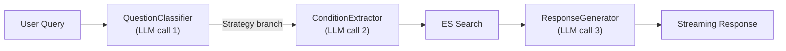
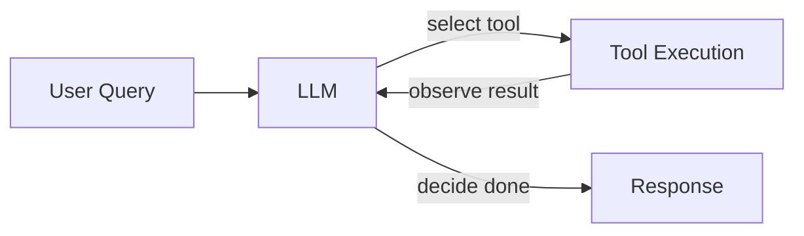
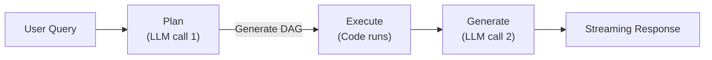
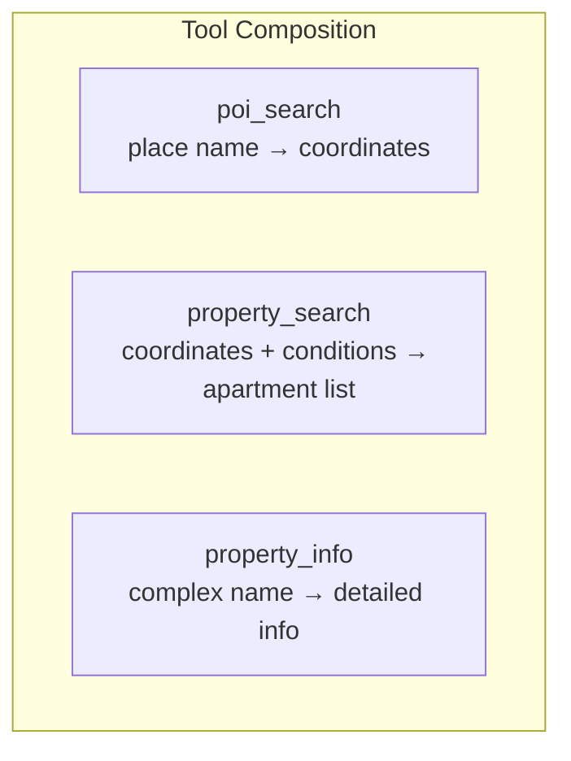
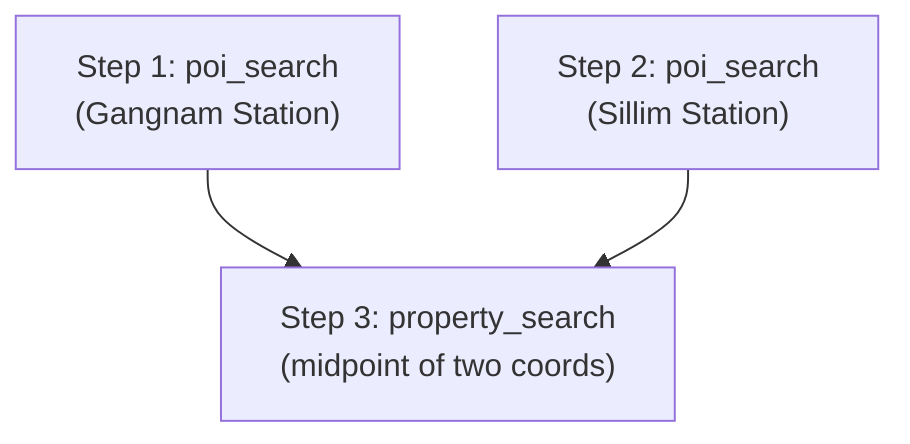
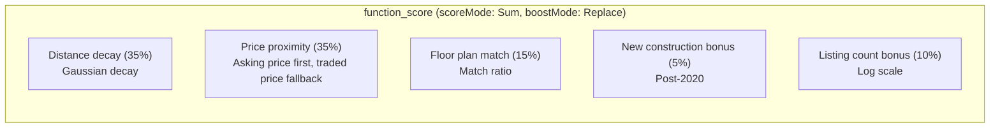

Hi, I'm Jeongil Jeong, a backend developer at a proptech platform.

It seems like many companies these days are thinking hard about how to integrate AI into their services in ways that deliver real value.

Our company is no different. We've been continuously exploring how we could use AI to provide a better experience for our users.

Since we operate in the real estate domain, we naturally ended up building an AI feature that recommends properties based on natural language queries.

Users type in their conditions in plain language, and the system recommends matching apartments. Here's what the service looks like:


In this post, I'd like to share how I built this feature — the technical challenges I faced and the decisions I made along the way.

## It Started as a Fixed Pipeline RAG

When I joined the team, our AI service was built on a typical RAG pipeline.



When a user asked a question, the `QuestionClassifier` classified the intent, branched via the Strategy pattern, the `ConditionExtractor` extracted search conditions, Elasticsearch retrieved results, and the `ResponseGenerator` generated a natural language response. Three LLM calls in total.

This structure worked to some extent. But as we operated it, we ran into several limitations. First, the documents in the Vector DB were just basic legal reference materials about real estate.

So it couldn't handle queries like "Find me a new apartment near Songdo Station, around 30 pyeong, under 1 billion won, with at least 500 units." In these cases, we'd have to rely entirely on the LLM for a raw response, which created two problems.

LLMs available through the platform (e.g., GPT models, Gemini models) couldn't reliably understand and combine regional information like "near Songdo Station," floor plan info like "30 pyeong," price constraints like "under 1 billion won," unit count requirements like "over 500 units," and "new construction" — all at once. Even if the LLM had some domain knowledge, accurately applying that knowledge to generate a useful response was a separate challenge.

Even if the LLM could somehow generate a relevant response, connecting that response to actual property listings in our service — linking to specific detail pages — was another hard problem entirely.

And the biggest issue was that **the pipeline was fixed**. Rather than letting the LLM choose which tools to use, our system called the LLM at predetermined points — only for inference or response generation. So for complex queries like "Find apartments between Gangnam Station and Sillim Station," there was no way to handle them.

Processing such a query requires multiple steps: look up the coordinates for Gangnam Station, look up the coordinates for Sillim Station, compute the midpoint, then search around that midpoint. In a fixed pipeline, you'd have to implement each combination as a separate strategy — a clear limitation.

## Agent Loop vs Planned Tool Use — Which to Choose?

Because of these limitations, I decided the architecture needed to change. I wanted to move away from a fixed pipeline to a structure where the LLM selects and executes tools. But at that point, I was torn between two approaches.

### Full Agent Loop

The first was the **Agent Loop** pattern that's been getting a lot of attention lately.



The LLM executes a tool, observes the result, decides the next action, executes another tool... repeating this loop until the LLM judges the result is "sufficient."

Concretely, processing "apartments near Gangnam Station, 30 pyeong" with an Agent Loop would look like:

```
[LLM call 1] "I need Gangnam Station's coordinates" → execute poi_search("Gangnam Station")
[LLM call 2] Observe result: {lat: 37.49, lon: 127.02} → "Let me search with these coords" → execute property_search
[LLM call 3] Observe result: 15 apartments → "Got results, let me respond" → generate response
```

Three LLM calls. But even with the same question, the LLM might make different decisions. It could decide "too many results, let me narrow the conditions" and search again, or "too few results, let me widen the radius" and add another loop. Unpredictable loop counts mean unpredictable response times and costs.

Every additional LLM call adds latency — there's no getting around that.

### Planned Tool Use

The second approach was **Planned Tool Use**. I was inspired by Anthropic's ["Building Effective Agents"](https://www.anthropic.com/engineering/building-effective-agents) guide, whose core principle is **"minimum autonomy"** — grant only the minimum autonomy needed.



The LLM generates the entire execution plan at once, and code executes that plan deterministically. For the same "apartments near Gangnam Station, 30 pyeong":

```
[LLM call 1] Plan: "poi_search(Gangnam Station) → property_search with those coords" (DAG generated at once)
[Code] DAG execution: poi_search → property_search (no LLM involvement, code executes)
[LLM call 1] Generate: response based on results
```

Only 2 LLM calls. And since we control the flow, it's always guaranteed to be exactly 2. No variation in loop counts for the same query.

### Why I Didn't Choose Agent Loop

I ultimately chose Planned Tool Use.

When a user says "apartments near Gangnam Station, 30 pyeong," the required tools and their order are mostly predetermined. Look up Gangnam Station's coordinates, then search nearby with matching conditions. This was a domain where the LLM didn't need to deliberate "what should I do next?" at each step.

I believe Agent Loops are powerful when **you need to change your approach based on tool execution results**. For instance, a code-generating AI might need to think "there's a compilation error, let me fix the code" — where the next action depends on the result. But real estate search isn't like that. "I found Gangnam Station's coordinates, but I don't like them, let me find different coordinates" — that situation simply doesn't arise.

Given the nature of real estate property search, **once you plan, execution is deterministic in most cases**. So I judged that the predictability of Planned Tool Use was more important than the flexibility of an Agent.

Of course, this was simply the right choice for our domain. What "minimum autonomy" ultimately means is **the minimum autonomy suited to your domain**. Arguing that Agent is better or Planned Tool Use is better without considering domain characteristics is meaningless, I think.

Latency reduction was also important. Agent Loops get slower as loops get longer, while Planned Tool Use can guarantee relatively consistent latency.

Since responding to users as quickly as possible mattered, this was another factor in choosing Planned Tool Use.

## Turning Natural Language into Structured Parameters


I think the part where domain knowledge matters most in the Planned Tool Use structure is the **Plan prompt**. The LLM needs to understand the user's natural language and convert it into a structured execution plan — and how you define those conversion rules directly impacts recommendation quality.

For example, when a user says "apartments in the 500 million won range," how should that be converted to parameters?

In Korean, "5억대" (500 million range) means 500M–590M won. In 10,000-won units, that's `priceMin: 50000, priceMax: 59999`. But "30억대" (3 billion range) means 3B–3.99B. The same "~대" suffix, but the range differs by order of magnitude.

These conversion rules had to be explicitly defined in the system prompt.

```
## Price conversion rules (in 10,000 won units):
- "5억대" (500M range)  → priceMin: 50000, priceMax: 59999   (500M–590M)
- "30억대" (3B range) → priceMin: 300000, priceMax: 399999  (3B–3.99B)
- "2억~3억" (200M–300M) → priceMin: 20000, priceMax: 30000
- "15억 정도" (about 1.5B) → priceMin: 135000, priceMax: 165000 (±10%)
- "30억 이하" (under 3B) → priceMin: null, priceMax: 300000

## Floor plan conversion rules:
- "30평대" (30-pyeong range) → areaMin: 30, areaMax: 39
- "30평 정도" (about 30 pyeong) → areaMin: 27, areaMax: 33
- "30평" (exactly 30) → areaMin: 30, areaMax: 30
```

Initially, I didn't put these rules in the prompt and let the LLM figure out the conversions on its own. You can probably guess the results. It would sometimes convert "5억대" to 500M–990M, or convert "30평대" to exactly 30–30. The LLM just didn't understand Korean real estate terminology precisely.

The issue wasn't that the LLM couldn't understand Korean itself — it was that it couldn't accurately infer what users meant by expressions like "5억대." This was something the prompt had to teach.

On the other hand, there were domain areas where LLM reasoning was genuinely needed. For example, **inferring floor plan from family composition**.

```
## When floor plan/room count isn't specified:
If the user doesn't directly state the floor plan or room count but provides hints
about family composition, lifestyle, etc., use your real estate common sense to determine
appropriate ranges and include them in params.
Example: "newlyweds" → determine appropriate floor plan/room count yourself
Record your reasoning in systemContext.
```

When someone says "We're newlyweds looking for a lease near Gangnam Station," the LLM converts it to `areaMin: 15, areaMax: 25, roomCountMin: 2, roomCountMax: 3, dealType: LEASE` and records its reasoning as `systemContext: "Small to mid-size for newlyweds, 2-3 rooms recommended"`.

Of course, this inference didn't work well from the start. When someone said "family of four with two kids," it would sometimes recommend 20-pyeong units. For a family of four, 30+ pyeong is typical. I gradually improved accuracy by adding these edge cases as few-shot examples in the prompt.

What I learned from this was that clear rules like "5억대" should be defined in the prompt, while contextual inference should be left to the LLM. But the boundary between the two was fuzzier than expected, and I think this was the most challenging part of prompt design.

## What Tools Were Needed?

With the structure and prompts decided, I needed to design the tools the LLM would use. What steps are needed to process "apartments near Gangnam Station, 30 pyeong"?

1. Convert the place name "Gangnam Station" to coordinates
2. Search for apartments matching the conditions around those coordinates
3. Look up detailed info for a specific apartment complex

I made each of these steps an independent tool.



- **`poi_search`**: Searches for coordinates and place info from a place name. "Gangnam Station" → `{ lat: 37.49, lon: 127.02 }`
- **`property_search`**: Searches for apartments by coordinates and conditions.
- **`property_info`**: Retrieves detailed info for a specific apartment complex.

With tools split this way, even complex queries like "apartments between Gangnam Station and Sillim Station" are handled naturally. The LLM just combines `poi_search("Gangnam Station")`, `poi_search("Sillim Station")`, and a `property_search` that takes both coordinates. When each tool has a clear role, the LLM can compose them on its own.

### Why DAG Was Necessary

After splitting the tools, the next question was: in what order should they execute? At first, I thought simply: have the LLM output a list of needed tools and just run them all in parallel.

That actually worked in some cases. A query like "recommend apartments for a single person" doesn't need location lookup — just run `property_search` alone. Even "apartments near Gangnam Station or Sillim Station" could work by running two `poi_search` calls in parallel, then running `property_search`.

But the problem was **inter-tool dependencies**. To process "apartments near Gangnam Station, 30 pyeong," you need the result (coordinates) of `poi_search("Gangnam Station")` before you can run `property_search`. You simply can't execute `property_search` before `poi_search` finishes. Meanwhile, for "between Gangnam and Sillim," `poi_search("Gangnam Station")` and `poi_search("Sillim Station")` have no dependency on each other, so they can run simultaneously.

Ultimately, **dependent tools must run sequentially, independent ones in parallel**. The most natural structure to express this was a DAG (Directed Acyclic Graph).

In code, all tools implement a single interface:

```kotlin
interface ChatTool {
    val name: String
    val description: String
    val parameterSchema: String
    suspend fun execute(params: Map<String, Any?>): ToolResult
}
```

The `name`, `description`, and `parameterSchema` are included in the LLM's system prompt during the Plan phase. The LLM sees this information and decides which tools to execute in what order. To add a new tool, you just implement this interface and register it as a bean — Spring's `List<ChatTool>` injection handles auto-registration.

For `poi_search`, I used Elasticsearch's weighted text search, giving the highest weight to exact matches.

```
1. name.keyword exact match    (boost 10)
2. name morpheme match         (boost 5)
3. search_text morpheme match  (boost 3)  — includes address, line names
4. search_text.ngram partial   (boost 1)
```

Searching for "Gangnam Station" first matches the exact "Gangnam Station," then morpheme matches containing "Gangnam," then results with "Gangnam" in the address.

Tuning these weights was trickier than expected. Initially, I set keyword matching to boost 5 and morpheme matching to boost 3, but when searching for "Gangnam Station," "Gangnam-gu Office Station" was coming up as #1. Investigating, I found that "Gangnam-gu Office Station" scored higher in morpheme matching because both "Gangnam" and "Station" tokens matched. Only after widening the keyword exact match boost to 10 did "Gangnam Station" reliably take the top spot. Ultimately, boost values are about relative ratios — if they're too similar, unintended ranking inversions happen.

## Executing LLM-Generated DAGs

With tools split, the next problem was how to actually execute them. Here I referenced the DAG pattern from **LLMCompiler** ([arXiv paper](https://arxiv.org/pdf/2312.04511)).

### The DAG Generated by the LLM

In the Plan phase, the LLM generates the entire execution plan at once in JSON mode. For the query "apartments near Gangnam Station, 30 pyeong," a DAG like this is generated:

```json
{
  "intent": "PROPERTY_SEARCH",
  "steps": [
    {
      "id": "1",
      "name": "poi_search",
      "params": { "location": "Gangnam Station" },
      "deps": []
    },
    {
      "id": "2",
      "name": "property_search",
      "params": {
        "pois": [{ "name": "$1.name", "lat": "$1.lat", "lon": "$1.lon" }],
        "areaMin": 30,
        "areaMax": 39,
        "dealType": "DEAL",
        "radiusKm": 3.0
      },
      "deps": ["1"]
    }
  ]
}
```

Two key concepts here.

**First is `deps` (dependencies).** Step 2's `deps: ["1"]` means "execute only after step 1 completes." This is how the inter-tool dependencies described above are expressed.



**Second is variable references (`$1.lat`).** When step 2's parameters contain `"$1.lat"`, the value is substituted from step 1's execution result. This enables data passing between steps.

### Why Not OpenAI's Native Function Calling?

At this point, you might wonder: "Why not just use OpenAI's native function calling?"

Native function calling can express "execute these tools." Parallel function calling can even run multiple tools simultaneously. But **expressing "after step 1 finishes, take its lat value and put it into step 2's parameters" in a single call is impossible.**

Function calling requires all parameter values to be known at call time. But `property_search`'s coordinates aren't known until `poi_search` executes. You'd end up making multiple LLM calls like an Agent Loop, negating Planned Tool Use's advantage of predictable call counts.

So I chose to provide the LLM with a DAG schema via prompt, having it generate the complete execution plan — including `deps` and variable references (`$1.lat`) — in JSON mode in a single call. The LLMCompiler paper provided the theoretical basis for this approach.

### DAG Execution Engine

The `ToolExecutor` that executes the generated DAG performs topological sorting using **Kahn's algorithm**, then executes steps at the same level in parallel using coroutines.

```kotlin
suspend fun executeDag(
    steps: List<DagStep>,
    timeoutMs: Long = 20_000
): List<ToolResult> = coroutineScope {
    val resultMap = ConcurrentHashMap<String, ToolResult>()
    val levels = topologicalSort(steps)  // Kahn's algorithm

    for ((levelIdx, level) in levels.withIndex()) {
        val levelResults = level.map { step ->
            async(Dispatchers.IO) {
                val resolvedParams = resolveVariables(step.params, resultMap)
                step.id to executeSingle(ToolCallRequest(step.name, resolvedParams), timeoutMs)
            }
        }.map { it.await() }

        levelResults.forEach { (id, result) -> resultMap[id] = result }
    }

    steps.map { step -> resultMap[step.id]!! }
}
```

Kahn's algorithm classifies "which level can this step execute at," and steps at the same level run in parallel with `async`. When a level completes, results go into `resultMap`, and the next level's steps substitute variables from those results.

One thing I paid special attention to in the variable substitution logic: **when the entire value is a variable like `$1.lat`, the original type (Double, etc.) is preserved, but when a variable appears inside a string like `"$1.name nearby"`, it's substituted as a string.**

```kotlin
private fun resolveStringVariable(value: String, resultMap: Map<String, ToolResult>): Any? {
    // Entire value is a variable → preserve original type (e.g., "$1.lat" → 37.49 as Double)
    val fullMatch = VARIABLE_PATTERN.matchEntire(value)
    if (fullMatch != null) {
        val (stepId, field) = fullMatch.destructured
        return extractField(resultMap[stepId], field) ?: value
    }

    // Variable inside string → string substitution (e.g., "$1.name nearby" → "Gangnam Station nearby")
    return VARIABLE_PATTERN.replace(value) { match ->
        val (stepId, field) = match.destructured
        extractField(resultMap[stepId], field)?.toString() ?: "null"
    }
}
```

Why does this distinction matter? If `$1.lat` gets substituted as the string `"37.49"`, Elasticsearch throws a type error — coordinates must be Double. Initially, I substituted everything as strings without this distinction. I only added this logic after seeing searches break.

### LLM Output Can't Be Trusted

Since the LLM generates the DAG, incorrect output is inevitable. That's why I added a `sanitizePlan` defense layer.

```kotlin
private fun sanitizePlan(plan: DagPlanResult): DagPlanResult {
    // Step 1: Remove tool names not in whitelist
    var sanitizedSteps = plan.steps.filter { it.name in validToolNames }

    // Step 2: Cascade-remove steps that reference removed steps in deps
    do {
        prevSize = sanitizedSteps.size
        val validIds = sanitizedSteps.map { it.id }.toSet()
        sanitizedSteps = sanitizedSteps.filter { step -> step.deps.all { it in validIds } }
    } while (sanitizedSteps.size != prevSize)

    // Step 3: Cap step count (prevent excessive ES calls from N independent POI searches)
    if (sanitizedSteps.size > maxDagSteps) {
        sanitizedSteps = sanitizedSteps.take(maxDagSteps)
    }

    return plan.copy(
        intent = sanitizedIntent,
        steps = sanitizedSteps,
        // Free-text fields: length limit + newline removal (injection defense)
        etcCondition = sanitizeString(plan.etcCondition),
        systemContext = sanitizeString(plan.systemContext, maxLen = 200)
    )
}
```

The **cascade removal** in step 2 is important: if step 1 gets removed due to an invalid tool name, step 2 that depends on step 1 can't execute either. Same for step 3 depending on step 2. This cascade is handled via fixed-point convergence (repeating until no more steps need removal).

`etcCondition` and `systemContext` are also sanitized because these fields contain freely generated LLM text, making them vulnerable to injection attacks. Length limits and newline removal provide minimal defense.

These defense mechanisms weren't designed from the start. They were added one by one as we encountered unexpected LLM outputs in production. Building LLM-based systems taught me that **sanitization logic is needed far more than you'd expect when code executes LLM output**. "Trust but verify" seems like a necessary principle.

## "Finding" and "Recommending" Were Different Problems

This is where I had my biggest moment of reflection.

After building the DAG execution engine, I ran E2E tests. The results looked wrong. Apartments within range did show up, but **the ordering was meaningless**. Expensive apartments, cheap ones, well-matching ones, poorly-matching ones — all mixed together.

In hindsight, it was an obvious outcome. What I'd built was **"AI property finding"**, not **"AI property recommending."** It found matching properties, but had no logic for judging which ones were better. If 30 apartments within 3km matched the conditions, it just listed all 30 randomly.

### This Wasn't an LLM Problem

Solving this didn't mean changing the LLM or fixing prompts — I needed to build **scoring logic for the search itself**. A pure search engineering problem.

I designed a 5-factor weighted scoring system using Elasticsearch's `function_score`.



### How the Weights Were Determined

Honestly, these weren't determined by theoretical analysis. But they weren't based on pure gut feeling either.

The starting point was **"what do users care about most when choosing a property?"** From operating a real estate service and analyzing user search logs, I found that users look at **location** and **price** first. Floor plan and construction year come next. So I gave distance and price the highest weights at 35% each, floor plan matching at 15%, and distributed the rest to new construction (5%) and listing count (10%).

After setting these ratios, I fine-tuned them by examining actual search results. For instance, I initially set distance at 50%, but when searching "apartments near Gangnam Station under 1 billion won," a 3-billion-won apartment would rank #1 — the price was completely off, but being 200m from Gangnam Station gave it enough distance score to top the list. I judged that distance and price were roughly equally important, so I adjusted to 35/35, which significantly reduced these issues.

### Price Proximity — Between Asking Price and Traded Price

The most challenging part was **price proximity**. The concept is simple: "give higher scores to apartments closer to the user's desired price." But implementing it raised the question of which price to use for scoring.

In real estate, there are two main price data points: **traded price** (actual transaction prices) and **asking price** (listed prices on listings). Not every apartment has both. Apartments without recent transactions have no traded price; apartments without active listings have no asking price.

However, traded prices typically aren't disclosed until about a month after the transaction. Asking prices, on the other hand, are available as soon as a listing is posted. So I judged that traded prices often don't reflect current market conditions and chose **asking price as the primary source, with traded price as fallback**. I implemented this logic as an ES Painless script.

```java
// Price proximity Painless script (core logic, variable names are examples)
def minDiff = Double.MAX_VALUE;
for (def map : new Object[]{askingPriceMap, tradedPriceMap}) {  // Asking price first, traded price fallback
    if (map == null || map.isEmpty()) { continue; }
    for (entry in map.entrySet()) {
        double priceVal = ((Number)entry.getValue()).doubleValue();
        if (priceVal == 0.0) { continue; }  // Skip zero prices
        def diff = Math.abs(priceVal - midpoint);
        if (diff < minDiff) { minDiff = diff; }
    }
    if (minDiff < Double.MAX_VALUE) { break; }  // If asking price exists, skip traded price
}
if (minDiff == Double.MAX_VALUE) { return 0.3; }  // Neutral score if no price data
return Math.exp(-0.5 * Math.pow(minDiff / scale, 2));  // Gaussian decay
```

Assigning a **neutral score of 0.3** to apartments with no price data at all was important. Zero would push them to the bottom solely for lacking data; 1.0 would push them to the top. 0.3 means "we don't know the price, but we won't penalize for it." This value was also tuned by examining results.

Another challenge was handling **open-ended range searches** like "over 500 million won." "Over 500M" translates to `priceMin: 50000, priceMax: 9999999` (about 99.9B), making the range midpoint about 50 billion — a meaningless value. So for open ranges, I adjusted the midpoint to `min * 1.5`. For "over 500M," apartments around 750M get the highest score.

```kotlin
// Open range adjustment (example code)
val effectiveMax = if (isOpenRange) effectiveMin * 2 else priceRange.last
```

### Multiple POI Support — "Apartments Between Gangnam and Sillim Station"

After solving scoring, another challenge appeared: users specifying two or more locations.

"Apartments between Gangnam and Sillim Station," "near Sillim Station or Gangnam Station," "closer to Gangnam Station," "close to Samsung Station, Gangnam Station, and Express Bus Terminal" — these queries all needed handling.

Analysis revealed three main patterns:

| Pattern | Example | Search Strategy |
|---|---|---|
| "A or B" | "Near Sillim or Gangnam Station" | N independent searches (property_search per POI) |
| "Between A and B" | "Between Jamsil and Gangnam Station" | Compute midpoint → 1 property_search |
| "Closer to A" | "Closer to Sillim than Gangnam" | Weighted center → 1 property_search |

For independent searches, the LLM generates separate `property_search` steps for each POI. For midpoint or weighted center, a single `property_search` receives multiple POIs, and the `PropertySearchTool` calculates the weighted center.

```kotlin
private fun calculateCenter(pois: List<PoiCoord>, weights: List<Double>): Pair<Double, Double>? {
    if (pois.isEmpty()) return null
    if (pois.size == 1) return pois[0].lat to pois[0].lon
    val weightedPoints = pois.zip(weights).map { (poi, w) ->
        GeoUtils.WeightedPoint(poi.lat, poi.lon, w)
    }
    return GeoUtils.calculateWeightedCenter(weightedPoints)
}
```

I also had the LLM handle this strategy branching. Even without explicit keywords like "between" or "or," when someone says "my home is near Sillim Station and my office is near Gyodae Station," the LLM understands the context of "needing to commute between both places" and selects the midpoint strategy. Conversely, "either Gangnam or Sillim is fine" signals "choosing between two options," so it picks independent search.

This kind of context-based judgment was hard to handle with rules. Capturing all the nuances and context of natural language would require incredibly complex rules, so delegating to the LLM's contextual understanding was far more efficient. To help the LLM make these judgments well, I added **context-based rules** to the prompt:

```
- "My home is A and office is B" → context of commuting between both → midpoint
- "A is fine, B is also fine" → context of choosing between options → independent search
```

Handling natural language ambiguity that explicit keywords can't capture by leveraging the LLM's contextual understanding. Trying to handle this with rules alone would have been endless.


### Post-Filtering — ES Scoring Alone Wasn't Enough

One more problem remained. ES's `function_score` handles scoring, but **doesn't simultaneously verify floor plan + price + room count together**.

Here's why that's an issue: the ES index is structured at the **complex (apartment) level**. A single complex might have 20-pyeong, 30-pyeong, and 40-pyeong units. If a user searches "30 pyeong, 1.5 billion won," and some complex's 20-pyeong unit is 1.5B, that complex appears in results. But the user wants a 30-pyeong at 1.5B, not a 20-pyeong at 1.5B.

So I added **post-filtering** after the ES search — logic that verifies whether at least one candidate floor plan satisfies floor plan + price + room count **all simultaneously**.

```kotlin
// Variable names are examples
val matched = candidateTypes.any { type ->
    val typeKey = type.toString()

    // Price verification: asking price first, traded price fallback (same policy as scoring)
    val priceMatches = if (priceRange != null) {
        val price = askingPrices[typeKey] ?: tradedPrices[typeKey]
        price != null && price in priceRange
    } else true

    // Room count verification
    val roomCountMatches = if (roomCountRange != null) {
        val roomCount = roomCountsByType[typeKey]
        roomCount != null && roomCount in roomCountRange
    } else true

    priceMatches && roomCountMatches
}
```

This post-filtering was also pure search logic unrelated to the LLM. It applies the same **asking price first, traded price fallback** policy as the scoring.

## Looking Back

Building this feature involved changing the architecture multiple times, and honestly, it was a really fun experience. I genuinely enjoyed the development process.

Going from a fixed pipeline to a Plan + Execute + Generate structure, weaving AI into a real service, and seeing the results — it felt rewarding.


### Splitting Tool Boundaries Is Like Splitting Service Boundaries

Through the experience of splitting tools, what I realized was that it's fundamentally the same challenge as defining service boundaries in MSA. If a tool is too large, the LLM can't flexibly compose with it; if too small, the Plan phase generates unnecessarily many steps. Exactly the same sizing dilemma.

I think this is really the Single Responsibility Principle applied to tool design. But while traditional SRP uses "reasons to change" as the criterion, Tool SRP uses "can the LLM explain this tool's role in a single sentence?" — that's the standard I felt worked.

### I Took the Word "Recommend" Too Lightly

This is something I deeply reflected on. The requirements said "recommend," but I failed to make the connection from the start: "recommending requires criteria, and criteria require scoring." I simply thought of it as "AI property finding." I only realized the difference when I saw E2E test results.

If I'd analyzed more deeply what technical requirements were hidden in each word of the requirements, I could have started scoring design much earlier. "Finding" and "recommending" look similar from the user's perspective, but from a builder's perspective, they're completely different problems. That's a lesson I clearly learned from this project.

### Remaining Challenges

There are still limitations. Response time is a bit slow, and I think there's room for improvement in user experience. Most of the time is spent on the Plan LLM call, and I believe prompt caching and model optimization could help reduce it.

Also, writing this post reminded me: next time I build something similar, I'd start by clearly defining "what the LLM should do" and "what code should do" upfront. This time I discovered those boundaries as I built. If I get another chance, I'd define them clearly from the start — like defining module boundaries — "the LLM handles this, code handles that."

If you'd like to try the AI property recommendation feature discussed in this post, visit [Bootalk Apartments](https://bootalk.co.kr/apt) and click the **"Find by text / voice"** button.

I hope this post helps someone, even a little. Thanks for reading this long article.

---

## References

- Anthropic - [Building Effective Agents](https://www.anthropic.com/engineering/building-effective-agents)
- Kim et al. - [An LLM Compiler for Parallel Function Calling](https://arxiv.org/pdf/2312.04511) (arXiv, 2023)
- Elasticsearch - [Function Score Query](https://www.elastic.co/guide/en/elasticsearch/reference/current/query-dsl-function-score-query.html)
