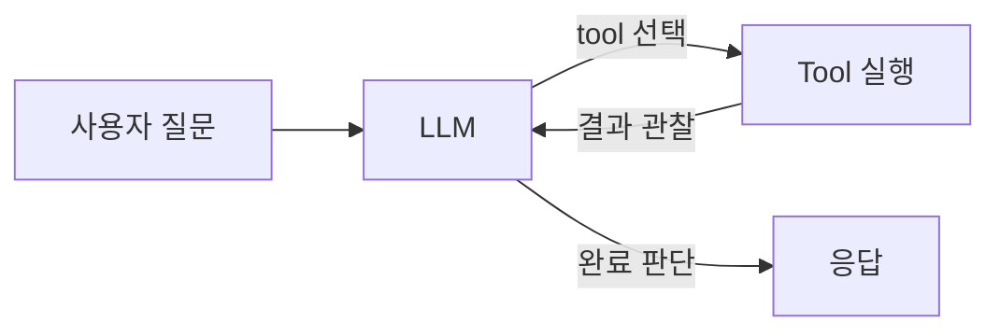
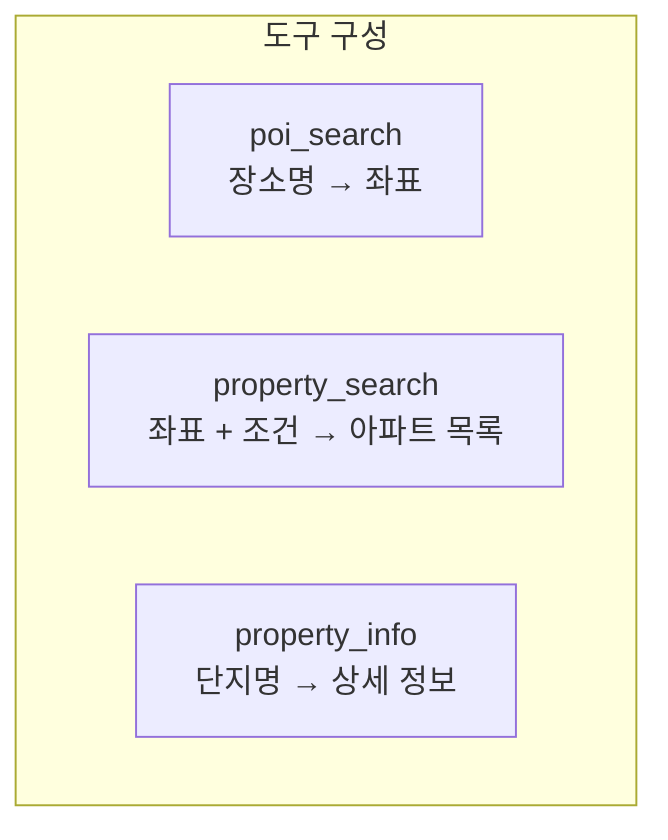
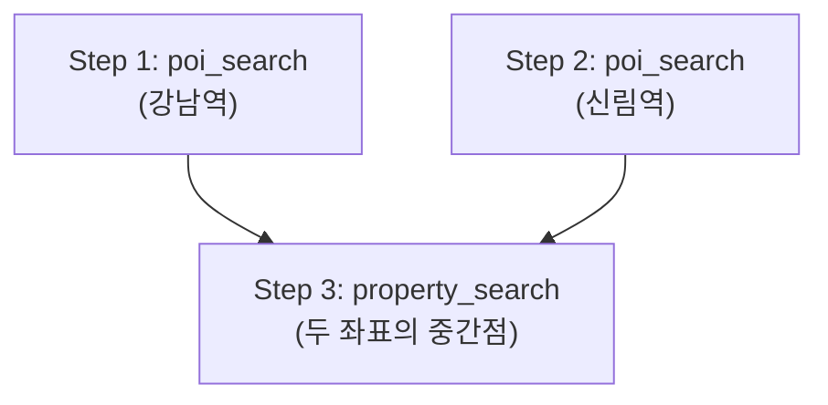
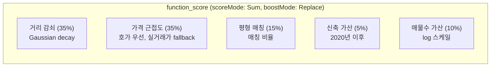

안녕하세요. 프롭테크 플랫폼에서 백엔드 개발을 하고 있는 정정일입니다.

최근에 자연어로 매물을 추천하는 AI 기능을 만들게 되었습니다. 사용자가 자연어로 조건을 입력하면 조건에 맞는 아파트를 추천해주는 기능인데, 대략 이런 모습입니다.


이번 글에서는 어떻게 이 기능을 만들었는 지 그리고 기능을 만들면서 겪었던 기술적 챌린지들과 그 과정에서 했던 고민들을 정리해보려 합니다.

## 처음에는 고정 파이프라인 RAG였다

저희 회사 AI 서비스는 기존 제가 팀에 합류했던 시점의 구조는 전형적인 RAG 파이프라인이었습니다.


사용자의 질문이 들어오면 `QuestionClassifier`가 의도를 분류하고, Strategy 패턴으로 분기한 뒤, `ConditionExtractor`가 검색 조건을 추출하고, Elasticsearch로 검색한 결과를 `ResponseGenerator`가 자연어로 응답하는 구조였습니다. LLM을 총 3번 호출하는 구조였죠.

이 구조로 어느 정도는 동작했습니다. 다만 운영하다 보니 몇가지 한계점을 맞이하게 됐습니다. 우선 기존의 RAG 구조에서 Vector DB에 있는 문서들은 부동산과 관련된 단순 법적 자료들 뿐이였습니다.

그렇기 때문에 이번에 개발하려는 "송도역 근처에 30평대 10억 이하로 살 수 있는 500세대 이상 신축 아파트 찾아 줘"와 같은 질문을 처리하지는 못했습니다. 이런경우 LLM에 전적으로 의존해서 단순 응답을 기대하게 되는데 이럴경우 두가지 문제가 생기게 되죠. 

플랫폼에서 제공하는 LLM (ex.gpt 모델, gemini 모델)들이 송도역 근처라는 지역적 정보, 30평대라는 평형 정보, 10억 이하라는 가격 정보, 500세대 이상이라는 세대수 정보, 신축 아파트라는 조건을 정확히 이해하고 그에 맞는 응답을 생성하는 건 기대하기 어려웠습니다. LLM이 부동산 도메인에 대한 충분한 지식을 가지고 있지 않거나, 지식이 있더라도 그 지식을 정확히 활용해서 응답을 생성하는 건 또 다른 문제였죠.

또 설령 LLM에 모든걸 의지해서 응답을 생성한다 하더라도 해당하는 아파트 정보와 우리 서비스를 이어 해당 부동산 매물 상세조회로 연결하는 것도 어려운 문제였습니다. LLM이 "송도역 근처에 30평대 10억 이하로 살 수 있는 500세대 이상 신축 아파트"라는 조건을 이해해서 응답을 생성하더라도, 그 응답이 실제로 우리 서비스의 매물 상세조회로 연결되는 형태가 되도록 하는 건 또 다른 문제였죠.

그리고 가장 큰 문제는 **파이프라인이 고정되어 있다는 점**이었습니다. LLM이 도구를 선택하는 구조가 아닌 시스템에서 LLM을 고정적으로 호출해 추론이 필요한 영역 혹은 응답이 필요한 영역에만 개입하는 구조였기 때문에, "강남역이랑 신림역 사이 아파트 찾아줘"와 같은 복합 질문에는 대응이 안 됐습니다. 

이런 질문을 처리하려면 "강남역 좌표를 찾고, 신림역 좌표를 찾고, 두 좌표의 중간점을 계산하고, 그 중간점 주변을 검색한다"는 여러 단계의 조합이 필요한데, 고정 파이프라인에서는 이 흐름을 전략 하나하나 따로 구현해주거나 해야하는데 이는 분명한 한계였죠.

## Agent Loop vs Planned Tool Use — 무엇을 선택할 것인가

그렇기 때문에 파이프라인의 한계를 느끼고 나서 구조를 바꿔야겠다고 생각했습니다. 고정 파이프라인을 없애고 LLM이 도구를 선택하고 실행하는 구조로 바꿔야겠다고 생각했죠. 그런데 이때 두 가지 방식 사이에서 고민이 생겼습니다.

### Full Agent Loop

첫 번째는 요즘 많이 이야기되는 **Agent Loop** 방식입니다.



LLM이 도구를 실행하고, 결과를 관찰하고, 다음 action을 결정하고, 다시 도구를 실행하고... 이 루프를 LLM이 "충분하다"고 판단할 때까지 반복하는 방식이죠.

구체적으로 "강남역 근처 30평대 아파트"를 Agent Loop로 처리한다고 가정하면 이런 흐름이 됩니다.

```
[LLM 1회] "강남역 좌표를 찾아야겠다" → poi_search("강남역") 실행
[LLM 2회] 결과 관찰: {lat: 37.49, lon: 127.02} → "이 좌표로 검색하자" → property_search 실행
[LLM 3회] 결과 관찰: 아파트 15개 → "결과가 있으니 응답하자" → 응답 생성
```

LLM이 3번 호출됩니다. 그런데 같은 질문이라도 LLM이 다른 판단을 내릴 수 있습니다. "결과가 너무 많으니 조건을 좁혀보자"고 판단해서 한 번 더 검색할 수도 있고, "결과가 적으니 반경을 넓혀보자"고 추가 루프를 돌 수도 있습니다. 루프 횟수를 예측할 수 없다는 건 곧 응답 시간과 비용을 통제할 수 없다는 뜻이기도 합니다.

LLM을 호출할수록 레이턴시가 생기는건 어쩔 수 없으니까요.

### Planned Tool Use

두 번째는 **Planned Tool Use** 방식입니다. Anthropic의 ["Building Effective Agents"](https://www.anthropic.com/engineering/building-effective-agents) 가이드에서 영감을 받았는데, 핵심은 **"minimum autonomy"** 라는 원칙이었습니다. 필요한 최소한의 자율성만 부여한다는 거죠.


LLM이 한 번에 전체 실행 계획을 생성하고, 코드가 그 계획을 확정적으로 실행하는 방식입니다. 같은 "강남역 근처 30평대 아파트"를 처리하면

```
[LLM 1회] Plan: "poi_search(강남역) → 그 좌표로 property_search" (DAG 한 번에 생성)
[코드] DAG 실행: poi_search → property_search (LLM 개입 없이 코드가 실행)
[LLM 1회] Generate: 결과 기반 응답 생성
```

LLM은 2번만 호출됩니다. 그리고 저희가 제어하기 때문에 항상 2번을 보장하게 됩니다. 같은 질문에 대해 루프 횟수가 달라지는 일이 없죠.

### 왜 Agent Loop를 선택하지 않았나

저는 결국 Planned Tool Use를 선택했습니다.

사용자가 "강남역 근처 30평대 아파트"라고 했을 때, 필요한 도구와 순서는 거의 정해져 있다고 판단했거든요. 강남역 좌표를 찾고, 그 좌표 주변을 조건에 맞게 검색하면 됩니다. LLM이 매 단계마다 "다음에 뭘 할까"를 고민할 필요가 적은 도메인이었습니다.

저는 Agent Loop가 강력한 건 **도구 실행 결과를 보고 판단을 바꿔야 하는 경우**라고 생각합니다. 예를 들어 코드를 생성하는 AI라면 "컴파일 에러가 나니까 코드를 수정하자"처럼 결과에 따라 다음 행동이 달라져야 하죠. 하지만 부동산 검색은 그렇지 않았습니다. "강남역 좌표를 찾았는데, 이 좌표가 마음에 안 드니까 다른 좌표를 찾아보자"라는 상황이 생기진 않으니까요.

부동산 매물 검색이라는 도메인 특성상, **한 번 계획하면 실행은 확정적인 경우가 대부분**이었습니다. 그래서 Agent의 유연성보다는 Planned Tool Use의 예측 가능성이 더 중요하다고 판단했습니다.

물론 이건 저희 도메인에 조금 더 알맞는 선택이었을 뿐이라고 생각합니다. "minimum autonomy" 원칙이 말하는 것도 결국 **도메인에 맞는 최소한의 자율성**이니까요. 도메인 특성을 무시하고 Agent가 좋다, Planned Tool Use가 좋다고 말하는 건 의미가 없다고 생각합니다.

또 레이턴스를 줄일 수 있다는 점도 중요했습니다. Agent Loop는 루프가 길어질수록 레이턴스가 늘어나는데, Planned Tool Use는 어느정도 일정한 레이턴스를 보장할 수 있다고 생각했습니다.

사용자께 되도록 빠르게 응답하는 게 중요하다고 생각했기 때문에 이런 점도 고려해서 Planned Tool Use를 선택하게 됐습니다.

## 자연어를 구조화된 파라미터로 바꾸는 법


Planned Tool Use 구조에서 가장 도메인 지식이 많이 녹아드는 부분은 **Plan 프롬프트**라고 생각합니다. LLM이 사용자의 자연어를 이해하고 구조화된 실행 계획으로 변환해야 하는데, 이 변환 규칙을 어떻게 정의하느냐가 추천 품질에 직접적인 영향을 미치게 됩니다.

예를 들어 사용자가 "5억대 아파트"라고 했을 때, 이걸 어떻게 파라미터로 바꿔야 할까요?

"5억대"라는 표현은 한국어에서 5억~5.9억을 의미합니다. 만원 단위로 환산하면 `priceMin: 50000, priceMax: 59999`가 되죠. 그런데 "30억대"는 30억~39.9억입니다. 같은 "~대"라는 표현인데 자릿수에 따라 범위가 다릅니다.

이런 변환 규칙들을 시스템 프롬프트에 명시적으로 정의해야 했습니다.

```
## 가격 변환 규칙 (만원 단위):
- "5억대"  → priceMin: 50000, priceMax: 59999   (5억~5.9억)
- "30억대" → priceMin: 300000, priceMax: 399999  (30억~39.9억)
- "2억~3억" → priceMin: 20000, priceMax: 30000
- "15억 정도" → priceMin: 135000, priceMax: 165000 (±10%)
- "30억 이하" → priceMin: null, priceMax: 300000

## 평형 변환 규칙:
- "30평대" → areaMin: 30, areaMax: 39
- "30평 정도" → areaMin: 27, areaMax: 33
- "30평" (정확히) → areaMin: 30, areaMax: 30
```

처음에는 이런 규칙들을 프롬프트에 넣지 않고 LLM이 알아서 변환하도록 했었습니다. 결과는 어렵지 않게 예상하실 수 있으실 것 같습니다. "5억대"를 5억~9.9억으로 변환하는 경우도 있었고, "30평대"를 30~30으로 변환하기도 했습니다. LLM이 한국어 부동산 용어를 정확히 이해하지 못하는 거죠.

결국 LLM이 한국어 자체를 못 이해하는 게 아니라, "5억대"가 정확히 어떤 범위인지를 사용자가 원하는 바를 정확하게 추론하지 못하는 경우들이 있었던 겁니다. 이런 부분은 프롬프트로 알려줘야 하는 영역이었죠.

반면에 LLM의 추론 능력이 필요한 도메인 영역들도 있었습니다. 예를 들면 **가족 구성에 따라 평형을 추론하는 규칙**이었습니다.

```
## 평형/방갯수를 명시하지 않은 경우:
사용자가 평수나 방 갯수를 직접 말하지 않았지만 가족 구성, 라이프스타일 등의 힌트가 있으면,
너의 부동산 상식으로 적절한 범위를 판단하여 params에 넣어.
예: "신혼부부" → 적절한 평수/방갯수를 네가 판단
판단 근거를 systemContext에 간단히 메모해.
```

"신혼부부인데 강남역 근처 전세 구해요"라고 하면 LLM이 `areaMin: 15, areaMax: 25, roomCountMin: 2, roomCountMax: 3, dealType: LEASE`로 변환하고, `systemContext: "신혼부부 기준 소형~중형 평수, 방 2~3개 추천"`이라고 판단 근거까지 남기게 하는거죠.

물론 처음부터 이 추론이 잘 된 건 아닙니다. 4인 가족이면 30평대 이상이 일반적인데 "아이 둘 있는 4인 가족"이라고 했을 때 20평대를 추천하는 경우가 있었죠. 이런 케이스를 프롬프트의 few-shot 예시로 추가하면서 점차 정확도를 올려갔습니다.

결국 이 부분에서 느낀 건, "5억대" 같은 명확한 규칙은 프롬프트로 정의하되, 맥락 추론이 필요한 부분은 LLM에게 맡기는 게 맞다는 것이었습니다. 다만 그 경계가 생각보다 모호해서, 프롬프트 설계에서 가장 고민이 많았던 부분이지 않나 싶습니다.

## 어떤 도구들이 필요한가

구조와 프롬프트를 정했으니 이제 LLM이 사용할 도구를 설계해야 했습니다. "강남역 근처 30평대 아파트"를 처리하려면 어떤 단계가 필요할까요?

1. "강남역"이라는 장소명을 좌표로 변환한다
2. 그 좌표 주변에서 조건에 맞는 아파트를 검색한다
3. 특정 아파트의 상세 정보를 조회한다

이 단계들을 각각 독립된 도구로 만들었습니다.



- **`poi_search`**: 장소명으로 좌표 및 장소 정보를 검색합니다. "강남역" → `{ lat: 37.49, lon: 127.02 }`
- **`property_search`**: 좌표와 조건으로 아파트를 검색합니다.
- **`property_info`**: 특정 아파트 단지의 상세 정보를 조회합니다.

이렇게 도구를 나누면 "강남역이랑 신림역 사이 아파트"같은 복합 질문도 자연스럽게 처리됩니다. LLM이 `poi_search("강남역")`, `poi_search("신림역")`, 그리고 두 좌표를 받는 `property_search`를 스스로 조합하면 되니까요. 도구 하나하나가 명확한 역할을 가지고 있으면 LLM이 알아서 조합할 수 있게 되는 거죠.

### 왜 DAG가 필요했나

도구를 나누고 나니 다음 문제는 이 도구들을 어떤 순서로 실행할지였습니다. 처음에는 단순하게 생각했습니다. LLM이 필요한 도구 목록을 뽑아주면 그냥 병렬로 돌리면 되지 않을까?

실제로 그게 가능한 경우도 있었습니다. "혼자 살만한 아파트 추천해줘"같은 질문은 위치 특정이 필요 없으니 `property_search` 하나만 실행하면 됩니다. "강남역이랑 신림역 근처 아파트"도 `poi_search` 두 개를 병렬로 돌린 뒤 `property_search`를 돌리면 되죠.

그런데 문제는 **도구 간 의존성**이었습니다. "강남역 근처 30평대 아파트"를 처리하려면 `poi_search("강남역")`의 결과(좌표)가 나와야 `property_search`를 실행할 수 있습니다. `poi_search`가 끝나기 전에 `property_search`를 실행할 수가 없는 거죠. 반면 "강남역이랑 신림역 사이"에서는 `poi_search("강남역")`과 `poi_search("신림역")`은 서로 의존성이 없으니 동시에 실행할 수 있습니다.

결국 **의존성이 있는 도구는 순서대로, 없는 도구는 병렬로** 실행해야 했습니다. 이걸 표현하기에 가장 자연스러운 구조가 DAG(Directed Acyclic Graph)였습니다.

코드로는 모든 Tool이 하나의 인터페이스를 구현하도록 했습니다.

```kotlin
interface ChatTool {
    val name: String
    val description: String
    val parameterSchema: String
    suspend fun execute(params: Map<String, Any?>): ToolResult
}
```

`name`과 `description`, `parameterSchema`는 Plan 단계에서 LLM의 시스템 프롬프트에 포함됩니다. LLM이 이 정보를 보고 어떤 Tool을 어떤 순서로 실행할지 결정하는 거죠. 새로운 Tool을 추가하려면 이 인터페이스를 구현하고 빈으로 등록하기만 하면 됩니다. Spring의 `List<ChatTool>` 주입으로 자동 등록되니까요.

`poi_search`의 경우 Elasticsearch의 가중치 기반 텍스트 검색을 사용하는데, 정확한 매칭에 가장 높은 가중치를 부여합니다.

```
1. name.keyword 정확 매칭   (boost 10)
2. name 형태소 매칭         (boost 5)
3. search_text 형태소 매칭  (boost 3)  — 주소, 노선명 포함
4. search_text.ngram 부분 매칭 (boost 1)
```

"강남역"이라고 검색하면 정확히 "강남역"이 먼저 매칭되고, 형태소 분석으로 "강남"이 포함된 결과, 주소에 "강남"이 들어간 결과 순서로 정렬됩니다.

이 가중치를 잡는 게 생각보다 까다로웠습니다. 처음에는 keyword 매칭에 boost 5, 형태소 매칭에 boost 3을 줬었는데, "강남역"을 검색하면 "강남구청역"이 1위로 나오는 현상이 있었습니다. 원인을 찾아보니 "강남구청역"이 형태소 매칭에서 "강남"과 "역" 두 토큰이 매칭되면서 점수가 올라간 거였습니다. keyword 정확 매칭의 boost를 10으로 크게 벌리고 나서야 "강남역"이 확실하게 1위에 올라왔습니다. 결국 boost 값은 상대적 비율이 중요한 거라, 비슷한 값으로 주면 의도치 않은 역전이 일어나더라고요.

## LLM이 생성한 DAG를 실행하는 법

Tool을 나눴으면 이제 이 Tool들을 어떻게 실행할지가 문제입니다. 여기서 **LLMCompiler** ([arXiv 논문](https://arxiv.org/pdf/2312.04511))의 DAG 패턴을 참고했습니다.

### LLM이 생성하는 DAG

Plan 단계에서 LLM은 JSON mode로 실행 계획을 한 번에 생성합니다. "강남역 근처 30평대 아파트"라는 질문이 들어오면 이런 DAG가 생성하게 되는 겁니다.

```json
{
  "intent": "PROPERTY_SEARCH",
  "steps": [
    {
      "id": "1",
      "name": "poi_search",
      "params": { "location": "강남역" },
      "deps": []
    },
    {
      "id": "2",
      "name": "property_search",
      "params": {
        "pois": [{ "name": "$1.name", "lat": "$1.lat", "lon": "$1.lon" }],
        "areaMin": 30,
        "areaMax": 39,
        "dealType": "DEAL",
        "radiusKm": 3.0
      },
      "deps": ["1"]
    }
  ]
}
```

여기서 중요한 두 가지 개념이 있습니다.

**첫 번째는 `deps`(의존성)입니다.** step 2의 `deps: ["1"]`은 "step 1이 완료된 후에 실행하라"는 뜻입니다. 위에서 설명한 도구 간 의존성을 이 필드로 표현하는 거죠.



**두 번째는 변수 참조(`$1.lat`)입니다.** step 2의 파라미터에 `"$1.lat"`이라고 적으면, step 1의 실행 결과에서 `lat` 값을 꺼내서 치환합니다. 이 덕분에 step 간에 데이터를 전달할 수 있습니다.

### 왜 OpenAI function calling을 쓰지 않았나

이 시점에서 "OpenAI의 네이티브 function calling을 쓰면 되지 않나?"라는 의문이 드실 수 있다고 생각합니다.

다만 네이티브 function calling은 "이 도구들을 실행해라"까지는 표현할 수 있습니다. parallel function calling으로 여러 도구를 동시에 실행하는 것도 가능하죠. 하지만 **"step 1이 끝난 후 그 결과의 lat 값을 step 2의 파라미터에 넣어서 실행해라"를 한 번의 호출로 표현하는 건 불가능합니다.**

또 function calling은 도구를 호출할 때 모든 파라미터 값을 미리 알아야 합니다. 그런데 `property_search`의 좌표는 `poi_search`가 실행되어야 알 수 있죠. 결국 Agent Loop처럼 여러 번 LLM을 호출해야 하고, 그러면 Planned Tool Use의 장점(예측 가능한 호출 횟수)이 사라집니다.

그래서 LLM에게 DAG 스키마를 프롬프트로 제공하고, `deps`와 변수 참조(`$1.lat`)를 포함한 실행 계획을 JSON mode로 한 번에 생성하게 하는 방식을 선택했습니다. LLMCompiler 논문에서 이 접근 방식의 이론적 근거를 얻었고요.

### DAG 실행 엔진

생성된 DAG를 실행하는 `ToolExecutor`는 **Kahn's algorithm**으로 위상 정렬을 수행한 뒤, 같은 레벨의 step들을 coroutine으로 병렬 실행합니다.

```kotlin
suspend fun executeDag(
    steps: List<DagStep>,
    timeoutMs: Long = 20_000
): List<ToolResult> = coroutineScope {
    val resultMap = ConcurrentHashMap<String, ToolResult>()
    val levels = topologicalSort(steps)  // Kahn's algorithm

    for ((levelIdx, level) in levels.withIndex()) {
        val levelResults = level.map { step ->
            async(Dispatchers.IO) {
                val resolvedParams = resolveVariables(step.params, resultMap)
                step.id to executeSingle(ToolCallRequest(step.name, resolvedParams), timeoutMs)
            }
        }.map { it.await() }

        levelResults.forEach { (id, result) -> resultMap[id] = result }
    }

    steps.map { step -> resultMap[step.id]!! }
}
```

Kahn's algorithm으로 "이 step은 어떤 레벨에서 실행 가능한가"를 분류하고, 같은 레벨에 있는 step들은 `async`로 병렬 실행합니다. 레벨이 끝나면 결과를 `resultMap`에 저장하고, 다음 레벨의 step들은 이 결과에서 변수를 치환해서 실행합니다.

변수 치환 로직에서 한 가지 신경 쓴 부분이 있습니다. **`$1.lat`처럼 값 전체가 변수인 경우에는 원래 타입(Double 등)을 유지하고, `"$1.name 근처"`처럼 문자열 안에 변수가 포함된 경우에는 문자열로 치환합니다.**

```kotlin
private fun resolveStringVariable(value: String, resultMap: Map<String, ToolResult>): Any? {
    // 값 전체가 변수 → 원래 타입 유지 (예: "$1.lat" → 37.49 as Double)
    val fullMatch = VARIABLE_PATTERN.matchEntire(value)
    if (fullMatch != null) {
        val (stepId, field) = fullMatch.destructured
        return extractField(resultMap[stepId], field) ?: value
    }

    // 문자열 내 변수 → 문자열 치환 (예: "$1.name 근처" → "강남역 근처")
    return VARIABLE_PATTERN.replace(value) { match ->
        val (stepId, field) = match.destructured
        extractField(resultMap[stepId], field)?.toString() ?: "null"
    }
}
```

이 구분이 왜 중요하냐면, `$1.lat`을 문자열 `"37.49"`로 치환하면 Elasticsearch 검색에서 타입 에러가 납니다. 좌표는 Double이어야 하니까요. 처음에는 이 구분 없이 전부 문자열로 치환했었는데, 검색이 깨지는 걸 보고 나서야 이 로직을 추가했습니다.

### LLM 출력은 신뢰할 수 없다

DAG를 LLM이 생성하기 때문에, 당연히 잘못된 결과가 나올 수 있습니다. 그렇기 때문에 `sanitizePlan`이라는 방어 로직을 추가했습니다.

```kotlin
private fun sanitizePlan(plan: DagPlanResult): DagPlanResult {
    // 1단계: 화이트리스트에 없는 tool name → 제거
    var sanitizedSteps = plan.steps.filter { it.name in validToolNames }

    // 2단계: 제거된 step을 deps로 참조하는 후속 step도 연쇄 제거
    do {
        prevSize = sanitizedSteps.size
        val validIds = sanitizedSteps.map { it.id }.toSet()
        sanitizedSteps = sanitizedSteps.filter { step -> step.deps.all { it in validIds } }
    } while (sanitizedSteps.size != prevSize)

    // 3단계: step 수 상한 (N개 POI 독립 검색 시 ES 호출 과다 방지)
    if (sanitizedSteps.size > maxDagSteps) {
        sanitizedSteps = sanitizedSteps.take(maxDagSteps)
    }

    return plan.copy(
        intent = sanitizedIntent,
        steps = sanitizedSteps,
        // 자유 텍스트 필드는 길이 제한 + 줄바꿈 제거 (인젝션 방어)
        etcCondition = sanitizeString(plan.etcCondition),
        systemContext = sanitizeString(plan.systemContext, maxLen = 200)
    )
}
```

2단계의 **연쇄 제거**같은 경우에 step 1이 잘못된 tool name으로 제거되면, step 1에 의존하는 step 2도 실행할 수 없습니다. step 2에 의존하는 step 3도 마찬가지고요. 이 연쇄를 고정점 수렴(더 이상 제거할 step이 없을 때까지 반복)으로 처리합니다.

`etcCondition`과 `systemContext`도 새니타이즈하는 이유는, 이 필드들이 LLM이 자유롭게 텍스트를 생성하는 영역이라 인젝션 공격에 취약할 수 있기 때문입니다. 길이를 제한하고 줄바꿈을 제거해서 최소한의 방어를 합니다.

이 방어 로직들은 처음부터 고려한 건 아닙니다. 실제로 운영하면서 LLM이 예상 외의 출력을 내는 경우들을 겪으면서 하나씩 추가하게 된 것들입니다. LLM 기반 시스템을 만들면서 느낀 건, **LLM의 출력을 코드가 실행하는 구조에서는 이런 새니타이즈 로직이 생각보다 많이 필요하다**는 점이었습니다. LLM을 "믿되 검증한다"는 원칙이 필요하지 않나 싶습니다.

## "찾기"와 "추천"은 다른 문제였다

여기서 제가 가장 크게 반성한 부분이 있습니다.

DAG 실행 엔진까지 만들고 E2E 테스트를 돌렸는데, 결과를 보니 뭔가 이상했습니다. 거리 안에 있는 아파트들이 나오긴 하는데, **순서에 의미가 없었습니다.** 비싼 아파트, 싼 아파트, 조건에 잘 맞는 아파트, 안 맞는 아파트가 뒤섞여 있었죠.

돌이켜보면 당연한 결과였습니다. 그때까지 만든 건 **"AI 단지 찾기"** 였지 **"AI 단지 추천"** 이 아니었으니까요. 조건에 맞는 걸 찾아주긴 하는데, 뭐가 더 좋은지 판단하는 로직이 없었던 겁니다. 반경 3km 안에 조건을 만족하는 아파트가 30개 있으면 30개를 그냥 나열하는 거였으니까요.

### 이건 LLM 문제가 아니었다

이 문제를 해결하려면 LLM을 바꾸거나 프롬프트를 고치는 게 아니라, **검색 자체의 스코어링 로직**을 만들어야 했습니다. 순수한 검색 엔지니어링 문제였죠.

Elasticsearch의 `function_score`를 활용해서 5가지 가중치 스코어링을 설계했습니다.



### 가중치를 어떻게 정했나

솔직히 말씀드리면 이론적 근거로 정한 건 아닙니다. 다만 아무 근거 없이 감으로 정한 것도 아닙니다.

출발점은 **"사용자가 매물을 고를 때 가장 중요하게 보는 게 뭔가"** 였습니다. 부동산 서비스를 운영하고 사용자 분들께서 검색하는 로그를 보면서 느낀 건, 사용자분들이 가장 먼저 보는 건 **위치**와 **가격**이라는 점이었습니다. 평형이나 신축 여부는 그 다음이었죠. 그래서 거리와 가격에 각각 35%로 가장 큰 가중치를 주고, 평형 매칭에 15%, 나머지를 신축(5%)과 매물 수(10%)에 배분했습니다.

이 비율을 정하고 나서 실제 검색 결과를 보면서 미세하게 조정했습니다. 예를 들어 처음에는 거리를 50%로 줬었는데, "강남역 근처 10억 이하 아파트"를 검색하면 30억짜리 아파트가 1위로 올라오는 경우가 있었습니다. 가격은 전혀 안 맞지만 강남역에서 200m라서 거리 점수만으로 1위가 된 거죠. 거리와 가격의 중요도가 비슷하다고 판단해서 35/35로 맞췄고, 그 이후로는 이런 문제가 많이 줄었습니다.

### 가격 근접도 — 호가와 실거래가 사이에서

가장 고민이 많았던 부분은 **가격 근접도**였습니다. 단순히 "사용자가 원하는 가격에 가까운 아파트에 높은 점수를 준다"는 개념인데, 실제로 구현하려니 어떤 가격을 기준으로 스코어링할지가 문제였습니다.

부동산에서 가격 데이터는 크게 두 가지입니다. **실거래가**(실제 거래된 가격)와 **호가**(매물에 등록된 가격)인데, 모든 아파트에 두 데이터가 다 있는 건 아닙니다. 최근 거래가 없는 아파트나 빌라 등은 실거래가가 없고, 매물이 없는 아파트는 호가가 없죠.

그러나 보통 실거래가의 경우 거래가 된 이후에 한달정도 지나야 공개가 됩니다. 반면 호가는 매물로 등록되는 즉시 알 수 있죠. 그래서 실거래가는 최신 시장 상황을 반영하지 못하는 경우가 많다고 판단해 **호가를 우선으로 탐색하고, 호가가 없으면 실거래가를 fallback으로 사용하는 전략**을 택했습니다. 이 로직을 ES의 Painless 스크립트로 구현했습니다.

```java
// 가격 근접도 Painless 스크립트 (핵심부, 변수명은 예시)
def minDiff = Double.MAX_VALUE;
for (def map : new Object[]{askingPriceMap, tradedPriceMap}) {  // 호가 먼저, 실거래가 fallback
    if (map == null || map.isEmpty()) { continue; }
    for (entry in map.entrySet()) {
        double priceVal = ((Number)entry.getValue()).doubleValue();
        if (priceVal == 0.0) { continue; }  // 가격 0 건너뛰기
        def diff = Math.abs(priceVal - midpoint);
        if (diff < minDiff) { minDiff = diff; }
    }
    if (minDiff < Double.MAX_VALUE) { break; }  // 호가가 있으면 실거래가 탐색 안 함
}
if (minDiff == Double.MAX_VALUE) { return 0.3; }  // 가격 데이터 없으면 중립 점수
return Math.exp(-0.5 * Math.pow(minDiff / scale, 2));  // Gaussian decay
```

여기서 가격 데이터가 아예 없는 아파트에 **중립 점수 0.3**을 부여하는 게 중요했습니다. 0점을 주면 가격 데이터가 없다는 이유만으로 무조건 하위로 밀려나고, 1점을 주면 오히려 상위로 올라옵니다. 0.3이라는 값은 "가격을 모르지만, 최소한 불이익을 주지는 않겠다"는 의미였습니다. 이 값도 결과를 보면서 조정했고요.

또 하나 고민했던 건 **"5억 이상"** 같은 오픈 범위 검색의 처리였습니다. "5억 이상"이면 `priceMin: 50000, priceMax: 9999999`(약 999억)가 되는데, 이 범위의 중심점은 약 500억입니다. 당연히 의미 없는 값이죠. 그래서 오픈 범위일 때는 중심점을 `min * 1.5`로 보정했습니다. "5억 이상"이면 7.5억 근처의 아파트에 가장 높은 점수를 주는 거죠.

```kotlin
// 오픈 범위 보정 (코드는 예시)
val effectiveMax = if (isOpenRange) effectiveMin * 2 else priceRange.last
```

### 복수 POI 지원 — "강남역이랑 신림역 사이 아파트"

스코어링까지 해결하고 나니 또 다른 챌린지가 있었습니다. 사용자가 위치를 2개 이상 말하는 경우였습니다.

"강남역이랑 신림역 사이 아파트", "신림역 혹은 강남역 근처 아파트", "강남역에 더 가깝게", "삼성역, 강남역, 고속터미널역이랑 가까운" — 이런 질문들을 처리해야 했습니다.

분석해보니 크게 세 가지 패턴이 있었습니다.

| 패턴 | 예시 | 검색 전략 |
|---|---|---|
| "A 또는 B" | "신림역 혹은 강남역 근처" | 독립 검색 N개 (각 POI별 property_search) |
| "A와 B 사이" | "잠실역이랑 강남역 사이" | midpoint 계산 → property_search 1개 |
| "A에 더 가깝게" | "강남역보다 신림역에 더 가깝게" | weighted center → property_search 1개 |

독립 검색의 경우 LLM이 POI 수만큼 별도의 `property_search` step을 생성합니다. midpoint나 weighted center의 경우에는 `property_search` 1개에 여러 POI를 전달하고, `PropertySearchTool`이 가중 중심점을 계산합니다.

```kotlin
private fun calculateCenter(pois: List<PoiCoord>, weights: List<Double>): Pair<Double, Double>? {
    if (pois.isEmpty()) return null
    if (pois.size == 1) return pois[0].lat to pois[0].lon
    val weightedPoints = pois.zip(weights).map { (poi, w) ->
        GeoUtils.WeightedPoint(poi.lat, poi.lon, w)
    }
    return GeoUtils.calculateWeightedCenter(weightedPoints)
}
```

여기에도 전략 분기를 LLM이 판단하도록 했습니다. "집은 신림역이고 회사는 교대역인데"처럼 명시적 키워드("사이", "또는")가 없어도, LLM이 "두 곳 모두 오가야 하는 맥락"을 파악해서 midpoint 전략을 선택하게 한거죠. 반대로 "강남역도 괜찮고 신림역도 괜찮은데"는 "둘 중 하나를 고르려는 맥락"이니 독립 검색으로 판단합니다.

이런 맥락 기반 판단은 규칙으로 처리하기 어려운 부분이었습니다. 자연어의 뉘앙스와 맥락을 모두 포착하려면 규칙이 엄청 복잡해질 텐데, LLM의 맥락 이해 능력에 맡기는 게 훨씬 효율적이겠다고 판단했습니다. 그래서  이 판단을 LLM이 잘 하도록 프롬프트에 **맥락 기반 규칙**을 추가했습니다.

```
- "집은 A이고 회사는 B" → 두 곳 모두 오가야 하는 맥락 → midpoint
- "A도 괜찮고 B도 괜찮은데" → 둘 중 하나를 고르려는 맥락 → 독립 검색
```

명시적 키워드만으로는 처리할 수 없는 자연어의 모호함을 LLM의 맥락 이해 능력에 맡기는 거죠. 이런 부분은 규칙으로 처리하려면 끝이 없었을 것 같습니다.


### 포스트 필터링 — ES 스코어링만으로는 부족하다

한 가지 더 문제가 있었습니다. ES의 `function_score`가 스코어링은 해주지만, **평형+가격+방갯수를 동시에 검증하지는 않는다는 점**이었습니다.

이게 왜 문제냐면, ES 인덱스는 **단지(아파트) 레벨**로 구성되어 있기 때문입니다. 하나의 단지에 20평형, 30평형, 40평형이 있을 수 있습니다. 사용자가 "30평대, 15억"이라고 검색했는데, 어떤 단지의 20평형이 15억이면 이 단지가 검색 결과에 포함됩니다. 하지만 사용자가 원하는 건 30평대가 15억인 아파트이지, 20평형이 15억인 아파트가 아닙니다.

그래서 ES 검색 후에 **포스트 필터링**을 추가했습니다. 후보 평형 중 하나라도 평형+가격+방갯수를 **모두 동시에** 만족하는지 검증하는 로직입니다.

```kotlin
// 변수명은 예시
val matched = candidateTypes.any { type ->
    val typeKey = type.toString()

    // 가격 검증: 호가 우선, 없으면 실거래가 fallback (스코어링과 동일한 정책)
    val priceMatches = if (priceRange != null) {
        val price = askingPrices[typeKey] ?: tradedPrices[typeKey]
        price != null && price in priceRange
    } else true

    // 방 갯수 검증
    val roomCountMatches = if (roomCountRange != null) {
        val roomCount = roomCountsByType[typeKey]
        roomCount != null && roomCount in roomCountRange
    } else true

    priceMatches && roomCountMatches
}
```

이 포스트 필터링도 결국 LLM과는 관계없는 순수 검색 로직이었습니다. 가격 근접도 스코어링과 마찬가지로 **호가 우선, 실거래가 fallback** 정책을 동일하게 적용했고요.

## 돌이켜보면

이 기능을 만들면서 아키텍처를 여러 번 바꾸게 되었는데 굉장히 개발하면서 재미있는 경험이었습니다. 만들면서 즐겁더라구요.

처음 고정 파이프라인에서 Plan + Execute + Generate 구조로 바꾸고 하는 과정들과 실제 서비스에 AI를 녹여가는 과정 그리고 그 결과를 보니 뿌듯하기도 했습니다.


### Tool 경계를 나누는 건 서비스 경계를 나누는 것과 같았다

위에서 모놀리식 Tool을 원자적으로 분해한 경험을 이야기했는데, 이 과정에서 느낀 건 결국 MSA에서 서비스 경계를 나누는 고민과 본질적으로 같았다는 점입니다. Tool이 너무 크면 LLM이 유연하게 조합할 수 없고, 너무 작으면 Plan 단계에서 step이 불필요하게 많아집니다. 서비스 크기 고민과 똑같죠.

사실 이건 단일 책임 원칙이 Tool 설계에도 적용된다는 거지 않나 싶습니다. 다만 전통적인 SRP에서는 "변경의 이유"가 기준이라면, Tool SRP에서는 "LLM이 이 Tool의 역할을 한 문장으로 설명할 수 있는가"가 기준이 된다고 느꼈습니다.

### "추천"이라는 단어를 가볍게 봤다

이건 제가 반성을 크게 한 부분입니다... ㅎ 요구사항에 "추천"이라는 단어가 있었는데, "추천하려면 기준이 필요하고, 기준이 있으려면 스코어링이 필요하다"는 연결고리를 처음부터 떠올리지 못했습니다. 단순히 LLM을 통한 "AI 매물,단지 찾기" 정도로만 생각했었죠. E2E 테스트에서 결과를 직접 보고 나서야 깨달았죠.

요구사항의 단어 하나하나에 어떤 기술적 요구가 숨어있는지를 더 깊이 분석했다면 스코어링 설계를 더 일찍 시작할 수 있었을 것 같습니다. "찾기"와 "추천"은 사용자 입장에서는 비슷해 보이지만, 만드는 입장에서는 완전히 다른 문제라는 걸 이번에 확실히 배웠습니다.

### 아직 남은 과제들

아직 한계도 있습니다. 현재 응답 시간이 좀 느려서 사용자 경험 면에서 개선이 필요하다고 생각합니다. Plan LLM 호출에 대부분의 시간이 소요되는데, 프롬프트 캐싱이나 모델 최적화로 줄일 수 있는 여지가 있다고 보고 있습니다. 

그리고 이 글을 쓰면서 다시 느낀 건데, 다음에 비슷한 기능을 만들 때는 처음부터 "LLM이 할 일"과 "코드가 할 일"의 경계를 먼저 정의하고 시작할 것 같습니다. 이번에는 그 경계를 만들면서 찾아갔는데 다음 기회가 있다면 처음부터 제대로 모듈간 경계를 정하듯 "LLM이 할 일은 이거, 코드가 할 일은 이거"를 명확히 정의하고 시작할 것 같습니다.

이 글에서 다룬 AI 매물 추천 기능을 직접 사용해보고 싶으신 분들은 [부톡 아파트](https://bootalk.co.kr/apt)에서 **"문자 / 음성으로 찾기"** 버튼을 눌러 사용해보시면 좋을 것 같습니다.

이 글이 누군가에게 조금이라도 도움이 되길 바라며 이만 가보겠습니다. 긴 글 읽어주셔서 감사합니다.

---

## 참고 자료

- Anthropic - [Building Effective Agents](https://www.anthropic.com/engineering/building-effective-agents)
- Kim et al. - [An LLM Compiler for Parallel Function Calling](https://arxiv.org/pdf/2312.04511) (arXiv, 2023)
- Elasticsearch - [Function Score Query](https://www.elastic.co/guide/en/elasticsearch/reference/current/query-dsl-function-score-query.html)
