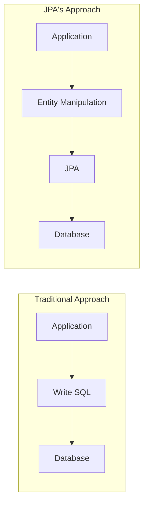

When using JPA, you sometimes encounter moments like "Huh? Why doesn't this work?" I think anyone who has used JPA has probably experienced the confusion when a feature that was natural in SQL isn't supported in JPQL.

In this article, I want to talk about why the gap between JPA and SQL exists, and how to overcome these limitations in practice based on my experience.

## What JPA Pursues

I think to understand the gap between JPA and SQL, we first need to understand why JPA was created.

JPA doesn't seem to be simply "a tool that wraps SQL in Java code." It appears to be designed with the philosophy of **handling data in an object-oriented way**.



Here's my understanding of JPA's core design principles:

| Principle | Description |
|-----------|-------------|
| **Entity-centric** | Think in terms of objects (Entity), not tables |
| **Database independence** | Abstraction layer not bound to specific DBMS |
| **Object graph navigation** | Natural data access through relationships |
| **Persistence context** | Object state management including first-level cache, dirty checking |

Because of this philosophy, JPA (JPQL) seems to intentionally not support all SQL features. I think it was designed from the perspective of **"Would this feature be necessary if you thought in terms of entities?"**

## What JPQL Doesn't Support

So what features aren't supported in JPQL? Let me go through some representative cases I've encountered in practice.

### 1. UNION / UNION ALL

In SQL, `UNION` is a basic feature that combines multiple query results into one. However, JPQL doesn't support this.

```sql
-- Possible in SQL
SELECT name, 'CUSTOMER' as type FROM customer
UNION ALL
SELECT name, 'PARTNER' as type FROM partner;
```

Why isn't it supported? Based on my thinking, from JPA's perspective, **UNION is an operation that combines results from different tables (entities)**. But since JPA is designed to think in terms of entities, the concept of "combining Customer entity and Partner entity" can feel awkward from an object-oriented perspective.

In a sense, it feels like JPA is asking:

> "Why would you need to combine different entities? Can't you design it with inheritance?"

Of course, in practice, there are definitely situations where UNION is necessary. Like when dealing with legacy table structures or writing report queries.

### 2. FROM Clause Subqueries

In SQL, you can use subqueries in the FROM clause like temporary tables.

```sql
-- Possible in SQL
SELECT *
FROM (
    SELECT user_id, SUM(amount) as total
    FROM orders
    GROUP BY user_id
) as user_totals
WHERE total > 10000;
```

This isn't possible in JPQL. Since JPA **queries based on entities**, the concept of querying against "a temporarily created result set" doesn't seem to fit.

### 3. LIMIT in Subqueries

In SQL, you can use LIMIT inside subqueries.

```sql
-- Possible in SQL
SELECT *
FROM users u
WHERE u.id IN (
    SELECT o.user_id
    FROM orders o
    ORDER BY o.created_at DESC
    LIMIT 100
);
```

In JPQL, paging is only possible in the main query through `setMaxResults()`, not in subqueries.

### 4. INSERT Statement

JPQL doesn't support `INSERT`. In JPA, you need to use `EntityManager.persist()` to save data.

```java
// Not possible in JPQL
// INSERT INTO User (name, email) VALUES ('John', 'john@example.com')

// JPA way
User user = new User("John", "john@example.com");
entityManager.persist(user);
```

I think this is the part most aligned with JPA's design philosophy. Since JPA operates by **tracking changes in object state and reflecting them to the DB**, directly executing INSERT queries doesn't seem to fit this philosophy.

## Why Such Design Decisions?

At first, I thought "Why are there so many limitations?" But thinking from JPA's perspective, I felt there were reasonable reasons.

### Database Independence

JPA seems to aim for not being bound to specific DBMS. `LIMIT` is MySQL syntax, while Oracle uses `ROWNUM` or `FETCH FIRST`. If they tried to support all DBMS-specific features, the abstraction would break.

### Object Graph-Centric Thinking

JPA seems to encourage **navigating relationships between entities** rather than JOINs between tables. Like accessing related data through objects with `user.getOrders()`.

```java
// JPA's recommended way
User user = entityManager.find(User.class, userId);
List<Order> orders = user.getOrders();  // Lazy Loading

// SQL-centric way
SELECT * FROM users u JOIN orders o ON u.id = o.user_id WHERE u.id = ?
```

### Enforcing Entity Design

In a way, JPQL's constraints might be **forcing you to "design entities better"**. It makes you think about whether you could design with inheritance if UNION is needed, or whether you could solve it with relationships if subqueries are needed.

## But Requirements Always Change

In realistic development environments, requirements change frequently, and there are cases where gaps arise between databases and objects.

### 1. When Tables Aren't Designed by You

If you designed the database based on object-oriented design from the project's start, the gap could narrow. But in practice, you mostly have to work with already designed tables, namely **legacy databases**.

In such cases, **should we change schemas and migrate data just to use JPA?**

I've experienced this in practice too. The existing system's table structure wasn't JPA-friendly, and changing the table structure would affect other systems, so it couldn't be done carelessly.

### 2. Sudden Requirement Changes

Requirements always change. Data models that were initially simple become complex over time, and business logic changes can affect existing design or systems. I think the abstraction layer provided by JPA sometimes becomes an obstacle rather than helping secure flexibility in such cases.

For example, if initially you only needed to handle two tables "customer and order", but later situations arise where you need to manage additional information like "delivery status", "payment history", "refund processing" in the order table, additional entities or relationship mappings are needed to process data while maintaining existing design. These requirements can affect the entire existing code. Especially, the deeper the association relationships are set in entities, the exponentially larger the impact range from changes becomes.

### 3. Complex Query Requirements

There are times when you suddenly need to write complex aggregation queries for business insights like "customers who purchased most" or "order growth rate within a specific period", moving away from simple data queries.

In such cases, JPQL isn't suitable for complex aggregation or conditional queries due to the above constraints. Especially, situations arise where it's difficult to use SQL's advanced features like subqueries, joins, grouping, window functions.

In such cases, you ultimately have to return to Native Query.

## Practical Alternatives

So how can we overcome these limitations in practice? Let me share methods I've experienced or researched.

### 1. Native Query

The most direct method is **Native Query**. JPA supports executing SQL directly.

```java
@Query(value = """
    SELECT name, 'CUSTOMER' as type FROM customer
    UNION ALL
    SELECT name, 'PARTNER' as type FROM partner
    """, nativeQuery = true)
List<Object[]> findAllNamesWithType();
```

**Pros:**
- Can use all SQL features
- Can utilize DBMS-specific features

**Cons:**
- Creates database dependency
- Reduced type safety (returns Object[])
- Difficult to leverage entity mapping benefits

### 2. QueryDSL

QueryDSL is a type-safe query builder that seems to partially compensate for JPQL's limitations.

```java
List<UserDto> users = queryFactory
    .select(Projections.constructor(UserDto.class,
        user.name,
        order.amount.sum()))
    .from(user)
    .join(user.orders, order)
    .groupBy(user.id)
    .fetch();
```

**Pros:**
- Compile-time type checking
- IDE auto-completion support
- Convenient dynamic query construction

**Cons:**
- Doesn't completely escape JPQL's limitations
- Additional library dependency
- Somewhat complex setup

### 3. Using MyBatis Together

In projects with many complex queries, **using JPA and MyBatis together** is also an option. CRUD with JPA, complex queries with MyBatis.

**Pros:**
- Complete control over SQL
- Easy to write complex queries

**Cons:**
- Need to manage two technology stacks
- Need to be careful with Connection management (see previous [HikariCP Deadlock issue]())

### 4. View or Stored Procedure

Another approach is to create complex query logic as **Database Views** or **Stored Procedures** and call them simply from JPA.

```java
@Entity
@Table(name = "user_order_summary_view")
public class UserOrderSummary {
    @Id
    private Long userId;
    private BigDecimal totalAmount;
    private Long orderCount;
}
```

**Pros:**
- Encapsulates complex logic at DB level
- Can be treated as simple entity from JPA

**Cons:**
- Increases DB dependency
- Business logic becomes distributed

## Which Method Should You Choose?

In my experience, the answer seems to be **"it depends on the situation"**. However, I can suggest some criteria.

| Situation | Recommended Method |
|-----------|-------------------|
| Simple CRUD-focused application | JPA + QueryDSL |
| Some complex queries | JPA + Native Query |
| Many complex queries | JPA + MyBatis together |
| Report/Statistics system | MyBatis or pure JDBC |
| Legacy DB integration | Flexible based on situation |

I think what's important is **not being bound to tools**. Trying to solve everything with JPA just because it's good, or ignoring JPA's benefits just because you're familiar with SQL, doesn't seem desirable.

## Summary

I think the gap between JPA and SQL is **an intentional constraint stemming from JPA's design philosophy**. JPA seems to have chosen not to support some SQL features for database independence and object-oriented thinking.

However, in reality, these constraints often become problems. Situations requiring SQL features arise due to legacy systems, complex query requirements, performance optimization, and other reasons.

Ultimately, I think what's important is **understanding each tool's pros and cons and choosing the appropriate method for the situation**. Not insisting only on JPA, but flexibly utilizing tools like Native Query, QueryDSL, or MyBatis when needed seems like a practical approach.

---

### Reference
- [Hibernate ORM Official Documentation](https://hibernate.org/orm/documentation/)
- [JPA Spec (JSR 338)](https://jcp.org/en/jsr/detail?id=338)
- [QueryDSL Reference](http://querydsl.com/static/querydsl/latest/reference/html/)
