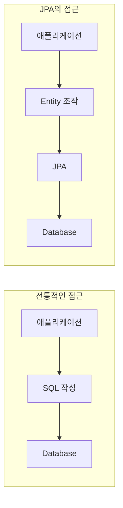

JPA를 사용하다 보면 "어라, 이건 왜 안 되지?"라는 순간을 마주하게 됩니다. SQL에서는 당연하게 사용하던 기능이 JPQL에서는 지원되지 않아 당황했던 경험, 아마 JPA를 사용해보신 분이라면 한 번쯤은 있으실 거라 생각합니다.

이 글에서는 JPA와 SQL 사이의 간극이 왜 존재하는지, 그리고 실무에서 이런 한계를 어떻게 극복할 수 있는지 제 경험을 바탕으로 이야기해보려 합니다.

## JPA가 추구하는 것

JPA와 SQL의 간극을 이해하려면, 먼저 JPA가 왜 만들어졌는지를 이해할 필요가 있다고 생각합니다.

JPA는 단순히 "SQL을 자바 코드로 감싸는 도구"가 아닌 것 같습니다. **객체 지향적인 방식으로 데이터를 다루자**는 철학을 가지고 설계된 것으로 보입니다.



제가 이해한 JPA의 핵심 설계 원칙을 정리하면 다음과 같습니다.

| 원칙 | 설명 |
|------|------|
| **엔티티 중심** | 테이블이 아닌 객체(Entity)를 중심으로 사고 |
| **데이터베이스 독립성** | 특정 DBMS에 종속되지 않는 추상화 계층 |
| **객체 그래프 탐색** | 연관 관계를 통한 자연스러운 데이터 접근 |
| **영속성 컨텍스트** | 1차 캐시, 변경 감지 등 객체 상태 관리 |

이런 철학 때문에 JPA(JPQL)는 의도적으로 SQL의 모든 기능을 지원하지 않는 것 같습니다. **"엔티티 중심의 사고를 했다면 이 기능이 필요할까?"** 라는 관점에서 설계된 게 아닐까 싶어요.

## JPQL에서 지원하지 않는 것들

그렇다면 JPQL에서 지원하지 않는 기능들에는 어떤 것들이 있을까요? 제가 실무에서 직접 마주쳤던 대표적인 케이스들을 살펴보겠습니다.

### 1. UNION / UNION ALL

SQL에서 `UNION`은 여러 쿼리 결과를 하나로 합치는 기본적인 기능입니다. 하지만 JPQL은 이를 지원하지 않습니다.

```sql
-- SQL에서는 가능
SELECT name, 'CUSTOMER' as type FROM customer
UNION ALL
SELECT name, 'PARTNER' as type FROM partner;
```

왜 지원하지 않을까요? 제가 생각해본 바로는, JPA 관점에서 **UNION은 서로 다른 테이블(엔티티)의 결과를 하나로 합치는 연산**입니다. 그런데 JPA는 엔티티 단위로 사고하도록 설계되었기 때문에, "Customer 엔티티와 Partner 엔티티를 합친다"는 개념 자체가 객체 지향적 관점에서는 어색할 수 있는 것 같습니다.

어떻게 보면 JPA가 이렇게 묻는 것 같기도 합니다.

> "왜 서로 다른 엔티티를 합쳐야 하죠? 상속 관계로 설계하면 안 되나요?"

물론 실무에서는 UNION이 필요한 상황이 분명히 있습니다. 레거시 테이블 구조를 다뤄야 하거나, 리포트 쿼리를 작성해야 하는 경우처럼요.

### 2. FROM 절 서브쿼리

SQL에서는 서브쿼리를 FROM 절에 넣어 임시 테이블처럼 사용할 수 있습니다.

```sql
-- SQL에서는 가능
SELECT *
FROM (
    SELECT user_id, SUM(amount) as total
    FROM orders
    GROUP BY user_id
) as user_totals
WHERE total > 10000;
```

JPQL에서는 이것이 불가능합니다. JPA는 **엔티티를 기준으로 쿼리**하기 때문에, "임시로 만들어진 결과 집합"을 대상으로 쿼리한다는 개념이 맞지 않는 것 같습니다.

### 3. 서브쿼리 내 LIMIT

SQL에서는 서브쿼리 내에서도 LIMIT을 사용할 수 있습니다.

```sql
-- SQL에서는 가능
SELECT *
FROM users u
WHERE u.id IN (
    SELECT o.user_id
    FROM orders o
    ORDER BY o.created_at DESC
    LIMIT 100
);
```

JPQL에서는 메인 쿼리에서만 `setMaxResults()`로 페이징이 가능하고, 서브쿼리 내에서는 불가능합니다.

### 4. INSERT 문

JPQL은 `INSERT`를 지원하지 않습니다. JPA에서 데이터를 저장하려면 `EntityManager.persist()`를 사용해야 하죠.

```java
// JPQL로는 불가능
// INSERT INTO User (name, email) VALUES ('홍길동', 'hong@example.com')

// JPA 방식
User user = new User("홍길동", "hong@example.com");
entityManager.persist(user);
```

이건 JPA의 설계 철학과 가장 맞닿아 있는 부분이라고 생각합니다. JPA는 **객체의 상태 변화를 추적하고, 그것을 DB에 반영**하는 방식으로 동작하기 때문에, 직접 INSERT 쿼리를 날리는 건 이 철학과 맞지 않는 것 같습니다.

## 왜 이런 설계를 했을까?

처음에는 "왜 이렇게 제한이 많지?"라고 생각했습니다. 하지만 JPA의 입장에서 생각해보면 나름의 이유가 있다고 느꼈습니다.

### 데이터베이스 독립성

JPA는 특정 DBMS에 종속되지 않는 것을 목표로 하는 것 같습니다. `LIMIT`은 MySQL 문법이고, Oracle에서는 `ROWNUM`이나 `FETCH FIRST`를 사용합니다. 모든 DBMS의 고유 기능을 다 지원하려면 추상화가 깨지게 되겠죠.

### 객체 그래프 중심 사고

JPA는 테이블 간의 JOIN보다 **엔티티 간의 연관 관계 탐색**을 권장하는 것 같습니다. `user.getOrders()`처럼 객체를 통해 관련 데이터에 접근하는 방식이죠.

```java
// JPA가 권장하는 방식
User user = entityManager.find(User.class, userId);
List<Order> orders = user.getOrders();  // Lazy Loading

// SQL 중심의 방식
SELECT * FROM users u JOIN orders o ON u.id = o.user_id WHERE u.id = ?
```

### 엔티티 설계의 강제

JPQL의 제약은 어떻게 보면 **"엔티티 설계를 더 잘 하라"는 강제**일 수도 있다고 생각합니다. UNION이 필요하다면 상속 구조로 설계할 수는 없는지, 서브쿼리가 필요하다면 연관 관계로 해결할 수는 없는지 고민하게 만드니까요.

## 그러나 요구사항은 언제든 변한다

위에서 JPA의 설계 철학을 설명했지만, 현실적인 개발 환경에서는 요구사항이 자주 변하며, 데이터베이스와 객체 간의 간극이 생기는 경우가 있습니다.

### 1. 내가 설계한 테이블이 아닐 때

프로젝트 초기부터 객체 지향적 설계를 기반으로 데이터베이스를 설계했다면, 간극은 좁아질 수 있습니다. 하지만 실무에서는 대부분 이미 설계된 테이블, 즉 **레거시 데이터베이스**를 다뤄야 할 때가 많습니다.

그럴때마다 **단지 JPA를 사용하기 위해서 스키마를 변경하고 데이터를 마이그레이션 해야하는 걸까요?**

저도 실무에서 이런 상황을 겪었습니다. 기존 시스템의 테이블 구조는 JPA 친화적이지 않았고, 테이블 구조 변경은 다른 시스템에도 영향을 주기 때문에 함부로 할 수 없었습니다.

### 2. 갑작스러운 요구사항 변경

요구사항은 항상 변합니다. 처음에는 단순했던 데이터 모델이 시간이 지나면서 복잡해지고, 비즈니스 로직이 변경되며 기존의 설계나 시스템에 영향을 미칠 수 있습니다. 이때 JPA가 제공하는 추상화 계층이 유연성을 확보하는 데 도움이 되기보다는 오히려 장애물이 되는 경우도 있다고 생각합니다.

만약 처음에는 단순히 "고객과 주문"이라는 두 개의 테이블만 처리하면 되었지만, 이후 주문 테이블에 "배송 상태", "결제 이력", "환불 처리" 등 추가 정보를 관리해야 하는 상황이 발생했다고 가정해보면 기존 설계를 유지하면서 데이터를 처리하기 위해 추가적인 엔티티나 관계 매핑이 필요하게 됩니다. 이러한 요구사항은 기존의 코드 전체에 영향을 미칠 수 있습니다. 특히, 연관 관계가 깊게 설정된 엔티티일수록 변경으로 인한 영향 범위가 기하급수적으로 커집니다.

### 3. 복잡한 쿼리 요구사항

기존의 단순한 데이터 조회에서 벗어나, 갑작스럽게 "가장 많이 구매한 고객", "특정 기간 내 주문 증가율" 등 비즈니스 인사이트를 위한 복잡한 집계 쿼리를 작성해야 할 때가 있습니다.

이럴때 JPQL은 위에 제약들로 복잡한 집계나 조건부 쿼리에 적합하지 않은 경우들이 있습니다. 특히, 서브쿼리, 조인, 그룹화, 윈도우 함수 등 SQL의 고급 기능을 활용하기 어려운 상황이 생깁니다.

이런 경우, 결국 다시금 Native Query로 돌아가야 합니다.

## 현실적인 대안들

그렇다면 실무에서는 이런 한계를 어떻게 극복할 수 있을까요? 제가 경험하거나 알아본 방법들을 공유해봅니다.

### 1. Native Query

가장 직접적인 방법은 **Native Query**입니다. JPA에서도 SQL을 직접 실행할 수 있도록 지원하죠.

```java
@Query(value = """
    SELECT name, 'CUSTOMER' as type FROM customer
    UNION ALL
    SELECT name, 'PARTNER' as type FROM partner
    """, nativeQuery = true)
List<Object[]> findAllNamesWithType();
```

**장점:**
- SQL의 모든 기능 사용 가능
- DBMS 고유 기능 활용 가능

**단점:**
- 데이터베이스 종속성 발생
- 타입 안전성 저하 (Object[] 반환)
- 엔티티 매핑의 이점을 활용하기 어려움

### 2. QueryDSL

QueryDSL은 타입 안전한 쿼리 빌더로, JPQL의 한계를 일부 보완해주는 것 같습니다.

```java
List<UserDto> users = queryFactory
    .select(Projections.constructor(UserDto.class,
        user.name,
        order.amount.sum()))
    .from(user)
    .join(user.orders, order)
    .groupBy(user.id)
    .fetch();
```

**장점:**
- 컴파일 타임 타입 체크
- IDE 자동완성 지원
- 동적 쿼리 작성이 편리

**단점:**
- JPQL의 한계를 완전히 벗어나지는 못함
- 추가 라이브러리 의존성
- 설정이 다소 복잡

### 3. MyBatis 병행 사용

복잡한 쿼리가 많은 프로젝트에서는 **JPA와 MyBatis를 함께 사용**하는 경우도 있습니다. CRUD는 JPA로, 복잡한 조회는 MyBatis로 처리하는 방식이죠.

**장점:**
- SQL의 완전한 제어권
- 복잡한 쿼리 작성이 용이

**단점:**
- 두 가지 기술 스택 관리 필요
- Connection 관리 주의 필요 (앞서 다룬 [HikariCP Deadlock 문제]() 참고)

### 4. View 또는 Stored Procedure

복잡한 쿼리 로직을 **Database View**나 **Stored Procedure**로 만들어두고, JPA에서는 이를 단순하게 호출하는 방식도 있습니다.

```java
@Entity
@Table(name = "user_order_summary_view")
public class UserOrderSummary {
    @Id
    private Long userId;
    private BigDecimal totalAmount;
    private Long orderCount;
}
```

**장점:**
- 복잡한 로직을 DB 레벨에서 캡슐화
- JPA에서는 단순한 엔티티로 취급 가능

**단점:**
- DB 종속성 증가
- 비즈니스 로직이 분산됨

## 어떤 방법을 선택해야 할까?

제 경험상 정답은 **"상황에 따라 다르다"**인 것 같습니다. 다만 몇 가지 기준을 제시해볼 수 있을 것 같아요.

| 상황 | 추천 방법 |
|------|----------|
| 단순 CRUD 중심의 애플리케이션 | JPA + QueryDSL |
| 복잡한 조회가 일부 있는 경우 | JPA + Native Query |
| 복잡한 조회가 많은 경우 | JPA + MyBatis 병행 |
| 리포트/통계 시스템 | MyBatis 또는 순수 JDBC |
| 레거시 DB 연동 | 상황에 따라 유연하게 |

중요한 건 **도구에 얽매이지 않는 것**이라고 생각합니다. JPA가 좋다고 모든 것을 JPA로 해결하려 하거나, SQL이 익숙하다고 JPA의 장점을 무시하는 건 바람직하지 않은 것 같아요.

## 정리

JPA와 SQL 사이의 간극은 **JPA의 설계 철학에서 비롯된 의도적인 제약**이라고 생각합니다. JPA는 데이터베이스 독립성과 객체 지향적 사고를 위해 SQL의 일부 기능을 지원하지 않기로 선택한 것 같습니다.

하지만 현실에서는 이런 제약이 문제가 되는 경우가 많습니다. 레거시 시스템, 복잡한 쿼리 요구사항, 성능 최적화 등의 이유로 SQL의 기능이 필요한 상황이 발생하기 마련이죠.

결국 중요한 건 **각 도구의 장단점을 이해하고, 상황에 맞는 적절한 방법을 선택**하는 것이 아닐까 싶습니다. JPA만 고집하지 않고, 필요할 때는 Native Query, QueryDSL, 또는 MyBatis 같은 도구를 유연하게 활용하는 것이 현실적인 접근법이라고 생각합니다.

---

### Reference
- [Hibernate ORM 공식 문서](https://hibernate.org/orm/documentation/)
- [JPA 스펙 (JSR 338)](https://jcp.org/en/jsr/detail?id=338)
- [QueryDSL Reference](http://querydsl.com/static/querydsl/latest/reference/html/)
