As developers, I think we all encounter moments when we find ourselves pondering about MSA (Microservices Architecture). Each time, we fall into various considerations.

I've also had moments of contemplating MSA before. However, it was mostly at the level of side projects or reading development articles—I had never actually experienced an MSA migration in a real work environment.

After joining my current company, I had the opportunity to experience MSA migration and operations firsthand. This has been a great opportunity to think through various considerations.

In this series, I'd like to organize the various thoughts and experiences I've had throughout this process and take some time to reflect on MSA once again.

## What is MSA?

What exactly is MSA? If you search for it, you'll commonly find definitions like this:

> MSA stands for Microservices Architecture, an architectural style that decomposes a single application into small, independent service units.

This sentence is the most common definition of MSA, and reading it now, I think this sentence pretty much says it all. However, the problem is that **fulfilling this definition requires countless considerations and choices**.

When first encountering MSA, people may react differently, but for me, questions like "Why?" and "How?" naturally came to mind.

So to understand MSA, I want to start by discussing why MSA emerged in the first place.

I believe most technologies emerge to solve **specific problems**. And by understanding the problem, we can also understand the essence of that technology to some extent.

MSA is no different—the background for MSA's emergence lies in the various limitations of the existing Monolithic Architecture.

So what is monolithic architecture? And what limitations led to the emergence of MSA?

### What is Monolithic Architecture?

Monolithic architecture is a traditional software development model where a single codebase is used to perform multiple business functions.

Simply put, it refers to an architectural style of **"putting all the code in one place."**

In traditional web application development, monolithic architecture was predominantly used. Since all features were included in a single codebase, development and deployment were relatively straightforward.

In fact, many companies still use monolithic architecture today. **Just because monolithic architecture has limitations doesn't mean MSA is always better.** Similarly, MSA also has its limitations, which I'll cover later.

So what limitations of monolithic architecture led to the emergence of MSA?

### Limitations of Monolithic Architecture

While monolithic architecture has the advantages of being simple and easy to develop, it has the following limitations:

#### 1. Difficulty in Scaling

Since monolithic architecture has all features on a single server, even if traffic surges to a specific feature, you had to redeploy the entire application to scale out.

For example, let's say I built a concert ticketing service, and one day ticket sales for a famous artist's concert began, causing traffic to surge to the order feature.

I decided to add more servers to handle the traffic and ensure stable service. Since only the order feature was expected to receive high traffic while other features would have normal traffic levels, I wanted to scale out only the order feature, add a load balancer, and distribute the traffic.

In this scenario, monolithic architecture doesn't allow you to scale out just the order feature. You had to redeploy the entire application to add servers, resulting in unnecessary resource waste.

```mermaid
flowchart TB
    LB[Load Balancer]

    subgraph Server1["Server 1"]
        direction TB
        subgraph S1R1[" "]
            direction LR
            S1_Order["💥 Order"]
            S1_Product["Product"]
        end
        subgraph S1R2[" "]
            direction LR
            S1_User["User"]
            S1_Payment["Payment"]
        end
    end

    subgraph Server2["Server 2"]
        direction TB
        subgraph S2R1[" "]
            direction LR
            S2_Order["💥 Order"]
            S2_Product["Product"]
        end
        subgraph S2R2[" "]
            direction LR
            S2_User["User"]
            S2_Payment["Payment"]
        end
    end

    LB --> Server1
    LB --> Server2

    Server1 --> DB[(Database)]
    Server2 --> DB
```

#### 2. Difficulty in Deployment

Also, since all features are included in a single codebase in monolithic architecture, even small changes require rebuilding and redeploying the entire application.

Let's assume a very small bug occurred only in the order feature in the diagram above. I wanted to quickly fix and deploy the bug.

Let's say the fix took less than 10 seconds, and running all unit tests for the order feature would only take 1 minute.

However, since the payment feature deals with money, it has more thorough test codes. Let's exaggerate a bit and say that running only the payment unit tests takes 30 minutes. In monolithic architecture, **to fix a very small bug in the order feature, you have to rebuild and redeploy the entire application**, so assuming tests are included in the build, you'd have to wait at least 30 minutes.

This leads to a decrease in productivity.

#### 3. Fault Isolation

Another problem is that **Fault Isolation** is difficult. Since a single application handles all features in monolithic architecture, if a failure occurs in the application, the entire service can be disrupted.

Let's use the concert ticketing service as an example again. Let's say the concert ticketing service had been running well until one day a failure suddenly occurred in the payment feature.

It's natural that payments wouldn't work since the payment feature failed, but the problem is that the failure in the payment feature caused resource overload, which in turn caused the entire application to slow down or crash.

The failure occurred in the payment feature, but in monolithic architecture, since the entire application is bound as a single process, a failure in the payment feature leads to a failure in the entire service.

Of course, you can handle infrastructure-level failures by running multiple servers with load balancers. However, **it's difficult to prevent fault propagation between modules running in the same process.** Infrastructure redundancy doesn't solve situations like memory leaks in the payment module affecting other modules in the same JVM, or an infinite loop in one module consuming the entire CPU.

#### 4. Technology Stack Constraints

Since monolithic architecture uses a single codebase, in most cases **it tends to be locked into a single programming language or framework.**

If it's a Spring Boot application based on JDK, all features must be written in Java or Kotlin. If it's a Node.js-based application, all features must be written in JavaScript or TypeScript.

This can create constraints that prevent using a more suitable technology stack for specific features. For example, Python might be more suitable for specific domains like data science or machine learning, but in monolithic architecture, since the entire application must be written in a single language, it's difficult to leverage this.

The same applies when hiring new developers. If a company operates a C++-based monolithic application, it can only hire C++ developers.

When a company becomes highly dependent on a specific technology stack, flexibility in the hiring market can decrease. This might sound like a corporate perspective, but from a company's standpoint, flexibility in the hiring market is an important issue connected to company revenue, so it's something that can't be ignored.

#### 5. Lack of Team Autonomy

Finally, monolithic architecture has the problem of lacking team autonomy. Since all features are included in a single codebase, **the likelihood of conflicts when multiple teams work simultaneously increases.**

If the number of developers working on the entire codebase is small, the problem might be less severe. But let's assume I'm a developer on a very large team.

In the concert ticketing service we discussed earlier, if there are 4 teams by feature and each team has 30 developers, a total of 120 developers would be working on a single codebase simultaneously.

How does that sound? Doesn't just hearing about it give you a headache thinking about resolving Git conflicts?

If there's a Util class commonly used across all features, conflicts are bound to occur frequently.

Also, resolving conflicts would require coordination and communication between teams, which could lead to decreased development speed.

---

## The Emergence of MSA

MSA emerged to overcome these limitations.

Most of the problems mentioned above had a common point: **"a single application handles all features."** So MSA emerged from the idea of "What if we divide a single application into multiple small services?"

Now I think you understand the "Why?" in the phrase **"an architectural style that decomposes a single application into small, independent service units"** from the definition of MSA above.

So how small and independent should services be decomposed? The most widely used criterion is DDD's Bounded Context, but I think there's no definitive answer. I'll cover this topic again later.

Getting back to the main topic—what advantages, disadvantages, and characteristics does MSA have?

### Advantages and Characteristics of MSA

**The advantages of MSA can be summarized as characteristics that solve the limitations of monolithic architecture discussed above.** Let's examine this assuming MSA is organized by feature units.

As shown in the diagram above, in MSA, if traffic surges only to orders, you can **scale out only the order service**. If a bug occurs in the order service, you can **build and deploy only the order service**. Even if a failure occurs in the order service, **other services are unaffected**, and the order service team can **develop independently without conflicts with the payment service team**.

Looking at it this way, MSA might seem like a perfect solution. **However, I think MSA also has clear disadvantages and limitations.**

### Disadvantages of MSA

First, **the first disadvantage I think of is that there's a learning curve**. With monolithic architecture, most developers have naturally been developing that way without additional study.

However, if you're reading this article, you're probably looking to learn about MSA, and I think this itself is evidence that MSA has a learning curve.

Also, **since MSA consists of multiple services, there's complexity of distributed systems.** Various complex problems can arise, including inter-service communication, data consistency issues, and network dependencies.

Naturally, as the number of services increases, operational difficulty also increases. Various operational tasks such as service monitoring, logging, and deployment pipeline management inevitably become more complex.

These questions will naturally come to mind:

- "What if I need both order and payment information?"
- "How do services communicate with each other?"
- "Won't network costs be too high as services increase?"
- "How do we manage common code?"
- "What about the database?"

I think these are natural questions. **The answers to these questions are the disadvantages and complexity of MSA, and are things that must be considered when adopting MSA.**

### Monolithic vs MSA Comparison

Here's a table summarizing the pros and cons of monolithic architecture and MSA:

| Item | Monolithic | MSA |
|------|-----------|-----|
| **Scaling** | Can only scale entire application | Independent scaling per service |
| **Deployment** | Full build/deploy even for small changes | Independent deployment per service |
| **Fault Isolation** | One module failure can propagate to all | Fault isolation per service |
| **Tech Stack** | Locked to single language/framework | Polyglot (optimal tech per service) |
| **Team Autonomy** | Frequent conflicts from shared codebase | High autonomy with independent codebases |
| **Initial Dev Speed** | Fast (can start development immediately) | Slow (design needed first) |
| **Learning Curve** | Low | High (distributed systems knowledge required) |
| **Operational Complexity** | Low (single application management) | High (monitoring/managing multiple services) |
| **Data Management** | Single DB, simple transactions | Distributed DB, complex data consistency |
| **Inter-service Communication** | Method calls (fast and reliable) | Network calls (latency, possible failures) |
| **Suitable For** | Small teams, early startups, simple domains | Large teams, complex domains, independent scaling needs |

As you can see from the table, **MSA is not superior to monolithic in every aspect.** In fact, monolithic is more advantageous in terms of initial development speed, learning curve, and operational complexity.

Ultimately, I think **which architecture is better depends on the situation—team size, service complexity, scaling requirements, etc.**

---

## Is MSA the Only Alternative to Monolithic?

So is MSA the only way to overcome monolithic limitations?

The answer is **no.** There are several intermediate points between monolithic and MSA. The most representative ones are **Modular Monolith** and **SOA (Service-Oriented Architecture)**.

### Modular Monolith

Modular monolith, as the name suggests, is **a way to clearly separate modules internally while maintaining monolithic architecture**. It's deployed as a single application, but internally, each module is designed to have clear boundaries and can be developed independently.

As shown in the diagram above, in a modular monolith, each module has its own API, domain, and repository, and **minimizes direct references between modules**. If the order module needs user information, instead of directly referencing the internal classes of the user module, it accesses through the public API provided by the user module.

What's good about this approach?

First, **you can maintain the simplicity of monolithic while reducing coupling between modules.** Since it's still a single application, deployment is simple and you can avoid the complexity of distributed systems. Transactions are still processed in a single DB, so there are no data consistency issues.

Also, **it becomes much easier to migrate to MSA later.** Since module boundaries are already clearly defined, separating a specific module into a separate service becomes relatively easy. I think going through modular monolith to MSA is a safer path than going directly from monolithic to MSA.

### SOA (Service-Oriented Architecture)

SOA is an architecture that emerged before MSA, and **is similar to MSA in that it separates systems into service units.** That's why MSA is sometimes called the evolution of SOA.

So what's different between SOA and MSA?

The biggest difference is **service size and communication method**. SOA has relatively large service units and handles inter-service communication through a centralized communication bus called **ESB (Enterprise Service Bus)**.

In SOA, the ESB handles message transformation, routing, and protocol conversion between services. Services don't communicate directly—they communicate through the ESB.

The advantage of this approach is that it can reduce coupling between services. However, **the ESB itself can become a Single Point of Failure (SPOF), and as business logic concentrates in the ESB, it tends to become increasingly complex.**

MSA can be seen as emerging to overcome these limitations of SOA. It uses **direct communication with lightweight protocols (REST, gRPC, etc.) instead of ESB**, **each service has its own database**, and **services are separated into smaller units**.

### Architecture Comparison

Here's a table summarizing the architectures we've discussed:

| | Monolithic | Modular Monolith | SOA | MSA |
|---|:---:|:---:|:---:|:---:|
| **Deployment Unit** | Single | Single | Per Service | Per Service |
| **Service Size** | - | - | Large | Small |
| **Communication** | Method Call | Method Call | ESB | Lightweight Protocol |
| **Database** | Shared | Shared | Can be Shared | Per Service |
| **Complexity** | Low | Medium | High | Very High |

### So Why MSA?

As you can see from the table, complexity increases as we move toward MSA. So why choose the complex MSA?

In my opinion, **the greatest value MSA provides is "independence."** Independent deployment, independent scaling, and independent development per service enable each team in large organizations to move autonomously and quickly. I think the reason large-scale services like Netflix, Amazon, and Coupang chose MSA is precisely because of this independence.

Even when developing, I think a lot about minimizing dependencies and abstraction. In my personal opinion, MSA is ultimately a form of abstraction and dependency minimization.

However, there's a price to pay for this independence. You have to accept various problems mentioned earlier, such as distributed system complexity, network dependencies, and data consistency issues.

That's why I personally **prefer transitioning as needed rather than starting with MSA from the beginning**.

There's a software development rule called YAGNI (You Aren't Gonna Need It). It means you should avoid making choices based on anticipating future needs rather than actual needs.

I think hastily adopting MSA can cause even greater pain due to the various problems mentioned earlier and poorly defined service boundaries.

So when should you choose MSA, and when should you avoid it? I'll cover this question in detail in the final episode of this series.

---

## In the Next Episode

We've explored what MSA is, why it emerged, and what alternatives exist.

Now, let's assume you and I have chosen MSA, and it's time to face the first practical problem.

**How will services communicate with each other?**

In the next episode, I'll discuss inter-service communication methods (synchronous/asynchronous, REST/gRPC/message queues) and the trade-offs of each.

Next: [[Reflections on MSA 2/6] Inter-Service Communication in MSA - How Should We Do It?]()
