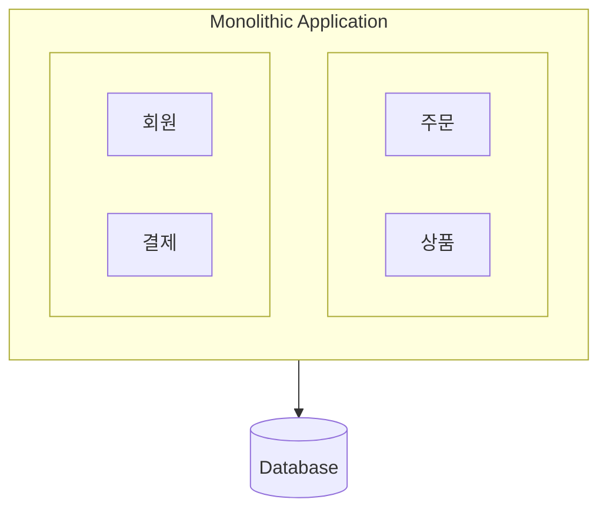
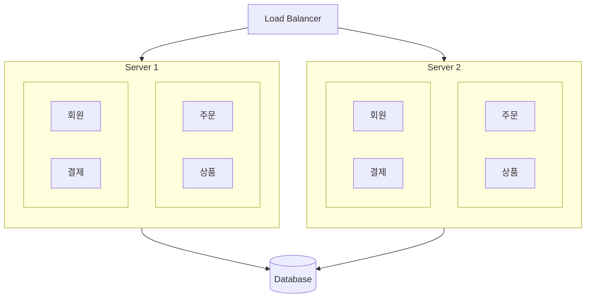
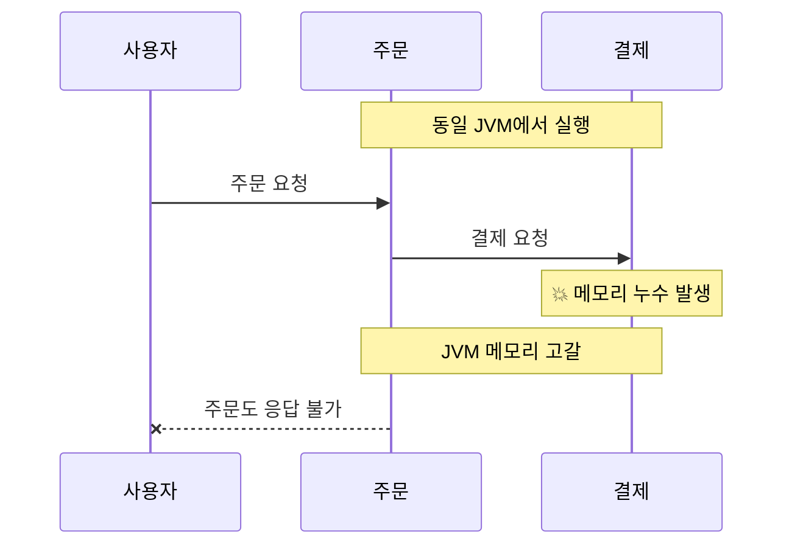
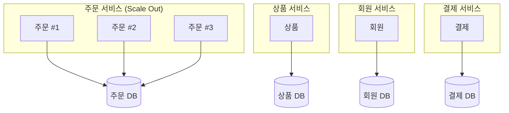
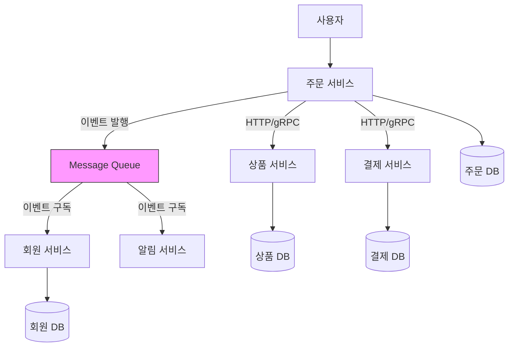
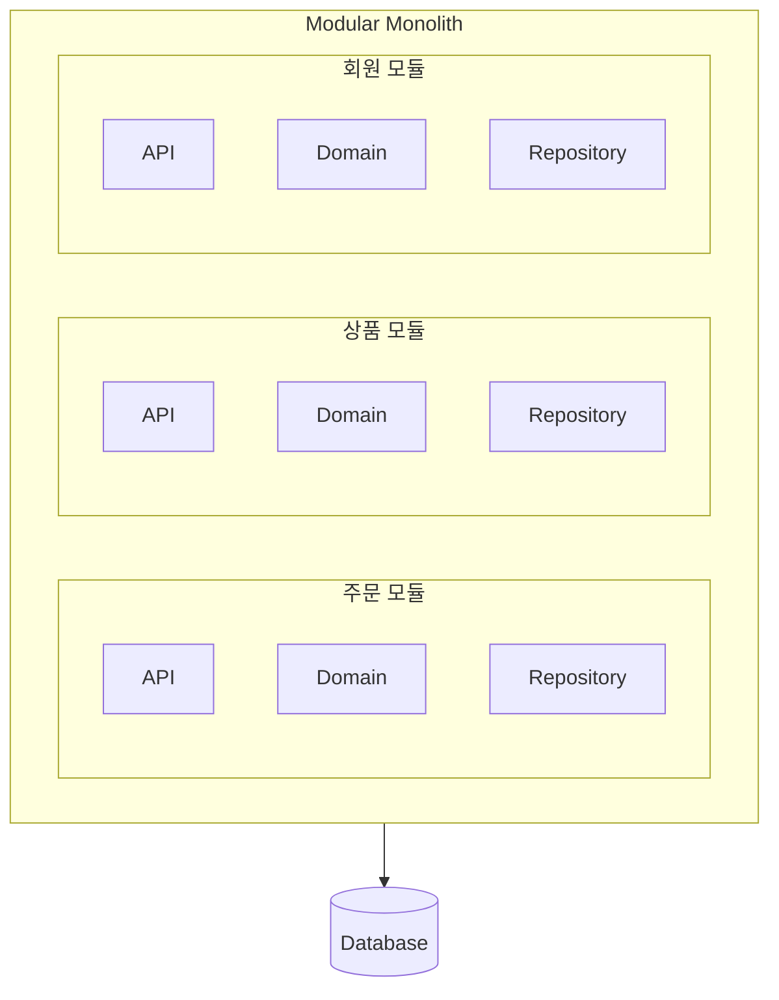
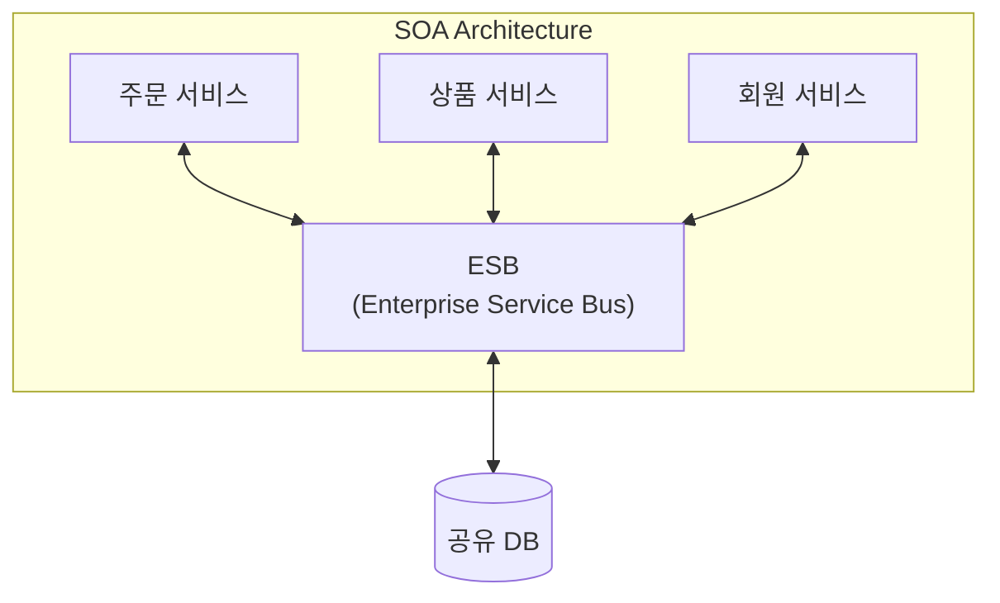

개발을 하다보면 MSA(Microservices Architecture)에 대해 고민하는 순간들이 간혹 찾아온다고 생각합니다. 그런 순간마다 여러 고민에 빠지게 되죠.

저 역시 그 전에는 MSA에 대해 고민을 하게 되는 순간들이 있었습니다. 다만 사이드 프로젝트 수준, 혹은 개발 아티클에서 접하는 수준에서의 고민이었지 실제 업무에서 MSA 전환을 겪어본 적은 없었습니다.

현재 회사로 이직하면서 MSA로의 전환 및 운영 경험을 겪게 되었고 덕분에 여러 고민을 할 수 있는 좋은 기회가 되었습니다.

이번에 제가 그 과정에서 했던 여러 고민들과 경험들을 스스로 정리하며 MSA에 대해 다시 한번 생각해보는 시간을 가져보고자 합니다.

## MSA란 무엇인가?

MSA란 뭘까요? 흔히 검색해보면 다음과 같은 정의가 나옵니다.

>MSA란 마이크로서비스 아키텍처(Microservices Architecture)의 약자로, 하나의 애플리케이션을 작고 독립적인 서비스 단위로 분해하는 아키텍처 스타일을 의미합니다. 

위 문장이 MSA를 정의하는 가장 일반적인 문장인데 이렇게 읽고 보니 사실 위 문장이 전부라고 해도 과언이 아닐 것 같다는 생각이 듭니다. 다만 문제는 **위 문장을 지키기 위해선 수많은 고민과 선택이 필요하다는 점**인 것 같습니다.

처음 MSA에 대해 접하게 되면 사람마다 다르겠지만 저는 "어째서?", "어떻게?" 라는 질문이 자연스럽게 떠올랐습니다.

그래서 MSA를 이해하기 위해 어째서 MSA가 등장하게 되었는지부터 이야기를 시작해보려합니다.

대부분의 기술은 **어떤 특정한 문제**를 해결하기 위해 등장한다고 생각합니다. 그리고 문제를 이해하면 그 기술이 가지는 본질도 어느정도 이해할 수 있다고 저는 생각합니다.

MSA 역시 마찬가지인데, MSA가 등장하게 된 배경에는 기존의 모놀리식 아키텍처(Monolithic Architecture)가 가진 여러 한계점들에 있었습니다.

그럼 모놀리식 아키텍처는 뭘까요? 그리고 어떤 한계점이 있어 MSA가 등장하게 되었을까요?

### 모놀리식 아키텍처란

모놀리식 아키텍처란 하나의 코드 베이스를 사용하여 여러 비즈니스 기능을 수행하는 전통적인 소프트웨어 개발 모델입니다.

쉽게 말하자면 **"모든 코드를 한 곳에 다 때려박는"** 형태의 아키텍처 스타일을 의미합니다.

과거 전통적인 웹 애플리케이션 개발에서는 모놀리식 아키텍처가 주로 사용되었습니다. 모든 기능이 하나의 코드베이스에 포함되어 있어 개발과 배포가 비교적 간단했죠.

사실 지금도 많은 회사에서 모놀리식 아키텍처를 사용하고 있습니다. **모놀리식 아키텍처에 한계점이 있다고 해서 무조건 MSA가 더 좋은 것은 아니기 때문입니다.** 마찬가지로 MSA에도 한계점이 존재하지만 이는 후에 다루도록 하겠습니다.

그렇다면 모놀리식 아키텍처의 어떤 한계점들이 MSA의 등장을 이끌었을까요?

### 모놀리식의 한계

모놀리식 아키텍처는 단순하고 개발이 쉬운 장점이 있지만, 다음과 같은 한계점들이 존재합니다. 

#### 1. 스케일링의 어려움

모놀리식 아키텍처는 하나의 서버에 모든 기능이 올라가 있었기 때문에, 특정 기능에 트래픽이 몰리더라도 스케일 아웃을 하기 위해서는 전체 애플리케이션을 새로 배포해야 했습니다.

예를 들어 제가 만든 콘서트 예매 서비스에서 어느날 유명한 가수의 콘서트 티켓 예매가 시작되었고, 주문 기능에 트래픽이 몰리게 되었다고 가정해보겠습니다.

저는 안정적인 서비스를 위해 트래픽을 대비해 서버를 늘리기로 결정했습니다. 주문 기능에만 트래픽이 몰릴 예정이고 다른 기능들은 평소와 비슷한 트래픽이 예상되었기 때문에 주문 기능만 스케일 아웃해 로드밸런서를 달고 트래픽을 분산시키고자 했습니다.

이랬을 때 모놀리식 아키텍처에서는 주문 기능만 스케일 아웃을 할 수 없습니다. 전체 애플리케이션을 새로 배포해 서버를 늘려야 했기 때문에 불필요한 리소스 낭비가 발생하게 됩니다.

#### 2. 배포의 어려움

또 모놀리식 아키텍처에서는 모든 기능이 하나의 코드베이스에 포함되어 있기 때문에, 작은 변경 사항이라도 전체 애플리케이션을 다시 빌드하고 배포해야 합니다.

위 다이어그램에서 주문 기능에만 아주 작은 버그가 발생했다고 가정해보겠습니다. 저는 빠르게 해당 버그를 수정하고 배포하고자 했습니다.

고치는데는 10초도 걸리지 않았고 주문 기능의 단위 테스트 전체를 돌려도 1분이면 충분했다고 가정해보겠습니다.

하지만 결제 기능은 돈과 관련된 부분이다 보니 더 꼼꼼한 테스트 코드들이 많았고 약간 과장하여 결제의 단위 테스트만 돌려도 30분이 걸린다고 가정해보면 모놀리식 아키텍처에서는 주문 기능의 **아주 작은 버그를 고치기 위해 전체 애플리케이션을 다시 빌드하고 배포해야** 하기 때문에 빌드에 테스트가 포함된다는 전제하에 최소 30분은 기다려야 했습니다. 

이는 생산성의 저하로 이어지는 문제가 발생하게 됩니다.

#### 3. 장애 격리(Fault Isolation)

또 다른 문제로는 **장애 격리(Fault Isolation)** 가 어렵다는 점입니다. 모놀리식 아키텍처에서는 하나의 애플리케이션이 모든 기능을 담당하기 때문에, 애플리케이션에 장애가 발생하면 전체 서비스가 중단되는 문제가 발생할 수 있습니다.

이번에도 역시 콘서트 예매 서비스를 예로 들어보겠습니다. 이제까지 잘 운영 되던 콘서트 예매 서비스에 어느날 갑자기 결제 기능에 장애가 발생했다고 가정해보겠습니다.

결제에 장애가 발생했으니 결제가 안되는건 당연한 일이지만 문제는 결제 기능에 장애가 발생하면서 리소스 과부하가 걸리게 되었고, 이로 인해 전체 애플리케이션이 느려지거나 다운되는 문제가 발생하게 되었다고 가정해보겠습니다.

장애가 발생한건 결제 기능이지만 모놀리식 아키텍처에서는 전체 애플리케이션이 하나의 프로세스로 묶여있기 때문에 결제 기능의 장애가 전체 서비스 장애로 이어지게 됩니다.

물론 서버를 여러 대 띄우고 로드밸런서를 달아 인프라 레벨의 장애에는 대응할 수 있습니다. 하지만 **같은 프로세스 안에서 실행되는 모듈 간의 장애 전파는 막기 어렵습니다.** 결제 모듈의 메모리 누수가 같은 JVM의 다른 모듈에 영향을 주거나, 한 모듈의 무한루프가 전체 CPU를 점유하는 상황은 인프라 다중화로 해결되지 않기 때문입니다.

#### 4. 기술 스택의 제약

모놀리식 아키텍처는 하나의 코드베이스를 사용하기 때문에, 대부분의 경우 **하나의 프로그래밍 언어나 프레임워크에 종속되는 경향이 있습니다.** 

JDK를 기반으로 한 Spring Boot 애플리케이션이라면 모든 기능이 Java 혹은 Kotlin으로 작성되어야 하며, Node.js 기반의 애플리케이션이라면 모든 기능이 JavaScript 혹은 TypeScript로 작성되어야 합니다.

이로 인해 특정 기능에 더 적합한 기술 스택을 사용하지 못하는 제약이 발생할 수 있습니다. 예를 들어, 데이터 과학이나 머신러닝과 같은 특정 도메인에서는 Python이 더 적합할 수 있지만, 모놀리식 아키텍처에서는 전체 애플리케이션이 하나의 언어로 작성되어야 하기 때문에 이를 활용하기 어렵습니다.

또 회사에서 신규로 개발자를 채용할 때도 마찬가지입니다. 만약 회사가 C++ 기반의 모놀리식 애플리케이션을 운영하고 있다면, C++ 개발자만 채용할 수밖에 없는 제약이 발생하게 됩니다.

회사가 특정 기술 스택에 대한 의존도가 높아지면 채용 시장에서의 유연성이 떨어질 수 있습니다. 굉장히 사측인 것 같은 발언이긴 하지만 회사 입장에서는 채용 시장에서의 유연성은 회사 수익과도 연결되는 중요한 문제이기 때문에 무시할 수 없는 부분이라고 생각합니다.

#### 5. 팀 자율성의 부족

마지막으로 모놀리식 아키텍처에서는 팀 자율성이 부족하다는 문제가 있습니다. 모든 기능이 하나의 코드베이스에 포함되어 있기 때문에, **여러 팀이 동시에 작업할 때 충돌이 발생할 가능성이 높아집니다.**

전체 코드베이스를 작업하는 개발자 수가 적으면 문제가 덜할 수 있지만, 만약 제가 엄청난 규모의 팀에 속한 개발자라고 가정해보겠습니다.

앞서 본 콘서트 예매 서비스에서 기능별로 팀이 총 4개, 각 팀의 개발자가 30명이라고 가정해보면 총 120명의 개발자가 하나의 코드베이스를 동시에 작업하게 됩니다.

어떠신가요? 듣기만해도 Git Conflict를 해결해야할 생각에 머리가 지끈거리진 않으신가요?

만약 모든 기능에서 공통으로 쓰이는 Util 클래스라도 있다면 충돌이 빈번하게 발생할 수밖에 없습니다.

또 충돌을 해결하기 위해서는 팀 간의 조율과 커뮤니케이션 과정이 필수적이게 될 것이고, 이는 개발 속도의 저하로 이어질 수 있을 겁니다.

---

## MSA의 등장

이러한 한계점들을 극복하기 위해 MSA가 등장하게 되었습니다.

위 문제점들의 대부분은 **"하나의 애플리케이션이 모든 기능을 담당한다"** 는 공통점이 있었습니다. 그렇다면 "하나의 애플리케이션을 여러 개의 작은 서비스로 나누면 어떨까?" 라는 생각에서 MSA가 등장하게 되었습니다.

이제 위에 MSA의 정의에 나왔던 문장 중 일부인 **"하나의 애플리케이션을 작고 독립적인 서비스 단위로 분해하는 아키텍처 스타일"** 이라는 문장에 "어째서?"는 이해가 되셨을 거라 생각합니다.

그렇다면 어느정도까지 작고 독립적인 서비스 단위로 분해해야 할까요? 가장 널리 사용되는 기준은 DDD의 Bounded Context입니다만 정답은 없다고 생각합니다. 이 부분은 후에 다시 다루도록 하겠습니다.

다시 본론으로 돌아와서 그럼 MSA는 어떤 장단점과 특성을 가지고 있을까요?

### MSA의 장점과 특성

**MSA의 장점은 위에서 이야기한 모놀리식의 한계점들을 해결하는 특성**들로 요약할 수 있습니다. 기능 단위로 MSA를 구성했다고 가정하고 살펴보겠습니다.

위 다이어그램처럼 MSA에서는 주문에만 트래픽이 몰리면 **주문 서비스만 스케일 아웃**할 수 있고, 주문 서비스에 버그가 발생하면 **주문 서비스만 빌드하고 배포**할 수 있습니다. 주문 서비스에 장애가 발생해도 **다른 서비스에는 영향이 없고**, 주문 서비스 팀은 **결제 서비스 팀과 충돌 없이 독립적으로 개발**할 수 있습니다.

이렇게 보면 MSA가 완벽한 해결책처럼 보이기도 합니다. **하지만 MSA에도 단점과 한계점들이 명확히 존재한다고 생각합니다.**

### MSA의 단점

우선 **제가 생각하는 첫번째 단점은 러닝커브가 존재**한다는 점입니다. 모놀리식 아키텍처는 따로 공부하지 않으셔도 자연스레 이미 그렇게 개발을 하고 계셨던 개발자분들이 대부분이실 겁니다.

그러나 지금 이 글을 찾아보신 분들이라면 MSA를 학습하기 위해 찾아보신 분들이 대부분이실텐데, 이것부터가 MSA의 러닝커브가 존재한다는 증거라고 생각합니다.

또 **MSA는 여러 서비스로 구성되기 때문에 분산 시스템의 복잡성이 존재합니다.** 서비스 간의 통신, 데이터 일관성 문제, 네트워크 의존성 등 여러 가지 복잡한 문제들이 발생할 수 있습니다.

당연하게도 서비스가 늘어난만큼 운영 난이도도 높아집니다. 서비스 모니터링, 로깅, 배포 파이프라인 관리 등 여러 가지 운영 작업들이 복잡해질 수밖에 없습니다.

이런 질문들이 자연스럽게 떠오르실 겁니다.

- "주문이랑 결제 정보 둘다 필요한 경우 어떻게 하지?"
- "서비스 간 통신은 어떻게 하지?"
- "서비스가 많아지면 네트워크 비용이 너무 많이 들지 않을까?"
- "공통 코드들은 어떻게 관리하지?"
- "DB는 어떻게 하지?"

당연한 질문들이라고 생각합니다. **이런 질문들에 대한 답변들이 MSA의 단점이자 복잡성이고 MSA를 도입할 때 반드시 고려해야 할 부분들이라고 생각합니다.**

### 모놀리식 vs MSA 비교

모놀리식 아키텍처와 MSA의 장단점을 표로 정리해보면 다음과 같습니다.

| 항목 | 모놀리식 | MSA                       |
|------|----------|---------------------------|
| **스케일링** | 전체 애플리케이션 단위로만 확장 | 서비스 단위 독립적 확장 가능          |
| **배포** | 작은 변경도 전체 빌드/배포 필요 | 서비스별 독립 배포 가능             |
| **장애 격리** | 한 모듈 장애가 전체로 전파 가능 | 서비스 단위로 장애 격리             |
| **기술 스택** | 단일 언어/프레임워크 종속 | Polyglot (서비스별 최적 기술 선택)  |
| **팀 자율성** | 코드베이스 공유로 충돌 빈번 | 독립적 코드베이스로 자율성 높음         |
| **초기 개발 속도** | 빠름 (바로 개발 시작 가능) | 느림 (설계 선행 필요)             |
| **러닝커브** | 낮음 | 높음 (분산 시스템 이해 필요)         |
| **운영 복잡도** | 낮음 (단일 애플리케이션 관리) | 높음 (다수 서비스 모니터링/관리)       |
| **데이터 관리** | 단일 DB, 트랜잭션 간단 | 분산 DB, 데이터 일관성 복잡         |
| **서비스 간 통신** | 메서드 호출 (빠르고 안정적) | 네트워크 호출 (지연, 실패 가능)       |
| **적합한 상황** | 소규모 팀, 초기 스타트업, 단순한 도메인 | 대규모 팀, 복잡한 도메인, 독립적 확장 필요 |

표를 보시면 아시겠지만, **MSA가 모놀리식보다 모든 면에서 우월한 것은 아닙니다.** 오히려 초기 개발 속도, 러닝커브, 운영 복잡도 측면에서는 모놀리식이 더 유리합니다.

결국 **어떤 아키텍처가 더 좋은지는 팀의 규모, 서비스의 복잡도, 확장 요구사항 등 상황에 따라 달라진다**고 생각합니다.

---

## MSA만이 모놀리식을 대체할 수 있는가?

그렇다면 모놀리식의 한계를 극복하기 위한 방법은 MSA뿐일까요?

결론부터 말씀드리자면 **그렇지 않습니다.** 모놀리식과 MSA 사이에는 여러 중간 지점이 존재합니다. 대표적으로 **모듈러 모놀리식(Modular Monolith)** 과 **SOA(Service-Oriented Architecture)** 가 있죠.

### 모듈러 모놀리식 (Modular Monolith)

모듈러 모놀리식은 이름 그대로 **모놀리식 아키텍처를 유지하면서도 내부적으로 모듈을 명확하게 분리하는 방식**입니다. 하나의 애플리케이션으로 배포되지만, 내부적으로는 각 모듈이 명확한 경계를 가지고 독립적으로 개발될 수 있도록 설계하는 것이죠.

위 다이어그램처럼 모듈러 모놀리식에서는 각 모듈이 자신만의 API, 도메인, 레포지토리를 가지며 **모듈 간의 직접적인 참조를 최소화**합니다. 주문 모듈이 회원 정보가 필요하다면 회원 모듈의 내부 클래스를 직접 참조하는 것이 아니라, 회원 모듈이 제공하는 공개 API를 통해 접근하는 방식이죠.

이렇게 하면 뭐가 좋을까요?

우선 **모놀리식의 단순함을 유지하면서도 모듈 간의 결합도를 낮출 수 있습니다.** 여전히 하나의 애플리케이션이기 때문에 배포가 간단하고, 분산 시스템의 복잡성을 피할 수 있습니다. 트랜잭션도 여전히 단일 DB에서 처리되기 때문에 데이터 일관성 문제도 없죠.

또한 **나중에 MSA로 전환하기가 훨씬 수월해집니다.** 이미 모듈 간의 경계가 명확하게 나뉘어 있기 때문에, 특정 모듈을 별도의 서비스로 분리하는 것이 상대적으로 쉬워집니다. 모놀리식에서 바로 MSA로 전환하는 것보다 모듈러 모놀리식을 거쳐 MSA로 전환하는 것이 더 안전한 경로라고 생각합니다.

### SOA (Service-Oriented Architecture)

SOA는 MSA보다 먼저 등장한 아키텍처로, **서비스 단위로 시스템을 분리한다는 점에서 MSA와 유사**합니다. 그래서 MSA를 SOA의 진화형이라고 부르기도 하죠.

그렇다면 SOA와 MSA는 뭐가 다를까요?

가장 큰 차이점은 **서비스의 크기와 통신 방식**입니다. SOA는 상대적으로 큰 단위의 서비스를 가지며, **ESB(Enterprise Service Bus)** 라는 중앙 집중식 통신 버스를 통해 서비스 간 통신을 처리합니다.

SOA에서는 ESB가 서비스 간의 메시지 변환, 라우팅, 프로토콜 변환 등을 담당합니다. 서비스들이 직접 통신하는 것이 아니라 ESB를 통해 통신하는 것이죠.

이 방식의 장점은 서비스 간의 결합도를 낮출 수 있다는 점입니다. 하지만 **ESB 자체가 단일 장애 지점(SPOF)이 될 수 있고, ESB에 비즈니스 로직이 집중되면서 점점 복잡해지는 문제**가 발생하기도 했습니다.

MSA는 이런 SOA의 한계를 극복하기 위해 등장했다고 볼 수 있습니다. **ESB 대신 경량 프로토콜(REST, gRPC 등)을 사용한 직접 통신**을 하고, **각 서비스가 자신만의 데이터베이스를 가지며**, **더 작은 단위의 서비스**로 분리합니다.

### 아키텍처 비교

지금까지 설명한 아키텍처들을 표로 정리해보면 다음과 같습니다.

| | 모놀리식 | 모듈러 모놀리식 | SOA | MSA |
|---|:---:|:---:|:---:|:---:|
| **배포 단위** | 단일 | 단일 | 서비스별 | 서비스별 |
| **서비스 크기** | - | - | 대규모 | 소규모 |
| **통신 방식** | 메서드 호출 | 메서드 호출 | ESB | 경량 프로토콜 |
| **데이터베이스** | 공유 | 공유 | 공유 가능 | 서비스별 분리 |
| **복잡도** | 낮음 | 중간 | 높음 | 매우 높음 |

### 그렇다면 왜 MSA인가?

표를 보시면 MSA로 갈수록 복잡도가 높아지는 것을 알 수 있습니다. 그렇다면 왜 굳이 복잡한 MSA를 선택하는 걸까요?

제가 생각하는 **MSA가 주는 가장 큰 가치는 바로 "독립성"입니다.** 서비스별 독립 배포, 독립 확장, 독립 개발이 가능해지면서 대규모 조직에서 각 팀이 자율적으로 빠르게 움직일 수 있게 됩니다. 넷플릭스, 아마존, 쿠팡 같은 대규모 서비스들이 MSA를 선택한 이유도 바로 이 독립성 때문이라고 생각합니다.

개발을 할 때도 의존성을 최소화하는 방향과 추상화에 대해 많이 고민하는데, 제 개인적인 생각에는 MSA도 결국에는 추상화와 의존성 최소화의 형태 중 하나라고 생각합니다.

하지만 이 독립성을 얻기 위해 치러야 하는 대가가 있습니다. 분산 시스템의 복잡성, 네트워크 의존성, 데이터 일관성 문제 등 앞서 언급한 여러 문제들을 감수해야 합니다.

그래서 저는 개인적으로 **처음부터 MSA로 시작하는 것보다 필요에 따라 전환하는 방식을 선호**합니다. 

소프트웨어 개발 규칙 중 YAGNI(You Aren't Gonna Need It)라는 규칙이 있습니다. 즉 필요에 의해 한 선택이 아닌 미리 필요할 것이라고 예상하여 선택하는 것은 되도록 피하라는 뜻이죠.

섣불리 MSA를 도입하면 앞서 언급한 여러 문제들과 잘못 나눈 서비스 경계 때문에 오히려 더 큰 고통을 겪을 수 있다고 생각합니다.

그렇다면 언제 MSA를 선택해야 하고, 언제 피해야 할까요? 이 질문에 대한 답은 시리즈의 마지막 편에서 자세히 다루겠습니다.

---

## 다음 편에서

MSA가 무엇인지, 왜 등장했는지, 그리고 어떤 대안들이 있는지 알아보았습니다.

그렇다면 이제 만약 저와 여러분들이 MSA를 선택했다고 가정하고, 첫 번째 현실적인 문제와 마주할 시간입니다.

**서비스들은 서로 어떻게 대화할 것인가?**

다음 편에서는 서비스 간 통신 방식(동기/비동기, REST/gRPC/메시지 큐)과 각각의 트레이드오프에 대해 이야기해보려합니다.
