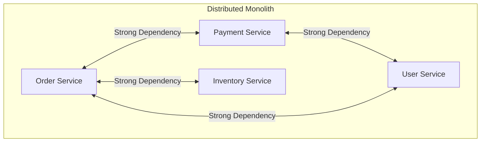
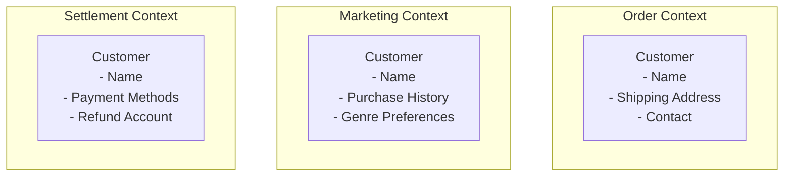
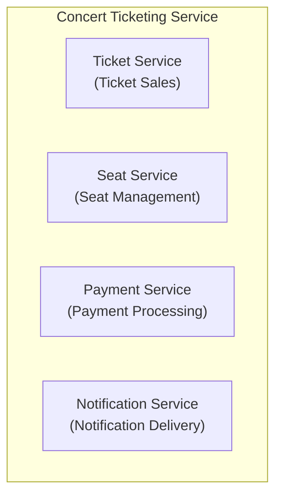
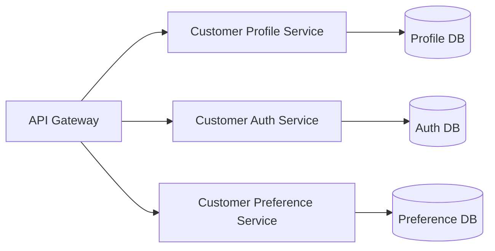
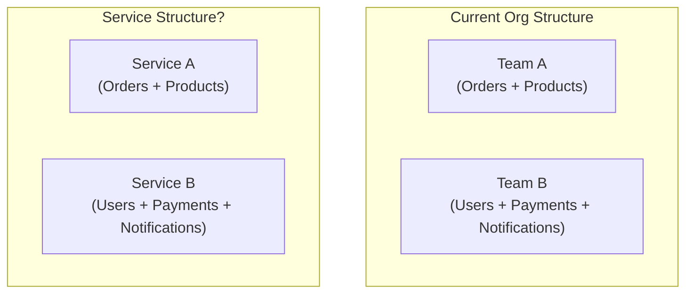
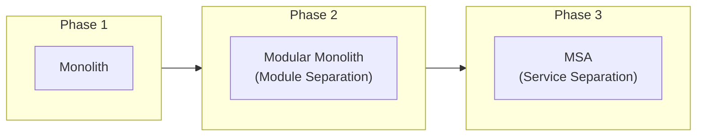

Previous: [[Reflections on MSA 1/6] What is MSA (Microservices Architecture)?]()

---

In the previous episode, we explored the concept of MSA, its background, and various alternatives.

If you've decided to adopt MSA, you now face the first question.

**"How do we divide services?"**

Why is this question important? To be honest, I think this is **the most difficult and important decision** in MSA. Communication patterns or failure handling strategies can be changed later, but once service boundaries are set, they're really hard to change.

## What Happens When We Divide Wrong?

Before diving into "how to divide," I want to first look at what happens when we divide incorrectly. I believe understanding the problem helps us better see the solution.

### The Pain of Distributed Monolith

There are cases where transitioning to MSA actually makes things harder. This happens when you fall into a **Distributed Monolith**.

Let's use a concert ticketing service as an example. Suppose we transitioned from monolithic to MSA by separating order, payment, inventory, and user services.



What happens when boundaries are poorly defined?

- To modify the order feature, you must also modify payment and inventory services
- To deploy the order service, you must also deploy payment and inventory services
- When the payment service fails, orders and user lookups are all affected

How does that sound? **It's the worst of both worlds—the downsides of monolithic (deploy together, fail together) combined with MSA's downsides (network complexity, distributed transactions)**.

The core problem isn't the number of services. It's the **tightly coupled structure at runtime**. This situation arises when synchronous calls chain together, data models are shared, and transactions span multiple services.

I experienced a similar situation when I joined my team. Services were separated, but modifying one feature required touching multiple services simultaneously. There were moments when I thought, "Is this really MSA?"

### Why Is Setting Boundaries Especially Difficult?

So why is it so hard to properly divide service boundaries?

First, **deep domain understanding is required**. To know which features should be together and which should be separate, you need to truly understand the business. But domain understanding is often lacking in the early stages of a project.

Second, **there's no right answer**. Communication methods have somewhat standardized guides like "use gRPC internally, REST externally," but I think service boundaries vary by business, team, and situation.

Third, **if you design without considering boundary changes early on, it becomes really hard to change later**. I think this is the biggest problem.

### Why Is It Hard to Change?

What does it take to change service boundaries later?

- **Data Migration**: You need to merge data from separated DBs or split a single DB
- **API Changes**: The APIs that other services were calling change. The callers all need to be modified too
- **Event Redesign**: The events being published and subscribed change
- **Deployment Strategy**: You need to figure out how to transition between old and new services

It's not simple refactoring. In my experience, changing service boundaries was sometimes harder than building from scratch. When developing, there are moments when you think "it would be faster to just rebuild from the beginning"—boundary changes often fell into that category.

So I believe **setting boundaries well initially is important, but maintaining a structure that's easy to change is equally important**. There's no such thing as perfect boundaries. It seems realistic to at least get the big direction right while leaving room for adjustments later.

So how should we set service boundaries?

## What Criteria Should We Use to Divide?

There are various criteria for dividing services. But before discussing criteria, I want to ask one question first.

**"Why do we need criteria?"**

Can't we just divide by feel, or by team structure?

Unfortunately, doing so likely leads to the Distributed Monolith we saw earlier. Tightly coupled features end up in different services, or unrelated features get bundled into one service.

That's why we need criteria to judge **"what should be together and what should be separate."**

### DDD and Bounded Context

When discussing service boundaries, the most frequently mentioned concepts are **DDD (Domain-Driven Design)** and **Bounded Context**.

When I first encountered these concepts, honestly they didn't click. Bounded Context being "a boundary where the same term has the same meaning"—I wondered what that even meant.

Let me explain with an example. In a concert ticketing service, think about the term **"customer."**

- In the **order context**, a customer is: someone who buys tickets, someone with shipping address information
- In the **marketing context**, a customer is: a marketing target, someone with purchase history and genre preferences
- In the **settlement context**, a customer is: someone with payment methods, a refund recipient



Same term "customer," but each context cares about different attributes and behaviors. The order context doesn't care about marketing preferences, and the marketing context doesn't need payment methods.

**The point where the same term is used with different meanings—that's the boundary of a context.** And this Bounded Context can be a natural criterion for dividing services.

However, there's one thing to note. **A Bounded Context doesn't automatically become a single microservice.** Multiple contexts can coexist in one service, or conversely, one context can be implemented across multiple services. I think Bounded Context gives us a hint that "dividing this way would be natural," not a mandate for 1:1 mapping.

So can we divide service boundaries well just by knowing Bounded Context?

### Business Capability-Based Decomposition

If Bounded Context looks at boundaries from a **domain model** perspective, **Business Capability** approaches from a different angle—the perspective of **"what does this business do?"**

Simply put, Business Capability means "the things this business does to create value." What capabilities would a concert ticketing service have?

- **Ticket Sales**: The capability to sell concert tickets
- **Seat Management**: The capability to manage seat arrangements and availability
- **Payment Processing**: The capability to process payments and handle refunds
- **Notification Delivery**: The capability to send notifications to users



Both Bounded Context and Business Capability can serve as criteria for dividing service boundaries. So which should we use?

In my experience, **using both together** was effective. Draw the big picture with Business Capability first, then validate detailed boundaries with Bounded Context. Check "Is this capability really one context? Or are multiple contexts mixed?"

### Conway's Law

There's one more thing to consider here: **organizational structure**.

> "Organizations which design systems are constrained to produce designs which are copies of the communication structures of these organizations."
> - Melvin Conway, 1967

When I first heard this law, I thought, "Isn't that obvious?" But experiencing MSA made me feel the weight of this law.

For example, if the order team and payment team are separate, there's a high chance that order service and payment service will naturally be separated. Conversely, if one team handles both orders and payments, the two features are likely to end up in one service.

The problem is that **organizational structure isn't always rational**. Sometimes irrational team structures persist for historical or political reasons.

That's why the concept of **Inverse Conway Maneuver** emerged—**changing the organizational structure first** to match the desired system structure.

Of course, changing organizational structure isn't easy. But rather than resigning ourselves to "our team structure is like this, so we have no choice but to divide it this way," I think it's better to first envision "what would the ideal system structure be?" and also consider organizational changes.

## Thoughts on Service Size

Alright, you probably have some sense of what criteria to use for division now. But another concern remains.

**"How small should we divide?"**

Perhaps because of the name "microservices," some people seem to think services should be divided as small as possible. But is smaller really better?

### What Happens If It's Too Small?

Let's assume we divided the "customer service" very finely in a concert ticketing service.



What if we need to show profile and preferences together when a customer logs in? **We have to call all three services.** What was three method calls in monolithic has become three network calls.

If services are divided too finely:
- **Increased network calls**: Latency increases
- **Distributed transactions**: What was handled in one transaction now spans multiple services
- **Operational complexity**: Deployment, monitoring, debugging all become as complex as the number of services

### What Happens If It's Too Large?

Conversely, if services remain too large, the problems of monolithic that we discussed in Episode 1 reappear.

- Independent deployment becomes difficult
- Scaling out only specific features is hard
- If multiple teams own one service, coordination is needed

### So What's the Right Size?

I think **"a size that one team can fully own and operate"** can be one criterion.

There's the "Two Pizza Team" concept that Amazon talks about. A team size that can be fed with two pizzas—roughly 6-10 people owning one service.

Besides team size, **change frequency** also seems like an important criterion. Keep features that frequently change together in the same service, and separate features that change independently.

For example, if order logic and payment logic always change together, it might be better to keep them in the same service. But if orders change frequently while payments remain stable, separation makes sense.

Ultimately, **there doesn't seem to be a right answer for service size**. It has to be decided by comprehensively considering domain characteristics, team structure, and change frequency.

## Common Mistakes

So far we've discussed criteria and size for dividing service boundaries. But even knowing the theory, it's easy to make mistakes in practice.

Why? I think it's because of **the tendency to divide in familiar ways**. It's comfortable to divide according to the ways we've been doing things, or the structures we can see.

Let's look at what mistakes occur.

### 1. Dividing by Technical Layers

The most common mistake I see is **dividing services based on technical layers**.


What happens when you divide this way? To add one order feature, you have to **modify and deploy all three**—UI service, business logic service, and data service.

MSA's core benefit of "independent deployment" disappears. At this point, monolithic might actually be better.

That's why I think **dividing vertically based on business functions is better**. Each service should have all the layers it needs for its function.

### 2. Creating a Service for Every Entity

Another mistake is **dividing services based on database tables or entities**.

What if orders, order items, and products are each separate services?


To look up an order, you have to call three services sequentially. The "too small" problems I mentioned earlier appear exactly.

I think it's better to think based on **business use cases** rather than entities. It's natural for one service to manage the data needed for use cases like "create order," "view order," "cancel order."

### 3. Following the Org Chart Directly

While I mentioned Conway's Law earlier, **directly mapping current organizational structure to service structure** can also be dangerous.



Look at the service Team B owns. Users, payments, and notifications are all in one service. From a business perspective, there's no cohesion in this composition.

### 4. Dividing Too Finely from the Start

Finally, **dividing services too finely from the start** also seems like something to avoid.

If you subdivide services before sufficiently understanding the domain, the cost of fixing them when you realize the boundaries were wrong is enormous.

I prefer **starting with larger units and progressively separating**. Start with the modular monolith I talked about in Episode 1, then split off pieces one by one as domain understanding deepens.



## Signs That Boundaries Are Wrong

No matter how carefully you set boundaries, there will be moments later when you think, "Ah, this wasn't right." What signs are there?

### Distributed Monolith

The Distributed Monolith I mentioned at the beginning of this article seems like the most serious sign.

- Modifying one feature requires simultaneously modifying multiple services
- Deploying one service requires deploying other services together
- Communication between services is too frequent and complex

If you're in this situation, you need to review boundaries. In severe cases, it might be better to just merge them back together.

### Excessive Communication Between Services

If API calls between certain services are too frequent, you should consider whether those services should actually be merged into one.

```
Order Service → Product Service: 100,000 calls/day
Order Service → Inventory Service: 95,000 calls/day
Order Service → Payment Service: 5,000 calls/day
```

If orders, products, and inventory communicate this frequently, perhaps they should be merged into an "Order Processing Service."

### Circular Dependencies

If circular dependencies like A → B → C → A have formed, there's likely a problem with boundary settings.

Circular dependencies make deployment order complicated and make it hard to predict where failures will spread. Measures like breaking dependencies, merging services, or extracting common functionality into a new service are needed.

## Boundaries Can Change

Lastly, I want to mention one important point.

What I've felt while developing is that **services and requirements keep changing and evolving**. The reality one year later is often quite different from what I expected when initially designing.

So **service boundaries are not fixed forever either.**

When business changes, domain changes too, and when domain changes, optimal service boundaries change too. Boundaries you thought were well-divided initially might not be right a year later.

That's why I think **rather than agonizing too much over setting perfect boundaries from the start, maintaining a structure that's easy to change later is more important**.

If you clearly define contracts (APIs) between services, hide internal implementations, and minimize dependencies, adjusting boundaries later becomes much easier.

## Summary

In this episode, we explored how to divide services in MSA.

What I ultimately wanted to say is **"you don't have to try to divide perfectly from the beginning."** In my experience, things change often anyway.

If you've decided how to divide services, the next problem awaits. **How will the separated services talk to each other?**

In the next episode, I'll discuss inter-service communication methods (synchronous/asynchronous, REST/gRPC/message queues) and the trade-offs of each.

Next: [[Reflections on MSA 3/6] Inter-Service Communication in MSA - How Should We Do It?]()

## References

### DDD and Bounded Context

- Eric Evans - *Domain-Driven Design: Tackling Complexity in the Heart of Software* (Addison-Wesley, 2003)
- Vaughn Vernon - *Implementing Domain-Driven Design* (Addison-Wesley, 2013)

### Service Decomposition Strategies

- Sam Newman - *Building Microservices* (O'Reilly, 2021, 2nd Edition)
- Chris Richardson - *Microservices Patterns* (Manning, 2018)

### Conway's Law

- Melvin Conway - [How Do Committees Invent?](http://www.melconway.com/Home/Committees_Paper.html) (1968)
