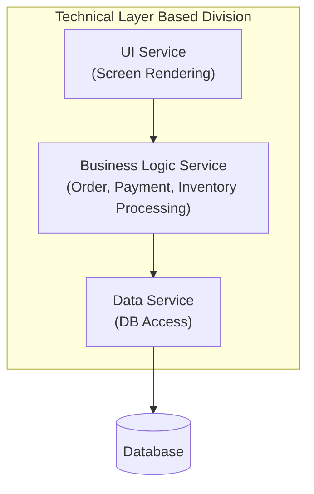
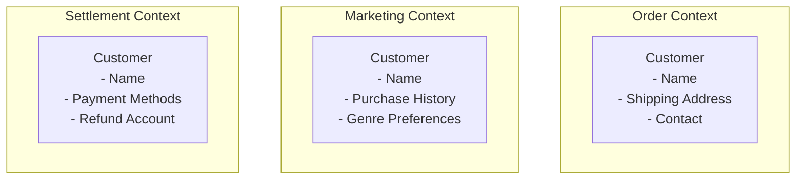
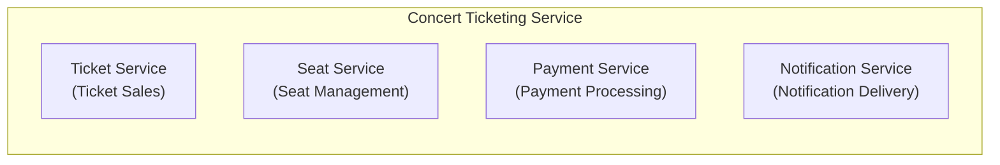
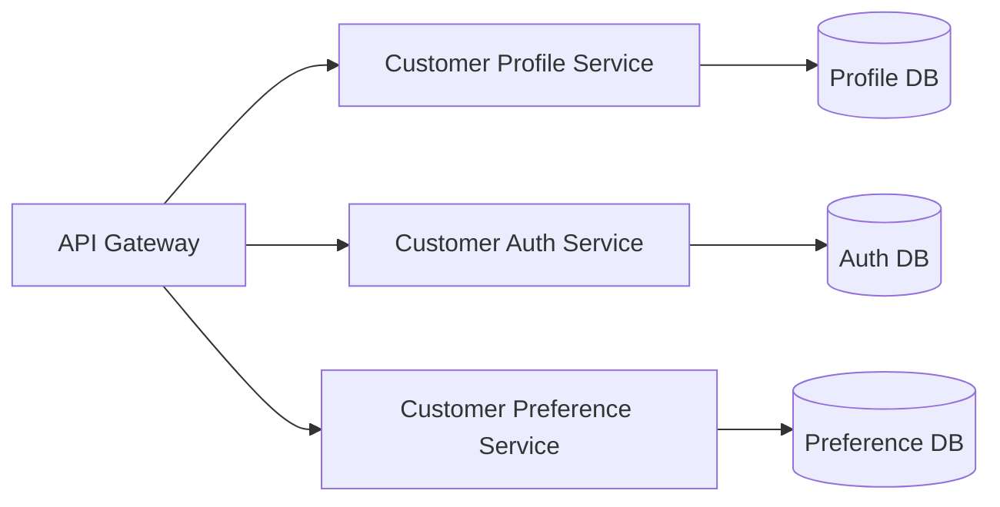
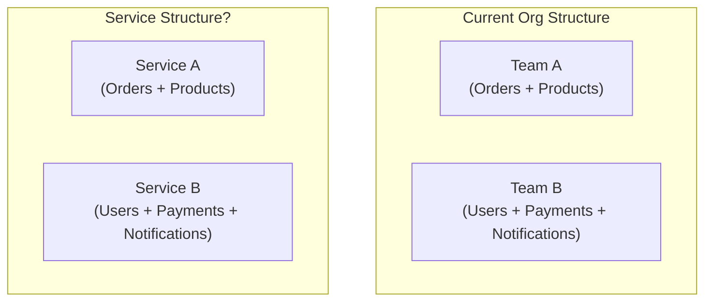
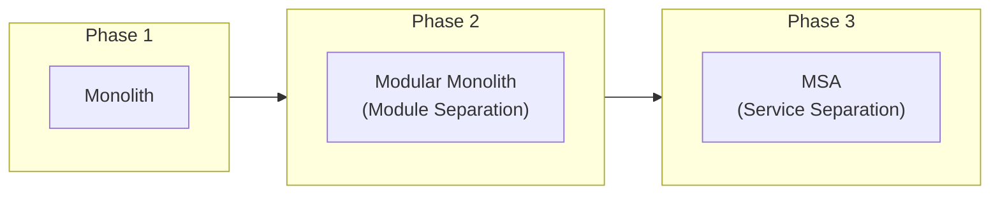

Previous: [[Reflections on MSA 1/7] What is MSA (Microservices Architecture)?]()

---

In the previous episode, we explored the concept of MSA, its background, and various alternatives.

If you've decided to adopt MSA, you now face the first question.

**"How do we divide services?"**

Why is this question important? To be honest, I think this is **the most difficult and important decision** in MSA. Communication patterns or failure handling strategies can be changed later, but once service boundaries are set, they're really hard to change.

## What Happens When We Divide Wrong?

Before diving into "how to divide," I want to first look at what happens when we divide incorrectly. I believe understanding the problem helps us better see the solution.

### The Pain of Distributed Monolith

There are cases where transitioning to MSA actually makes things harder. A typical case is falling into a **Distributed Monolith**.

What is a Distributed Monolith? It's when services are split into multiple pieces, but in practice, they behave like a monolith. You have the form of MSA, but none of its benefits.

How does this happen? There are various causes, but a common one is **dividing service boundaries incorrectly**.

Let's use a concert ticketing service as an example. Suppose we transitioned to MSA like this:



At first glance, it looks like a clean separation. But think about adding an "order feature" to this structure.

- You need to add an order screen to the UI service
- You need to add order processing logic to the Business Logic service
- You need to add order data access code to the Data service

**You have to modify all three services for a single feature.** The same goes for deployment—to deploy the order feature, you have to deploy all three services together.

How does that sound? Even though you split the services, you get the same problems as a monolith. Actually, it's worse. **You get the downsides of monolithic (modify together, deploy together) combined with MSA's downsides (network complexity, operational burden)**.

Why did this happen? Because **services were divided by technical concerns rather than business functions**. A single business feature called "order" got scattered across three services. This is a textbook example of "dividing services wrong."

I experienced a similar situation before. Services were separated, but modifying one feature required touching multiple services simultaneously. There were moments when I thought, "Is this really MSA?"

And there's an even bigger problem. Once you divide wrong, it's really hard to change.

### Why Is It Hard to Change?

What does it take to change service boundaries later?

- **Data Migration**: You need to merge data from separated DBs or split a single DB
- **API Changes**: The APIs that other services were calling change. The callers all need to be modified too
- **Event Redesign**: The events being published and subscribed change
- **Deployment Strategy**: You need to figure out how to transition between old and new services

It's not simple refactoring. In my experience, changing service boundaries was sometimes harder than building from scratch. When developing, there are moments when you think "it would be faster to just rebuild from the beginning"—boundary changes often fell into that category.

So I believe **setting boundaries well initially is important, but maintaining a structure that's easy to change is equally important**. There's no such thing as perfect boundaries. It seems realistic to at least get the big direction right while leaving room for adjustments later.

So how should we set service boundaries?

## What Criteria Should We Use to Divide?

There are various criteria for dividing services. But before discussing criteria, I want to ask one question first.

**"Why do we need criteria?"** Can't we just divide by feel, or by team structure?

This might be such an obvious question that you've never even thought about it. But I think this question is extremely important. Without criteria, dividing service boundaries easily becomes an **arbitrary decision**.

Unfortunately, doing so likely leads to the Distributed Monolith we saw earlier. Tightly coupled features end up in different services, or unrelated features get bundled into one service.

That's why we need criteria to judge **"what should be together and what should be separate."** I think it's the same context as establishing conventions while developing. That way we can make consistent decisions and reduce ambiguity.

So what criteria should we use to divide?

### DDD and Bounded Context

When discussing service boundaries, the most frequently mentioned concepts are **DDD (Domain-Driven Design)** and **Bounded Context**.

DDD is **an approach to software design centered on the domain (business area)**. There are various concepts like Aggregate, Entity, Value Object, and DDD alone could fill an entire book, so it's hard to cover everything here. If the opportunity arises, I'd like to discuss DDD separately.

In this article, let's focus on **Bounded Context**, which is most directly related to service boundaries.

What is Bounded Context? Simply put, it's **the scope where the same term maintains the same meaning**. This might not click right away—I know it didn't for me when I first encountered this concept. Let me explain with an example to help.

In a concert ticketing service, think about the term **"customer."**

- In the **order context**, a customer is: someone who buys tickets, someone with shipping address information
- In the **marketing context**, a customer is: a marketing target, someone with purchase history and genre preferences
- In the **settlement context**, a customer is: someone with payment methods, a refund recipient



Same term "customer," but each context cares about different attributes and behaviors. The order context doesn't care about marketing preferences, and the marketing context doesn't need payment methods.

**The point where the same term is used with different meanings—that's the boundary of a context.** And this Bounded Context can be a natural criterion for dividing services.

However, there's one thing to note. **A Bounded Context doesn't automatically become a single microservice.** Multiple contexts can coexist in one service, or conversely, one context can be implemented across multiple services. I think Bounded Context gives us a hint that "dividing this way could be natural," not a mandate for 1:1 mapping.

So can we divide service boundaries well just by knowing Bounded Context? I don't think so. We need to look at it from other perspectives as well.

### Business Capability-Based Decomposition

If Bounded Context looks at boundaries from a **domain model** perspective, **Business Capability** approaches from a different angle—the perspective of **"what does this business do?"**

Simply put, Business Capability means "the capabilities a business must have to create value." What capabilities would a concert ticketing service have?

- **Ticket Sales**: The capability to sell concert tickets
- **Seat Management**: The capability to manage seat arrangements and availability
- **Payment Processing**: The capability to process payments and handle refunds
- **Notification Delivery**: The capability to send notifications to users



If each of these capabilities can exist independently, dividing services based on them is also a natural approach. If improving ticket sales doesn't affect seat management or payment processing, then separation makes sense.

However, this criterion doesn't perfectly define service boundaries either. Business Capability can also have multiple capabilities in one service, or one capability spanning multiple services, so I think it's better to understand it as suggesting service candidates.

Both Bounded Context and Business Capability can serve as criteria for dividing service boundaries. So which should we use?

In my experience, **using both together** was effective. Draw the big picture with Business Capability first, then validate detailed boundaries with Bounded Context. Check "Is this capability really one context? Or are multiple contexts mixed?"

At this point, rather than deciding alone or just with the development team, I think it's important to discuss with domain experts. The boundaries the development team envisions might differ from what domain experts think. The more perspectives you incorporate, the better decisions you can make.

### Conway's Law

There's one more thing to consider here: **organizational structure**.

> "Organizations which design systems are constrained to produce designs which are copies of the communication structures of these organizations."
> - Melvin Conway, 1967

When I first heard this law, I thought, "Isn't that obvious?" But experiencing MSA made me feel the weight of this law quite strongly.

For example, if the order team and payment team are separate, there's a high chance that order service and payment service will naturally be separated. Conversely, if one team handles both orders and payments, the two features are likely to end up in one service.

The problem is that **organizational structure isn't always rational**. Team structures are often maintained for reasons like "that's how it's always been." So cases where the ideal service structure doesn't match the real organizational structure seem to happen frequently.

That's why the concept of **Inverse Conway Maneuver** emerged—**changing the organizational structure first** to match the desired system structure.

Of course, changing organizational structure isn't easy. But rather than resigning ourselves to "our team structure is like this, so we have no choice but to divide it this way," I think it's better to first envision "what would the ideal system structure be?" and also consider organizational changes.

However, this requires sufficient consensus within the organization. Everyone needs to understand that organizational change isn't easy and agree to the change.

Ideally, organization and system would work in harmony with each other, but realistically that's often difficult. Still, I think what's important is **recognizing that organization and system influence each other**.

## Thoughts on Service Size

Alright, you probably have some sense of what criteria to use for division now. But another concern remains.

**"How small should we divide?"**

Perhaps because of the name "microservices," some people seem to think services should be divided as small as possible. But is smaller really better?

### What Happens If It's Too Small?

Let's assume we divided the "customer service" very finely in a concert ticketing service.



At first glance, you can probably tell this doesn't look good. If we need to show profile and preferences together when a customer logs in, **we have to call all three services.** What was three method calls in monolithic has become three network calls.

When services are divided too finely like this, **network calls** increase and latency grows, and system complexity increases. Also, what could be handled in one transaction now spans multiple services. Naturally, **operational complexity** also increases.

### What Happens If It's Too Large?

Conversely, what happens if services are too large?

If they're too large, the problems of monolithic that we discussed in Episode 1 reappear. Independent deployment becomes difficult, and scaling out only specific features is hard. If multiple teams own one service, coordination is needed again.

Ultimately, I think the meaning of adopting MSA itself becomes unclear.

### So What's the Right Size?

In the end, it seems like "everything in moderation is best" is right. Not too small, not too large—an appropriate size.

The problem is what exactly "appropriate" means. I think this is a question with no right answer. Many developers at many companies seem to go through trial and error to find this "appropriate."

Personally, I think **"a size that one team can fully own and operate"** can be one criterion.

There's the "Two Pizza Team" concept that Amazon talks about. A team size that can be fed with two pizzas—roughly 6-10 people owning one service.

Besides team size, **change frequency** also seems like an important criterion. Keep features that frequently change together in the same service, and separate features that change independently.

For example, if order logic and payment logic always change together, it might be better to keep them in the same service. But if orders change frequently while payments remain stable, separation makes sense.

Ultimately, **there doesn't seem to be a right answer for service size**. It has to be decided by comprehensively considering domain characteristics, team structure, and change frequency. This might be a clichéd answer, but from experience, the best answer to this question seems to be "you have no choice but to judge according to the situation."

## Common Mistakes

So far we've discussed criteria and size for dividing service boundaries. But even knowing the theory, it's easy to make mistakes in practice. I've made many mistakes too.

Why is that? I think it's because of **the tendency to divide in familiar ways**. It's comfortable to divide according to the ways we've been doing things, or the structures we can see.

We looked at the technical layer division mistake earlier. There are a few other common mistakes as well.

### 1. Creating a Service for Every Entity

**Dividing services based on database tables or entities** is another common mistake.

What if orders, order items, and products are each separate services?


To look up an order, you have to call three services sequentially. The "too small" problems I mentioned earlier appear exactly.

I think it's better to think based on **business use cases** rather than entities. It's more natural for one service to manage the data needed for use cases like "create order," "view order," "cancel order."

### 2. Following the Org Chart Directly

While I mentioned Conway's Law earlier, **directly mapping current organizational structure to service structure** can also be dangerous.



If a company has an organizational structure like above, would it be okay to compose services like that?

Look at the service Team B owns. Users, payments, and notifications are all in one service. From a business perspective, there's no cohesion, and it doesn't match the criteria we discussed above.

Of course, we can't say the criteria mentioned above are always the right answer, but I think designing MSA based on an organizational structure like the example is likely to cause problems later.

### 3. Dividing Too Finely from the Start

Finally, **dividing services too finely from the start** also seems like something to avoid.

If you subdivide services before sufficiently understanding the domain, the cost of fixing them when you realize the boundaries were wrong is quite large. You might experience "why is it hard to change" that I mentioned above multiple times.

I prefer **starting with larger units and progressively separating**. Start with the modular monolith I talked about in Episode 1, then split off pieces one by one as domain understanding deepens.



This way, the cost of fixing wrong boundaries is relatively lower. Of course, there might be situations where you have to start with MSA from the beginning. In those cases, it's important to apply the criteria we discussed as carefully as possible.

## Signs That Boundaries Are Wrong

No matter how carefully you set boundaries, there will be moments later when you think, "Ah, this wasn't right." What signs are there?

### Distributed Monolith

The Distributed Monolith I mentioned at the beginning of this article seems like the most serious sign. Issues like needing to modify multiple services simultaneously to change one feature, or needing to deploy other services together when deploying one service.

Of course, expecting perfect independence might be unrealistic, so experiencing this once or twice in specific situations is fine. But if it repeats frequently and keeps getting worse, I think you should suspect a Distributed Monolith situation.

If you're in this situation, you need to review boundaries. In severe cases, it might be better to just merge them back together.

### Excessive Communication Between Services

If API calls between certain services are too frequent, you should consider whether those services should actually be merged into one.

```
Order Service → Product Service: 100,000 calls/day
Order Service → Inventory Service: 95,000 calls/day
Order Service → Payment Service: 5,000 calls/day
```

If orders, products, and inventory communicate this frequently, perhaps they should be merged into an "Order Processing Service."

### Circular Dependencies

If circular dependencies like A → B → C → A have formed, there's likely a problem with boundary settings. This is also a signal that things are tightly coupled.

Circular dependencies make deployment order complicated and make it hard to predict where failures will spread. Measures like breaking dependencies, merging services, or extracting common functionality into a new service are needed.

And these circular dependencies also make it harder to understand services. It becomes difficult to understand the relationships between services. Ultimately, maintenance costs increase, and adding new features becomes harder.

If you receive these signals that boundaries are wrong, I think it's important to share with your team members and spend time thinking together. Check whether only you feel this signal or the entire team is receiving it.

And if the whole team agrees, I think you should seriously consider the work of resetting boundaries.

## Boundaries Can Change

Lastly, I want to mention one important point.

What I've felt while developing is that **services and requirements keep changing and evolving**. Designs and requirements that initially felt like they'd never change inevitably change over time.

Services keep evolving to meet business requirements. New features get added, existing features change, and sometimes features get removed. These changes also affect service boundaries.

And applying the criteria I mentioned earlier isn't easy either. You need deep domain understanding, but that's often lacking in the early stages of a project, and there aren't standardized guides like there are for communication methods. The answer differs by business, team, and situation.

So **service boundaries are not fixed forever either.**

When business changes, domain changes too, and when domain changes, optimal service boundaries change too. Boundaries you thought were well-divided initially might not be right a year later.

That's why I think **rather than agonizing too much over setting perfect boundaries from the start, maintaining a structure that's easy to change later is more important**.

If you clearly define contracts (APIs) between services, hide internal implementations, and minimize dependencies, adjusting boundaries later becomes much easier. In the end, it all comes back to abstraction.

## Summary

In this episode, we explored how to divide services in MSA.

What I ultimately wanted to say is **"you don't have to try to divide perfectly from the beginning."** In my experience, things change often anyway.

If you've decided how to divide services, the next problem awaits. **How will the separated services talk to each other?**

In the next episode, I'll discuss inter-service communication methods (synchronous/asynchronous, REST/gRPC/message queues) and the trade-offs of each.

Next: [[Reflections on MSA 3/7] Inter-Service Communication in MSA - How Should We Do It?]()

## References

### DDD and Bounded Context

- Eric Evans - *Domain-Driven Design: Tackling Complexity in the Heart of Software* (Addison-Wesley, 2003)
- Vaughn Vernon - *Implementing Domain-Driven Design* (Addison-Wesley, 2013)

### Service Decomposition Strategies

- Sam Newman - *Building Microservices* (O'Reilly, 2021, 2nd Edition)
- Chris Richardson - *Microservices Patterns* (Manning, 2018)

### Conway's Law

- Melvin Conway - [How Do Committees Invent?](http://www.melconway.com/Home/Committees_Paper.html) (1968)
