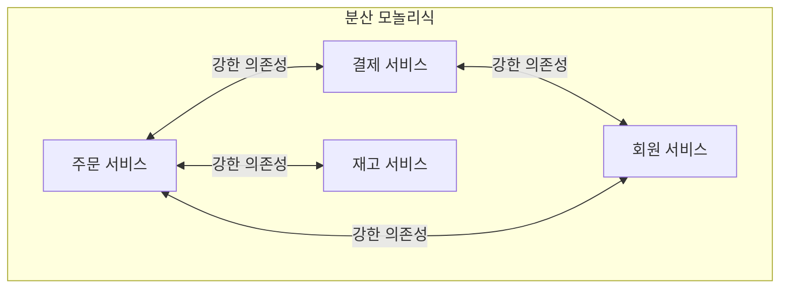
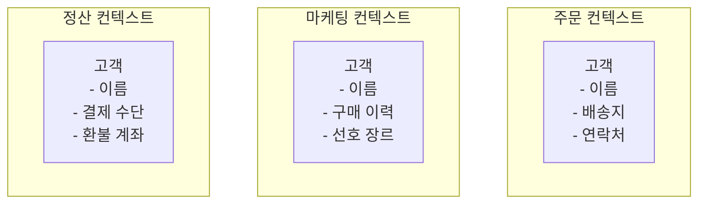
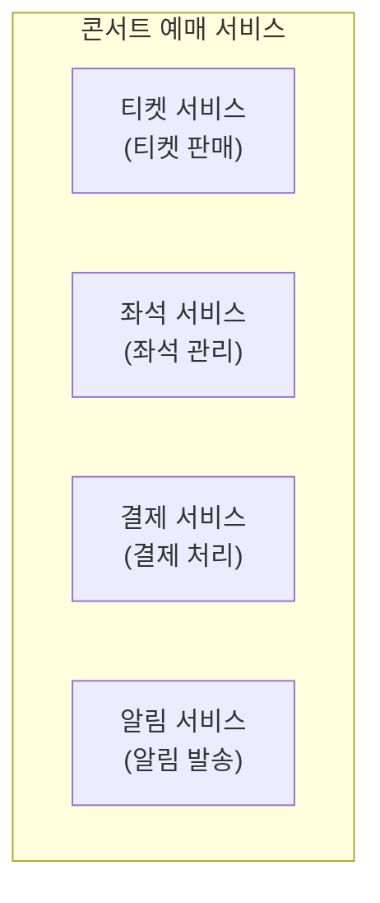
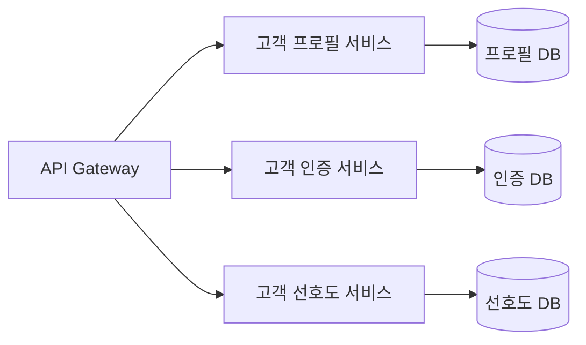
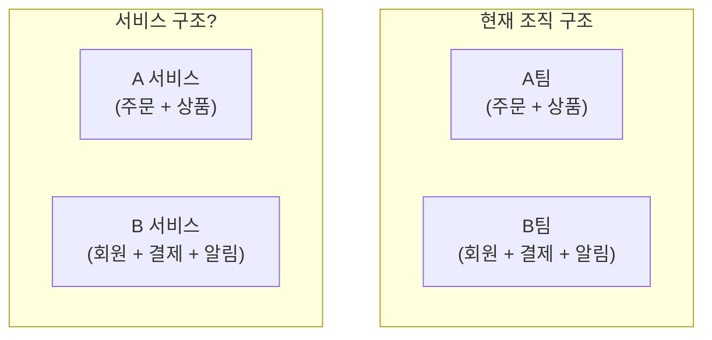
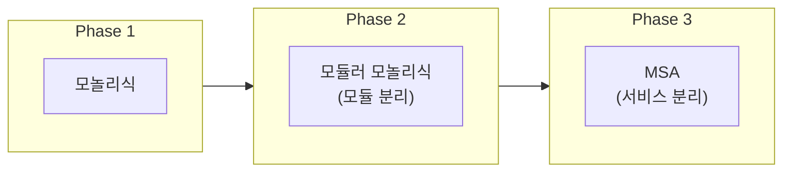

전편: [[MSA에 관한 고찰 1/6편] MSA(Microservices Architecture)란 무엇인가?]()

---

저번 편에서 MSA의 개념과 등장 배경, 그리고 여러 대안들에 대해 살펴보았습니다.

MSA를 도입하기로 결정했다면, 이제 첫 번째 질문과 마주하게 됩니다.

**"서비스를 어떻게 나눌 것인가?"**

이 질문이 왜 중요할까요? 솔직히 말씀드리면, 저는 이 문제가 MSA에서 **가장 어렵고 중요한 결정**이라고 생각합니다. 통신 방식이나 장애 대응 패턴은 나중에 바꿀 수 있지만, 서비스 경계는 한번 정하면 바꾸기가 정말 어렵거든요.

## 잘못 나누면 어떻게 될까요?

본격적으로 "어떻게 나눌 것인가"를 이야기하기 전에, 잘못 나누면 어떤 일이 생기는지 먼저 살펴보려 합니다. 문제를 제대로 알아야 해결책도 제대로 보이는 것 같거든요.

### Distributed Monolith의 고통

MSA로 전환했는데 오히려 더 힘들어지는 경우가 있습니다. 바로 **Distributed Monolith(분산 모놀리식)** 에 빠졌을 때입니다.

콘서트 예매 서비스를 예로 들어보겠습니다. 모놀리식에서 MSA로 전환하면서 주문, 결제, 재고, 회원 서비스를 분리했다고 가정해보죠.



그런데 경계를 잘못 나누면 어떤 일이 생길까요?

- 주문 기능을 수정하려면 결제, 재고 서비스도 함께 수정해야 합니다
- 주문 서비스를 배포하려면 결제, 재고 서비스도 함께 배포해야 합니다
- 결제 서비스에 장애가 나면 주문도, 회원 조회도 다 영향을 받습니다

어떠신가요? **모놀리식의 단점(함께 배포, 함께 장애)과 MSA의 단점(네트워크 복잡성, 분산 트랜잭션)을 동시에 가진** 최악의 상황입니다.

문제의 핵심은 서비스 수가 많아서가 아닙니다. **런타임에서 서로 강하게 결합된 구조**가 문제인 거죠. 동기 호출이 꼬리에 꼬리를 물고, 데이터 모델을 공유하고, 트랜잭션이 여러 서비스에 걸쳐 있으면 이런 상황이 생기게 됩니다.

저도 팀에 합류했을 때 비슷한 상황을 겪었습니다. 서비스는 분리되어 있는데, 하나의 기능을 수정하려면 여러 서비스를 동시에 건드려야 했습니다. "이게 MSA 맞나?" 싶은 순간들이 있었죠.

### 왜 경계 설정이 특히 어려울까요?

그렇다면 왜 서비스 경계를 제대로 나누는 게 이렇게 어려운 걸까요?

첫째, **도메인에 대한 깊은 이해가 필요**합니다. 어떤 기능들이 함께 있어야 하고, 어떤 기능들이 떨어져 있어야 하는지 알려면 비즈니스를 제대로 알아야 하거든요. 그런데 프로젝트 초기에는 도메인 이해가 부족한 경우가 많죠.

둘째, **정답이 없습니다**. 통신 방식은 "내부는 gRPC, 외부는 REST"처럼 어느 정도 정형화된 가이드가 있지만, 서비스 경계는 비즈니스마다, 팀마다, 상황마다 다르다고 생각합니다.

셋째, **초기에 경계 변경을 고려하지 않고 설계하면 나중에 바꾸기가 정말 어렵습니다**. 이게 가장 큰 문제인 것 같습니다.

### 왜 바꾸기가 어려울까요?

서비스 경계를 나중에 바꾸려면 어떤 일이 필요할까요?

- **데이터 마이그레이션**: 분리된 DB의 데이터를 합치거나, 하나의 DB를 나눠야 합니다
- **API 변경**: 다른 서비스들이 호출하던 API가 바뀝니다. 호출하는 쪽도 다 수정해야 합니다
- **이벤트 재설계**: 발행하던 이벤트, 구독하던 이벤트가 바뀝니다
- **배포 전략**: 기존 서비스와 새 서비스를 어떻게 전환할지 고민해야 합니다

간단한 리팩토링이 아니거든요. 경험상 서비스 경계를 바꾸는 건 새로 만드는 것보다 힘들때도 있었습니다. 개발을 하다보면 가끔 "처음부터 만드는게 빠르겠다"라는 생각이 들 때가 있는데, 경계 변경이 그런경우가 꽤 있었습니다. 

그래서 저는 **처음에 경계를 잘 설정하는 것도 중요하지만, 변경이 용이한 구조를 유지하는 것도 그만큼 중요하다**고 생각합니다. 완벽한 경계란 없으니까요. 최소한 큰 방향은 맞추되, 나중에 조정할 여지를 남겨두는 게 현실적인 것 같습니다.

그렇다면 서비스 경계를 어떻게 설정해야 할까요?

## 무엇을 기준으로 나눌 것인가

서비스를 나누는 기준은 여러 가지가 있습니다. 그런데 기준을 이야기하기 전에, 한 가지 질문을 먼저 던져보고 싶습니다.

**"왜 기준이 필요할까요?"**

그냥 느낌대로, 혹은 팀 구조대로 나누면 안 될까요?

안타깝게도 그렇게 하면 앞서 본 Distributed Monolith가 될 가능성이 높습니다. 서로 강하게 엮인 기능들이 다른 서비스로 갈라지거나, 별 상관없는 기능들이 한 서비스에 뭉치게 되거든요.

그래서 **"무엇이 함께 있어야 하고, 무엇이 분리되어야 하는가"** 를 판단할 기준이 필요한 겁니다.

### DDD와 Bounded Context

서비스 경계를 이야기할 때 가장 많이 언급되는 개념이 **DDD(Domain-Driven Design)** 와 **Bounded Context**입니다.

처음 이 개념을 접했을 때 솔직히 잘 와닿지 않았습니다. Bounded Context가 "동일한 용어가 같은 의미를 가지는 경계"라는데, 뭔 소린가 싶었거든요.

예를 들어 설명해보겠습니다. 콘서트 예매 서비스에서 **"고객"** 이라는 용어를 생각해보죠.

- **주문 컨텍스트**에서 고객은: 티켓을 구매하는 사람, 배송지 정보를 가진 사람
- **마케팅 컨텍스트**에서 고객은: 마케팅 대상, 구매 이력과 선호 장르를 가진 사람
- **정산 컨텍스트**에서 고객은: 결제 수단을 가진 사람, 환불 대상



같은 "고객"이라는 용어지만, 각 컨텍스트에서 관심 있는 속성과 행위가 다릅니다. 주문 컨텍스트에서는 고객의 마케팅 선호도가 중요하지 않고, 마케팅 컨텍스트에서는 고객의 결제 수단이 필요 없죠.

이렇게 **같은 용어가 다른 의미로 사용되는 지점, 그게 바로 컨텍스트의 경계**입니다. 그리고 이 Bounded Context가 서비스를 나누는 자연스러운 기준이 될 수 있죠.

다만 한 가지 주의할 점이 있습니다. **Bounded Context가 곧바로 하나의 마이크로서비스가 되는 건 아닙니다.** 하나의 서비스 안에 여러 컨텍스트가 공존할 수도 있고, 반대로 하나의 컨텍스트가 여러 서비스로 구현될 수도 있습니다. Bounded Context는 "이렇게 나누면 자연스럽겠다"는 힌트를 주는 거지, 1:1 매핑을 강제하는 건 아니라고 생각합니다.

그렇다면 Bounded Context만 알면 서비스 경계를 잘 나눌 수 있을까요?

### Business Capability 기반 분해

Bounded Context가 **도메인 모델** 관점에서 경계를 본다면, **Business Capability(비즈니스 역량)** 는 좀 다른 각도에서 접근합니다. **"이 비즈니스가 뭘 하는가"** 의 관점이죠.

Business Capability란 쉽게 말해 "이 비즈니스가 가치를 만들기 위해 하는 일들"입니다. 콘서트 예매 서비스라면 어떤 역량들이 있을까요?

- **티켓 판매**: 콘서트 티켓을 판매하는 역량
- **좌석 관리**: 좌석 배치와 가용성을 관리하는 역량
- **결제 처리**: 결제를 수행하고 환불을 처리하는 역량
- **알림 발송**: 사용자에게 알림을 보내는 역량



Bounded Context와 Business Capability, 둘 다 서비스 경계를 나누는 기준이 될 수 있죠. 그렇다면 뭘 써야 할까요?

제 경험상 **둘을 함께 사용**하는 게 효과적이었습니다. Business Capability로 먼저 큰 그림을 그리고, Bounded Context로 세부적인 경계를 검증하는 식이죠. "이 역량은 정말 하나의 컨텍스트인가? 아니면 여러 컨텍스트가 섞여 있는가?" 를 확인하는 겁니다.

### Conway의 법칙

여기서 한 가지 더 고려해야 할 게 있습니다. 바로 **조직 구조**입니다.

> "시스템을 설계하는 조직은 그 조직의 커뮤니케이션 구조를 반영한 설계를 만들게 된다."
> - Melvin Conway, 1967

처음 이 법칙을 들었을 때는 "당연한 얘기 아닌가?" 싶었습니다. 그런데 MSA를 경험하면서 이 법칙의 무게를 실감하게 되었습니다.

예를 들어, 주문팀과 결제팀이 분리되어 있다면 자연스럽게 주문 서비스와 결제 서비스가 분리될 가능성이 높습니다. 반대로 하나의 팀이 주문과 결제를 모두 담당한다면 두 기능이 하나의 서비스에 들어갈 가능성이 높죠.

문제는 **조직 구조가 항상 합리적인 건 아니라는 점**입니다. 역사적인 이유나 정치적인 이유로 비합리적인 팀 구조가 유지되는 경우도 있거든요.

그래서 등장한 개념이 **Inverse Conway Maneuver(역 콘웨이 전략)** 입니다. 원하는 시스템 구조에 맞게 **조직 구조를 먼저 바꾸는** 거죠.

물론 조직 구조를 바꾸는 건 쉬운 일이 아닙니다. 하지만 "우리 팀 구조가 이래서 이렇게 나눌 수밖에 없어"라고 체념하기보다는, "이상적인 시스템 구조가 뭘까?" 먼저 그려보고 조직 변경도 검토해보는 게 맞는 것 같습니다.

## 서비스 크기에 대한 고민

자, 이제 어떤 기준으로 나눌지는 어느 정도 감이 오셨을 겁니다. 그런데 또 다른 고민이 남습니다.

**"얼마나 잘게 나눠야 할까요?"**

"마이크로서비스"라는 이름 때문인지, 서비스를 최대한 작게 나눠야 한다고 생각하시는 분들도 계신 것 같습니다. 그런데 정말 작을수록 좋을까요?

### 너무 작으면 어떻게 될까요?

콘서트 예매 서비스에서 "고객 서비스"를 아주 잘게 나눴다고 가정해보겠습니다.



고객이 로그인하면서 프로필과 선호도를 함께 보여줘야 한다면? **세 서비스를 모두 호출**해야 합니다. 모놀리식에서는 메서드 호출 세 번이면 끝났을 일이 네트워크 호출 세 번으로 바뀐 거죠.

서비스를 너무 잘게 나누면:
- **네트워크 호출 증가**: 지연 시간이 늘어납니다
- **분산 트랜잭션**: 하나의 트랜잭션으로 처리하던 일이 여러 서비스에 걸칩니다
- **운영 복잡도**: 배포, 모니터링, 디버깅 모두 서비스 수만큼 복잡해집니다

### 너무 크면 어떻게 될까요?

반대로 서비스를 너무 크게 유지하면 1편에서 이야기한 모놀리식의 문제점들이 다시 나타납니다.

- 독립적 배포가 어렵습니다
- 특정 기능만 스케일 아웃하기 어렵습니다
- 여러 팀이 하나의 서비스를 담당하면 조율이 필요합니다

### 그렇다면 적절한 크기는?

저는 **"한 팀이 온전히 소유하고 운영할 수 있는 크기"** 가 하나의 기준이 될 수 있다고 봅니다.

Amazon에서 이야기하는 "Two Pizza Team" 개념이 있습니다. 피자 두 판으로 식사할 수 있는 규모, 대략 6~10명 정도의 팀이 하나의 서비스를 담당하는 거죠.

팀 규모뿐만 아니라 **변경 빈도**도 중요한 기준인 것 같습니다. 자주 함께 변경되는 기능들은 같은 서비스에 두고, 독립적으로 변경되는 기능들은 분리하는 거죠.

예를 들어, 주문 로직과 결제 로직이 항상 함께 변경된다면 같은 서비스에 두는 게 나을 수 있습니다. 하지만 주문은 자주 바뀌는데 결제는 안정적이라면 분리하는 게 맞겠죠.

결국 **서비스 크기에 정답은 없는 것 같습니다**. 도메인 특성, 팀 구조, 변경 빈도를 종합적으로 고려해서 결정할 수밖에 없죠.

## 흔히 하는 실수들

지금까지 서비스 경계를 나누는 기준과 크기에 대해 이야기했습니다. 그런데 이론을 알아도 실제로는 실수하기 쉽습니다.

왜 그럴까요? 제 생각에는 **익숙한 방식대로 나누려는 경향** 때문인 것 같습니다. 기존에 해오던 방식, 눈에 보이는 구조대로 나누면 편하니까요.

어떤 실수들이 있는지 살펴보겠습니다.

### 1. 기술 레이어로 나누기

가장 흔하게 보는 실수가 **기술 레이어를 기준으로 서비스를 나누는 것**입니다.


이렇게 나누면 어떻게 될까요? 주문 기능 하나를 추가하려면 UI 서비스, 비즈니스 로직 서비스, 데이터 서비스를 **모두 수정하고 모두 배포**해야 합니다.

MSA의 핵심 이점인 "독립적 배포"가 사라지는 거죠. 이럴 바에는 차라리 모놀리식이 나을 수도 있습니다.

그래서 **비즈니스 기능 기준으로 수직으로 나누는 게 좋다**고 생각합니다. 각 서비스가 자신의 기능에 필요한 모든 레이어를 갖도록요.

### 2. 엔티티마다 서비스 만들기

또 다른 실수는 **데이터베이스 테이블이나 엔티티를 기준으로 서비스를 나누는 것**입니다.

주문, 주문 항목, 상품이 각각 별도 서비스라면?


주문을 조회하려면 세 서비스를 순차적으로 호출해야 합니다. 아까 말씀드린 "너무 작으면" 생기는 문제가 그대로 나타나죠.

엔티티가 아닌 **비즈니스 유스케이스**를 기준으로 생각하는 게 좋은 것 같습니다. "주문 생성", "주문 조회", "주문 취소" 같은 유스케이스에 필요한 데이터를 하나의 서비스에서 관리하는 게 자연스럽죠.

### 3. 조직도 그대로 따라가기

앞서 Conway의 법칙을 이야기했지만, **현재 조직 구조를 그대로 서비스 구조로 옮기는 것**도 위험할 수 있습니다.



B팀이 담당하는 서비스를 보세요. 회원, 결제, 알림이 한 서비스에 다 들어있습니다. 비즈니스 관점에서 전혀 응집력이 없는 구성이죠.

### 4. 처음부터 너무 잘게 나누기

마지막으로, **처음부터 서비스를 너무 잘게 나누는 것**도 피하는 게 좋은 것 같습니다.

도메인을 충분히 이해하지 못한 상태에서 서비스를 세분화하면, 나중에 경계가 잘못됐다는 걸 깨달았을 때 수정 비용이 어마어마합니다.

저는 **처음에는 좀 더 큰 단위로 시작해서 점진적으로 분리**하는 방식을 선호합니다. 1편에서 이야기한 모듈러 모놀리식에서 시작해서, 도메인 이해가 깊어지면 하나씩 떼어내는 거죠.



## 경계가 잘못됐다는 신호들

아무리 신중하게 경계를 설정해도 나중에 "아, 이게 아니었구나" 싶을 때가 있습니다. 어떤 신호들이 있을까요?

### Distributed Monolith

글 초반에 이야기했던 Distributed Monolith가 가장 심각한 신호인 것 같습니다.

- 하나의 기능을 수정하려면 여러 서비스를 동시에 수정해야 함
- 하나의 서비스를 배포하려면 다른 서비스도 함께 배포해야 함
- 서비스 간 호출이 너무 많고 복잡함

이런 상황이라면 경계를 다시 검토해봐야 합니다. 심한 경우 차라리 다시 합치는 게 나을 수도 있죠.

### 서비스 간 과도한 통신

특정 서비스들 사이에 API 호출이 너무 빈번하다면, 그 서비스들이 사실 하나로 합쳐져야 하는 건 아닌지 고민해봐야 합니다.

```
주문 서비스 → 상품 서비스: 100,000 calls/day
주문 서비스 → 재고 서비스: 95,000 calls/day
주문 서비스 → 결제 서비스: 5,000 calls/day
```

주문, 상품, 재고가 이렇게 빈번하게 통신한다면, 어쩌면 "주문 처리 서비스"로 합쳐지는 게 맞을 수도 있죠.

### 순환 의존성

A → B → C → A 같은 순환 의존성이 생겼다면 경계 설정에 문제가 있을 가능성이 높습니다.

순환 의존성은 배포 순서를 복잡하게 만들고, 장애가 어디로 퍼질지 예측하기 어렵게 만듭니다. 의존성을 끊거나, 서비스를 합치거나, 공통 기능을 새 서비스로 빼내는 등의 조치가 필요하죠.

## 경계는 변할 수 있다

마지막으로 한 가지 중요한 점을 말씀드리고 싶습니다.

제가 개발을 하면서 느낀 건, **서비스와 요구사항은 계속해서 바뀌고 진화한다**는 점입니다. 처음 설계할 때 예상했던 것과 1년 후의 현실이 다른 경우가 정말 많았거든요.

그래서 **서비스 경계도 영원히 고정된 게 아닙니다.**

비즈니스가 변하면 도메인도 변하고, 도메인이 변하면 최적의 서비스 경계도 변합니다. 처음에 잘 나눴다고 생각했던 경계가 1년 후에는 맞지 않을 수 있죠.

그래서 저는 **처음부터 완벽하게 설정하려고 너무 고민하기보다는, 나중에 바꾸기 쉬운 구조를 유지하는 게 더 중요하다**고 봅니다.

서비스 간 계약(API)을 명확하게 정의하고, 내부 구현은 숨기고, 의존성을 최소화해두면 나중에 경계를 조정하기가 훨씬 수월해지거든요.

## 정리

이번 편에서는 MSA에서 서비스를 어떻게 나눌 것인지에 대해 살펴보았습니다.

결국 제가 하고 싶었던 말은 **"처음부터 완벽하게 나누려고 하지 않아도 된다"** 입니다. 제 경험상 어차피 변하는 경우가 많더라고요.

서비스를 어떻게 나눌지 결정했다면, 이제 다음 문제가 기다립니다. **분리된 서비스들은 어떻게 서로 대화할 것인가?**

다음 편에서는 서비스 간 통신 방식(동기/비동기, REST/gRPC/메시지 큐)과 각각의 트레이드오프에 대해 이야기해보겠습니다.

후편: [[MSA에 관한 고찰 3/6편] MSA에서의 서비스간 통신 - 어떻게 해야 하는가]()

## 참고 자료

### DDD와 Bounded Context

- Eric Evans - *Domain-Driven Design: Tackling Complexity in the Heart of Software* (Addison-Wesley, 2003)
- Vaughn Vernon - *Implementing Domain-Driven Design* (Addison-Wesley, 2013)

### 서비스 분해 전략

- Sam Newman - *Building Microservices* (O'Reilly, 2021, 2nd Edition)
- Chris Richardson - *Microservices Patterns* (Manning, 2018)

### Conway의 법칙

- Melvin Conway - [How Do Committees Invent?](http://www.melconway.com/Home/Committees_Paper.html) (1968)
