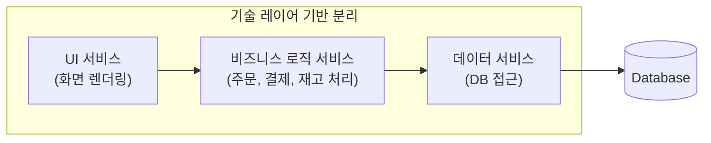
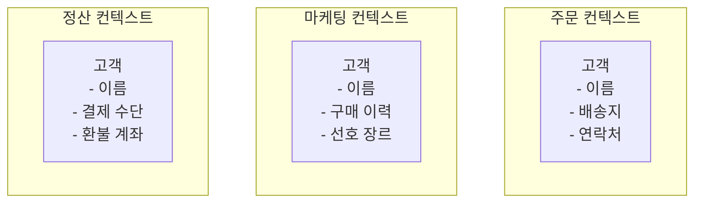
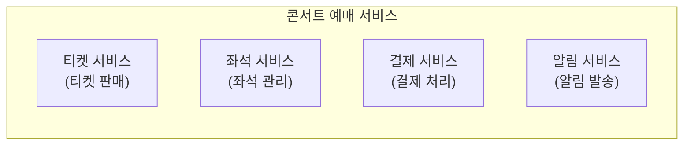
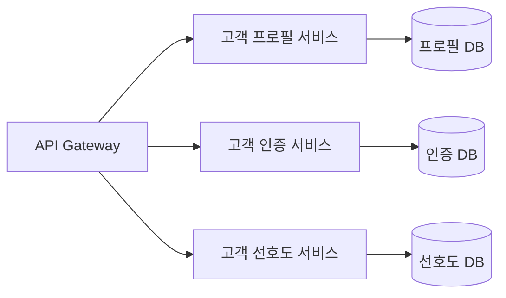
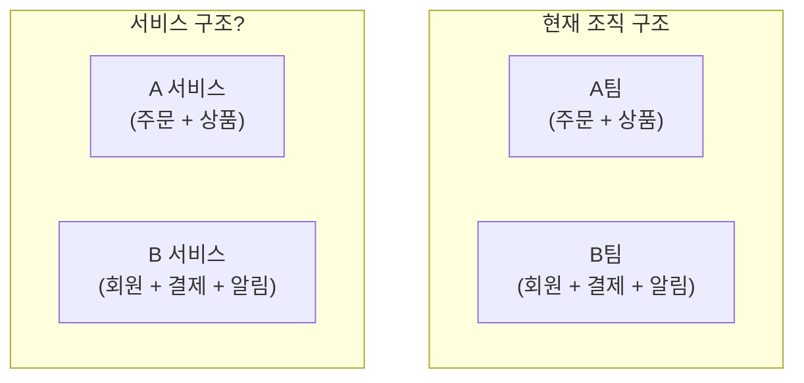
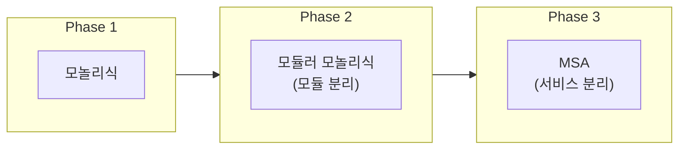

전편: [[MSA에 관한 고찰 1/7편] MSA(Microservices Architecture)란 무엇인가?]()

---

저번 편에서 MSA의 개념과 등장 배경, 그리고 여러 대안들에 대해 살펴보았습니다.

MSA를 도입하기로 결정했다면, 이제 첫 번째 질문과 마주하게 됩니다.

**"서비스를 어떻게 나눌 것인가?"**

이 질문이 왜 중요할까요? 솔직히 말씀드리면, 저는 이 문제가 MSA에서 **가장 어렵고 중요한 결정**이지 않나 싶습니다. 통신 방식이나 장애 대응 패턴은 나중에 바꿀 수 있지만, 서비스 경계는 한번 정하면 바꾸기가 정말 쉽지 않은 것 같거든요.

## 잘못 나누면 어떻게 될까요?

본격적으로 "어떻게 나눌 것인가"를 이야기하기 전에, 잘못 나누면 어떤 일이 생기는지 먼저 살펴보려 합니다. 문제를 제대로 알면 본질도 파악할 수 있으니까요.

### Distributed Monolith의 고통

만약 저희가 별다른 고민없이 일단 서비스를 나눠 MSA를 구현했다고 가정하겠습니다. 그런데 나중에 보니 오히려 개발과 운영이 더 힘들어졌다면 어떨까요?

그런 케이스 중에 하나는 **Distributed Monolith(분산 모놀리식)** 에 빠졌을 때입니다.

Distributed Monolith가 뭘까요? 서비스는 여러 개로 나눠져 있는데, 실제로는 모놀리식처럼 동작하는 상태를 말합니다. MSA의 형태만 갖췄을 뿐, MSA의 장점은 하나도 누리지 못하는 거죠.

어떻게 이런 일이 생길까요? 여러 원인이 있지만, 대표적인 게 **서비스 경계를 잘못 나누는 것**입니다. 콘서트 예매 서비스를 예로 들어보겠습니다. MSA로 전환하면서 이렇게 나눴다고 가정해보죠.



얼핏 보면 깔끔하게 나눈 것 같은데요. 그런데 이 구조에서 "주문 기능"을 추가한다고 생각해보겠습니다. 그럼 우선 UI 서비스에 주문 화면을 추가해야 하고, 비즈니스 로직 서비스에 주문 처리 로직을 추가해야 하며, 데이터 서비스에 주문 데이터 접근 코드를 추가해야 합니다.

이렇게 되면 **하나의 기능을 위해 세 개의 서비스를 모두 수정해야 합니다.** 배포도 마찬가지죠. 주문 기능을 배포하려면 세 서비스를 함께 배포해야 하고요.

어떠신가요? 서비스를 나눴는데도 결국 모놀리식과 똑같은 문제가 생깁니다. 아니, 오히려 더 나빠진 거죠. **모놀리식의 단점(함께 수정, 함께 배포)에 MSA의 단점(네트워크 복잡성, 운영 부담)까지 더해진** 최악의 상황에 가깝습니다.

왜 이렇게 됐을까요? **비즈니스 기능이 아닌 기술적 관심사로 서비스를 나눴기 때문**입니다. "주문"이라는 하나의 비즈니스 기능이 세 개의 서비스에 흩어져 버린 거죠. 이게 바로 "서비스를 잘못 나눈" 전형적인 예시이지 않을까 싶습니다.

저도 이와 똑같진 않지만 비슷한 상황을 경험한 적이 있습니다. 서비스는 분리되어 있는데, 하나의 기능을 수정하려면 여러 서비스를 동시에 건드려야 했거든요. "이게 MSA 맞나?" 싶은 순간들이 있었습니다.

게다가 더 큰 문제가 있습니다. 한번 잘못 나누면 바꾸기가 정말 어렵습니다.

### 왜 바꾸기가 어려울까요?

서비스 경계를 나중에 바꾸려면 어떤 일이 필요할까요?

- **데이터 마이그레이션**: 분리된 DB의 데이터를 합치거나, 하나의 DB를 나눠야 합니다
- **API 변경**: 다른 서비스들이 호출하던 API가 바뀝니다. 호출하는 쪽도 다 수정해야 합니다
- **이벤트 재설계**: 발행하던 이벤트, 구독하던 이벤트가 바뀝니다
- **배포 전략**: 기존 서비스와 새 서비스를 어떻게 전환할지 고민해야 합니다

간단한 리팩토링이 아니라 연관된 모든 부분을 다 확인해야 하니, 큰 작업이 될 수밖에 없습니다. 그래서 경험상 서비스 경계를 바꾸는 건 새로 만드는 것보다 힘들 때도 있었습니다. 

개발을 하다보면 가끔 "처음부터 만드는게 빠르겠다"라는 생각이 들 때가 있는데, 경계 변경이 그런 경우가 꽤 있었습니다. 

그래서 저는 **처음에 경계를 잘 설정하는 것도 중요하지만, 변경이 용이한 구조를 유지하는 것도 그만큼 중요하다**고 생각합니다. 완벽한 경계란 없으니까요. 최소한 큰 방향은 맞추되, 나중에 조정할 여지를 남겨두는 게 현실적인 것 같습니다.

그렇다면 서비스 경계를 어떻게 설정해야 할까요?

## 무엇을 기준으로 나눌 것인가

서비스를 나누는 기준은 여러 가지가 있습니다. 그런데 기준을 이야기하기 전에, 한 가지 질문을 먼저 던져보고 싶습니다.

**"왜 기준이 필요할까요?"** 그냥 느낌대로, 혹은 팀 구조대로 나누면 안 될까요?

너무 당연해서 생각해 보신 적조차 없으신 질문이실 수도 있을 것 같습니다. 그런데 저는 이 질문이 굉장히 중요하다고 생각합니다. 기준이 없다면, 서비스 경계를 나누는 건 결국 **임의적 결정**이 되기 쉽거든요.

안타깝게도 그렇게 하면 앞서 본 Distributed Monolith가 될 가능성이 높습니다. 서로 강하게 엮인 기능들이 다른 서비스로 갈라지거나, 별 상관없는 기능들이 한 서비스에 뭉치게 되거든요.

그래서 **"무엇이 함께 있어야 하고, 무엇이 분리되어야 하는가"** 를 판단할 기준이 필요한 겁니다. 개발을 하면서 컨벤션을 정하는 것과 동일한 맥락이라고 생각합니다. 그래야 일관된 결정을 내릴 수 있고, 모호함을 줄일 수 있으니까요.

그렇다면 어떤 기준으로 나눠야 할까요?

### DDD와 Bounded Context

서비스 경계를 이야기할 때 가장 많이 언급되는 개념이 **DDD(Domain-Driven Design)** 와 **Bounded Context**입니다.

DDD는 **도메인(비즈니스 영역)을 중심으로 소프트웨어를 설계하는 접근 방식**입니다. Aggregate, Entity, Value Object 등 다양한 개념이 있는데, DDD만 해도 책 한 권 분량이라 여기서 다 다루기는 어렵습니다. 기회가 되면 DDD에 대해서도 따로 다뤄보도록 하겠습니다.

이 글에서는 서비스 경계와 가장 직접적으로 관련된 **Bounded Context**에 집중해보겠습니다.

Bounded Context가 뭘까요? 쉽게 말해 **같은 용어가 같은 의미로 통하는 범위**입니다. 아마 잘 와닿지 않으실 수도 있을 것 같습니다. 저도 처음 이 개념을 접했을 때 솔직히 잘 와닿지 않았는데, 이해를 돕기 위해 예를 들어 설명해보겠습니다.

콘서트 예매 서비스에서 **"고객"** 이라는 용어를 생각해보죠.

- **주문 컨텍스트**에서 '고객'은 티켓을 구매하는 사람, 배송지 정보를 가진 사람을 의미 합니다.
- **마케팅 컨텍스트**에서 '고객'은 마케팅 대상, 구매 이력과 선호 장르를 가진 사람을 의미 합니다.
- **정산 컨텍스트**에서 '고객'은 결제 수단을 가진 사람, 환불 대상을 의미 합니다.



같은 "고객"이라는 용어지만, 각 컨텍스트에서 관심 있는 속성과 행위가 다릅니다. 주문 컨텍스트에서는 고객의 마케팅 선호도가 중요하지 않고, 마케팅 컨텍스트에서는 고객의 결제 수단이 필요 없죠.

이처럼 **같은 용어가 다른 의미로 사용되는 지점, 그게 바로 컨텍스트의 경계**입니다. 그리고 이 Bounded Context가 서비스를 나누는 자연스러운 기준이 될 수 있죠.

다만 한 가지 주의할 점은 **Bounded Context가 곧바로 하나의 마이크로서비스가 되는 건 아닙니다.** 하나의 서비스 안에 여러 컨텍스트가 공존할 수도 있고, 반대로 하나의 컨텍스트가 여러 서비스로 구현될 수도 있습니다. Bounded Context는 "이렇게 나누면 자연스러울 수 있다"는 힌트를 주는 거지, 1:1 매핑을 강제하는 건 아니라고 생각합니다.

그렇다면 Bounded Context만 알면 서비스 경계를 잘 나눌 수 있을까요? 저는 꼭 그렇지는 않다고 생각합니다. 다른 관점에서도 한번 살펴볼 필요가 있거든요.

### Business Capability 기반 분해

Bounded Context가 **도메인 모델** 관점에서 경계를 본다면, **Business Capability(비즈니스 역량)** 는 **"이 비즈니스가 뭘 하는가"** 의 관점에서 경계를 보는 방법입니다.

Business Capability란 쉽게 말해 "비즈니스가 가치를 만들기 위해 갖춰야 하는 역량"입니다. 콘서트 예매 서비스라면 어떤 역량들이 있을까요?

- **티켓 판매**: 콘서트 티켓을 판매하는 역량
- **좌석 관리**: 좌석 배치와 가용성을 관리하는 역량
- **결제 처리**: 결제를 수행하고 환불을 처리하는 역량
- **알림 발송**: 사용자에게 알림을 보내는 역량



위 역량들이 각각 독립적으로 존재할 수 있다면, 이를 기준으로 서비스를 나누는 것도 자연스러운 방법입니다. 티켓 판매 기능을 개선할 때 좌석 관리나 결제 처리에 영향을 주지 않는다면, 이 둘은 분리하는 게 맞겠죠.

다만 이 기준도 서비스 경계를 완벽히 정해주지는 않습니다. Business Capability 역시 하나의 서비스에 여러 역량이 포함될 수도 있고, 하나의 역량이 여러 서비스에 걸쳐 있을 수도 있기 때문에 서비스 후보군을 제시하는 정도로 이해하는 게 좋다고 생각합니다.

Bounded Context와 Business Capability, 둘 다 서비스 경계를 나누는 기준이 될 수 있죠. 그렇다면 뭘 써야 할까요?

제 경험상 **둘을 함께 사용**하는 게 효과적이었던 것 같습니다. Business Capability로 먼저 큰 그림을 그리고, Bounded Context로 세부적인 경계를 검증하는 식이죠. "이 역량은 정말 하나의 컨텍스트인가? 아니면 여러 컨텍스트가 섞여 있는가?" 를 확인하는 겁니다.

이때 혼자 혹은 개발팀만으로 결정하기보다는 도메인 전문가들과 함께 논의하는 게 중요하다고 생각합니다. 개발팀에서 생각하는 경계와 도메인 전문가가 생각하는 경계가 다를 수 있기 때문이죠. 여러 시각을 반영할수록 더 나은 결정을 내릴 수 있다고 믿습니다.

### Conway의 법칙

여기서 한 가지 더 고려해야 할 게 있습니다. 바로 **조직 구조**입니다.

> "시스템을 설계하는 조직은 그 조직의 커뮤니케이션 구조를 반영한 설계를 만들게 된다."
> - Melvin Conway, 1967

처음 이 법칙을 들었을 때는 "당연한 얘기 아닌가?" 싶었습니다. 그런데 MSA를 경험하면서 이 법칙의 무게를 꽤나 실감하게 되었습니다.

예를 들어, 주문팀과 결제팀이 분리되어 있다면 자연스럽게 주문 서비스와 결제 서비스가 분리될 가능성이 높습니다. 반대로 하나의 팀이 주문과 결제를 모두 담당한다면 두 기능이 하나의 서비스에 들어갈 가능성이 높아지죠.

문제는 **조직 구조가 항상 합리적인 건 아니라는 점**입니다. "원래 그래왔으니까"와 같은 이유로 팀 구조가 유지되는 경우가 많거든요. 그러다 보니 이상적인 서비스 구조와 현실의 조직 구조가 맞지 않는 경우가 자주 발생하는 것 같습니다.

그래서 등장한 개념이 **Inverse Conway Maneuver(역 콘웨이 전략)** 입니다. 원하는 시스템 구조에 맞게 **조직 구조를 먼저 바꾸는** 거죠.

물론 조직 구조를 바꾸는 건 쉬운 일이 아닙니다. 하지만 "우리 팀 구조가 이래서 이렇게 나눌 수밖에 없어"라고 체념하기보다는, "이상적인 시스템 구조가 뭘까?" 먼저 그려보고 조직 변경도 검토해보는 게 맞는 것 같습니다.

다만 이러려면 조직 내에서 충분한 합의가 필요합니다. 조직 변경이 쉽지 않다는 걸 모두가 이해하고, 변화에 동의해야 하니까요. 

이상적으로는 조직과 시스템이 서로 맞물려 돌아가는 게 가장 좋겠지만, 현실적으로는 어려운 경우가 더 많은 것 같습니다. 다만 중요한 건 **조직과 시스템이 서로 영향을 주고받는다는 점을 인지하는 것**이라고 생각합니다.

## 서비스 크기에 대한 고민

자, 이제 어떤 기준으로 나눌지는 어느 정도 감이 오셨을 겁니다. 그런데 또 다른 고민이 아직 남아 있습니다.

**"얼마나 잘게 나눠야 할까요?"**

'어떻게?'를 생각했다면 이제는 '얼마나?'를 생각할 차례입니다.

"마이크로서비스"라는 이름 때문에 서비스를 최대한 작게 나눠야 한다고 생각하시는 분들도 계신 것 같습니다. 그런데 정말 작을수록 좋을까요?

### 너무 작으면 어떻게 될까요?

콘서트 예매 서비스에서 "고객 서비스"를 가능한 한 아주 잘게 나눴다고 가정해보겠습니다.



언뜻 봐도 좋지 않아보인다는 생각이 자연스레 드실 것 같습니다. 이렇게 되면 고객분이 로그인하면서 프로필과 선호도를 함께 보여줘야 한다면 **세 서비스를 모두 호출**해야 합니다. 모놀리식에서는 메서드 호출 세 번이면 끝났을 일이 네트워크 호출 세 번으로 바뀐 거죠.

이처럼 서비스를 너무 잘게 나누게 되면 **네트워크 호출**이 증가하며 지연 시간이 늘어나고, 시스템 복잡도가 높아집니다. 또 하나의 트랜잭션으로 처리할 수 있는 일이 여러 서비스에 걸치게 되죠. 자연스레 **운영 복잡도**도 증가하게 됩니다.

### 너무 크면 어떻게 될까요?

반대로 서비스를 너무 크게 나누면 어떻게 될까요?

만약 너무 크게 나누게 되면 결국 1편에서 이야기한 모놀리식의 문제점들이 다시 나타납니다. 독립적 배포가 어려워지고, 특정 기능만 스케일 아웃 하기가 어려워 집니다. 여러 팀이 하나의 서비스를 담당하면 또 조율이 필요하게 되죠.

결국 MSA를 도입한 의미 자체가 희미해질 수밖에 없다고 생각합니다.

### 그렇다면 적절한 크기는?

결국 "뭐든 적당히가 최고더라"라는 말이 맞는 것 같습니다. 너무 작지도, 너무 크지도 않은 적절한 크기 말이죠.

문제는 이 "적당히"가 어느 정도인가입니다. 이건 정말 정답이 없는 문제인 것 같습니다. 많은 회사들에서 여러 개발자들이 이 "적당히"를 찾기 위해 시행착오를 겪는 것 같고요.

저는 개인적으로 "적당히"의 단위는 **"한 팀이 온전히 소유하고 운영할 수 있는 크기"** 가 하나의 기준이 될 수 있다고 봅니다.

Amazon에서 이야기하는 "Two Pizza Team" 개념이 있습니다. 피자 두 판으로 식사할 수 있는 규모, 대략 6~10명 정도의 팀이 하나의 서비스를 담당하는 거죠.

팀 규모뿐만 아니라 **변경 빈도**도 중요한 기준인 것 같습니다. 자주 함께 변경되는 기능들은 같은 서비스에 두고, 독립적으로 변경되는 기능들은 분리하는 거죠.

예를 들어, 주문 로직과 결제 로직이 항상 함께 변경된다면 같은 서비스에 두는 게 나을 수 있습니다. 하지만 주문은 자주 바뀌는데 결제는 안정적이라면 분리하는 게 맞겠죠.

결국 **서비스 크기에 정답은 없는 것 같습니다**. 도메인 특성, 팀 구조, 변경 빈도를 종합적으로 고려해서 결정할 수밖에 없죠. 너무 진부한 답변일 수 있지만, 경험상 이 문제에 대한 최선의 답은 "상황에 맞게 판단하는 수밖에 없다"인 것 같습니다.

## 흔히 하는 실수들

지금까지 서비스 경계를 나누는 기준과 크기에 대해 이야기했습니다. 그런데 이론을 알아도 실제로는 실수하기 쉽습니다. 저 역시 많이 실수했고요.

왜 그럴까요? 제 생각에는 **익숙한 방식대로 나누려는 경향** 때문인 것 같습니다. 기존에 해오던 방식, 눈에 보이는 구조대로 나누면 편하니까요.

앞에서 기술 레이어로 나누는 실수를 살펴봤는데요. 그 외에도 몇 가지 흔한 실수들이 있습니다.

### 1. 엔티티마다 서비스 만들기

**데이터베이스 테이블이나 엔티티를 기준으로 서비스를 나누는 것**도 흔한 실수인 것 같습니다.

주문, 주문 항목, 상품이 각각 별도 서비스라면?


주문을 조회하려면 세 서비스를 순차적으로 호출해야 합니다. 아까 말씀드린 "너무 작으면" 생기는 문제가 그대로 나타나죠.

엔티티가 아닌 **비즈니스 유스케이스**를 기준으로 생각하는 게 좋은 것 같습니다. "주문 생성", "주문 조회", "주문 취소" 같은 유스케이스에 필요한 데이터를 하나의 서비스에서 관리하는 게 자연스럽죠.

### 2. 조직도 그대로 따라가기

또 앞서 Conway의 법칙을 이야기했지만, **현재 조직 구조를 그대로 서비스 구조로 옮기는 것**도 위험할 수 있는 것 같습니다.



만약 위와 같은 조직 구조를 가지고 있는 회사라면 저렇게 서비스를 구성했을 때 과연 괜찮을까요?

B팀이 담당하는 서비스를 보시면 회원, 결제, 알림이 한 서비스에 다 들어있습니다. 비즈니스 관점에서 전혀 응집력이 없고 위에서 저희가 이야기했던 기준에도 맞지 않죠.

물론 무조건 위에 언급했던 기준이 정답이라고 볼순 없지만 예시의 조직구조를 토대로 MSA를 설계하는 건 후에 문제가 될 가능성이 높다고 생각합니다.

### 3. 처음부터 너무 잘게 나누기

마지막으로, **처음부터 서비스를 너무 잘게 나누는 것**도 피하는 게 좋은 것 같습니다.

도메인을 충분히 이해하지 못한 상태에서 서비스를 세분화하면, 나중에 경계가 잘못됐다는 걸 깨달았을 때 수정 비용이 꽤 큽니다. 위에서 언급했던 "왜 바꾸기가 어려운가"를 여러번 겪게 되실 수 있겠죠.

저는 **처음에는 좀 더 큰 단위로 시작해서 점진적으로 분리**하는 방식을 선호하는 편입니다. 1편에서 이야기한 모듈러 모놀리식에서 시작해서, 도메인 이해가 깊어지면 하나씩 떼어내는 거죠.



이렇게 되면 경계를 잘못 설정했을 때 수정 비용이 상대적으로 적은 것 같습니다. 물론 처음부터 MSA로 시작해야 하는 상황도 있을 수 있습니다. 그럴 땐 앞서 이야기한 기준들을 최대한 신중하게 적용하는 게 중요하겠죠.

## 경계가 잘못됐다는 신호들

아무리 신중하게 경계를 설정해도 나중에 "아, 이게 아니었구나" 싶을 때가 있습니다. 그럴때는 어떤 신호들이 있을까요?

### Distributed Monolith

먼저 글 초반에 이야기했던 Distributed Monolith가 가장 심각한 신호인 것 같습니다. 하나의 기능을 수정하려면 여러 서비스를 동시에 수정해야하거나 하나의 서비스를 배포하려면 다른 서비스도 함께 배포해야 한다는 문제 말이죠.

물론 완벽한 독립성을 기대하는 건 무리일 수 있기 때문에 특정 상황에서 한두번 겪는 건 괜찮습니다. 하지만 자주 반복되고, 점점 심해진다면 Distributed Monolith 상황을 의심해봐야 한다고 생각합니다.

이런 상황이라면 경계를 다시 검토해봐야 합니다. 심한 경우 차라리 다시 합치는 게 나을 수도 있죠.

### 서비스 간 과도한 통신

또 특정 서비스들 사이에 API 호출이 너무 빈번하다면, 그 서비스들이 사실 하나로 합쳐져야 하는 건 아닌지 고민해봐야 하는 것 같습니다.

```
주문 서비스 → 상품 서비스: 100,000 calls/day
주문 서비스 → 재고 서비스: 95,000 calls/day
주문 서비스 → 결제 서비스: 5,000 calls/day
```

주문, 상품, 재고가 이렇게 빈번하게 통신한다면, 어쩌면 "주문 처리 서비스"로 합쳐지는 게 맞을 수도 있겠죠. 그만큼 서로 강하게 엮여 있다는 뜻이니까요.

### 순환 의존성

그리고 만약 A → B → C → A 같은 순환 의존성이 생겼다면 경계 설정에 문제가 있을 가능성이 있습니다. 이 역시 서로 강하게 엮여 있다는 신호이기 때문이죠.

또 순환 의존성은 배포 순서를 복잡하게 만들고, 장애가 어디로 퍼질지 예측하기 어렵게 만듭니다. 의존성을 끊거나, 서비스를 합치거나, 공통 기능을 새 서비스로 빼내는 등의 조치가 필요하다고 생각합니다.

그리고 이 순환 의존성은 서비스 파악도 어렵게 만듭니다. 서비스 간 관계를 이해하기 힘들어지거든요. 결국 유지보수 비용이 증가하게 되고, 새로운 기능을 추가하는 것도 어려워집니다.

이런 경계가 잘못됐다는 신호들을 받게 된다면 팀원 분들께 공유하고 함께 고민하는 시간을 갖는 게 중요하다고 생각합니다. 나 혼자만 이런 신호를 느낀건지 팀 전체가 받고 있는지 확인하는 거죠.

그리고 만약 팀원 모두가 공감하고 있다면, 경계를 재설정하는 작업을 진지하게 고려해봐야 한다고 생각합니다.

## 경계는 변할 수 있다

마지막으로 한 가지 중요한 점을 말씀드리고 싶습니다.

제가 개발을 하면서 느낀 건, **서비스와 요구사항은 계속해서 바뀌고 진화한다**는 점입니다. 처음에는 변하지 않을 것 처럼 느껴지는 설계나 요구사항도 시간이 지나면 바뀌기 마련이죠.

서비스는 비즈니스 요구사항에 맞춰 계속 발전합니다. 새로운 기능이 추가되고, 기존 기능이 변경되며, 때로는 제거되기도 하죠. 이러한 변화는 서비스 경계에도 영향을 미칩니다.

그리고 앞서 이야기한 기준들을 실제로 적용하는 것도 쉽지 않습니다. 도메인을 깊이 이해해야 하는데 프로젝트 초기에는 그게 부족한 경우가 많고, 통신 방식처럼 정형화된 가이드가 있는 것도 아니거든요. 비즈니스마다, 팀마다, 상황마다 답이 다릅니다.

그래서 **서비스 경계도 영원히 고정된 게 아닙니다.**

비즈니스가 변하면 도메인도 변하고, 도메인이 변하면 최적의 서비스 경계도 변합니다. 처음에 잘 나눴다고 생각했던 경계가 1년 후에는 맞지 않을 수 있죠.

그래서 저는 **처음부터 완벽하게 설정하려고 너무 고민하기보다는, 나중에 바꾸기 쉬운 구조를 유지하는 게 더 중요하다**고 봅니다.

서비스 간 계약(API)을 명확하게 정의하고, 내부 구현은 숨기고, 의존성을 최소화해두면 나중에 경계를 조정하기가 훨씬 수월해지거든요. 결국은 돌고돌아 추상화인 것 같습니다.

## 정리

이번 편에서는 MSA에서 서비스를 어떻게 나눌 것인지에 대해 살펴보았습니다.

결국 제가 하고 싶었던 말은 **"처음부터 완벽하게 나누려고 하지 않아도 된다"** 입니다. 제 경험상 어차피 변하는 경우가 많더라고요.

자 이제 서비스를 어떻게 나눌지 결정했다면, 다음 문제가 저희를 기다립니다. 

**분리된 서비스들은 어떻게 서로 대화할 것인가?**

다음 편에서는 서비스 간 통신 방식(동기/비동기, REST/gRPC/메시지 큐)과 각각의 트레이드오프에 대해 이야기해보겠습니다.

후편: [[MSA에 관한 고찰 3/7편] MSA에서의 서비스간 통신 - 어떻게 해야 하는가]()

## 참고 자료

### DDD와 Bounded Context

- Eric Evans - *Domain-Driven Design: Tackling Complexity in the Heart of Software* (Addison-Wesley, 2003)
- Vaughn Vernon - *Implementing Domain-Driven Design* (Addison-Wesley, 2013)

### 서비스 분해 전략

- Sam Newman - *Building Microservices* (O'Reilly, 2021, 2nd Edition)
- Chris Richardson - *Microservices Patterns* (Manning, 2018)

### Conway의 법칙

- Melvin Conway - [How Do Committees Invent?](http://www.melconway.com/Home/Committees_Paper.html) (1968)
