Previous: [[Reflections on MSA 1/6] What is Microservices Architecture (MSA)?]()

---

In the previous post, we explored the basic concepts, advantages, and disadvantages of Microservices Architecture (MSA).

**One of the things I thought about most while working in an MSA environment was "inter-service communication."** What used to be a simple method call in a monolith turned out to require surprisingly complex decision-making in MSA.

In this post, assuming you've already considered MSA's learning curve and complexity and decided to adopt it after weighing the trade-offs, let's think about how to design and implement inter-service communication in an MSA environment.

Let's start with the root of the problem.

In MSA, each service is deployed and operated independently. **Is inter-service communication essential in such an environment?**

While not absolutely necessary, in most cases, inter-service communication is unavoidable.

When designing systems to achieve business objectives, **services divided by domain or functionality typically need to collaborate with each other or require each other's data**.

But before we go further, there's an important fact we need to address first.

## The Difference in Communication: Monolith vs MSA

### Communication in Monolithic Architecture

In the previous post, we saw that in monolithic architecture, all functionality is contained within a single codebase and deployment unit.

So how does inter-service communication work in a monolithic environment?

Strictly speaking, inter-service communication doesn't exist in a monolithic environment. **Since all functionality runs within a single process, you can directly call other functions through function or method calls.**


Let's use the concert ticketing service from the previous post as an example. If the order functionality needs user information, you simply call `userService.getUser(userId)`.

This means monolithic environments have **no network communication overhead, and maintaining data consistency is relatively straightforward**.

### Communication in MSA

So what about in an MSA environment?


In MSA, each service runs as an independent process. When the order service needs user information, a simple `userService.getUser(userId)` method call is no longer sufficient.

You need to send a request to the user service over the network and receive a response. In this process, various issues that didn't need consideration in a monolith can arise.

Network latency might occur, or the user service might be down. Requests might be lost in transit or timeout.

I believe these issues are things that must be considered in an MSA environment.

### The 8 Fallacies of Distributed Computing

There's a concept that helps understand these issues: the **8 Fallacies of Distributed Computing**.

This concept was first compiled by **Peter Deutsch of Sun Microsystems** in 1994 with 7 fallacies, and later **James Gosling** (creator of Java) added the 8th. It's a list of common false assumptions made when designing distributed systems. While I knew these conceptually before experiencing MSA, working in an actual MSA environment made them hit home much harder.

1. **The network is reliable**: Networks can fail or lose packets at any time.
2. **Latency is zero**: Data transmission always takes time, which can be unpredictable.
3. **Bandwidth is infinite**: Network capacity has limits, and bottlenecks occur under heavy traffic.
4. **The network is secure**: Systems are always exposed to malicious attacks and security threats.
5. **Topology doesn't change**: Network configurations can change dynamically.
6. **There is one administrator**: Distributed systems can have multiple administrators and environments.
7. **Transport cost is zero**: Network communication consumes resources and incurs costs.
8. **The network is homogeneous**: Various types of devices and network environments can coexist.

I believe these fallacies are crucial considerations when designing inter-service communication in an MSA environment. When working in MSA, there are moments when these 8 fallacies really hit home.

Ultimately, **since network communication is essential in distributed systems, careful thought about how to design inter-service communication is extremely important**.

---

## The First Fork in the Road: Synchronous vs Asynchronous

So what communication methods are available in an MSA environment?

Let's start with the most fundamental choice: **synchronous communication** and **asynchronous communication**.

If you search for synchronous and asynchronous communication, you'll often come across diagrams like this:


Looking at the diagram, you can see two axes: synchronous/asynchronous and blocking/non-blocking. These two concepts are often used interchangeably, but strictly speaking, they represent different perspectives.

Let's clarify each concept.

**Synchronous vs Asynchronous** is about **how the caller receives results**.

- **Synchronous**: Waits until the result is returned after calling. Results are received directly as return values.
- **Asynchronous**: Control returns immediately after calling, and results are received later through callbacks, events, Future/Promise, etc.

**Blocking vs Non-blocking** is about **when control is returned**.

- **Blocking**: Doesn't return control until the operation completes (waits)
- **Non-blocking**: Returns control immediately regardless of whether the operation is complete

Combining these concepts gives us four cases: **synchronous+blocking**, **synchronous+non-blocking**, **asynchronous+blocking**, and **asynchronous+non-blocking**. Each combination has its characteristics and practical considerations, but since this is more of a general programming concept rather than directly related to MSA, I'll cover it in a separate post.

From an MSA perspective, what matters is this: **synchronous communication waits for a response, asynchronous communication doesn't**.

### Synchronous Communication

When is synchronous communication needed versus asynchronous?

Synchronous communication is primarily used when **an immediate response is required**.

Consider a situation where the order service needs to verify a user's balance before processing payment.

Since proceeding without balance information could lead to payment failure, the order service must wait for the balance response from the user service. In such cases, synchronous communication is appropriate.

Of course, you could implement this asynchronously using a queue for payment attempts, but this could negatively impact user experience (UX) in terms of payment delays or failures.

### Asynchronous Communication

Asynchronous communication is used when **an immediate response isn't needed, or the operation takes a long time**.

Consider sending notifications after an order is completed. There's no need to wait for notification delivery to complete before responding to the order. The order service can simply publish an "order completed" event and immediately return a response to the user. The notification service can then receive that event later and send the notification.

So what methods are available for implementing inter-service communication through synchronous and asynchronous communication? And which should we choose?

---

### Synchronous vs Asynchronous

**While synchronous calls can prevent failure propagation through fallbacks, they still depend on the target service's state at call time.** Switching to asynchronous can reduce this dependency.

However, if you start expecting "this event should be processed by a certain time" or polling for processing results, you create **Hidden Synchronous Dependency**.

It looks asynchronous on the surface but is synchronous underneath. Ultimately, whether to go synchronous or asynchronous is about **"how loosely can we couple?"**

---

## Synchronous Communication: REST vs gRPC vs GraphQL

Let's first look at synchronous communication. There are three main approaches:

The most familiar **REST API**, Google-developed **gRPC**, and Facebook-developed **GraphQL Federation**.

### REST API

REST (Representational State Transfer) is an architectural style based on the HTTP protocol. It represents resources as URIs and uses HTTP methods (GET, POST, PUT, DELETE, etc.) to perform operations on resources.


This is probably the most familiar approach for most developers. I've been using REST APIs since I first started learning development, and it's still my most-used method.

REST API has many advantages, but I think the biggest one is **versatility**. It can be used in almost any environment that supports HTTP, and JSON data is human-readable. Being able to immediately check responses when debugging is also a significant advantage.

However, there are drawbacks too. While REST APIs can run over `HTTP/2`, and you can use Protobuf instead of JSON or combine it with SSE/WebSocket, the **commonly used REST + JSON + request/response model** has some limitations. JSON is text-based, so data sizes are larger and parsing costs more compared to binary formats. Also, since each request independently waits for a response, fetching multiple pieces of data requires multiple requests or custom APIs.

### gRPC

gRPC is a high-performance RPC (Remote Procedure Call) framework developed by Google. It runs on `HTTP/2` and uses Protocol Buffers (protobuf), a binary serialization format.


gRPC's biggest advantage is **performance**. Thanks to `HTTP/2`'s multiplexing, multiple requests can be processed simultaneously over a single connection, and Protocol Buffers are smaller and faster to serialize/deserialize than JSON.

Additionally, defining API specs through `.proto` files ensures **type safety**. When client and server share the same proto file, type errors can be caught at compile time. I think this is a significant advantage when multiple services communicate in an MSA environment.

So is gRPC always the best choice? Not necessarily.

There's an important point to address here: we need to distinguish between **inter-service communication (Internal)** and **client-server communication (External)**.

```mermaid
flowchart TB
    subgraph External["External (Client-Server)"]
        Browser["🌐 Browser"]
        Mobile["📱 Mobile App"]
    end

    subgraph Gateway["API Gateway"]
        GW["Gateway<br/>(REST API)"]
    end

    subgraph Internal["Internal (Inter-Service)"]
        Order["Order Service"]
        User["User Service"]
        Payment["Payment Service"]
    end

    Browser -->|"REST API<br/>(HTTP/1.1, JSON)"| GW
    Mobile -->|"REST API<br/>(HTTP/1.1, JSON)"| GW

    GW -->|"gRPC<br/>(HTTP/2, Protobuf)"| Order
    Order -->|"gRPC"| User
    Order -->|"gRPC"| Payment
```



For backend services communicating with each other (Internal) in an MSA environment, gRPC can be a good choice. Server environments fully support `HTTP/2` and can fully leverage the benefits of performance and type safety.

However, when communicating with clients like browsers or mobile apps (External), the situation is different. While browsers support `HTTP/2` itself, the browser's fetch/XHR APIs don't fully support certain `HTTP/2` features that gRPC uses (trailers, full-duplex streaming, etc.). So using gRPC in browsers requires a separate proxy layer called gRPC-Web.

For these reasons, many organizations adopt a hybrid approach: **gRPC for inter-service communication**, **REST API for client-server communication**.

#### gRPC's 4 Communication Patterns

Beyond simple request-response (Unary), gRPC supports **streaming**.

| Pattern | Flow | Use Cases |
|---------|------|-----------|
| **Unary** | Client → Server → Client | Simple CRUD |
| **Server Streaming** | Client → Server ⇒ Client | Real-time feeds, large downloads |
| **Client Streaming** | Client ⇒ Server → Client | File uploads, sensor data |
| **Bidirectional** | Client ⇔ Server | Chat, real-time games |

Streaming is defined in `.proto` files using the `stream` keyword.

```protobuf
syntax = "proto3";

package user;

service UserService {
  // Unary - simple request/response
  rpc GetUser(GetUserRequest) returns (User);

  // Server Streaming - server streams multiple responses
  rpc ListUsers(ListUsersRequest) returns (stream User);
}

message GetUserRequest {
  int64 id = 1;
}

message ListUsersRequest {
  int32 page_size = 1;
}

message User {
  int64 id = 1;
  string name = 2;
  string email = 3;
}
```

By defining service interfaces and message types in a single `.proto` file, both client and server can use identical types.

### How to Find Services: Service Discovery

Regardless of whether you use REST, gRPC, or GraphQL, you need to **know the location of the target service** for inter-service communication. This wasn't a concern in monoliths. The same applies to GraphQL Federation—the Gateway needs to know each Subgraph service's location to route queries.


Common approaches:
- **Client-side Discovery**: Client queries Registry directly (Eureka, Consul)
- **Server-side Discovery**: Load balancer/Gateway handles routing (AWS ALB, K8s Service)
- **DNS-based**: Access via `user-service.default.svc.cluster.local` format (Kubernetes)

If you're in a Kubernetes environment, the built-in DNS is sufficient; otherwise, consider Consul or Eureka. Service Discovery is a big topic on its own, but here I'll just note that "this problem needs to be solved before communication can happen."

### GraphQL Federation

GraphQL is a query language developed by Facebook that allows clients to request exactly the data they need.

When using REST APIs, you may have experienced over-fetching (receiving more data than needed) or under-fetching (needing multiple requests to get required data). GraphQL was created to solve these problems.

GraphQL Federation is an architecture that provides multiple GraphQL services as a single unified graph. One thing to note is that **GraphQL Federation is closer to an API aggregation layer (BFF) for composing client requirements than for direct inter-service communication**. Rather than Service A directly calling Service B like with REST or gRPC, it's a pattern where the Gateway combines data from multiple services and presents a single API to clients.


However, GraphQL isn't a silver bullet. There's a learning curve, and HTTP caching is difficult to leverage. For simple CRUD operations, REST API might be more intuitive.

#### The N+1 Problem and DataLoader

An issue you must understand when adopting GraphQL is the **N+1 query problem**. In a query like `orders { user { name } }`, fetching 100 orders results in 101 queries—one for orders and one for each order's user.

The solution is **DataLoader**. By batching requests within the same tick into a `WHERE id IN (1,2,3...)` format, N+1 becomes 1+1. If you're adopting GraphQL Federation, leveraging DataLoader is key to performance.

In practice, GraphQL Federation is effective when client requirements are complex and diverse, but otherwise, it can just add complexity.

### When to Use What?

| Method | Pros | Cons | Best For |
|--------|------|------|----------|
| REST API | Versatility, simplicity, easy debugging | Performance, Over/Under-fetching | Client-server communication, simple CRUD |
| gRPC | High performance, type safety, streaming | Limited browser support, harder debugging | Internal inter-service communication, high performance needs |
| GraphQL | Flexible queries, solves Over/Under-fetching | Learning curve, complex caching | Complex data requirements, BFF pattern |

Of course, this table is just a general guideline. In reality, decisions should consider the team's tech stack, existing infrastructure, and service characteristics. This is an area without definitive answers.

One thing is certain: **consistency matters more than technology choice**. Mixing REST, gRPC, and GraphQL across services only increases complexity. Establishing agreed-upon standards within the team and applying them consistently is more important. For example, setting a standard like "REST API for client-server communication, gRPC for inter-service communication."

#### When NOT to Use

Each technology has clear **situations to avoid** as much as advantages.

- **Avoid gRPC when**: The team has no protobuf experience and no time to learn, direct browser communication is needed, debugging convenience is important in early MVP stages
- **Avoid GraphQL when**: Services are primarily simple CRUD, the team has no GraphQL operational experience, caching is critical for read-heavy services
- **Avoid REST when**: Inter-service calls exceed thousands per second and performance is a bottleneck, schema changes are frequent and type safety is important

The most dangerous thing in technology selection is choosing because **"it looks cool."** Adopting gRPC everywhere because of its performance advantages can result in debugging, operations, and maintenance difficulties plus learning costs that offset those performance gains.

### API Gateway: The Boundary Between External and Internal

I mentioned earlier that we need to distinguish between Internal and External communication. The **API Gateway** plays a key role at this boundary.

```mermaid
flowchart TB
    Client["Client"] -->|"REST/JSON"| GW["API Gateway<br/>───────────<br/>• Authentication/Authorization<br/>• Rate Limiting<br/>• Protocol Translation"]
    GW -->|"gRPC"| Services["Internal Services"]
```



Key roles of API Gateway:
- **Protocol Translation**: REST externally, gRPC internally
- **Centralized Authentication**: JWT validation at Gateway, internal services trust it
- **Rate Limiting**: Per-client request limits to protect internal services
- **Request Aggregation (BFF)**: Combining multiple internal calls into a single response

Common implementations: Kong, AWS API Gateway, Spring Cloud Gateway

**Caution**: The Gateway can become a Single Point of Failure. Gateway failure = entire system failure, so redundancy and health checks are essential.

---

## Asynchronous Communication: Message Queue vs Event Broker

Now let's look at asynchronous communication. The most commonly mentioned concepts are **Message Queue** and **Event Broker**.

These concepts are sometimes used interchangeably, but strictly speaking, they have different patterns and purposes.

### Message Queue (SQS, RabbitMQ)

Message Queue is a **point-to-point** communication pattern. One message is processed by only one consumer.


Let's use the concert ticketing service as an example. When the order service puts a payment request in the Message Queue, the payment service retrieves and processes that message. Since the message disappears from the queue once consumed, no other service can process the same message again.

Popular Message Queue implementations include AWS SQS and RabbitMQ.

Message Queue is suitable for:
- **Delivering work to only one service**
- **Distributing workload** (multiple Consumers watching one Queue, splitting work)
- **Processing order-sensitive work** (FIFO Queue)

### Event Broker (SNS, Redis Pub/Sub)

Event Broker is a **publish-subscribe (Pub/Sub)** pattern. Multiple subscribers can simultaneously receive and process a single event.


Back to the concert ticketing example. When an order is completed, several follow-up tasks are needed: sending notifications to the user, recording settlement data, and deducting inventory.

When the order service publishes an "order completed" event to the Event Broker, the notification, settlement, and inventory services each subscribe to that event and perform their work. **A single event is delivered to multiple services simultaneously**.

Popular Event Broker implementations include AWS SNS and Redis Pub/Sub. However, note that delivery guarantees vary by implementation. Redis Pub/Sub is truly fire-and-forget—if there are no subscribers, messages are lost. But SNS, when integrated with SQS, persists messages and enables reprocessing. In practice, the SNS+SQS combination is widely used, as it provides both Event Broker's fan-out characteristics and Message Queue's persistence.

Event Broker is suitable for:
- **Multiple services processing a single event**
- **Reducing coupling between services** (publishers don't need to know subscribers)
- **Building event-driven architecture**

### What About Kafka?

There's an important point to address here. **Kafka is not simply an Event Broker.** Kafka is an **event streaming platform** with fundamentally different characteristics from Message Queues or Event Brokers.

The biggest difference is that it's based on an **append-only log**.


In typical Message Queues, messages are deleted once consumed. But in Kafka, **messages are retained during the retention period even after consumption**. Each Consumer manages its own offset and can read the same message multiple times.

Thanks to this characteristic, Kafka excels in these scenarios:

- **Event Replay**: Resetting a Consumer's offset to the beginning allows reprocessing all events. Useful when adding new services or reprocessing data due to bugs.
- **Event Sourcing**: Preserving all state change history and reconstructing current state by replaying events when needed.
- **Audit Logs**: Since all events are retained, past records can be queried anytime.

Of course, Kafka also supports Pub/Sub patterns, so it can be used like an Event Broker. But rather than viewing Kafka simply as "a tool for delivering events to multiple subscribers," it's best to choose it when **event persistence and reprocessing capability** are needed.

However, there's an important caveat. While Kafka is a powerful tool, there are significant **trade-offs**. There are many concepts to learn—partitions, offsets, consumer groups—and cluster operations and monitoring require substantial resources. When I first introduced Kafka, I was drawn to the "event reprocessing" advantage, but in practice, the complexity required to realize that advantage was considerable. If simple event propagation is the goal, the SNS+SQS combination can be much lighter and easier to manage.

There's another critical point to know. **Kafka provides at-least-once delivery by default.** This means messages are delivered at least once, but due to network issues or Consumer restarts, **the same message may be processed multiple times**. While Kafka does support exactly-once semantics, the configuration is complex and has performance overhead, so in most cases, **designing for idempotency on the Consumer side** is the standard approach. Thinking "it's an event, so it'll only be processed once" can lead to duplicate processing bugs later.

### Message Queue vs Event Broker vs Kafka Comparison

| Aspect | Message Queue | Event Broker | Kafka |
|--------|--------------|--------------|-------|
| Communication Pattern | Point-to-point (1:1) | Pub/Sub (1:N) | Pub/Sub (1:N) |
| Consumption Model | One message = one Consumer | Delivered to all Subscribers | Distributed per Consumer Group |
| Message Storage | Deleted after ACK | Not persisted by default (varies by implementation) | Retained during retention period |
| Reprocessing | Only failed messages via DLQ | Not possible | Full reprocessing via offset reset |
| Order Guarantee | Possible with FIFO Queue | Not guaranteed | Guaranteed within Partition |
| Primary Use Cases | Work distribution, async processing | Event broadcast | Event streaming, event sourcing |
| Popular Implementations | SQS, RabbitMQ | SNS, Redis Pub/Sub | Apache Kafka, AWS MSK |

In practice, these are often used together. For example, publishing events to SNS while each service subscribes via its own SQS. Or publishing events to Kafka with each service subscribing as a Consumer Group. **The right combination depends on event reprocessing needs, message ordering requirements, and throughput considerations**.

### Choreography vs Orchestration

There's another important concept in asynchronous communication: **how to manage workflows across multiple services**.

Two main approaches to this are **Choreography** and **Orchestration**.

#### Choreography

Choreography is a pattern where **each service autonomously reacts to events** without a central coordinator. It's like dancers moving freely to music without a choreographer.


Each service subscribes only to events it cares about and publishes new events when its work is done. Since there's no central component managing the entire workflow, **coupling between services is low**, and adding new services is easy.

However, there are drawbacks. Since the entire workflow is distributed across multiple services, **understanding the flow is difficult**, and **debugging can be complex** when issues arise. As services multiply, relationships between events become complex and harder to manage.

#### Orchestration

Orchestration is a pattern where a **central coordinator (Orchestrator) manages the entire workflow**. It's like an orchestra conductor coordinating each instrument's performance.


The Orchestrator calls each workflow step sequentially and receives responses from each service to proceed to the next step. Since **the entire flow is centralized**, understanding the workflow is easy, and implementing error handling and compensating transactions is relatively straightforward.

However, the Orchestrator can become a **Single Point of Failure**, and since all services depend on the Orchestrator, **coupling can increase**.

#### When to Use What?

| Aspect | Choreography | Orchestration |
|--------|-------------|---------------|
| Coupling | Low | High |
| Flow Visibility | Difficult | Easy |
| Scalability | Good | Moderate |
| Error Handling | Complex | Relatively easy |
| Best For | Simple event propagation, loose coupling needed | Complex business logic, transaction management needed |

In my experience, rather than clearly separating the two, **mixing them based on the situation** is common.

Use Choreography for simple event propagation (notifications, logging) and Orchestration for complex business transactions (order-payment-inventory processing).

Ultimately, **asynchronous communication is about "removing dependencies" from the system**. It's about separating out work that can be processed later from a queue, work where slight delays don't significantly impact the business.

#### When NOT to Use

Asynchronous communication also has **situations to avoid**.

- **Avoid Kafka when**: Simple event propagation is the goal (SNS+SQS is much lighter), cluster operations capability is lacking, event reprocessing isn't needed
- **Avoid Choreography when**: Workflows have 5+ complex steps, compensating transactions are needed, you need to know "where in the flow are we now?"
- **Avoid async entirely when**: Users need immediate results, order guarantees are tricky, team lacks capability to handle debugging complexity

I think there's one more thing to be careful about when introducing asynchronous communication. **If you overuse events, fail to document them properly, or develop inconsistently, complexity can increase dramatically.** When you can no longer tell when events are published, who publishes them, and who processes them—I've found this becomes a major culprit making the entire service difficult to understand.

When I joined my team, an MSA migration was already in progress, and one of the hardest parts of understanding the system was the SNS+SQS setup. There was no documentation at all, so I had to Ctrl+F topic names across each service's codebase, hunting down publishers and subscribers one by one. The advantage of event-driven architecture, "loose coupling," can degenerate into "nobody knows the complete flow."

Personally, I think async is **trading off complexity for failure propagation**. Synchronous calls' "failure propagation" problem becomes "message loss," "order reversal," and "duplicate processing" problems in async.

---

## Summary: So What Should We Choose?

We've explored various communication methods in MSA environments. So what should we actually choose?

My personal view is that **technology isn't an either/or choice**. In real MSA environments, using both synchronous and asynchronous communication within a single system based on the situation is common.

For example, thinking about an order flow:
- **Order → Check user balance**: Synchronous (balance verification required before payment)
- **Order → Process payment**: Synchronous (payment result must be immediately shown to user)
- **Order complete → Send notification**: Asynchronous (delayed notifications don't affect the order itself)
- **Order complete → Record settlement data**: Asynchronous (real-time processing not required)

**Core flows requiring immediate responses should be synchronous; auxiliary tasks that can be delayed should be asynchronous**—this seems to be the common pattern.

Once you've decided between synchronous and asynchronous, the next decision is **which protocol or messaging system to use**. This also varies by situation.

What I consider most important is consistency. **Maintaining consistent communication patterns within a system** greatly helps with operations and maintenance.

If you inconsistently use REST API in some places and GraphQL in others, understanding services and debugging will inevitably become difficult. Setting clear guidelines within the team and applying them consistently is important.

### Communication Method Decision Flowchart


Of course, this flowchart is just a general guideline. In reality, decisions should consider the team's situation, existing infrastructure, and operational capabilities.

Ultimately, I believe **choosing a communication method in MSA isn't a technology problem but a question of where and how to handle failures**. Each synchronous call added expands the failure propagation scope; switching to async trades immediacy for failure isolation.

### Conclusion

To summarize what we covered in this post:

1. **Inter-service communication in MSA happens over networks, requiring fundamentally different considerations than monoliths.** Always keep the 8 Fallacies of Distributed Computing in mind.

2. **Synchronous and asynchronous communication each have their purposes.** Use synchronous when immediate responses are needed; use asynchronous when you don't need to wait for results or need to notify multiple services simultaneously.

3. **REST, gRPC, and GraphQL each have pros and cons.** gRPC is often suitable for internal inter-service communication, while REST API is often suitable for client-server communication.

4. **Message Queue, Event Broker, and Kafka each have different characteristics.** Use Message Queue for point-to-point communication, Event Broker for simple event propagation, and Kafka when event reprocessing or persistence is needed.

This may sound cliché, but ultimately **there is no right answer**. Understanding each approach's trade-offs and making choices that fit your team and service situation is what matters.

Inter-service communication in MSA isn't simply about "REST or gRPC?" or "Kafka or not?"—it's closer to choosing how much failure to tolerate, where to absorb latency, and where to place complexity.

In this post, I've tried to organize these decision points as structurally as possible.

In the next post, I'll discuss failure handling challenges on top of these communication methods.

---

## References

### Distributed Systems Fundamentals

- Peter Deutsch, James Gosling - [Fallacies of Distributed Computing](https://en.wikipedia.org/wiki/Fallacies_of_distributed_computing)
- Martin Kleppmann - *Designing Data-Intensive Applications* (O'Reilly, 2017)

### Communication Protocols

- [gRPC Documentation](https://grpc.io/docs/)
- [GraphQL Specification](https://spec.graphql.org/)
- [Apollo Federation](https://www.apollographql.com/docs/federation/)

### Messaging Systems

- [Apache Kafka Documentation](https://kafka.apache.org/documentation/)
- [RabbitMQ Tutorials](https://www.rabbitmq.com/tutorials)
- [AWS SQS Developer Guide](https://docs.aws.amazon.com/sqs/)
