title: "[MSA에 관한 고찰 2/6편] MSA에서의 서비스간 통신 - 어떻게 해야 하는가"
tags:
  - msa
  - architecture
  - distributed-systems
  - rest
  - grpc
  - kafka
date: '2026-01-15'
---

전편: [[MSA에 관한 고찰 1/6편] MSA(Microservices Architecture)란 무엇인가?]()

---

저번 편에서 우리는 마이크로서비스 아키텍처(MSA)의 기본 개념과 장단점에 대해 살펴보았습니다.

실제로 MSA 환경에서 일하면서 **가장 많이 고민했던 부분 중 하나가 바로 "서비스 간 통신"** 이었습니다. 모놀리식에서는 메서드 호출 한 번이면 끝났던 일이, MSA에서는 생각보다 복잡한 의사결정을 요구하더라구요.

이번에는 MSA의 러닝커브와 복잡성을 고려하고도 트레이드오프를 감안하여 MSA를 선택했다고 가정하고, MSA 환경에서 서비스 간 통신을 어떻게 설계하고 구현할 것인지에 대해 고민해보는 시간을 가져보려 합니다.

우선 문제의 시작으로 가보겠습니다.

MSA 환경에서는 각 서비스가 독립적으로 배포, 운영된다고 했는데, **이런 환경에서 서비스 간 통신은 필수적인 걸까요?**

무조건이라고 할 수는 없겠지만, 대부분의 경우 서비스 간 통신은 불가피합니다.

하나의 비즈니스 목적을 이루기 위해 시스템을 설계하는 경우가 대부분일 텐데, 이런 경우 **각 도메인 혹은 기능별로 나누어진 서비스들은 보통 서로 협력하거나 서로의 데이터를 필요로 하기 마련이기 때문**입니다.

그런데 여기서 한 가지 중요한 사실을 먼저 짚고 넘어가야 합니다.

## 모놀리식과 MSA, 통신의 차이

### 모놀리식에서의 통신

모놀리식 아키텍처에서는 모든 기능이 하나의 코드베이스와 배포 단위에 포함되어 있다는 점은 저번 편에서 살펴보았습니다.

그렇다면 모놀리식 환경에서의 서비스 간 통신은 어떻게 이루어질까요?

사실 모놀리식 환경에서는 엄밀한 의미에서 서비스 간 통신이 존재하지 않습니다. 모든 기능이 **하나의 프로세스 내에서 실행되기 때문에, 함수 호출이나 메서드 호출을 통해 서로의 기능을 직접 호출할 수 있습니다.**

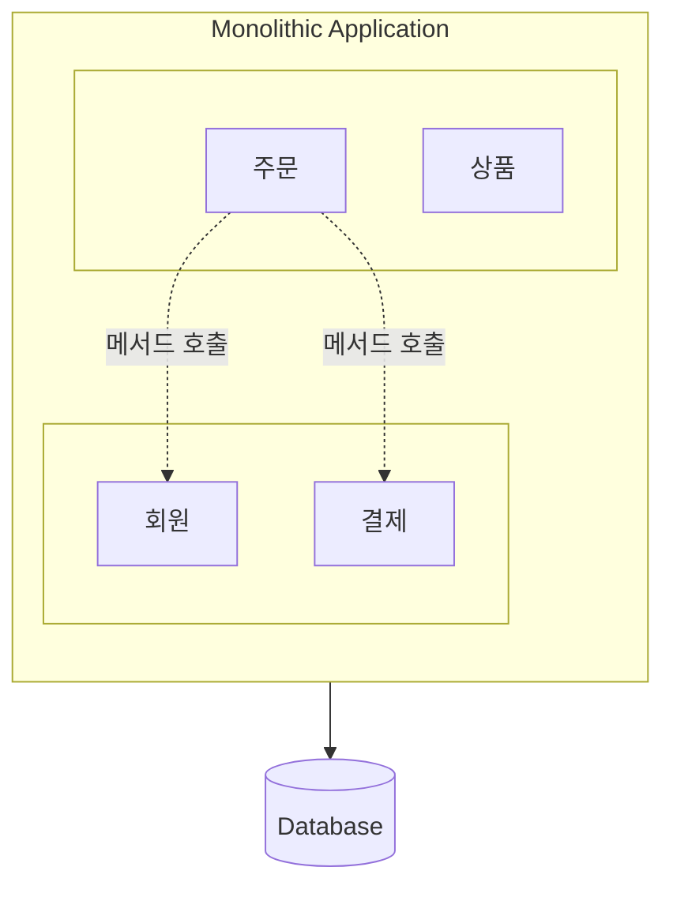

저번 편의 콘서트 예매 서비스를 예로 들어보겠습니다. 주문 기능에서 회원 정보가 필요하다면 `userService.getUser(userId)`처럼 메서드를 호출하면 됩니다.

이로 인해 모놀리식 환경에서는 **네트워크 통신의 오버헤드가 없고, 데이터 일관성 유지가 상대적으로 용이하다**는 장점이 있습니다.

### MSA에서의 통신

그렇다면 MSA 환경에서는 어떨까요?

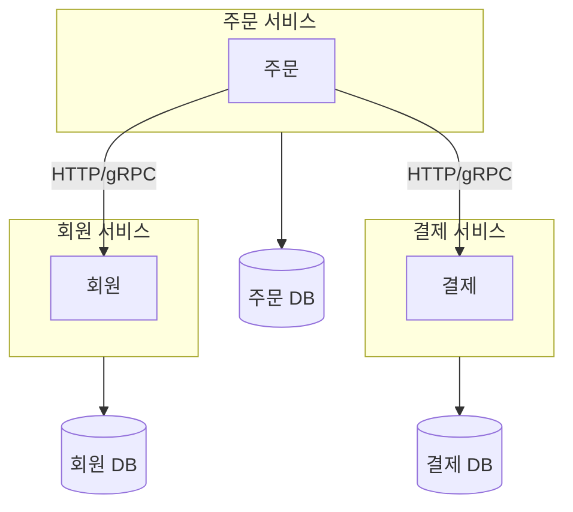

MSA에서는 각 서비스가 독립적인 프로세스로 실행됩니다. 주문 서비스에서 회원 정보가 필요하다면 더 이상 `userService.getUser(userId)` 메서드 호출로 끝나지 않습니다.

네트워크를 통해 회원 서비스에 요청을 보내고, 응답을 받아야 합니다. 이 과정에서 모놀리식에서는 고려하지 않아도 됐던 여러 가지 문제들이 발생할 수 있습니다.

네트워크 지연이 발생하거나, 회원 서비스가 다운되어 있을 수도 있습니다. 요청이 중간에 유실되거나 타임아웃이 발생할 수도 있죠.

저는 이러한 문제들이 MSA 환경에서 반드시 고려해야 할 부분들이라고 생각합니다.

### 분산 컴퓨팅의 8가지 오류 (Fallacies of Distributed Computing)

이러한 문제들을 이해하는 데 도움이 되는 개념이 하나 있습니다. 바로 **분산 컴퓨팅의 8가지 오류(Fallacies of Distributed Computing)** 입니다.

이 개념은 1994년 **Sun Microsystems의 Peter Deutsch**가 처음 7가지를 정리하고, 이후 **James Gosling**(Java 창시자)이 8번째를 추가하여 완성되었습니다. 분산 시스템을 설계할 때 흔히 저지르는 잘못된 가정들을 정리한 것인데, MSA를 경험하기 전에는 개념적으로만 알고 있던 내용이었지만 실제로 MSA 환경에서 일하면서 더 와닿는 부분들이 있었습니다.

1. **네트워크는 신뢰할 수 있다** (The network is reliable): 네트워크는 언제든지 끊어지거나 패킷이 손실될 수 있습니다.
2. **지연 시간은 0이다** (Latency is zero): 데이터 전송에는 항상 시간이 소요되며, 이는 예측 불가능할 수 있습니다.
3. **대역폭은 무한하다** (Bandwidth is infinite): 네트워크 용량에는 한계가 있으며, 트래픽이 몰리면 병목 현상이 발생합니다.
4. **네트워크는 안전하다** (The network is secure): 악의적인 공격이나 보안 위협에 항상 노출될 수 있습니다.
5. **토폴로지는 변하지 않는다** (Topology doesn't change): 네트워크 구성은 동적으로 변할 수 있습니다.
6. **관리자는 한 명이다** (There is one administrator): 분산 시스템은 여러 관리 주체와 환경을 가질 수 있습니다.
7. **전송 비용은 0이다** (Transport cost is zero): 네트워크 통신에는 자원과 비용이 발생합니다.
8. **네트워크는 균일하다** (The network is homogeneous): 다양한 종류의 기기와 네트워크 환경이 혼재할 수 있습니다.

저는 이러한 오류들이 MSA 환경에서 서비스 간 통신을 설계할 때 반드시 염두에 두어야 할 중요한 고려사항들이라고 생각합니다. 실제로 MSA 환경에서 일하다 보면 이 8가지 오류가 정말 피부로 와닿는 순간들이 있더라구요.

결국 **분산 시스템에서는 네트워크 통신이 필수적이기 때문에 어떤 방식으로 서비스 간 통신을 설계할지에 대한 고민이 매우 중요**한 것 같습니다.

## 첫 번째 갈림길: 동기 vs 비동기

그렇다면 MSA 환경에서 서비스 간 통신에는 어떤 방식들이 있을까요?

먼저 가장 근본적인 선택지부터 살펴보겠습니다. **동기 통신**과 **비동기 통신**입니다.

동기 통신과 비동기 통신에 대해 검색해보시면 흔히 이런 그림을 많이 보실 수 있으실 것 같습니다.


위 그림을 보시면 동기/비동기와 블로킹/논블로킹이라는 두 가지 축이 있는 것을 확인하실 수 있습니다. 이 두 개념은 흔히 혼용되어 사용되기도 하는데, 엄밀히 말하면 서로 다른 관점의 개념입니다.

먼저 각 개념을 정리해보겠습니다.

**동기(Synchronous) vs 비동기(Asynchronous)** 는 **호출자가 결과를 어떻게 받는가**에 대한 관점입니다.

- **동기**: 호출 후 결과가 반환될 때까지 대기합니다. 결과를 함수의 반환값으로 직접 받습니다.
- **비동기**: 호출 즉시 제어권이 반환되며, 결과는 나중에 콜백, 이벤트, Future/Promise 등을 통해 받습니다.

**블로킹(Blocking) vs 논블로킹(Non-blocking)** 은 **제어권을 언제 반환하는가**에 대한 관점입니다.

- **블로킹**: 작업이 완료될 때까지 제어권을 반환하지 않습니다 (대기)
- **논블로킹**: 작업 완료 여부와 관계없이 제어권을 즉시 반환합니다

이 두 개념을 조합하면 **동기+블로킹**, **동기+논블로킹**, **비동기+블로킹**, **비동기+논블로킹** 4가지 경우가 나옵니다. 각 조합의 특성과 실무에서 주의해야 할 점들이 있는데, 이 부분은 MSA와 직접적인 관련보다는 일반적인 프로그래밍 개념에 가깝기 때문에 별도의 글에서 자세히 다루도록 하겠습니다.

MSA 관점에서 중요한 건 이겁니다: **동기 통신은 호출하는 쪽이 응답을 기다리고, 비동기 통신은 기다리지 않는다.**

### 동기 통신

그렇다면 동기 통신은 언제 필요하고 비동기 통신은 언제 필요할까요?

동기 통신은 주로 **즉시 응답이 필요한 경우**에 사용됩니다.

주문 서비스에서 결제를 진행하기 전에 회원의 잔액을 확인해야 하는 상황을 생각해보겠습니다. 

잔액 정보 없이 진행했다가는 결제 실패로 이어질 수 있기 때문에 주문 서비스는 회원 서비스의 잔액 응답을 기다려야 합니다. 이런 경우에는 동기 통신이 적합하다고 생각합니다.

물론 결제 시도하는 방식으로 Queue를 사용하여 비동기 통신으로 구현할 수 도 있겠지만, 이는 결제 지연이나 실패에 대한 사용자 경험(UX) 측면에서 부정적인 영향을 미칠 수 있습니다.

### 비동기 통신

비동기 통신은 **즉시 응답이 필요하지 않거나, 작업이 오래 걸리는 경우**에 사용됩니다.

주문이 완료된 후 알림을 보내는 상황을 생각해보겠습니다. 알림 발송이 완료될 때까지 주문 응답을 기다릴 필요는 없습니다. 주문 서비스는 "주문 완료" 이벤트만 발행하고 바로 사용자에게 응답을 반환하면 됩니다. 알림 서비스는 나중에 해당 이벤트를 받아서 알림을 발송하면 되죠.

자 그렇다면 동기 통신과 비동기 통신을 통해 서비스 간 통신을 구현하는 방법에는 어떤 것들이 있을까요? 그리고 우리는 어떤 방법을 선택해야 할까요?

구체적인 구현 방법을 살펴보기 전에, 한 가지 짚고 넘어가고 싶은 부분이 있습니다.

### 비동기라고 다 비동기가 아니다

동기 호출은 상대 서비스가 다운되면 장애가 전파됩니다. 물론 Fallback이나 Circuit Breaker로 어느 정도 막을 수 있지만, **호출 시점에 상대 서비스 상태에 의존하게 되는 건 변하지 않습니다.** 비동기로 전환하면 이 의존성을 덜어낼 수 있어요.

하지만 비동기로 바꿨다고 해서 무조건 의존성이 사라지는 건 아닙니다. 예를 들어 "이 이벤트가 5초 안에는 처리되어야 해"라고 기대하거나, 처리 결과를 기다리며 폴링하기 시작하면 어떻게 될까요?

이런 상황을 **Hidden Synchronous Dependency(숨겨진 동기적 의존성)** 라고 부릅니다. 겉으로는 비동기인데 실제로는 동기처럼 동작하는 셈이죠. 비동기의 장점인 "느슨한 결합"을 제대로 누리려면 이 부분을 주의해야 한다고 생각합니다.

결국 동기냐 비동기냐는 단순히 "기다리느냐 안 기다리느냐"가 아니라 **"얼마나 느슨하게 결합할 수 있는가"의 문제**라고 생각합니다.

## 동기 통신: REST vs gRPC vs GraphQL

우선 동기 통신부터 살펴보겠습니다. 동기 통신에는 대표적으로 세 가지 방식이 있습니다.

가장 저희에게 익숙한 **REST API**, 구글에서 개발한 **gRPC**, 그리고 페이스북에서 개발한 **GraphQL Federation**입니다.

### REST API

REST(Representational State Transfer)는 HTTP 프로토콜을 기반으로 하는 아키텍처 스타일입니다. 자원을 URI로 표현하고, HTTP 메서드(GET, POST, PUT, DELETE 등)를 사용하여 자원에 대한 작업을 수행하는 방식입니다.

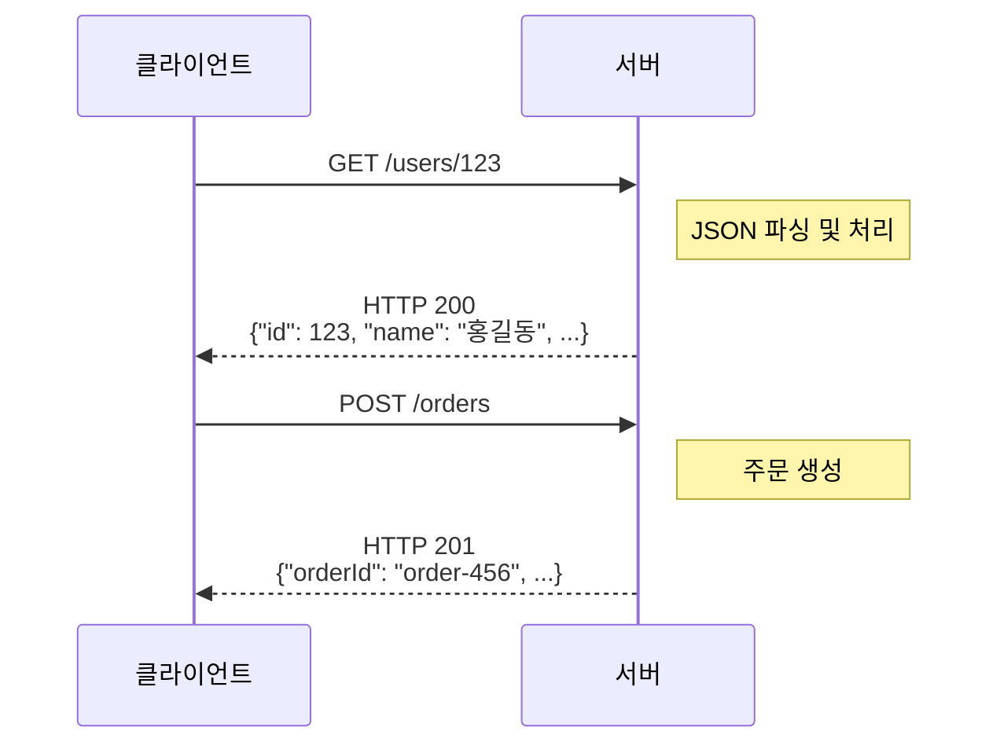

아마 대부분의 개발자분들이 가장 익숙한 방식이 아닐까요? 저도 처음 개발을 배울 때부터 REST API를 사용해왔고, 지금도 가장 많이 사용하는 방식입니다.

REST API의 장점은 여러 가지가 있겠지만, 저는 가장 큰 장점이 **범용성**이라고 생각합니다. HTTP를 지원하는 거의 모든 환경에서 사용할 수 있고, JSON 형식의 데이터는 사람이 읽기에도 편합니다. 디버깅할 때 응답을 바로 확인할 수 있다는 점도 큰 장점입니다.

하지만 단점도 있습니다. REST API도 `HTTP/2` 위에서 동작할 수 있고, JSON 대신 Protobuf를 사용하거나 SSE/WebSocket을 조합하는 것도 가능합니다. 다만 **일반적으로 사용되는 REST + JSON + 요청/응답 모델**에서는 몇 가지 한계가 있습니다. JSON은 텍스트 기반이기 때문에 바이너리 형식에 비해 데이터 크기가 크고 파싱 비용도 발생합니다. 또한 요청마다 독립적인 응답을 기다리는 구조라서, 여러 데이터를 한 번에 가져오려면 여러 번 요청하거나 API를 별도로 만들어야 합니다.

### gRPC

gRPC는 구글에서 개발한 고성능 RPC(Remote Procedure Call) 프레임워크입니다. `HTTP/2`를 기반으로 동작하며, Protocol Buffers(protobuf)라는 바이너리 직렬화 형식을 사용합니다.

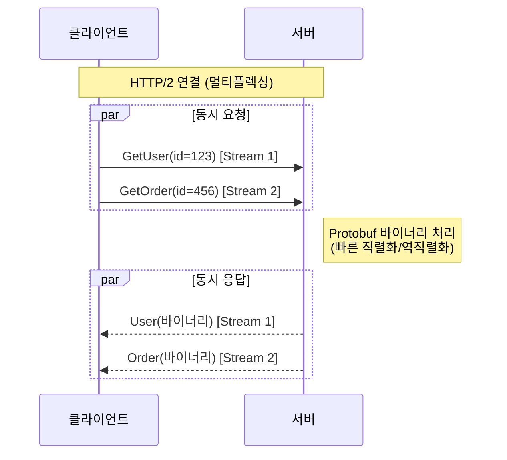

gRPC의 가장 큰 장점은 역시 **성능**입니다. `HTTP/2`의 멀티플렉싱 덕분에 하나의 연결에서 여러 요청을 동시에 처리할 수 있고, Protocol Buffers는 JSON에 비해 데이터 크기가 작고 직렬화/역직렬화 속도도 빠릅니다.

또한 `.proto` 파일을 통해 API 스펙을 정의하기 때문에 **타입 안전성**이 보장됩니다. 클라이언트와 서버가 동일한 proto 파일을 공유하면 컴파일 타임에 타입 오류를 잡을 수 있습니다. 이는 MSA 환경에서 여러 서비스가 통신할 때 큰 장점이 된다고 생각합니다.

그렇다면 gRPC가 무조건 좋은 걸까요? 꼭 그렇지만은 않습니다.

여기서 한 가지 중요한 점을 짚고 넘어가야 할 것 같습니다. **서비스 간 통신(Internal)** 과 **클라이언트-서버 통신(External)** 을 구분해서 생각해야 한다는 점입니다.

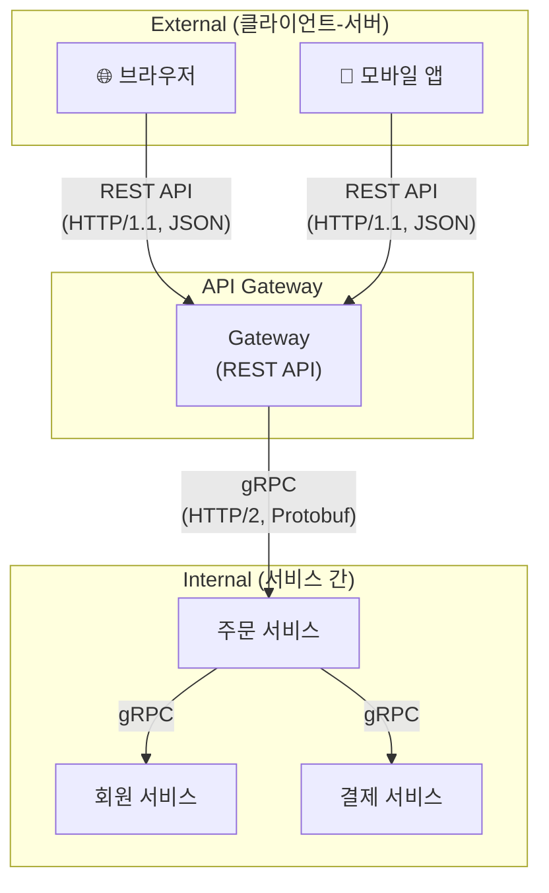

MSA 환경에서 백엔드 서비스들끼리 통신하는 경우(Internal)에는 gRPC가 좋은 선택이 될 수 있습니다. 서버 환경은 `HTTP/2`를 완벽하게 지원하고, 성능과 타입 안전성의 이점을 충분히 누릴 수 있기 때문입니다.

하지만 브라우저나 모바일 앱과 같은 클라이언트와 통신하는 경우(External)에는 상황이 다릅니다. 브라우저의 경우 `HTTP/2` 자체는 지원하지만, gRPC가 사용하는 `HTTP/2`의 특정 기능들(trailer, full-duplex streaming 등)을 브라우저의 fetch/XHR API가 완전히 지원하지 않습니다. 그래서 브라우저에서 gRPC를 사용하려면 gRPC-Web이라는 별도의 프록시 계층이 필요합니다.

이러한 이유로 많은 조직에서는 **서비스 간 통신에는 gRPC**, **클라이언트-서버 통신에는 REST API**를 사용하는 하이브리드 방식을 채택하기도 합니다.

#### gRPC의 4가지 통신 패턴

gRPC는 단순한 요청-응답(Unary) 외에도 **스트리밍**을 지원합니다.

| 패턴 | 흐름 | 사용 사례 |
|-----|------|----------|
| **Unary** | Client → Server → Client | 단순 CRUD |
| **Server Streaming** | Client → Server ⇒ Client | 실시간 피드, 대용량 다운로드 |
| **Client Streaming** | Client ⇒ Server → Client | 파일 업로드, 센서 데이터 |
| **Bidirectional** | Client ⇔ Server | 채팅, 실시간 게임 |

`.proto` 파일에서 `stream` 키워드로 스트리밍 여부를 정의합니다.

```protobuf
syntax = "proto3";

package user;

service UserService {
  // Unary - 단순 요청/응답
  rpc GetUser(GetUserRequest) returns (User);

  // Server Streaming - 서버가 여러 응답을 스트리밍
  rpc ListUsers(ListUsersRequest) returns (stream User);
}

message GetUserRequest {
  int64 id = 1;
}

message ListUsersRequest {
  int32 page_size = 1;
}

message User {
  int64 id = 1;
  string name = 2;
  string email = 3;
}
```

이처럼 `.proto` 파일 하나로 서비스 인터페이스와 메시지 타입을 정의하면, 클라이언트와 서버 양쪽에서 동일한 타입을 사용할 수 있습니다.

### GraphQL Federation

GraphQL은 페이스북에서 개발한 쿼리 언어로, 클라이언트가 필요한 데이터만 정확하게 요청할 수 있다는 특징이 있습니다.

REST API를 사용하다 보면 Over-fetching(필요 이상의 데이터를 받아오는 것)이나 Under-fetching(필요한 데이터를 받기 위해 여러 번 요청해야 하는 것) 문제를 경험하셨을 수 있을 텐데요. GraphQL은 이러한 문제를 해결하기 위해 등장했습니다.

GraphQL Federation은 여러 GraphQL 서비스를 하나의 통합된 그래프로 제공하는 아키텍처입니다. 한 가지 짚고 넘어갈 점은, **GraphQL Federation은 내부 서비스 간 직접 통신보다는 클라이언트 요구사항을 조합하기 위한 API 집계 레이어(BFF)에 가깝다**는 것입니다. 즉, REST나 gRPC처럼 서비스 A가 서비스 B를 직접 호출하는 용도보다는, Gateway에서 여러 서비스의 데이터를 조합하여 클라이언트에게 하나의 API처럼 제공하는 방식입니다.

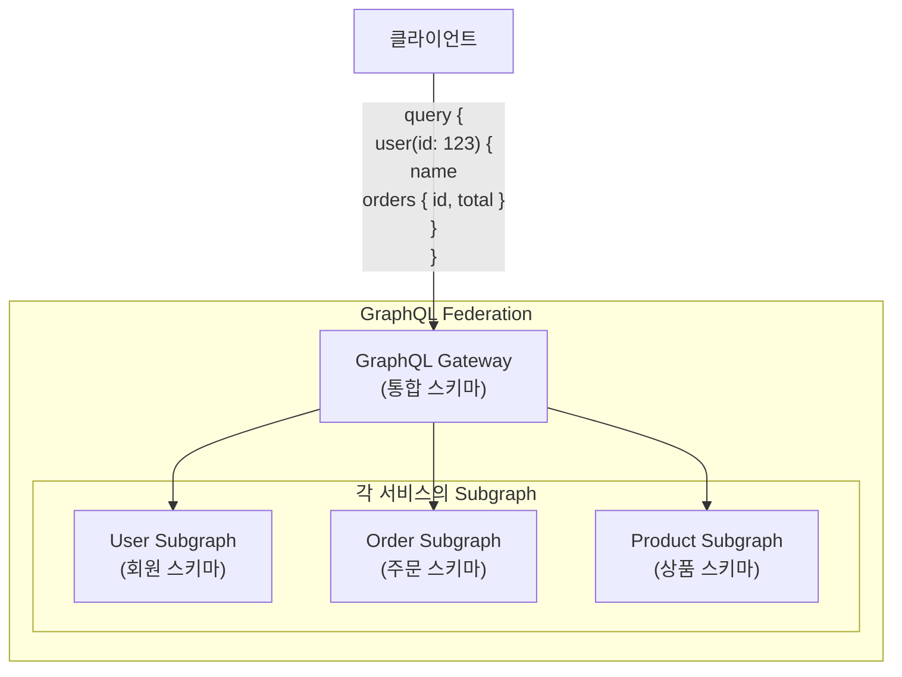

하지만 GraphQL도 만능은 아닙니다. 학습 곡선이 존재하고, HTTP 캐싱을 활용하기 어렵다는 단점이 있습니다. 또한 간단한 CRUD 작업에는 REST API가 더 직관적일 수 있습니다.

#### N+1 문제와 DataLoader

GraphQL 도입 시 반드시 알아야 할 문제가 **N+1 쿼리**입니다. `orders { user { name } }` 같은 쿼리에서 주문 100개를 조회하면, 각 주문마다 user를 조회해서 총 101번의 쿼리가 발생합니다.

해결책은 **DataLoader**입니다. 같은 틱 내의 요청을 모아서 `WHERE id IN (1,2,3...)` 형태로 배치 처리하면 N+1이 1+1로 바뀝니다. GraphQL Federation을 도입한다면 DataLoader 활용이 성능의 핵심입니다.

실무에서 GraphQL Federation은 클라이언트 요구사항이 복잡하고 다양할 때 효과적이지만, 그렇지 않으면 오히려 복잡성만 증가시킬 수 있습니다.

### 언제 무엇을?

| 방식 | 장점 | 단점 | 적합한 상황 |
|-----|-----|-----|-----------|
| REST API | 범용성, 간단함, 디버깅 용이 | 성능, Over/Under-fetching | 클라이언트-서버 통신, 간단한 CRUD |
| gRPC | 고성능, 타입 안전성, 스트리밍 | 브라우저 지원 제한, 디버깅 어려움 | 서비스 간 내부 통신, 고성능 필요 시 |
| GraphQL | 유연한 쿼리, Over/Under-fetching 해결 | 학습 곡선, 캐싱 복잡 | 복잡한 데이터 요구사항, BFF 패턴 |

물론 이 표는 일반적인 가이드라인일 뿐입니다. 실제로는 팀의 기술 스택, 기존 인프라, 서비스의 특성 등을 종합적으로 고려해서 결정해야 한다고 생각합니다. 정답이 없는 영역이기도 하구요.

한 가지 확실한 건, **기술 선택보다 중요한 건 일관성**이라는 점입니다. 서비스마다 REST, gRPC, GraphQL을 혼용하면 오히려 복잡성만 증가합니다. 팀 내에서 합의된 기준을 세우고 일관되게 적용하는 게 더 중요하다고 생각해요. 예를 들어 "클라이언트-서버 통신은 REST API, 서비스 간 통신은 gRPC"와 같은 기준을 세우는 것이죠.

#### 언제 쓰면 안 되는가?

각 기술의 장점만큼 **피해야 할 상황**도 명확합니다.

- **gRPC를 피해야 할 때**: 팀에 protobuf 경험이 없고 학습 여유가 없을 때, 브라우저 직접 통신이 필요할 때, 디버깅 편의성이 중요한 초기 MVP 단계
- **GraphQL을 피해야 할 때**: 단순 CRUD 위주의 서비스, 팀 내 GraphQL 운영 경험이 없을 때, 캐싱이 핵심인 읽기 중심 서비스
- **REST를 피해야 할 때**: 서비스 간 호출이 초당 수천 건 이상으로 성능이 병목일 때, 스키마 변경이 잦아서 타입 안전성이 중요할 때

기술 선택에서 가장 위험한 건 **"좋아 보여서"** 라고 생각합니다. gRPC의 성능이 좋다고 해서 모든 곳에 도입하면, 디버깅과 운영 및 유지보수의 어려움과 학습 비용이 그 성능 이득을 상쇄할 수 있도 있으니까요.

### 서비스를 어떻게 찾을 것인가: Service Discovery

REST, gRPC, GraphQL 어떤 프로토콜을 사용하든, 서비스 간 통신을 하려면 **상대 서비스의 위치를 알아야 합니다.** 모놀리식에서는 고민할 필요 없던 문제죠.

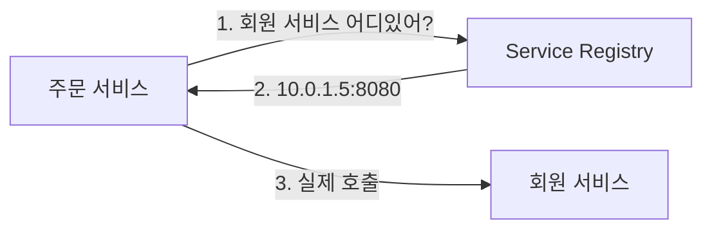

대표적인 방식:
- **Client-side Discovery**: 클라이언트가 Registry에서 직접 조회 (Eureka, Consul)
- **Server-side Discovery**: 로드밸런서/Gateway가 라우팅 (AWS ALB, K8s Service)
- **DNS 기반**: `user-service.default.svc.cluster.local` 형태로 접근 (Kubernetes)

Kubernetes 환경이라면 내장 DNS로 충분하고, 그렇지 않다면 Consul이나 Eureka를 검토해보세요. Service Discovery 자체로도 큰 주제이지만, 여기서는 "통신 전에 이 문제를 먼저 해결해야 한다"는 점만 짚고 넘어가겠습니다.

### API Gateway: 외부와 내부의 경계

앞서 Internal/External 통신을 구분해야 한다고 했습니다. 이 경계에서 핵심 역할을 하는 것이 **API Gateway**입니다.

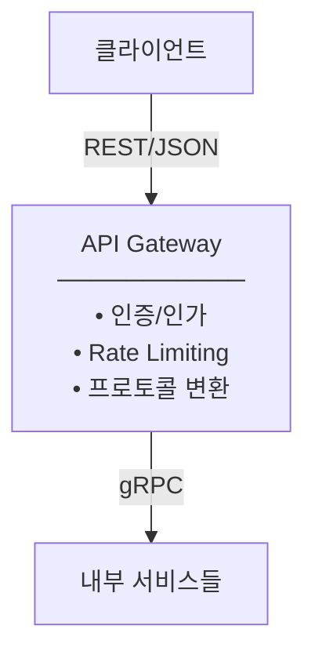

API Gateway의 주요 역할:
- **프로토콜 변환**: 외부는 REST, 내부는 gRPC
- **인증 일원화**: JWT 검증을 Gateway에서 처리, 내부 서비스는 신뢰
- **Rate Limiting**: 클라이언트별 요청 제한으로 내부 서비스 보호
- **요청 집계 (BFF)**: 여러 내부 호출을 하나의 응답으로 조합

대표 구현체: Kong, AWS API Gateway, Spring Cloud Gateway

**주의점**: Gateway가 Single Point of Failure가 될 수 있습니다. Gateway 장애 = 전체 시스템 마비이므로, 다중화와 헬스체크는 필수라고 생각합니다.

## 비동기 통신: Message Queue vs Event Broker

자 이제 동기 통신은 알아봤으니 이제 비동기 통신에 대해 살펴보겠습니다. 비동기 통신에는 어떤 방법들이 있을까요?

비동기 통신에서 가장 많이 언급되는 것은 **Message Queue**와 **Event Broker**입니다.

두 개념이 혼용되어 사용되는 경우도 있는데, 엄밀히 말하면 서로 다른 패턴과 사용 목적을 가지고 있습니다.

### Message Queue (SQS, RabbitMQ)

Message Queue는 **점대점(Point-to-Point)** 통신 패턴이라고 할 수 있습니다. 하나의 메시지는 하나의 소비자(Consumer)만 처리합니다. Message Queue의 대표적인 구현체로는 AWS SQS, RabbitMQ 등이 있습니다.

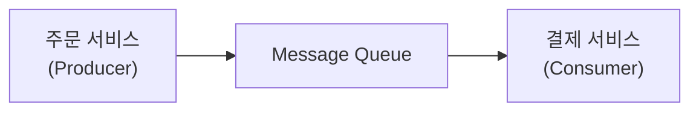

콘서트 예매 서비스를 예로 들어보겠습니다. 주문 서비스에서 결제 요청을 Message Queue에 넣으면, 결제 서비스가 해당 메시지를 가져가서 처리합니다. 이때 메시지는 한 번 소비되면 Queue에서 사라지기 때문에, 다른 서비스가 같은 메시지를 다시 처리할 수 없습니다.

Message Queue는 다음과 같은 상황에 적합합니다.
- **작업을 하나의 서비스에만 전달**해야 하는 경우
- **작업 부하를 분산**해야 하는 경우 (여러 Consumer가 하나의 Queue를 바라보며 작업을 나눠 처리)
- **순서가 중요한 작업**을 처리해야 하는 경우 (FIFO Queue)

### Event Broker (SNS, Redis Pub/Sub)

반면 Event Broker는 **발행-구독(Pub/Sub)** 패턴이라고 할 수 있습니다. 하나의 이벤트를 여러 구독자(Subscriber)가 동시에 받아서 처리할 수 있습니다.

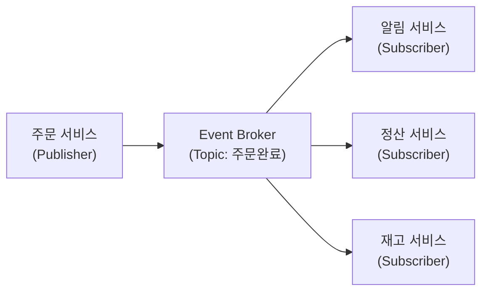

다시 콘서트 예매 서비스로 예를 들어보겠습니다. 주문이 완료되면 여러 가지 후속 작업이 필요합니다. 사용자에게 알림을 보내야 하고, 정산 데이터를 기록해야 하고, 재고를 차감해야 합니다.

이때 주문 서비스가 "주문 완료" 이벤트를 Event Broker에 발행하면, 알림 서비스, 정산 서비스, 재고 서비스가 각각 해당 이벤트를 구독하여 자신의 작업을 수행합니다. **하나의 이벤트가 여러 서비스에 전달**되는 것입니다.

Event Broker의 대표적인 구현체로는 AWS SNS, Redis Pub/Sub 등이 있습니다. 다만 구현체마다 전달 보장 수준이 다르다는 점을 주의해야 합니다. Redis Pub/Sub은 진짜 Fire-and-forget으로 구독자가 없으면 메시지가 유실되지만, SNS는 SQS와 연동하면 메시지가 영속화되어 재처리가 가능합니다. 실무에서는 SNS+SQS 조합을 많이 사용하는데, 이 경우 Event Broker의 Fan-out 특성과 Message Queue의 영속성을 함께 얻을 수 있습니다.

Event Broker는 다음과 같은 상황에 적합합니다.
- **하나의 이벤트를 여러 서비스가 처리**해야 하는 경우
- **서비스 간 결합도를 낮추고 싶은 경우** (발행자는 구독자를 알 필요가 없음)
- **이벤트 기반 아키텍처**를 구축하려는 경우

### 그렇다면 Kafka는?

여기서 한 가지 짚고 넘어가야 할 점이 있습니다. **Kafka는 단순한 Event Broker가 아닙니다.** Kafka는 **이벤트 스트리밍 플랫폼**으로, Message Queue나 Event Broker와는 근본적으로 다른 특성을 가지고 있습니다.

가장 큰 차이점은 **Append-only 로그** 기반이라는 점입니다.

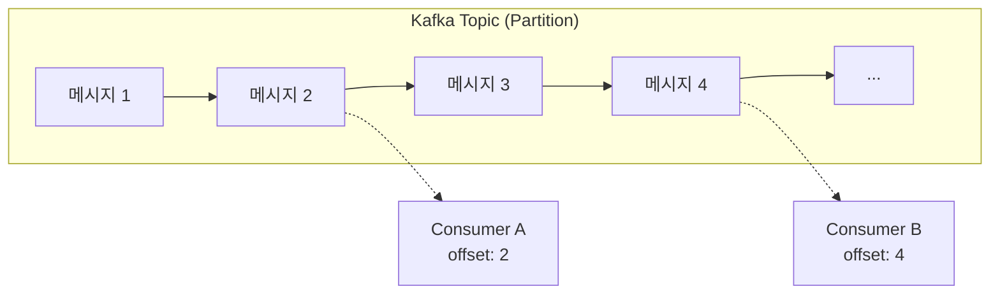

일반적인 Message Queue에서는 메시지가 소비되면 Queue에서 삭제됩니다. 하지만 Kafka에서는 **메시지가 소비되어도 삭제되지 않고 retention period 동안 유지**됩니다. 각 Consumer는 자신만의 offset을 관리하며, 같은 메시지를 여러 번 읽을 수도 있습니다.

이 특성 덕분에 Kafka는 다음과 같은 상황에서 장점을 발휘합니다.

- **이벤트 리플레이**: Consumer의 offset을 처음으로 되돌려서 모든 이벤트를 재처리할 수 있습니다. 새로운 서비스를 추가하거나, 버그로 인해 데이터를 다시 처리해야 할 때 유용합니다.
- **이벤트 소싱(Event Sourcing)**: 상태 변경 이력을 모두 보관하고, 필요할 때 이벤트를 재생하여 현재 상태를 재구성할 수 있습니다.
- **감사 로그(Audit Log)**: 모든 이벤트가 보관되므로 언제든 과거 기록을 조회할 수 있습니다.

물론 Kafka도 Pub/Sub 패턴을 지원하기 때문에 Event Broker처럼 사용할 수 있습니다. 하지만 Kafka를 단순히 "여러 구독자에게 이벤트를 전달하는 도구"로만 보기보다는, **이벤트의 영속성과 재처리 가능성**이 필요한 경우에 선택하는 것이 바람직하지 않나 싶습니다.

다만 한 가지 주의할 점이 있습니다. Kafka가 강력하고 좋은 도구인 것은 맞지만, 그만큼 **트레이드오프**가 존재합니다. 파티션, 오프셋, 컨슈머 그룹 등 학습해야 할 개념들이 많고, 클러스터 운영과 모니터링에 들어가는 리소스도 만만치 않습니다. 저도 처음 Kafka를 도입했을 때 "이벤트 재처리가 가능하다"는 장점에 끌렸는데, 막상 운영해보니 그 장점을 누리기 위해 감수해야 할 복잡성이 상당하더라구요. 단순한 이벤트 전파가 목적이라면 SNS+SQS 조합이 훨씬 가볍고 관리하기 편한 것 같습니다.

또 하나 반드시 알아야 할 점이 있습니다. **Kafka는 기본적으로 At-least-once 전달을 보장합니다.** 즉, 메시지가 최소 한 번은 전달되지만, 네트워크 문제나 Consumer 재시작 등으로 인해 **같은 메시지가 중복 처리될 수 있습니다.** Exactly-once 시맨틱을 지원하긴 하지만 설정이 복잡하고 성능 오버헤드가 있어서, 대부분의 경우 **Consumer 쪽에서 멱등성(Idempotency)을 보장하도록 설계**하는 것이 좋다고 생각합니다. "이벤트니까 한 번만 처리되겠지"라고 생각하면 나중에 중복 처리 버그로 고생할 수 있습니다.

Kafka에 대해 너무 잘 정리된 글이 있어 혹시 Kafka를 더 깊이 이해하고 싶으신 분들은 다음 글을 참고하시면 좋을 것 같습니다. 

- [소프트웨어 엔지니어가 알아야 할 로그에 대한 모든 것](https://medium.com/rate-labs/%EC%86%8C%ED%94%84%ED%8A%B8%EC%9B%A8%EC%96%B4-%EC%97%94%EC%A7%80%EB%8B%88%EC%96%B4%EA%B0%80-%EC%95%8C%EC%95%84%EC%95%BC-%ED%95%A0-%EB%A1%9C%EA%B7%B8%EC%97%90-%EB%8C%80%ED%95%9C-%EB%AA%A8%EB%93%A0-%EA%B2%83-11513af8b998)

Linkedin에서 Apache Kafka를 개발한 Jay Kreps가 2013년에 쓴 글을 번역 및 해석한 아티클인데 로그에서 시작해서 Kafka가 만들어진 배경과 설계 철학, 그리고 Kafka의 내부 동작 원리까지 아주 잘 설명되어 있습니다. 저도 기회가 된다면 따로 Kafka 분석 글을 써보고 싶네요.

다시 본론으로 돌아가 보겠습니다. 그렇다면 저희는 어떤 도구를 선택해야 할까요?

### Message Queue vs Event Broker vs Kafka 비교

| 항목 | Message Queue | Event Broker | Kafka |
|-----|--------------|--------------|-------|
| 통신 패턴 | 점대점 (1:1) | 발행-구독 (1:N) | 발행-구독 (1:N) |
| 소비 방식 | 하나의 메시지는 하나의 Consumer만 처리 | 모든 Subscriber에게 전달 | Consumer Group별로 분배 |
| 메시지 저장 | 소비(ACK) 후 삭제 | 기본적으로 영속화 안 함 (구현체마다 다름) | Retention 기간 동안 보관 |
| 재처리 | DLQ로 실패 메시지만 재처리 | 불가 | Offset 리셋으로 전체 재처리 가능 |
| 순서 보장 | FIFO Queue로 가능 | 보장 안 됨 | Partition 내에서 보장 |
| 주요 용도 | 작업 분배, 비동기 처리 | 이벤트 브로드캐스트 | 이벤트 스트리밍, 이벤트 소싱 |
| 대표 구현체 | SQS, RabbitMQ | SNS, Redis Pub/Sub | Apache Kafka, AWS MSK |

실제로는 이것들을 함께 사용하는 경우가 많습니다. 예를 들어 SNS로 이벤트를 발행하고, 각 서비스는 자신만의 SQS를 구독하여 메시지를 처리하는 방식입니다. 또는 Kafka에 이벤트를 발행하고, 각 서비스가 Consumer Group으로 구독하는 방식도 있습니다. **어떤 조합이 적합한지는 이벤트 재처리 필요성, 메시지 순서 보장, 처리량 등을 고려해서 결정**해야 합니다.

### Choreography vs Orchestration

비동기 통신에서 또 하나 중요한 개념이 있습니다. 바로 여러 서비스 간의 **워크플로우를 어떻게 관리할 것인가**에 대한 문제입니다.

이에 대한 대표적인 두 가지 접근 방식이 **Choreography**와 **Orchestration**입니다.

#### Choreography (안무)

Choreography는 중앙 조정자 없이 **각 서비스가 이벤트에 반응하여 자율적으로 동작**하는 방식입니다. 마치 춤을 출 때 안무가 없이 각자가 음악에 맞춰 자유롭게 움직이는 것과 비슷하다고 할 수 있습니다.

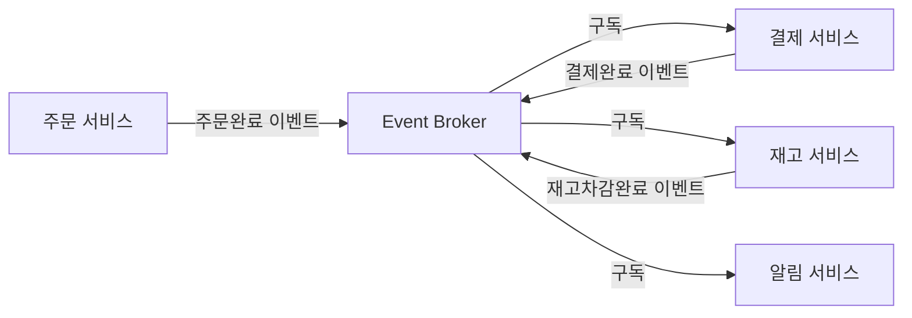

각 서비스는 자신이 관심 있는 이벤트만 구독하고, 자신의 작업이 완료되면 새로운 이벤트를 발행합니다. 전체 워크플로우를 관리하는 중앙 컴포넌트가 없기 때문에 **서비스 간 결합도가 낮고**, 새로운 서비스를 추가하기도 쉽습니다.

하지만 단점도 존재합니다. 전체 워크플로우가 여러 서비스에 분산되어 있기 때문에 **흐름을 파악하기 어렵고**, 문제가 발생했을 때 **디버깅이 복잡**해질 수 있습니다. 또한 서비스가 많아질수록 이벤트 간의 관계가 복잡해져서 관리가 어려워질 수 있습니다.

#### Orchestration (오케스트라)

Orchestration은 **중앙 조정자(Orchestrator)가 전체 워크플로우를 관리**하는 방식입니다. 마치 오케스트라의 지휘자가 각 악기의 연주를 조율하는 것과 비슷하다고 할 수 있습니다.

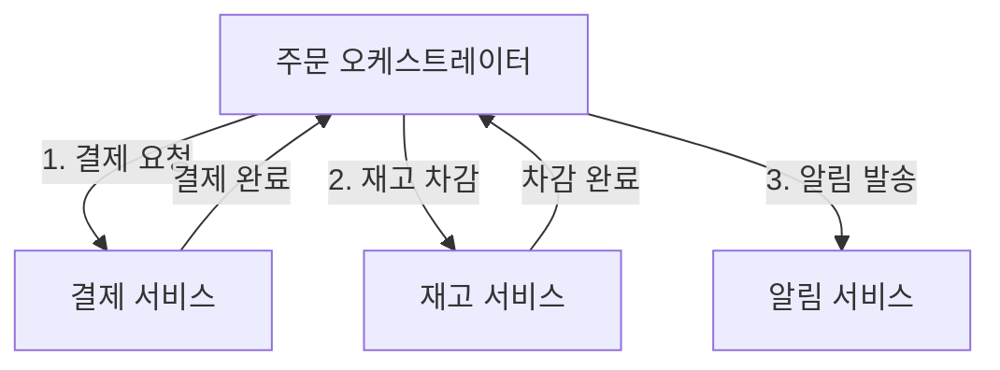

Orchestrator가 워크플로우의 각 단계를 순차적으로 호출하고, 각 서비스의 응답을 받아서 다음 단계를 진행합니다. **전체 흐름이 한 곳에 집중**되어 있기 때문에 워크플로우를 파악하기 쉽고, 에러 처리나 보상 트랜잭션 구현도 상대적으로 용이합니다.

하지만 Orchestrator가 **단일 장애점(Single Point of Failure)** 이 될 수 있고, 모든 서비스가 Orchestrator에 의존하기 때문에 **결합도가 높아질 수 있다는 점**을 고려해야 합니다.

#### 언제 무엇을?

| 항목 | Choreography | Orchestration |
|-----|-------------|---------------|
| 결합도 | 낮음 | 높음 |
| 흐름 파악 | 어려움 | 쉬움 |
| 확장성 | 좋음 | 보통 |
| 에러 처리 | 복잡함 | 상대적으로 용이 |
| 적합한 상황 | 단순한 이벤트 전파, 느슨한 결합 필요 시 | 복잡한 비즈니스 로직, 트랜잭션 관리 필요 시 |

제 경험상 두 가지를 명확하게 구분해서 사용하기보다는, **상황에 따라 혼합해서 사용**하는 경우가 많았습니다.

단순한 이벤트 전파(알림 발송, 로그 기록 등)에는 Choreography를, 복잡한 비즈니스 트랜잭션(주문-결제-재고 처리 등)에는 Orchestration을 적용하는 식입니다.

결국 **비동기 통신은 "의존성을 덜어내는" 시스템에 만드는 것**이라고 생각합니다. 메시지가 쌓여있다가 나중에 처리되어도 괜찮은 작업, 잠시 지연되어도 비즈니스에 큰 영향이 없는 작업을 분리해내는 거죠.

#### 언제 쓰면 안 되는가?

비동기 통신도 마찬가지로 **피해야 할 상황**이 있습니다.

- **Kafka를 피해야 할 때**: 단순한 이벤트 전파가 목적일 때 (SNS+SQS가 훨씬 가벼움), 클러스터 운영 역량이 부족할 때, 이벤트 재처리가 필요 없는 경우
- **Choreography를 피해야 할 때**: 워크플로우가 5단계 이상으로 복잡할 때, 보상 트랜잭션이 필요할 때, "지금 전체 흐름이 어디까지 진행됐지?"를 알아야 할 때
- **비동기 자체를 피해야 할 때**: 사용자가 즉시 결과를 확인해야 할 때, 순서 보장이 까다로운 작업, 디버깅 복잡도를 감당할 팀 역량이 없을 때

또한 비동기 통신을 도입할 때 주의해야 할 점이 하나 더 있는 것 같습니다. **이벤트 처리를 남발하거나, 제대로 문서화하지 않거나, 일관성 없이 개발하면 복잡도가 심각하게 증가할 수 있습니다.** 언제, 누구에 의해 이벤트가 발행되고, 누가 그 이벤트를 처리하는지 파악할 수 없게 되면 서비스 전체를 이해하기 어렵게 만드는 주범이 되더라구요.

실제로 제가 팀에 합류했을 때 이미 MSA 전환이 진행 중이었는데, 서비스 파악에서 가장 어려웠던 부분 중 하나가 SNS+SQS 조합이었습니다. 문서화가 전혀 되어 있지 않아서 각 서비스 코드에서 Ctrl+F로 토픽 이름을 검색하며 발행하는 곳과 구독하는 곳을 하나하나 찾아다녀야 했습니다. 이벤트 기반 아키텍처의 장점인 "느슨한 결합"이 오히려 "아무도 전체 흐름을 모르는 상태"로 변질될 수 있다고 생각합니다.

개인적으로 비동기는 **복잡도와 장애전파를 트레이드 오프를 통해 바꾼 것**인 것 같습니다. 동기 호출의 "장애 전파" 문제가 비동기에서는 "메시지 유실", "순서 역전", "중복 처리" 문제로 바뀝니다.

## 정리: 그래서 뭘 선택해야 할까?

지금까지 MSA 환경에서의 다양한 통신 방식들을 살펴보았습니다. 그렇다면 실제로 어떤 방식을 선택해야 할까요?

제 개인적인 생각에 **기술은 양자택일이 아니라는 것**입니다. 물론 Event-Driven Architecture(EDA)처럼 이벤트 기반 통신만으로 시스템을 구성하는 아키텍처 패턴도 있지만, 실제 MSA 환경에서는 하나의 시스템 내에서 상황에 따라 동기와 비동기를 함께 사용하는 것이 일반적인 것 같습니다. EDA에 대해서는 기회가 되면 별도의 글에서 더 깊이 다뤄보겠습니다.

예를 들어 주문 플로우를 생각해보면
- **주문 → 회원 잔액 조회**: 동기 (결제 전에 잔액 확인이 필수)
- **주문 → 결제 처리**: 동기 (결제 결과를 즉시 사용자에게 알려야 함)
- **주문 완료 → 알림 발송**: 비동기 (알림이 늦어져도 주문 자체엔 영향 없음)
- **주문 완료 → 정산 데이터 기록**: 비동기 (실시간 처리가 필요 없음)

이처럼 **즉시 응답이 필요한 핵심 흐름은 동기로, 지연되어도 괜찮은 부가 작업은 비동기로** 분리하는 것이 일반적인 패턴인 것 같습니다.

또 동기 비동기를 결정했다면, 그 다음으로 **어떤 프로토콜이나 메시징 시스템을 사용할지**를 결정해야 합니다. 이 부분도 역시 상황에 따라 다릅니다.

다만 제가 중요하게 생각하는 부분은 일관성입니다. **한 시스템 내에서는 가능한 한 일관된 통신 방식을 유지하는 것**이 운영과 유지보수에 큰 도움이 된다고 생각합니다. 

만약 일관되지 않게 어디에선 REST API, 또 어디에선 GraphQL을 사용한다면 서비스 파악과 디버깅이 어려워질 수밖에 없습니다. 팀 내에서 명확한 가이드라인을 세우고, 그에 따라 일관되게 적용하는 것이 중요하다고 생각합니다.

### 통신 방식 결정 플로우차트

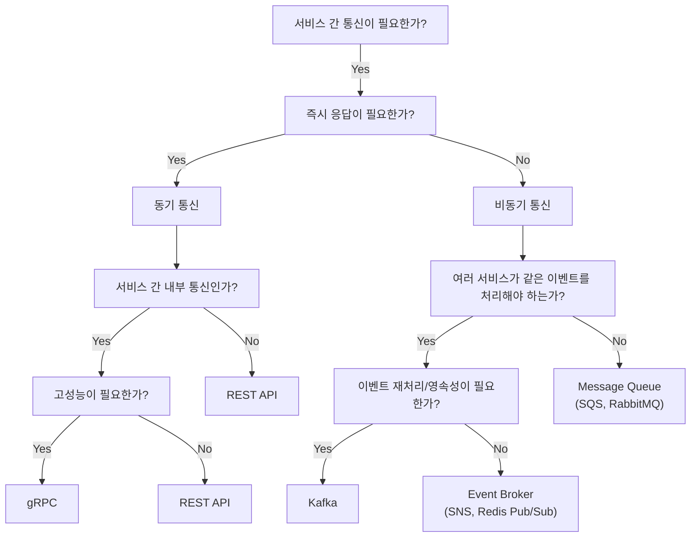

물론 이 플로우차트는 일반적인 가이드라인일 뿐입니다. 실제로는 팀의 상황, 기존 인프라, 운영 역량 등을 종합적으로 고려해서 결정해야 한다고 생각합니다.

결국 저는 **MSA에서 통신 방식을 선택한다는 건 기술의 문제가 아니라, 장애를 어디서 어떻게 감당할 것인가의 문제**라고 생각합니다. 동기 호출을 하나 추가할 때마다 장애 전파 범위가 넓어지고, 비동기로 전환하면 즉시성을 포기하는 대신 장애 격리를 얻게 되는 것 같습니다.

### 결론

굉장히 진부한 말일 수 있지만 결국 **정답은 없다고 생각합니다**. 각 방식의 트레이드오프를 이해하고, 우리 팀과 서비스의 상황에 맞는 선택을 하는 것이 중요하지 않을까싶네요.

그리고 저는 위에서도 언급했지만 기술 선택보다 더 중요한 건 **팀과의 컨벤션을 지키는 것**이라고 생각합니다. 예를 들어 팀에서 "MSA 내부 서비스 간 통신도 REST API를 사용하자"고 협의했다면, 내가 아무리 gRPC가 성능상 더 좋다고 생각하더라도 혼자서 gRPC를 도입하면 안 된다고 생각해요. 그 순간 일관성이 깨지고 복잡도가 올라가서 결국 팀 전체에 안 좋은 영향을 미치게 되니까요. 만약 정말로 더 타당한 기술이 있다고 생각한다면, 팀 전체와 이야기해서 함께 컨벤션을 정하고 그 방향으로 수정해 나가는 게 맞다고 생각합니다.

MSA에서 서비스 간 통신은 단순히 "REST냐 gRPC냐", "Kafka를 쓰느냐 마느냐"의 문제가 아니라, 장애를 어디까지 허용할 것인지, 지연을 어디서 감당할 것인지, 그리고 복잡도를 어디에 둘 것인지에 대한 선택에 가깝다고 느꼈습니다.

이번 편에서는 그 선택의 갈림길들과 그 속에서 제가 했던 고민들을 최대한 구조적으로 정리해보려 했습니다.

그런데 한 가지 문제가 남습니다. 동기 호출을 선택했다면, 호출 대상 서비스가 죽으면 어떻게 될까요? 결제 서비스가 느려지면 주문 서비스도 느려지고, 주문 서비스가 느려지면 그걸 호출하는 서비스도 덩달아 느려집니다. 장애가 도미노처럼 전파되는 거죠. 이런 연쇄적 장애 전파(Cascading Failure)는 동기 호출의 특성입니다. 호출자가 응답을 기다리기 때문에, 피호출자의 장애가 호출자에게 즉시 영향을 미칩니다.

비동기는 다릅니다. 메시지를 큐에 넣고 바로 반환하기 때문에, Consumer가 죽어있어도 Producer는 계속 동작할 수 있습니다. 장애가 "즉시 전파"되지 않는 거죠. 대신 메시지가 큐에 쌓이고, Consumer가 복구되면 그때 처리됩니다. 하지만 비동기라고 문제가 없는 건 아닙니다. 메시지 유실이나 중복 처리 같은 데이터 일관성 문제가 생깁니다. 결국 어떤 방식을 선택하든 장애에 대한 대응은 필요합니다.

다음 편에서는 동기 호출에서 장애가 어떻게 전파되고, 이를 어디서 끊어야 하는지에 대해 이야기해보려고 합니다. 비동기의 데이터 일관성 문제는 4편 데이터 분리에서 다룰 예정입니다.

후편: [[MSA에 관한 고찰 3/6편] 장애는 어떻게 전파되고, 우리는 어디서 끊어야 하는가]()

## 참고 자료

### 분산 시스템 기초

- Peter Deutsch, James Gosling - [Fallacies of Distributed Computing](https://en.wikipedia.org/wiki/Fallacies_of_distributed_computing)
- Martin Kleppmann - *Designing Data-Intensive Applications* (O'Reilly, 2017)

### 통신 프로토콜

- [gRPC Documentation](https://grpc.io/docs/)
- [GraphQL Specification](https://spec.graphql.org/)
- [Apollo Federation](https://www.apollographql.com/docs/federation/)

### 메시징 시스템

- [Apache Kafka Documentation](https://kafka.apache.org/documentation/)
- [RabbitMQ Tutorials](https://www.rabbitmq.com/tutorials)
- [AWS SQS Developer Guide](https://docs.aws.amazon.com/sqs/)
