Previous: [[Reflections on MSA 2/6] Inter-Service Communication in MSA]()

---

In the previous part, we looked at communication methods between services in an MSA environment. We had various options from REST, gRPC, to message queues.

However, regardless of which communication method you choose, there's a reality you inevitably face in distributed systems: **failures are unavoidable**.

In the previous part, I mentioned the 8 fallacies of distributed computing. The first one was "The network is reliable." In MSA environments, inter-service communication happens over the network, so if the network is unstable, failures are inevitable. Of course, failures can occur in monolithic environments too, but in MSA, the addition of network communication makes the causes and propagation of failures much more complex.

So, how do failures propagate in MSA environments, and where and how should we break the chain?

In this part, I'd like to discuss the failure propagation mechanisms in MSA environments and the patterns to prevent them.

---

## How Failures Propagate

First, how do failures propagate? In monolithic environments, I mentioned in Part 1 that since all functions run within a single process, a failure in one module can affect the entire application. So in MSA, where services are separated, does failure isolation happen naturally?

Unfortunately, **that's not always the case.**

Let's use the concert ticketing service as an example again. Suppose the Order Service synchronously calls the Payment Service.

```mermaid
sequenceDiagram
    participant User as User
    participant Order as Order Service
    participant Payment as Payment Service

    User->>Order: Place order
    Order->>Payment: Payment request
    Note right of Payment: 💥 Response delay (DB overload)
    Note right of Order: Waiting for response...<br/>Thread occupied
    Note right of Order: Waiting for response...<br/>Thread occupied
    Note right of Order: Waiting for response...<br/>Thread occupied
    Order--xUser: Eventually Timeout or Error
```



What happens if the Payment Service has issues and responds slowly? The Order Service will hold threads while waiting for the payment response. If these requests keep piling up, the Order Service's thread pool becomes exhausted, and eventually, the Order Service itself becomes unresponsive.

The Payment Service was the only one with problems, but the failure propagated to the Order Service. If there's another service calling the Order Service, the failure would spread there too.

This is how **in MSA, failures can cascade through synchronous call chains.** Even if services are physically separated, if they're logically tightly coupled, you don't fully benefit from failure isolation.

```mermaid
flowchart TB
    Client["👤 Client<br/>④ Service unavailable"] --> Gateway["API Gateway<br/>③ Response delay"]
    Gateway --> Order["Order Service<br/>② Thread exhaustion"]
    Gateway --> User["User Service"]

    Order --> Payment["💥 Payment Service<br/>① Failure occurs"]
    Order --> Inventory["Inventory Service"]
    Order --> User

    style Payment fill:#ff6b6b,color:#fff
    style Order fill:#ffa94d
    style Gateway fill:#ffe066
    style Client fill:#ffe066
```



A failure in just the Payment Service causes the Order Service to die from thread exhaustion, the Gateway experiences response delays, and ultimately the client can't use the service. The Inventory Service and User Service are alive, but the entire ordering flow is paralyzed, making them meaningless.

This is a simple scenario, but in real MSA environments, dozens or hundreds of services are intertwined. It can become difficult to predict how a single service failure will propagate.

Such failure propagation happens frequently in the real world. During the 2017 AWS S3 outage, countless services that depended on S3 went down in a cascade. It was S3's own problem, but even the dashboard for checking S3's status depended on S3, making it difficult to even assess the situation. I think this case shows what can happen when you don't understand how far your dependencies spread.

So how can we prevent this failure propagation?

---

## Ways to Break Failure Propagation

There are several patterns to prevent failure propagation. Broadly, I think they can be categorized as **Fail Fast**, **Retry**, **Block**, **Replace**, and **Isolate**.

Let's look at what problems each pattern solves.

### 1. Timeout: Fail Fast

This is the most basic yet important pattern. **Instead of waiting indefinitely for a response, treat it as a failure after a certain time.**

In the failure propagation scenario we saw earlier, if the Order Service waits 30 seconds for the Payment Service, threads are occupied for those 30 seconds. But if you set a Timeout of 3 seconds, threads are released after 3 seconds and can handle other requests. Of course, those requests might fail too, but that's better than the entire system freezing.


The tricky part of Timeout configuration is **how to determine the appropriate value**.

If it's too short, normal requests might be treated as failures. If it's too long, it reduces the effectiveness of preventing failure propagation. In practice, it's more effective to base it on **P99 (99th percentile) response time** rather than average response time.

For example, let's assume the Payment Service has the following response times:

- Average: 200ms
- P95: 400ms
- P99: 800ms

If you set Timeout to 400-600ms (2-3x the average of 200ms), about 5% of normal requests could fail due to Timeout. On the other hand, if you set it to 1-1.5 seconds with some margin based on P99 (800ms), over 99% of normal requests succeed while still failing fast during incidents.

Of course, this value varies depending on service characteristics. Critical calls like payment should have more margin, while calls where failure is acceptable (like recommendations) can be set more aggressively. The key is to **start with evidence-based numbers and adjust through monitoring**.

One more thing to consider is that you should **distinguish between Connection Timeout and Read Timeout** when configuring.

- **Connection Timeout**: The time to wait for establishing a connection. This is the time until the TCP handshake completes. Usually set short, around 1-3 seconds. If you can't even establish a connection, the server is likely dead or there's a network problem.
- **Read Timeout (Socket Timeout)**: The time to wait for response data after the connection is established. The P99-based value I mentioned earlier mainly refers to this.

If you don't distinguish between the two and only set a single Timeout, it becomes difficult to respond differently to connection failures versus response delays. Most HTTP client libraries allow you to set these two values separately, so I recommend checking your library's options.

The important thing is that **if you set a Timeout, you also need to decide what to do when a Timeout occurs.** Should you just return an error, retry, or execute fallback logic?

### 2. Retry: Try Again

Networks often become momentarily unstable. Requests can fail intermittently or responses can be delayed. In these situations, **Retry** can be effective.

Packets might be lost or the server might have been briefly overloaded. These **transient failures** often succeed when retried.

However, blindly retrying causes problems. Sending more requests to an already overloaded service can make things worse.

That's why many services use **Exponential Backoff**. The retry interval increases exponentially.

```
1st attempt: immediately
2nd attempt: after 1 second
3rd attempt: after 2 seconds
4th attempt: after 4 seconds
5th attempt: after 8 seconds
... (ends when max retry count is reached)
```

Adding **Jitter (random delay)** makes it even more effective. If multiple clients retry simultaneously, requests can pile up at specific times. Adding random delay distributes the retry timing. In caching, there's a similar problem called Cache Stampede, and Jitter is effective in mitigating that too.

#### Caution: Idempotency

There's something you must consider when applying Retry: **idempotency**.

Let's say a payment request was sent but a Timeout occurred. From the client's perspective, the request appears to have failed, but in reality, the payment was successfully processed on the server and only the response was delayed. If you retry in this situation, the payment could be processed twice. Just hearing this gives me chills—it's a serious problem that could lead to major issues.


To prevent this problem, **the server must ensure idempotency.** Even if the same request comes multiple times, it should only be processed once. This is usually implemented using an Idempotency Key to check if a request has already been processed.

Looking at HTTP methods, GET, PUT, and DELETE should be idempotent by spec, while POST is not idempotent by default. However, even if the spec requires idempotency, the actual implementation might not be idempotent, so APIs that need Retry must explicitly verify idempotency. This is why you must review idempotency before applying Retry.

Also, the number of retries should be appropriately limited. Infinite retries can prolong the failure.

When deciding retry counts, you should also consider **total wait time**. With Exponential Backoff, total wait time increases dramatically with retry count.

```
3 retries (1s + 2s + 4s) = max 7 seconds
5 retries (1s + 2s + 4s + 8s + 16s) = max 31 seconds
7 retries = max 127 seconds (over 2 minutes)
```

Having users wait over 2 minutes isn't realistic. That's why **3-5 retries** is appropriate in most cases. Transient network issues usually resolve within a few seconds, and if it's still failing beyond that, it's likely a situation where Circuit Breaker should intervene rather than continuing to retry.

### 3. Circuit Breaker: Block

There are situations that Timeout and Retry can't solve. Like when the Payment Service is completely dead and all requests fail.

What happens if you keep sending requests in this situation? Waiting until Timeout and retrying for each request takes considerable time. You're just wasting resources sending requests to a dead service.

**Circuit Breaker** prevents this situation. When consecutive failures are detected, it **immediately returns failure without even sending the request**.

It's called a "Circuit Breaker" because it works similarly to an electrical circuit breaker in your home. When electricity is overloaded, the breaker trips to prevent fire, right? Similarly, when service calls keep failing, the circuit breaker opens and stops sending requests.

Let me use an example where the Order Service calls the Payment Service.


- **Closed**: The circuit is connected. Requests are normally forwarded to the Payment Service. It monitors the failure rate and transitions to Open when it exceeds the threshold.

- **Open**: The circuit is broken. It immediately returns failure without sending requests to the Payment Service. After a certain time, it transitions to Half-Open.

- **Half-Open**: A state to check if the Payment Service has recovered. It sends only some requests, and if they succeed, it transitions to Closed; if they fail, it goes back to Open.

The core of Circuit Breaker is **not attempting at all when failure is expected**. While Timeout sends a request and gives up quickly, Circuit Breaker doesn't send the request at all. It doesn't waste resources on requests that will fail, and gives the failing service time to recover.

### 4. Fallback: Replace

The patterns we've looked at so far were all about detecting and responding to failures. But what should we do after a failure is detected?

In some cases, **executing alternative logic** might be better. This is called **Fallback**.

Let's say the concert ticketing service has a "Other shows people who watched this enjoyed" recommendation feature. If the recommendation service is down, the entire page shouldn't error out.


If the recommendation service fails, show cached recommendations, or if that's unavailable, show popular shows. From the user's perspective, it's "the recommendations are a bit off" rather than "the page won't load."

However, **Fallback should be applied cautiously to core features.** A Fallback that treats a payment failure as "success for now" could cause serious business problems.

### 5. Bulkhead: Isolate

Finally, the **Bulkhead** pattern. Just like how water entering one compartment of a ship doesn't spread to other compartments thanks to bulkheads, this pattern **isolates failures in one part of the system from propagating to other parts**. Specifically, it **allocates independent resource pools (thread pools, connection pools, etc.) per service**.

This might be hard to grasp just from words, so let's understand through an example.

Suppose the Order Service calls Payment, Inventory, and Notification services, all sharing a single thread pool (20 threads).

```mermaid
flowchart TB
    subgraph Order["Order Service"]
        API["API"]
        SharedPool["Shared Thread Pool (20)"]
    end

    SharedPool --> Payment["Payment Service"]
    SharedPool --> Inventory["Inventory Service"]
    SharedPool --> Notification["💥 Notification Service<br/>(Response delay)"]

    style Notification fill:#ff6b6b,color:#fff
    style SharedPool fill:#ffa94d
```



If the Notification Service slows down, notification calls keep occupying threads. Notification is just an auxiliary feature, but as the thread pool is exhausted, the important Payment and Inventory calls are affected too. It's similar to how in a monolithic environment, a failure in one module affects the entire application.

Applying Bulkhead can solve this problem.


This way, even if the Notification Service slows down and all 5 notification threads are occupied, the Payment (10) and Inventory (10) thread pools are unaffected. The core features of payment and inventory continue to work normally.

Determining thread pool sizes also requires thought. Too small and requests might be rejected even under normal conditions; too large and the isolation effect diminishes. I think it's best to base it on the average throughput and response time of each service, then adjust through monitoring.

---

## Combining Patterns

In practice, it's common to **use these patterns in combination** rather than individually.

```mermaid
flowchart LR
    Request["Request"] --> Bulkhead["🚧 Bulkhead"]
    Bulkhead --> Timeout["⏱️ Timeout"]
    Timeout --> Retry["🔄 Retry"]
    Retry --> CB{"🔌 Circuit Breaker"}

    CB -->|"Closed"| Service["External Service"]
    CB -->|"Open"| Fallback["🔀 Fallback"]

    Service -->|"Success"| Response["Response"]
    Service -->|"Failure"| Retry
    Retry -->|"Max retries exceeded"| Fallback
    Fallback --> Response
```



When calling an external service:

1. **Bulkhead** isolates this call so it doesn't affect other calls
2. **Timeout** sets the maximum wait time
3. On failure, **Retry** (with Exponential Backoff) attempts again
4. On consecutive failures, **Circuit Breaker** opens and returns immediate failure
5. Finally, **Fallback** executes alternative logic

Of course, you don't need to apply all these patterns to every call. I think you should select appropriately based on the importance and characteristics of each call.

### When NOT to Use These Patterns

As I emphasized "when not to use" in Part 2, fault tolerance patterns also have situations where they should be avoided.

#### When NOT to use Retry
- APIs without guaranteed idempotency (risk of duplicate processing)
- Business logic errors (400 Bad Request won't succeed on retry)
- Retrying without Jitter on an already overloaded service

#### When NOT to use Circuit Breaker
- Low call frequency (tracking consecutive failures is meaningless)
- Calls where failure is acceptable (logging, statistics collection, etc.)
- Already processing asynchronously

#### When NOT to use Fallback
- Core business logic (payment failure should not be treated as success)
- Cases where data consistency is important

#### General Anti-patterns
- Applying all patterns to every call (just increases complexity)
- Using default values as-is (need to tune for service characteristics)
- Introducing without monitoring (meaningless if you can't tell when Circuit is Open)

Now do you have a sense of when to apply these patterns and when to avoid them? Let's look at how we can implement them.

---

## Implementation

### Application-Level: Resilience4j

You could implement these patterns yourself, but using proven libraries is common. In the Java/Kotlin ecosystem, **Resilience4j** seems to be the most widely used.

```kotlin
@Service
class PaymentService(private val paymentClient: PaymentClient) {

    @CircuitBreaker(name = "payment", fallbackMethod = "paymentFallback")
    @Retry(name = "payment")
    @TimeLimiter(name = "payment")
    fun processPayment(orderId: String): CompletableFuture<PaymentResult> {
        return CompletableFuture.supplyAsync {
            paymentClient.pay(orderId)
        }
    }

    private fun paymentFallback(orderId: String, ex: Exception): CompletableFuture<PaymentResult> {
        return CompletableFuture.completedFuture(
            PaymentResult.pending(orderId, "Payment service temporarily unavailable")
        )
    }
}
```

```yaml
# application.yml
resilience4j:
  circuitbreaker:
    instances:
      payment:
        failure-rate-threshold: 50
        wait-duration-in-open-state: 30s
        sliding-window-size: 10
  retry:
    instances:
      payment:
        max-attempts: 3
        wait-duration: 500ms
        enable-exponential-backoff: true
  timelimiter:
    instances:
      payment:
        timeout-duration: 3s
```

In Spring Boot, you can easily apply these with annotations. Configuration can be managed in YAML files, which has the advantage of separating code and configuration. If you look for libraries in your programming language, many will provide similar functionality.

But wouldn't it be cumbersome to apply this to every service? As services multiply, management points increase, and you have to repeat the same configuration across multiple services. If the configuration changes, you have to modify each one.

In such cases, you might consider solving this at the infrastructure level.

---

### Infrastructure-Level: Service Mesh

**Service Mesh** is an approach that pushes these cross-cutting concerns down to the infrastructure level. It's similar to how AOP separates cross-cutting concerns in Spring.


In Kubernetes, Service Meshes like Istio and Linkerd attach a Sidecar Proxy next to each Pod to intercept all network traffic. Since this Proxy handles Retry, Timeout, and Circuit Breaker, you can apply fault tolerance patterns **without changing application code**.

However, I think Service Mesh and application-level implementation serve different roles. Service Mesh is good for handling basic Retry, Timeout, and Circuit Breaker, but **Fallback that requires business logic must be implemented in the application**.

If you have fewer than 10 services with a single language, Resilience4j is sufficient. But if you're operating dozens of services in a polyglot environment, I think it's worth considering Service Mesh adoption.

---

## Monitoring

Earlier in the anti-patterns, I mentioned "introducing without monitoring." If you've adopted fault tolerance patterns, **you need to be able to observe how these patterns are actually behaving.**

If Circuit Breaker goes to Open state and nobody knows, it's not fault tolerance—it's fault concealment. Here are the key metrics you should monitor.

### Key Metrics

| Metric | Meaning | Alert Threshold Example |
|--------|---------|------------------------|
| **Circuit Breaker State** | Closed/Open/Half-Open | Alert immediately on Open transition |
| **Failure Rate** | Failure ratio among recent N requests | Warning at >30%, Critical at >50% |
| **Response Time Distribution** | P50, P95, P99 | Warning when P99 reaches 80% of Timeout |
| **Retry Count** | How often retries occur | Warning on spike |
| **Fallback Invocation Rate** | How often fallback logic is used | Warning on spike compared to baseline |

### Resilience4j + Micrometer Integration

Resilience4j integrates with Micrometer, allowing automatic collection of these metrics.

```yaml
# application.yml
resilience4j:
  circuitbreaker:
    instances:
      payment:
        register-health-indicator: true  # Expose to Actuator health
management:
  metrics:
    tags:
      application: order-service
  endpoints:
    web:
      exposure:
        include: health, metrics, prometheus
```

With this configuration, you can see metrics like the following at the `/actuator/prometheus` endpoint:

```
# Circuit Breaker state
resilience4j_circuitbreaker_state{name="payment"} 0  # 0=closed, 1=open, 2=half-open

# Failure rate
resilience4j_circuitbreaker_failure_rate{name="payment"} 12.5

# Call counts by result
resilience4j_circuitbreaker_calls_seconds_count{kind="successful", name="payment"} 1000
resilience4j_circuitbreaker_calls_seconds_count{kind="failed", name="payment"} 50
```

By collecting these metrics with Prometheus and visualizing with Grafana, you can observe fault tolerance pattern behavior in real-time.

### Alert Configuration Example

I think just collecting metrics isn't enough. **You need to know as soon as possible when anomalies are detected.** You can set up alert rules like the following in Prometheus AlertManager or Grafana Alerting.

```yaml
# Alert rules example (PromQL-based)
groups:
  - name: resilience
    rules:
      - alert: CircuitBreakerOpen
        expr: resilience4j_circuitbreaker_state == 1
        for: 0m
        labels:
          severity: critical
        annotations:
          summary: "Circuit Breaker is in Open state"

      - alert: HighFailureRate
        expr: resilience4j_circuitbreaker_failure_rate > 30
        for: 1m
        labels:
          severity: warning
        annotations:
          summary: "Failure rate exceeded 30%"
```

When Circuit Breaker transitions to Open, you get an alert; when failure rate exceeds 30%, a warning is triggered. This is how you prevent situations where "the pattern is working but we didn't know about it."

---

## Verification: Chaos Engineering

We've looked at various fault tolerance patterns and implementation methods. But one question remains.

**How do we know these patterns actually work?**

Failures come without warning. You might have set up a Circuit Breaker, but when a failure actually hits, you discover the settings were wrong, or there's a bug in the Fallback logic. Realizing "oh, this doesn't work" only after a production failure is too late.

Netflix created a tool called **Chaos Monkey** to solve this problem. It's a tool that **randomly terminates service instances** in production to verify system resilience.

I was quite surprised when I first heard about this. It was my first encounter with the concept of Chaos Engineering. Killing your own services intentionally—it was hard for me to even imagine.

But when you think about it, it's quite reasonable. Since you don't know when failures will come, you deliberately cause failures to verify "are we really prepared?"

```
"Failures are not something you prevent, but something you prepare for"
```

I think this is the core philosophy of Chaos Engineering. For every external call, ask "what happens if this service dies?" and if the answer isn't clear, that's where fault tolerance patterns are needed.

Of course, I don't think you need to run Chaos Monkey in production from the start. Even just killing specific services in a staging environment and observing how the system responds can reveal a lot.

---

## Summary

In this part, we looked at how failures propagate in MSA environments and the various fault tolerance patterns to prevent them.

Ultimately, I think **fault tolerance is not about "preventing failures from occurring" but about "making the system survive even when failures occur."**

One of the most frequent concerns while working in MSA environments was "what happens to our system if this service dies?" I believe having clear answers to that question is what allows you to respond calmly when failures come.

---

## Next Part

We've decided on communication methods and learned about fault tolerance. But the trickiest problem in MSA remains.

**How do we separate data, and how do we maintain consistency across distributed data?**

Now that I've said it, it seems like nothing but tricky problems haha..

In the next part, I'll discuss the Database per Service principle, problems with distributed transactions, the Saga pattern, and data synchronization strategies.

---

## References

### Failure Cases

- [Summary of the Amazon S3 Service Disruption (2017)](https://aws.amazon.com/message/41926/)

### Fault Tolerance Patterns

- Michael Nygard - *Release It!: Design and Deploy Production-Ready Software* (Pragmatic Bookshelf, 2018)
- [Resilience4j Documentation](https://resilience4j.readme.io/)

### Chaos Engineering

- [Principles of Chaos Engineering](https://principlesofchaos.org/)
- [Netflix Chaos Monkey](https://netflix.github.io/chaosmonkey/)

### Service Mesh

- [Istio Documentation](https://istio.io/latest/docs/)
- [Linkerd Documentation](https://linkerd.io/docs/)
