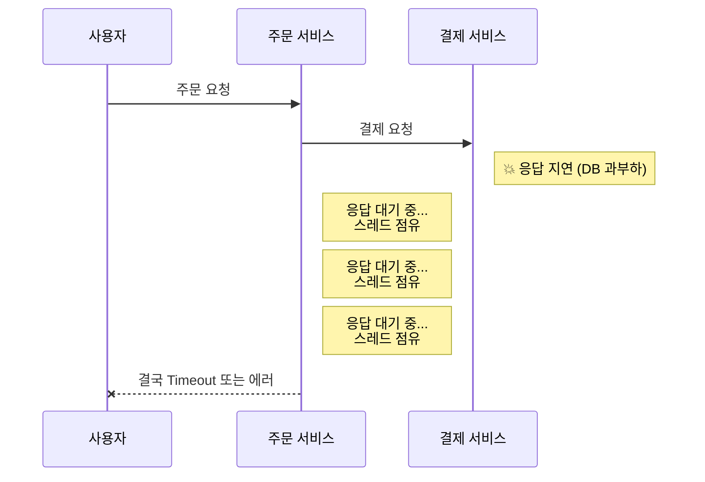
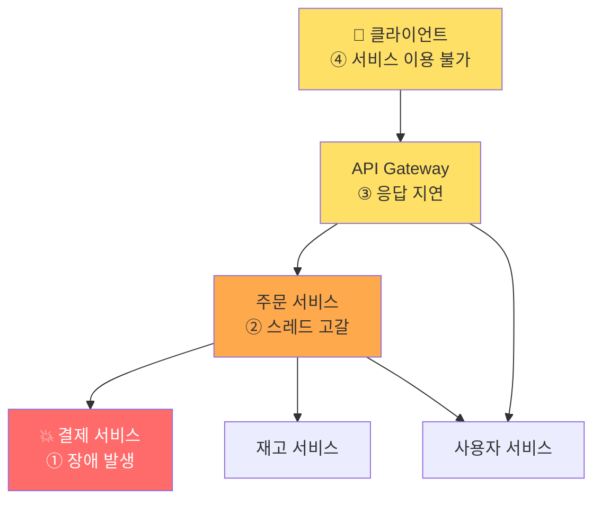
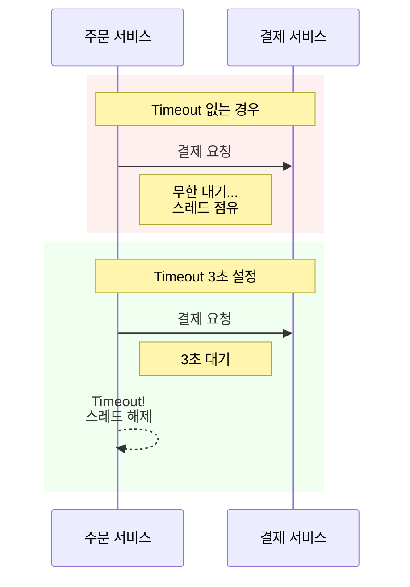
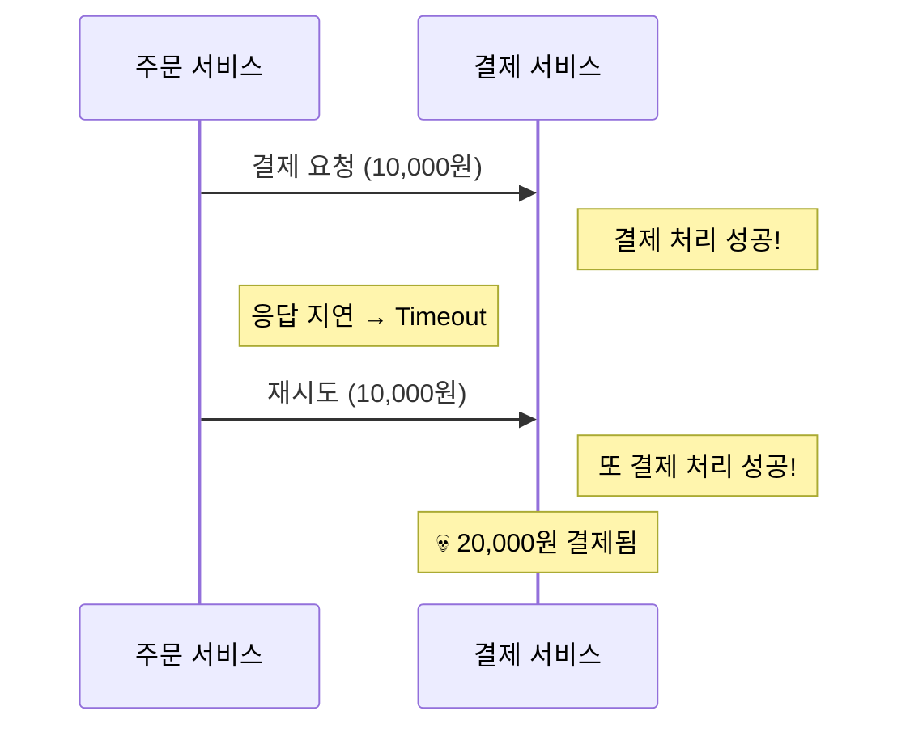
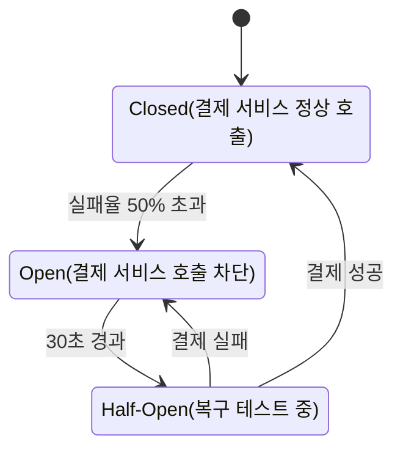
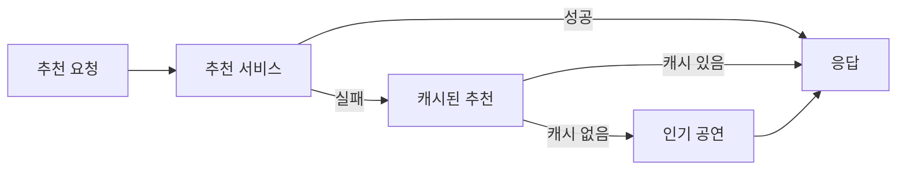
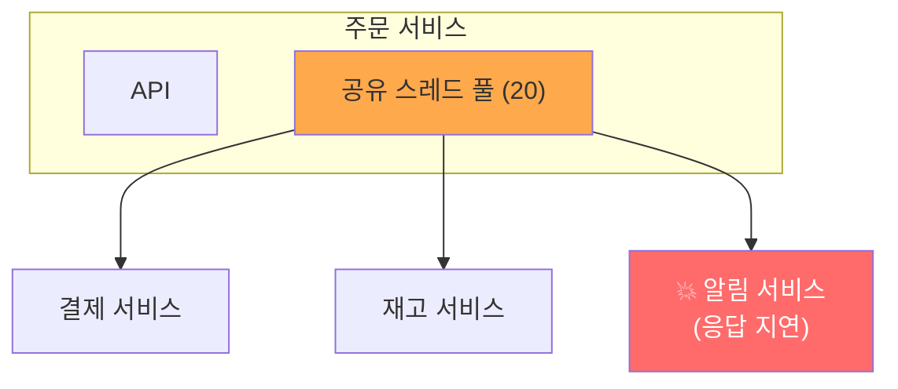
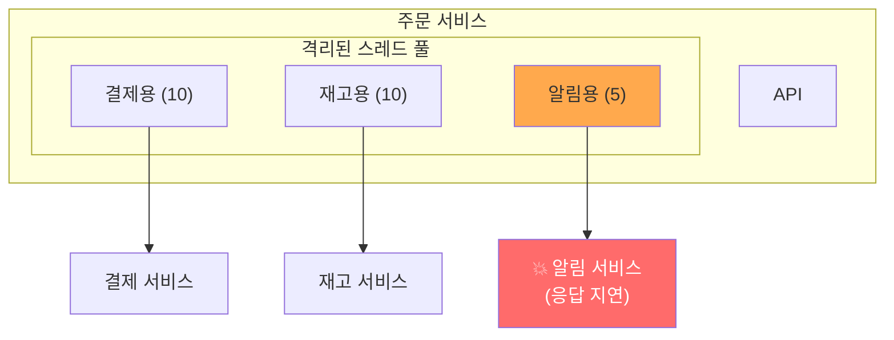
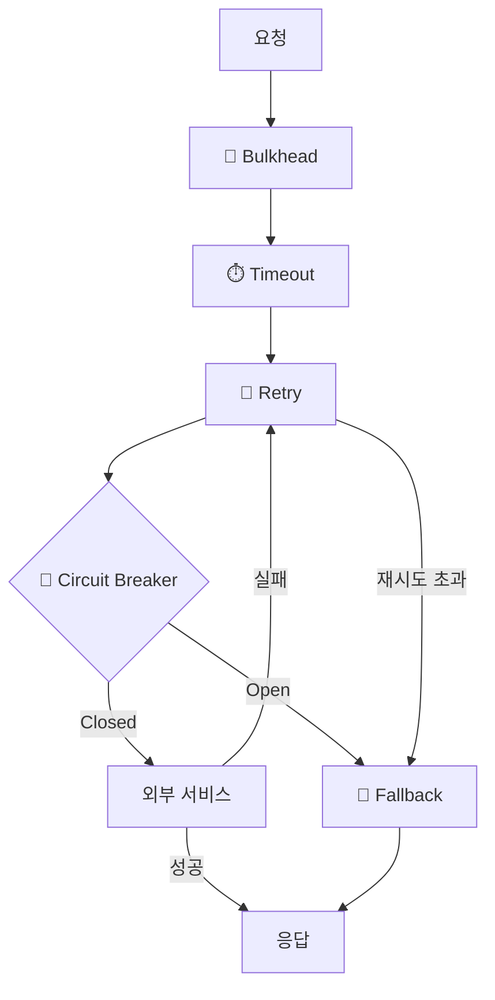
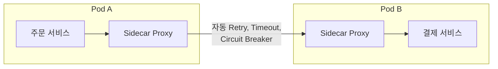

전편: [[MSA에 관한 고찰 2/6편] MSA에서의 서비스간 통신]()

---

저번 편에서 저희는 MSA 환경에서 서비스 간 통신 방식에 대해 살펴보았습니다. REST, gRPC, 메시지 큐까지 다양한 선택지가 있었죠.

그런데 어떤 통신 방식을 선택하든, 분산 시스템에서 반드시 마주하게 되는 현실이 있는 것 같습니다. 바로 **장애는 피할 수 없다**는 점입니다.

저번 편에서 분산 컴퓨팅의 8가지 오류를 언급했습니다. 그중 첫 번째가 "네트워크는 신뢰할 수 있다"는 오류였죠. MSA 환경에서 서비스 간 통신은 네트워크를 통해 이루어지기 때문에, 네트워크가 불안정하면 장애로 이어질 수밖에 없습니다. 물론 모놀리식 환경에서도 장애는 발생할 수 있지만, MSA 환경에서는 네트워크 통신이 추가되면서 장애의 원인과 전파 방식이 훨씬 더 복잡해집니다.

그렇다면 MSA 환경에서 장애는 어떻게 전파되고, 우리는 이를 어디서 어떻게 끊어야 할까요?

이번 편에서는 MSA 환경에서의 장애 전파 메커니즘과 이를 막기 위한 패턴들에 대해 이야기해보려 합니다.

---

## 장애는 어떻게 전파되는가

우선 장애는 어떻게 전파 될까요? 모놀리식 환경에서는 모든 기능이 하나의 프로세스 안에서 실행되기 때문에, 한 모듈의 장애가 전체 애플리케이션에 영향을 줄 수 있다고 1편에서 이야기했습니다. 그렇다면 MSA에서는 서비스가 분리되어 있으니 장애 격리가 자연스럽게 될까요?

안타깝게도 **꼭 그렇지만은 않습니다.**

콘서트 예매 서비스를 다시 예로 들어보겠습니다. 주문 서비스가 결제 서비스를 동기로 호출한다고 가정해보겠습니다.



결제 서비스에 문제가 생겨 응답이 느려지면 어떻게 될까요? 주문 서비스는 결제 응답을 기다리며 스레드를 점유하게 됩니다. 이런 요청이 계속 쌓이면 주문 서비스의 스레드 풀이 고갈되고, 결국 주문 서비스 자체가 응답 불가 상태가 될 수 있습니다.

결제 서비스만 문제였는데, 주문 서비스까지 장애가 전파된 겁니다. 만약 주문 서비스를 호출하는 또 다른 서비스가 있다면 거기까지 장애가 퍼지게 되죠.

이처럼 MSA에서도 **동기 호출 체인이 있다면 장애는 연쇄적으로 전파될 수 있습니다.** 서비스가 물리적으로 분리되어 있더라도 논리적으로 강하게 결합되어 있다면 장애 격리의 이점을 제대로 누리지 못하는 것이죠.



결제 서비스 하나에 장애가 발생했을 뿐인데, 주문 서비스가 스레드 고갈로 죽고, Gateway까지 응답 지연이 발생하고, 결국 클라이언트는 서비스를 이용할 수 없게 됩니다. 재고 서비스와 사용자 서비스는 살아있지만, 주문 흐름 전체가 마비되어 의미가 없죠.

지금은 단순한 시나리오지만, 실제 MSA 환경에서는 수십, 수백 개의 서비스가 얽히고설켜 있습니다. 하나의 서비스 장애가 어떻게 전파될지 예측하기 어려운 상황이 벌어질 수 있죠.

이런 장애 전파는 실제로도 자주 발생합니다. 2017년 AWS S3 장애 때 S3에 의존하던 수많은 서비스들이 연쇄적으로 다운된 사례가 있었습니다. S3 자체의 문제였지만, S3 상태를 확인하는 대시보드마저 S3에 의존하고 있어서 장애 상황을 파악하기도 어려웠다고 하죠. 의존성이 어디까지 퍼져있는지 파악하지 못하면 이런 일이 생길 수 있다는 걸 보여주는 사례인 것 같습니다.

그렇다면 이 장애 전파를 어떻게 막을 수 있을까요?

---

## 장애 전파를 끊는 방법들

장애 전파를 막기 위한 여러 패턴들이 있습니다. 크게 보면 **빠르게 실패하기**, **재시도하기**, **차단하기**, **대체하기**, **격리하기**로 나눌 수 있는 것 같습니다.

각각의 패턴이 어떤 문제를 해결하는지 살펴보겠습니다.

### 1. Timeout: 빠르게 실패하기

가장 기본적이면서도 중요한 패턴입니다. **응답을 무한정 기다리지 않고, 일정 시간이 지나면 실패로 처리**하는 방식이죠.

앞서 본 장애 전파 시나리오에서, 주문 서비스가 결제 서비스를 30초 동안 기다린다면 그 30초 동안 스레드가 점유됩니다. 하지만 Timeout을 3초로 설정하면 3초 후에 스레드가 해제되어 다른 요청을 처리할 수 있게 됩니다. 물론 다른 요청도 실패할 수 있지만, 시스템 전체가 멈추는 것보다는 낫겠죠.



Timeout 설정에서 고민되는 부분은 **적절한 값을 어떻게 정할 것인가**입니다.

너무 짧으면 정상적인 요청도 실패로 처리될 수 있고, 너무 길면 장애 전파를 막는 효과가 떨어집니다. 평균 응답 시간보다는 **P99(99번째 백분위수) 응답 시간**을 기준으로 설정하는 것이 실무적으로 효과적입니다.

예를 들어, 결제 서비스의 응답 시간이 다음과 같다고 가정해보겠습니다.

- 평균: 200ms
- P95: 400ms
- P99: 800ms

평균(200ms)의 `2~3배`인 `400~600ms`로 Timeout을 설정하면, 정상 요청의 약 5%가 Timeout으로 실패할 수 있습니다. 반면 P99(800ms)를 기준으로 여유를 두어 1~1.5초로 설정하면, 정상 요청의 99% 이상이 성공하면서도 장애 상황에서는 빠르게 실패할 수 있습니다.

물론 이 값도 서비스 특성에 따라 달라집니다. 결제처럼 중요한 호출은 여유를 더 두고, 추천처럼 실패해도 괜찮은 호출은 더 공격적으로 설정할 수 있죠. 중요한 건 **근거 있는 수치로 시작해서 모니터링하며 조정**하는 것입니다.

한 가지 더 고려할 점은 **Connection Timeout과 Read Timeout을 구분**해서 설정해야 한다는 것입니다.

- **Connection Timeout**: 연결 수립까지 대기하는 시간입니다. TCP 핸드셰이크가 완료될 때까지의 시간이죠. 보통 1~3초 정도로 짧게 설정합니다. 연결조차 못 맺는다면 서버가 아예 죽었거나 네트워크 문제일 가능성이 높으니까요.
- **Read Timeout (Socket Timeout)**: 연결은 됐지만 응답 데이터를 기다리는 시간입니다. 앞서 P99 기준으로 설정한다고 한 건 주로 이 값입니다.

둘을 구분하지 않고 하나의 Timeout만 설정하면, 연결 실패와 응답 지연을 구분해서 대응하기 어려워집니다. 대부분의 HTTP 클라이언트 라이브러리에서 이 두 값을 별도로 설정할 수 있으니 확인해보시는 걸 권장합니다.

중요한 것은 **Timeout을 설정했다면 Timeout 발생 시 어떻게 처리할지도 함께 정해야 한다**는 점입니다. 그냥 에러를 반환할지, 재시도를 할지, 대체 로직을 실행할지 말이죠.

### 2. Retry: 재시도하기

네트워크는 종종 순간적으로 불안정해집니다. 간헐적으로 요청이 실패하거나 응답이 지연될 수 있죠. 이런 상황에서는 **재시도(Retry)** 가 효과적일 수 있습니다.

패킷이 유실되거나 서버가 잠깐 과부하 상태였을 수 있죠. 이런 **일시적인 장애(Transient Failure)** 는 다시 시도하면 성공하는 경우가 많습니다.

하지만 무작정 재시도하면 문제가 생깁니다. 이미 과부하 상태인 서비스에 더 많은 요청을 보내면 상황이 더 악화될 수 있으니까요.

그래서 **Exponential Backoff(지수 백오프)** 방식을 많은 서비스에서 사용합니다. 재시도 간격을 지수적으로 늘려가는 거죠.

```
1차 시도: 즉시
2차 시도: 1초 후
3차 시도: 2초 후
4차 시도: 4초 후
5차 시도: 8초 후
... (최대 재시도 횟수 도달 시 종료)
```

여기에 **Jitter(무작위 지연)** 를 추가하면 조금 더 효과적입니다. 여러 클라이언트가 동시에 재시도하면 특정 시점에 요청이 몰릴 수 있는데, 무작위 지연을 추가하면 재시도 시점이 분산됩니다. 캐싱쪽에는 이와 비슷한 문제로 Cache Stampede(캐시 폭주 현상) 문제가 있는데, 이를 완화하는 데도 Jitter가 효과적입니다.

#### 주의: 멱등성(Idempotency)

문제는 Retry를 적용할 때 반드시 고려해야 할 부분이 있습니다. 바로 **멱등성**입니다.

결제 요청을 보냈는데 Timeout이 발생했다고 가정해보겠습니다. 클라이언트 입장에서는 요청이 실패한 것처럼 보이지만, 실제로는 서버에서 결제가 성공적으로 처리되었고 응답만 늦게 온 상황이라면 재시도를 했을 때 결제가 두 번 처리될 수 있죠. 듣기만해도 서늘한 큰 문제로 이어질 수 있는 심각한 문제입니다.



이 문제를 방지하려면 **서버 측에서 멱등성을 보장**해야 합니다. 같은 요청이 여러 번 와도 한 번만 처리되도록 하는 거죠. 보통 멱등성 키(Idempotency Key)를 사용해서 이미 처리된 요청인지 확인하는 방식으로 구현하곤 합니다.

HTTP 메서드별로 보면 GET, PUT, DELETE는 스펙상 멱등해야 하고, POST는 기본적으로 멱등하지 않습니다. 하지만 스펙이 멱등을 요구해도 실제 구현이 멱등하지 않을 수 있기 때문에, Retry가 필요한 API는 명시적으로 멱등성을 검증해야 합니다. Retry를 적용하기 전에 꼭 멱등성을 검토해봐야하는 이유입니다.

그리고 재시도 횟수도 적절히 제한해야 합니다. 무한정 재시도하면 장애가 장기화될 수 있으니까요.

재시도 횟수를 정할 때는 **총 대기 시간**을 함께 고려해야 합니다. Exponential Backoff를 적용하면 재시도 횟수에 따라 총 대기 시간이 급격히 늘어나기 때문입니다.

```
3회 재시도 (1초 + 2초 + 4초) = 최대 7초
5회 재시도 (1초 + 2초 + 4초 + 8초 + 16초) = 최대 31초
7회 재시도 = 최대 127초 (2분 이상)
```

사용자가 2분 넘게 기다리는 건 현실적이지 않죠. 그래서 대부분의 경우 **3~5회**가 적당합니다. 일시적인 네트워크 문제는 보통 몇 초 내에 해결되고, 그 이상 실패한다면 재시도보다는 Circuit Breaker가 개입해야 할 상황일 가능성이 높습니다.

### 3. Circuit Breaker: 차단하기

Timeout과 Retry로도 해결되지 않는 상황이 있습니다. 결제 서비스가 완전히 죽어서 모든 요청이 실패하는 경우죠.

이 상황에서 계속 요청을 보내면 어떻게 될까요? 매번 Timeout까지 기다리고, Retry까지 하면 하나의 요청을 처리하는 데 상당한 시간이 걸립니다. 죽은 서비스에 계속 요청을 보내면서 자원만 낭비하는 거죠.

**Circuit Breaker**는 이런 상황을 방지합니다. 연속된 실패가 감지되면 **아예 요청을 보내지 않고 즉시 실패**를 반환하는 방식입니다.

이름이 "회로 차단기"인 이유는 집의 전기 차단기와 동작 방식이 비슷하기 때문입니다. 전기가 과부하되면 차단기가 내려가서 화재를 방지하죠? 마찬가지로 서비스 호출이 계속 실패하면 회로 차단기가 열려서 더 이상 요청을 보내지 않습니다.

주문 서비스에서 결제 서비스를 호출하는 상황으로 예를 들어보겠습니다.



- **Closed**: 회로가 연결된 상태입니다. 요청이 정상적으로 결제 서비스에 전달됩니다. 실패율을 모니터링하다가 임계치를 넘으면 Open으로 전환합니다.

- **Open**: 회로가 차단된 상태입니다. 결제 서비스에 요청을 보내지 않고 즉시 실패를 반환합니다. 일정 시간이 지나면 Half-Open으로 전환합니다.

- **Half-Open**: 결제 서비스가 복구되었는지 확인하는 상태입니다. 일부 요청만 보내보고, 성공하면 Closed로, 실패하면 다시 Open으로 전환합니다.

Circuit Breaker의 핵심은 **실패가 예상되면 시도 자체를 하지 않는 것**입니다. Timeout은 요청을 보내고 빨리 포기하는 거라면, Circuit Breaker는 요청 자체를 보내지 않습니다. 실패할 요청에 자원을 낭비하지 않고, 장애 서비스가 복구할 시간도 벌어줄 수 있죠.

### 4. Fallback: 대체하기

지금까지 살펴본 패턴들은 모두 실패를 감지하고 대응하는 방법이었습니다. 그런데 실패가 감지되면 그 다음은 뭘 해야 할까요?

경우에 따라 **대체 로직을 실행**하는 것이 더 나을 수 있습니다. 이를 **Fallback**이라고 합니다.

콘서트 예매 서비스에서 "이 공연을 본 사람들이 좋아한 다른 공연" 추천 기능이 있다고 가정해보겠습니다. 추천 서비스가 다운되었다고 해서 전체 페이지가 에러가 되면 안 되겠죠.



추천 서비스가 실패하면 캐시된 추천 목록을 보여주거나, 그마저 없으면 인기 공연 목록을 보여주는 거죠. 사용자 입장에서는 "추천이 좀 별로네" 정도지, "페이지가 안 열려"는 아닙니다.

다만 **핵심 기능에는 Fallback을 신중하게 적용해야 합니다.** 결제가 실패했는데 "일단 성공으로 처리"하는 Fallback은 비즈니스적으로 큰 문제가 될 수 있으니까요.

### 5. Bulkhead: 격리하기

마지막으로 **Bulkhead(격벽)** 패턴입니다. 선박에서 한 구역에 물이 들어와도 격벽 덕분에 다른 구역으로 퍼지지 않는 것처럼, **시스템의 한 부분에서 발생한 장애가 다른 부분으로 전파되지 않도록 격리**하는 방식입니다. 구체적으로는 **서비스별로 독립적인 리소스 풀(스레드 풀, 커넥션 풀 등)을 할당**합니다.

말로만 들으면 잘 와닿지 않을 수 있으니 예시를 통해 이해해보죠.

주문 서비스가 결제, 재고, 알림 서비스를 호출하는데 하나의 스레드 풀(20개)을 공유한다고 가정해보겠습니다.



알림 서비스가 느려지면 알림 호출이 스레드를 계속 점유합니다. 알림은 부가 기능일 뿐인데, 스레드 풀이 고갈되면서 정작 중요한 결제와 재고 호출까지 영향을 받게 되죠. 모놀리식 환경에서 한 모듈의 장애가 전체 애플리케이션에 영향을 주는 것과 비슷한 상황이 발생하는 겁니다.

Bulkhead를 적용하면 이 문제를 해결할 수 있습니다.



이렇게 되면 알림 서비스가 느려져서 알림용 스레드 풀(5개)이 전부 점유되어도, 결제용(10개), 재고용(10개) 스레드 풀은 영향을 받지 않습니다. 핵심 기능인 결제와 재고는 정상 동작하는 거죠.

스레드 풀 크기를 정하는 것도 고민이 필요합니다. 너무 작으면 정상 상황에서도 요청이 거부될 수 있고, 너무 크면 격리 효과가 떨어집니다. 이 역시 해당 서비스의 평균 처리량과 응답 시간을 기준으로 산정하되, 모니터링하면서 조정하는 것이 좋다고 생각합니다.

---

## 패턴 조합하기

실제로는 이 패턴들을 개별적으로 사용하기보다 **조합해서 사용**하는 것이 일반적입니다.



외부 서비스를 호출할 때

1. **Bulkhead**로 이 호출이 다른 호출에 영향을 주지 않도록 격리하고
2. **Timeout**으로 최대 대기 시간을 설정하고
3. 실패하면 **Retry**(Exponential Backoff)로 재시도하고
4. 연속 실패하면 **Circuit Breaker**가 열려서 즉시 실패를 반환하고
5. 최종적으로 **Fallback**으로 대체 로직을 실행합니다

물론 모든 호출에 이 모든 패턴을 적용할 필요는 없습니다. 호출의 중요도와 특성에 따라 적절히 선택해야 한다고 생각합니다.

### 언제 이 패턴들을 쓰면 안 되는가

2편에서도 "언제 쓰면 안 되는가"를 강조했듯이, 장애 대응 패턴도 마찬가지로 피해야 할 상황이 있습니다.

#### Retry를 쓰면 안 될 때
- 멱등성이 보장되지 않는 API (중복 처리 위험)
- 비즈니스 로직 에러 (400 Bad Request는 재시도해도 성공하지 않음)
- 이미 과부하인 서비스에 Jitter 없이 재시도

#### Circuit Breaker를 쓰면 안 될 때
- 호출 빈도가 낮은 경우 (연속 실패 추적이 무의미)
- 실패해도 괜찮은 호출 (로깅, 통계 수집 등)
- 이미 비동기로 처리하는 경우

#### Fallback을 쓰면 안 될 때
- 핵심 비즈니스 로직 (결제 실패를 성공으로 처리하면 안 됨)
- 데이터 정합성이 중요한 경우

#### 일반적인 안티패턴
- 모든 호출에 모든 패턴 적용 (복잡도만 증가)
- 기본값 그대로 사용 (서비스 특성에 맞게 조정 필요)
- 모니터링 없이 도입 (Circuit이 Open됐는지 알 수 없으면 의미 없음)

이제 어떨때 이 패턴들을 적용하고, 어떨때 피해야 하는지 감이 오시나요? 만약 이제 저희가 구현해야한다면 어떻게 할 수 있을지 살펴보겠습니다.

---

## 구현하기

### 어플리케이션 레벨에서 해결하기: Resilience4j

이러한 패턴들을 직접 구현할 수도 있지만, 검증된 라이브러리를 사용하는 것이 일반적입니다. Java/Kotlin 생태계에서는 **Resilience4j**가 가장 많이 사용되는 것 같습니다.

```kotlin
@Service
class PaymentService(private val paymentClient: PaymentClient) {

    @CircuitBreaker(name = "payment", fallbackMethod = "paymentFallback")
    @Retry(name = "payment")
    @TimeLimiter(name = "payment")
    fun processPayment(orderId: String): CompletableFuture<PaymentResult> {
        return CompletableFuture.supplyAsync {
            paymentClient.pay(orderId)
        }
    }

    private fun paymentFallback(orderId: String, ex: Exception): CompletableFuture<PaymentResult> {
        return CompletableFuture.completedFuture(
            PaymentResult.pending(orderId, "결제 서비스 일시 장애")
        )
    }
}
```

```yaml
# application.yml
resilience4j:
  circuitbreaker:
    instances:
      payment:
        failure-rate-threshold: 50
        wait-duration-in-open-state: 30s
        sliding-window-size: 10
  retry:
    instances:
      payment:
        max-attempts: 3
        wait-duration: 500ms
        enable-exponential-backoff: true
  timelimiter:
    instances:
      payment:
        timeout-duration: 3s
```

Spring Boot에서는 어노테이션으로 간단하게 적용할 수 있습니다. 설정은 YAML 파일에서 관리할 수 있어서 코드와 설정을 분리할 수 있다는 장점이 있습니다. 사용하시는 프로그래밍 언어에 맞는 라이브러리를 찾아보시면 비슷한 기능을 제공하는 경우가 많을 겁니다.

그런데 이걸 서비스마다 일일이 적용하는 게 번거롭지 않을까요? 서비스가 많아지면 관리 포인트가 늘어나고, 동일한 설정을 여러 서비스에 반복해서 넣어야 하니까요. 혹여 설정이 바뀌면 일일이 다 수정해야 하고요.

이런 경우에는 인프라 레벨에서 해결하는 방법도 고려해볼 수 있습니다.

---

### 인프라 레벨에서 해결하기: Service Mesh

**Service Mesh**는 이런 횡단 관심사를 인프라 레벨로 내리는 접근입니다. Spring에서 AOP로 횡단 관심사를 분리하는 것과 비슷한 개념이죠.



쿠버네티스에서 Istio, Linkerd 같은 Service Mesh는 각 Pod 옆에 Sidecar Proxy를 붙여서 모든 네트워크 트래픽을 가로챕니다. 이 Proxy에서 Retry, Timeout, Circuit Breaker를 처리하기 때문에 **애플리케이션 코드 변경 없이** 장애 대응 패턴을 적용할 수 있습니다.

다만 Service Mesh와 애플리케이션 레벨 구현은 역할이 다르다고 생각합니다. Service Mesh는 기본적인 Retry, Timeout, Circuit Breaker를 처리하기에 좋지만, **비즈니스 로직이 필요한 Fallback은 애플리케이션에서 구현**해야 합니다.

서비스가 10개 미만이고 단일 언어라면 Resilience4j로 충분하지만, 폴리글랏 환경에서 수십 개 서비스를 운영한다면 Service Mesh 도입을 검토해볼 만하다고 생각합니다.

---

## 모니터링하기

앞서 안티패턴에서 "모니터링 없이 도입"을 언급했습니다. 장애 대응 패턴을 도입했다면, **이 패턴들이 실제로 어떻게 동작하고 있는지 관찰할 수 있어야 합니다.**

Circuit Breaker가 Open 상태가 됐는데 아무도 모른다면, 장애 대응이 아니라 장애 은폐가 되어버리죠. 다음은 모니터링해야 할 핵심 메트릭들입니다.

### 핵심 메트릭

| 메트릭 | 의미 | 알람 기준 예시 |
|--------|------|----------------|
| **Circuit Breaker 상태** | Closed/Open/Half-Open | Open 전환 시 즉시 알람 |
| **실패율 (Failure Rate)** | 최근 N개 요청 중 실패 비율 | 30% 초과 시 경고, 50% 초과 시 위험 |
| **응답 시간 분포** | P50, P95, P99 | P99가 Timeout의 80% 도달 시 경고 |
| **Retry 발생 횟수** | 재시도가 얼마나 자주 발생하는지 | 급증 시 경고 |
| **Fallback 호출 빈도** | 대체 로직이 얼마나 사용되는지 | 평소 대비 급증 시 경고 |

### Resilience4j + Micrometer 연동

Resilience4j는 Micrometer와 통합되어 있어서, 이 메트릭들을 자동으로 수집할 수 있습니다.

```yaml
# application.yml
resilience4j:
  circuitbreaker:
    instances:
      payment:
        register-health-indicator: true  # Actuator health에 노출
management:
  metrics:
    tags:
      application: order-service
  endpoints:
    web:
      exposure:
        include: health, metrics, prometheus
```

이렇게 설정하면 `/actuator/prometheus` 엔드포인트에서 다음과 같은 메트릭을 확인할 수 있습니다:

```
# Circuit Breaker 상태
resilience4j_circuitbreaker_state{name="payment"} 0  # 0=closed, 1=open, 2=half-open

# 실패율
resilience4j_circuitbreaker_failure_rate{name="payment"} 12.5

# 호출 결과별 카운트
resilience4j_circuitbreaker_calls_seconds_count{kind="successful", name="payment"} 1000
resilience4j_circuitbreaker_calls_seconds_count{kind="failed", name="payment"} 50
```

이 메트릭들을 Prometheus로 수집하고 Grafana로 시각화하면, 장애 대응 패턴의 동작을 실시간으로 관찰할 수 있습니다.

### 알람 설정 예시

단순히 메트릭을 수집하는 것만으로는 부족하다고 생각합니다. **이상 징후가 감지되면 가능한 빨리 알 수 있어야 합니다.** Prometheus AlertManager나 Grafana Alerting 등에서 다음과 같은 알람 규칙을 설정할 수 있습니다.

```yaml
# 알람 규칙 예시 (PromQL 기반)
groups:
  - name: resilience
    rules:
      - alert: CircuitBreakerOpen
        expr: resilience4j_circuitbreaker_state == 1
        for: 0m
        labels:
          severity: critical
        annotations:
          summary: "Circuit Breaker가 Open 상태입니다"

      - alert: HighFailureRate
        expr: resilience4j_circuitbreaker_failure_rate > 30
        for: 1m
        labels:
          severity: warning
        annotations:
          summary: "실패율이 30%를 초과했습니다"
```

Circuit Breaker가 Open으로 전환되면 알람이 오고, 실패율이 30%를 넘으면 경고가 발생합니다. 이렇게 해야 "패턴이 동작은 하는데 우리가 모르고 있었다"는 상황을 방지할 수 있습니다.

---

## 검증하기: Chaos Engineering

지금까지 여러 장애 대응 패턴과 구현 방법을 살펴봤습니다. 그런데 한 가지 질문이 남습니다.

**이 패턴들이 정말 잘 동작하는지 어떻게 알 수 있을까요?**

장애는 예고 없이 찾아옵니다. Circuit Breaker를 설정해뒀는데 막상 장애가 터지니까 설정값이 잘못되어 있었다든지, Fallback 로직에 버그가 있었다든지 하는 일이 생길 수 있습니다. 프로덕션에서 장애가 터지고 나서야 "아, 이게 안 되네"를 깨닫는 건 너무 늦은 거죠.

Netflix는 이 문제를 해결하기 위해 **Chaos Monkey**라는 도구를 만들었습니다. 프로덕션 환경에서 **무작위로 서비스 인스턴스를 종료시켜**서 시스템의 복원력을 검증하는 도구입니다.

처음 이 이야기를 들었을 때 꽤나 많이 놀라웠습니다. 저는 Chaos Engineering이라는 개념 자체를 처음 접했거든요. 자기 서비스를 스스로 죽인다니, 저로서는 상상하기도 어려운 개념이었습니다. 

하지만 생각해보면 꽤 합리적이었습니다. 장애가 언제 올지 모르니까, 일부러 장애를 일으켜서 "정말로 대비가 되어 있는가"를 검증하는 거죠.

```
"장애는 예방하는 것이 아니라 대비하는 것이다"
```

Chaos Engineering의 핵심 철학이라고 생각합니다. 모든 외부 호출에 "이 서비스가 죽으면 어떻게 되지?"라는 질문을 던져보고, 그 답이 명확하지 않다면 그 부분에 장애 대응 패턴이 필요한 겁니다.

물론 처음부터 프로덕션에서 Chaos Monkey를 돌릴 필요는 없다고 생각합니다. 스테이징 환경에서 특정 서비스를 죽여보고 시스템이 어떻게 반응하는지 관찰하는 것만으로도 많은 것을 파악할 수 있지 않나 싶습니다.

---

## 정리

이번 편에서는 MSA 환경에서 장애가 어떻게 전파되는지, 그리고 이를 막기 위한 여러 장애 대응 패턴에 대해 살펴보았습니다.

결국 **장애 대응은 "장애가 발생하지 않게 하는 것"이 아니라 "장애가 발생해도 시스템이 버틸 수 있게 하는 것"** 이라고 생각합니다. 

MSA 환경에서 일하면서 가장 많이 했던 고민 중 하나 역시 "이 서비스가 죽으면 우리 시스템은 어떻게 되지?"였습니다. 그 질문에 명확한 답을 가지고 있어야 장애가 왔을 때 당황하지 않고 대응할 수 있다고 생각합니다.

---

## 다음 편에서

통신 방식도 정했고, 장애 대응 방법도 알게 되었습니다. 그런데 MSA에서 가장 까다로운 문제가 남았습니다.

**데이터는 어떻게 분리하고, 분산된 데이터의 일관성은 어떻게 맞출 것인가?** 입니다.

말하고 나니 까다로운 문제들 뿐이네요 ㅎㅎ..

다음 편에서는 Database per Service 원칙, 분산 트랜잭션의 문제, Saga 패턴, 그리고 데이터 동기화 전략에 대해 이야기해보겠습니다.

---

## 참고 자료

### 장애 사례

- [Summary of the Amazon S3 Service Disruption (2017)](https://aws.amazon.com/message/41926/)

### 장애 대응 패턴

- Michael Nygard - *Release It!: Design and Deploy Production-Ready Software* (Pragmatic Bookshelf, 2018)
- [Resilience4j Documentation](https://resilience4j.readme.io/)

### Chaos Engineering

- [Principles of Chaos Engineering](https://principlesofchaos.org/)
- [Netflix Chaos Monkey](https://netflix.github.io/chaosmonkey/)

### Service Mesh

- [Istio Documentation](https://istio.io/latest/docs/)
- [Linkerd Documentation](https://linkerd.io/docs/)
