전편: [[MSA에 관한 고찰 3/6편] 장애는 어떻게 전파되고, 우리는 어디서 끊어야 하는가]()

---

저번 편에서 저희는 MSA 환경에서 장애가 어떻게 전파되는지, 그리고 이를 막기 위한 여러 패턴들에 대해 살펴보았습니다. Timeout, Retry, Circuit Breaker까지 다양한 방법들이 있었죠.

하지만 아직 해야할 고민이 훨씬 많이 남아있습니다. 자 이제는 MSA 환경에서 가장 골치 아픈 문제 중 하나인 **데이터 분리 문제**에 대해 이야기해보려 합니다. 실제로 제가 MSA를 도입하면서 가장 많이 고민하게 됐던 부분입니다.

모놀리식에서는 JOIN 한 방이면 끝났던 일이, MSA에서는 생각보다 복잡한 의사결정을 해야합니다.

이번 편에서는 MSA 환경에서 데이터를 어떻게 분리해야 하는지, 그리고 분리하면 무엇이 어려워지는지에 대해 고민해보는 시간을 가져보려 합니다.

## 꼭 DB를 분리해야 하는가

먼저 근본적인 질문부터 던져보겠습니다. MSA에서라고 해서 꼭 DB를 분리해야 할까요? 한번 생각해보는 시간을 가지면 좋을 것 같습니다.

1편에서도 이야기 했듯이 모든 기술은 **특정한 문제**를 해결하기 위해 도입됩니다. 그렇다면 MSA에서 DB를 분리하지 않았을 때 어떤 **특정한 문제**들이 발생할 수 있는지 살펴보면 꼭 분리해야하는 지 판단할 수 있을 것 같습니다.

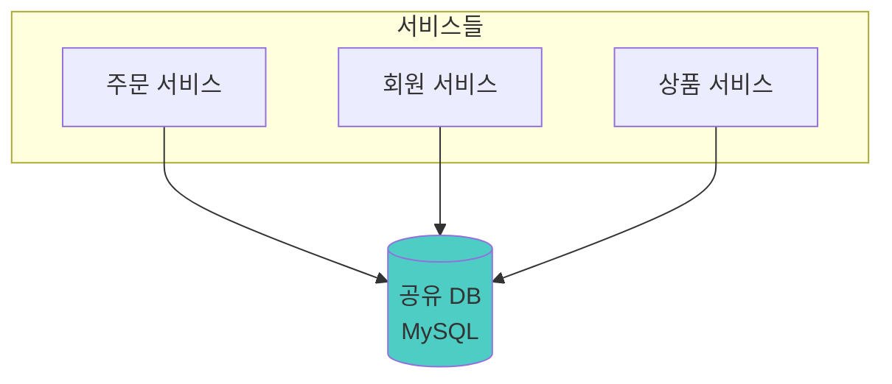

위와같은 구조를 생각해봅시다. MSA환경에서 주문 서비스, 회원 서비스, 상품 서비스가 모두 하나의 MySQL DB를 공유하는 구조입니다. 단일 DB이기 때문에 JOIN도 자유롭고, 트랜잭션도 보장되고, 기존에 하던 대로 개발하면 됩니다. 뭐가 문제일까요?

### MSA에서의 공유 DB: 편리함의 대가

처음엔 정말 편하다고 생각합니다. 복잡성이 줄어들고 러닝커브 역시 분산 DB보다는 훨씬 낮아지니까요. 공유 DB의 장점은 분명합니다. DB와 데이터의 분리에 대해서 고민할 필요가 없으니까요. 다른 서비스의 데이터가 필요하면 JOIN 한 방이면 끝납니다. 트랜잭션도 보장되니까 개발도 익숙한 방식으로 하면 되고요.

하지만 문제는 시간이 지나면서 드러납니다.

#### 스키마 변경의 공포

만약 회원 서비스에서 `users` 테이블의 컬럼 하나를 변경하고 싶다고 가정하겠습니다. 

그런데 회원 테이블을 주문 서비스, 상품 서비스, 정산 서비스... 전부 해당 테이블을 참조하고 있다면 `users` 테이블의 영향도가 굉장히 커집니다. "이 컬럼 변경하면 어느 서비스까지 확인해야하지?"

공유 DB에서는 스키마 변경이 모든 서비스에 영향을 주거든요. 결국 전수조사를 해야하고 모든 팀이 모여서 협의도 해야 합니다. 

결국 모놀리식에서 하던 것과 다를 게 없어집니다. 무늬만 MSA인 셈이죠.

#### 배포 의존성

또 다른 문제도 있습니다. 만약 회원 서비스에서 `users` 테이블에 컬럼이 삭제 됐다고 가정해봅시다. 각 서비스들은 이 컬럼을 참조하고 있을 수도 있겠죠?

그렇다면 해당 컬럼을 삭제하기 위해서는 모든 서비스들이 이 변경사항을 반영하도록 코드를 수정하고 배포해야 합니다. 즉, 서비스 간 배포 의존성이 생깁니다. 

서비스는 분리되어 있는데 배포는 함께 해야하는 일이 발생합니다. 이 역시 무늬만 MSA가 되는 셈이죠.

#### 장애 전파

3편에서 장애 전파에 대해 이야기했는데, DB를 공유하면 여기서도 문제가 생깁니다. 하나의 서비스에서 무거운 쿼리를 날리거나 Lock을 오래 잡으면, 다른 서비스들도 영향을 받습니다.

서비스는 분리되어 있는데 장애는 전파되는 일이 발생합니다. 이는 위 두 문제들과 마찬가지로 MSA의 이점을 버리는 셈에 가깝습니다.

이런 MSA의 이점을 버리는 선택을 한다면 왜 굳이 MSA를 선택했는지 의문이 들 수밖에 없습니다.

### 그래서 결국

공유 DB는 MSA를 통해 얻고자 하는 많은 이점들을 희생시킨다고 생각합니다. 결국 서비스 레벨만 분리되고 데이터 레벨은 여전히 결합되어버려 겉보기에만 MSA가 되는 셈이니까요. 

결론적으로 MSA 환경에서의 공유 DB는 **MSA의 핵심 가치인 독립성을 훼손**한다고 생각합니다. 그렇기 때문에 "MSA를 제대로 하려면 결국 DB도 분리해야 한다"는 결론에 도달할 수 밖에 없지 않나 싶습니다. 

물론 위 문제들을 해결하기 위한 방법들도 있긴 합니다. 예를 들어 스키마 변경의 공포는 **Schema Versioning**으로, 배포 의존성은 **Backward Compatibility**로, 장애 전파는 **Connection Pool 분리**나 **쿼리 타임아웃**으로 어느정도 완화할 수 있겠죠. 하지만 이런 방법들은 결국 공유 DB의 근본적인 문제를 해결하지는 못한다고 생각합니다.

## Database per Service

그렇다면 이제 DB의 분리가 필요하다는 부분에 대해 팀 모두가 동의했다고 가정하고, 다음 질문으로 넘어가 보겠습니다. MSA에서 저희는 DB를 어떤 기준으로 나눠야 할까요?

MSA에 대해 조금이라도 공부해보신 분들은 "Database per Service"라는 말을 한 번쯤은 들어보셨을 겁니다. 말 그대로 **서비스마다 자기만의 DB를 가지는** 아키텍처 패턴이죠.

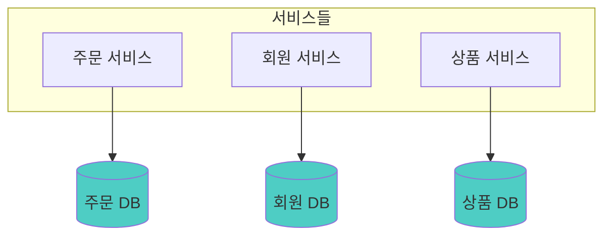

제가 생각하는 "Database per Service"의 가장 큰 장점은 **기준이 명확하다**는 점입니다. "DB를 어디서 어떻게 나눠야 하지?"라는 고민 없이, 서비스 단위로 나누면 되니까요. 서비스마다 독립적인 DB를 가지면 서비스 간 결합도가 낮아지고, 장애 격리도 되고, 스키마 변경도 자유로워집니다.

그런데 여기서 한 가지 의문이 들 수 있습니다. DB를 분리하면 좋다는 건 알겠는데, **대체 무엇이 어려워지길래** 다들 망설이는 걸까요?

실제로 MSA 환경에서 일하면서 DB 분리 후에 가장 많이 마주쳤던 문제들이 있습니다. 하나씩 살펴보겠습니다.

### JOIN이 안 됩니다

공유 DB에서는 이런 쿼리가 가능했습니다. 주문 상세 정보를 조회할 때 회원 이름이랑 상품 정보까지 한 번에 가져오고 싶다고 해보겠습니다.

```sql
SELECT o.*, u.name, u.email, p.title
FROM orders o
JOIN users u ON o.user_id = u.id
JOIN products p ON o.product_id = p.id
WHERE o.id = 123;
```

한 번의 쿼리로 주문, 회원, 상품 정보를 다 가져올 수 있었죠. 아마 개발을 하시면서 수도 없이 작성해보셨을 쿼리일 겁니다.

하지만 DB가 분리되면 어떻게 될까요? 주문 DB에는 회원 테이블이 없고, 회원 DB에는 주문 테이블이 없습니다. **JOIN이 불가능**해지는 거죠. 각 DB에 따로 쿼리해서 애플리케이션에서 조합해야 합니다.

"그게 뭐 얼마나 어렵겠어?"라고 생각하실 수도 있는데, 문제는 이게 단순히 코드 몇 줄 추가하는 게 아니라는 점입니다. 이 부분은 뒤에서 더 자세히 다루겠습니다.

### 트랜잭션이 안 됩니다

이번에는 콘서트 예매를 생각해 보겠습니다. 콘서트 티켓을 예매하려면 다음 세 가지 작업이 필요합니다.

1. 좌석 예약 (좌석 서비스)
2. 결제 처리 (결제 서비스)
3. 티켓 발급 (티켓 서비스)

공유 DB 환경에서는 이 세 작업을 하나의 트랜잭션으로 묶을 수 있었습니다. 결제가 실패하면 좌석 예약도 자동으로 롤백되죠.

```java
@Transactional
public void bookConcert(BookingRequest request) {
    seatRepository.reserve(request.getSeatId());
    paymentRepository.process(request.getPayment());
    ticketRepository.issue(request.getUserId());
}
```

하지만 DB가 분리되면 어떻게 될까요? 각 서비스가 자기만의 DB를 가지고 있으니, 하나의 `@Transactional`로 묶을 수가 없습니다. **분산 트랜잭션**이 필요해지는데, 이게 생각보다 훨씬 복잡합니다. 이 부분도 뒤에서 자세히 다루겠습니다.

### 데이터 일관성이 깨집니다

위 예시를 이어서 생각해보겠습니다. 좌석 예약은 성공했고, 결제도 성공했는데, 티켓 발급에서 실패하면 어떻게 될까요?

공유 DB에서는 전체가 롤백되니까 문제없습니다. 하지만 DB가 분리된 MSA에서는 **결제는 완료됐는데 티켓은 없는** 상태가 될 수 있습니다. 사용자 입장에서는 돈은 빠져나갔는데 티켓은 없는 황당한 상황이 되는 거죠.

이게 바로 **Eventual Consistency**(최종 일관성) 문제입니다. "지금은 일관성이 깨져 있지만, 언젠가는 맞춰질 거야"라는 개념인데, 이걸 어떻게 보장할지가 MSA의 큰 숙제라고 생각합니다.

지금까지 설명드린 문제들은 모두 **DB 분리로 인해 발생하는 문제들**입니다. 정리하면 다음과 같습니다.

1. **JOIN이 안 된다** → 다른 서비스의 데이터를 어떻게 가져올 것인가?
2. **트랜잭션이 안 된다** → 여러 서비스에 걸친 작업을 어떻게 원자적으로 처리할 것인가?
3. **일관성이 깨진다** → 분산된 데이터의 정합성을 어떻게 맞출 것인가?

이제부터는 이 문제들을 어떻게 해결할 수 있는지 하나씩 살펴보겠습니다.

## 다른 서비스의 데이터가 필요할 때

먼저 JOIN이 안 되는 문제부터 살펴보겠습니다. 구체적인 상황을 가정해보죠.

주문 서비스에서 "주문 상세 조회" API를 만들어야 합니다. 화면에 보여줄 정보는 다음과 같습니다.

- 주문 정보 (주문 서비스 DB)
- 주문한 회원의 이름, 연락처 (회원 서비스 DB)
- 주문한 상품의 이름, 가격 (상품 서비스 DB)

공유 DB였다면 JOIN 한 방이면 끝이었습니다. 하지만 지금은 각 정보가 서로 다른 DB에 있습니다. 어떻게 해야 할까요?

크게 두 가지 방법이 있습니다.

### 해결책 1: API Composition

가장 직관적인 방법입니다. **필요할 때마다 다른 서비스의 API를 호출**해서 데이터를 가져오는 거죠.

```java
public OrderDetailResponse getOrderDetail(Long orderId) {
    // 먼저 내 DB에서 주문 정보 조회
    Order order = orderRepository.findById(orderId);

    // 다른 서비스 API 호출해서 필요한 데이터 가져오기
    UserResponse user = userClient.getUser(order.getUserId());
    ProductResponse product = productClient.getProduct(order.getProductId());

    // 조합해서 반환
    return OrderDetailResponse.builder()
        .order(order)
        .userName(user.getName())
        .productTitle(product.getTitle())
        .build();
}
```

구현이 단순하고 직관적입니다. 그리고 **항상 최신 데이터**를 가져온다는 장점도 있죠. 회원 서비스에서 이름이 바뀌면 바로 반영됩니다.

하지만 실제로 운영하다 보면 단점들이 보이기 시작합니다.

- **지연 시간 증가**: 하나의 요청을 처리하기 위해 여러 API를 호출하니 당연히 느려집니다. 네트워크 왕복이 추가되니까요.
- **장애 전파**: 3편에서 다뤘던 문제죠. 회원 서비스가 죽으면 주문 조회도 안 됩니다. 회원 이름 하나 때문에 전체가 실패하는 거죠.
- **N+1 문제**: 주문 목록 조회를 생각해보세요. 주문 10개를 조회하면 회원 API 10번, 상품 API 10번... 성능이 급격히 나빠집니다.

### 해결책 2: 데이터 복제

두 번째 방법은 **필요한 데이터를 미리 내 DB에 복사해두는 것**입니다.

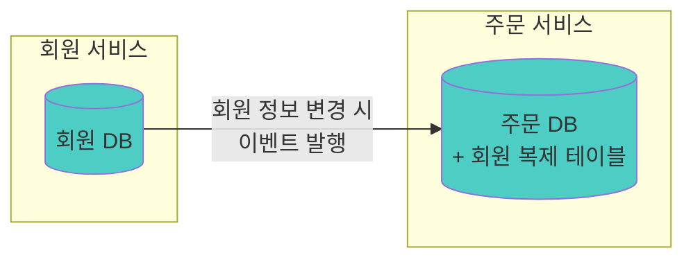

회원 서비스에서 회원 정보가 변경되면 이벤트를 발행하고, 주문 서비스는 이 이벤트를 받아서 자기 DB에 회원 정보 복사본을 업데이트합니다.

```java
// 회원 정보 변경 이벤트를 받아서 복제 테이블 업데이트
@EventListener
public void onUserUpdated(UserUpdatedEvent event) {
    userReplicaRepository.save(UserReplica.from(event));
}

// 조회할 때는 내 DB에서 바로 가져옴
public OrderDetailResponse getOrderDetail(Long orderId) {
    Order order = orderRepository.findById(orderId);
    // 내 DB에서 조회 - 빠르고 안정적!
    UserReplica user = userReplicaRepository.findById(order.getUserId());

    return OrderDetailResponse.builder()
        .order(order)
        .userName(user.getName())
        .build();
}
```

조회가 빠릅니다. 네트워크 호출 없이 내 DB에서 바로 가져오니까요. 그리고 **장애 격리**도 됩니다. 회원 서비스가 죽어도 주문 조회는 가능하죠.

물론 이 방식도 단점이 있습니다.

- **데이터 불일치 가능성**: 이벤트가 지연되면 잠시 동안 오래된 데이터가 보일 수 있습니다.
- **저장 공간 증가**: 같은 데이터를 여러 곳에 저장하니까요.
- **동기화 로직 관리**: 이벤트 처리 로직을 만들고 유지보수해야 합니다.

### 언제 무엇을 선택할까요?

| 상황 | 권장 방식 | 이유 |
|------|-----------|------|
| 실시간성이 중요한 경우 | API Composition | 항상 최신 데이터 보장 |
| 조회 성능이 중요한 경우 | 데이터 복제 | 네트워크 호출 없이 빠른 조회 |
| 데이터 변경이 자주 없는 경우 | 데이터 복제 | 동기화 부담이 적음 |
| 장애 격리가 중요한 경우 | 데이터 복제 | 다른 서비스 장애에 영향 없음 |
| 구현 복잡도를 낮추고 싶은 경우 | API Composition | 이벤트 처리 로직 불필요 |

개인적으로는 조회가 많은 서비스에서는 **데이터 복제를 더 선호**하는 편입니다. API Composition은 처음엔 간단해 보이지만, 트래픽이 늘어나면 성능 문제가 심각해지는 경우가 많았거든요. N+1 문제도 생각보다 자주 마주치게 됩니다.

물론 "무조건 데이터 복제가 좋다"는 얘기는 아닙니다. 상황에 따라 적절한 방식을 선택하는 게 중요하다고 생각합니다.

## 데이터 복제: 이벤트로 동기화하기

자 그렇다면 데이터 복제를 선택했다고 가정해보겠습니다. 이제 **어떻게 동기화할지**가 문제입니다.

### Dual Write의 함정

가장 먼저 떠오르는 방법은 이거 아닐까요? "DB에 저장하고, 이벤트도 발행하면 되잖아!"

```java
@Transactional
public void updateUser(UserUpdateRequest request) {
    // 1. DB에 저장
    userRepository.save(user);

    // 2. 이벤트 발행
    eventPublisher.publish(new UserUpdatedEvent(user));
}
```

직관적이고 간단해 보입니다. 하지만 여기에 **심각한 문제**가 숨어 있습니다. 이 방식을 **Dual Write**라고 하는데, 두 곳에 쓰는 방식이죠.

왜 문제일까요? 한번 생각해보겠습니다.

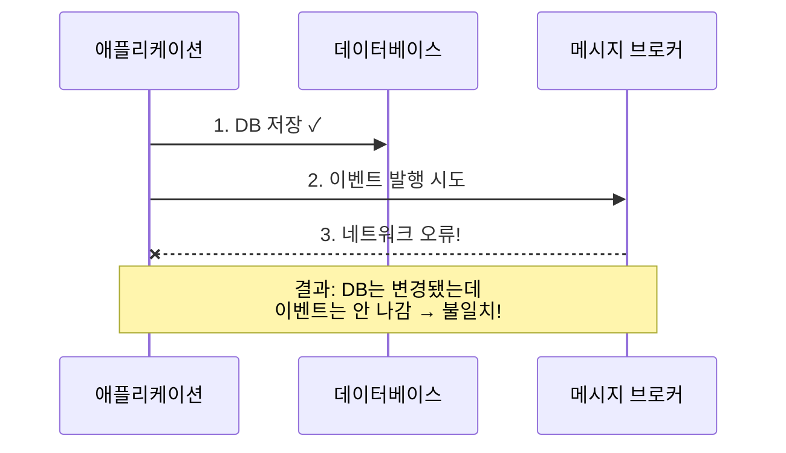

DB 저장은 성공했는데 이벤트 발행이 실패하면 어떻게 될까요? 데이터는 변경됐는데 다른 서비스는 모르는 상태가 됩니다. 회원 이름이 바뀌었는데 주문 서비스의 복제 테이블에는 옛날 이름이 그대로 남아있는 거죠.

반대 상황은 더 심각합니다. 이벤트는 발행됐는데 DB 트랜잭션이 롤백되면? 다른 서비스는 **존재하지 않는 데이터**를 참조하게 됩니다.

"그럼 트랜잭션 안에서 같이 처리하면 되지 않나?"라고 생각하실 수도 있는데, DB 트랜잭션과 메시지 브로커 발행은 서로 다른 시스템이라 **하나의 트랜잭션으로 묶을 수가 없습니다.** 이게 Dual Write의 근본적인 문제입니다.

### Transactional Outbox 패턴

그렇다면 이 문제를 어떻게 해결할 수 있을까요? 검증된 방법이 있습니다. **Transactional Outbox 패턴**이죠.

핵심 아이디어는 의외로 간단합니다. **이벤트를 DB에 먼저 저장하고, 나중에 발행한다.**

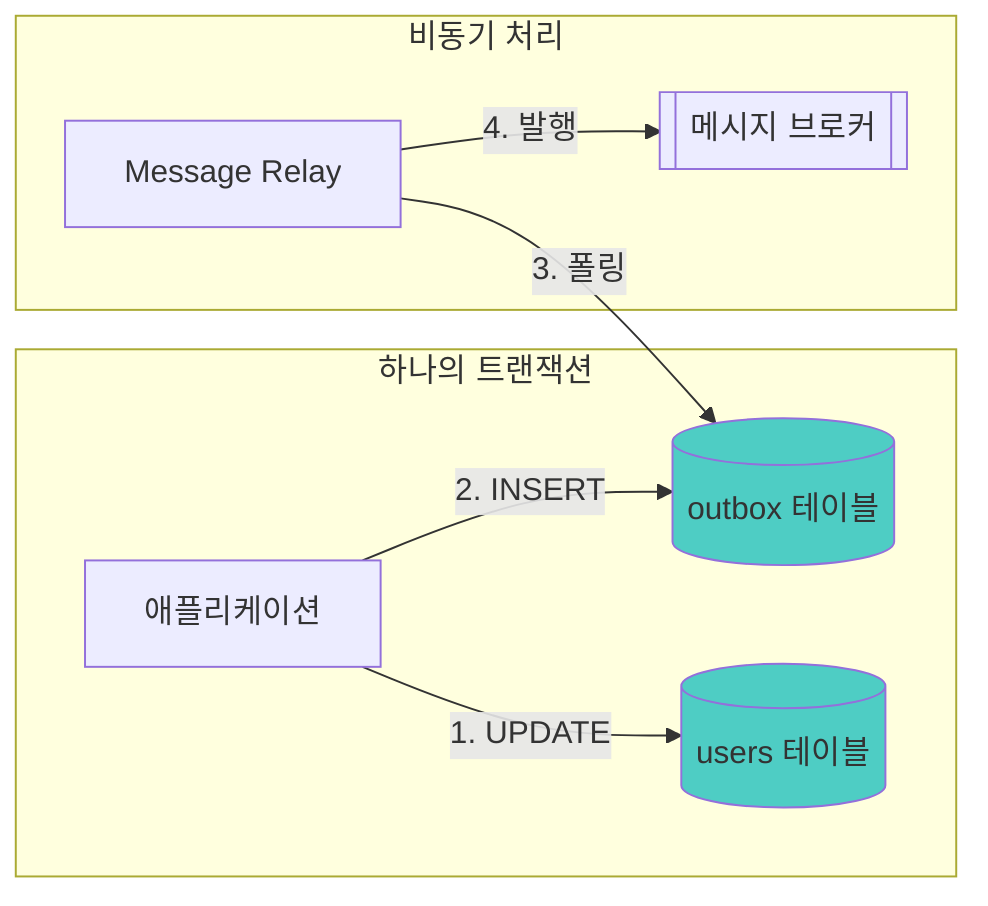

코드로 보면 이렇습니다.

```java
@Transactional
public void updateUser(UserUpdateRequest request) {
    // 같은 DB 트랜잭션에서 둘 다 처리!
    userRepository.save(user);
    outboxRepository.save(new OutboxEvent("UserUpdated", user.toJson()));
}
```

```java
// 별도 스케줄러가 주기적으로 실행
@Scheduled(fixedDelay = 1000)
public void publishPendingEvents() {
    List<OutboxEvent> events = outboxRepository.findPending();
    for (OutboxEvent event : events) {
        messagePublisher.publish(event);
        outboxRepository.markAsPublished(event.getId());
    }
}
```

핵심은 **outbox 테이블이 같은 DB에 있다**는 점입니다. DB 트랜잭션이 성공하면 outbox에도 이벤트가 저장되고, 트랜잭션이 실패하면 둘 다 롤백됩니다. **원자성이 보장**되는 거죠.

이벤트 발행은 별도의 스케줄러가 담당합니다. outbox 테이블을 폴링해서 아직 발행 안 된 이벤트를 찾아서 발행하는 거죠. 발행이 실패해도 outbox에 남아있으니 다음 폴링 때 다시 시도할 수 있습니다.

단점도 있습니다. 폴링 주기만큼 지연이 발생하고, outbox 테이블을 관리해야 한다는 점이죠. 하지만 데이터 일관성을 보장한다는 점에서 Dual Write보다 훨씬 안전합니다.

### Change Data Capture (CDC)

더 세련된 방법도 있습니다. **Change Data Capture (CDC)**는 DB의 변경 로그를 직접 읽어서 이벤트를 발행합니다.

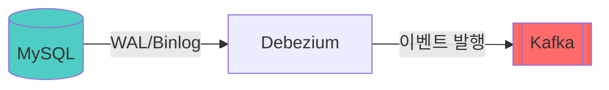

MySQL의 Binlog나 PostgreSQL의 WAL을 Debezium 같은 도구가 읽어서, 변경 사항을 Kafka로 발행합니다. 애플리케이션 코드에서는 아무것도 안 해도 됩니다. 그냥 DB에 저장만 하면 알아서 이벤트가 나가는 거죠.

**장점**은 명확합니다.
- 애플리케이션 코드 변경이 없음
- 폴링 지연도 없음 (거의 실시간)
- 모든 DB 변경을 캡처할 수 있음

**단점**은 인프라 복잡도가 증가한다는 점입니다. Debezium 클러스터를 운영해야 하고, DB마다 설정이 다르고, 문제가 생기면 디버깅이 어렵습니다.

개인적으로는 이미 Kafka를 쓰고 있고 인프라 역량이 있다면 CDC가 좋은 선택이라고 생각합니다. 그렇지 않다면 Outbox 패턴으로 시작하는 게 현실적이지 않나 싶습니다.

## 이벤트 동기화의 문제들

2편에서 "비동기라고 문제가 없는 건 아니다"라고 했습니다. 이벤트 기반 동기화에서도 마찬가지입니다. Outbox든 CDC든 이벤트를 사용하면 반드시 고려해야 할 문제들이 있습니다.

### 메시지 유실

메시지 전달 보장 수준에는 세 가지가 있습니다.

| 전달 보장 수준 | 설명 | 특징 |
|--------------|------|------|
| At-most-once | 최대 한 번 | 유실 가능, 중복 없음 |
| At-least-once | 최소 한 번 | 유실 없음, 중복 가능 |
| Exactly-once | 정확히 한 번 | 유실 없음, 중복 없음 |

Exactly-once가 이상적으로 보이지만, 분산 시스템에서 이걸 보장하기는 **매우 어렵습니다**. 네트워크 오류, 서버 재시작 등 다양한 상황에서 "정확히 한 번"을 보장하려면 엄청난 복잡도가 필요하거든요.

그래서 대부분의 시스템은 **At-least-once**를 선택합니다. 왜냐하면, **유실보다 중복이 낫기 때문**입니다. 중복은 처리할 수 있지만, 유실은 복구하기 어렵습니다. 잃어버린 이벤트가 뭔지도 모르니까요.

### 중복 처리: 멱등성이 필수

At-least-once면 중복이 발생할 수 있습니다. 그래서 Consumer 측에서 **멱등성**을 보장해야 합니다.

3편에서 Retry를 다룰 때 멱등성 이야기를 했는데, 이벤트 처리에서도 동일한 개념입니다. 같은 이벤트가 여러 번 와도 결과가 같아야 합니다.

**방법 1: 처리 완료 기록**

```java
@EventListener
public void onUserUpdated(UserUpdatedEvent event) {
    // 이미 처리한 이벤트인지 확인
    if (processedEventRepository.existsByEventId(event.getId())) {
        log.info("이미 처리된 이벤트: {}", event.getId());
        return;
    }

    // 실제 처리
    userReplicaRepository.save(UserReplica.from(event));

    // 처리 완료 기록
    processedEventRepository.save(new ProcessedEvent(event.getId()));
}
```

**방법 2: Upsert 활용**

```java
@EventListener
public void onUserUpdated(UserUpdatedEvent event) {
    // INSERT or UPDATE - 여러 번 실행해도 결과가 같음
    userReplicaRepository.upsert(UserReplica.from(event));
}
```

Upsert가 가능한 상황이라면 이 방식이 더 간단합니다. 별도의 처리 기록 테이블 없이도 멱등성이 보장되니까요.

### 순서 역전

이벤트 A 다음에 B가 발생했는데, B가 먼저 도착하는 경우가 있습니다. 비동기 시스템에서는 의외로 자주 발생하는 문제입니다.

예를 들어보겠습니다.

1. 회원 이름을 "김철수"로 변경 (이벤트 A)
2. 회원 이름을 "김영희"로 변경 (이벤트 B)
3. 이벤트 B가 먼저 도착, 이벤트 A가 나중에 도착
4. 최종 결과: "김철수" (잘못됨!)

원래는 "김영희"가 최신인데, 순서가 뒤바뀌어서 오래된 "김철수"가 최종 값이 되어버렸습니다.

**해결 방법 1: 파티션 키 활용**

Kafka를 쓴다면, 같은 회원의 이벤트는 같은 파티션으로 보내서 순서를 보장할 수 있습니다.

```java
kafkaTemplate.send("user-events", user.getId().toString(), event);
// user.getId()가 파티션 키 → 같은 유저의 이벤트는 같은 파티션
```

같은 파티션 내에서는 순서가 보장되니까, 같은 회원에 대한 이벤트는 발생 순서대로 처리됩니다.

**해결 방법 2: 버전 기반 낙관적 처리**

이벤트에 버전이나 타임스탬프를 포함시키고, 오래된 이벤트는 무시합니다.

```java
@EventListener
public void onUserUpdated(UserUpdatedEvent event) {
    UserReplica existing = userReplicaRepository.findById(event.getUserId());

    // 기존 데이터가 더 최신이면 무시
    if (existing != null && existing.getVersion() >= event.getVersion()) {
        log.info("오래된 이벤트 무시: {}", event.getId());
        return;
    }

    userReplicaRepository.save(UserReplica.from(event));
}
```

이 방식은 Kafka가 아닌 다른 메시지 브로커를 쓸 때도 적용할 수 있다는 장점이 있습니다.

### 이벤트 설계: 무엇을 담을 것인가

이벤트에 무엇을 담을지도 중요한 결정입니다. 크게 두 가지 방식이 있습니다.

**Fat Event (필요한 데이터 다 담기)**

```json
{
  "eventType": "UserUpdated",
  "userId": 123,
  "name": "김철수",
  "email": "kim@example.com",
  "phone": "010-1234-5678",
  "address": "서울시 강남구..."
}
```

Consumer가 API 호출 없이 바로 처리할 수 있다는 장점이 있습니다. 하지만 이벤트 크기가 커지고, 스키마가 변경되면 모든 Consumer가 영향을 받습니다.

**Thin Event (ID만 담기)**

```json
{
  "eventType": "UserUpdated",
  "userId": 123
}
```

이벤트 크기가 작고 스키마 변경에 유연합니다. 하지만 Consumer가 상세 정보가 필요하면 API를 호출해야 합니다.

저는 **상황에 따라 다르게** 가져가는 편입니다.

- 자주 변경되지 않는 데이터, 조회가 많은 경우 → Fat Event
- 자주 변경되는 데이터, 실시간성 필요 → Thin Event

정답은 없고, 서비스 특성에 맞게 선택하면 됩니다.

## 분산 트랜잭션: ACID가 깨진다

이제 더 어려운 문제로 넘어가 보겠습니다. 바로 **분산 트랜잭션**입니다.

앞서 "트랜잭션이 안 된다"고 했는데, 이게 왜 그렇게 문제인지 더 자세히 살펴보겠습니다.

### 공유 DB에서의 트랜잭션

콘서트 예매를 다시 생각해 보겠습니다. 공유 DB 환경에서는 이렇게 할 수 있었습니다.

```java
@Transactional
public void bookConcert(BookingRequest request) {
    // 1. 좌석 예약
    seatRepository.reserve(request.getSeatId());

    // 2. 결제 처리
    paymentRepository.process(request.getPayment());

    // 3. 티켓 발급
    ticketRepository.issue(request.getUserId());

    // 하나라도 실패하면 전체 롤백!
}
```

ACID가 보장됩니다.

- **Atomicity**: 전부 성공하거나 전부 실패
- **Consistency**: 데이터 일관성 유지
- **Isolation**: 다른 트랜잭션과 격리
- **Durability**: 커밋되면 영구 저장

결제에서 오류가 나면 좌석 예약도 자동으로 롤백됩니다. 개발자가 따로 신경 쓸 필요가 없죠.

### MSA에서의 현실

하지만 좌석 서비스, 결제 서비스, 티켓 서비스가 각자 DB를 가지면 어떻게 될까요?

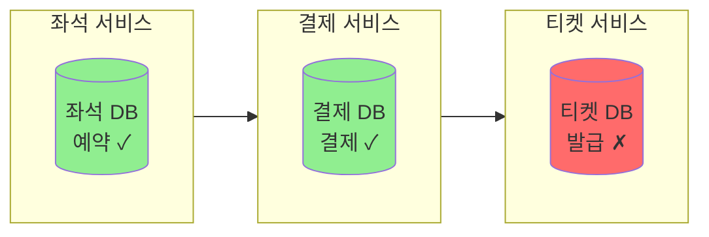

좌석은 예약됐고, 결제도 됐는데, 티켓이 안 나왔습니다. 어떻게 롤백하죠?

결제는 이미 카드사에 청구됐습니다. 좌석 예약은 좌석 서비스 DB에 커밋됐습니다. 각 서비스가 자기 DB에 커밋하고 나면, 다른 서비스의 실패를 알아도 **롤백이 안 됩니다**.

이게 바로 분산 시스템에서 트랜잭션이 어려운 이유입니다.

### 2PC (Two-Phase Commit)의 한계

"그럼 분산 트랜잭션을 쓰면 되지 않나?"라고 생각하실 수 있습니다. 전통적인 해결책으로 **2PC (Two-Phase Commit)**이 있습니다.

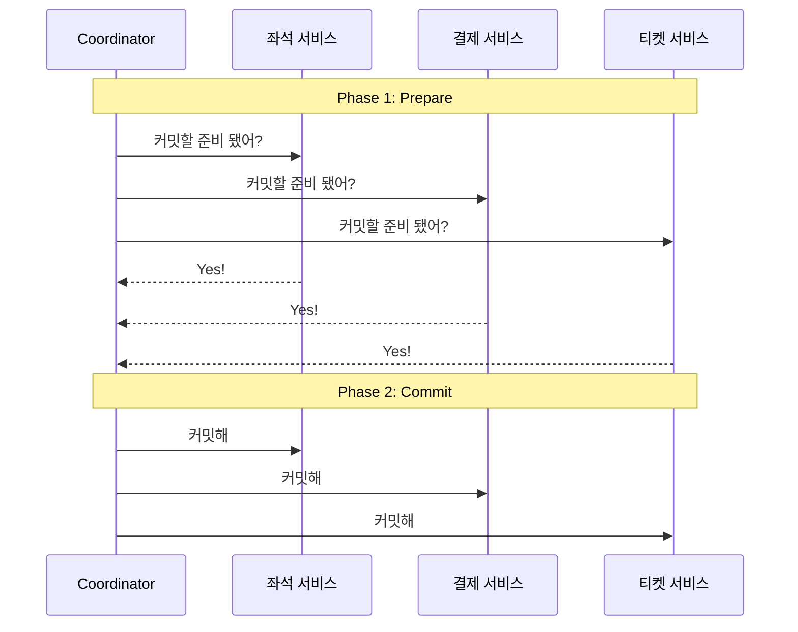

Coordinator가 모든 참여자에게 "준비됐어?"라고 물어보고, 다 "Yes"라고 하면 그때 커밋을 지시하는 방식입니다. 이론적으로는 ACID를 보장할 수 있습니다.

하지만 **MSA에서는 거의 사용하지 않습니다.** 왜일까요?

- **Coordinator가 SPOF**: Coordinator가 죽으면 전체 트랜잭션이 멈춥니다
- **성능 문제**: 모든 서비스가 Lock을 잡고 대기해야 합니다
- **확장성 문제**: 서비스가 많아질수록 복잡도가 폭발합니다
- **이기종 시스템**: 모든 DB가 2PC를 지원해야 하는데, 현실적으로 어렵습니다

결국 2PC는 MSA의 핵심 가치인 **독립성과 확장성**을 훼손합니다. 그래서 다른 방법이 필요합니다.

### CAP 정리와 Eventual Consistency

여기서 **CAP 정리**를 이해할 필요가 있습니다.

- **C (Consistency)**: 모든 노드가 같은 데이터
- **A (Availability)**: 항상 응답 가능
- **P (Partition Tolerance)**: 네트워크 분할에도 동작

CAP 정리에 따르면, 분산 시스템에서 네트워크 분할(P)은 피할 수 없고, 그러면 **C와 A 중 하나를 포기**해야 합니다.

대부분의 MSA 시스템은 **AP를 선택**합니다. 즉, 가용성을 유지하되 일관성은 **Eventual Consistency**(최종 일관성)로 타협하는 거죠.

> "지금 당장은 일관성이 깨질 수 있지만, 최종적으로는 맞춰진다."

처음 들으면 불안할 수 있습니다. "일관성이 깨져도 괜찮다고?" 하지만 사실 우리 일상에서도 최종 일관성은 흔합니다. 은행 송금도 실시간으로 반영되지 않고, 주문 후 배송 상태도 바로 업데이트되지 않죠.

그렇다면 MSA에서 이 Eventual Consistency를 어떻게 구현할까요? 바로 **Saga 패턴**입니다.

## Saga 패턴: 분산 트랜잭션의 대안

### Saga의 기본 개념

Saga는 1987년 Hector Garcia-Molina와 Kenneth Salem의 논문에서 나온 개념입니다. 핵심 아이디어는 다음과 같습니다.

> 하나의 긴 트랜잭션을 여러 개의 로컬 트랜잭션으로 분리하고,
> 실패 시 **보상 트랜잭션**으로 되돌린다.

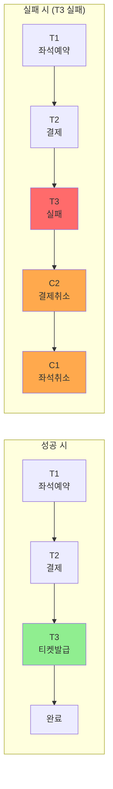

각 단계(T1, T2, T3)는 독립적인 로컬 트랜잭션입니다. 각 서비스가 자기 DB에 커밋하죠. T3가 실패하면, C2(결제 취소)와 C1(좌석 취소)이라는 **보상 트랜잭션**을 실행해서 되돌립니다.

DB 롤백처럼 "없던 일"로 만드는 게 아니라, **"되돌리는 새로운 작업"**을 하는 겁니다.

Saga를 구현하는 방식에는 두 가지가 있습니다. 2편에서 다뤘던 Choreography와 Orchestration이죠.

### Choreography Saga

중앙 조정자 없이 **이벤트로 연결**하는 방식입니다.

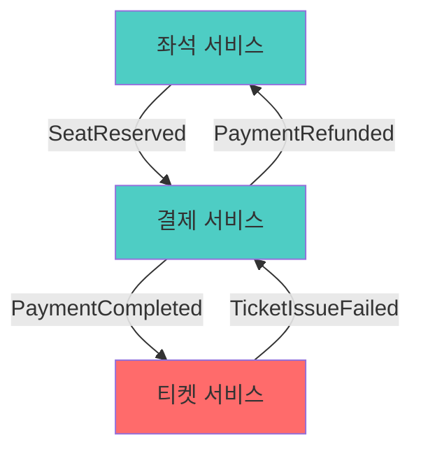

각 서비스가 이벤트를 발행하고, 다른 서비스가 그 이벤트에 반응합니다.

```java
// 좌석 서비스
@EventListener
public void onBookingRequested(BookingRequestedEvent event) {
    seatRepository.reserve(event.getSeatId());
    eventPublisher.publish(new SeatReservedEvent(...));
}

@EventListener
public void onPaymentRefunded(PaymentRefundedEvent event) {
    // 보상 트랜잭션: 좌석 예약 취소
    seatRepository.release(event.getSeatId());
}
```

**장점**은 느슨한 결합입니다. 각 서비스가 독립적이고, 새로운 서비스를 추가하기 쉽습니다.

**단점**은 전체 흐름 파악이 어렵다는 점입니다. 이벤트가 여기저기서 발생하니까, "지금 어디까지 진행됐지?"를 알기 어렵고 디버깅도 복잡합니다. 서비스가 많아지면 이벤트 간의 관계가 꼬이기도 하죠.

### Orchestration Saga

중앙 **Orchestrator가 흐름을 관리**하는 방식입니다.

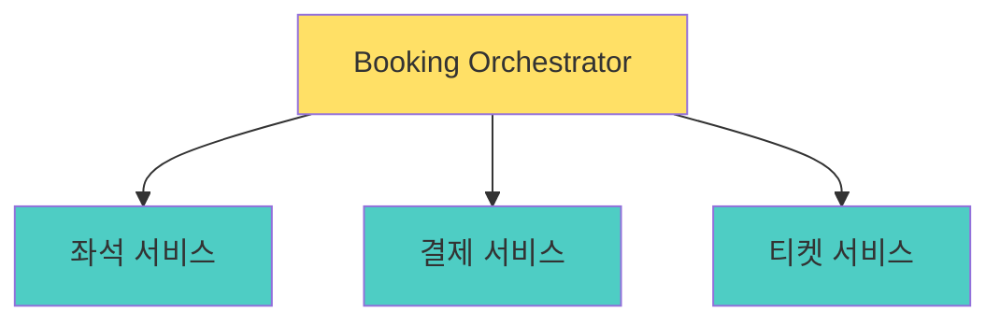

Orchestrator가 순서대로 각 서비스를 호출하고, 실패하면 보상 로직을 실행합니다.

```java
@Service
public class BookingOrchestrator {

    public void processBooking(BookingRequest request) {
        try {
            // 1. 좌석 예약
            SeatReservation seat = seatService.reserve(request.getSeatId());

            try {
                // 2. 결제
                Payment payment = paymentService.process(request.getPayment());

                try {
                    // 3. 티켓 발급
                    ticketService.issue(request.getUserId(), seat.getId());
                } catch (Exception e) {
                    // 티켓 실패 → 결제 취소
                    paymentService.refund(payment.getId());
                    throw e;
                }
            } catch (Exception e) {
                // 결제 실패 → 좌석 취소
                seatService.release(seat.getId());
                throw e;
            }
        } catch (Exception e) {
            throw new BookingFailedException(e);
        }
    }
}
```

**장점**은 흐름이 명확하다는 점입니다. 비즈니스 로직이 한 곳에 모여있어서 이해하기 쉽고, 에러 처리도 용이합니다.

**단점**은 Orchestrator가 SPOF가 될 수 있다는 점입니다. 또한 로직이 한 곳에 집중되면서 Orchestrator가 점점 커질 수 있습니다.

### 보상 트랜잭션: 완벽한 롤백은 없다

여기서 중요한 걸 짚고 넘어가야 합니다. **보상 트랜잭션은 완벽한 롤백이 아닙니다.**

DB 롤백은 "없던 일"로 만들지만, 보상 트랜잭션은 **"이미 일어난 일을 되돌리는 새로운 작업"**입니다. 차이가 느껴지시나요?

예를 들어보겠습니다.

- 결제 취소 = 환불 처리 (카드사에 환불 요청 → 처리에 며칠 걸릴 수 있음)
- 좌석 취소 = 예약 해제 (다른 사람이 그 사이에 예약할 수도 있음)
- 이메일 발송 취소 = **불가능** (이미 보낸 이메일은 회수 안 됨)

그래서 Saga를 설계할 때는 다음 사항들을 고려해야 합니다.

1. **보상이 가능한 작업인지 확인**: 모든 작업이 되돌릴 수 있는 건 아닙니다
2. **보상 로직을 비즈니스 레벨에서 정의**: 기술적 롤백이 아닌 비즈니스적 취소 로직이 필요합니다
3. **되돌릴 수 없는 작업은 마지막에 배치**: 이메일 발송 같은 건 맨 마지막에 하는 게 좋습니다

### 언제 무엇을 선택할까요?

| 상황 | 권장 방식 | 이유 |
|------|-----------|------|
| 서비스 수가 적고 흐름이 단순 | Choreography | 오버헤드 없이 간단하게 구현 |
| 서비스 수가 많고 흐름이 복잡 | Orchestration | 전체 흐름을 한눈에 파악 가능 |
| 비즈니스 로직 중심 | Orchestration | 로직이 한 곳에 모여있어 관리 용이 |
| 느슨한 결합 중시 | Choreography | 서비스 간 의존성 최소화 |

개인적으로는 3개 이상의 서비스가 관여하는 복잡한 비즈니스 흐름에서는 **Orchestration이 관리하기 훨씬 편했습니다.** Choreography는 처음엔 깔끔해 보이지만, 서비스가 늘어나면 "지금 전체 흐름이 어디까지 진행됐지?"를 파악하기 어려워지는 경우가 많았거든요.

물론 둘을 혼합해서 사용할 수도 있습니다. 핵심 비즈니스 흐름은 Orchestration으로, 부가적인 이벤트 처리는 Choreography로 가져가는 식이죠.

## 정리

이번 편에서 다룬 내용을 정리하면 다음과 같습니다.

1. **공유 DB는 편하지만**, MSA의 핵심 가치인 독립성을 훼손합니다.
2. **DB를 분리하면** JOIN이 안 되고, 트랜잭션이 안 되고, 일관성이 깨집니다.
3. **JOIN 대신** API Composition 또는 데이터 복제를 사용합니다.
4. **데이터 복제 시** Dual Write의 함정을 피하고, Outbox나 CDC 패턴을 사용합니다.
5. **이벤트 동기화**에서는 멱등성, 순서, 유실을 고려해야 합니다.
6. **분산 트랜잭션 대신** Saga 패턴으로 Eventual Consistency를 받아들입니다.

결국 **데이터 분리는 공짜가 아닙니다.** 많은 복잡도를 감수해야 합니다. 하지만 그 복잡도를 감당할 수 있는 패턴과 도구들이 있고, 그것들을 잘 활용하면 MSA의 진정한 이점을 누릴 수 있다고 생각합니다.

개인적으로 MSA에서 데이터 분리가 **가장 어려운 부분**이었던 것 같습니다. 통신 방식이나 장애 대응은 라이브러리로 어느 정도 해결되지만, 데이터 일관성 문제는 비즈니스 로직과 밀접하게 연결되어 있어서 정형화된 해결책이 없더라구요. 결국 각 상황에 맞게 트레이드오프를 이해하고 선택하는 수밖에 없는 것 같습니다.

## 다음 편에서

데이터 분리로 조회가 어려워졌습니다. 특히 복잡한 조회 요구사항이 있을 때, 여러 서비스를 조합해서 데이터를 만들어내는 게 점점 복잡해집니다. 게다가 쓰기에 최적화된 모델과 읽기에 최적화된 모델이 다른 경우도 많죠.

다음 편에서는 이 문제의 해결책인 **CQRS - 읽기와 쓰기를 분리한다**에 대해 이야기해보겠습니다.

후편: [[MSA에 관한 고찰 5/6편] CQRS - 읽기와 쓰기를 분리한다]()

---

## 참고 자료

### 데이터 관리 패턴

- Chris Richardson - *Microservices Patterns* (Manning, 2018)
- [Microservices.io - Database per Service](https://microservices.io/patterns/data/database-per-service.html)

### Saga 패턴

- [Microservices.io - Saga](https://microservices.io/patterns/data/saga.html)
- Hector Garcia-Molina, Kenneth Salem - *Sagas* (1987)

### 이벤트 동기화

- [Transactional Outbox Pattern](https://microservices.io/patterns/data/transactional-outbox.html)
- [Debezium - Change Data Capture](https://debezium.io/)

### CAP 정리와 분산 시스템

- Eric Brewer - *CAP Twelve Years Later* (2012)
- Martin Kleppmann - *Designing Data-Intensive Applications* (O'Reilly, 2017)
