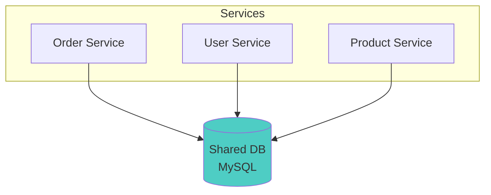
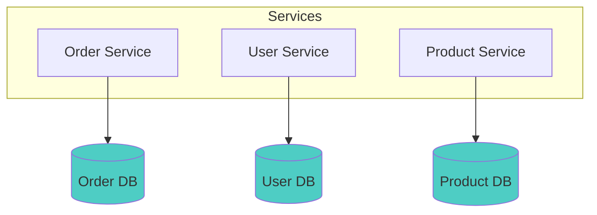
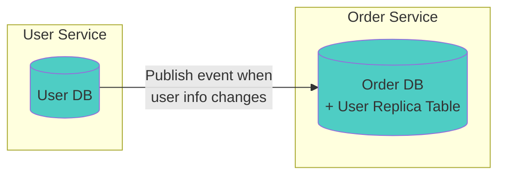
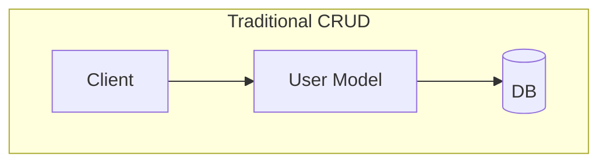
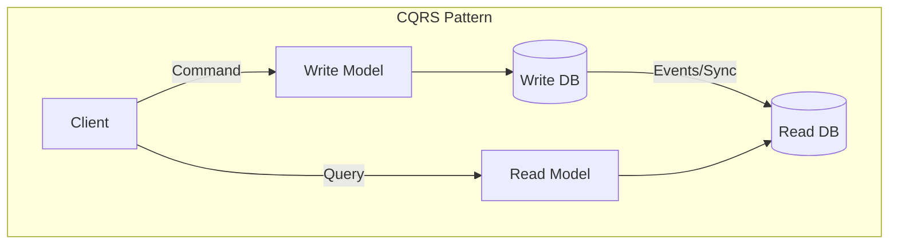

Previous: [[Reflections on MSA 4/7] How Failures Propagate and Where We Should Break the Chain]()

---

In the previous part, we explored how failures propagate in MSA environments and various patterns to prevent them. From Timeout, Retry, to Circuit Breaker, there were many different approaches.

But there's still much more to consider. In Part 2, we thought about how to divide services, and in Parts 3 and 4, we looked at how divided services communicate and respond to failures. Now I want to talk about one of the most troublesome problems in MSA environments: **the data separation problem**. This was actually the area I thought about most when adopting MSA.

What used to be solved with a single JOIN in monolithic architecture requires surprisingly complex decision-making in MSA. In this part, I'll share what considerations I faced, how to separate data in MSA environments, and what becomes difficult after separation.

## Do We Really Need to Separate Databases?

Let me start with a fundamental question. Does MSA necessarily require database separation? Let's think about it.

As I mentioned in Part 1, most technologies are usually introduced to solve **specific problems**. So if we look at what **specific problems** can occur when we don't separate databases in MSA, we can easily judge whether separation is necessary.



Let's consider a structure like this. In an MSA environment, the Order Service, User Service, and Product Service all share a single MySQL DB. Since it's a single DB, JOINs are free, transactions are guaranteed, and we can develop the way we always have. What's the problem?

### Shared DB in MSA: The Price of Convenience

In the early stages of development, it seems convenient. Complexity is reduced, and the learning curve is much lower than with distributed DBs. This is the advantage of shared DB.

You don't need to worry about DB and data separation, and if you need data from another service, a single JOIN does the job just like in monolithic architecture.

Transactions are guaranteed too, so you can develop in familiar ways. But problems reveal themselves over time.

#### The Fear of Schema Changes

Let's say the User Service wants to change a column in the `users` table.

But if the Order Service, Product Service, Settlement Service... all reference that table, the impact of the `users` table becomes enormous. "Which services do I need to check if I change this column?"

In a shared DB, schema changes can affect all services, so you have to investigate all services to understand the impact, and all related teams might need to meet for discussions.

It ends up being no different from what we did in monolithic. It's MSA in name only.

#### Deployment Dependencies

There's another problem. Let's say a column was deleted from the `users` table.

After all related teams met and somehow finished discussions, and after painstakingly confirming through investigation which services use that column.

But what if the investigation reveals that all services reference this column? Then to delete that column, all services must modify their code to reflect this change and deploy. In other words, deployment dependencies between services emerge.

Services are separated, but deployments must happen together. This too is MSA in name only.

#### Failure Propagation

We talked about failure propagation in Part 3, and sharing a DB causes problems here too. If one service runs heavy queries or holds locks for too long, other services are affected.

Services are separated, but failures propagate. This is also called the Noisy Neighbor problem. Fault isolation becomes impossible, and like the two problems above, I think this is essentially **giving up the benefits of MSA**.

If you're making choices that give up these MSA benefits, you can't help but wonder why you chose MSA in the first place.

### So in the End

So in the end, I believe shared DB in MSA sacrifices many of the benefits we seek from MSA and **compromises the core value of MSA: independence**. Only the service level is separated while the data level remains coupled—it's MSA only in appearance.

That's why I think the conclusion is inevitable: "If you want to do MSA properly, you need to separate the DB too."

Of course, there are ways to address these problems. For example, the fear of schema changes can be mitigated with **Schema Versioning**, deployment dependencies with **Backward Compatibility**, and failure propagation with **Connection Pool separation** or **query timeouts**. But I think these methods don't fundamentally solve the problems of shared DB.

## Database per Service

Now let's assume the entire team agrees that DB separation is necessary, and move on to the next question. What criteria should we use to divide databases in MSA?

If you've studied MSA at all, you've probably heard of "Database per Service." It's literally an architectural pattern where **each service has its own DB**.



The biggest advantage of "Database per Service" in my view is that **the criteria are clear**. No need to worry about "where and how should we divide the DB?"—just divide by service.

Another advantage is that **Polyglot Persistence** becomes possible. Since each service has its own DB, you can choose the DB technology that best fits each service's characteristics. For example, use RDB for the Order Service where transactions are important, Elasticsearch for the Search Service that needs full-text search, and Redis for session storage that requires fast reads/writes. With a shared DB, all services are locked into a single DB technology, but separating DBs gives you this flexibility.

### Other Separation Strategies

Of course, "Database per Service" isn't the only way. There are a few alternatives.

#### Schema per Service

Schema per Service physically uses a single DB instance but achieves logical separation with separate schemas per service. It can reduce operational costs and is less burdensome in early stages. Since it's the same DB instance, cross-schema JOINs are possible and transactions can be grouped if desired. Whether MySQL or PostgreSQL, cross-schema JOINs and transactions work without additional configuration within the same instance.

Note: PostgreSQL's `dblink` or `postgres_fdw` are needed when accessing a **different database**, not a different schema. In PostgreSQL, "schema" and "database" are different concepts.

However, the problem is that it's still a shared DB, so the Noisy Neighbor problem remains, and you're never completely free from the shared DB problems mentioned earlier (fear of schema changes, deployment dependencies).

#### Database per Bounded Context

Database per Bounded Context divides DBs by domain (Bounded Context) rather than service units. Multiple services belonging to the same domain can share a DB, allowing more flexible transaction boundaries.

However, distributed DB problems still occur between domains.

In summary, Schema per Service accepts some shared DB problems while avoiding the complexity of distributed DB, while Database per Service and Database per Bounded Context get complete isolation but must accept distributed DB problems.

### What Really Matters

Whichever approach you choose, there are trade-offs, and **the moment DBs are physically separated, problems inherent to distributed DBs occur**. Rather than the "criteria" for separation, how to handle the "problems" caused by separation is the more important question.

So in this article, I'll continue with "Database per Service" as it's the most commonly used approach. The problems and solutions I'll cover below apply regardless of which approach you choose.

Now let's look at what problems arise when you separate DBs. These problems are quite troublesome.

### JOINs Don't Work

First, as you might easily expect, but more troublesome than you'd think, is the problem that **JOINs don't work**.

In a shared DB, when you wanted to query order details along with user names and product information all at once, queries like this were naturally possible:

```sql
SELECT o.*, u.name, u.email, p.title
FROM orders o
JOIN users u ON o.user_id = u.id
JOIN products p ON o.product_id = p.id
WHERE o.id = 'example';
```

You could get order, user, and product information in a single query. You've probably written this query countless times while developing.

But when DBs are separated, since each DB exists independently, such queries become impossible. The Order DB doesn't have the users table, and the User DB doesn't have the orders table.

Therefore, **SQL JOINs processed by a single DB engine can no longer be used**. You have to query each DB separately and combine them in the application, or use other methods.

Are you already feeling like this is getting complicated? I'll cover the possible solutions in more detail later.

### Transactions Don't Work

The second problem is that, like JOINs, **transactions that were handled by a single DB engine no longer work**.

Let's think about concert ticket booking this time. To book a concert ticket, three tasks are needed:

1. Seat reservation (Seat Service)
2. Payment processing (Payment Service)
3. Ticket issuance (Ticket Service)

In a shared DB environment, these three tasks could be wrapped in a single transaction. If payment fails, seat reservation is automatically rolled back.

```sql
BEGIN TRANSACTION;

-- 1. Seat reservation
UPDATE seats SET status = 'RESERVED', user_id = 123
WHERE seat_id = 'A-15' AND status = 'AVAILABLE';

-- 2. Payment processing
INSERT INTO payments (user_id, amount, status)
VALUES (123, 150000, 'COMPLETED');

-- 3. Ticket issuance
INSERT INTO tickets (user_id, seat_id, concert_id)
VALUES (123, 'A-15', 'concert-2024');

COMMIT;
-- If any one fails, entire ROLLBACK!
```

But what happens when DBs are separated? The seats table is in the Seat DB, payments table in the Payment DB, and tickets table in the Ticket DB.

Since they operate as separate DBs, **they can't be wrapped in a single transaction**. Distributed transactions become necessary, and this is far more complex than you might think. I'll cover this in detail later.

### Data Consistency Breaks

Let's continue with the example above. What if seat reservation succeeded, payment succeeded, but ticket issuance failed?

In a shared DB, if you used transactions well, everything would roll back, so there's no big problem. But in MSA with separated DBs, you can end up in a state where **payment is completed but there's no ticket**. From the user's perspective, money is gone but there's no ticket—an absurd situation.

This is exactly the **data consistency problem in distributed environments**. Because each service commits independently, if a failure occurs in the middle, some succeed and some fail. How to solve this problem is one of MSA's big challenges.

The problems I've explained so far are all **problems caused by DB separation**. In summary:

1. **JOINs don't work** → How do we get data from other services?
2. **Transactions don't work** → How do we atomically process operations across multiple services?
3. **Consistency breaks** → How do we maintain consistency across distributed data?

From here, let's look at how we can solve these problems one by one.

## When You Need Data from Other Services

Let's start with the problem of JOINs not working. Let's assume a specific situation.

We've received a task to create "Order Detail View" in the Order Service in an MSA environment. The information to show on screen is:

- Order information (Order Service DB)
- Name and contact of the customer who ordered (User Service DB)
- Name and price of the ordered product (Product Service DB)

Three things. If we were using a shared DB, we could JOIN in the Order Service and get everything at once, but now the DBs are separated, so that's impossible.

### Can't the Frontend Just Call Each One?

You might think, "Can't the frontend just call 3 APIs separately?" Of course that's possible. But there are several problems.

First, **network requests increase**. In mobile environments or unstable network conditions, 3 API calls can be burdensome. Especially if you're going back and forth multiple times to render a single screen, user experience suffers.

Second, **the frontend needs to know the backend structure**. Knowledge like "to see order details, you need to call Order API, User API, and Product API separately" seeps into the frontend. If the backend structure changes later, the frontend must change too.

Third, **permission handling becomes complex**. If you have permission to view order details, you should also be able to see the related user and product information, but with separate APIs, maintaining consistent permission systems becomes difficult.

So usually the choice is to solve this problem in the backend. Then how can the backend combine data from multiple services?

### Solution 1: API Composition

The first approach that comes to mind seems like the most intuitive method. **Call other services' APIs whenever needed** to get data.

Even in monolithic systems, there were cases where we called external partner APIs to query data, so think of it as the same thing.

Using communication methods like REST API or gRPC, the Order Service calls the User Service and Product Service APIs to get data.

```java
public OrderDetailResponse getOrderDetail(Long orderId) {
    // First query order info from my DB
    Order order = orderRepository.findById(orderId);

    // Call other service APIs to get needed data
    UserResponse user = userClient.getUser(order.getUserId());
    ProductResponse product = productClient.getProduct(order.getProductId());

    // Combine and return
    return OrderDetailResponse.builder()
        .order(order)
        .userName(user.getName())
        .productTitle(product.getTitle())
        .build();
}
```

Implementation is simple and intuitive. And there's the advantage of **always getting the latest data**. If the user's name changes in the User Service, it's immediately reflected.

But thinking about it for a moment, there are drawbacks to this method.

- **Increased latency**: Processing one request requires multiple API calls, so naturally it's slower. Network round trips are added.
- **Failure propagation**: The problem we covered in Part 3. If the User Service dies, order queries don't work either. The entire thing fails because of one user name. Of course, you can apply fault isolation patterns, but the fact that there's a dependency doesn't change.
- **N+1 problem**: Think about order list queries. If you query 10 orders, User API 10 times, Product API 10 times... It's likely to affect performance. Of course, you can mitigate this with Batch APIs (e.g., `GET /users?ids=1,2,3,4,5`) that query multiple records at once, but this makes API design more complex, and it's not applicable to all situations, so I don't think it's a fundamental solution.

### Solution 2: Data Replication

The second method is **copying the needed data to your own DB in advance**.

Create a replica table for user information in the Order Service, and whenever user information is created or changed in the User Service, publish an event for the Order Service to subscribe to.



```java
// Receive user info change event and update replica table
@EventListener
public void onUserUpdated(UserUpdatedEvent event) {
    userReplicaRepository.save(UserReplica.from(event));
}

// Query directly from my DB when reading
public OrderDetailResponse getOrderDetail(Long orderId) {
    Order order = orderRepository.findById(orderId);
    // Query from my DB - fast and stable!
    UserReplica user = userReplicaRepository.findById(order.getUserId());

    return OrderDetailResponse.builder()
        .order(order)
        .userName(user.getName())
        .build();
}
```

Since you're querying from the same DB engine, you can use JOIN if you want, and transactions are guaranteed. And **fault isolation** works too. Order queries work even if the User Service dies.

Of course, this approach has drawbacks too.

- **Possibility of data inconsistency**: If events are delayed, stale data may be visible temporarily. Data consistency issues can occur due to event loss. (This can be addressed with the Transactional Outbox pattern or reliable message brokers like Kafka—I'll cover this in detail in Part 6.)
- **Increased storage**: Same data is stored in multiple places, so more storage is needed.
- **Synchronization logic management**: You need to create and maintain event processing logic.

#### Replica Tables Are Read-Only

Here's an important point. Replica tables created this way are **read-only**. The Order Service must not directly INSERT or UPDATE the user replica table. Because the source of user data is in the User Service.

Replica table data should **only be changed through events**. That's how consistency between source and replica is maintained.

This pattern of separating writes (source service) and reads (replica table) is called **CQRS (Command Query Responsibility Segregation)**.

#### CQRS: Why Did This Pattern Emerge?

CQRS is a pattern that, as the name suggests, separates the responsibility of **Command (writes)** and **Query (reads)**. At first you might think "why bother separating?", but when doing data replication in MSA, you naturally end up applying this pattern.

Think about it—in traditional CRUD architecture, a single model handles both reads and writes. You create, modify, and query users with a `User` entity. For simple applications, this is sufficient.

But as systems become complex, the requirements for reads and writes start to diverge.

- **Writes**: Business rule validation, consistency guarantees, transaction handling are important
- **Reads**: Fast response times, various query conditions, combining multiple data are important

When trying to satisfy both with a single model, you often end up doing neither well. Denormalizing for query performance makes writes complex, and normalizing for writes increases JOINs during queries.





CQRS solves this problem with a simple idea: **"just separate them."** Handle writes with a model optimized for writing, and reads with a model optimized for reading.

#### Why CQRS Is Natural in MSA

But looking back at the **data replication** approach we covered earlier, you can see we're already applying CQRS.

- The **source (write)** of user information is in the User Service, and the **replica table (read)** in the Order Service becomes a read-only table. The two stores are synchronized **through events**.

When you do data replication in MSA, you naturally get a CQRS structure. The source service handles Command, and the replica table handles Query.

```java
// User Service (handles Command - source)
@Service
public class UserService {
    public void updateUserName(Long userId, String newName) {
        User user = userRepository.findById(userId);
        user.changeName(newName);  // Business rule validation
        userRepository.save(user);
        eventPublisher.publish(new UserNameChangedEvent(userId, newName));
    }
}

// Order Service (handles Query - replica)
@Service
public class OrderQueryService {
    public OrderDetailResponse getOrderDetail(Long orderId) {
        // Fast query from replica table
        return orderDetailViewRepository.findByOrderId(orderId);
    }
}
```

One point you might miss is that the replica DB schema doesn't need to be identical to the source DB. The read model can be designed freely optimized for queries. Remove what's unnecessary, add what's needed.

For example, if the `User` table schema in the User Service is:

```sql
CREATE TABLE Users (
    id BIGINT PRIMARY KEY,
    name VARCHAR(100),
    email VARCHAR(100),
    password_hash VARCHAR(255),
    created_at TIMESTAMP,
    updated_at TIMESTAMP
);
```

Let's say the Order Service only needs name and email when querying user information. Then the Order Service's replica table can be designed like this:

```sql
CREATE TABLE UserReplica (
    id BIGINT PRIMARY KEY,
    name VARCHAR(100),
    email VARCHAR(100)
);
```

#### The Real Advantages of CQRS

With CQRS, you can **independently optimize** reads and writes.

Without being bound by normalization, you can pre-JOIN and store data needed for the screen. You can get all needed data with a single query without JOINs.

```java
// Store in a structure perfectly matched for order detail screen
@Entity
public class OrderDetailView {
    private Long orderId;
    private String orderStatus;
    private LocalDateTime orderDate;

    // User info (replica)
    private String userName;
    private String userEmail;

    // Product info (replica)
    private String productName;
    private Integer productPrice;

    // Single query without JOINs!
}
```

The source service can focus solely on business logic and data consistency without worrying about query performance. You can maintain normalized structures while cleanly implementing domain rules. If read traffic is high, just scale out the read DB. Read and write loads don't affect each other.

#### The Price of CQRS

Of course, CQRS has its price. With two models, there's more code to manage. Complexity naturally increases.

And there's a time gap until writes are reflected in the read model. Situations like "I just modified it, why hasn't it changed?" can occur. You also need to consider event processing and retry on failure. I'll cover this in more detail in Part 6.

So I think CQRS is effective for **complex domains** or **cases where read/write patterns differ**. It might be overkill for simple CRUD apps. However, if you've chosen data replication in MSA, you're already following CQRS structure, so it's naturally applied.

By the way, CQRS is often mentioned alongside **Event Sourcing**, but they're independent patterns. Event Sourcing stores state changes as a sequence of events, and it pairs well with CQRS, which is why they're often used together. But CQRS can be applied without Event Sourcing, and this article doesn't cover Event Sourcing separately. I'm mentioning this because you might wonder, "If I do CQRS, don't I have to do Event Sourcing too?"

### When Should You Choose What?

| Situation | Recommended Approach | Reason |
|-----------|---------------------|--------|
| Real-time data is important | API Composition | Always guarantees latest data |
| Query performance is important | Data Replication | Fast queries without network calls |
| Data changes infrequently | Data Replication | Low synchronization burden |
| Fault isolation is important | Data Replication | Not affected by other service failures |
| Want to reduce implementation complexity | API Composition | No event processing logic needed |

Personally, for services with heavy reads, I **prefer data replication**. API Composition looks simple at first, but performance problems often become severe as traffic increases.

An API that would respond in 100-200ms with data replication could take over 1 second with API Composition as multiple network calls stack up, and N+1 problems occurred more often than expected.

Of course, I'm not saying "data replication is always better." API Composition is intuitive, so initial development is faster and developers can understand services more quickly. For cases where real-time data is critical, API Composition might be more suitable.

Ultimately, what matters is choosing the appropriate approach for each situation. The key is knowing clearly when to use what.

## Summary

Here's a summary of what we covered in this part:

1. **Shared DB is convenient, but** it compromises the core value of MSA: independence. Fear of schema changes, deployment dependencies, and failure propagation occur.
2. **If you separate DBs**, JOINs don't work, transactions don't work, and consistency breaks. This is an unavoidable trade-off.
3. **Instead of JOINs**, you can use API Composition or Data Replication.
4. **API Composition** is intuitive but has increased latency, failure propagation, and N+1 problems.
5. **Data Replication** is good for performance and fault isolation but requires accepting the complexity of event synchronization.

Ultimately, **data separation comes with a clear price**. I think it's actually the area requiring the most thought in MSA.

So whenever I think about data separation, I believe this question should come first: **"Does this data really need to be separated?"**

Just because you can technically separate it doesn't mean you should. If data changes together, is queried together, and needs transactions together, maybe it should be in the same place to begin with.

## In the Next Part

In this part, we looked at why we should separate DBs, and how to solve the JOIN problem with API Composition and Data Replication.

But choosing **"data replication"** doesn't mean it's over. Actually, that's where the harder problems begin.

Now that I've said it, it seems like nothing but hard problems haha..

In the next Part 6, let's explore the consistency problems that occur in event-based data synchronization. How to atomically handle DB saves and event publishing, what happens when event order gets mixed up, what to do when messages are lost or duplicated, and the Saga pattern as an alternative to distributed transactions.

Next: [[Reflections on MSA 6/7] Event-Based Data Consistency]()

---

## References

### Data Management Patterns

- Chris Richardson - *Microservices Patterns* (Manning, 2018)
- [Microservices.io - Database per Service](https://microservices.io/patterns/data/database-per-service.html)

### CQRS

- Martin Fowler - [CQRS](https://martinfowler.com/bliki/CQRS.html)
- Greg Young - *CQRS Documents* (2010)
