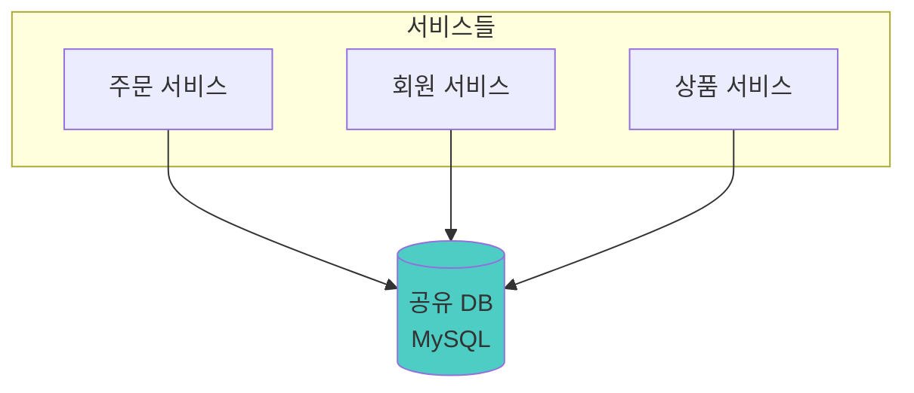
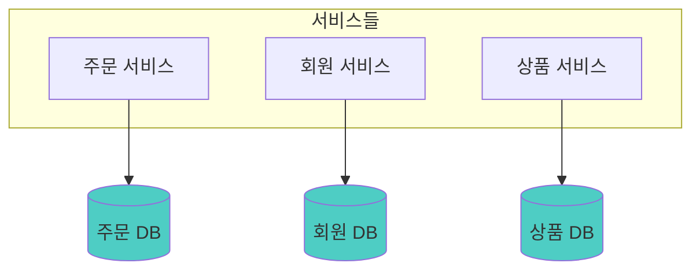
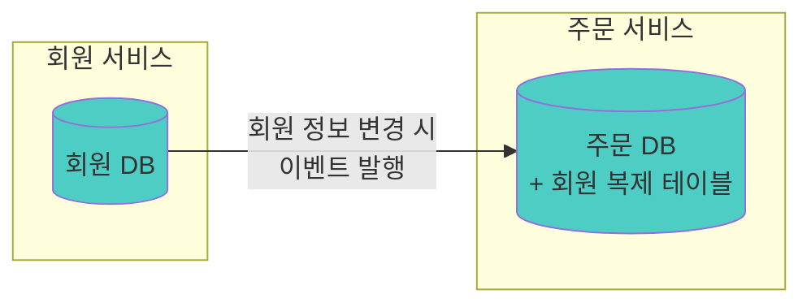
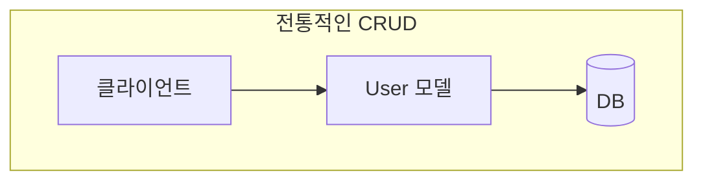
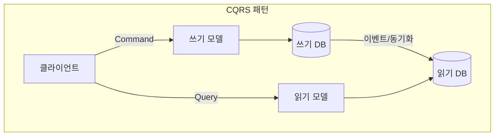

전편: [[MSA에 관한 고찰 4/7편] 장애는 어떻게 전파되고, 우리는 어디서 끊어야 하는가]()

---

저번 편에서 저희는 MSA 환경에서 장애가 어떻게 전파되는지, 그리고 이를 막기 위한 여러 패턴들에 대해 살펴보았습니다. Timeout, Retry, Circuit Breaker까지 다양한 방법들이 있었죠.

하지만 아직 해야할 고민이 훨씬 많이 남아있습니다. 2편에서 서비스를 어떻게 나눌지 고민했고, 3편과 4편에서 나눠진 서비스들이 어떻게 통신하고 장애에 대응하는지 살펴봤습니다. 이제는 MSA 환경에서 가장 골치 아픈 문제 중 하나인 **데이터 분리 문제**에 대해 이야기해보려 합니다. 실제로 제가 MSA를 도입하면서 가장 많이 고민하게 됐던 부분입니다.

모놀리식에서는 JOIN 한 방이면 끝났던 일이, MSA에서는 생각보다 복잡한 의사결정을 해야합니다. 이번 편에서는 제가 어떤 고민들을 하게 됐는지, MSA 환경에서 데이터를 어떻게 분리해야 하는지, 그리고 분리하면 무엇이 어려워지는지에 대해 알아보는 시간을 가져보려 합니다.

## 꼭 DB를 분리해야 하는가

먼저 근본적인 질문부터 던져보겠습니다. MSA에서라고 해서 꼭 DB를 분리해야 할까요? 한번 생각해보면 좋을 것 같습니다.

1편에서도 이야기 했듯이 모든 기술은 보통 **특정한 문제**를 해결하기 위해 도입됩니다. 그렇다면 MSA에서 DB를 분리하지 않았을 때 어떤 **특정한 문제**들이 발생할 수 있는지 살펴보면 꼭 분리해야하는 지 여부를 쉽게 판단할 수 있을 것 같습니다.



위와같은 구조를 생각해봅시다. MSA환경에서 주문 서비스, 회원 서비스, 상품 서비스가 모두 하나의 MySQL DB를 공유하는 구조입니다. 단일 DB이기 때문에 JOIN도 자유롭고, 트랜잭션도 보장되고, 기존에 하던 대로 개발하면 됩니다. 뭐가 문제일까요?

### MSA 환경에서 공유 DB: 편리함의 대가

개발하는 초기에는 편하다고 생각합니다. 복잡성이 줄어들고 러닝커브 역시 분산 DB보다는 훨씬 낮아지니까요. 이 점이 공유 DB의 장점입니다.

DB와 데이터의 분리에 대해서 고민할 필요가 없고 다른 서비스의 데이터가 필요하면 일반 모놀리식 아키텍처에서 했던 것 처럼 JOIN 한 방이면 됩니다. 

트랜잭션도 보장되니까 개발도 익숙한 방식으로 하면 되고요. 하지만 문제는 시간이 지나면서 드러나게 됩니다.

#### 스키마 변경의 공포

만약 회원 서비스에서 `users` 테이블의 컬럼 하나를 변경하고 싶다고 가정하겠습니다. 

그런데 회원 테이블을 주문 서비스, 상품 서비스, 정산 서비스... 전부 해당 테이블을 참조하고 있다면 `users` 테이블의 영향도가 굉장히 커집니다. "이 컬럼 변경하면 어느 서비스까지 확인해야하지?"

공유 DB에서는 스키마 변경이 모든 서비스에 영향을 줄 수 있기 때문에 결국 모든 서비스를 전수조사 하며 영향도를 파악 해야하고 관련있는 모든 팀이 모여서 협의를 해야 할 수도 있습니다.

결국 모놀리식에서 하던 것과 다를 게 없어집니다. 무늬만 MSA인 셈이죠.

#### 배포 의존성

또 다른 문제도 있습니다. 마찬가지로 `users` 테이블에 컬럼이 삭제 됐다고 가정해봅시다. 

관련있는 모든 팀이 모여서 어떻게 어떻게 협의까지 끝냈고, 각 서비스들이 해당 컬럼을 사용하고 있는지 전수조사를 통해 힘겹지만 결국 확인했다고 해보겠습니다. 

그런데 조사해보니 모든 서비스가 이 컬럼을 참조하고 있었을 수도 있겠죠? 그렇다면 해당 컬럼을 삭제하기 위해서는 모든 서비스들이 이 변경사항을 반영하도록 코드를 수정하고 배포해야 합니다. 즉, 서비스 간 배포 의존성이 생깁니다. 

서비스는 분리되어 있는데 배포는 함께 해야하는 일이 발생합니다. 이 역시 무늬만 MSA가 되는 셈이죠.

#### 장애 전파

3편에서 장애 전파에 대해 이야기했는데, DB를 공유하면 여기서도 문제가 생깁니다. 하나의 서비스에서 무거운 쿼리를 날리거나 Lock을 오래 잡으면, 다른 서비스들도 영향을 받습니다.

서비스는 분리되어 있는데 장애는 전파되는 일이 발생합니다. Noisy Neighbor 문제라고도 하죠. 결국 장애 격리가 안되고 이는 위 두 문제들과 마찬가지로 **MSA의 이점을 버리는 셈**에 가깝다고 생각합니다.

이런 MSA의 이점을 버리는 선택을 한다면 왜 굳이 MSA를 선택했는지 의문이 들 수밖에 없지 않나 싶습니다.

### 그래서 결국

그래서 결국 저는 MSA 환경에서의 공유 DB는 MSA를 통해 얻고자 하는 많은 이점들을 희생시키고 **MSA의 핵심 가치인 독립성을 훼손**시킨다고 생각합니다. 서비스 레벨만 분리되고 데이터 레벨은 여전히 결합되어버려 겉보기에만 MSA가 되는 셈이니까요. 

그렇기 때문에 "MSA를 제대로 하려면 결국 DB도 분리해야 한다"는 결론에 도달할 수 밖에 없지 않나 싶습니다.

물론 위 문제들을 해결하기 위한 방법들도 있긴 합니다. 예를 들어 스키마 변경의 공포는 **Schema Versioning**으로, 배포 의존성은 **Backward Compatibility**로, 장애 전파는 **Connection Pool 분리**나 **쿼리 타임아웃**으로 어느정도 완화할 수 있겠죠. 하지만 이런 방법들은 결국 공유 DB의 근본적인 문제를 해결하지는 못한다고 생각합니다.

## Database per Service

그렇다면 이제 DB의 분리가 필요하다는 부분에 대해 팀 모두가 동의했다고 가정하고, 다음 질문으로 넘어가 보겠습니다. MSA에서 저희는 DB를 어떤 기준으로 나눠야 할까요?

MSA에 대해 조금이라도 공부해보신 분들은 "Database per Service"라는 말을 한 번쯤은 들어보셨을 겁니다. 말 그대로 **서비스마다 자기만의 DB를 가지는** 아키텍처 패턴이죠.



제가 생각하는 "Database per Service"의 가장 큰 장점은 **기준이 명확하다**는 점입니다. "DB를 어디서 어떻게 나눠야 하지?"라는 고민 없이, 서비스 단위로 나누면 되니까요.

### 다른 분리 전략들

물론 "Database per Service"만이 유일한 방법은 아닙니다. 몇 가지 대안도 있습니다.

#### Schema per Service

Schema per Service는 물리적으로는 하나의 DB 인스턴스를 사용하지만, 서비스마다 별도의 스키마로 논리적 분리를 하는 방식입니다. 운영 비용을 줄일 수 있고 초기 단계에서 부담이 적습니다. 같은 DB 인스턴스이기 때문에 Cross-schema JOIN이 가능하긴 하고 트랜잭션도 원하면 묶을 수 있습니다. (단, 이는 MySQL 기준이며 PostgreSQL의 경우 `dblink`나 `postgres_fdw` 등 별도 설정이 필요합니다.) 

다만 문제는 결국은 공유 DB이기 때문에 Noisy Neighbor 문제는 여전히 남아있고, 결국 앞서 언급한 공유 DB의 문제들(스키마 변경의 공포, 배포 의존성)에서 완전히 자유롭지는 못합니다.

#### Database per Bounded Context

Database per Bounded Context는 서비스 단위가 아닌 도메인(Bounded Context) 단위로 DB를 나누는 방식입니다. 같은 도메인에 속한 여러 서비스가 하나의 DB를 공유할 수 있어서 트랜잭션 경계를 더 유연하게 가져갈 수 있습니다. 

다만 도메인 간에는 여전히 분산 DB의 문제가 발생합니다.

정리하자면, Schema per Service는 공유 DB의 문제를 일부 안고 가는 대신 분산 DB의 복잡성을 피하는 방식이고, Database per Service나 Database per Bounded Context는 완전한 격리를 얻는 대신 분산 DB의 문제를 감수하는 방식입니다.

### 결국 중요한 건

어떤 방식을 선택하든 결국 트레이드오프가 있고, **DB가 물리적으로 분리되는 순간 분산 DB가 가지게 되는 문제들은 발생하게 됩니다.** 분리의 "기준"보다는 분리로 인해 발생하는 "문제"를 어떻게 다룰 것인가가 더 중요한 문제라고 볼 수 있습니다.

그래서 이 글에서는 가장 보편적으로 사용되는 "Database per Service"를 기준으로 설명을 이어가겠습니다. 어떤 방식을 선택하든 아래에서 다룰 문제들과 해결책은 동일하게 적용되니까요.

자, 그럼 DB를 분리하면 어떤 문제들이 생기는지 살펴보겠습니다. 이 문제들이 꽤나 골치아픕니다.

### JOIN이 안 됩니다

먼저 첫번째는 쉽게 예상하실수 있겠지만 생각보다 까다로운 **JOIN이 안된다**는 문제입니다.

공유 DB에서는 주문 상세 정보를 조회할 때 회원 이름이랑 상품 정보까지 한 번에 가져오고 싶다면 당연하게도 이런 쿼리가 가능했습니다.

```sql
SELECT o.*, u.name, u.email, p.title
FROM orders o
JOIN users u ON o.user_id = u.id
JOIN products p ON o.product_id = p.id
WHERE o.id = 'example';
```

한 번의 쿼리로 주문, 회원, 상품 정보를 다 가져올 수 있었죠. 아마 개발을 하시면서 수도 없이 작성해보셨을 쿼리이지 않을까 싶습니다.

하지만 DB가 분리되면 각 DB가 개별적으로 존재하기 때문에 이런 쿼리는 불가능해집니다. 주문 DB에는 회원 테이블이 없고, 회원 DB에는 주문 테이블이 없습니다. 

그렇기 때문에 **하나의 DB 엔진이 연산해주는 SQL JOIN은 사용할 수 없게 됩니다.** 그래서 각 DB에 따로 쿼리해서 애플리케이션에서 조합하거나 다른 방법을 사용 해야 합니다.

벌써부터 이건 어떻게 해결해야하나 복잡해지는 느낌이 드시나요? 해결 가능한 방법들은 뒤에서 더 자세히 다루겠습니다.

### 트랜잭션이 안 됩니다

두번째 문제는 JOIN과 마찬가지로 하나의 DB 엔진이 처리해주던 **트랜잭션이 안 된다**는 점입니다.

이번에는 콘서트 예매를 생각해 보겠습니다. 콘서트 티켓을 예매하려면 다음 세 가지 작업이 필요합니다.

1. 좌석 예약 (좌석 서비스)
2. 결제 처리 (결제 서비스)
3. 티켓 발급 (티켓 서비스)

공유 DB 환경에서는 이 세 작업을 하나의 트랜잭션으로 묶을 수 있었습니다. 결제가 실패하면 좌석 예약도 자동으로 롤백되죠.

```sql
BEGIN TRANSACTION;

-- 1. 좌석 예약
UPDATE seats SET status = 'RESERVED', user_id = 123
WHERE seat_id = 'A-15' AND status = 'AVAILABLE';

-- 2. 결제 처리
INSERT INTO payments (user_id, amount, status)
VALUES (123, 150000, 'COMPLETED');

-- 3. 티켓 발급
INSERT INTO tickets (user_id, seat_id, concert_id)
VALUES (123, 'A-15', 'concert-2024');

COMMIT;
-- 하나라도 실패하면 전체 ROLLBACK!
```

하지만 DB가 분리되면 어떻게 될까요? 좌석 테이블은 좌석 DB에, 결제 테이블은 결제 DB에, 티켓 테이블은 티켓 DB에 있습니다. 

개별적인 DB로 운영되기때문에 **하나의 트랜잭션으로 묶을 수가 없습니다.** 분산 트랜잭션이 필요해지는데, 이게 생각보다 훨씬 복잡합니다. 이 부분도 뒤에서 자세히 다루겠습니다.

### 데이터 일관성이 깨집니다

위 예시를 이어서 생각해보겠습니다. 좌석 예약은 성공했고, 결제도 성공했는데, 티켓 발급에서 실패하면 어떻게 될까요?

공유 DB에서는 트랜잭션만 잘 사용했다면 전체가 롤백되니까 크게 문제가 없습니다. 하지만 DB가 분리된 MSA에서는 **결제는 완료됐는데 티켓은 없는** 상태가 될 수 있습니다. 사용자 입장에서는 돈은 빠져나갔는데 티켓은 없는 황당한 상황이 되는 거죠.

이게 바로 **분산 환경에서의 데이터 정합성 문제**입니다. 각 서비스가 독립적으로 커밋하기 때문에, 중간에 실패가 발생하면 일부는 성공하고 일부는 실패한 상태로 남게 됩니다. 이 문제를 어떻게 해결할지가 MSA의 큰 숙제라고 볼 수 있습니다.

지금까지 설명드린 문제들은 모두 **DB 분리로 인해 발생하는 문제들**입니다. 정리하자면 다음과 같습니다.

1. **JOIN이 안 된다** → 다른 서비스의 데이터를 어떻게 가져올 것인가?
2. **트랜잭션이 안 된다** → 여러 서비스에 걸친 작업을 어떻게 원자적으로 처리할 것인가?
3. **일관성이 깨진다** → 분산된 데이터의 정합성을 어떻게 맞출 것인가?

이제부터는 이 문제들을 어떻게 해결할 수 있는지 하나씩 살펴보겠습니다.

## 다른 서비스의 데이터가 필요할 때

먼저 JOIN이 안 되는 문제부터 살펴보겠습니다. 구체적인 상황을 가정하고 진행해보겠습니다.

저희는 MSA 환경에서 주문 서비스에 "주문 상세 조회"를 만들어야 하는 Task를 받게 됐습니다. 화면에 보여줄 정보는 

- 주문 정보 (주문 서비스 DB)
- 주문한 회원의 이름, 연락처 (회원 서비스 DB)
- 주문한 상품의 이름, 가격 (상품 서비스 DB)

이렇게 세 가지입니다. 공유 DB를 사용하고 있었다면 주문 서비스에서 JOIN해 한 번에 가져올 수 있었겠지만, 이제는 DB가 분리되어 있으니 불가능합니다.

### 프론트에서 각각 호출하면 안 되나요?

"그냥 프론트에서 3개 API 각각 호출하면 되는 거 아니에요?"라고 생각하실 수도 있습니다. 물론 가능합니다. 하지만 몇 가지 문제가 있습니다.

첫째, **네트워크 요청이 늘어납니다.** 모바일 환경이나 네트워크가 불안정한 상황에서는 3번의 API 호출이 부담이 될 수 있습니다. 특히 하나의 화면을 그리기 위해 여러 번 왔다갔다하면 사용자 경험이 나빠지게 되겠죠.

둘째, **프론트엔드가 백엔드 구조를 알아야 합니다.** "주문 상세를 보려면 주문 API, 회원 API, 상품 API를 각각 호출해야 해"라는 지식이 프론트에 스며들게 됩니다. 나중에 백엔드 구조가 바뀌면 프론트도 함께 수정해야 하고요.

셋째, **권한 처리가 복잡해집니다.** 주문 상세를 볼 권한이 있으면 해당 주문에 연관된 회원 정보나 상품 정보도 볼 수 있어야 하는데, 각 API가 분리되어 있으면 이런 권한 체계를 일관되게 관리하기가 어려워질 수 있습니다.

그래서 보통은 백엔드에서 이 문제를 해결하는 선택을 하게 되는 것 같습니다. 그렇다면 백엔드에서는 어떻게 여러 서비스의 데이터를 조합할 수 있을까요?

### 해결책 1: API Composition

먼저 생각해볼 수 있는 방법은 가장 직관적인 방법인 것 같습니다. **필요할 때마다 다른 서비스의 API를 호출**해서 데이터를 가져오는 거죠.

기존에 모놀리식에서도 외부 협력사의 API를 호출해서 데이터를 조회하는 경우들도 있었으니, 이와 같은거라 생각하시면 됩니다.

REST API 혹은 gRPC 같은 통신 방식을 사용해 주문 서비스에서 회원 서비스와 상품 서비스의 API를 호출해서 데이터를 가져오면 됩니다.

```java
public OrderDetailResponse getOrderDetail(Long orderId) {
    // 먼저 내 DB에서 주문 정보 조회
    Order order = orderRepository.findById(orderId);

    // 다른 서비스 API 호출해서 필요한 데이터 가져오기
    UserResponse user = userClient.getUser(order.getUserId());
    ProductResponse product = productClient.getProduct(order.getProductId());

    // 조합해서 반환
    return OrderDetailResponse.builder()
        .order(order)
        .userName(user.getName())
        .productTitle(product.getTitle())
        .build();
}
```

구현이 단순하고 직관적입니다. 그리고 **항상 최신 데이터**를 가져온다는 장점도 있죠. 회원 서비스에서 회원분 이름이 바뀌면 바로 반영됩니다.

하지만 잠깐 생각해봐도 이 방법에는 단점들이 존재합니다.

- **지연 시간 증가**: 하나의 요청을 처리하기 위해 여러 API를 호출하니 당연히 느려집니다. 네트워크 왕복이 추가되니까요.
- **장애 전파**: 3편에서 다뤘던 문제죠. 회원 서비스가 죽으면 주문 조회도 안 됩니다. 회원 이름 하나 때문에 전체가 실패하는 거죠. 물론 장애 격리 패턴을 적용할 수는 있지만, 의존성이 있다는 사실 자체는 변하지 않습니다.
- **N+1 문제**: 주문 목록 조회를 생각해보세요. 주문 10개를 조회하면 회원 API 10번, 상품 API 10번... 성능에 영향을 미치게 될 가능성이 높습니다.

### 해결책 2: 데이터 복제

두 번째 방법은 **필요한 데이터를 미리 내 DB에 복사해두는 것**입니다.

주문 서비스에도 회원 정보에 대한 복제 테이블을 만들어두고, 회원 서비스에서 회원 정보가 생성되거나 변경될 때마다 이벤트를 발행해서 주문 서비스가 이를 구독하도록 하는 방식입니다.



```java
// 회원 정보 변경 이벤트를 받아서 복제 테이블 업데이트
@EventListener
public void onUserUpdated(UserUpdatedEvent event) {
    userReplicaRepository.save(UserReplica.from(event));
}

// 조회할 때는 내 DB에서 바로 가져옴
public OrderDetailResponse getOrderDetail(Long orderId) {
    Order order = orderRepository.findById(orderId);
    // 내 DB에서 조회 - 빠르고 안정적!
    UserReplica user = userReplicaRepository.findById(order.getUserId());

    return OrderDetailResponse.builder()
        .order(order)
        .userName(user.getName())
        .build();
}
```

같은 DB 엔진에서 조회해오기 때문에 원한다면 JOIN을 사용할 수도 있고, 트랜잭션도 보장할 수 있습니다. 그리고 **장애 격리**도 됩니다. 회원 서비스가 죽어도 주문 조회는 가능하죠.

물론 이 방식도 단점이 있습니다.

- **데이터 불일치 가능성**: 이벤트가 지연되면 잠시 동안 오래된 데이터가 보일 수 있습니다. 이벤트 유실로 인해 데이터 정합성 문제가 발생할 수도 있고요.
- **저장 공간 증가**: 같은 데이터를 여러 곳에 저장하기 때문에 저장 공간이 더 필요합니다.
- **동기화 로직 관리**: 이벤트 처리 로직을 만들고 유지보수해야 합니다.

#### 복제 테이블은 조회 전용이다

여기서 중요한 점이 있습니다. 이렇게 만든 복제 테이블은 **조회 전용**입니다. 주문 서비스에서 회원 복제 테이블에 직접 INSERT나 UPDATE를 하면 안 됩니다. 왜냐하면 회원 데이터의 원본은 회원 서비스에 있으니까요.

복제 테이블의 데이터는 **오직 이벤트를 통해서만** 변경되어야 합니다. 그래야 원본과 복제본의 일관성이 유지됩니다.

이렇게 쓰기(원본 서비스)와 읽기(복제 테이블)를 분리하는 패턴을 **CQRS(Command Query Responsibility Segregation)** 라고 부릅니다.

#### CQRS, 왜 이런 패턴이 생겼을까

CQRS는 이름 그대로 **Command(쓰기)** 와 **Query(읽기)** 의 책임을 분리하는 패턴입니다. 처음 들으면 "왜 굳이 분리하지?"라는 생각이 들 수 있는데, MSA에서 데이터 복제를 하다 보면 자연스럽게 이 패턴을 적용하게 됩니다.

생각해보면 전통적인 CRUD 아키텍처에서는 하나의 모델로 읽기와 쓰기를 모두 처리합니다. `User` 엔티티로 사용자를 생성하고, 수정하고, 조회하죠. 간단한 애플리케이션에서는 이게 충분합니다.

하지만 시스템이 복잡해지면 읽기와 쓰기의 요구사항이 달라지기 시작합니다.

- **쓰기**: 비즈니스 규칙 검증, 정합성 보장, 트랜잭션 처리가 중요
- **읽기**: 빠른 응답 속도, 다양한 조회 조건, 여러 데이터의 조합이 중요

하나의 모델로 이 두 가지를 다 만족시키려다 보면 어느 쪽도 제대로 못하게 되는 경우가 생깁니다. 조회 성능을 위해 비정규화를 하면 쓰기가 복잡해지고, 쓰기를 위해 정규화를 하면 조회할 때 JOIN이 늘어나고요.





CQRS는 이 문제를 **"그냥 분리하자"** 라는 단순한 아이디어로 해결합니다. 쓰기는 쓰기에 최적화된 모델로, 읽기는 읽기에 최적화된 모델로 각각 처리하는 거죠.

#### MSA에서 CQRS가 자연스러운 이유

그런데 저희가 앞에서 다룬 **데이터 복제** 방식을 다시 보면, 이미 CQRS를 적용하고 있다는 걸 알 수 있습니다.

- 회원 정보의 **원본(쓰기)** 은 회원 서비스에 있고 주문 서비스의 **복제 테이블(읽기)** 은 조회 전용 테이블이 됩니다. 두 저장소는 **이벤트를 통해** 동기화되죠.

MSA에서 데이터 복제를 하면 자연스럽게 CQRS 구조가 되는 겁니다. 원본 서비스가 Command를 담당하고, 복제 테이블이 Query를 담당하는 거죠.

```java
// 회원 서비스 (Command 담당 - 원본)
@Service
public class UserService {
    public void updateUserName(Long userId, String newName) {
        User user = userRepository.findById(userId);
        user.changeName(newName);  // 비즈니스 규칙 검증
        userRepository.save(user);
        eventPublisher.publish(new UserNameChangedEvent(userId, newName));
    }
}

// 주문 서비스 (Query 담당 - 복제본)
@Service
public class OrderQueryService {
    public OrderDetailResponse getOrderDetail(Long orderId) {
        // 복제 테이블에서 빠르게 조회
        return orderDetailViewRepository.findByOrderId(orderId);
    }
}
```

혹시 놓치실 수 있는 부분이 한가지 있다면 복제 DB의 스키마 구조는 꼭 원본 DB와 동일할 필요가 없다는 점입니다. 읽기 모델은 조회에 최적화된 구조로 마음껏 설계할 수 있습니다. 불필요한건 덜어내고 필요한건 더 추가해서요.

예를 들어 유저 서비스의 `User` 테이블의 스키마는 아래와 같다면

```sql
CREATE TABLE Users (
    id BIGINT PRIMARY KEY,
    name VARCHAR(100),
    email VARCHAR(100),
    password_hash VARCHAR(255),
    created_at TIMESTAMP,
    updated_at TIMESTAMP
);
```

주문 서비스에서 회원 정보를 조회할 때는 이름과 이메일만 필요하다고 가정해보겠습니다. 그럼 주문 서비스의 복제 테이블은 이렇게 설계할 수 있습니다.

```sql
CREATE TABLE UserReplica (
    id BIGINT PRIMARY KEY,
    name VARCHAR(100),
    email VARCHAR(100)
);
```

#### CQRS의 진짜 장점

CQRS를 적용하면 읽기와 쓰기를 **독립적으로 최적화**할 수 있습니다.

정규화에 얽매일 필요 없이, 화면에 필요한 데이터를 미리 JOIN해서 저장해두면 됩니다. JOIN 없이 한 번의 쿼리로 필요한 데이터를 다 가져올 수 있죠.

```java
// 주문 상세 화면에 딱 맞는 구조로 저장
@Entity
public class OrderDetailView {
    private Long orderId;
    private String orderStatus;
    private LocalDateTime orderDate;

    // 회원 정보 (복제)
    private String userName;
    private String userEmail;

    // 상품 정보 (복제)
    private String productName;
    private Integer productPrice;

    // JOIN 없이 한 방 쿼리로 조회 가능!
}
```

원본 서비스는 조회 성능을 신경 쓸 필요 없이 비즈니스 로직과 데이터 정합성에만 집중할 수 있습니다. 정규화된 구조를 유지하면서 도메인 규칙을 깔끔하게 구현할 수 있죠. 읽기 트래픽이 많으면 읽기 DB만 스케일 아웃하면 됩니다. 쓰기와 읽기의 부하가 서로 영향을 주지 않게 됩니다.

#### CQRS의 대가

물론 CQRS에도 대가가 있습니다. 모델이 두 개가 되니 관리할 코드가 늘어나게 됩니다. 자연스럽게 복잡도가 증가하죠.

그리고 쓰기 후 읽기 모델에 반영되기까지 시간차가 있습니다. "방금 수정했는데 왜 안 바뀌어 있지?"라는 상황이 발생할 수 있죠. 이벤트 처리, 실패 시 재처리 등도 고려해야 합니다. 이 부분은 6편에서 좀더 자세히 다루도록 하겠습니다.

그래서 CQRS는 **복잡한 도메인**이나 **읽기/쓰기 패턴이 다른 경우**에 효과적이라고 생각합니다. 단순한 CRUD 앱에는 과한 선택일 수 있고요. 다만 MSA에서 데이터 복제를 선택했다면, 이미 CQRS의 구조를 따르게 되니 자연스럽게 적용되는 셈이라고 저는 생각합니다.

### 언제 무엇을 선택해야할까요?

| 상황 | 권장 방식 | 이유 |
|------|-----------|------|
| 실시간성이 중요한 경우 | API Composition | 항상 최신 데이터 보장 |
| 조회 성능이 중요한 경우 | 데이터 복제 | 네트워크 호출 없이 빠른 조회 |
| 데이터 변경이 자주 없는 경우 | 데이터 복제 | 동기화 부담이 적음 |
| 장애 격리가 중요한 경우 | 데이터 복제 | 다른 서비스 장애에 영향 없음 |
| 구현 복잡도를 낮추고 싶은 경우 | API Composition | 이벤트 처리 로직 불필요 |

개인적으로 저는 조회가 많은 서비스에서는 **데이터 복제를 더 선호**하는 편입니다. API Composition은 처음엔 간단해 보이지만, 트래픽이 늘어나면 성능 문제가 심각해지는 경우가 꽤 있었습니다. 

데이터 복제를 해둔 상태라면 100-200ms 수준으로 응답할 API가 API Composition으론 네트워크 호출이 여러 번 겹치면서 1초가 넘게 걸리는 경우도 있었고, N+1 문제도 생각보다 자주 마주치게 됐습니다.

물론 "무조건 데이터 복제가 좋다"는 얘기는 아닙니다. API Composition은 직관적이여서 초기 개발 속도도 빠르고 개발자가 더 빠르게 서비스를 이해할 수 있게 만듭니다. 실시간성이 중요한 경우에도 API Composition이 더 적합할 수 있습니다.

결국 중요한건 상황에 따라 적절한 방식을 선택하는 거라고 생각합니다. 다만 어떤 상황에서 뭘 사용해야하는지를 명확히 알고 선택하는 게 중요하겠죠.

## 정리

이번 편에서 다룬 내용을 정리하면 다음과 같습니다.

1. **공유 DB는 편하지만**, MSA의 핵심 가치인 독립성을 훼손합니다. 스키마 변경의 공포, 배포 의존성, 장애 전파 문제가 발생합니다.
2. **DB를 분리하면** JOIN이 안 되고, 트랜잭션이 안 되고, 일관성이 깨집니다. 이건 피할 수 없는 트레이드오프입니다.
3. **JOIN 대신** API Composition 또는 데이터 복제를 사용할 수 있습니다.
4. **API Composition**은 직관적이지만 지연 시간 증가, 장애 전파, N+1 문제가 있습니다.
5. **데이터 복제**는 성능과 장애 격리가 좋지만, 이벤트 동기화의 복잡성을 감수해야 합니다.

결국 **데이터 분리에는 분명한 대가가 따릅니다.** 오히려 MSA에서 가장 많은 고민이 필요한 부분이라고 생각합니다.

그래서 저는 데이터 분리를 고민할 때마다 이 질문을 먼저 던져야 한다고 생각힙니다. **"정말 이 데이터가 분리되어야 하는가?"**

기술적으로 분리할 수 있다고 해서 분리해야 하는 건 아니니까요. 함께 변경되고, 함께 조회되고, 함께 트랜잭션이 필요한 데이터라면 애초에 같은 곳에 있어야 하는 게 아닌지 고민해볼 필요가 있습니다.

## 다음 편에서

이번 편에서는 DB를 왜 분리해야 하는지, 그리고 분리했을 때 JOIN이 안 되는 문제를 API Composition과 데이터 복제로 어떻게 해결하는지 살펴봤습니다.

그런데 **"데이터 복제를 선택했다"** 고 해서 끝이 아닙니다. 오히려 여기서부터 더 어려운 문제들이 시작됩니다.

말하고 보니 어려운 문제들 뿐이네요 ㅎㅎ..

다음 6편에서는 이벤트 기반 데이터 동기화에서 발생하는 정합성 문제들을 다루려 합니다. DB 저장과 이벤트 발행을 어떻게 원자적으로 처리할지, 이벤트 순서가 꼬이면 어떻게 되는지, 메시지가 유실되거나 중복되면 어떻게 해야 하는지, 그리고 분산 트랜잭션의 대안인 Saga 패턴까지 이야기 해보도록 하겠습니다.

후편: [[MSA에 관한 고찰 6/7편] 이벤트 기반 데이터 정합성]()

---

## 참고 자료

### 데이터 관리 패턴

- Chris Richardson - *Microservices Patterns* (Manning, 2018)
- [Microservices.io - Database per Service](https://microservices.io/patterns/data/database-per-service.html)

### CQRS

- Martin Fowler - [CQRS](https://martinfowler.com/bliki/CQRS.html)
- Greg Young - *CQRS Documents* (2010)

