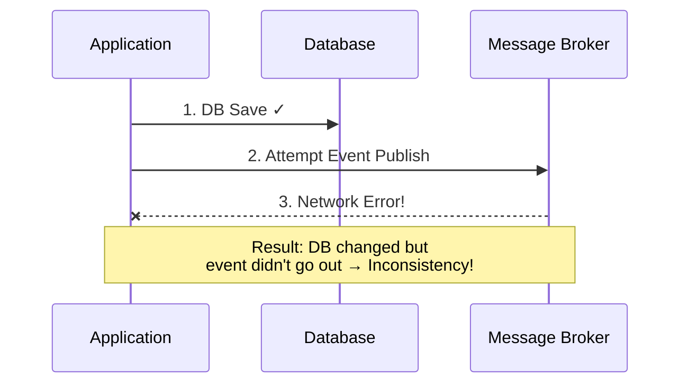
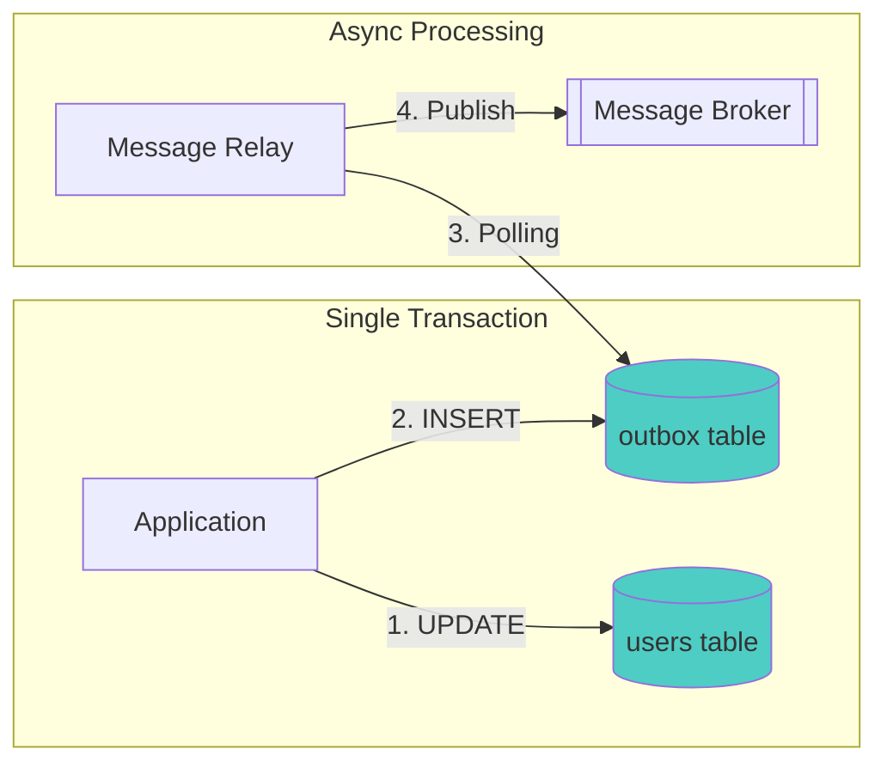
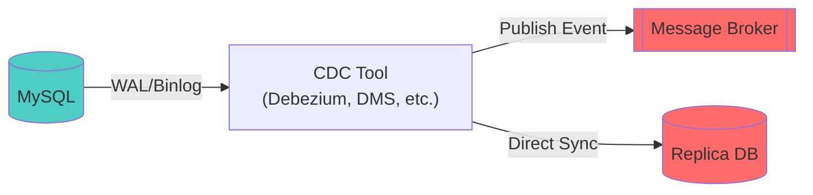
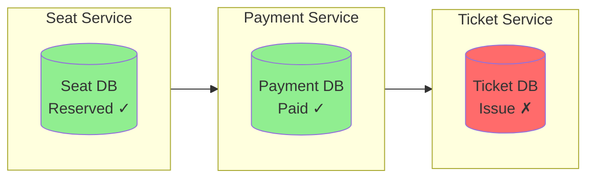
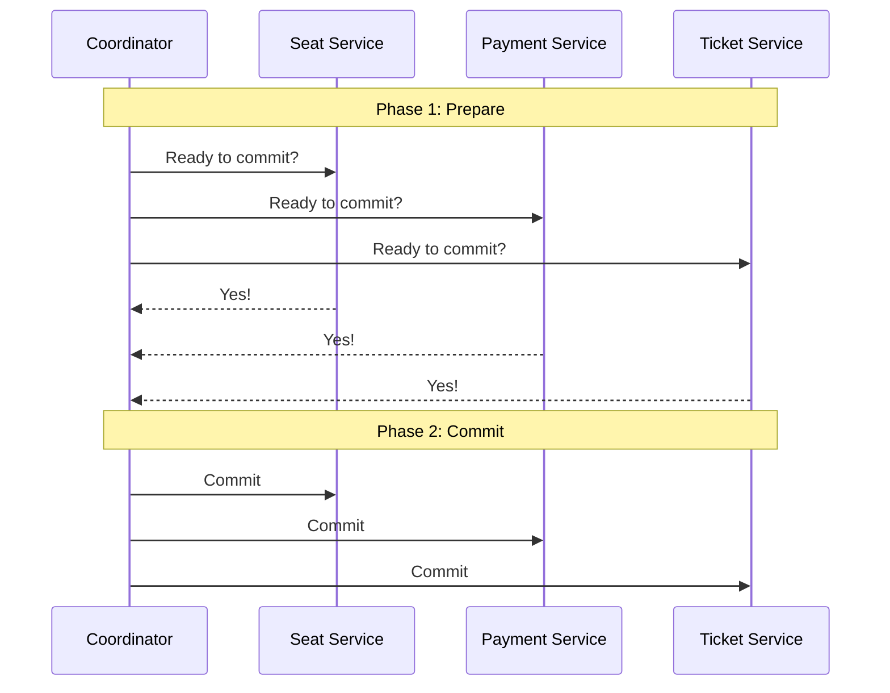
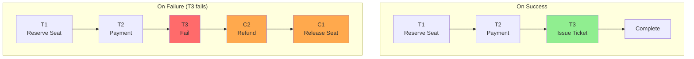
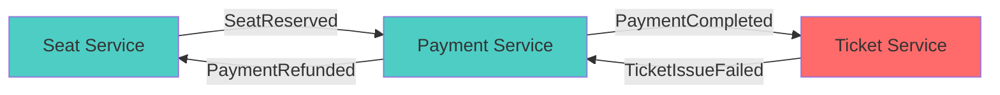
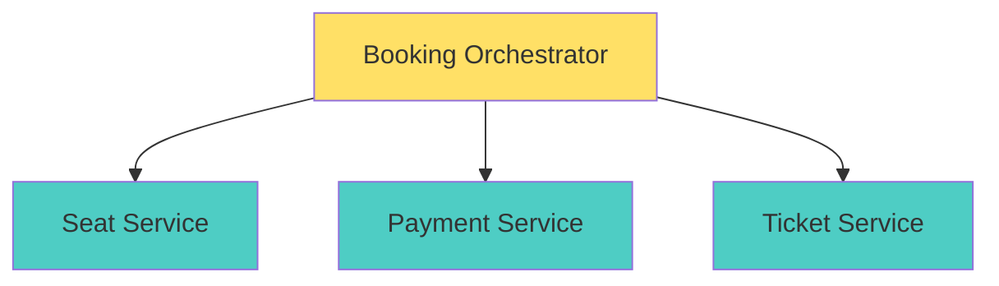

Previous: [[Reflections on MSA 5/7] How Should We Separate Data?]()

---

In the previous part, we explored why we should separate DBs in MSA environments and how to solve the JOIN problem after separation. There were two methods: API Composition and Data Replication.

But **choosing "data replication"** doesn't mean it's over. That's where other difficult problems begin.

In this part, I'll cover consistency problems that occur in event-based data synchronization. How to atomically handle DB saves and event publishing, what happens when event order gets mixed up, what to do when messages are lost or duplicated, and the Saga pattern as an alternative to distributed transactions.

## Data Replication: Synchronizing with Events

Let's assume we've chosen data replication. Now it's time to think about **how to synchronize**. As I mentioned earlier, synchronization is usually implemented on an event basis.

### Both DB Save and Event Publishing Must Succeed

Isn't the first thing that comes to mind this? "Save to DB, publish event, done"

```java
@Transactional
public void updateUser(UserUpdateRequest request) {
    // 1. Save to DB
    userRepository.save(user);

    // 2. Publish event
    eventPublisher.publish(new UserUpdatedEvent(user));
}
```

It looks intuitive and simple. But there's **one big problem** hidden here. What kind of problem? Let's imagine the following situation:



What happens if DB save succeeds but event publishing fails? Data has changed but other services don't know. The user's name changed but the old name remains in the Order Service's replica table.

The opposite situation is even more serious. What if the event was published but the DB transaction rolled back? Other services would reference **data that doesn't exist**.

You might think "then can't we just process them together in a transaction?", but DB transactions and message broker publishing are different systems so **they can't be wrapped in a single transaction**. This is the fundamental problem when processing DB saves and event publishing separately.

### Transactional Outbox Pattern

So how can we solve this problem? There's a proven method. It's the **Transactional Outbox Pattern**. The idea is surprisingly simple. **Save the event to DB first, publish later.**



In code, it looks like this:

```java
@Transactional
public void updateUser(UserUpdateRequest request) {
    // Both processed in same DB transaction!
    userRepository.save(user);
    outboxRepository.save(new OutboxEvent("UserUpdated", user.toJson()));
}
```

Along with saving user information, we save event information to a separate table called outbox. These two operations are processed in the same DB transaction, so **atomicity is guaranteed**.

If that transaction fails, both roll back; if it succeeds, both commit. So situations where DB save and event publishing are inconsistent don't occur.

```java
// Separate scheduler runs periodically
@Scheduled(fixedDelay = 1000)
public void publishPendingEvents() {
    List<OutboxEvent> events = outboxRepository.findPending();
    for (OutboxEvent event : events) {
        messagePublisher.publish(event);
        outboxRepository.markAsPublished(event.getId());
    }
}
```

Event publishing is handled by a separate scheduler. It polls the outbox table to find unpublished events and publishes them. If you manage publication status with a flag, even if publishing fails, it remains in outbox so you can retry on the next poll.

There are drawbacks too. There's delay equal to the polling interval, and you need to manage the outbox table. In particular, you need to periodically delete or archive published records—otherwise the outbox table keeps growing. But even considering this management overhead, I think it's much better than processing DB saves and event publishing separately in terms of guaranteeing data consistency.

### Change Data Capture (CDC)

There's a similar but different method. Using **Change Data Capture (CDC)**.

CDC is a technology that captures database changes and delivers them to other systems. Usually CDC reads the DB's change log directly to publish events or synchronize to other systems.

In this case, it can be used to publish events, or to directly synchronize to another service's replica table.



Tools like Debezium or AWS DMS read MySQL's Binlog or PostgreSQL's WAL to publish changes to a message broker or directly sync to another DB.

With this configuration, the advantage is **you don't need to do anything in application code**. Polling delay is reduced and all DB changes can be captured. **Just save to DB and changes are automatically propagated.**

The problem arises here. Infrastructure complexity increases. You need to operate CDC, configure it differently for each DB, and debugging is difficult when problems occur.

And what I think is even more painful is that **when the source table schema changes**, you need to update the CDC pipeline too. Tools like Debezium are sensitive to schema changes—DDL changes can alter event formats or break the pipeline entirely. It's essentially one more thing to manage.

Ultimately, both Transactional Outbox and CDC have trade-offs, so I think it's important to choose based on your team's situation.

From my experience, the higher the complexity, the more important the people operating it become. For small teams, Transactional Outbox might be more suitable; for large organizations with well-established infrastructure teams, CDC might be better.

Of course, a small team choosing MSA itself might be contradictory.

## Event-Based Data Consistency Problems

Now let's assume we've decided to synchronize data between different services in an MSA environment based on events, and that we've somehow agreed to guarantee atomicity of event publishing using Outbox or CDC.

"Then can we just develop and operate the service without any problems?" **Unfortunately, no.** Other problems can occur. These are other event-based data consistency problems.

In Part 3, I said "asynchronous doesn't mean there are no problems." Event-based data consistency problems are a prime example.

What problems can occur?

### Order Reversal

If you configure Outbox or CDC well, you can guarantee event **publishing** order according to DB commit order. But that's not the end. **The order consumers consume isn't guaranteed either.**

If multiple consumers process events in parallel, if messages are distributed across multiple partitions in the message broker, or if network delays or retries occur, the **consumption order** can be reversed.

Let me give an example. Let's say these events were published in order in a payment flow:

```
Publishing order: PaymentAttempted → PaymentApproved → PaymentCompleted
```

But because consumers are processing in parallel, this can happen:

```
Consumer A: Processes "PaymentCompleted" event first
Consumer B: Processes "PaymentAttempted" event later
→ Fails because there's no PaymentAttempted record at PaymentCompleted processing time!
```

A simpler example—state changes on the same entity are the same:

1. Change member name to "JeongJeongIl" (Event A)
2. Change member name to "JeongJeongE" (Event B)
3. Consumer processes Event B first, Event A later
4. Final result: "JeongJeongIl" (wrong!)

Originally "JeongJeongE" was the latest, but because **consumption order** was reversed, the old "JeongJeongIl" became the final value. Publishing was in order but consumption got mixed up. This is a surprisingly common problem in asynchronous systems.

#### Solution 1: Using Partition Keys

One way to solve this event ordering problem is to use the message broker's **partition key**.

If you're using Kafka, you can send events for the same user to the same partition to guarantee order.

```java
kafkaTemplate.send("user-events", user.getId().toString(), event);
// user.getId() is partition key → events for same user go to same partition
```

In Kafka, a partition is a unit for distributing data storage. A topic can have multiple partitions, and each partition stores and processes data independently.

The partition key **determines which partition through hashing**. Calculated as `hash(userId) % partitionCount`, so even with 50,000 users, if there are 10 partitions, they're distributed across 10 partitions.

```
Topic creation: user-events (10 partitions)

userId=123 → hash(123) % 10 = partition 3
userId=456 → hash(456) % 10 = partition 7
userId=789 → hash(789) % 10 = partition 3
userId=999 → hash(999) % 10 = partition 3
```

The key is **the same userId always goes to the same partition**. So order is guaranteed within the same partition, and events for the same user are processed in occurrence order.

#### Solution 2: Version-Based Optimistic Processing

Another method is using optimistic processing. It's similar to JPA's optimistic locking. Include a version or timestamp in the event and ignore old events.

```java
@EventListener
public void onUserUpdated(UserUpdatedEvent event) {
    UserReplica existing = userReplicaRepository.findById(event.getUserId());

    // If existing data is newer, ignore
    if (existing != null && existing.getVersion() >= event.getVersion()) {
        log.info("Ignoring old event: {}", event.getId());
        return;
    }

    userReplicaRepository.save(UserReplica.from(event));
}
```

This approach has the advantage of working with message brokers other than Kafka.

### What Should Events Contain?

But a question arises here. To solve order reversal with version-based approach, **the event content must have version information**. So what should events contain?

There are two main approaches to including data in events.

#### Fat Event

Including all necessary information in the event is called Fat Event. For example, if it's a user info change event, include all information like name, email, phone, address, etc.

```json
{
  "eventType": "UserUpdated",
  "userId": "example",
  "version": 5,
  "name": "JeongJeongIl",
  "email": "jeong@example.com",
  "phone": "010-1234-5678",
  "address": "Gangnam-gu, Seoul..."
}
```

The advantage is consumers can process immediately without API calls. Version information is included so order reversal can be solved. However, event size grows and when schema changes, all consumers are affected.

The consistency problem examples I gave earlier were explained assuming this Fat Event approach.

#### Thin Event and Zero Payload Pattern

Conversely, there's an approach where events contain only minimal information. Just publish ID and event type. This is called **Thin Event**.

```json
{
  "eventType": "UserUpdated",
  "userId": 123
}
```

Event size is small and flexible to schema changes. But a question arises here. **"If we only receive minimal information, how does the consumer get the rest of the data?"**

The answer is simpler than you think. **Call the API of the service that has the original data.** This approach of receiving Thin Events and querying data through APIs is called the **Zero Payload Pattern**.

```java
@EventListener
public void onUserUpdated(UserUpdatedEvent event) {
    // Event only has userId → query latest data via API
    UserDto latest = userServiceClient.getUser(event.getUserId());
    userReplicaRepository.save(UserReplica.from(latest));
}
```

The advantage of this approach is **order reversal is naturally solved.**

It doesn't matter what order events come in—the last event processed calls the API and queries the **latest data** at that point, so even if events A and B are reversed and processed as B then A, when A is processed, the API call gets the latest state. This naturally solves data consistency problems due to event ordering.

I think this is the core of **Eventual Consistency**.

Woowa Brothers, who operates the famous Baemin (Korean delivery service), also uses the Zero Payload pattern. I also learned about the Zero Payload approach from their video. If you're curious, please refer to [[WoowaCon2020] Baemin Microservices Journey](https://youtu.be/BnS6343GTkY?si=C03UBL_Sxll71g3J) and [Building Event-Based Architecture for Member System](https://techblog.woowahan.com/7835/).

### Eventual Consistency

So what is Eventual Consistency?

Eventual Consistency literally means "consistency is eventually achieved." It's a really important concept in MSA, so let me cover it in more detail.

#### Strong Consistency vs Eventual Consistency

In traditional single DB systems, **Strong Consistency** is usually guaranteed. When A changes data, B should see the changed value immediately after. When a transaction commits, all viewers immediately see the same data.

**Eventual Consistency** is different. The concept is "it might be different right now, but **eventually** everyone will be the same." Instead of allowing temporary inconsistency, you gain overall system scalability and availability.

From a developer's perspective, allowing data inconsistency might feel uncomfortable, but it's actually a concept commonly encountered in daily life.

Think about SNS 'like' counts—I clicked like, but it might not be reflected on my friend's screen yet. But after a moment and refresh, it's there. From the user's perspective, most don't even notice. YouTube view counts not being real-time accurate is for the same reason.

#### Why Does MSA Choose Eventual Consistency?

In distributed systems, situations arise where you have to choose between **Consistency** and **Availability**.

If you insist on Strong Consistency, the service stops when network problems occur. "Rather than break consistency, I'd rather not respond." On the other hand, if you choose Eventual Consistency, data might temporarily differ but the service keeps running.

In most businesses, "data being different for a moment" is probably less of a problem than "service stopping." So Eventual Consistency becomes a natural choice in MSA.

Like this, eventual consistency isn't a concept that happens automatically without developer effort. It's a concept developers must intentionally design and implement. This is especially true in event-based architectures.

The Zero Payload pattern is a case implementing this Eventual Consistency. A shift in thinking: "It's okay if event order gets mixed up, we'll fetch the latest data anyway."

However, there are trade-offs. Because an API is called for each event, API call load can occur, network dependency is created, and latency can increase due to synchronous API calls.

So if event volume is high or API service stability is uncertain, it can be a burden.

### So What Should We Do?

Summarizing methods to solve order reversal and event approaches:

| Approach | Advantages | Disadvantages |
|----------|-----------|---------------|
| Partition Key | Definite order guarantee | Kafka dependent, partition-level processing |
| Version-based (Fat Event) | Can process regardless of order, no API calls needed | Large event size, schema coupling |
| Zero Payload (Thin Event + API) | Always latest data, flexible schema, automatic order reversal resolution | API load, network dependency |

- **If goal is data replication with many events** → Fat Event + version-based
- **If notification-like and only latest state matters** → Zero Payload
- **If using Kafka with well-designed partitions** → Partition key for order guarantee

The general guidelines are above, but ultimately I think choosing based on service characteristics is important.

Adding my personal opinion, I think consistency is important either way. If our service decided to use Zero Payload, I think it's better for the entire service to sync data that way. It's like a kind of convention.

As I mentioned in Part 3, even in synchronous communication, I wrote that I think following an agreed-upon consistent approach for inter-service communication is important.

I think the same applies to data synchronization through events. If some places use Fat Event, some Zero Payload, some partition keys for order guarantee—all different—it becomes too complex and difficult to understand services and event tracking has to be different for each case.

Of course my opinion isn't the right answer, and if the company is huge with tons of services, enforcing consistency might be difficult. But if possible, I think adopting a consistent approach helps maintenance much more in the long run. In conclusion, my opinion is **"choose based on service characteristics but set certain standards and apply consistently."**

I ended up explaining event order reversal at length, but this isn't the end. Event-based data consistency problems don't stop here.

### Message Loss

Besides event ordering, **message loss** must also be considered.

There are three levels of message delivery guarantees:

| Delivery Guarantee | Description | Characteristics |
|--------------------|-------------|-----------------|
| At-most-once | At most once | Loss possible, no duplicates |
| At-least-once | At least once | No loss, duplicates possible |
| Exactly-once | Exactly once | No loss, no duplicates |

Exactly-once looks ideal, but I think guaranteeing this in distributed systems is **very difficult**. Since Kafka 0.11, Exactly-once semantics (EOS) is supported within Kafka through transactions, but end-to-end Exactly-once including external systems (DB, other message brokers, etc.) is still difficult. Perfectly guaranteeing "exactly once" in various situations like network errors, server restarts requires considerable complexity.

So I think **At-least-once** is suitable for most systems. **Because duplicates are better than loss.** Duplicates can be handled at the application level, but loss is hard to recover. You don't even know what events were lost.

### Duplicate Processing: Idempotency Is Essential

With At-least-once, duplicates can occur. So consumers must guarantee **idempotency**.

I talked about idempotency when covering Retry in Part 4, and it's the same concept in event processing. The result should be the same even if the same event comes multiple times. The solution is similar. Implement duplicate handling at the application level.

#### Method 1: Processing Completion Record

```java
@EventListener
public void onUserUpdated(UserUpdatedEvent event) {
    // Check if already processed
    if (processedEventRepository.existsByEventId(event.getId())) {
        log.info("Already processed event: {}", event.getId());
        return;
    }

    // Actual processing
    userReplicaRepository.save(UserReplica.from(event));

    // Record processing completion
    processedEventRepository.save(new ProcessedEvent(event.getId()));
}
```

#### Method 2: Using Upsert

```java
@EventListener
public void onUserUpdated(UserUpdatedEvent event) {
    // INSERT or UPDATE - same result even if executed multiple times
    userReplicaRepository.upsert(UserReplica.from(event));
}
```

If upsert is possible, this approach is simpler. Idempotency is guaranteed without a separate processing record table.

### When Processing Fails: Dead Letter Queue (DLQ)

But what if **processing itself keeps failing** even with guaranteed idempotency? It might not be a network problem—the data itself might be wrong, or the event might be unprocessable due to business logic.

For such cases, the **Dead Letter Queue (DLQ)** pattern is used. Messages that fail after a certain number of retries are sent to a separate DLQ for later manual processing or analysis.

```java
@KafkaListener(topics = "user-events")
public void consume(UserUpdatedEvent event) {
    try {
        processEvent(event);
    } catch (Exception e) {
        if (event.getRetryCount() >= MAX_RETRY) {
            // Move to DLQ
            dlqProducer.send("user-events-dlq", event);
            log.error("Moving to DLQ: {}", event.getId());
        } else {
            // To retry queue
            throw e; // Kafka auto-retries
        }
    }
}
```

Set up monitoring alerts for messages accumulated in DLQ, identify the cause, then manually reprocess or discard. This prevents situations where problematic messages keep retrying and block overall processing.

## Distributed Transactions: ACID Breaks

We're not done yet. An even harder problem remains. **Distributed transactions**.

I said earlier "transactions don't work"—let's look at why this is such a problem.

### Transactions in Shared DB

Let's think about concert booking again. In a shared DB environment, we could do this:

```java
@Transactional
public void bookConcert(BookingRequest request) {
    // 1. Reserve seat
    seatRepository.reserve(request.getSeatId());

    // 2. Process payment
    paymentRepository.process(request.getPayment());

    // 3. Issue ticket
    ticketRepository.issue(request.getUserId());

    // If any one fails, entire rollback!
}
```

ACID is guaranteed. If payment errors, seat reservation automatically rolls back. Developers don't need to worry separately. What a convenient world it was.

### Reality in MSA

But what happens when Seat Service, Payment Service, and Ticket Service each have their own DB?



Seat is reserved, payment is done, but no ticket. How do we rollback?

Payment has already been charged to the card company. Seat reservation is committed to Seat Service DB. Once each service commits to their DB, even knowing other services failed, **rollback isn't possible**.

This is why transactions are difficult in distributed systems.

### Limitations of 2PC (Two-Phase Commit)

You might think "can't we just use distributed transactions?" The traditional solution is **2PC (Two-Phase Commit)**.



The Coordinator asks all participants "ready?", and if everyone says "Yes", then instructs commit. Theoretically it can guarantee ACID.

But **it's rarely used in MSA as far as I know**. Why?

The Coordinator becomes a SPOF—if the Coordinator dies, the entire transaction stops. Also, all services have to hold locks and wait, so performance is poor. And all DBs must support 2PC, which makes **independent DB selection**—one of MSA's advantages—difficult.

Ultimately, 2PC compromises MSA's core values of **independence and scalability**. So we need other methods.

### CAP Theorem

Earlier I explained what **Eventual Consistency** is and why MSA chooses availability over consistency. Let me touch on its theoretical background, the **CAP theorem**.

Distributed systems have CAP theory:

- **C (Consistency)**: All nodes see the same data at the same time
- **A (Availability)**: Always returns a response even when failures occur
- **P (Partition Tolerance)**: System operates even when network is partitioned

The core of CAP theory is that in distributed systems, **all three cannot be satisfied simultaneously**.

But here, P (Partition Tolerance) essentially cannot be given up. Networks can disconnect anytime, and that's outside our control. So ultimately we must **choose between C and A**.

- **CP choice**: Maintain consistency, but reject some requests during network problems
- **AP choice**: Maintain availability, but data might temporarily differ

Most MSA systems **choose AP**. As explained earlier, in most businesses "service stopping" is more critical than "data being different for a moment." Choosing AP naturally leads to accepting Eventual Consistency.

So how do we systematically implement Eventual Consistency in MSA? The **Saga pattern**.

## Saga Pattern: Alternative to Distributed Transactions

### Basic Concept of Saga

Saga is a concept from a 1987 paper by Hector Garcia-Molina and Kenneth Salem. The core idea is:

> Split one long transaction into multiple local transactions,
> and on failure, undo with **compensating transactions**.



Each step (T1, T2, T3) is an independent local transaction. Each service commits to their DB. If T3 fails, execute **compensating transactions** C2 (refund) and C1 (release seat) to undo.

It's not making it "never happened" like a DB rollback, but **"doing new work to undo"**. Not rolling back created data to previous state, but performing new work to remove created data.

There are two ways to implement Saga. Choreography and Orchestration, which we covered in Part 3.

### Choreography Saga

Like the structure from Part 3, **connecting through events** without a central coordinator.



Each service publishes events, and other services individually react to those events.

```java
// Seat Service
@EventListener
public void onBookingRequested(BookingRequestedEvent event) {
    seatRepository.reserve(event.getSeatId());
    eventPublisher.publish(new SeatReservedEvent(...));
}

@EventListener
public void onPaymentRefunded(PaymentRefundedEvent event) {
    // Compensating transaction: cancel seat reservation
    seatRepository.release(event.getSeatId());
}
```

**Advantage** is loose coupling. Each service is independent, making it easy to add new services. **Disadvantage** is difficulty understanding the overall flow.

Events occur here and there, making it hard to know "where are we in the process?" and debugging is complex. As services grow, relationships between events can get tangled. Without good documentation, it's hard to know where and what compensating transactions occur.

This is really a big problem. Choreography works fine when services are few and flow is simple, but as services grow and business logic becomes complex, understanding and managing the flow becomes difficult.

### Orchestration Saga

A method where a central **Orchestrator manages the flow**.



The Orchestrator calls each service in order, and executes compensation logic on failure.

```java
@Service
public class BookingOrchestrator {

    public void processBooking(BookingRequest request) {
        try {
            // 1. Reserve seat
            SeatReservation seat = seatService.reserve(request.getSeatId());

            try {
                // 2. Payment
                Payment payment = paymentService.process(request.getPayment());

                try {
                    // 3. Issue ticket
                    ticketService.issue(request.getUserId(), seat.getId());
                } catch (Exception e) {
                    // Ticket failed → cancel payment
                    paymentService.refund(payment.getId());
                    throw e;
                }
            } catch (Exception e) {
                // Payment failed → release seat
                seatService.release(seat.getId());
                throw e;
            }
        } catch (Exception e) {
            throw new BookingFailedException(e);
        }
    }
}
```

**Advantage** is clear flow. Business logic is gathered in one place making it easy to understand, and error handling is relatively easy. **Disadvantage** is the Orchestrator can become a SPOF. Also, as logic concentrates in one place, the Orchestrator can keep growing.

### Compensating Transactions: There's No Perfect Rollback

I should point out something important here. **Compensating transactions are not perfect rollback.**

DB rollback makes it "never happened," but compensating transactions are **"new work to undo what already happened."** I think you can feel the difference.

Let me give an example. User attempted payment, seat is reserved inside payment, and ticket is issued when reservation completes—let's say ticket issuance failed.

What if email was already sent when payment completed, then ticket issuance failed? Payment and seat can be undone with compensating transactions, but email was already sent and can't be undone.

So when designing Saga, consider:

1. **Check if compensation is possible**: Not all work can be undone
2. **Define compensation logic at business level**: Business cancellation logic is needed, not technical rollback
3. **Put irreversible work last**: I think things like email sending should be done last.

Also monitoring is important. You should be able to track how far it progressed, what compensating transactions executed. That's how you can respond quickly in failure situations.

### Saga State Management

An easy-to-miss part when implementing Orchestration Saga is **Saga state storage**. The Orchestrator needs to know "how far we've progressed" for failure recovery to be possible.

```java
@Entity
public class BookingSaga {
    @Id
    private String sagaId;
    private SagaStatus status;  // STARTED, SEAT_RESERVED, PAYMENT_COMPLETED, COMPLETED, COMPENSATING, FAILED
    private String seatReservationId;
    private String paymentId;
    private LocalDateTime startedAt;
    private LocalDateTime completedAt;
}
```

If you save state as each Saga step completes, even if the Orchestrator restarts, it can resume from where it stopped or execute compensating transactions. This saved state is also used for failure analysis and monitoring.

One more thing to watch out for here. When the Orchestrator restarts and re-executes the same step, **each service call must also be idempotent**. For example, use an idempotency key (as I mentioned in Part 3) when calling the payment service so that calling it twice doesn't result in duplicate charges. That way, even if the Orchestrator retries, it can be handled safely.

### When to Choose What?

| Situation | Recommended | Reason |
|-----------|-------------|--------|
| Few services, simple flow | Choreography | Simple implementation without overhead |
| Many services, complex flow | Orchestration | Can see overall flow at a glance |
| Business logic focused | Orchestration | Logic gathered in one place, easy to manage |
| Loose coupling priority | Choreography | Minimize dependencies between services |

Personally, for complex business flows involving 3+ services, **Orchestration was much easier to manage.** Choreography looks clean at first, but as services grow, "where is the overall flow now?" often became hard to grasp.

Of course, you can mix both. Core business flow with Orchestration, supplementary event processing with Choreography.

But personally I lean toward "complex distributed transactions are better managed with Orchestration." That way you can respond quickly in failure situations, and understanding the overall flow is easier.

### When to Avoid Saga

But I should point out something important here. **I think Saga is not a silver bullet.** There seem to be many cases where Saga shouldn't be introduced.

1. **When real-time consistency is absolutely necessary**: In scenarios like bank transfers where "incorrect balance is a big problem," Eventual Consistency might not be appropriate. In such cases, I think reconsidering service boundaries or handling synchronously is better.

2. **When many operations can't be compensated**: As I mentioned, email sending, external API calls can't be undone. If many such operations are in the middle of the flow, I think it's hard to solve with Saga.

3. **When simple CRUD is forcibly distributed**: Honestly, the situation requiring Saga itself might be a signal asking "did we split services wrong?" If data needs transactions together, maybe it should have been in the same service.

4. **When the team lacks distributed systems experience**: I think Saga pattern is hard to debug, and matching data consistency in failure situations isn't easy. Introducing it when team capability isn't ready might actually increase failures.

## Summary

Here's a summary of what we covered in this part:

1. Use Transactional Outbox or CDC patterns to guarantee **atomicity of event publishing**.
2. In **event synchronization**, consider order reversal, message loss, and duplicate processing.
3. **Order reversal** can be solved with partition keys, version-based, or Zero Payload patterns.
4. Accepting **Eventual Consistency** is a natural choice in MSA.
5. **Instead of distributed transactions**, implement compensating transactions with the Saga pattern.
6. **Saga is not a silver bullet.** When real-time consistency is needed or compensation is difficult, reconsider service boundaries.

There were really many problems, and organizing them resulted in a lot of content. It wasn't easy. I think it wasn't easy for you reading this either.

Ultimately, **the point is that event-based data consistency is not free.** As you work with MSA, you gradually come to realize how powerful the transactions we took for granted in monolithic were.

Giving up ACID guarantees that RDBs developed over decades and trying to implement them at the application level—it's bound to be difficult.

## In the Next Part

Over 6 parts so far, we've explored various aspects of MSA. How to divide services, how to communicate, how to respond to failures, how to separate data and maintain consistency. As those reading this probably feel too, it's been a really challenging journey.

But at this point, a question might arise. "Is our service big enough to justify all this complexity?" Companies that pioneered MSA chose MSA out of necessity to handle enormous traffic and complex business. But is that true for the services we operate?

In the final part, I'll write my thoughts on this question.

---

## References

### Event Synchronization

- [Transactional Outbox Pattern](https://microservices.io/patterns/data/transactional-outbox.html)
- [Debezium - Change Data Capture](https://debezium.io/)

### Saga Pattern

- [Microservices.io - Saga](https://microservices.io/patterns/data/saga.html)
- Hector Garcia-Molina, Kenneth Salem - *Sagas* (1987)

### CAP Theorem and Distributed Systems

- Eric Brewer - *CAP Twelve Years Later* (2012)
- Martin Kleppmann - *Designing Data-Intensive Applications* (O'Reilly, 2017)

### Reference Videos and Articles

- [[WoowaCon2020] Baemin Microservices Journey](https://youtu.be/BnS6343GTkY?si=C03UBL_Sxll71g3J)
- [Building Event-Based Architecture for Member System](https://techblog.woowahan.com/7835/)
