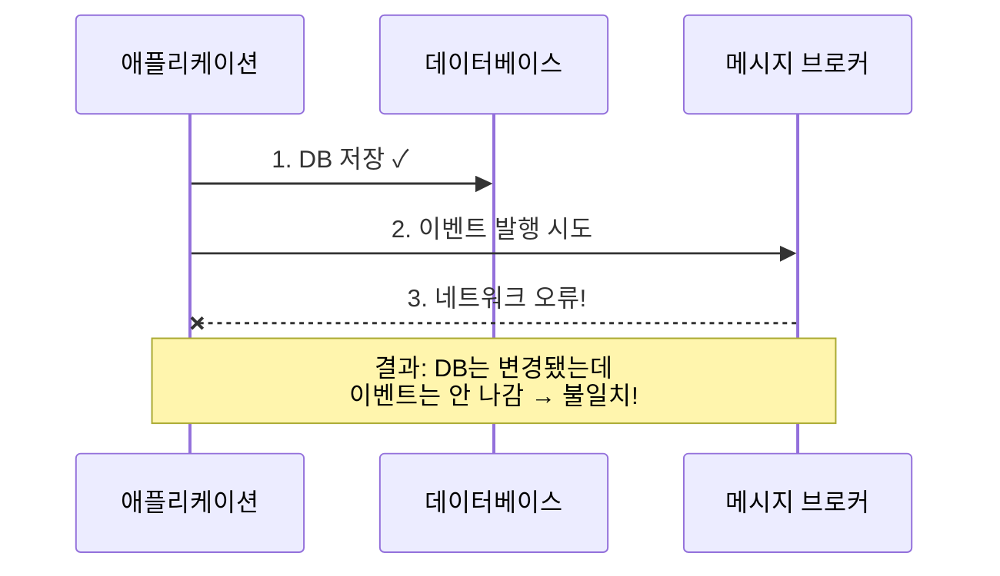
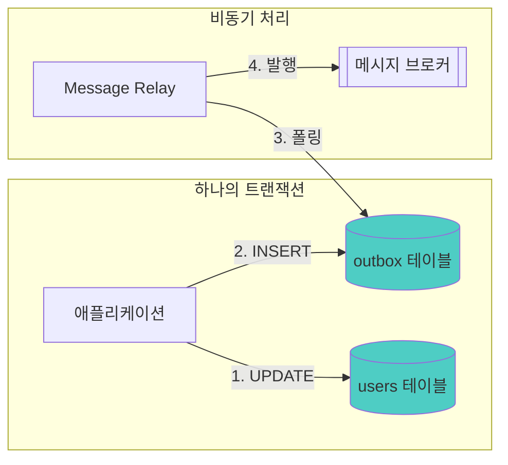
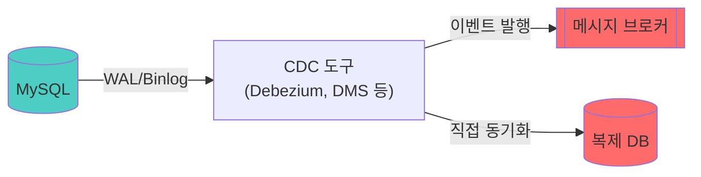
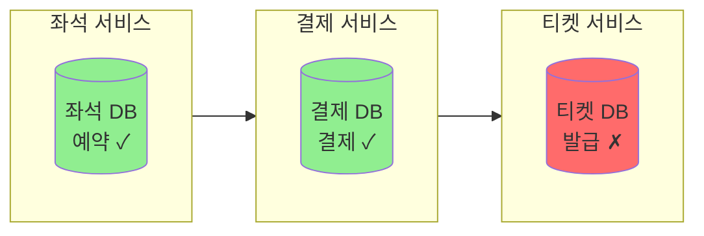
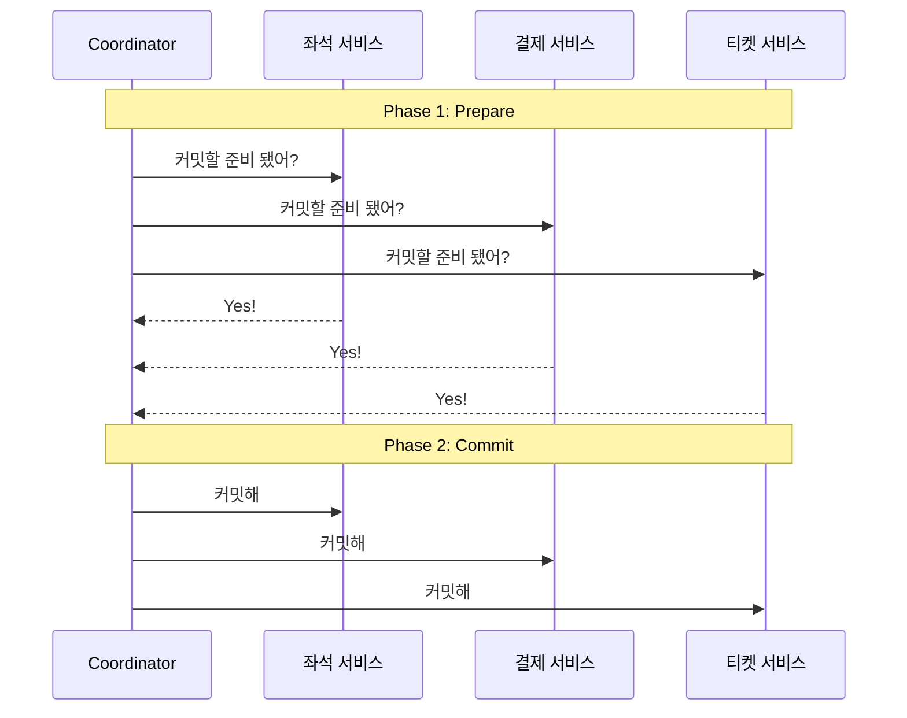
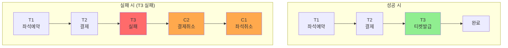
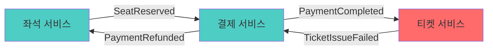
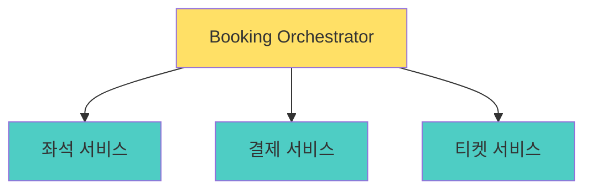

전편: [[MSA에 관한 고찰 5/7편] 데이터는 어떻게 분리해야 하는가]()

---

저번 편에서 저희는 MSA 환경에서 DB를 왜 분리해야 하는지, 그리고 분리했을 때 JOIN이 안 되는 문제를 어떻게 해결하는지 살펴봤습니다. API Composition과 데이터 복제라는 두 가지 방법이 있었죠.

그런데 **"데이터 복제 방법을 선택했다"** 고 해서 끝이 아닙니다. 여기서부터 또 다른 어려운 문제들이 시작됩니다.

이번 편에서는 이벤트 기반 데이터 동기화에서 발생하는 정합성 문제들을 다뤄보겠습니다. DB 저장과 이벤트 발행을 어떻게 원자적으로 처리할지, 이벤트 순서가 꼬이면 어떻게 되는지, 메시지가 유실되거나 중복되면 어떻게 해야 하는지, 그리고 분산 트랜잭션의 대안인 Saga 패턴까지 이야기 해보겠습니다.

## 데이터 복제: 이벤트로 동기화하기

자 그렇다면 데이터 복제를 선택했다고 가정해보겠습니다. 이제 **어떻게 동기화할지**를 생각해야할 차례입니다. 앞서 설명드렸듯이 보통은 이벤트 기반으로 동기화를 구현하게 됩니다.

### DB 저장과 이벤트 발행, 둘 다 성공해야 한다

가장 먼저 떠오르는 방법은 이거 아닐까요? "DB에 저장하고, 이벤트도 발행하면 끝"

```java
@Transactional
public void updateUser(UserUpdateRequest request) {
    // 1. DB에 저장
    userRepository.save(user);

    // 2. 이벤트 발행
    eventPublisher.publish(new UserUpdatedEvent(user));
}
```

직관적이고 간단해 보입니다. 하지만 여기에 **한가지 큰 문제**가 숨어 있습니다. 어떤 문제일까요? 다음과 같은 상황을 상상해보겠습니다.



DB 저장은 성공했는데 이벤트 발행이 실패하면 어떻게 될까요? 데이터는 변경됐는데 다른 서비스는 모르는 상태가 됩니다. 회원 이름이 바뀌었는데 주문 서비스의 복제 테이블에는 옛날 이름이 그대로 남아있는 거죠.

반대 상황은 조금 더 심각합니다. 이벤트는 발행됐는데 DB 트랜잭션이 롤백되면? 다른 서비스는 **존재하지 않는 데이터**를 참조하게 됩니다.

"그럼 트랜잭션 안에서 같이 처리하면 되지 않나?"라고 생각하실 수도 있는데, DB 트랜잭션과 메시지 브로커 발행은 서로 다른 시스템이라 **하나의 트랜잭션으로 묶을 수가 없습니다.** 이게 DB 저장과 이벤트 발행을 따로 처리할 때 발생하는 근본적인 문제입니다.

### Transactional Outbox 패턴

그렇다면 이 문제를 어떻게 해결할 수 있을까요? 검증된 방법이 있습니다. 바로 **Transactional Outbox 패턴**입니다. 아이디어는 의외로 간단합니다. **이벤트를 DB에 먼저 저장하고, 나중에 발행한다.**



코드로 보면 이렇습니다.

```java
@Transactional
public void updateUser(UserUpdateRequest request) {
    // 같은 DB 트랜잭션에서 둘 다 처리!
    userRepository.save(user);
    outboxRepository.save(new OutboxEvent("UserUpdated", user.toJson()));
}
```

유저 정보를 저장하는 것과 함께, outbox라는 별도의 테이블에 이벤트 정보를 저장합니다. 이 두 작업은 같은 DB 트랜잭션 안에서 처리되기 때문에 **원자성이 보장**됩니다.

만약 해당 트랜잭션에서 실패하면 둘 다 롤백되고, 성공하면 둘 다 커밋됩니다. 그래서 DB 저장과 이벤트 발행이 불일치하는 상황이 발생하지 않습니다.

```java
// 별도 스케줄러가 주기적으로 실행
@Scheduled(fixedDelay = 1000)
public void publishPendingEvents() {
    List<OutboxEvent> events = outboxRepository.findPending();
    for (OutboxEvent event : events) {
        messagePublisher.publish(event);
        outboxRepository.markAsPublished(event.getId());
    }
}
```

이벤트 발행은 별도의 스케줄러가 담당하게 합니다. outbox 테이블을 폴링해서 아직 발행 안 된 이벤트를 찾아서 발행하는 거죠. Flag를 사용해 발행 여부를 관리하면 발행이 실패해도 outbox에 남아있으니 다음 폴링 때 다시 시도할 수 있습니다.

단점도 있습니다. 폴링 주기만큼 지연이 발생하고, outbox 테이블을 관리해야 한다는 점이죠. 특히 발행 완료된 레코드를 주기적으로 삭제하거나 아카이빙하는 작업도 필요합니다. 안 그러면 outbox 테이블이 계속 커지거든요. 하지만 이런 관리 부담을 감안하더라도 데이터 일관성을 보장한다는 점에서 개별적으로 DB 저장과 이벤트 발행을 처리하는 것보다 훨씬 낫다고 생각합니다.

### Change Data Capture (CDC)

비슷하지만 다른 방법도 있습니다. 바로 **Change Data Capture (CDC)** 를 사용하는 방법인데

CDC란 데이터베이스의 변경 사항을 캡처해서 다른 시스템으로 전달하는 기술입니다. 보통 CDC는 DB의 변경 로그를 직접 읽어서 이벤트를 발행하거나 다른 시스템에 동기화하는 데 사용됩니다.

이번 경우에는 이벤트를 발행하는 데 사용할 수도 있고, 직접 다른 서비스의 복제 테이블로 동기화하는 데 사용할 수도 있습니다.



MySQL의 Binlog나 PostgreSQL의 WAL을 Debezium이나 AWS DMS 같은 도구가 읽어서, 변경 사항을 메시지 브로커로 발행하거나 다른 DB에 직접 동기화할 수 있습니다.

이렇게 구성하게 되면 장점은 **애플리케이션 코드에서는 아무것도 안 해도 됩니다.** 폴링 지연도 줄어들게 되고 모든 DB 변경을 캡처할 수 있습니다. **그냥 DB에 저장만 하면 알아서 변경이 전파되는 거죠.**

문제는 여기서 발생합니다. 이로 인해 인프라 복잡도가 증가한다는 점입니다. CDC를 운영해야 하고, DB마다 설정을 다르게 해줘야하며, 문제가 생기면 디버깅이 어렵습니다. 

그리고 더 골치 아픈 건 **원본 테이블 스키마가 변경될 때** CDC 파이프라인도 함께 수정해야 한다는 점이라고 생각합니다. Debezium 같은 도구도 스키마 변경에 민감해서, DDL 변경 시 이벤트 포맷이 바뀌거나 파이프라인이 깨지는 경우가 있거든요. 관리 포인트가 하나 더 늘어나는 셈이죠.

결국은 Transactional Outbox와 CDC 모두 트레이드 오프가 존재하니 팀의 상황에 맞게 선택하는 게 중요하다고 생각합니다.

다만 제 경험상으로는 복잡도가 높을수록 운영하는 인력이 더 중요해지더라구요. 작은 팀에서는 Transactional Outbox가 더 적합할 수 있고, 인프라 운영팀이 잘 갖춰진 큰 조직에서는 CDC가 더 나을 수도 있다고 생각합니다.

물론 작은 팀이 MSA를 선택한 것 자체가 모순일 수도 있지만요.

## 이벤트 기반 데이터 정합성 문제

이제 저희가 MSA 환경에서 서로 다른 서비스간의 데이터 조회 문제를 이벤트를 기반으로 동기화하기로 결정했고 이벤트 발행의 원자성 문제도 인지하고 있어 여러분과 제가 어떻게 어떻게 잘 협의하여 Outbox나 CDC로 이벤트 발행의 원자성은 보장했다고 가정하겠습니다.

"그렇다면 아무 문제 없이 이제 개발만 하고 서비스를 운영하면 될까요?" **정말 아쉽게도 그렇지 않습니다.** 다른 문제가 발생할 수 있거든요. 바로 또 다른 이벤트 기반 데이터 정합성 문제입니다.

3편에서 "비동기라고 문제가 없는 건 아니다"라고 했었는데요. 이벤트 기반 데이터 정합성 문제가 대표적으로 그렇습니다.

어떤 문제가 발생할 수 있을까요?

### 순서 역전

Outbox나 CDC를 잘 구성하면 DB 커밋 순서대로 이벤트 **발행** 순서를 보장할 수 있습니다. 하지만 여기서 끝이 아닙니다. **Consumer가 소비하는 순서까지 보장되는 건 아니거든요.**

여러 Consumer가 병렬로 이벤트를 처리하거나, 메시지 브로커에서 여러 파티션에 분산되거나, 네트워크 지연이나 재시도가 발생하면 **소비 순서**가 뒤바뀔 수 있습니다.

예를 들어보겠습니다. 결제 흐름에서 이런 이벤트들이 순서대로 발행됐다고 가정해보죠.

```
발행 순서: 결제시도 → 결제승인 → 결제완료
```

그런데 Consumer들이 병렬로 처리하다 보니 이런 일이 생길 수 있습니다.

```
Consumer A: "결제완료" 이벤트를 먼저 처리
Consumer B: "결제시도" 이벤트를 나중에 처리
→ 결제완료 처리 시점에 결제시도 기록이 없어서 실패!
```

더 단순한 예시로, 같은 엔티티의 상태 변경도 마찬가지입니다.

1. 회원 이름을 "정정일"로 변경 (이벤트 A)
2. 회원 이름을 "정정이"로 변경 (이벤트 B)
3. Consumer가 이벤트 B를 먼저 처리, 이벤트 A를 나중에 처리
4. 최종 결과: "정정일" (잘못됨!)

원래는 "정정이"가 최신인데, **소비 순서**가 뒤바뀌어서 오래된 "정정일"이 최종 값이 되어버렸습니다. 발행은 순서대로 됐는데 소비에서 꼬인 거죠. 비동기 시스템에서는 의외로 자주 발생하는 문제입니다.

#### 해결 방법 1: 파티션 키 활용

이런 이벤트 순서 문제를 해결하는 방법 중 하나는 메시지 브로커의 **파티션 키**를 활용하는 것입니다.

Kafka를 쓴다면, 같은 회원의 이벤트는 같은 파티션으로 보내서 순서를 보장할 수 있습니다.

```java
kafkaTemplate.send("user-events", user.getId().toString(), event);
// user.getId()가 파티션 키 → 같은 유저의 이벤트는 같은 파티션
```

Kafka에서 파티션은 데이터를 분산 저장하는 단위입니다. 한 토픽에 여러 파티션이 있을 수 있는데, 각 파티션은 독립적으로 데이터를 저장하고 처리합니다.

파티션 키는 **해시를 통해 어느 파티션에 들어갈지**를 결정합니다. `hash(userId) % 파티션수`로 계산되기 때문에 유저가 5만 명이어도 파티션이 10개라면 10개의 파티션에 분산되는 거죠.

```
토픽 생성: user-events (파티션 10개)

userId=123 → hash(123) % 10 = 3번 파티션
userId=456 → hash(456) % 10 = 7번 파티션
userId=789 → hash(789) % 10 = 3번 파티션
userId=999 → hash(999) % 10 = 3번 파티션
```

핵심은 **같은 userId는 항상 같은 파티션에 들어간다**는 점입니다. 그래서 같은 파티션 내에서는 순서가 보장되니까, 같은 회원에 대한 이벤트는 발생 순서대로 처리됩니다.

#### 해결 방법 2: 버전 기반 낙관적 처리

또 다른 방법으로는 낙관적 처리 방식을 사용하는 것입니다. JPA의 낙관적 락과 비슷한 개념인데요. 이벤트에 버전이나 타임스탬프를 포함시키고, 오래된 이벤트는 무시하는 방식이 있습니다.

```java
@EventListener
public void onUserUpdated(UserUpdatedEvent event) {
    UserReplica existing = userReplicaRepository.findById(event.getUserId());

    // 기존 데이터가 더 최신이면 무시
    if (existing != null && existing.getVersion() >= event.getVersion()) {
        log.info("오래된 이벤트 무시: {}", event.getId());
        return;
    }

    userReplicaRepository.save(UserReplica.from(event));
}
```

이 방식은 Kafka가 아닌 다른 메시지 브로커를 쓸 때도 적용할 수 있다는 장점이 있습니다.

### 이벤트에는 어떤 내용을 담아야 할까?

그런데 여기서 한 가지 의문이 생깁니다. 버전 기반으로 순서 역전을 해결하려면 **이벤트 내용에 버전 정보에 대한 데이터가 있어야**합니다. 그렇다면 이벤트에는 어떤 내용까지 담아야 할까요?

이벤트에 데이터를 담는 방식에는 크게 두 가지 방식이 있습니다.

#### Fat Event

필요한 모든 정보를 이벤트에 담아 발행하는 방식을 Fat Event라고 합니다. 예를 들어 회원 정보 변경 이벤트라면, 변경된 회원의 이름, 이메일, 전화번호, 주소 등 모든 정보를 이벤트에 담는 거죠.

```json
{
  "eventType": "UserUpdated",
  "userId": "example",
  "version": 5,
  "name": "정정일",
  "email": "jeong@example.com",
  "phone": "010-1234-5678",
  "address": "서울시 강남구..."
}
```

Consumer가 API 호출 없이 바로 처리할 수 있다는 장점이 있습니다. 버전 정보도 포함되어 있으니 순서 역전 문제도 해결할 수 있고요. 다만 이벤트 크기가 커지고, 스키마가 변경되면 모든 Consumer가 영향을 받는다는 단점이 있습니다.

기존에 정합성 문제의 예시들은 이 Fat Event 방식을 쓴다는 가정하에 설명드린 것입니다.

#### Thin Event와 Zero Payload 패턴

반대로 이벤트에는 최소한의 정보만 담는 방식도 있습니다. ID와 이벤트 타입 정도만 담아서 발행하는 거죠. 이런 방식을 **Thin Event**라고 합니다.

```json
{
  "eventType": "UserUpdated",
  "userId": 123
}
```

이렇게 되면 이벤트 크기가 작고 스키마 변경에 유연하게 됩니다. 그런데 여기서 의문이 생깁니다. **"이렇게 최소한의 정보만 받으면, Consumer는 나머지 데이터를 어떻게 가져오지?"**

답은 생각보다 간단합니다. 해당 원본 데이터를 가지고있는 서비스의 **API를 호출해서 가져오면 됩니다.** 이렇게 Thin Event를 받고 API를 통해 데이터를 조회하는 방식을 **Zero Payload 패턴**이라고 합니다.

```java
@EventListener
public void onUserUpdated(UserUpdatedEvent event) {
    // 이벤트에는 userId만 있음 → API로 최신 데이터 조회
    UserDto latest = userServiceClient.getUser(event.getUserId());
    userReplicaRepository.save(UserReplica.from(latest));
}
```

이 방식의 장점은 **순서 역전 문제가 자연스럽게 해결됩니다.**

이벤트가 어떤 순서로 오든 상관 없어 어차피 마지막에 처리되는 이벤트가 API를 호출하면 그 시점의 **최신 데이터**를 조회해오기 때문에 이벤트 A, B가 순서가 바뀌어서 B, A 순으로 처리되더라도, 결국 A를 처리할 때 API를 호출하면 최신 상태를 가져오게 됩니다. 이 덕분에 자연스레 이벤트 순서로 인한 데이터 정합성 문제가 해결되는 거죠.

이게 바로 **최종적 일관성(Eventual Consistency)** 의 핵심이라고 볼 수 있다고 생각합니다.

저희에게 유명한 배달의 민족을 서비스하는 우아한 형제들 역시 Zero Payload 패턴을 활용하고 있다고 합니다. 저 역시 해당 영상을 보고 Zero Payload 방식을 접하게 됐습니다. 궁금하신 분들은 [[우아콘2020] 배달의민족 마이크로서비스 여행기](https://youtu.be/BnS6343GTkY?si=C03UBL_Sxll71g3J)과 [회원시스템 이벤트기반 아키텍처 구축하기](https://techblog.woowahan.com/7835/)을 참고해주세요.

### 최종적 일관성(Eventual Consistency)

그렇다면 최종적 일관성은 뭘까요?

최종적 일관성이란 말 그대로 "결국에는 일관성이 맞아진다"는 뜻입니다. MSA에서 정말 중요한 개념이라 조금 더 자세히 다뤄보겠습니다.

#### Strong Consistency vs Eventual Consistency

전통적인 단일 DB 시스템에서는 보통 **Strong Consistency(강한 일관성)** 를 보장합니다. A가 데이터를 바꾸면, 그 직후 B가 조회했을 때 바뀐 값을 봐야 하죠. 트랜잭션이 커밋되면 모든 조회자가 즉시 같은 데이터를 보는 겁니다.

반면 **Eventual Consistency**는 다릅니다. "지금 당장은 다를 수 있지만, **결국에는** 모두 같아진다"는 개념이에요. 일시적인 불일치를 허용하는 대신, 시스템 전체의 확장성과 가용성을 얻는 선택입니다.

개발자 입장에서 데이터 정합성이 틀어지는 걸 허용하는 게 불안할 수 있지만, 생각보다 일상에서 흔히 접하는 개념입니다.

SNS의 '좋아요' 수를 생각해보면 제가 좋아요를 눌렀는데, 친구 화면에서는 아직 반영이 안 됐을 수 있습니다. 하지만 잠시 후 새로고침하면 반영되어 있죠. 사용자 입장에서는 대부분 인지하지도 못합니다. YouTube 조회수가 실시간으로 정확하지 않은 것도 같은 이유입니다.

#### 왜 MSA에서는 Eventual Consistency를 선택할까?

분산 시스템에서는 **일관성(Consistency)** 과 **가용성(Availability)** 사이에서 선택을 해야 하는 상황이 생깁니다.

Strong Consistency를 고집하면, 네트워크 문제가 생겼을 때 서비스가 멈추게 됩니다. "일관성이 깨질 바에야 차라리 응답을 안 하겠다"는 거죠. 반면 Eventual Consistency를 선택하면, 일시적으로 데이터가 다를 수 있지만 서비스는 계속 동작합니다.

대부분의 비즈니스에서 "잠깐 데이터가 다른 것"보다 "서비스가 멈추는 것"이 더 큰 문제일 가능성이 높습니다. 그래서 MSA에서는 Eventual Consistency가 자연스러운 선택이 되는 거죠.

이 처럼 최종적 일관성은 개발자가 별다른 작업을 하지 않아도 알아서 되는 개념은 아닙니다. 개발자가 의도적으로 설계하고 구현해야 하는 개념이죠. 이벤트 기반 아키텍처에서는 특히 더 그렇습니다.

Zero Payload 패턴은 이 Eventual Consistency를 구현한 케이스입니다. "이벤트 순서가 꼬여도 괜찮아, 어차피 최신 데이터를 가져올 거니까"라는 발상의 전환이죠.

다만 trade-off가 있습니다. 이벤트마다 API를 호출하기 때문에 API 호출 부하가 발생할 수 있고, 네트워크 의존성이 생기며, 동기 API 호출로 인해 지연 시간이 늘어날 수 있습니다.

그래서 이벤트 발생량이 많거나 API 서비스 안정성이 불안하다면 부담이 될 수 있습니다.

### 그래서 어떻게 해야 할까?

결국 순서 역전 문제를 해결하는 방법과 이벤트 방식을 정리하면 이렇습니다.

| 방식 | 장점 | 단점 |
|-----|------|------|
| 파티션 키 | 순서 보장 확실 | Kafka 의존, 파티션 단위 처리 |
| 버전 기반 (Fat Event) | 순서 무관하게 처리 가능, API 호출 불필요 | 이벤트 크기 큼, 스키마 결합 |
| Zero Payload (Thin Event + API) | 항상 최신 데이터, 스키마 유연, 순서 역전 자동 해결 | API 부하, 네트워크 의존 |

- **데이터 복제가 목적이고 이벤트 많으면** → Fat Event + 버전 기반
- **알림 성격이고 최신 상태만 중요하면** → Zero Payload
- **Kafka 쓰고 파티션 설계가 잘 되어 있으면** → 파티션 키로 순서 보장

일반적인 가이드라인은 위와 같지만, 결국에는 서비스 특성에 맞게 선택하는 게 중요하다고 생각합니다.

다만 제 개인적인 생각을 덧붙이자면, 저는 어느쪽이건 일관성이 중요하다고 생각합니다. 우리 서비스는 Zero Payload 방식으로 하기로 했다면 전체 서비스가 해당 방식으로 데이터를 동기화하는게 낫지 않나 싶습니다. 일종의 컨벤션 같은 거죠.

3편에서도 언급했지만 동기 통신에서도 저는 서비스간 통신에서 어떤 방식이 됐건 팀과 합의된 일관된 방식을 따르는 게 중요하다고 생각한다고 적었습니다.

이 이벤트를 통한 데이터 동기화에서도 마찬가지라고 생각합니다. 어디는 Fat Event, 어디는 Zero Payload, 어디는 파티션 키로 순서 보장 이렇게 제각각이면 서비스 파악도 어려워지고 이벤트 추적도 케이스마다 달리해야하니 너무 복잡하고 어려워 지는 것 같습니다.

물론 제 생각이 정답도 아니고, 회사가 너무 커 서비스가 엄청난데 무조건 일관성을 강제하기도 어려울 수 있습니다. 하지만 가능하다면 일관된 방식을 채택하는게 장기적으로 유지보수에 훨씬 도움이 된다고 생각합니다. 결론은 서비스 특성에 맞게 선택하되 **"일정 기준을 정하고 일관되게 적용하는게 좋을 것 같다"** 가 제 의견입니다.

어쩌다 보니 이벤트 순서 역전 문제에 대해 길게 설명드렸는데, 이게 끝이 아닙니다. 이벤트 기반 데이터 정합성 문제는 여기서 그치지 않습니다.

### 메시지 유실

이벤트 순서 문제 외에도 **메시지가 유실되는 경우**도 고려해야 합니다.

메시지 전달 보장 수준에는 세 가지가 있습니다.

| 전달 보장 수준 | 설명 | 특징 |
|--------------|------|------|
| At-most-once | 최대 한 번 | 유실 가능, 중복 없음 |
| At-least-once | 최소 한 번 | 유실 없음, 중복 가능 |
| Exactly-once | 정확히 한 번 | 유실 없음, 중복 없음 |

Exactly-once가 이상적으로 보이지만, 분산 시스템에서 이걸 보장하기는 **매우 어렵다고 생각합니다.** Kafka 0.11부터 트랜잭션 기능을 통해 Kafka 내부에서는 Exactly-once semantics(EOS)를 지원하지만, 외부 시스템(DB, 다른 메시지 브로커 등)까지 포함한 end-to-end Exactly-once는 여전히 어렵습니다. 네트워크 오류, 서버 재시작 등 다양한 상황에서 "정확히 한 번"을 완벽히 보장하려면 상당한 복잡도가 필요합니다.

그래서 대부분의 시스템은 **At-least-once**가 적합하다고 봅니다. **유실보다 중복이 낫기 때문**이죠. 중복은 어플리케이션 레벨에서 처리할 수 있지만, 유실은 복구하기 어렵습니다. 잃어버린 이벤트가 뭔지도 모르니까요.

### 중복 처리: 멱등성이 필수

At-least-once면 중복이 발생할 수 있습니다. 그래서 Consumer 측에서 **멱등성**을 보장해야 합니다.

4편에서 Retry를 다룰 때 멱등성 이야기를 했었는데, 이벤트 처리에서도 동일한 개념입니다. 같은 이벤트가 여러 번 와도 결과가 같아야 하죠. 해결방법 역시 비슷합니다. 어플리케이션 레벨에서 중복 처리를 구현해야 합니다.

#### 방법 1: 처리 완료 기록

```java
@EventListener
public void onUserUpdated(UserUpdatedEvent event) {
    // 이미 처리한 이벤트인지 확인
    if (processedEventRepository.existsByEventId(event.getId())) {
        log.info("이미 처리된 이벤트: {}", event.getId());
        return;
    }

    // 실제 처리
    userReplicaRepository.save(UserReplica.from(event));

    // 처리 완료 기록
    processedEventRepository.save(new ProcessedEvent(event.getId()));
}
```

#### 방법 2: Upsert 활용

```java
@EventListener
public void onUserUpdated(UserUpdatedEvent event) {
    // INSERT or UPDATE - 여러 번 실행해도 결과가 같음
    userReplicaRepository.upsert(UserReplica.from(event));
}
```

Upsert가 가능한 상황이라면 이 방식이 더 간단합니다. 별도의 처리 기록 테이블 없이도 멱등성이 보장되니까요.

### 처리 실패 시: Dead Letter Queue (DLQ)

그런데 멱등성을 보장해도 **처리 자체가 계속 실패하는 경우**는 어떻게 할까요? 네트워크 문제가 아니라 데이터 자체가 잘못됐거나, 비즈니스 로직상 처리할 수 없는 이벤트일 수 있습니다.

이런 경우를 위해 **Dead Letter Queue (DLQ)** 패턴을 사용합니다. 일정 횟수 이상 재시도해도 실패하는 메시지는 별도의 DLQ로 보내서 나중에 수동으로 처리하거나 분석하는 거죠.

```java
@KafkaListener(topics = "user-events")
public void consume(UserUpdatedEvent event) {
    try {
        processEvent(event);
    } catch (Exception e) {
        if (event.getRetryCount() >= MAX_RETRY) {
            // DLQ로 이동
            dlqProducer.send("user-events-dlq", event);
            log.error("DLQ로 이동: {}", event.getId());
        } else {
            // 재시도 큐로
            throw e; // Kafka가 자동 재시도
        }
    }
}
```

DLQ에 쌓인 메시지는 모니터링 알림을 설정해두고, 원인을 파악한 후 수동으로 재처리하거나 폐기합니다. 이렇게 하면 문제 있는 메시지가 계속 재시도되면서 전체 처리를 막는 상황을 방지할 수 있습니다.

## 분산 트랜잭션: ACID가 깨진다

아직 끝나지 않았습니다. 더욱 어려운 문제가 남아있죠. 바로 **분산 트랜잭션**입니다.

앞서 "트랜잭션이 안 된다"고 했는데, 이게 왜 그렇게 문제인지 살펴보겠습니다.

### 공유 DB에서의 트랜잭션

콘서트 예매를 다시 생각해 보겠습니다. 공유 DB 환경에서는 이렇게 할 수 있었습니다.

```java
@Transactional
public void bookConcert(BookingRequest request) {
    // 1. 좌석 예약
    seatRepository.reserve(request.getSeatId());

    // 2. 결제 처리
    paymentRepository.process(request.getPayment());

    // 3. 티켓 발급
    ticketRepository.issue(request.getUserId());

    // 하나라도 실패하면 전체 롤백!
}
```

ACID가 보장됩니다. 결제에서 오류가 나면 좌석 예약도 자동으로 롤백됩니다. 개발자가 따로 신경 쓸 필요가 없죠. 얼마나 편한 세상이었는지 모릅니다.

### MSA에서의 현실

하지만 좌석 서비스, 결제 서비스, 티켓 서비스가 각자 DB를 가지면 어떻게 될까요?



좌석은 예약됐고, 결제도 됐는데, 티켓이 안 나왔습니다. 어떻게 롤백해야 할까요?

결제는 이미 카드사에 청구됐습니다. 좌석 예약은 좌석 서비스 DB에 커밋됐습니다. 각 서비스가 자기 DB에 커밋하고 나면, 다른 서비스의 실패를 알아도 **롤백이 안 됩니다**.

이게 바로 분산 시스템에서 트랜잭션이 어려운 이유입니다.

### 2PC (Two-Phase Commit)의 한계

"그럼 분산 트랜잭션을 쓰면 되지 않나?"라고 생각하실 수 있습니다. 전통적인 해결책으로 **2PC (Two-Phase Commit)** 이 있습니다.



Coordinator가 모든 참여자에게 "준비됐어?"라고 물어보고, 다 "Yes"라고 하면 그때 커밋을 지시하는 방식입니다. 이론적으로는 ACID를 보장할 수 있습니다.

하지만 **MSA에서는 거의 사용하지 않는 것으로 알고있습니다.** 왜일까요?

Coordinator가 SPOF가 되어 Coordinator가 죽으면 전체 트랜잭션이 멈춰버립니다. 또 모든 서비스가 Lock을 잡고 대기해야 해서 성능도 안 좋습니다. 그리고 모든 DB가 2PC를 지원해야 하는데, MSA의 장점중 하나인 **독립적인 DB 선택**을 어렵게 합니다.

결국 2PC는 MSA의 핵심 가치인 **독립성과 확장성**을 훼손하게 됩니다. 그래서 다른 방법이 필요합니다.

### CAP 이론

앞서 **최종적 일관성(Eventual Consistency)** 이 무엇인지, 그리고 왜 MSA에서 일관성보다 가용성을 선택하는지 설명했습니다. 여기서 그 이론적 배경인 **CAP 정리**를 짚고 넘어가겠습니다.

분산 시스템에는 CAP 이론이 있습니다.

- **C (Consistency)**: 모든 노드가 같은 시점에 같은 데이터를 본다
- **A (Availability)**: 장애가 발생해도 항상 응답을 반환한다
- **P (Partition Tolerance)**: 네트워크가 분리되어도 시스템이 동작한다

CAP 이론의 핵심은 분산 시스템에서는 위 3가지를 **동시에 만족시킬 수 없다**는 겁니다.

그런데 여기서 P(Partition Tolerance)는 사실상 포기할 수 없습니다. 네트워크는 언제든 끊길 수 있고, 이건 우리가 통제할 수 없는 영역이거든요. 그러면 결국 **C와 A 중 하나를 선택**해야 합니다.

- **CP 선택**: 일관성을 지키되, 네트워크 문제 시 일부 요청은 거부한다
- **AP 선택**: 가용성을 지키되, 일시적으로 데이터가 다를 수 있다

대부분의 MSA 시스템은 **AP를 선택**합니다. 앞서 설명했듯이 대부분의 비즈니스에서 "서비스가 멈추는 것"이 "데이터가 잠깐 다른 것"보다 더 치명적이기 때문이죠. AP를 선택하면 자연스럽게 Eventual Consistency를 받아들이게 됩니다.

그렇다면 MSA에서 Eventual Consistency를 어떻게 체계적으로 구현할까요? 바로 **Saga 패턴**입니다.

## Saga 패턴: 분산 트랜잭션의 대안

### Saga의 기본 개념

Saga는 1987년 Hector Garcia-Molina와 Kenneth Salem의 논문에서 나온 개념입니다. 핵심 아이디어는 다음과 같습니다.

> 하나의 긴 트랜잭션을 여러 개의 로컬 트랜잭션으로 분리하고,
> 실패 시 **보상 트랜잭션**으로 되돌린다.



각 단계(T1, T2, T3)는 독립적인 로컬 트랜잭션입니다. 각 서비스가 자기 DB에 커밋하죠. T3가 실패하면, C2(결제 취소)와 C1(좌석 취소)이라는 **보상 트랜잭션**을 실행해서 되돌립니다.

DB 롤백처럼 "없던 일"로 만드는 게 아니라, **"되돌리는 새로운 작업"** 을 하는 겁니다. 생긴 데이터를 그 전상태로 롤백하는 게 아니라, 생긴 데이터를 없애는 새로운 작업을 수행하는 거죠.

Saga를 구현하는 방식에는 두 가지가 있습니다. 3편에서 다뤘던 Choreography와 Orchestration이죠.

### Choreography Saga

3편에서 본 구조와 같이 중앙 조정자 없이 **이벤트로 연결**하는 방식입니다.



각 서비스가 이벤트를 발행하고, 다른 서비스가 개별적으로 그 이벤트에 반응하게 구성하는겁니다.

```java
// 좌석 서비스
@EventListener
public void onBookingRequested(BookingRequestedEvent event) {
    seatRepository.reserve(event.getSeatId());
    eventPublisher.publish(new SeatReservedEvent(...));
}

@EventListener
public void onPaymentRefunded(PaymentRefundedEvent event) {
    // 보상 트랜잭션: 좌석 예약 취소
    seatRepository.release(event.getSeatId());
}
```

**장점**은 느슨한 결합입니다. 각 서비스가 독립적이고, 새로운 서비스를 추가하기 쉽게 됩니다. 다만 **단점**은 전체 흐름 파악이 어렵다는 점입니다.

이벤트가 여기저기서 발생하니까, "지금 어디까지 진행됐지?"를 알기 어렵고 디버깅도 복잡합니다. 서비스가 많아지면 이벤트 간의 관계가 꼬이기도 하죠. 문서화가 잘 되어 있지 않으면 어디서 어떤 보상 트랜잭션이 발생하는지 알기 어려워집니다.

이게 정말 큰 문제 입니다. Choreography 방식은 서비스가 적고 흐름이 단순할 때는 괜찮지만, 서비스가 많아지고 비즈니스 로직이 복잡해지면 흐름을 파악하기도 관리하기도 어려워집니다.

### Orchestration Saga

중앙 **Orchestrator가 흐름을 관리**하는 방식입니다.



Orchestrator가 순서대로 각 서비스를 호출하고, 실패하면 보상 로직을 실행합니다.

```java
@Service
public class BookingOrchestrator {

    public void processBooking(BookingRequest request) {
        try {
            // 1. 좌석 예약
            SeatReservation seat = seatService.reserve(request.getSeatId());

            try {
                // 2. 결제
                Payment payment = paymentService.process(request.getPayment());

                try {
                    // 3. 티켓 발급
                    ticketService.issue(request.getUserId(), seat.getId());
                } catch (Exception e) {
                    // 티켓 실패 → 결제 취소
                    paymentService.refund(payment.getId());
                    throw e;
                }
            } catch (Exception e) {
                // 결제 실패 → 좌석 취소
                seatService.release(seat.getId());
                throw e;
            }
        } catch (Exception e) {
            throw new BookingFailedException(e);
        }
    }
}
```

**장점**은 흐름이 명확하다는 점입니다. 비즈니스 로직이 한 곳에 모여있어서 이해하기 쉽고, 에러 처리도 비교적 용이하죠. **단점**은 Orchestrator가 SPOF가 될 수 있다는 점입니다. 또한 로직이 한 곳에 집중되면서 Orchestrator가 점점 커질 수 있습니다.

### 보상 트랜잭션: 완벽한 롤백은 없다

여기서 중요한 걸 짚고 넘어가야 할것 같습니다. **보상 트랜잭션은 완벽한 롤백이 아니라는 겁니다.**

DB 롤백은 "없던 일"로 만들지만, 보상 트랜잭션은 **"이미 일어난 일을 되돌리는 새로운 작업"** 입니다. 차이가 느껴지실거라 생각합니다.

예를 들어보겠습니다. 사용자께서 결제를 시도했고 결제 안에는 좌석이 예약되고 예약이 완료되면 티켓이 발급되는 시나리오에서 티켓 발급이 실패했다고 가정해보죠.

결제가 완료했을때 이미 이메일을 발송하고난 이후에 티켓 발급에 실패했다면 어떻게 될까요? 결제나 좌석은 보상 트랜잭션으로 되돌릴 수 있지만, 이메일은 이미 발송됐기 때문에 되돌릴 수 없습니다.

그래서 Saga를 설계할 때는 다음 사항들을 고려해야 합니다.

1. **보상이 가능한 작업인지 확인**: 모든 작업이 되돌릴 수 있는 건 아닙니다
2. **보상 로직을 비즈니스 레벨에서 정의**: 기술적 롤백이 아닌 비즈니스적 취소 로직이 필요합니다
3. **되돌릴 수 없는 작업은 마지막에 배치**: 이메일 발송 같은 건 맨 마지막에 하는 게 좋다고 생각합니다.

또 모니터링이 중요합니다. 어디까지 진행됐는지, 어떤 보상 트랜잭션이 실행됐는지 추적할 수 있어야 합니다. 그래야 장애 상황에서 빠르게 대응할 수 있거든요.

### Saga 상태 관리

Orchestration Saga를 구현할 때 놓치기 쉬운 부분이 **Saga 상태 저장**입니다. Orchestrator가 "지금 어디까지 진행됐는지"를 알아야 장애 복구가 가능합니다.

```java
@Entity
public class BookingSaga {
    @Id
    private String sagaId;
    private SagaStatus status;  // STARTED, SEAT_RESERVED, PAYMENT_COMPLETED, COMPLETED, COMPENSATING, FAILED
    private String seatReservationId;
    private String paymentId;
    private LocalDateTime startedAt;
    private LocalDateTime completedAt;
}
```

Saga의 각 단계가 완료될 때마다 상태를 저장해두면 Orchestrator가 재시작되더라도 중단된 지점부터 다시 시작하거나 보상 트랜잭션을 실행할 수 있습니다. 이렇게 저장된 상태는 장애 분석이나 모니터링에도 활용됩니다.

여기서 하나 더 주의할 점이 있는데요. Orchestrator가 재시작 후 같은 단계를 다시 실행할 때, **각 서비스 호출도 멱등해야** 합니다. 예를 들어 결제 서비스를 두 번 호출해도 중복 결제가 안 되도록 3편에서도 이야기했던 멱등성 키(idempotency key)를 전달하는 방식 등으로 말이죠. 그래야 Orchestrator가 재시도하더라도 안전하게 처리할 수 있거든요.

### 언제 무엇을 선택할까요?

| 상황 | 권장 방식 | 이유 |
|------|-----------|------|
| 서비스 수가 적고 흐름이 단순 | Choreography | 오버헤드 없이 간단하게 구현 |
| 서비스 수가 많고 흐름이 복잡 | Orchestration | 전체 흐름을 한눈에 파악 가능 |
| 비즈니스 로직 중심 | Orchestration | 로직이 한 곳에 모여있어 관리 용이 |
| 느슨한 결합 중시 | Choreography | 서비스 간 의존성 최소화 |

개인적으로는 3개 이상의 서비스가 관여하는 복잡한 비즈니스 흐름에서는 **Orchestration이 관리하기 훨씬 편했습니다.** Choreography는 처음엔 깔끔해 보이지만, 서비스가 늘어나면 "지금 전체 흐름이 어디까지 진행됐지?"를 파악하기 어려워지는 경우가 많았거든요.

물론 둘을 혼합해서 사용할 수도 있습니다. 핵심 비즈니스 흐름은 Orchestration으로, 부가적인 이벤트 처리는 Choreography로 가져가는 식이죠.

다만 제 개인적으로는 "복잡한 분산 트랜잭션은 Orchestration으로 관리하는 게 낫다" 생각하는 쪽입니다. 그래야 장애 상황에서 빠르게 대응할 수 있고, 전체 흐름을 이해하기도 쉽다고 생각합니다.

### Saga를 피해야 할 때

그런데 여기서 중요한 걸 짚고 넘어가야 할 것 같습니다. **Saga가 만능은 아니라고 생각합니다.** 오히려 Saga를 도입하면 안 되는 경우도 많은 것 같습니다.

1. **실시간 일관성이 반드시 필요한 경우**: 은행 이체처럼 "잔액이 맞지 않으면 큰일 나는" 시나리오에서는 Eventual Consistency가 적합하지 않을 수 있습니다. 이런 경우에는 서비스 경계를 재검토하거나, 동기방식으로 처리하는 게 낫다고 생각합니다.

2. **보상이 불가능한 작업이 많은 경우**: 앞서 말했듯이 이메일 발송, 외부 API 호출 같은 건 되돌릴 수 없습니다. 이런 작업이 흐름 중간에 많다면 Saga로 풀기 어렵다고 생각합니다.

3. **단순한 CRUD인데 억지로 분산시킨 경우**: 솔직히 말하면, Saga가 필요한 상황 자체가 "서비스를 잘못 나눈 건 아닌가?" 하는 신호일 수도 있습니다. 트랜잭션이 함께 필요한 데이터라면 애초에 같은 서비스에 있어야 할 수도 있거든요.

4. **팀이 분산 시스템 경험이 부족한 경우**: Saga 패턴은 디버깅이 어렵고, 장애 상황에서 데이터 정합성을 맞추는 게 쉽지 않다고 생각합니다. 팀의 역량이 준비되지 않은 상태에서 도입하면 오히려 장애가 늘어날 수 있지 않나 싶네요.

## 정리

이번 편에서 다룬 내용을 정리하면 다음과 같습니다.

1. **이벤트 발행의 원자성**을 보장하기 위해 Transactional Outbox나 CDC 패턴을 사용합니다.
2. **이벤트 동기화**에서는 순서 역전, 메시지 유실, 중복 처리를 고려해야 합니다.
3. **순서 역전**은 파티션 키, 버전 기반, Zero Payload 패턴으로 해결할 수 있습니다.
4. **Eventual Consistency**를 받아들이는 것이 MSA에서는 자연스러운 선택입니다.
5. **분산 트랜잭션 대신** Saga 패턴으로 보상 트랜잭션을 구현합니다.
6. **Saga는 만능이 아닙니다.** 실시간 일관성이 필요하거나 보상이 어려운 경우에는 서비스 경계를 재검토해야 합니다.

생각보다 정말 많은 문제들이 있었고, 이걸 정리하느라 많은 내용을 담게 됐습니다. 참 쉽지 않았네요. 이걸 읽는 여러분도 쉽지 않으셨을 거라 생각합니다.

결국 **이벤트 기반 데이터 정합성은 공짜가 아니라는 것 입니다.** 모놀리식에서 당연하게 쓰던 트랜잭션이 얼마나 강력한 도구였는지 MSA를 하게 되면 점점 더 깨달을 수 있는 것 같습니다. 

RDB가 수십 년간 발전시켜온 ACID 보장을 포기하고, 그걸 애플리케이션 레벨에서 다시 구현하려니 어려울 수 밖에 없겠죠.

## 다음 편에서

지금까지 6편에 걸쳐 MSA의 여러 측면을 살펴봤습니다. 서비스를 어떻게 나눌지, 어떻게 통신할지, 장애에 어떻게 대응할지, 데이터를 어떻게 분리하고 정합성을 맞출지까지요. 이 글을 읽으신분들도 느끼시겠지만 정말 쉽지 않은 여정이였습니다.

그런데 이쯤 되면 한 가지 의문이 들 수 있습니다. "이 모든 복잡성을 감당할 만큼 우리 서비스가 큰가?" 라는 질문 말입니다. MSA를 선두한 기업들은 엄청난 트래픽과 복잡한 비즈니스를 다루기 위해 필요에 의해 MSA를 선택하게 됐습니다. 하지만 저희가 운영하는 서비스도 그럴까요?

마지막 편에서는 이 질문에 대한 저의 생각을 적어보려 합니다.

---

## 참고 자료

### 이벤트 동기화

- [Transactional Outbox Pattern](https://microservices.io/patterns/data/transactional-outbox.html)
- [Debezium - Change Data Capture](https://debezium.io/)

### Saga 패턴

- [Microservices.io - Saga](https://microservices.io/patterns/data/saga.html)
- Hector Garcia-Molina, Kenneth Salem - *Sagas* (1987)

### CAP 정리와 분산 시스템

- Eric Brewer - *CAP Twelve Years Later* (2012)
- Martin Kleppmann - *Designing Data-Intensive Applications* (O'Reilly, 2017)

### 참고 영상 및 글

- [[우아콘2020] 배달의민족 마이크로서비스 여행기](https://youtu.be/BnS6343GTkY?si=C03UBL_Sxll71g3J)
- [회원시스템 이벤트기반 아키텍처 구축하기](https://techblog.woowahan.com/7835/)
