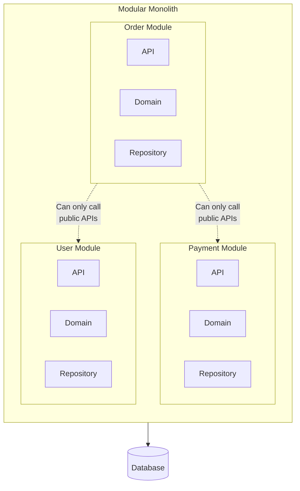

Previous: [[Reflections on MSA 6/7] Event-Based Data Consistency Issues and Solutions in MSA]()

---

Over the past six parts, we've explored various aspects of MSA. How to divide services, how to communicate between them, how to respond to failures, and how to separate data while maintaining consistency.

I've tried to present this as if you and I were on the same team, facing problems and deliberating together as we chose MSA. So it might have felt like quite a challenging journey. I wanted you to experience firsthand—even if just a taste—what adopting MSA actually involves.

By now, I hope you understand and agree that MSA is a trade-off that introduces system complexity to solve problems.

Now it's time to think about the question: **"Is this trade-off really necessary?"**

In this part, I'll share my thoughts on this question.

>Please note that this article contains many personal opinions. Please keep in mind that these are just the personal thoughts of a developer with only three years of experience, and I appreciate your understanding as you read.

## The Real Cost of MSA

What did you think when you saw the considerations and problems involved in adopting MSA? Didn't you feel that unexpectedly complex and difficult problems kept emerging endlessly?

We decided how to divide services, then inter-service communication became necessary. Communication introduced inevitable failures, so failure-resistant design became necessary. Dividing services created data consistency problems, and solving those required yet another complex design. **All these problems stemmed from a single decision to adopt MSA.**

You've experienced firsthand what people mean when they say MSA has a steep learning curve.

However, I think there's a more practical issue that should take precedence over all the problems we faced while adopting MSA.

Many developers, myself included, tend to only consider development and operational problems. But the real issue isn't technical—it's **cost**.

### The Reality of Operational Costs

When we talk about cost, we use the word in various senses: developer time, server resources, management complexity, and so on. Of course, all these costs increase when you decide to adopt MSA, but the 'cost' I want to talk about is literally **money**.

**"MSA costs a lot of money."**

Of course, a well-designed and well-operated MSA can have lower operational costs than a monolith. But in most cases, that's not what happens.

With MSA, services are separated and each must operate independently. This means each service requires its own server, its own database, its own monitoring system, its own deployment pipeline, and so on.

A service that used to run on 1 RDS, 2 EC2 instances, and 1 monitoring system could balloon to 5 RDS instances, 10 EC2 instances, 2 load balancers, and more after transitioning to MSA.

Even a rough calculation suggests higher costs are likely. Of course, monolithic isn't necessarily cheap either. But I think it's clear that MSA is much more likely to be expensive.

In fact, in 2023, Amazon Prime Video's team transitioned from MSA to a monolith and **reduced costs by 90%**. They had built a "textbook" distributed system using AWS Step Functions and Lambda, but it turned out to be inefficient in actual operations. What's interesting is that AWS—a company that profits from selling MSA infrastructure—admitted that "sometimes a monolith is better." ([Docker Blog - You Want Microservices, But Do You Really Need Them?](https://www.docker.com/blog/do-you-really-need-microservices/))

From the company's perspective, naturally they want to reduce expenses. A company is a profit-seeking organization, after all. That's why **the reasons for needing MSA despite the higher cost** must be clear.

Vague, poorly-supported claims like "MSA seems much better" cannot justify the significant costs the company will have to bear going forward.

**I believe you need to be able to convince others "why MSA is the only option."**

### The Price of Technical Complexity

Many seem to choose MSA to achieve "maintainability," "high availability," and "scalability."

However, since there are many other alternatives to achieve "maintainability," "high availability," and "scalability," I don't think these reasons alone are sufficient.

"Technical complexity" ultimately becomes a burden that developers and operators must bear. More time and effort are needed to understand and manage complex systems. If monitoring tools are inadequate, it can become almost catastrophic.

From my experience, APM was almost essential. When I first joined the team and we monitored our MSA with only CloudWatch, operations were incredibly difficult beyond imagination. It was hard to grasp the call relationships between services, and tracking which services a request A passed through before returning a response was extremely challenging. The only clues to guess it was the same request were matching timestamps (down to milliseconds) and manually tracing the call flow through code.

Operations finally became more comfortable after implementing the Grafana LGTM Stack [**Monitoring System Design and Implementation**](). Even now, I remember how truly difficult operations were.

This is why I believe a poorly implemented MSA only increases the burden on developers and operators, and can even make "maintenance" harder. The onboarding difficulty for new team members also increases accordingly.

Ultimately, I think "improved maintenance" only applies when MSA is well-designed and properly implemented.

### The Organization Must Be Ready

There's one more point I think must be considered before adopting MSA: the **organization's readiness**.

This connects to MSA's learning curve. MSA isn't just a technical problem—it's a complex issue that must also consider organizational factors.

I don't think it's enough for just one team member to have done MSA or know how to do it. I believe the entire team needs to understand MSA's complexity and have the appropriate development and operational culture in place.

If that's not the case, I think it's important to allow sufficient time for learning and preparation. This is because the team needs to be able to anticipate and prepare for problems that may arise during MSA adoption.

Options might include running a capstone project as a team, or gaining MSA experience through side projects.

And I believe sufficient discussion and consensus are needed about which solutions to choose from among the many problems and approaches we covered through Part 6.

### Ask Yourself If It's Just Ambition

I think developers tend to have a strong desire for growth. They want to learn new technologies and try new challenges. MSA seems to be one of those attractive topics that can fulfill technical challenges and growth aspirations.

Am I falling behind the trend? Will this help my career? A thirst for technical challenges, and so on.

I've noticed moments when these desires make me view MSA adoption only in a positive light. I was the same way.

Of course, I think it's very positive that developers want to grow, learn new technologies, and take on challenges.

However, this mindset can become ambition that clouds judgment, preventing objective, fact-based assessment of whether something is truly needed.

"Come on, that's going too far. How would you know without researching it?" If you say that, I'd reply: "That was me."

I'm a contradictory person—one part of me kept saying "I still want to try MSA..." while another asked "Is it really necessary?" These kept fighting in my mind, even after I'd concluded "MSA isn't really necessary for our service."

This ambition inevitably becomes a burden on teammates and the company. That's why I think if you feel such ambition, it's better to satisfy it through side projects. (I also satisfied my ambition by building an MSA in a side project before experiencing it in production.)

Of course, there are many problems you can only encounter in production environments, so side projects have their limits. But I think that's better than pushing through a decision driven by ambition that could harm the entire team.

Then you might ask, "If you said it's not necessary for your service, how did you gain MSA experience?"

Well, you could say I was very lucky. The company I joined had already decided to adopt MSA and was in the process of implementing it. So even though I was cautious about MSA adoption, I was fortunate enough to experience MSA.

However, going through it **reinforced my belief that "unless chosen out of clear necessity, MSA is likely unnecessary."**

So what should we choose instead of MSA?

## Is Monolithic Really Bad?

Let me go back to the beginning.

I mentioned in [Part 1]() that MSA emerged as an architecture to overcome monolithic limitations. So is monolithic really a bad architecture?

I don't think so.

### Misconceptions About Monolithic

What image comes to mind when you hear "monolithic"? Don't negative words like "legacy," "technical debt," "can't scale," "outdated" come to mind?

I used to think that way too. Though I shouldn't have, there were moments when I thought MSA was the modern, trendy architecture while monolithic was a relic of the past. My thinking changed a lot after experiencing MSA firsthand.

What I realized is that **it's not that monolithic is bad—poorly designed monolithic is bad.**

Being monolithic doesn't necessarily mean spaghetti code. A monolithic system with clear module boundaries, well-managed dependencies, and well-written tests can be a perfectly maintainable system.

Rather, the problem is often not **"because it's monolithic"** but **"because there was no design."** Referencing any class from anywhere without module boundaries, creating circular dependencies, making the scope of changes unpredictable. That's when bugs appear in seemingly unrelated features.

I think this is a design problem, not a monolithic problem. These problems can occur just as easily in MSA. The Distributed Monolith we covered in [Part 2]() is exactly that example—services are separated but boundaries are wrong, resulting in "distributed spaghetti."

Ultimately, I believe **architecture doesn't solve problems—good design solves problems.**

### The Power of a Well-Designed Monolith

So what does a well-designed monolith look like?

Here are the characteristics I think define a well-designed monolith:

1. **Clear module boundaries**: Each module has clear responsibilities and doesn't depend on other modules' internal implementations.
2. **Communication only through public interfaces**: Modules communicate only through defined APIs and don't directly reference internal classes.
3. **Predictable scope of changes**: When modifying a specific module, it's easy to assess the impact on other modules.
4. **Easy to test**: Can test at the module level and mock other modules.

Looking at these characteristics, they're really **no different from principles of good code.** Single Responsibility Principle, Interface Segregation, Dependency Inversion... SOLID principles also point in this direction.

I believe following these principles well can produce good structure whether monolithic or MSA.

And I think a well-designed monolith can **solve more problems than you'd expect.** The advantages of monolithic—simple deployment, guaranteed transactions, straightforward operations—can be significant strengths.

Of course, monolithic has clear limitations too. As I mentioned in [Part 1](), there are difficulties with scaling, deployment, and technology stack constraints. But what I consider important is whether these limitations are **actually problems for our company and team**.

I don't think it's right to choose MSA out of vague fear that "it might happen in the future."

Does it make sense to worry about scaling when traffic isn't high yet? Should a 5-person team worry about deployment conflicts? I think the likelihood of encountering these problems is very low for most startups or early-stage services.

### Modular Monolith: A Middle Ground

I'd also like to talk more about the **Modular Monolith** that I briefly mentioned in [Part 1]().

Modular Monolith is a **structure that maintains monolithic simplicity while keeping MSA transition in mind**. It's a single deployment unit, but internally has clear module boundaries.

Personally, I quite like this Modular Monolith approach.



The key to Modular Monolith is **"it's monolithic now, but if needed later, it can transition to MSA."** If module communication is forced through interfaces, when you later separate that module into a separate service, you just need to replace the interface implementation with an HTTP client.

```java
// Call in Modular Monolith
public interface PaymentService {
    PaymentResult processPayment(PaymentRequest request);
}

// Currently direct call within same process
@Service
public class PaymentServiceImpl implements PaymentService {
    public PaymentResult processPayment(PaymentRequest request) {
        // Direct processing
    }
}

// Later when transitioning to MSA, replace with HTTP client
@Service
public class PaymentServiceClient implements PaymentService {
    public PaymentResult processPayment(PaymentRequest request) {
        return restTemplate.post("/payments", request, PaymentResult.class);
    }
}
```

This enables **gradual transition** with high likelihood. Rather than converting everything to MSA at once, you can separate modules one by one as needed. This way you don't have to bear MSA's complexity right now, but keep the option open to transition when needed.

Of course, Modular Monolith isn't easy either. You need to divide module boundaries and establish conventions, and to enforce them you need to restrict dependencies in the build system or use architecture testing tools (like ArchUnit). And all team members need to understand and follow these rules.

Still, I think **"starting with Modular Monolith and moving to MSA when needed"** is a wiser choice than **"starting with MSA from the beginning."**

## So When Is MSA the Right Choice?

So is my opinion that you shouldn't do MSA? No, that's not it.

I believe there are definitely moments when you can answer "why MSA is the only option."

So when are those moments I'm thinking of?

### Signals That You Should Consider MSA

#### Reaching the Limits of Scale Up

As services grow, there can come a moment when you reach the limits of instances or databases. Cases where resource usage like CPU, memory, network I/O becomes too high to improve performance further.

Of course, even in this case, you can first consider horizontal scaling (scale out). Introducing load balancers, spinning up multiple instances, or distributing load through Replication, Sharding, and similar approaches.

But when a specific feature or module consumes excessive resources, it might be more efficient to separate just that part into a separate service with an independent DB.

I think this is a situation where you need to separate a specific feature.

**"When"** the service has grown to the point of reaching the limits of a single server or database.

#### Failure Isolation Is Critical

This is connected to the above, but there can come a moment when a specific feature consumes excessive resources and starts affecting the entire service.

For example, when traffic spikes to a specific feature and brings down the entire service.

In such cases, action must be taken to prevent impact on the entire service, and I think you should consider separating that specific feature into a separate service as quickly as possible.

After all, failure propagation to the entire service is never good for user experience.

#### The Organization Is Large

I think if the team is huge, monolithic limitations can arrive quickly.

If the development team alone has 300-400 people, asking everyone to collaborate in a single codebase could actually harm team productivity. That's the point when **it becomes difficult to collaborate in a single codebase**.

Daily Git conflicts, spending time coordinating deployment schedules, having your feature's deployment delayed because of another team's changes—these situations can occur.

In such cases, I think separating features by team roles should definitely be considered.

However, **I don't think a large team automatically means MSA is necessary.** What I consider important is **whether collaboration bottlenecks are actually occurring**.

#### Keep Doing This and You End Up with MSA

As some of you may have noticed, I didn't say "you should consider MSA" above. I said **"this is a situation where you need to separate a specific feature."**

The problems above share a common thread: they're all **situations where features need to be separated out of necessity**. Not because you want to, but because you naturally need to separate specific features.

I think if you keep separating things one by one in such cases, the destination might eventually be MSA.

**It's not running toward MSA—it's running and finding MSA at the destination.** These are the moments I consider MSA to be necessary.

Of course, "running and ending up at MSA" might be a bit of an exaggeration. As you separate a few specific features, you'll probably think "we need to do MSA" out of necessity.

### Signals to Avoid MSA

Conversely, I think there are signals to avoid MSA.

#### The Team Is Small

I think adopting MSA in a situation with 5 or fewer team members is **over-engineering** in most cases.

Sufficient personnel are needed to handle MSA's operational complexity. Infrastructure management, monitoring, incident response, inter-service communication management... I think it's really difficult for a small number of people to handle all this while also doing feature development.

MSA definitely has advantages, but I think for small teams, those advantages don't outweigh the cost of handling the complexity.

Our team is in this case. The team is 4 people total, and only 2 are backend developers. I also handle DevOps and manage infrastructure including K8s—operating MSA in this situation is really not easy.

Of course, not easy doesn't mean impossible. A small team also means the service isn't that big, so somehow everything manages to keep running.

The conclusion is that I think sufficient personnel are needed. At minimum, I believe you need to be at **"a scale where multiple teams can develop and operate independently."**

#### Domain Understanding Is Insufficient

Also, deep domain understanding is needed to properly set service boundaries. As I mentioned in [Part 2](), wrongly divided service boundaries are really hard to fix later.

In the early stages of a project, domain understanding is often insufficient. I think starting MSA in this state has a high probability of setting wrong boundaries.

I think **starting monolithic and separating only necessary parts after domain understanding deepens** is a safer approach.

#### Fast Development Is Top Priority

In the early stages of startups or MVP phases, I think **fast release and feedback** are most important. There's a reason startups talk so much about being agile.

MSA's complexity inevitably slows development speed. That's why I think in environments where speed is life, entering the market quickly with a monolith and considering MSA when the service succeeds and it becomes necessary isn't too late.

#### Infrastructure Capability Is Lacking

I think properly operating MSA requires infrastructure capabilities like container orchestration, distributed system monitoring, and CI/CD pipelines.

This is because I believe automated deployment and monitoring systems are essential to achieve high availability—one of MSA's goals.

If you adopt MSA without these capabilities, I think you might end up in a situation of **"many services but can't manage them."** Like my experience having to check logs in an MSA environment without APM. It really wasn't easy.

## Summary

Here's a summary of what I wanted to say in this part:

1. **MSA is a choice that brings in complexity.** I think there needs to be a clear reason sufficient to justify that complexity.
2. **Cost cannot be ignored.** Infrastructure costs, operational costs, developer cognitive load... all of these increase.
3. **Monolithic isn't bad.** I think a well-designed monolith can be a perfectly good choice.
4. **There's also the middle ground of Modular Monolith.** A structure that enjoys monolithic benefits now while enabling MSA transition when needed later.
5. **The moment MSA becomes necessary comes later than you think.** I think most services can operate perfectly well as monolithic.

Ultimately, the core message I want to convey is this:

**"Does our service really need MSA?"**

If you can answer this question with concrete, data-based answers like **"because the team is large,"** **"because there's lots of traffic,"** **"because failure isolation is needed,"** then I think MSA is worth considering.

But if you were in the same meeting room with me with vague reasons like **"because it's trendy,"** **"because we might need it later,"** **"because MSA seems better,"** I would probably be discussing from a "oppose adoption" position.

## Wrapping Up the Series

Over 7 parts, I've covered various problems and considerations about MSA.

Starting from Part 1 about what MSA is and why it emerged, to how to divide services, how to communicate, how to respond to failures, and how to separate data and maintain consistency.

I tried to organize the considerations and problems I had while experiencing MSA, as well as problems that could occur, both in my own head and in a way that would be visualized in readers' minds.

Looking back at the process of facing these problems together, it was truly a challenging journey. Solve one problem and two more pop up, solve those and more complexity follows... MSA felt like **"an endless succession of problem-solving."**

That's why in this final part, I wanted to pose the question **"Do we really need MSA?"** Learning about MSA's various patterns and solutions is important, but I think it's more important to first judge whether you're even in a situation that requires that complexity.

If while reading this series you felt **"MSA is harder than I thought"** rather than **"MSA is no big deal,"** then I consider myself somewhat successful. I believe recognizing that "difficulty" and those "problems" is the start of making the right decisions.

Of course, I don't think MSA is a choice that should always be avoided. If the organization is large, the domain is complex, traffic is high, and independent deployment and scaling are needed, I think MSA can definitely be an extremely effective choice. Companies like Netflix, Amazon, Coupang, and Baemin chose MSA for good reasons.

However, I believe it should be **"a choice made out of necessity."** Not trends or vague expectations or growth aspirations, but a choice to solve problems you're actually experiencing.

Technology choices are always a succession of trade-offs. Choose MSA and you gain independence and scalability, but you must bear complexity and operational burden. Choose monolithic and you gain simplicity, but you may hit limits as scale grows.

**I don't think there's a right answer. I just believe there are choices that fit our service, our team, our situation.**

I hope this series has been at least a little helpful in making that choice.

Thank you for reading this long series.

---

## References

### Related Experience Posts

- [16 Repositories to One - MSA to Multi-Module Transition]()
- [Is Gradual MSA Transition an Illusion?]()
- [From Docker-compose to Kubernetes]()

### Bibliography

- Martin Fowler - [Microservices](https://martinfowler.com/articles/microservices.html)
- Martin Fowler - [Monolith First](https://martinfowler.com/bliki/MonolithFirst.html)
- Sam Newman - *Building Microservices* (O'Reilly, 2021)
- Chris Richardson - *Microservices Patterns* (Manning, 2018)

### Series

- Part 1: [[Reflections on MSA 1/7] What Is MSA (Microservices Architecture)?]()
- Part 2: [[Reflections on MSA 2/7] How to Divide Services in MSA]()
- Part 3: [[Reflections on MSA 3/7] Inter-Service Communication in MSA]()
- Part 4: [[Reflections on MSA 4/7] How Failures Propagate and Where to Cut Them Off]()
- Part 5: [[Reflections on MSA 5/7] How Should We Separate Data?]()
- Part 6: [[Reflections on MSA 6/7] Event-Based Data Consistency Issues and Solutions in MSA]()
- Part 7: [[Reflections on MSA 7/7] Do We Really Need MSA?]()
