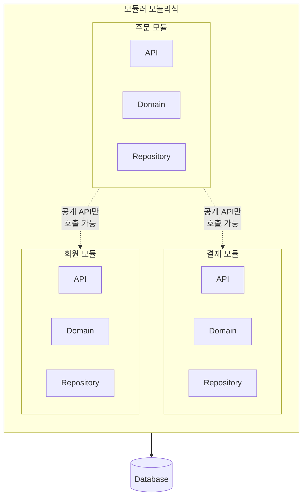

전편: [[MSA에 관한 고찰 6/7편] 이벤트 기반 데이터 정합성]()

---

지금까지 6편에 걸쳐 MSA의 여러 측면을 살펴봤습니다. 서비스를 어떻게 나눌지, 어떻게 통신할지, 장애에 어떻게 대응할지, 데이터를 어떻게 분리하고 정합성을 맞출지까지요.

정말 여러분과 제가 실제로 한 팀에서 MSA를 선택하게 되면서 함께 문제를 맞이하고 고민하는 것처럼 느끼실 수 있게 이야기를 풀어보려 노력해 봤습니다. 그래서 정말 쉽지 않은 여정처럼 느껴지셨을 수 있을 것 같습니다. 다만 맛보기 만이라도 MSA를 도입하는 과정을 몸소 체감해보시길 바랬습니다.

이제는 MSA가 문제를 해결하기위해 시스템의 복잡성을 이끌어 오게 되는 트레이드오프 임을 충분히 이해하시고 공감하시지 않으실까 싶습니다.

이제 저희는 **"이 트레이드오프가 정말 필요한가?"** 라는 질문에 대해 생각해볼 시간입니다.

이번 편에서는 이 질문에 대한 제 생각을 적어보려 합니다.

>다만 이번 글에는 제 개인적인 의견이 많이 담겨있음을 미리 양해 부탁드립니다. 부족한 3년차 개발자의 개인적인 생각일 뿐임을 염두해주시고 넓은 아량으로 이해해주시며 읽어주시면 감사하겠습니다.

## MSA의 진짜 비용

MSA를 도입하기 위해 해야할 고민들과 문제들을 살펴보셨을때 어떤 생각이 드셨나요? 예상보다 훨씬 복잡하고 어려운 문제들이 끝없이 쏟아져 나온다는 생각이 들지 않으셨나요?

서비스를 어떻게 나눌지 정했더니 서비스 간 통신이 필요해졌고, 통신이 생기니 장애가 발생할 수 밖에 없었고, 장애가 생기니 이를 대비한 설계가 필요해졌고, 서비스를 나누다보니 데이터 정합성 문제가 발생했고, 데이터 정합성을 맞추려다보니 결국 또 다른 복잡한 설계가 필요해졌습니다. **이 모든 과정은 오로지 MSA를 도입하겠다는 결정 하나만으로 시작된 문제들**이었습니다. 

MSA가 러닝커브가 높다는 말을 직접 체감하시게 되신거죠. 

그렇지만 MSA를 도입하기 위해 마주했던 수많은 문제들보다 더 크게 우선시 되어야하는 현실적인 문제가 있지 않나 싶습니다.

저를 포함한 많은 개발자들이 흔히 개발, 운영과정에서의 문제만을 고려하는 경향이 있는 것 같습니다. 하지만 정말 문제는 기술적인 문제가 아닌 바로 **비용**입니다.

### 운영 비용의 현실

저희가 비용을 이야기할때 여러가지 의미에서 '비용'이라는 단어를 사용하곤 합니다. 개발자의 시간, 서버 리소스, 관리의 복잡성 등등 말이죠. 물론 MSA를 도입하기로 결정하게되면 이 모든 비용이 증가하게 됩니다만 제가 이야기하고 싶은 '비용'은 정말 말 그대로 '돈'입니다.

**"MSA는 돈이 많이 들어갑니다."**

물론 잘 만들고 잘 운영하는 MSA는 모놀리식보다도 운영비용이 적을 수도 있습니다. 하지만 대부분의 경우에는 그렇지 않더라고요.

MSA는 서비스가 나뉘어지면서 각각의 서비스가 독립적으로 운영되어야 합니다. 즉, 각각의 서비스는 별도의 서버, 별도의 데이터베이스, 별도의 모니터링 시스템, 별도의 배포 파이프라인 등을 필요로 하게 됩니다.

기존에는 RDS 1대, EC2 인스턴스 2대, 모니터링 시스템 1개로 운영되던 서비스가 MSA로 전환되면 RDS 5대, EC2 인스턴스 10대, LB 2대 등으로 늘어날 수 있다는 거죠.

단순 무식하게 계산해봐도 더 비용이 많이 나올 가능성이 높습니다. 물론 모놀리식이라고 해서 꼭 저렴한건 아닙니다. 하지만 MSA가 더 비싸질 가능성이 훨씬 높다는 점은 명확하지 않나 싶습니다.

실제로 2023년에 Amazon Prime Video 팀이 MSA를 모놀리식으로 전환하면서 **비용을 90% 절감**했다는 사례가 있습니다. AWS Step Functions와 Lambda를 활용한 "교과서적인" 분산 시스템이었는데, 실제 운영에서는 오히려 비효율적이었다고 하더라고요. 재밌는건 AWS가 MSA 인프라를 판매해서 수익을 내는 회사인데도 "때로는 모놀리식이 낫다"고 인정한 점이지 않나 싶습니다. ([Docker 블로그 - You Want Microservices, But Do You Really Need Them?](https://www.docker.com/blog/do-you-really-need-microservices/))

회사 입장에서는 당연히 지출비용을 줄이고 싶어할 수 밖에 없습니다. 회사는 영리를 추구하는 조직이니까요. 그렇기 때문에 **"'돈'이 더 많이 들어감에도 불구하고 MSA가 필요한 이유"** 가 분명해야 합니다.

"MSA가 훨씬 좋은 것 같으니까"와 같은 불명확하고 근거도 빈약한 주장으로 앞으로 회사가 감수해야할 큰 비용을 정당화할 수는 없다는 거죠.

**"어째서 MSA가 아니면 안되는가"를 설득할 수 있어야 한다고 생각합니다.**

### 기술적 복잡성의 대가

또 "유지보수", "고가용성", "확장성"을 얻기 위해 MSA를 선택하는 경우들도 많은 것 같습니다.

다만 "유지보수", "고가용성", "확장성"을 확보하는 다른 대안들도 많이 존재하기 때문에 "유지보수"가 더 쉽다거나 "고가용성", "확장성"이 더 좋다는 이유만으로는 부족하지 않나 싶습니다. 

**"기술적 복잡성"은 결국 개발자와 운영자가 감당해야할 부담으로 돌아옵니다.** 복잡한 시스템을 이해하고 관리하는데 더 많은 시간과 노력이 필요하게 되죠. 모니터링 툴이 빈약하면 거의 재앙수준으로 다가올 수 있습니다.

경험상 APM을 거의 필수적으로 도입해야 했습니다. 처음 팀에 합류했을때 Cloud Watch로만 MSA 모니터링한적이 있는데 상상 이상으로 운영이 힘들었습니다. 서비스 간 호출 관계를 파악하는 것도 힘들었고 요청A가 어떤 서비스를 거쳐서 응답이 돌아오는지 추적하는 것도 힘들었죠. 같은 요청이라고 추측할 수 있는 단서는 같은 시간(ms 단위까지)이라는 것과 호출하는 흐름을 직접 코드로 확인하는 것 밖에 없었습니다.

Grafana LGTM Stack [**모니터링 시스템 설계 및 구축**]()를 도입하면서 비로소 좀 쾌적한 운영이 가능해졌습니다. 다시 생각해도 정말 운영이 힘들었던 기억이 납니다.

이처럼 **잘못 만든 MSA는 개발자와 운영자의 부담만 가중시키고, "유지보수"마저 어렵게 만들 수 있다**고 생각합니다. 새롭게 팀에 합류하는 개발자들의 온보딩 난이도도 덩달아 높아지게 되죠.

결국 "유지보수"를 향상시킨다는 건 MSA를 잘 설계하고 도입했을 때의 이야기가 아닐까 싶습니다.

### 조직이 준비되어야 한다

또 MSA를 도입하기 전에 반드시 고려해야할 점이 하나 더 있다고 생각합니다. 바로 **조직의 준비 상태**입니다.

이게 결국 MSA의 러닝커브 와도 연결되는 문제인데요. MSA는 단순히 기술적인 문제만이 아니라 조직적인 문제도 함께 고려해야하는 복잡한 문제입니다.

단순히 팀원중 한명이 MSA를 해봤다 거나 할줄 안다 정도로는 부족하다고 생각합니다. **팀 전체가 MSA의 복잡성을 이해하고, 그에 맞는 개발 및 운영 문화를 갖추고 있어야 한다**고 생각합니다.

혹시 갖추어져 있지 않다면 충분한 학습과 준비 기간을 갖는 것이 중요하다고 생각합니다. MSA를 도입하는 과정에서 발생할 수 있는 문제들을 미리 예측하고 대비할 수 있어야 하기 때문이죠.

팀원들끼리 캡스톤 프로젝트를 진행해본다거나, 사이드 프로젝트로 MSA를 경험해본다거나 하는 방법들이 있을 수 있겠죠.

그리고 6편까지의 과정에서 언급했던 수많은 문제들과 이를 해결하기 위한 방법들중 어떤 것들을 선택할지 충분한 논의와 합의가 필요하다고 생각합니다.

### 욕심은 아닌지 돌아봐야 한다

개발자들은 성장에 대한 욕구가 강한 편이라고 생각합니다. 새로운 기술을 배우고, 새로운 도전을 해보고 싶어하죠. MSA도 기술적인 챌린지를 할 수 있고 성장 욕구를 충족해줄거라 기대하게 되는 매력적인 주제 중 하나인 것 같습니다.

내가 트렌드에 뒤쳐지진 않았는지, 내 커리어에 도움이 될지, 기술적인 도전에 대한 갈망 등등.

이런 욕구들이 내 안에서 MSA 도입에 대한 고려를 긍정적인 방향에서만 바라보게 하는 순간들이 있는 것 같습니다. 저 또한 그랬구요.

물론 개발자가 성장에 대한 욕구를 가지고 새로운 기술을 학습하고 싶어하는 그리고 도전하고 싶어하는 마음은 아주 긍정적인 부분이라고 생각합니다.

다만 이 마음이 욕심이 되어 **정말 필요한지 여부를 객관적인 사실 기반 데이터와 근거로 판단하지 못하게** 판단력을 흐리게 하는 역할을 할 수 있다는 거죠.

"에이 그래도 그건 너무 갔다. 연구를 해본것도 아니면서 어떻게 알아?" 라고 하신다면 "제가 그랬습니다"

저는 모순적인 사람인지라 마음 한켠에선 "MSA 그래도 해보고 싶다..." 라는 마음과 "정말 필요한가?" 라는 마음이 계속해서 싸우고 있었습니다. "우리 서비스에는 MSA가 굳이 필요하지않다" 라는 결론을 스스로 내렸음에도 불구하고 말이죠.

이런 욕심은 결국 팀원들과 회사에 부담으로 돌아올 수 밖에 없습니다. 그렇기 때문에 **욕심이 생긴다면 사이드 프로젝트로 푸는게 낫다**고 생각합니다. (저 또한 운영 환경에서 경험하기 전에는 사이드 프로젝트로 구성해서 욕심을 채웠습니다)

물론 실제 운영환경에서만 겪을 수 있는 문제들도 많기 때문에 사이드 프로젝트로는 한계가 있을 수 있습니다. 그렇지만 팀 전체에 해를 끼칠 수 있는 결정을 욕심으로 밀어붙이는 것보다는 낫다고 생각합니다.

그렇다면 이렇게 말하실 수 있습니다. "우리 서비스에 필요 없다면서 MSA는 어떻게 경험하셨나요?". 

음 어떻게 보면 굉장히 운이 좋다고도 할 수 있을 것 같습니다. 이직한 회사가 이미 MSA 도입을 결정하고 진행중이었던 케이스였거든요. 그래서 저는 MSA 도입에 조심스러운 입장이면서도 운좋게도 MSA를 경험할 수 있었습니다.

다만 겪으면서 **“명확한 필요에 의해 선택된 것이 아니라면, MSA는 불필요할 가능성이 높다”** 라는 생각이 더욱 확고해졌습니다.

그렇다면 MSA가 아닌 뭘 선택해야 할까요?

## 모놀리식은 정말 나쁜가?

여기서 처음으로 돌아가 보겠습니다.

MSA는 모놀리식의 한계점들을 극복하기 위해 등장한 아키텍처라고 [1편]()에서 말씀드렸습니다. 그렇다면 모놀리식은 정말 나쁜 아키텍처일까요?

저는 그렇지 않다고 생각합니다.

### 모놀리식에 대한 오해

모놀리식 하면 어떤 이미지가 떠오르시나요? "레거시", "기술 부채", "확장 불가", "구식"... 이런 부정적인 단어들이 연상되시지 않나요?

저도 한때 그랬습니다. 그러면 안되지만 MSA가 모던하고 트렌디한 아키텍처이고, 모놀리식은 과거의 유산 정도로 생각했던 순간들이 있었습니다. MSA를 직접 경험하고 나니 생각이 많이 바뀌었지만 말입니다.

제가 느낀건 **모놀리식이 나쁜 게 아니라, 잘못 설계된 모놀리식이 나쁜 거라는 것 입니다.**

모놀리식이라고 해서 반드시 스파게티 코드가 되는 건 아니죠. 모듈 간 경계가 명확하고, 의존성이 잘 관리되고, 테스트가 잘 작성된 모놀리식은 충분히 유지보수하기 좋은 시스템이 될 수 있다고 생각합니다.

오히려 문제는 **"모놀리식이어서 문제"** 가 아니라 **"설계를 안 해서 문제"** 인 경우가 많았습니다. 모듈 간 경계 없이 아무 데서나 아무 클래스를 참조하고, 순환 의존성이 생기고, 변경의 영향 범위를 예측할 수 없는 상태가 되는 거죠. 그래서 아무 관계없는 것 같던 기능에서 버그가 발생하는 상황도 생기고요.

이건 모놀리식의 문제가 아니라 설계의 문제라고 생각합니다. 이런 문제는 MSA에서도 똑같이 발생할 수 있습니다. 저희가 [2편]()에서 다뤘던 Distributed Monolith가 바로 그 예시죠. 서비스는 나눴는데 서비스 간 경계가 잘못 설정되어 결국 "나눠진 스파게티"가 되는 상황 말입니다.

결국 **아키텍처가 문제를 해결해주는 게 아니라, 좋은 설계가 문제를 해결해주는 것**이라고 생각합니다.

### 잘 설계된 모놀리식의 힘

그렇다면 잘 설계된 모놀리식은 어떤 모습일까요?

제가 생각하는 잘 설계된 모놀리식의 특징은 다음과 같습니다.

1. **모듈 간 경계가 명확하다**: 각 모듈이 자신의 책임을 명확히 가지고, 다른 모듈의 내부 구현에 의존하지 않습니다.
2. **공개 인터페이스를 통해서만 통신한다**: 모듈 간에는 정의된 API를 통해서만 소통하고, 내부 클래스를 직접 참조하지 않습니다.
3. **변경의 영향 범위가 예측 가능하다**: 특정 모듈을 수정해도 다른 모듈에 미치는 영향을 쉽게 파악할 수 있습니다.
4. **테스트가 용이하다**: 모듈 단위로 테스트할 수 있고, 다른 모듈을 Mock으로 대체할 수 있습니다.

이런 특징들을 보면, 사실 **좋은 코드의 원칙들과 다를 게 없는 것 같습니다.** 단일 책임 원칙, 인터페이스 분리, 의존성 역전... SOLID 원칙들도 결국 이런 방향성을 지향하고 있으니까요.

이런 원칙들을 잘 지키면 모놀리식이든 MSA든 좋은 구조가 나올 수 있다고 생각합니다.

그리고 잘 설계된 모놀리식은 **생각보다 많은 문제를 해결할 수 있다고 생각합니다.** 모놀리식의 장점이였던 배포가 간단하고, 트랜잭션이 보장되며, 운영이 단순한 점들이 큰 강점이 될 수 있죠.

물론 모놀리식의 한계도 분명히 존재합니다. [1편]()에서 이야기했듯이 스케일링의 어려움, 배포의 어려움, 기술 스택의 제약 등이 있죠. 하지만 제가 중요하게 생각하는건 이런 한계들이 **실제로 우리 회사와 팀에 문제가 되는지**입니다.

**"그저 미래에 그럴지도 모른다."** 라는 막연한 두려움 때문에 MSA를 선택하는 건 옳지 않다고 생각합니다.

트래픽이 아직 많지 않은데 스케일링 걱정을 하는 게 의미가 있을까요? 팀이 5명인데 배포 충돌을 걱정해야 할까요? 대부분의 스타트업이나 초기 서비스에서는 이런 문제들을 겪을 가능성은 현저히 낮다고 생각합니다.

### 모듈러 모놀리식: 중간 지점

그리고 [1편]()에서 잠깐 언급했던 **모듈러 모놀리식(Modular Monolith)** 에 대해 조금 더 이야기해보려 합니다.

모듈러 모놀리식은 **모놀리식의 단순함을 유지하면서도, MSA로의 전환을 염두에 둔 구조**입니다. 하나의 배포 단위이지만, 내부적으로는 명확한 모듈 경계를 가지는 거죠.

저는 개인적으로 이 모듈러 모놀리식 접근 방식을 꽤 좋아합니다.



모듈러 모놀리식의 핵심은 **"지금은 모놀리식이지만, 나중에 필요하면 MSA로 전환할 수 있는 구조"** 라는 점이지 않나 싶습니다. 모듈 간 통신을 인터페이스를 통해 하도록 강제하면, 나중에 해당 모듈을 별도 서비스로 분리할 때 인터페이스 구현체만 HTTP 클라이언트로 바꾸면 됩니다.

```java
// 모듈러 모놀리식에서의 호출
public interface PaymentService {
    PaymentResult processPayment(PaymentRequest request);
}

// 지금은 같은 프로세스 내에서 직접 호출
@Service
public class PaymentServiceImpl implements PaymentService {
    public PaymentResult processPayment(PaymentRequest request) {
        // 직접 처리
    }
}

// 나중에 MSA로 전환하면 HTTP 클라이언트로 교체
@Service
public class PaymentServiceClient implements PaymentService {
    public PaymentResult processPayment(PaymentRequest request) {
        return restTemplate.post("/payments", request, PaymentResult.class);
    }
}
```

이렇게 하면 **점진적인 전환**이 가능해질 가능성이 높습니다. 모든 걸 한 번에 MSA로 바꾸는 게 아니라, 필요한 모듈부터 하나씩 분리해나갈 수 있는 거죠. 이렇게 되면 **지금 당장 MSA의 복잡성을 감수할 필요 없이**, 나중에 필요할 때 전환할 수 있는 옵션을 열어두니까요.

물론 모듈러 모놀리식도 쉬운 건 아닌 것 같습니다. 모듈 간 경계를 나눠야하고 컨벤션으로 지정하고, 또 강제하려면 빌드 시스템에서 의존성을 제한하거나, 아키텍처 테스트 도구(ArchUnit 같은)를 활용해야 합니다. 그리고 팀원 모두가 이 규칙을 이해하고 지켜야 하죠.

그래도 저는 **"처음부터 MSA"** 보다는 **"모듈러 모놀리식에서 시작해서 필요할 때 MSA로"** 가 좀 더 현명한 선택이지 않나 싶습니다.

## 그렇다면 언제 MSA인가?

그렇다면 MSA를 하지 말라는게 제 의견이냐? 그건 아닙니다.

"어째서 MSA가 아니면 안되는가"를 답할 수 있는 순간들이 분명히 존재한다고 생각합니다.

그렇다면 언제가 제가 생각하는 그 순간일까요?

### MSA를 고려해야 하는 신호

#### 스케일 업의 한계에 도달

서비스가 성장하면서 인스턴스 혹은 DB의 한계에 도달하는 순간이 올 수 있습니다. CPU, 메모리, 네트워크 I/O 등 자원 사용량이 너무 높아져서 더 이상 성능 향상이 어려운 경우가 있죠.

물론 이 경우에도 수평적 확장(스케일 아웃)을 먼저 고려해볼 수 있습니다. 로드 밸런서를 도입하고, 여러 인스턴스를 띄우거나 Replication, Sharding과 같이 부하를 분산시키는 방법이죠.

하지만 특정 기능이나 모듈이 지나치게 많은 자원을 소비하는 경우, 해당 부분만 별도의 서비스로 분리하고 DB도 독립시키는 게 효율적일 수 있습니다.

이런 경우 특정 기능을 분리해야하는 상황이라고 생각합니다.

**"단일 서버나 데이터베이스의 한계에 도달할 정도로"** 서비스가 성장했을 때 말이죠.

#### 장애 격리가 중요하다

위와 이어지는 문제입니다만 특정 기능에만 지나치게 많은 자원을 소비하며 전체 서비스에 영향을 주기 시작하는 순간이 올 수 있습니다.

특정 기능에 트래픽이 몰려서 서비스 전체가 죽는 경우가 발생한다거나 말입니다.

이런 경우 전체 서비스에 영향을 주지 않도록 조치를 취해야 하는데 이런 경우에 가능한 빨리 특정 기능만 별도의 서비스로 분리하는 것을 고려해야한다고 생각합니다.

전체 서비스로의 장애 전파가 사용자 경험에 절대 좋을리는 없으니까요. 

#### 조직이 크다

팀 규모가 거대하면 모놀리식의 한계가 빨리 찾아올 수 있다고 생각합니다.

개발팀 인원만 300~400명 되는데 한 코드베이스에서 모두가 협업하라고 하는건 오히려 팀 생산성에 해가 될 수 있다고 생각합니다. 그 시점이 **하나의 코드베이스에서 협업하기 어려워지는 시점**인거죠.

매일 Git 충돌이 발생하고, 배포 일정을 조율하느라 시간을 많이 쓰고, 다른 팀의 변경 사항 때문에 내 기능이 배포가 밀리는 상황이 발생 할 수 있으니까요. 

이런 경우에는 팀의 역할별로 기능을 분리하는 것이 충분히 고려되어야 한다고 생각합니다.

다만 **팀이 크다고 무조건 필요하다고 생각하는 건 아닙니다.** 제가 중요하게 생각하는 건 **협업의 병목이 실제로 발생하고 있는가**입니다.

#### 이렇게 하다보면 MSA다

눈치 채신분들도 있겠지만 제가 위에 "MSA를 고려해야한다"고 언급하지 않았습니다. **"특정 기능을 분리해야하는 상황"** 이라고 표현했습니다.

위 문제들은 공통적으로 **필요에 의해 기능을 분리해야 하는 상황**들입니다. 원해서 하는 게 아닌 필요해서 자연스레 특정 기능을 분리해야 하는 상황들인거죠.

저런 경우에 하나씩 분리해 내다보면 결국 종착지가 MSA가 될 수도 있다고 생각합니다.

**MSA를 바라보고 달리는게 아니라 달리다 보니 종착지가 MSA가 된다는 거죠.** 이런 상황들이 제가 생각하는 MSA가 필요한 순간들입니다.

물론 "달리다보니 MSA"는 약간 비약이 있을 수 있습니다. 특정 기능을 몇개 분리하다보면 "MSA 해야겠다"라고 필요에 의해서 생각하실 테니까요.

### MSA를 피해야 하는 신호

반대로, MSA를 피해야 할 신호들도 있다고 생각합니다.

#### 팀이 작다

팀이 5명 이하인 상황에서 MSA를 도입하는 건 대부분의 경우 **오버엔지니어링**이라고 생각합니다.

MSA의 운영 복잡성을 감당하려면 충분한 인력이 필요합니다. 인프라 관리, 모니터링, 장애 대응, 서비스 간 통신 관리... 이 모든 걸 소수의 인원이 감당하면서 동시에 기능 개발까지 하기는 정말 어렵다고 생각합니다.

MSA의 장점이 분명히 존재하지만, 저는 작은 팀에서는 그 장점들이 복잡성을 감당하는 비용보다 크지 않다고 봅니다.

저희 팀이 이 경우에 속합니다. 지금 팀은 총 4명이고, 그 중 백엔드 개발자는 2명 뿐입니다. 저는 DevOps까지 병행하며 K8s를 포함한 인프라도 관리하고 있는데 이런 상황에서 MSA를 운영하고 있으니 정말 쉽지 않습니다.

물론 쉽지 않지만 못할건 아닙니다. 팀이 작다는건 그만큼 서비스가 크지 않다는 뜻이기도 하기때문에 어떻게 어떻게 다 잘 굴러는 가더라구요.

결론은 충분한 인력이 필요하다고 생각합니다. 최소한 **"여러 팀으로 나뉘어 독립적으로 개발 및 운영이 가능한 규모"** 가 되어야 한다고 생각합니다.

#### 도메인을 충분히 이해하지 못했다

또 서비스 경계를 제대로 설정하려면 도메인에 대한 깊은 이해가 필요합니다. [2편]()에서 이야기했듯이, 잘못 나눈 서비스 경계는 나중에 수정하기가 정말 어렵습니다.

프로젝트 초기에는 도메인 이해가 부족한 경우가 많습니다. 이 상태에서 MSA를 시작하면 높은 확률로 경계를 잘못 설정하게 될 가능성이 높다고 생각합니다. 

**모놀리식으로 시작해서 도메인 이해가 깊어진 후에 필요한 부분만 분리**하는 게 더 안전한 접근이라고 생각합니다.

#### 빠른 개발이 최우선이다

스타트업 초기나 MVP 단계에서는 **빠른 출시와 피드백**이 가장 중요하다고 생각합니다. 스타트업에서 애자일 애자일 하는 이유가 있죠.

MSA의 복잡성은 개발 속도를 늦추기 마련입니다. 그렇기 때문에 속도가 생명인 환경에서는 모놀리식으로 빠르게 시장에 진입하고, 서비스가 성공해서 필요해졌을때 MSA를 고려해도 늦지 않다고 생각합니다.

#### 인프라 역량이 부족하다

MSA를 제대로 운영하려면 컨테이너 오케스트레이션, 분산 시스템 모니터링, CI/CD 파이프라인 등 인프라 역량이 필요하다고 생각합니다.

MSA의 목적중 하나인 고가용성을 확보하기 위해선 자동화된 배포와 모니터링 시스템이 필수적이라고 보기 때문입니다.

만약 이런 역량 없이 MSA를 도입하면 **"서비스가 많아졌는데 관리는 못 하는"** 상황이 될 수 있지 않나 싶습니다. APM 없이 MSA 환경에서 로그를 확인해야했던 제 경험처럼요. 정말 쉽지 않았습니다.

## 정리

이번 편에서 하고 싶었던 이야기를 정리하면 다음과 같습니다.

1. **MSA는 복잡성을 끌어들이는 선택입니다.** 그 복잡성을 감당할 만큼의 명확한 이유가 있어야 한다고 생각합니다.
2. **비용을 절대 무시할 수 없습니다.** 인프라 비용, 운영 비용, 개발자의 인지 부하... 이 모든 게 증가합니다.
3. **모놀리식이 나쁜 게 아닙니다.** 잘 설계된 모놀리식은 충분히 훌륭한 선택이 될 수 있다고 생각합니다.
4. **모듈러 모놀리식이라는 중간 지점도 있습니다.** 지금은 모놀리식의 이점을 누리면서, 나중에 필요할 때 MSA로 전환할 수 있는 구조지 않나 싶습니다.
5. **MSA가 필요한 시점은 생각보다 늦게 옵니다.** 대부분의 서비스는 모놀리식으로도 충분히 잘 운영될 수 있다고 생각합니다.

결국 제가 전달드리고 싶은 핵심 메시지는 이겁니다.

**"우리 서비스에 MSA가 정말 필요한가?"**

이 질문에 **"팀이 커서"**, **"트래픽이 많아서"**, **"장애 격리가 필요해서"** 같은 구체적이고 데이터에 기반한 답변을 할 수 있다면 MSA를 고려해볼 만하다고 생각합니다.

하지만 저와 한 팀에서 **"요즘 트렌드니까"**, **"나중에 필요할 것 같아서"**, **"MSA가 더 좋아 보여서"** 같은 막연한 이유들로 MSA 도입 논의 회의를 개최하셨다면 아마 저는 "도입 반대"의 입장에서 협의를 진행하게 될 것 같습니다.

## 시리즈를 마치며

7편에 걸쳐 MSA에 대한 여러 문제들과 고민들을 풀어봤습니다.

1편에서 MSA가 무엇인지, 왜 등장했는지부터 시작해서, 서비스를 어떻게 나눌지, 어떻게 통신할지, 장애에 어떻게 대응할지, 데이터를 어떻게 분리하고 정합성을 맞출지까지요.

제가 MSA를 경험하면서 했던 고민들과 겪었던 문제들 그리고 겪을 수 있는 문제들까지 제 머리에서부터 정리하고 읽으시는 분 또한 머리속에 그려지도록 노력했습니다.

글에 있는 문제들을 함께 맞이해가는 과정들을 돌아보면 정말 쉽지 않은 여정이었습니다. 하나 문제를 해결하면 또 다른 문제가 2개 튀어나오고, 그 문제를 해결하면 또 다른 복잡성이 따라오고... MSA는 **"문제 해결의 끝없는 연속"** 이라는 생각이 들 정도였습니다.

그래서 저는 마지막 편에서 **"정말 MSA가 필요한가?"** 라는 질문을 던지고 싶었습니다. MSA의 여러 패턴들과 해결책들을 알아가는 것도 중요하지만, 애초에 그런 복잡성을 감당해야 하는 상황인지를 먼저 판단하는 게 더 중요하다고 생각하기 때문입니다.

이 시리즈를 읽으시면서 **"MSA 생각보다 별거 아니네"** 보다는 **"MSA 생각보다 쉽지 않네"** 라는 느낌을 받으셨다면, 저는 어느 정도 성공했다고 생각합니다. 그 "어려움"과 "문제"들을 인지하는 게 올바른 판단의 시작이라고 믿으니까요.

물론 MSA가 무조건 피해야 할 선택이라고 생각하는 건 아닙니다. 조직이 크고, 도메인이 복잡하고, 트래픽이 많고, 독립적인 배포와 스케일링이 필요한 상황이라면 MSA는 분명 너무나 효과적인 선택이 될 수 있다고 생각합니다. 넷플릭스, 아마존, 쿠팡, 배민 같은 회사들이 MSA를 선택한 데는 그만한 이유가 있으니까요.

다만 저는 **"필요에 의한 선택"** 이어야 한다고 생각합니다. 트렌드나 막연한 기대, 성장욕구가 아니라, 실제로 겪고 있는 문제를 해결하기 위한 **"생존을 위한 선택"** 이어야 한다는 거죠.

**기술 선택은 언제나 트레이드오프의 연속입니다.** MSA를 선택하면 독립성과 확장성을 얻지만, 복잡성과 운영 부담을 감수해야 합니다. 모놀리식을 선택하면 단순함을 얻지만, 규모가 커지면 한계에 부딪힐 수 있습니다.

**정답은 없다고 생각합니다. 우리 서비스, 우리 팀, 우리 상황에 맞는 선택들이 있다고 믿을 뿐입니다.**

이 시리즈가 그 선택을 하는 데 조금이나마 도움이 되었기를 바랍니다.

긴 글 읽어주셔서 감사합니다.

---

## 참고 자료

### 관련 경험 글

- [16개 레포지토리를 하나로 - MSA 멀티모듈 전환기]()
- [점진적 MSA 전환은 환상일까?]()
- [Docker-compose에서 Kubernetes로]()

### 참고 문헌

- Martin Fowler - [Microservices](https://martinfowler.com/articles/microservices.html)
- Martin Fowler - [Monolith First](https://martinfowler.com/bliki/MonolithFirst.html)
- Sam Newman - *Building Microservices* (O'Reilly, 2021)
- Chris Richardson - *Microservices Patterns* (Manning, 2018)

### 시리즈

- 1편: [[MSA에 관한 고찰 1/7편] MSA(Microservices Architecture)란 무엇인가?]()
- 2편: [[MSA에 관한 고찰 2/7편] MSA에서 서비스는 어떻게 나눌 것인가]()
- 3편: [[MSA에 관한 고찰 3/7편] MSA에서의 서비스간 통신]()
- 4편: [[MSA에 관한 고찰 4/7편] 장애는 어떻게 전파되고, 우리는 어디서 끊어야 하는가]()
- 5편: [[MSA에 관한 고찰 5/7편] 데이터는 어떻게 분리해야 하는가]()
- 6편: [[MSA에 관한 고찰 6/7편] 이벤트 기반 데이터 정합성]()
- 7편: [[MSA에 관한 고찰 7/7편] 우리는 정말 MSA가 필요한가?]()