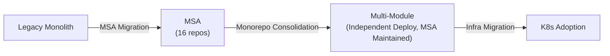
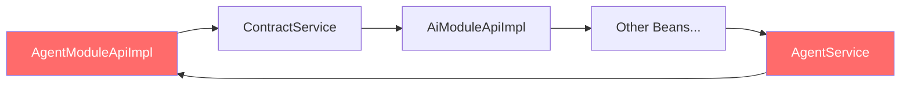
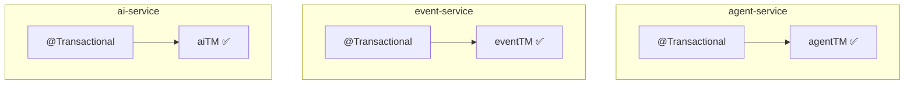
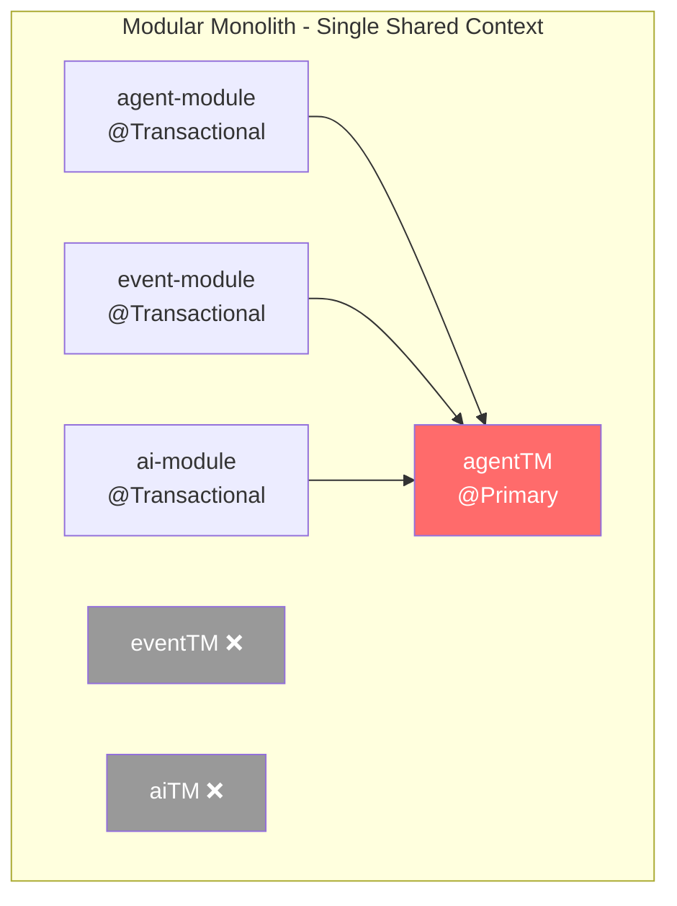
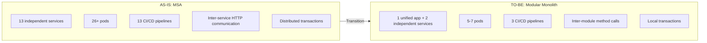

## Introduction

Hello.

I'm Jeongil Jeong, a backend developer working at a proptech platform.

Our company had successfully completed a zero-downtime migration from a legacy Java Servlet monolithic service to MSA and was operating it in production. The process wasn't easy, but we learned a great deal by experiencing the pros and cons of MSA firsthand.

While reflecting on those experiences, I wrote a blog series on MSA, and in the [final post of the MSA series](), I said this:

> I believe **"starting with a modular monolith and moving to MSA when needed"** is a wiser choice than **"MSA from the start."**

The reason I wrote that wasn't based on theory alone—it came from a question that kept nagging me during the process of migrating our monolith to MSA: "Is this really the right architecture for our team's situation?"

After much deliberation, we ultimately decided to convert our running MSA into a modular monolith. I'd like to share what led to this decision, what challenges and problems we faced during the transition, and how we solved them.

To understand this decision, I need to start with the journey our team's architecture has taken.

## The Architecture Journey

Our service's architecture has been continuously evolving since before I joined the team.

### From Legacy to MSA

I joined the team in March 2025. At that point, the team was in the middle of migrating the legacy monolithic service to MSA. There were 5 developers total, with only 2 backend engineers including myself. Over 13 services were each managed in separate Git repositories—managing 16 repos with this headcount just didn't make sense.

### To Multi-Module, Then to K8s

Modifying a single piece of shared code meant opening 16 PRs across 16 repos. About a month after joining, I [proposed a multi-module transition]() and consolidated everything into a single monorepo. Each service was still deployed independently to maintain the MSA structure, but shared code management became much easier.

Around the same time, I also proposed [adopting Kubernetes](). We had been running all containers on a single large instance, which was reaching its limits. Fortunately, we were accepted into the GCP Startup Program, and the credits resolved our cost concerns, allowing us to proceed with adoption.



### And Then to Modular Monolith

Looking back, I think I kept asking the same question at every transition: **"Is this structure really the right fit for our team right now?"**

Multi-repo didn't fit, so we switched to multi-module. The single instance hit its limits, so we adopted K8s. And this time, we took a hard look at MSA itself.

## Was MSA Right for Us?

### Running MSA Solo

While writing the MSA series, I shared my view that "if the team and company are small, MSA is overengineering." That was written straight from what I was experiencing with our team.

When I joined, there were 5 developers with 2 backend engineers including myself. In the second half of 2025, headcount was reduced due to business downturn, leaving only 2 developers. I handle all backend services, and the other person handles frontend. In other words, I became the sole person operating every backend service—on top of managing the K8s infrastructure.

When I wrote about it, I put it mildly: "For small teams, a monolith might be more appropriate." But what I was actually experiencing was closer to a conviction: "This absolutely needs to change."

Running over 13 services solo while also developing new features was harder than you'd think. Understanding inter-service call relationships, tracing the origin of failures, managing 13 deployment pipelines—it all piled up.

### Cost: No Longer Deferrable

Honestly, operational burden alone might not have been enough to justify the transition. I could have toughed it out thinking "it's hard, but things are running." But when cost issues stacked on top, the situation changed.

As I briefly mentioned, we had been receiving credits through the GCP Startup Program for a year. It was a generous amount that allowed us to build and run proper infrastructure—but these credits expire in April 2026.

We're a startup. Naturally, we don't have much financial room, and since adopting K8s and adding a dev environment, our infrastructure costs had increased roughly 2.5 to 3 times.

In a typical K8s + MSA setup, you run at least 2 pods per service for high availability. With 13 services, that's a minimum of 26 pods. Add shared infrastructure services like Config Server and Elasticsearch, and the resource footprint grows even more.

Running this way was only possible because of credits. Without them, maintaining this structure would have been realistically unaffordable.

**MSA is expensive.** There's a [well-known case where Amazon Prime Video's team switched from MSA to a monolith and cut costs by 90%](https://www.docker.com/blog/do-you-really-need-microservices/)—and that was no longer someone else's story. It was our reality.

### The MSA Benefits We Weren't Actually Enjoying

Thinking about costs and reflecting on MSA, I reconsidered something. I believe the core advantage of MSA is **independence**—independent deployment per service, independent scaling, and fault isolation. But were these benefits actually meaningful in our team's situation?

To be honest, no matter how I thought about it, the answer to "Does our service really need to trade complexity for this independence?" was "Not really."

**Independent deployment** sounds great, but with a small team (1–2 people, 5 at most), deploying different services simultaneously was easily coordinated through simple communication. **Independent scaling** sounds great, but our traffic patterns weren't drastically different across services. **Fault isolation** sounds great, but in reality, the HTTP communication between services itself was often the point of failure.

Meanwhile, the things we were enduring because of MSA were substantial. We always had to account for network latency and failure potential in inter-service communication. We had implemented orchestrator-based distributed transactions to manage. We had type verification issues between services.

From my personal experience, **the moment MSA's independence becomes truly necessary is when the company grows so large that a single team can no longer handle all services**. When services get too big and traffic becomes too much for a single service to handle, that's when you can transition to MSA—and at that point, you'll be happily dancing because it means the company is doing well.

Ultimately, **when we weighed the operational burden, cost issues, and the MSA benefits we were actually leveraging, it became clear that now was the right time to transition to a modular monolith.**

## Transition Design

### Why Modular Monolith?

After deciding to transition, the first question was what structure to transition to. We'd decided on going monolithic, but we needed to choose between a simple monolith and a modular monolith.

The deliberation wasn't long. The services were already modularized from running as MSA, and we thought a modular monolith would let us preserve the existing module structure as much as possible. A single application that's internally divided into modules seemed like the best fit for our team's situation.

The synchronous HTTP calls between services just needed to be abstracted and replaced with inter-module method calls, so we expected the transition to be relatively smooth.

The earlier multi-module transition also played a big role. If we still had 16 separate repos, we would have needed to consolidate repos, unify versions, and extract common modules all as part of this effort. Since that work was already done, we could focus solely on changing inter-module communication and merging everything into a single application.

### What to Merge, What to Keep Separate

After deciding on the modular monolith, we needed to figure out which services to consolidate and which to keep independent. To state the conclusion upfront: we consolidated multiple services into a single application, but **kept notification-service and batch-service as independent deployment units**.

The notification-service handles sending notifications like KakaoTalk alerts, emails, and SMS. Its traffic pattern was significantly different from other services. There were cases requiring bulk sends at specific times, so it needed to scale independently. We believed that not everything should be merged—some things need to stay separate.

The batch-service handles batch jobs, which inherently have different characteristics from regular transactions, making independent management more appropriate. Some batch jobs can run for extended periods, and we wanted to isolate them so they wouldn't impact other services' performance.

The remaining services were consolidated into a single Spring Boot application (`ModularMonolithApplication`).

```
Previous MSA (13 independent services)
├── agent-service      (Hexagonal + CQRS)
├── apart-service      (Hexagonal + CQRS)
├── ai-service         (Layered)
├── chat-service       (Layered)
├── ... 13 independent deployment units total

After: Modular Monolith
├── app/                          # Single deployment unit
│   ├── agent-module/
│   ├── apart-module/
│   ├── ai-module/
│   ├── ... 11 modules
│   └── common/
├── notification-service/         # Independent deployment maintained
└── batch-service/                # Independent deployment maintained
```

### Why We Didn't Consolidate the Database

Our company's database had been using a schema-per-service structure. I wasn't on the team when the MSA migration decision was made, so I can't say exactly why schema-per-service was chosen, but I suspect it was designed to maximize inter-service independence while keeping costs in mind.

Given this situation, we also considered whether to merge everything into a single schema as part of the service consolidation. However, we decided to **keep the existing schema separation (schema-per-service) as is**.

There were two reasons.

First, we wanted to preserve the flexibility to transition back to MSA at any time. Since the databases were already separated by service, if we ever needed to split services again, there'd be no additional work needed on the DB side. There was no reason to merge something that was already separated.

Second, we were concerned about issues that could arise during DB migration. Table name collisions, migration script authoring, data consistency verification... There was already plenty to do with just the application-level consolidation, and touching the DB would increase risk too much. Some services also used the CQRS pattern, with read and write models in different schemas—merging those would have been more complex than it seemed.

That said, this decision did lead to a new challenge: multi-DataSource configuration, which I'll cover later.

### ModuleApi Design

As briefly mentioned earlier, we also needed to decide how modules would call each other. In the existing MSA, synchronous communication was handled via HTTP through FeignClient. In a modular monolith, everything runs in the same JVM, so HTTP communication becomes unnecessary.

We chose to define ModuleApi interfaces in the `common` module as abstractions, with each module providing its own implementation.

```kotlin
// Before: HTTP call via FeignClient
@FeignClient(name = "agent-service")
interface AgentFeignClient {
    @GetMapping("/api/v1/agents/{id}")
    fun getAgent(@PathVariable id: Long): ApiResponse<AgentDetailResponse>
}

// Caller side
val agent = agentFeignClient.getAgent(id).data!!  // ApiResponse unwrapping needed
```

```kotlin
// After: Direct ModuleApi call
interface AgentModuleApi {
    fun getAgent(id: Long): AgentDetailResponse  // Direct data return
}

// Caller side
val agent = agentModuleApi.getAgent(id)  // No wrapping/unwrapping
```

One design decision we made here was that unlike FeignClient which returned HTTP responses wrapped in `ApiResponse<T>`, ModuleApi would **return data directly**. Wrapping in `ApiResponse` and then unwrapping with `.data!!` within the same process felt like meaningless overhead.

We created 9 ModuleApi interfaces in total, and thanks to this decision, `.data!!` unwrapping code was eliminated across all call sites.

### Converting 11 Services One by One

After finishing the ModuleApi interface design, we proceeded to convert all 11 services into library modules one by one. Each service followed the same pattern:

1. Disable bootJar and enable jar in `build.gradle.kts`
2. Remove `@SpringBootApplication` from the Application class
3. Implement ModuleApiImpl
4. Replace FeignClient references with ModuleApi
5. Remove `ApiResponse.ofSuccess()` wrapping in test code

Repeating this for 11 services was honestly pure labor. It wasn't technically difficult since it was mechanical work, but the volume was significant. Convert, check the build, run tests... at least 11 iterations.

One of the biggest changes during this process was the elimination of distributed transactions. In MSA, we had implemented orchestrator-based distributed transactions to ensure data consistency across services. Running within the same JVM meant we could replace them with local transactions. The complex compensation logic of distributed transactions was no longer needed—a single `@Transactional` now guaranteed atomicity.

As a side note, notification-service had always been excluded from distributed transactions because compensating transactions couldn't undo already-sent notifications. So keeping it as an independent service posed no issues from a distributed transaction perspective.

I initially thought "this might be done quicker than expected," but the problems that surfaced after integration far outnumbered the integration work itself.

## Problems Encountered During Transition

### Bean Name Conflicts

After converting all 11 services to library modules, I tried starting `ModularMonolithApplication`. I thought "this should work now"—but `ConflictingBeanDefinitionException` blew up.

The cause: classes like S3Config and SnsEventPublisher existed with identical names across multiple modules. **Spring's bean name registry is flat.** Since Spring manages bean names and definitions in a HashMap-like structure, classes with the same name collide even if they're in different packages.

In MSA, each service had its own independent Spring Context, so having an `S3Config` class in multiple services was perfectly fine. But in a modular monolith, beans from all 11 modules load into a single Context, making conflicts inevitable.

We resolved this by renaming classes (`S3Config` → `AgentS3Config`) or explicitly assigning bean names (`@Component("agentSnsEventPublisher")`). In MSA, naming didn't require much attention, but in a monolith, it became something we had to actively manage.

### Circular References

After resolving bean name conflicts and restarting, we hit infinite circular reference errors.

```
agentModuleApiImpl → contractService → aiModuleApiImpl → ... → agentModuleApiImpl
```

Each service referenced ModuleApi interfaces, and ModuleApiImpl classes referenced other services' ModuleApis, creating infinite circular references.



HTTP communication in MSA doesn't appear in the bean dependency graph. When Service A calls Service B via HTTP, it has nothing to do with B's bean initialization. It's just a network call at runtime—it's not part of Spring's managed dependency relationships.

But in a modular monolith, Module A directly references Module B's beans, so bidirectional references immediately become circular dependencies. **In MSA, circular references didn't surface thanks to HTTP communication. Switching to direct calls exposed them.**

We initially considered `allow-circular-references=true`, but that just hides the real circular references, so we decided against it. Instead, we chose to add `@Lazy` to all ModuleApi injection points.

```kotlin
@Service
class ContractService(
    @Lazy private val aiModuleApi: AiModuleApi,
    @Lazy private val agentModuleApi: AgentModuleApi
) { ... }
```

With `@Lazy`, a proxy is injected instead of the actual bean, and the real bean is fetched only on first use. This prevents the circular reference at initialization time while functioning correctly at runtime.

We added `@Lazy` to about 50 injection points and documented the reason and usage examples in KDoc for all 9 ModuleApi interfaces, so that future developers adding new ModuleApis wouldn't run into the same issue.

To be honest, I'm aware that `@Lazy` is more of a workaround than a fundamental solution. It doesn't eliminate the circular dependency itself—it just defers it from initialization time to runtime. The proper fix would be to restructure module dependencies to be unidirectional, or to use event-based communication for reverse-direction calls. There's also the risk that bean wiring issues surface at runtime rather than at startup.

However, realistically speaking, bidirectional calls between services already existed in the MSA, and redesigning all dependency directions during the transition would have blown up the scope. For now, we chose to stabilize the transition with `@Lazy` and incrementally restructure inter-module dependency directions going forward—a pragmatic choice.

### Multi-DataSource Configuration

As I mentioned earlier, we decided not to consolidate the databases. I believe that decision was correct, but it meant we had to independently connect each schema—giving us the challenge of connecting 11 databases simultaneously from a single application.

In MSA, each service only needed to connect to its own database. agent-service connected to agent DB, chat-service to chat DB, and so on. But in the modular monolith, all 11 databases needed to be connected from a single application.

We configured a DataSourceConfig, EntityManagerFactory, and TransactionManager for each module, using `@EnableJpaRepositories(basePackages=...)` to scope the scanning. One of them needed `@Primary`, and `agentTransactionManager` took on that role.

This part went smoothly enough. However, this `@Primary` setting would later come back as the scariest problem.

### Build-Related Issues

After resolving module conversion, bean conflicts, and circular references, build issues emerged next.

There was a **REST Docs build circular dependency** problem—in library modules, the `jar.dependsOn("buildDocument")` chain was calling processResources again, creating cycles between build tasks. Solving this taught me the clear difference between Gradle's `dependsOn` and `mustRunAfter`. `dependsOn` creates a dependency relationship that can form cycles, while `mustRunAfter` only guarantees execution order without creating dependency edges.

There was also a **QuerydslConfig + MyBatis conflict**. The data-module only used MyBatis, but the shared QuerydslConfig was annotated with `@Configuration` and got scanned across all modules, failing when it couldn't find an `EntityManagerFactory`. We fixed this with `@AutoConfiguration` + `@ConditionalOnBean(EntityManagerFactory::class)` to activate it only in modules that use JPA.

Beyond these, cleaning up unnecessary dependencies caused transitive dependencies like Apache `ContentType` to disappear, resulting in compile errors. URL mapping conflicts popped up, ConfigurationProperties scanning broke... issue after issue. Fix one, another appears. Fix that, something else breaks. Honestly, at this point it felt like there was no end in sight.

## @Transactional Mismatch - The Scariest Problem

The problems described above all manifested as errors during build or startup, so they were at least discoverable. Once discovered, you can fix them. But this problem was different.

The app started successfully, tests passed, and I thought we were done—then a runtime exception occurred on the dev server.

```
TransactionRequiredException: no transaction is in progress
```

The first error hit ai-module. Code that injected EntityManager directly with `@Qualifier("aiEntityManager")` was using a bare `@Transactional`. Tracing the cause revealed that **every bare `@Transactional` was using `agentTransactionManager`**.

### Why This Happened

Remember when I mentioned setting `@Primary` on `agentTransactionManager` during multi-DataSource configuration? When `@Primary` is set, Spring defaults to the `@Primary` bean whenever it doesn't know which TransactionManager to use.

In MSA, each service had only one TransactionManager, so simply annotating with `@Transactional` was sufficient.



But in the modular monolith, 11 TransactionManagers all load into a single Context. Using a bare `@Transactional` (without specifying a transactionManager) means the `@Primary` `agentTransactionManager` captures everything.



### Why This Was Truly Terrifying

What made this problem truly terrifying was that **in most cases, it appeared to work without errors**. At the service level, a transaction opens with agentTM, and internally each Repository opens its own module-specific TM transaction separately—so on the surface, everything looks fine. But JPA dirty checking doesn't work, and atomicity across multiple Repository calls isn't guaranteed. It becomes a **silent bug**.

In practice, only two places actually threw errors: ai-module and event-module. The ai-module case involved directly injecting EntityManager via `@Qualifier`, and event-module had a `@Lock(PESSIMISTIC_WRITE)` + bare `@Transactional` combination. Pessimistic locks only work within a transaction, and the agentTM transaction isn't a transaction for the eventDB session. Only cases that explicitly required a transaction threw errors—the rest of the modules would have run silently broken.

Thinking that only 2 out of 8 modules surfaced as errors was quite chilling.

### Solving with Meta-Annotations

As a solution, we created module-specific custom `@Transactional` meta-annotations.

```kotlin
@Target(AnnotationTarget.FUNCTION, AnnotationTarget.CLASS)
@Retention(AnnotationRetention.RUNTIME)
@Transactional(transactionManager = "eventTransactionManager")
annotation class EventTransactional
```

We replaced approximately 121 bare `@Transactional` annotations across 8 modules with module-specific meta-annotations—`@EventTransactional`, `@CommunityTransactional`, `@ApartTransactional`, and so on.

The advantage of this approach is that it's self-documenting. A bare `@Transactional` tells you nothing about which TM is being used, but `@EventTransactional` makes it immediately clear from the name alone. Since it becomes a convention, the room for error when writing new code also shrinks.

## Transition Results

Here's a summary of the transition results.



We confirmed the app starts normally with no business logic changes. Previously, traffic was distributed to each service via K8s Ingress routing. We changed the Ingress to route everything to the modular monolith service, allowing us to transition without affecting external clients.

Only notification-service and batch-service were kept as independent deployment units, while the remaining 11 services were consolidated into a single `ModularMonolithApplication`. We also cleaned up per-service CI/CD workflow files and consolidated them into a single deployment pipeline.

The biggest infrastructure change was the pod count. Previously, with at least 2 pods per service, we needed 26+ pods. After consolidating into a single application, 2–3 pods for `ModularMonolithApplication` are sufficient. The total pod count dropped to less than 1/5. This brought us to a level that's sustainable even after the credits expire in April.

We haven't precisely measured the cost savings yet, so we'll operate through March and update this post with the numbers.

## Lessons Learned

### Problems Don't Disappear with Modular Monolith

The biggest takeaway from this transition was that **problems that didn't exist thanks to MSA's context separation immediately surface the moment you merge everything together**. Naturally, when the architecture changes, the problems you face change too.

Originally, because each was a separate service, even identical bean names didn't cause conflicts. Bidirectional calls between services didn't cause circular references because HTTP communication doesn't appear in the bean dependency graph. Bare `@Transactional` always used the correct TM because there was only one per service.

In MSA, you didn't have to worry about any of these things. But the moment you consolidate into a modular monolith, context separation disappears and everything must coexist in a single Context. You no longer have to worry about MSA's problems, but you have a whole new set of concerns.

If you're considering this kind of transition, I'd recommend being aware of this in advance.

Separately, we also experienced CI test build times spiking to 45 minutes after the transition, which I'll cover in a follow-up post.

### Silent Bugs Are the Scariest

Personally, the most nerve-wracking issue in this transition was the `@Transactional` TM mismatch. Build errors and startup failures are at least visible—you can fix what you can see. But this problem looked perfectly fine on the surface while transactions were internally bound to the wrong DataSource.

Out of 8 modules, only ai-module and event-module—just 2—actually threw errors. The remaining 6 would have stayed as silent bugs. This experience firmly reinforced how dangerous it is to say "seems to be working fine" after a major architectural change.

I think this is exactly why developers love compile errors. Compile errors clearly tell you "this is the problem," but **silent bugs leave you in the worst possible state—not even knowing whether a problem exists**.

### Making the Best Decision at Each Moment

Looking at all the problems described above, you might ask "Was switching to modular monolith really the right call?" I believe it was.

Inter-service communication complexity dropped dramatically. When tracing code, instead of following HTTP calls, you just follow method calls—debugging became much more straightforward. The complexity of distributed transactions was replaced by local transactions, and we only need to manage a single deployment pipeline.

Most importantly, if we hadn't addressed the cost problem, the financial burden starting April when credits expire would have been significant. This was a critical issue directly tied to the company's bottom line, and just the fact that pod count dropped from 26+ to a handful makes me glad we cleaned this up when we did.

That said, we haven't quantitatively measured the cost savings yet, so as mentioned above, we'll operate through March and update with the cost reduction figures.

## Closing

Looking back, our service's architecture has been continuously evolving since I joined the team. From legacy monolith to MSA, from individual repos to multi-module, from Docker Compose to K8s, and now from MSA to modular monolith.

Every time, I asked the same question: **"Is this really the best choice for our team's situation right now?"** And every time, the answer was different. Team size, service scale, and cost structure all kept changing over time.

I believe it's natural for architecture to evolve as services mature and requirements change. That's why what matters isn't which architecture you choose, but having a structure that can flexibly adapt to change.

The day may come again when we need to transition back to MSA. Designing a structure that lets us respond more flexibly when that moment arrives is another important lesson from this transition.

I hope this post helps those of you facing similar decisions.

Thank you for reading this long article.

## References

### Related Posts
- [From 16 Repositories to One - MSA Multi-Module Migration Story]()
- [[MSA Deep Dive 7/7] Do We Really Need MSA?]()
- [From No Dev Server to GitOps: Our Kubernetes Adoption Story from Scratch]()
