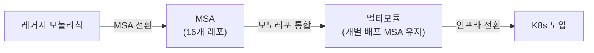
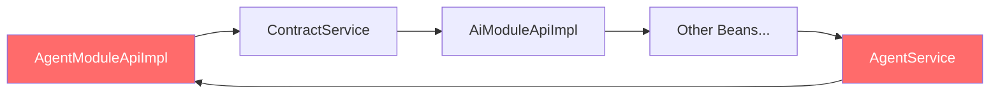
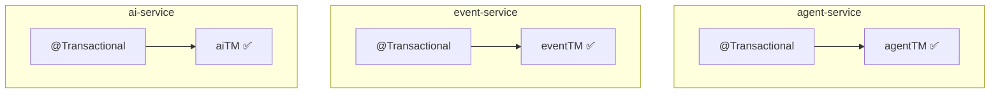
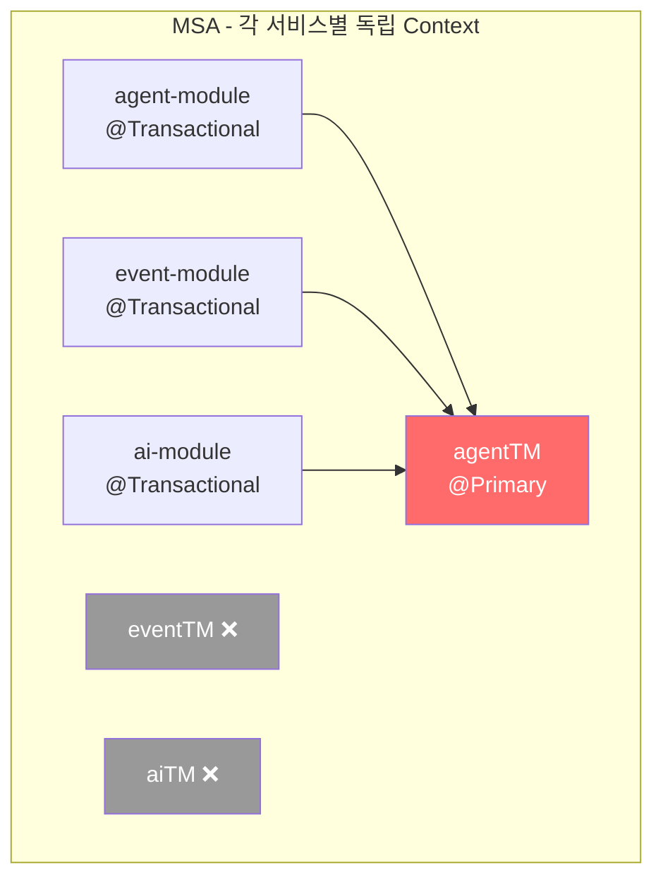
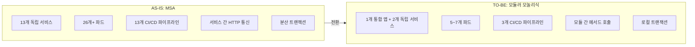

안녕하세요.

저는 프롭테크 플랫폼에서 백엔드 개발자로 근무 중인 정정일입니다.

저희 회사는 모놀리식 아키텍처로 이루어진 자바 서블릿 레거시 서비스를 MSA로 무중단 마이그레이션을 성공적으로 완료하고 운영 중에 있었습니다. 그 과정이 쉽지는 않았지만, MSA의 장점과 단점을 몸소 체험하면서 많은 것을 배울 수 있었죠.

이와 관련된 경험을 곱씹어 보면서 MSA에 관한 고찰 시리즈도 블로그에 작성했는데, [MSA 시리즈 마지막 편]()에서 저는 이런 이야기를 했습니다.

> 저는 **"처음부터 MSA"** 보다는 **"모듈러 모놀리식에서 시작해서 필요할 때 MSA로"** 가 좀 더 현명한 선택이지 않나 싶습니다.

이 문장을 적게된 이유가 단순히 이론에 기반해 적은게 아닌 회사에서 모놀리식 아키텍처를 MSA로 전환하는 과정들 속에 "과연 이게 우리 팀 상황에서 맞는 구조인가?"라는 질문이 계속 떠올랐기 때문입니다.

그런데 고심끝에 결국 운영 중인 MSA를 모듈러 모놀리식으로 전환하기로 결정했습니다. 어떤 이유에서 이런 결정을 내리게 됐는지, 전환 과정에서 어떤 고민과 문제들이 있었는지, 그리고 어떻게 해결했는지 공유하고자 합니다

먼저 이 결정을 이해하려면 저희 팀의 아키텍처가 걸어온 길부터 이야기해야 할 것 같습니다.

## 아키텍처가 걸어온 길

저희 회사 서비스의 아키텍처는 제가 팀에 합류하기 전부터 계속 변화해왔습니다.

### 레거시에서 MSA로

저는 2025년 3월에 팀에 합류했는데, 합류 시점에 팀은 레거시 모놀리식 서비스를 MSA로 전환하는 과정 중에 있었습니다. 당시 개발자는 총 5명, 그 중 백엔드는 저 포함 2명이었습니다. 13개가 넘는 서비스가 각각 개별 Git 레포지토리로 관리되고 있었는데, 이 인원으로 16개 레포를 관리한다는 건 맞지 않다고 생각했습니다.

### 멀티모듈로, 그리고 K8s로

공통 코드 하나 수정하는 데 16개 레포에 PR을 16개 올려야 하는 구조였습니다. 팀 합류 한 달쯤 됐을 때 [멀티모듈 전환을 제안]()해서 하나의 모노레포로 통합했습니다. 배포는 각 서비스별로 따로해 MSA는 유지하며 공통 코드 관리를 편하게 하는 구조로 바꿨죠.

비슷한 시기에 [쿠버네티스 도입]()도 제안했습니다. 큰 인스턴스 하나에 모든 컨테이너를 올려 운영하던 구조가 한계에 달했는데, 마침 GCP 스타트업 프로그램에 선정되면서 크레딧으로 비용 문제가 해결돼 도입을 결정할 수 있었습니다.



이후 MSA 서비스를 Bounded Context에 따라 합치기도 하고, 또 레거시 서비스에서 MSA로 마이그레이션 하기도 하면서 최종적으로 서비스 수가 13개로 줄어들게 됐습니다.

### 그리고 모듈러 모놀리식으로

돌이켜보면 각 전환마다 항상 같은 질문을 던졌던 것 같습니다. **"지금 우리 팀 상황에서 이 구조가 정말 맞나?"**

멀티레포가 맞지 않아서 멀티모듈로 바꿨고, 단일 인스턴스의 한계에 달해서 K8s를 도입했습니다. 그리고 이번에는 MSA 자체를 돌아보게 됐습니다.

## MSA, 우리에게 맞았는가

### 혼자서 MSA를 운영한다는 것

MSA에 관한 고찰 시리즈를 적으면서 "팀이 그리고 회사가 작다면 MSA는 오버엔지니어링이라고 생각한다"라는 제 주관을 이야기 했었는데, 제가 저희 팀 상황에 의해 느낀 그대로를 적은 것이었습니다.

합류 당시에는 개발자 5명에 백엔드 개발자가 저 포함 2명이었는데, 2025년 하반기에 경영 악화로 인원이 감축되면서 개발자 2명만 남게 됐습니다. 저는 백엔드, 나머지 한 분은 프론트엔드를 담당하고 계시거든요. 즉 모든 백엔드 서비스를 운영하는 사람은 저 혼자가 된 겁니다. 거기에 K8s 인프라 관리까지 제가 병행하고 있구요.

글로 적을 때는 "소규모 팀에서는 모놀리식이 맞지 않나 싶습니다" 정도로 가볍게 적었지만, 실제로 몸으로 겪고 있는 저는 "이건 진짜 바꿔야 한다"라는 확신에 가까운 생각을 하고 있었습니다.

혼자서 13개가 넘는 서비스를 운영하면서 기능 개발까지 한다는 건 생각보다 쉽지 않았습니다. 서비스 간 호출 관계를 파악하는 것도, 장애가 발생했을 때 어떤 서비스에서 시작된 문제인지 추적하는 것도, 배포 파이프라인을 13개나 관리해야 하는 것도 부담으로 다가왔습니다.

### 비용, 더 이상 미룰 수 없는 문제

사실 운영 부담만으로는 전환을 결정하기 어려웠습니다. 솔직히 "좀 힘들어도 제가 조금 고생하면 돌아는 가니까" 하면서 버틸 수도 있었으니까요. 그런데 비용 문제가 겹치면서 상황이 달라졌습니다.

위에서 잠깐 언급했지만 저희는 GCP 스타트업 프로그램으로 1년간 크레딧을 지원받고 있었습니다. 꽤나 여유 있는 금액이였고 덕분에 제대로 된 인프라를 구축해서 운영할 수 있었는데, 이 크레딧이 2026년 4월에 끝나게 됩니다.

저희 회사는 스타트업입니다. 당연하게도 금전적 여유가 없는 상태인데 K8s로 전환하면서 개발서버까지 도입해 인프라 비용이 약 2.5~3배 증가한 상태였죠.

보통 K8s, MSA 구조에서는 고가용성을 위해 서비스별로 최소 2개씩 파드를 운영하곤 합니다. 13개 서비스면 최소 26개 파드가 필요한 거죠. 여기에 Config Server, Elastic Search와 같은 공통 인프라 서비스까지 더하면 리소스는 더 늘어납니다.

크레딧이 있으니까 부담없이 이런 운영이 가능했던 거지 크레딧이 없어지면 이 구조를 유지하기가 현실적으로 어려웠습니다.

**MSA는 돈이 많이 들어갑니다.** [Amazon Prime Video 팀이 MSA를 모놀리식으로 전환하면서 비용을 90% 절감했다는 사례](https://www.docker.com/blog/do-you-really-need-microservices/)가 있는데, 이게 남의 이야기가 아니라 저희의 현실이 된 거죠.

### 우리가 누리지 못하고 있던 MSA의 장점

비용 문제를 생각하며 그리고 MSA에 관한 고찰을 하며 한 가지를 돌아보게 됐습니다. MSA의 핵심 장점은 **독립성**이라고 생각합니다. 서비스별 독립 배포, 독립 확장, 장애 격리. 그런데 이 장점들이 저희 팀 상황에서 정말 의미가 있었는지에 대해 말이죠.

솔직히 말씀드리면 아무리 생각해봐도 "과연 우리 서비스가 복잡성이라는 트레이드 오프를 통해 이 독립성을 확보해야할 정도의 서비스인가?" 라는 질문에 저는 "그렇진 않다"라는 답이 나왔습니다.

**독립 배포**라고 하지만 어차피 소규모(1~2명 팀원이 늘어봐야 5명)이기 때문에 서로 다른 서비스를 동시에 배포해야하는 일도 간단하게 의사소통하여 어려움없이 가능했습니다. **독립 확장**이라고 하지만 트래픽이 서비스별로 극단적으로 차이나는 상황이 아니었습니다. **장애 격리**라고 하지만 오히려 서비스 간 HTTP 통신 자체가 장애 포인트가 되는 경우도 많았습니다.

반면 MSA 때문에 감수하고 있던 것들은 꽤 있었습니다. 서비스 간 통신에서 네트워크 레이턴시와 실패 가능성을 항상 고려해야 했고, 오케스트레이터 기반의 분산 트랜잭션을 구현해서 관리해야 했으며, 서비스간 객체 타입 검증 문제도 있었습니다.

제가 개인적으로 느낀 MSA의 **독립성이 필요한 순간은 회사가 너무 커져서 한 팀이 모든 서비스를 다루기 어려워지는 시점**이였습니다. 서비스가 너무 커지고 트래픽을 한 서비스가 감당하기 어려워지는 시점이 오면, 그때 가서 MSA로 전환해도 늦지 않다고 생각합니다. 이때는 회사가 잘됐다며 덩실덩실 기쁜 마음으로 전환할 수 있을 거라고 생각합니다.

결국 **운영 부담과 비용 문제, 그리고 우리가 실제로 누리고 있던 MSA의 장점을 종합적으로 고려했을 때, 지금이 모듈러 모놀리식으로 전환할 적기라는 판단이 들었습니다.**

## 전환 설계

### 그렇다면 왜 모듈러 모놀리식인가

전환을 결정하고 나서 가장 먼저 고민했던 건 어떤 구조로 전환할 것인가였습니다. 모놀리식으로 가는 건 결정했지만, 단순한 모놀리식 아키텍처로 갈지, 아니면 모듈러 모놀리식으로 갈지를 선택해야했죠.

사실 고민은 길지 않았습니다. 이미 MSA로 운영하면서 각 서비스가 모듈화 되어 있었고, 모듈러 모놀리식으로 가면 기존의 모듈 구조를 최대한 살릴 수 있을 거라고 생각했거든요. 단일 애플리케이션이지만 내부적으로는 모듈로 나누어서 관리하는 구조가 저희 팀 상황에 가장 잘 맞는다고 판단했습니다.

기존에 서비스간 Http 통신을 통해 동기적으로 호출하던 부분들은 추상화하여 모듈간 메소드 호출로만 바꿔주면 되니까, 전환 작업도 비교적 수월할 거라고 판단했습니다.

그리고 이전에 멀티모듈 전환을 해놓은 것도 컸습니다. 만약 16개 개별 레포가 그대로였다면 레포 통합, 버전 통일, 공통 모듈 추출까지 이번에 함께 해야 했을 텐데, 이미 그 작업들을 마쳐놓은 덕분에 모듈 간 통신 방식을 바꾸고 하나의 애플리케이션으로 합치는 데만 집중할 수 있었습니다.

### 무엇을 합치고, 무엇을 남길 것인가

모듈러 모놀리식으로 전환을 결정하고 나서는 어떤 서비스를 통합하고 어떤 서비스를 독립으로 유지할지 고민해야했습니다. 결론부터 말씀드리자면 저희는 여러 서비스를 하나의 애플리케이션으로 통합하되, **notification-service(알림 서비스)와 batch-service는 독립 배포 단위로 유지**하기로 결정했습니다.

notification-service는 알림톡/메일/SMS와 같은 알림을 발송하는 역할을 맡고있는 서비스로 특성상 트래픽 패턴이 다른 서비스와 크게 달랐습니다. 특정 시간에 대량 발송이 필요한 경우가 있기도 해 독립적으로 스케일링할 수 있어야 했거든요. 무조건 전부 합치는 게 아니라 필요한 건 남겨둬야 한다고 생각했습니다. 

또 batch-service는 배치 작업을 담당하는 서비스로, 배치 작업은 일반적으로 트랜잭션과는 다른 특성을 가지고 있기 때문에 독립적으로 관리하는 게 낫다고 판단했습니다. 그리고 batch 작업중에 실행 시간이 오래 걸리는 작업이 있을 수 있는데, 이런 작업이 다른 서비스의 성능에 영향을 주지 않도록 격리하는 게 좋다고 생각했습니다.

나머지 서비스들은 하나의 Spring Boot 애플리케이션(`ModularMonolithApplication`)으로 통합하기로 했습니다.

```
기존 MSA (13개 독립 서비스)
├── agent-service      (Hexagonal + CQRS)
├── apart-service      (Hexagonal + CQRS)
├── ai-service         (Layered)
├── chat-service       (Layered)
├── ... 총 13개 독립 배포 단위

전환 후 모듈러 모놀리식
├── app/                          # 단일 배포 단위
│   ├── agent-module/
│   ├── apart-module/
│   ├── ai-module/
│   ├── ... 11개 모듈
│   └── common/
├── notification-service/         # 독립 배포 유지
└── batch-service/                # 독립 배포 유지
```

### DB는 왜 통합하지 않았나

기존에 저희 회사 DB는 Schema-per-service 구조로 되어 있었습니다. MSA 전환을 하는 의사결정 과정에 제가 팀에 있지 않았다보니 어떤 연유로 Schema-per-service 구조로 시작하게 됐는지는 정확히 알 수 없지만, 아마도 서비스 간 독립성을 최대한 보장하되 비용적인 측면을 고려해 그렇게 설계하지 않았을까 추측해봅니다.

이런 상황에서 서비스를 통합하면서 DB도 하나의 Schema로 합쳐야 하는지 역시 고민했습니다. 그러나 결론부터 말하면 **기존의 스키마 분리(schema-per-service)를 그대로 유지**하기로 했습니다.

이유는 두 가지였습니다.

첫째, 언제든 다시 MSA로 전환할 수 있는 유연성을 남겨두고 싶었습니다. DB가 이미 서비스별로 분리되어 있으니 나중에 다시 서비스를 분리해야 할 상황이 오더라도 DB 쪽에서는 추가 작업 없이 넘어갈 수 있거든요. 이미 되어 있는 걸 굳이 합칠 이유가 없다 판단했습니다.

둘째, DB 마이그레이션 과정에서 발생할 문제들이 우려됐습니다. 테이블 이름 충돌, 마이그레이션 스크립트 작성, 데이터 정합성 검증... 애플리케이션 레벨의 통합만으로도 충분히 해야 할 일이 많은데 DB까지 건드리면 리스크가 너무 커진다고 판단했습니다. 또 CQRS 패턴을 적용한 서비스들도 있어서, 읽기 모델과 쓰기 모델이 서로 다른 스키마에 존재하는 상황이었는데, 이걸 하나로 합치는 작업도 생각보다 복잡할 것 같았습니다.

다만 이 결정이 멀티 DataSource 설정이라는 새로운 도전으로 이어지게 되는데, 이 부분은 뒤에서 따로 이야기하겠습니다.

### ModuleApi 설계

위에서 잠깐 언급하긴 했지만, 어떻게 모듈간 호출할지 역시 정해야 했습니다. 기존 MSA에서는 동기 통신은 FeignClient를 통해 HTTP로 구성하고 있었는데, 모듈러 모놀리식에서는 같은 JVM 안에 있으니 HTTP 통신이 필요 없게 됩니다.

그래서 `common` 모듈에 ModuleApi 인터페이스를 정의해 추상화하고, 각 모듈에서 구현체를 만드는 방식을 선택했습니다.

```kotlin
// 기존: FeignClient를 통한 HTTP 호출
@FeignClient(name = "agent-service")
interface AgentFeignClient {
    @GetMapping("/api/v1/agents/{id}")
    fun getAgent(@PathVariable id: Long): ApiResponse<AgentDetailResponse>
}

// 호출하는 쪽
val agent = agentFeignClient.getAgent(id).data!!  // ApiResponse 언래핑 필요
```

```kotlin
// 변경: ModuleApi 직접 호출
interface AgentModuleApi {
    fun getAgent(id: Long): AgentDetailResponse  // 데이터 직접 반환
}

// 호출하는 쪽
val agent = agentModuleApi.getAgent(id)  // 래핑/언래핑 없음
```

여기서 한 가지 설계적인 결정을 내렸는데, FeignClient가 `ApiResponse<T>`를 통해 Http 응답을 반환하던 것과 달리 ModuleApi는 **데이터를 직접 반환**하도록 설계했습니다. 같은 프로세스 안에서 `ApiResponse`로 감싸고 다시 `.data!!`로 꺼내는 건 의미 없는 오버헤드라고 생각했거든요.

총 9개의 ModuleApi 인터페이스를 만들었고, 이 결정 덕분에 호출측 코드에서 `.data!!` 언래핑 코드가 일괄 제거됐습니다.

### 11개 서비스를 하나하나

ModuleApi 인터페이스 설계를 마치고 나서는 11개 서비스를 하나하나 라이브러리 모듈로 전환하는 작업을 진행했습니다. 각 서비스마다 같은 패턴의 작업을 반복했습니다.

1. `build.gradle.kts`에서 bootJar를 비활성화하고 jar를 활성화
2. Application 클래스에서 `@SpringBootApplication`을 제거
3. ModuleApiImpl을 구현
4. FeignClient 참조를 ModuleApi로 교체
5. 테스트 코드에서 `ApiResponse.ofSuccess()` 래핑 제거

11개 서비스에 대해 이 작업을 반복하는 건 솔직히 노동에 가까웠습니다. 기계적인 작업이라 어렵지는 않았지만 양이 꽤 됐거든요. 변환하고, 빌드 확인하고, 테스트 돌리고... 를 최소 11번 반복해야 했죠.

이 과정에서 가장 큰 변화 중 하나는 분산 트랜잭션이 사라진 것이었습니다. MSA에서는 서비스 간 데이터 정합성을 보장하기 위해 오케스트레이터 기반의 분산 트랜잭션을 구현해서 관리하고 있었는데, 같은 JVM 안에서 동작하게 되면서 로컬 트랜잭션으로 대체할 수 있게 됐습니다. 분산 트랜잭션의 복잡한 보상 로직이 필요 없어지고 그냥 `@Transactional` 하나로 원자성이 보장되는 거죠.

참고로 notification-service는 외부 알림 발송 특성상 보상 트랜잭션을 해도 이미 발송된 알림에 영향을 줄 수 없어서 원래부터 분산 트랜잭션에서 제외되어 있었습니다. 그래서 이 서비스를 독립으로 분리해도 분산 트랜잭션 측면에서는 문제가 없었습니다.

처음에 "생각보다 금방끝나지 않을까"라고 가볍게 생각했는데, 코드 통합 자체보다 통합 후에 터지는 문제들이 훨씬 많았습니다.

## 전환하면서 마주한 문제들

### 빈 이름 충돌

11개 서비스를 전부 라이브러리 모듈로 전환하고 `ModularMonolithApplication`을 올려봤습니다. "이제 되겠지" 싶었는데 `ConflictingBeanDefinitionException`이 터졌습니다.

원인을 보니 S3Config, SnsEventPublisher 같은 클래스들이 여러 모듈에 동일한 이름으로 존재하고 있었습니다. **Spring의 빈 이름 레지스트리는 flat합니다.** 아무래도 스프링이 HashMap 구조로 빈 이름과 빈 정의를 관리하다보니 다른 패키지에 있어도 클래스명이 같으면 충돌합니다.

MSA에서는 각 서비스가 독립된 Spring Context를 가지니까 여러 서비스에 `S3Config`라는 클래스가 각각 있어도 아무 문제가 없었거든요. 그런데 모듈러 모놀리식에서는 11개 모듈의 빈이 전부 하나의 Context에 올라가니 충돌이 날 수밖에 없었습니다.

클래스명을 변경하거나(`S3Config` → `AgentS3Config`), 명시적으로 빈 이름을 부여하는 방식(`@Component("agentSnsEventPublisher")`)으로 해결했습니다. MSA에서는 네이밍에 크게 신경 쓸 필요가 없었는데, 모놀리식에서는 따로 관리해줘야 하는 부분이 생긴 거죠.

### 순환 참조

이제 빈 이름 충돌을 해결하고 다시 기동했더니 이번엔 무한 순환 참조 에러가 나오게 됩니다.

```
agentModuleApiImpl → contractService → aiModuleApiImpl → ... → agentModuleApiImpl
```

각 서비스가 ModuleApi 인터페이스를 참조하고, ModuleApiImpl이 다시 다른 서비스의 ModuleApi를 참조하는 구조가 되면서 무한 순환 참조가 발생한거죠.



MSA에서의 HTTP 통신은 빈 의존성 그래프에 나타나지 않습니다. A 서비스가 B 서비스를 HTTP로 호출할 때 B의 빈 초기화와는 전혀 무관하니까요. 런타임에 네트워크 호출을 할 뿐이지 Spring이 관리하는 의존성 관계에는 포함되지 않습니다.

그런데 모듈러 모놀리식에서는 A 모듈이 B 모듈의 빈을 직접 참조하기 때문에 양방향으로 참조하면 그게 곧 순환 참조가 됩니다. 모듈간 서로 의존성이 생기면서 순환 참조가 발생하게 되는겁니다. **MSA에서는 HTTP 통신 덕에 순환 참조가 발생하지 않았는데, 직접 호출로 바꾸면서 그게 드러난 거죠.**

처음에 `allow-circular-references=true` 설정을 고려했습니다만 이건 진짜 순환 참조를 감추는 것이라 사용하지 않기로 했습니다. 대신 모든 ModuleApi 주입 지점에 `@Lazy`를 추가하는 방식을 선택했습니다.

```kotlin
@Service
class ContractService(
    @Lazy private val aiModuleApi: AiModuleApi,
    @Lazy private val agentModuleApi: AgentModuleApi
) { ... }
```

`@Lazy`를 사용하면 실제 빈 대신 프록시가 주입되고, 처음 사용할 때 비로소 실제 빈을 가져옵니다. 초기화 시점의 순환은 방지하면서 런타임에는 정상 동작하는 거죠.

약 50곳에 `@Lazy`를 추가했고, 이후에 9개 ModuleApi 인터페이스에 KDoc으로 `@Lazy` 필수 이유와 사용 예시를 문서화했습니다. 나중에 새로운 ModuleApi를 추가할 때 같은 문제를 겪지 않도록요.

솔직히 `@Lazy`는 근본적인 해결이라기보다는 우회에 가깝다는 걸 알고 있습니다. 순환 참조 자체를 없앤 게 아니라 초기화 시점에서 런타임으로 미룬 것이니까요. 근본적으로 해결하려면 모듈 간 의존 방향을 단방향으로 정리하거나, 역방향 호출이 필요한 부분은 이벤트 기반으로 분리하는 게 맞습니다. 또한 `@Lazy`는 빈 연결 문제가 기동 시점이 아닌 런타임에 터진다는 리스크도 있구요.

다만 현실적으로 기존 MSA에서 서비스 간 양방향 호출이 이미 존재하는 상태에서, 전환 과정에서 의존 방향까지 전부 재설계하는 건 스코프가 너무 커진다고 판단했습니다. 지금은 `@Lazy`로 전환을 안정적으로 마무리하고, 이후 점진적으로 모듈 간 의존 방향을 정리해나가는 게 현실적인 선택이라고 생각했습니다.

### 멀티 DataSource 설정

앞서 DB를 통합하지 않기로 했다고 말씀드렸습니다. 그 결정 자체는 맞았다고 생각하는데, 대신 각 스키마를 독립적으로 연결해줘야했기 때문에 11개 DB를 하나의 애플리케이션에서 동시에 연결해야 하는 것과 같은 과제가 생겼습니다.

MSA에서는 각 서비스가 자기 DB 하나만 연결하면 됐습니다. agent-service는 agent DB, chat-service는 chat DB, 이런 식이었거든요. 그런데 모듈러 모놀리식에서는 11개 DB를 하나의 애플리케이션에서 동시에 연결해야 했습니다.

각 모듈별로 DataSourceConfig, EntityManagerFactory, TransactionManager를 설정하고, `@EnableJpaRepositories(basePackages=...)`로 스캔 범위를 한정했습니다. 여기서 하나에는 `@Primary`를 붙여야 했는데, `agentTransactionManager`가 그 역할을 맡게 됐습니다.

여기까지는 큰 문제 없이 진행됐습니다. 다만 이 `@Primary` 설정이 나중에 가장 무서운 문제로 돌아오게 됩니다.

### 빌드 관련 문제들

모듈 전환, 빈 충돌, 순환 참조를 해결하고 나니 이번엔 빌드에서 문제가 나왔습니다.

**REST Docs 빌드 순환 의존** 문제가 있었는데, 라이브러리 모듈에서 `jar.dependsOn("buildDocument")` 체인이 processResources를 다시 호출하면서 빌드 태스크간 순환이 발생한 거였습니다. 이 문제를 해결하면서 Gradle의 `dependsOn`과 `mustRunAfter`의 차이를 확실히 알게 됐습니다. `dependsOn`은 의존 관계를 만들어서 순환이 생길 수 있지만, `mustRunAfter`는 실행 순서만 보장하고 의존 엣지를 만들지 않거든요.

**QuerydslConfig + MyBatis 충돌** 문제도 있었습니다. data-module은 MyBatis만 사용하는데, 공통 QuerydslConfig가 `@Configuration`으로 모든 모듈에 스캔되면서 `EntityManagerFactory`를 찾지 못해 실패했습니다. `@AutoConfiguration` + `@ConditionalOnBean(EntityManagerFactory::class)`로 JPA를 사용하는 모듈에서만 활성화되도록 바꿔서 해결했습니다.

이 밖에도 불필요한 의존성을 정리하면서 전이 의존성으로 사용되던 Apache `ContentType`이 함께 사라져 컴파일 에러가 나거나, URL 매핑이 충돌하거나, ConfigurationProperties 스캔이 안 되는 등의 문제들이 줄줄이 나왔습니다. 하나 고치면 또 하나가 터지고, 그걸 고치면 또 다른 게 터지고... 솔직히 이 시점에서는 끝이 보이지 않는 느낌이었습니다.

## @Transactional 불일치 - 가장 무서웠던 문제

앞서 이야기한 문제들은 빌드나 기동 시점에 에러가 터지기 때문에 어찌됐든 발견은 됩니다. 발견이 되면 해결하면 되니까요. 그런데 이 문제는 달랐습니다.

앱 기동이 성공하고, 테스트도 통과해서 끝난 줄 알았는데 개발서버에서 런타임 예외가 발생했습니다.

```
TransactionRequiredException: no transaction is in progress
```

처음 에러가 터진 건 ai-module이었습니다. `@Qualifier("aiEntityManager")`로 EntityManager를 직접 주입받는 코드에서 bare `@Transactional`을 쓰고 있었는데, 원인을 추적해보니 **모든 bare `@Transactional`이 `agentTransactionManager`를 사용**하고 있었습니다.

### 왜 이런 일이 발생했나

앞서 멀티 DataSource를 설정할 때 `agentTransactionManager`에 `@Primary`를 붙였다고 말씀드렸습니다. `@Primary`가 붙어있으면 Spring은 어떤 TransactionManager를 써야 할지 모를 때 `@Primary`인 빈을 기본으로 사용합니다.

MSA에서는 각 서비스에 TransactionManager가 하나뿐이니까 `@Transactional`만 붙이면 됐습니다.



그런데 모듈러 모놀리식에서는 11개 TransactionManager가 하나의 Context에 올라갑니다. bare `@Transactional`(transactionManager를 명시하지 않은)을 사용하면 `@Primary`인 `agentTransactionManager`가 모든 걸 가져가는 거죠.



### 이게 진짜 무서웠던 이유

이 문제가 정말 무서웠던 건 **대부분의 경우 에러 없이 동작하는 것처럼 보인다**는 점이었습니다. 서비스 레벨에서 agentTM 트랜잭션이 열리고, Repository 내부에서 모듈별 TM 트랜잭션이 별도로 열리기 때문에 겉보기에는 잘 동작합니다. 다만 JPA dirty checking이 안 되고, 여러 Repository 호출 간 원자성이 보장되지 않는 **사일런트 버그**가 되는 거죠.

실제로 에러가 터진 건 ai-module과 event-module 딱 두 곳이었습니다. ai-module은 `@Qualifier`로 EntityManager를 직접 주입받는 경우였고, event-module은 `@Lock(PESSIMISTIC_WRITE)` + bare `@Transactional` 조합이었습니다. 비관적 락은 트랜잭션 안에서만 동작하는데, agentTM 트랜잭션은 eventDB 세션에 대한 트랜잭션이 아니니까요. 이렇게 명시적으로 트랜잭션을 요구하는 경우에만 에러가 터졌고, 나머지 모듈들은 모른 채 운영될 뻔했습니다.

8개 모듈 중에 에러로 발견된 건 단 2개뿐이었다고 생각하니 꽤 아찔했습니다.

### 메타 어노테이션으로 해결

해결 방법으로 모듈별 커스텀 `@Transactional` 메타 어노테이션을 만들었습니다.

```kotlin
@Target(AnnotationTarget.FUNCTION, AnnotationTarget.CLASS)
@Retention(AnnotationRetention.RUNTIME)
@Transactional(transactionManager = "eventTransactionManager")
annotation class EventTransactional
```

8개 모듈에 걸쳐 약 121개의 bare `@Transactional`을 모듈별 메타 어노테이션으로 교체했습니다. `@EventTransactional`, `@CommunityTransactional`, `@ApartTransactional` 같은 식으로요.

이 방식의 장점은 자기 문서화가 된다는 점이라고 생각합니다. `@Transactional`만 보면 어떤 TM을 쓰는지 모르지만, `@EventTransactional`은 이름만 봐도 event TM을 사용한다는 걸 알 수 있죠. 컨벤션이 되니까 새로운 코드를 작성할 때도 실수할 여지가 줄어들구요.

## 전환 결과

전환 결과를 정리하면 이렇습니다.



비즈니스 로직 변경 없이 앱이 정상 기동되는 것을 확인했습니다. 기존에는 서비스별로 K8s Ingress 라우팅을 통해 트래픽을 나눠주고 있었는데, Ingress 레벨에서 모두 모듈러 모놀리식 서비스로 향하게 변경하여 외부 클라이언트에 영향 없이 전환할 수 있었습니다.

notification-service, batch-service만 독립 배포 단위로 유지하고, 나머지 11개 서비스는 하나의 `ModularMonolithApplication`으로 통합하게 됐죠. 서비스별 CI/CD 워크플로우 파일도 정리했고, 단일 배포 파이프라인으로 통합했습니다.

인프라 측면에서 가장 큰 변화는 파드 수입니다. 기존에는 서비스별 최소 2개씩 26개 이상의 파드가 필요했는데, 단일 애플리케이션으로 통합하면서 `ModularMonolithApplication` 파드 2~3개면 충분해졌습니다. 전체 파드 수가 1/5 이하로 줄었습니다. 크레딧이 끝나는 4월 이후에도 감당 가능한 수준이 된 거죠.

비용은 아직 정확히 측정해보지 않아 3월 충분히 운영해보고 이 글에 업데이트 하도록 하겠습니다.

## 배운 점

### 모듈러 모놀리식이라고 문제가 사라지는 건 아니다

이번 전환을 하면서 가장 크게 느낀 건 **MSA의 컨텍스트 분리 덕에 발생하지 않았던 문제들이 하나로 합치는 순간 발생한다**는 점이었습니다. 당연하게도 아키텍처가 달라지면 마주하는 문제들도 달라지는 거죠.

원래라면 각기 다른 서비스이기 때문에 빈 이름이 같다해도 충돌은 발생하지 않죠. 서비스 간 양방향 호출을 해도 HTTP 통신은 빈 의존성 그래프에 나타나지 않으니 순환 참조가 발생하지 않았고, bare `@Transactional`을 써도 서비스당 TM이 하나니까 항상 올바른 TM이 사용됐습니다.

MSA에서는 이런 것들을 신경 쓸 필요가 없었는데, 모듈러 모놀리식으로 통합하는 순간 컨텍스트 분리가 사라지면서 하나의 Context에서 모든 게 공존해야 하는 상황이 오게 됩니다. MSA에서 발생하는 문제들은 더이상 고민하지 않아도 되지만 다른 고민을 해야하는거죠.

전환을 고려하시는 분들이 계시다면 이 부분은 미리 인지하고 계시면 좋겠습니다.

별개로 전환 후에 CI 테스트 빌드 시간이 45분으로 급증하는 문제를 겪기도 했는데, 이 부분은 후속 글에서 다루도록 하겠습니다.

### 에러가 안 터지는 버그가 제일 무섭다

개인적으로 이번 전환에서 가장 아찔했던 건 `@Transactional` TM 불일치 문제였습니다. 빌드 에러나 기동 실패는 어찌됐든 눈에 보이니까 고치면 되는데, 이 문제는 겉으로는 아무 문제 없이 돌아가는 것처럼 보이면서 내부적으로는 트랜잭션이 엉뚱한 DataSource에 걸려있는 거였거든요.

8개 모듈 중에 에러가 터진 건 ai-module과 event-module 단 2개뿐이었고, 나머지 6개는 사일런트 버그로 남아있었습니다. 큰 아키텍처 변경을 하고 나서 "잘 되는 것 같은데?" 하고 넘어가는 게 얼마나 위험한지 이번에 다시금 확실히 느꼈습니다.

개발자들이 컴파일 에러를 좋아할 수 밖에 없는 이유가 여기에 있는 것 같아요. 컴파일 에러는 "이 부분이 문제야"라고 명확히 알려주지만, **사일런트 버그는 "문제가 있는지 없는지 조차 모르는" 최악의 상태**로 남아있으니까요.

### 그때그때 최선의 선택을 하는 게 중요하다

위에서 겪은 문제들만 보면 "과연 모듈러 모놀리식으로 바꿔야 했는가?" 라고 여쭤보실 수 있겠지만, 저는 전환하길 잘했다고 생각합니다.

서비스 간 통신의 복잡성이 확 줄었고, 코드를 따라갈 때 HTTP 호출을 추적하는 게 아니라 메서드 호출을 따라가면 되니까 디버깅이 훨씬 수월해졌습니다. 분산 트랜잭션이 가지는 복잡성도 로컬 트랜잭션으로 대체됐고, 배포 파이프라인도 하나만 관리하면 되구요.

무엇보다 비용 문제를 해결하지 않았으면 크레딧이 끝나는 4월 부터 저희 회사는 비용 부담이 컸을 겁니다. 회사 수익과도 직결되는 중요한 문제였는데, 파드 수가 26개 이상에서 몇 개로 줄었다는 것만으로도 지금이라도 정리해둔 게 다행이라고 생각합니다.

다만 아직 금액을 정량적으로 측정해보진 않았으니, 위에서 언급한대로 3월 한 달 운영해보고 비용 절감 효과에 대해서도 업데이트 하도록 하겠습니다.

## 마치며

돌이켜보면 저희 서비스의 아키텍처는 팀 합류 이후로 계속 변화해왔습니다. 레거시 모놀리식에서 MSA로, 개별 레포에서 멀티모듈로, Docker Compose에서 K8s로, 그리고 이번에 MSA에서 모듈러 모놀리식으로.

매번 같은 질문을 던졌습니다. **"지금 우리 팀 상황에서 이게 정말 최선인가?"** 그리고 매번 그 답은 달랐습니다. 팀 규모도, 서비스 규모도, 비용 구조도 시간이 지나면서 계속 달라졌으니까요.

서비스는 시간이 지남에 따라 그리고 요구사항이 바뀌면서 아키텍처도 바뀌는 게 자연스러운 일이라고 생각합니다. 그렇기에 어떤 아키텍처냐가 중요한게 아니라 변화에 유연하게 대응할 수 있는 구조가 더욱 중요하다고 생각합니다.

또 필요에 의해 MSA로 전환해야하는 순간이 다시금 올수도 있겠죠. 그 때 더 유연하게 대응할 수 있도록 구조를 잘 설계해두는 것도 이번 전환에서 얻은 중요한 교훈중 하나입니다.

이 글이 비슷한 고민을 하고 계신 분들께 조금이나마 도움이 되었으면 좋겠습니다.

긴 글 읽어주셔서 감사합니다.

## 참고 자료

### 관련 글
- [16개 레포지토리를 하나로 - MSA 멀티모듈 전환기]()
- [[MSA에 관한 고찰 7/7편] 우리는 정말 MSA가 필요한가?]()
- [개발 서버도 없던 팀이 GitOps를 갖추기까지: 맨땅에서 시작한 쿠버네티스 도입기]()
