Hi, I'm Jeongil Jeong, a backend developer working at a proptech platform.

One day, as usual, I was checking the Grafana dashboard for monitoring. The average response times were mostly within a few hundred milliseconds, so I was about to move on thinking "looks fine" — but out of habit, I glanced at the **P95** (the slowest 5% of requests) metrics. Things looked quite different there. Some APIs had tail latencies lingering in the multi-second range.

What does a P95 of several seconds mean? It means that 1 out of every 20 users is waiting several seconds for a response. Honestly, I used to think "it's only the top 5%, so most users are fine, right?" But when you think about it, for high-traffic APIs, the absolute number of that "1 person" is far from small. For an API handling tens of thousands of requests per day, 5% translates to thousands of users experiencing slow responses every single day. I'm confident that if I were a user of the service, I wouldn't want that experience.

So naturally, I couldn't just let it slide. I spent about 10 days on intensive performance optimization, and I'd like to share the thought process, decisions, and results from that journey. I hope my experience can be of some help to those facing similar situations. That said, I'm still learning and growing myself, so if you have better approaches, I'd love to hear them.

## Starting Point: Where Do We Even Begin?

I knew performance improvements were needed, but when it came time to start, I wasn't sure where to begin. You can't set a direction based solely on a vague feeling that things are "slow."

There's one thing I want to address here first. I believe the most dangerous thing in performance optimization is **starting with the assumption "this is probably the slow part."** The "this" I'm referring to could be not just the API itself, but a specific section of code, a database query, a network bottleneck, or an external API call.

Initially, I thought "wouldn't introducing a cache for the bottlenecked API help?" But when I actually measured, the bottlenecks were often in places I hadn't expected. So the very first thing I did was **accurately assess the current state**.

I started by analyzing bottleneck points one by one using Prometheus metrics, Grafana dashboards, and Tempo's distributed tracing. From there, I specifically identified whether the bottleneck was in the DB, in a particular section of code, or in external API calls.

If a DB query was the issue, I examined the query execution plan with EXPLAIN. Things that were completely invisible just by reading code became crystal clear when you put numbers in front of them.

After organizing the analysis results, most bottleneck causes fell into three broad categories:

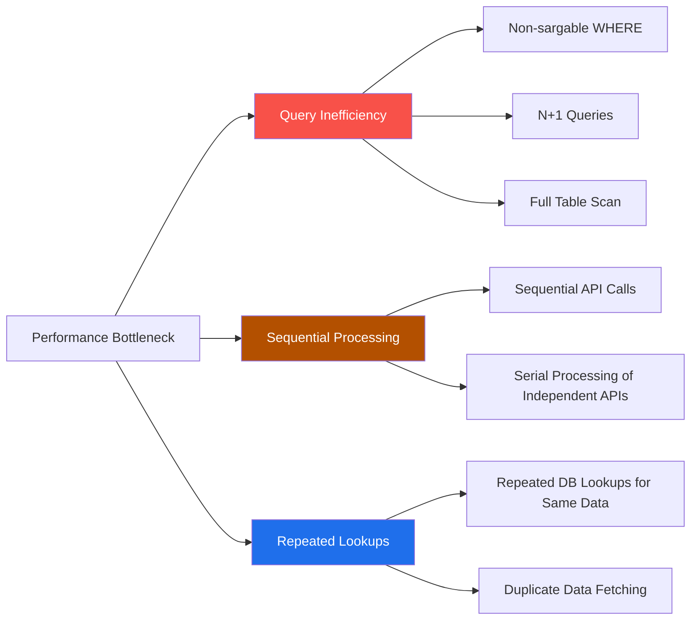

1. **Query inefficiency** — WHERE clauses that can't use indexes, N+1 queries, missing indexes
2. **Sequential processing** — Independent API calls being executed one after another
3. **Repeated lookups** — Fetching the same data from the DB on every request

Now that we've identified the bottleneck points, let's walk through each one in detail.

## Query Optimization — There Was a Reason Indexes Weren't Helping

### Ranking API: Why P95 Tail Latency Was Abnormally High

Since our company runs a real estate platform, we have APIs like "transaction volume ranking" and "unit price ranking." Most single-month queries for these APIs were being processed within normal ranges, but when a **cross-year date range query** came in, things changed dramatically. In those cases, P95 spiked up to **7.24 seconds**.

7 seconds. A 7-second API response. From a user's perspective, the screen must have felt frozen. They probably gave up and left.

> You might be wondering how we could have been running the service in this state. To give some additional context: the client previously only allowed monthly queries, so **cross-year date range queries** were never actually made. However, customer feedback indicated that "cross-year date range queries were needed," and we decided to add this feature. The backend was already **functionally capable** of handling cross-year queries — only the client (frontend) needed updating. This problem was only discovered after the frontend update was completed. So it was a situation where "the service was operational, but customers were experiencing slow responses."

The data consisted of 1.2 million rows in the monthly price table and 870,000 rows in the monthly transaction table. At the million-row scale, if indexes are properly utilized, there's no way this level of latency should occur. So I suspected there was some other cause.

First, let me explain the schema of these tables. The year-month information wasn't stored as a single column like `DATE` or `TIMESTAMP`, but was split into `aggregation_year` (INT) and `aggregation_month` (INT) — **the year and month were in separate columns**.

It wasn't until I ran EXPLAIN that I found the cause.

```sql
-- Original query's WHERE clause
WHERE (aggregation_year * 100 + aggregation_month) BETWEEN ? AND ?
```

Can you spot the problem with this query?

Looking at just the code, it might not seem like there's a problem. It creates an integer like `202603` from `year * 100 + month` and uses `BETWEEN` for the range.

But the problem becomes visible when you look at it **from the MySQL optimizer's perspective**. When a **column expression** like `aggregation_year * 100 + aggregation_month` appears in the WHERE clause, the optimizer cannot use an index. The computed result of the column values isn't what's stored in the index. This type of condition is called a **Non-sargable (Search ARGument ABLE) expression**.

The EXPLAIN result makes it crystal clear:

| Field | Value |
|-------|-------|
| type | **ALL** (full table scan) |
| rows | **1,195,038** |
| Extra | Using where; Using temporary; Using filesort |

It was reading **all** 1.2 million rows, creating a temporary table, and sorting on top of that. The index was completely useless because of this WHERE clause. Sound familiar? Have you ever added an index and thought "that should be fine now"? I certainly have...

If it had been a single date column, a simple range condition like `BETWEEN '2025-01' AND '2026-03'` would have used the index. But since this was a production table, changing the schema wasn't feasible. I had to write the best possible query within this split-column structure.

#### First Improvement: Converting to Sargable Conditions

Once the cause was identified, the direction was clear. Remove the column expression so the optimizer can use the index.

```sql
-- After: Direct column comparison without column expressions
WHERE (aggregation_year > ?start_year
   OR (aggregation_year = ?start_year AND aggregation_month >= ?start_month))
  AND (aggregation_year < ?end_year
   OR (aggregation_year = ?end_year AND aggregation_month <= ?end_month))
```

What was originally expressed cleanly in a single formula is now more verbose, but from the optimizer's perspective, it can now directly compare the `aggregation_year` and `aggregation_month` columns.

I added a composite index on `(aggregation_year, aggregation_month)`, and for the household count ranking API, I removed an unnecessary GROUP BY and changed it to query only the most recent month. Household count is an inherent property of an apartment — it doesn't change monthly. There was no reason to GROUP BY across the entire date range.

#### Second Improvement: Conditional Branching Based on Query Patterns

The first improvement showed better EXPLAIN results, but analyzing actual usage patterns revealed one more optimization opportunity.

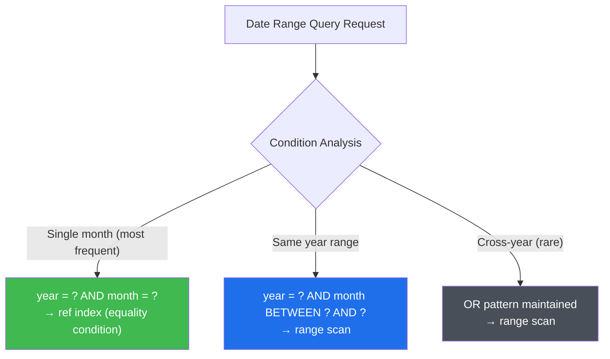

The vast majority of actual traffic was **single-month queries** like "this month" or "one month ago." For a single month, an **equality condition** of `year = ? AND month = ?` would suffice, but it was going through the general date range query logic, causing the optimizer to perform a `range` scan.

So I added branching based on query patterns: equality conditions for single months using `ref` index lookups, `BETWEEN` for same-year ranges, and the existing OR pattern only for the rare cross-year cases.

#### Results

The EXPLAIN results showed immediate improvement:

| Field | Before | After |
|-------|--------|-------|
| type | ALL | **ref** |
| rows | 1,195,038 | **14,122** |
| Extra | Using temporary; Using filesort | — |

A full scan of 1.2 million rows became an index lookup of 14,000 rows.

Below are screenshots from the production Grafana dashboard showing the transaction volume ranking API's P95 response time. The first image shows the response time dropping sharply at the deployment point (dotted line), and the second image shows it maintaining stability over 5 days after optimization.


| API | req/s | Before | P50 (prod) | P95 (prod) |
|-----|-------|--------|-----------|-----------|
| Transaction Volume Ranking | 16.0 | 1.9~2.4s | **49ms** | **95ms** |
| Unit Price Ranking | 1.2 | 7.24s | **126ms** | 3.1s |
| Household Count Ranking | 0.8 | 6.33s | **125ms** | 792ms |

Transaction volume ranking is stable with both P50 and P95 under 100ms. For unit price and household count rankings, most requests (P50) improved to **~125ms**, but tail latency remains for cross-year date range queries. The fundamental limitation lies in the schema structure where `year` and `month` are separated. Adding a single column like `year_month` (INT, e.g., `202603`) using MySQL's Generated Column would solve this with a simple `BETWEEN`, but since it involves migrating a production table with over 1.2 million rows, we plan to proceed with this over time.

This experience really drove home that clean-looking expressions like `year * 100 + month` can actually cause full scans of 1.2 million rows. Query optimization isn't simply about whether an index exists — it's about **writing queries that can actually use the index**. If the optimizer can't use the index due to how the query is written, having the index is no different from not having one at all.

---

### Batch N+1: Processing 1,000 Records Was Generating 4,000 Queries

Our platform has a batch job that runs every morning. It sends notifications to users when new transactions occur for apartments they've bookmarked. The average execution time had reached **about 50 minutes**. While it sometimes finished in the 30-minute range, on days with heavy new transaction data, it repeatedly spiked to 70–87 minutes (based on the `BATCH_JOB_EXECUTION` metadata table).

An average of 50 minutes, maximum of 87 minutes — that's quite long. While the batch was running, new transaction notifications would queue up, and users would experience "a transaction closed but the notification came late."

The batch had to process **tens of thousands** of bookmarked apartments. The problem was the number of queries generated while processing those tens of thousands.

Simplified, the existing code flow looked like this:

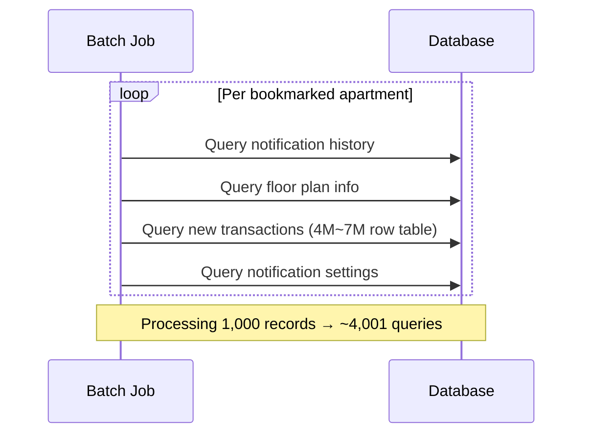

A classic **N+1 problem**. To process 1,000 bookmarked apartments, about 4,001 queries were being fired. For tens of thousands... the math is painful to even think about.

On top of that, the Reader query that fetched bookmarked apartments itself had issues. It was using a `SELECT MAX(id)` subquery for deduplication, and this subquery was causing a **full table scan** on every page. The more data accumulated, the slower it got — reading a single page took **35.6 seconds**.

#### Solution: Page-Level Prefetch + Batch Queries

There are several ways to address N+1. Let me first outline the trade-offs:

| Strategy | Pros | Cons | Best For |
|----------|------|------|----------|
| `@BatchSize` | One annotation to apply | Requires entity relationship access | JPA lazy loading N+1 |
| `JOIN FETCH` | Solves in one query | No pagination, Cartesian product risk | Few, small related entities |
| Prefetch + IN clause | No structural constraints | Manual implementation, cache management | Direct repository call pattern |

Initially, I considered `@BatchSize` — it's the simplest. But looking closely at the batch structure, there was a blocker. Spring Batch's Reader fetched bookmarked apartments page by page, and the Processor queried supplementary data (notification history, floor plan info, etc.) **via separate queries** for each item. Since it was directly calling repositories rather than accessing through entity relationships, JPA-level fetch strategies couldn't help. `JOIN FETCH` was ruled out for the same reason.

So the only option left was prefetching. I implemented a prefetch cache that **queries supplementary data in bulk using IN clauses when the Reader fetches a page**, storing results in a `ConcurrentHashMap`.

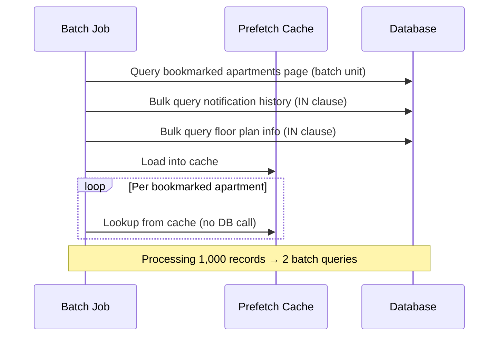

Four queries per item became 2 batch queries per page.

I also changed the Reader's deduplication query to a `NOT EXISTS` pattern leveraging a composite index.

For notification settings lookups, there was a pattern of repeatedly querying the same user's settings, so I applied an in-memory cache based on `ConcurrentHashMap`. Duplicate notification filtering was also changed from per-item `EXISTS` queries to batch queries + in-memory filtering.

#### Results

| Metric | Before | After | Improvement |
|--------|--------|-------|-------------|
| Reader 1 page query | **35.6s** | **15ms** | **~2,400x** |
| Query count (per 1,000 records) | **~4,001** | **2** | **~2,000x** |

With Reader optimization and N+1 resolution combined, overall batch execution time dropped to an average of **about 21 minutes** (based on the `BATCH_JOB_EXECUTION` metadata table). The pre-optimization spikes of 70–87 minutes completely disappeared, and the maximum stabilized to within 25 minutes.

One thing that might seem puzzling: query count decreased 2,000x, but overall execution time only decreased by 59%? Even after optimization, each item was still taking over 10 seconds on average. The reason is that most of this time was spent on **external notification API calls** — email, SMS, push, etc. The DB bottleneck was resolved, but external API calls were an area we couldn't control. In the end, it was a numerical confirmation of what might seem obvious: "no matter how much you optimize DB queries, if the majority of time is spent on external calls, there's a limit."

I also wrote thorough test code. Honestly, modifying batch code was the most nerve-wracking part. If something goes wrong, incorrect notifications or missing notifications could affect tens of thousands of users. That's why I believe securing ample test coverage is crucial.

---

### Contract Statistics API: Aggregation Was Happening in Code

The contract statistics API also showed a P95 tail latency of **2.4 seconds**. It's an API that simply shows counts and totals — why was it taking so long? Honestly, I would have missed this if I hadn't sorted by P95 in Grafana. The average response time looked perfectly fine. That's when I realized the danger of relying on averages.

Looking at the code, there were two issues.

First, it queried by settlement date, but there was **no index on the settlement date column**. EXPLAIN showed the same pattern as the ranking API:

| Field | Value |
|-------|-------|
| type | **ALL** (full table scan) |
| rows | **2,021** |
| key | **NULL** (no index used) |

A table with only 2,000 rows was doing a full scan. Since the data volume was small, it returned results even without an index, which is likely why index design was overlooked during development. The impact was less noticeable because of the small dataset, but structurally, it was the same problem as the ranking API.

Second, there was a more fundamental issue. Instead of using `COUNT` and `SUM` in SQL, the code was **fetching all data and then** counting with `.size` and summing with `.sumOf {}`. When the DB could send just one result row with aggregation, it was pulling all rows to the application and aggregating in memory.

```kotlin
// Before: Fetch entire list from DB and aggregate in code
val settlements = repository.findAllSettlementAmount(from, to)
val totalCount = settlements.size           // COUNT in code
val totalAmount = settlements.sumOf { it }  // SUM in code
```

```kotlin
// After: Aggregate directly in DB
val summary = repository.findSettlementSummary(from, to)
// → SELECT COUNT(*), SUM(amount) FROM ... WHERE ...
```

I added an index on the settlement date column and switched to SQL aggregation. Running EXPLAIN again showed `type` changed to `ref`, properly using the index. P95 dropped from **2.4 seconds to under 100ms**.

The code change was less than 50 lines. Yet it eliminated unnecessary data transfer and reduced application memory usage in one stroke. Cases like this remind me why the basic principle of "let the DB do what the DB does best" matters so much.

## Parallelization — Why Were Independent Operations Running Sequentially?

After finishing query optimization, I turned my attention to **sequential processing** sections. Looking at Tempo trace span waterfalls, I kept seeing this pattern: calls with no dependencies on each other lined up one after another.

### Notification Delivery: Email and SMS Were Being Sent Serially

Our service is a platform that connects real estate agents with users. When a match is made, we send matching notifications via email and SMS. The notification delivery API also showed high tail latency at P95.

When both email and SMS were sent, the response delays from both external services **added up serially**, reaching up to **4.9 seconds**. Opening the Tempo trace immediately revealed the cause:

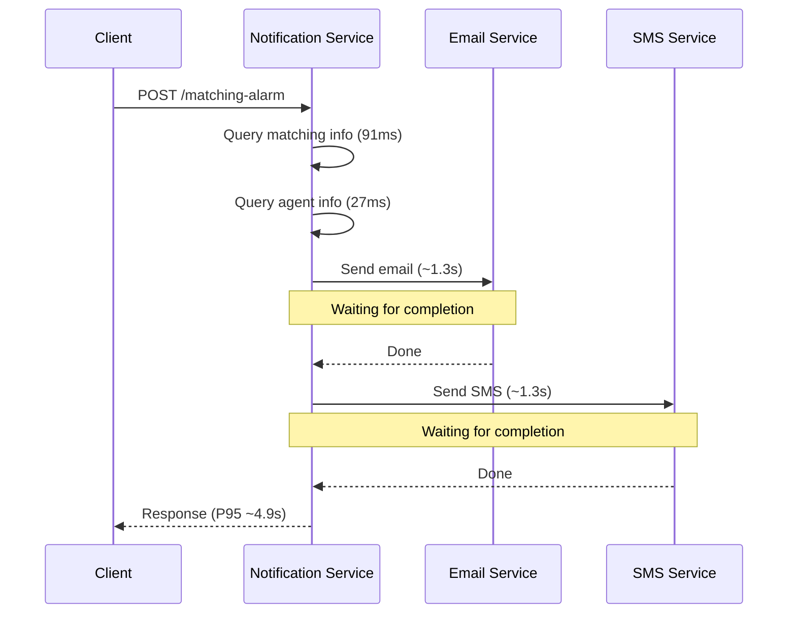

It was a **sequential execution** structure where SMS couldn't start until email was done. Even though email and SMS have absolutely no dependency on each other. Of course, notifications don't have a dependency on the matching itself, so they don't strictly need to be sent in real-time — but I thought it was best to avoid structures that create bottlenecks.

Does the email result affect SMS? Generally, no. So why were they running sequentially? Probably because when the code was first written, it was natural to write top-to-bottom. Honestly, I catch myself doing the same thing when I'm not being deliberate about it, so I couldn't point fingers.

#### Solution: Parallel Execution with Coroutines

No dependencies, so the answer was clear. I changed it to parallel execution using coroutine `async`.

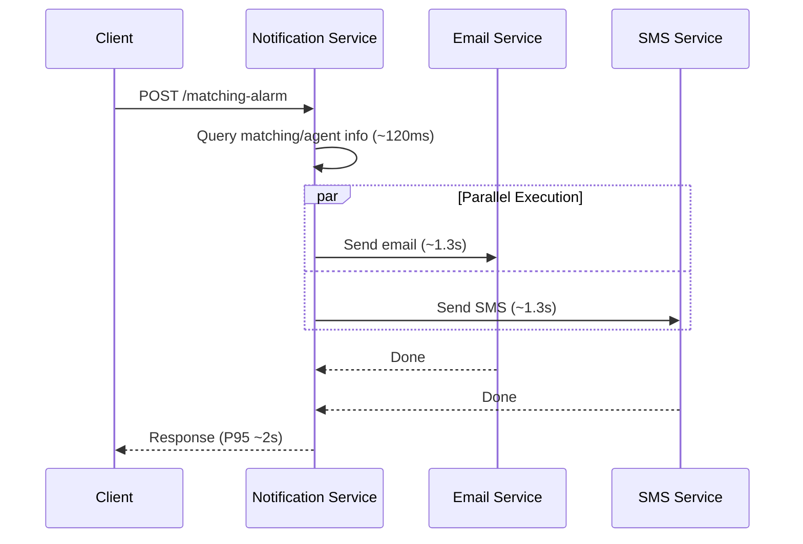

Inside a `coroutineScope`, both tasks start simultaneously with `async`, and `awaitAll()` waits for both to complete.

There was one consideration here. If email delivery fails, should SMS also fail? With the default `coroutineScope`, if one child coroutine fails, the rest get cancelled. But email and SMS are **different channels**. If we skip SMS just because email failed, the user receives no notification at all. So I used `supervisorScope` to isolate failures, ensuring one channel's failure doesn't affect the other.

```kotlin
supervisorScope {
    val emailJob = async { sendEmail(matching, agent) }
    val smsJob = async { sendSms(matching, agent) }
    awaitAll(emailJob, smsJob)
}
```

Response time changed from `sum(email, SMS)` to `max(email, SMS)`, and measured **P95 dropped from 4.9 seconds to about 2 seconds**. I continued finding and improving other areas that could benefit from parallelization.

### Independent DB Queries in Parallel Too

A similar pattern was found in DB queries. Within a single API, 3 DB queries were executing sequentially, but analysis showed the third query had **no dependency** on the first or second.

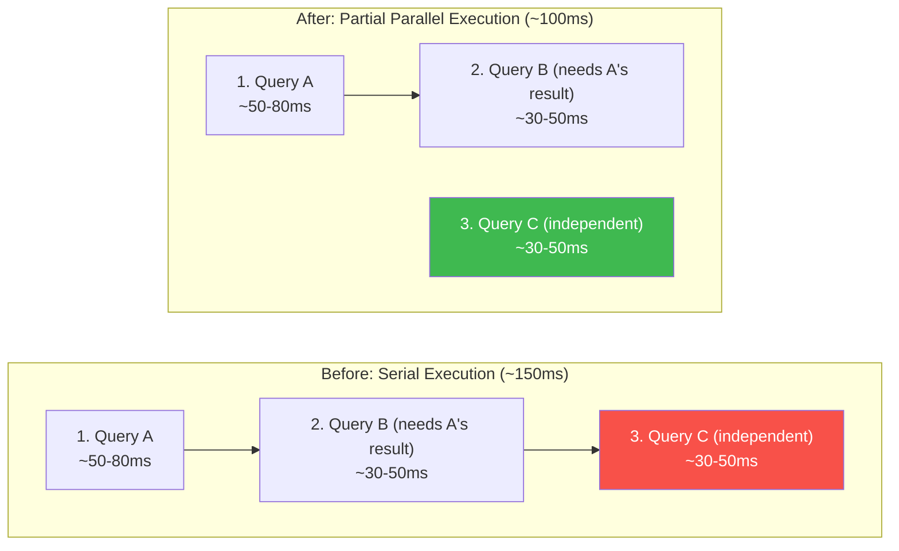

Query B needs Query A's result, so sequential execution is correct. But Query C can run independently of A and B. I changed Query C to execute in parallel with A+B, reducing this logic's execution time from about **150ms to 100ms**. While the absolute time difference isn't huge, this logic was shared across multiple modules, so a single change improved P95 by about 30% across several APIs.

## Caching — Why Fetch the Same Data Every Time?

After fixing queries and parallelizing independent calls, the next thing that caught my eye was the pattern of **fetching the same data from the DB on every request**.

### Apartment Details: 13+ DB Queries Per Request

Building a single detail page requires various types of data. Basic info, nearby facilities, transportation, loan info, etc. are distributed across different modules and databases. Looking inside these APIs, I found that **a single request triggered 13+ DB queries** and heavy queries joining 6+ tables. When I first saw this span list in the Tempo trace, I thought "all of this happens in one request?"

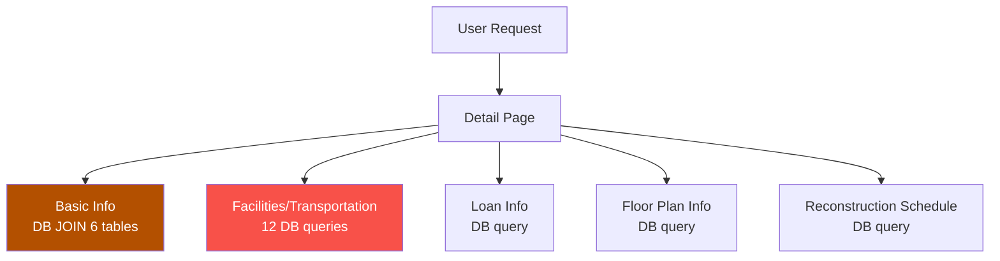

Facilities and transportation info was particularly bad. Fetching POI (Point of Interest) data for schools, hospitals, marts, parks, buses, subways, highways, etc. required **12 DB queries**. Without caching, when all 12 queries hit, P95 tail latency naturally climbed to multiple seconds.

But let me ask a question here. Do the schools and subway stations near an apartment change on every request? Probably not. Schools don't relocate overnight and subway lines don't suddenly change. This data is **semi-static with extremely low change frequency**. Yet we were making 12 DB queries on every request. There was no reason to hit the DB every time.

#### Applying Redis Cache-Aside Pattern

When considering a caching strategy, I first weighed Write-Through vs. Cache-Aside.

| Strategy | Mechanism | Pros | Cons | Best For |
|----------|-----------|------|------|----------|
| Write-Through | Update cache on write | High cache-DB consistency | Unnecessary overhead for rarely written data | Frequently read and written data |
| Cache-Aside | Check cache first on read | Maximizes read performance, simple implementation | Temporarily stale on TTL expiry | Low-change, read-heavy data |

The data we wanted to cache was **low-change, read-heavy data**. There was almost never a need to update the cache on write. [Previous caching experience]() had confirmed that Cache-Aside works well for this pattern, and the same judgment applied here. However, this time I needed to differentiate TTL strategies based on data characteristics.

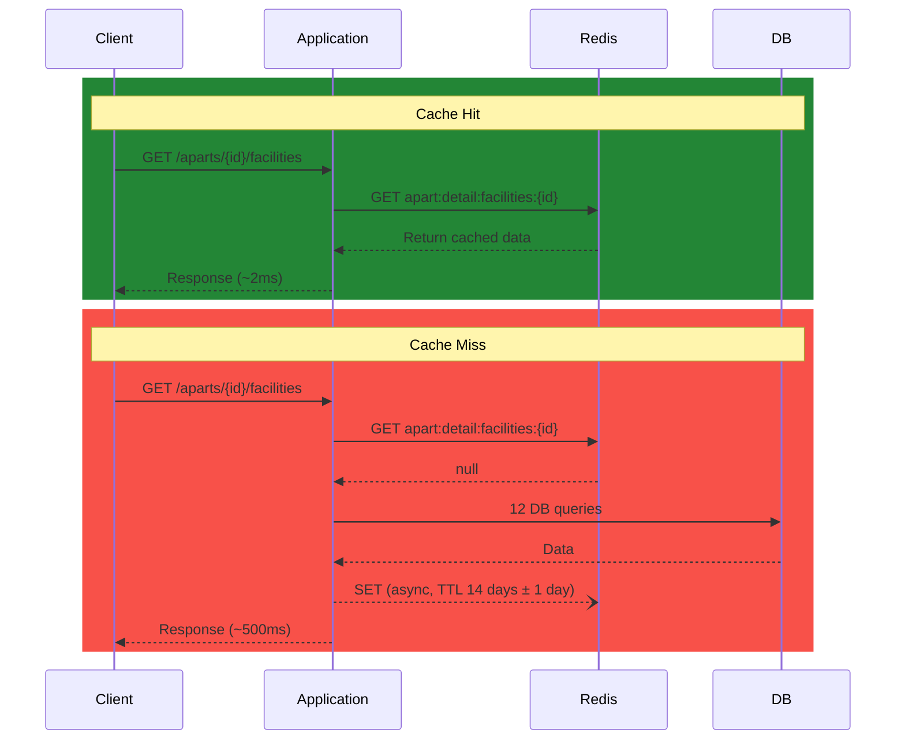

Initially, I was going to apply a uniform 24-hour TTL to all caches. But it seemed inefficient for school and subway information around apartments to expire after just one day. Conversely, setting too long a TTL like 14 days for loan information containing interest rates might show users outdated rates. I concluded that "a blanket TTL won't work" and ended up examining each data type's change frequency to set appropriate TTLs.

| Data | TTL | Rationale |
|------|-----|-----------|
| POI (schools, hospitals, marts, parks) | **14 days** ± 1 day | Extremely low change frequency |
| Transportation (bus, subway, highway) | **14 days** ± 1 day | Low route change frequency |
| Loan info | **7 days** ± 1 day | Interest rate fluctuation cycles |
| Basic info (DB JOIN) | **6 hours** ± 30 min | Needs transaction data updates |
| Reconstruction schedule | **7 days** ± 1 day | Schedule updates relatively rare |
| Floor plan info | **7 days** ± 1 day | Structural changes rare |

Did you notice the **± random jitter** next to the TTLs? There's a reason for that. Popular apartments get viewed simultaneously by many users. What happens if caches with the same TTL all expire at the same time? Dozens of requests flood the DB at once — a **Cache Stampede** phenomenon.

In the actual implementation, TTLs are defined as enums, and jitter is calculated using `ThreadLocalRandom` at query time.

```kotlin
enum class DetailCacheTtl(
    val baseMinutes: Long,
    val jitterMinutes: Long,
) {
    FACILITIES_TRANSPORT(20160L, 1440L), // 14 days ± 1 day
    LOANS(10080L, 1440L),               // 7 days ± 1 day
    TYPES(10080L, 1440L),               // 7 days ± 1 day
    RECONSTRUCTION(10080L, 1440L),      // 7 days ± 1 day
    BASIC_INFO(360L, 30L),              // 6 hours ± 30 min
    PRICE(360L, 30L);                   // 6 hours ± 30 min

    fun toDuration(): Duration {
        val jitter = ThreadLocalRandom.current()
            .nextLong(-jitterMinutes, jitterMinutes + 1)
        return Duration.ofMinutes(baseMinutes + jitter)
    }
}
```

Since each instance and request time gets a different expiration time even for the same data, stampedes are naturally distributed.

I also ensured caches are invalidated when the underlying data gets updated. For example, loan information cache is cleared when interest rates change, and reconstruction schedule cache is cleared when the schedule is modified. This way, caches can be refreshed before TTL expiration, reducing situations where users see stale information.

That covers "what to cache and for how long." I wish that were the end of it, but TTL wasn't the only consideration when introducing caching. Questions like "what if the cache causes an outage?" and "is this actually effective?" kept coming up, and these concerns turned out to be more important than I expected.

#### Async Cache Storage

I also applied caching to the autocomplete API used for searching apartments and subway stations, and another consideration came up.

Autocomplete is an API that gets called **every time a user types a character**. If the response is slower than typing speed, user experience degrades drastically — it's an API extremely sensitive to latency. But when a cache miss occurs and we synchronously execute both the DB fetch and Redis storage, the response is delayed by the Redis write time.

I asked myself a question: what happens if cache storage fails? The next request will just try again, right? If so, there's no reason to block the user's response. I switched to **fire-and-forget async** storage.

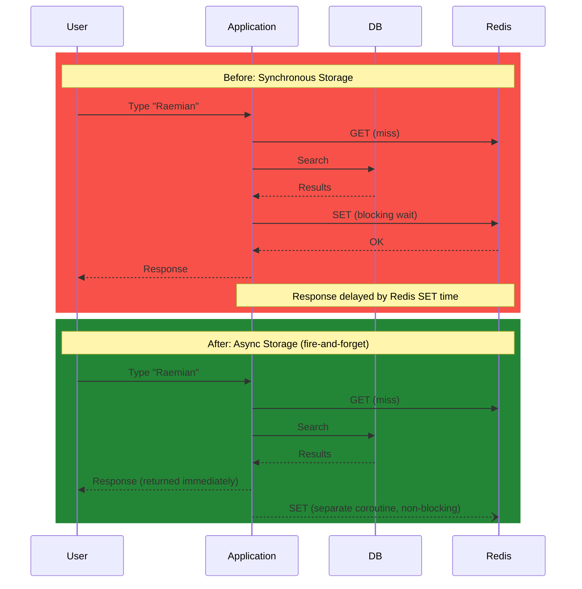

```kotlin
// Dedicated coroutine scope for cache operations
private val cacheScope = CoroutineScope(Dispatchers.IO + SupervisorJob())

fun <T> setAsync(key: String, value: T, ttl: Duration, cacheType: String) {
    cacheScope.launch {  // fire-and-forget: doesn't block the response
        set(key, value, ttl, cacheType)
    }
}

// Clean up coroutines on application shutdown
override fun destroy() {
    cacheScope.cancel()
}
```

Honestly, I initially implemented it with `GlobalScope.launch`. It worked fine. But during code review, two issues were flagged. First, running coroutines wouldn't be properly cleaned up during application shutdown. Second, using a regular `Job` meant one cache storage failure could cancel other coroutines in the same scope. I almost moved on thinking "it works, so it's fine" — but after the review, I realized these were problems that could absolutely surface in production. This is where the power of code review really shines. So I changed to `SupervisorJob` for failure isolation and `DisposableBean`'s `destroy()` to cancel the scope on shutdown.

#### The Service Must Keep Running Even When Cache Fails

Another critical point when introducing caching: **"The service must keep running even if the cache (e.g., Redis) goes down."**

I believe performance-optimizing caches should be treated strictly as a **means**, and if Redis has issues, the system should gracefully fall back to the DB.

```kotlin
fun <T> get(key: String, type: Class<T>, cacheType: String): T? {
    return try {
        val json = redisTemplate.opsForValue().get(key)
        if (json != null) {
            hitCounter(cacheType).increment()
            objectMapper.readValue(json, type)
        } else {
            missCounter(cacheType).increment()
            null
        }
    } catch (e: Exception) {
        // On Redis failure, treat as cache miss → fall back to direct DB query
        log.warn("Redis cache read failed: key={}", key, e)
        missCounter(cacheType).increment()
        null
    }
}
```

Both Redis reads and writes are wrapped in try-catch. If Redis has issues, it's treated as a cache miss and falls back to the original path (direct DB query). Slower performance is acceptable, but the service itself going down is not. I think the role of a cache is "fast when available, normal when not." I didn't want caching to be the cause of an outage.

#### Ensuring Cache Observability

After introducing caching, I wanted to verify **"is this actually working?"** Without numbers to confirm whether TTLs are appropriate, what the hit rate is, and whether Redis is slowing down, you're just running on gut feeling.

So I set up Micrometer counters to collect cache hit/miss counts, tagged by cache type (`basic`, `facilities`, `loans`, `types`, `reconstruction`, `price`) for Grafana monitoring. Redis GET/SET latencies are also collected as timer metrics. I created a dedicated Cache Hit Rate Monitor dashboard to track hit rates by cache type in real-time, which proved quite useful later as the basis for TTL adjustments. Monitoring is needed before deployment, after deployment, and continuously.

#### Results

These are production Prometheus metric results. The P95 response times shown represent what actual users experience, with a mix of cache hits and misses. The first image shows spikes before the caching deployment, and the second shows the stable current state after deployment.


> Due to Prometheus storage limitations (4GB), the above Before image shows only a few days of records before deployment. The Before P95 values in the table below (4,045ms, 4,840ms) were recorded during peak traffic hours before caching was introduced and had already expired from Prometheus during the optimization period.


| API | req/s | Before P50 | After P50 | Before P95 | After P95 | After P99 |
|-----|-------|-----------|----------|-----------|----------|----------|
| Basic Info | **568** | 183ms | **43ms** | 4,045ms | **50ms** | 50ms |
| Facilities/Transportation | **525** | 497ms | **119ms** | 4,840ms | **168ms** | 205ms |
| Reconstruction Schedule | 29 | 124ms | **42ms** | — | **50ms** | 55ms |
| Floor Plan Info | 28 | 147ms | **46ms** | — | **63ms** | 109ms |

The basic info and facilities/transportation APIs handle **568 and 525 requests per second** respectively. On a daily basis, that's approximately **49 million and 45 million requests**. P95 dropped from the 4-second range to **50ms** for basic info and from 4.8 seconds to **168ms** for facilities/transportation, with P99 staying under 200ms.

You might wonder "doesn't a cache miss actually make things slower by the Redis query time?" When I checked, Redis GET returning null took only **1~5ms**. Even on a cache miss, the performance impact compared to the original is negligible. I did set a Redis timeout of 100ms to cut off early if Redis becomes unresponsive — this timeout rarely triggers, but if it does, the cache query is treated as a failure and falls back to the DB.

## Overall Results Summary

After about 10 days of work, here's the complete summary. Before listing the numbers, I want to note that all these metrics are from the production Prometheus environment. The Grafana dashboards below provide a side-by-side comparison of before and after optimization.


| Area | API / Component | Before | After (prod) | Improvement |
|------|----------------|--------|-------------|-------------|
| Query | Transaction Volume Ranking | P95 1.9~2.4s | 95ms | **~21x** |
| Query | Unit Price Ranking | P50 7.24s | 126ms | **~57x** |
| Query | Household Count Ranking | P50 6.33s | 125ms | **~51x** |
| Query | Contract Summary | P95 2.4s | <100ms | **~24x** |
| Batch | Reader 1 page | 35.6s | 15ms | **~2,400x** |
| Batch | Query count (per 1K records) | ~4,001 | 2 | **~2,000x** |
| Batch | Total execution time | ~50 min (max 87 min) | ~21 min (max 25 min) | **~59%** |
| Parallelization | Notification delivery (P95) | 4.9s | ~2s | **~59%** |
| Parallelization | Independent DB query parallelization | ~150ms | ~100ms | **~30%** |
| Caching | Basic info (P95, 568 req/s) | 4,045ms | 50ms | **~99%** |
| Caching | Facilities/Transportation (P95, 525 req/s) | 4,840ms | 168ms | **~97%** |

> Unit price and household count rankings use P50 as the Before baseline. Even the majority of requests (median) were in the 7-second range, so P50 was used instead of P95 for the Before measurement.

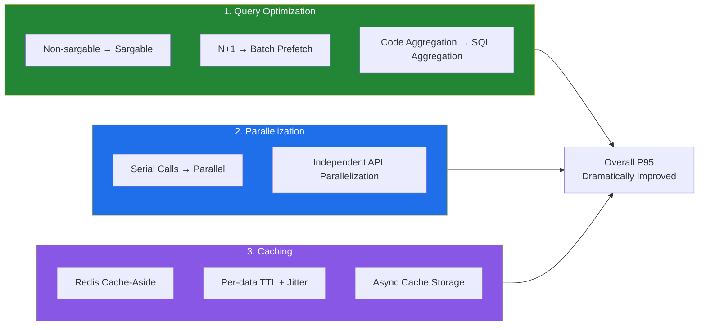

## Reflections

### "Having an Index" and "Using an Index" Are Different Problems

Even before this work, I used EXPLAIN — but honestly, I admit there were times I thought "the index exists, so it should be fine" and moved on. I suspect I'm not the only one. After experiencing the non-sargable query issue firsthand, I truly internalized that having an index and the optimizer actually using that index are completely different problems. It reminded me to be much more thorough going forward.

I also realized that code reviews alone can't catch performance issues. Queries that look clean in code can trigger full scans, and batches that seem to work fine can fire thousands of unnecessary queries. I too initially approached things by guessing and ended up digging in the wrong places. In the end, whether it's EXPLAIN, Tempo traces, or Prometheus metrics, there's no substitute for approaching things based on **numbers and data from your tools**.

### What Technology to Use Matters Less Than What the Problem Is

When introducing caching, I initially started by pondering "what's the optimal cache strategy?" — Write-Through vs. Cache-Aside, how to set TTLs. I jumped straight to technology selection. But looking back, identifying "what data is being repeatedly queried right now" should have come first. Once you accurately understand the problem, the technology choice follows naturally.

The same was true for parallelization. Rather than which async framework to use, the key was first identifying which sequential operations were actually independent. Ultimately, I believe performance optimization starts not with finding better technology, but with accurately identifying current inefficiencies. It might sound obvious, but you need to pinpoint the problem before the right solution can emerge.

### Without Monitoring, We Couldn't Have Even Started

The [monitoring system we built previously]() was a prerequisite for this entire effort. I can't emphasize this enough. Even the fact that the facilities/transportation API was making 12 DB queries — by code alone, spread across multiple modules, the full picture wasn't visible at a glance. It was only after expanding the Tempo trace span waterfall that I discovered "oh, all of this happens in a single request." The saying "you can't improve what you can't measure" has never resonated with me as strongly as it did this time.

## Closing Thoughts

Looking back, none of the techniques used in this work — fixing non-sargable queries, resolving N+1, adding indexes, parallelization, Cache-Aside — were new technologies. They're all fundamentals you've probably heard of at least once. It might sound cliche, but in the end, the basics are the most powerful.

That said, just because something is fundamental doesn't mean it's easy to apply. In fact, **finding where things are slow** was the hardest part, and once the cause was identified, the fix was often straightforward. A line of EXPLAIN, a few lines of coroutine async, a few lines of Redis cache configuration. The amount of code changed wasn't much, but the impact was significant. That's why I titled this article "Finding the Bottleneck Was Harder Than Fixing It."

One more thing I did after completing this work: this time, I happened to discover the issues by habitually checking the dashboard. But I couldn't rely on chance next time. So I **set up Grafana Alerts to notify me when any API's P95 exceeds a certain threshold**. Next time, the system will tell me first.

Of course, there are still remaining challenges. Some heavy query patterns haven't been addressed yet, and N+1 issues in legacy service stored procedures remain. These have larger scope, so I plan to improve them gradually over time. It's a bit disappointing that I can't say it's perfectly done, but performance optimization is an area that never truly "ends." There are no perfect answers — only choices that fit your service's current situation.

If you're facing a similar situation, I'd recommend starting with EXPLAIN. The cause of slow queries might be simpler than you think. I certainly learned that firsthand this time.

Thank you for reading this long article.

## References

### Related Posts
- [The Service Shouldn't Wait for Users to Report Outages — Building an In-House Monitoring System]()

### Query Optimization
- [Use The Index, Luke — Functions in WHERE Clause](https://use-the-index-luke.com/sql/where-clause/functions) — Non-sargable queries and index invalidation patterns
- [MySQL Official Docs — EXPLAIN Output Format](https://dev.mysql.com/doc/refman/8.4/en/explain-output.html) — Guide to interpreting EXPLAIN output
- [MySQL Official Docs — Optimization and Indexes](https://dev.mysql.com/doc/refman/8.4/en/optimization-indexes.html) — Composite index design strategies

### Caching
- [AWS — Database Caching Strategies Using Redis](https://docs.aws.amazon.com/whitepapers/latest/database-caching-strategies-using-redis/caching-patterns.html) — Cache-Aside vs Write-Through comparison
- [Cache Stampede Problem and Solutions](https://instagram-engineering.com/thundering-herds-promises-82191c8af57d) — Instagram's Thundering Herd mitigation

### Parallelization / Async
- [Kotlin Official Docs — Coroutines Basics](https://kotlinlang.org/docs/coroutines-basics.html) — Coroutine fundamentals and structured concurrency
- [Kotlin Official Docs — Shared Mutable State and Concurrency](https://kotlinlang.org/docs/shared-mutable-state-and-concurrency.html) — SupervisorJob, exception propagation and isolation

### Monitoring
- [Micrometer Official Docs — Cache Instrumentations](https://docs.micrometer.io/micrometer/reference/reference/cache.html) — Cache hit/miss metric collection
