안녕하세요. 프롭테크 플랫폼에서 백엔드 개발자로 근무 중인 정정일입니다.

어느 날 평소처럼 모니터링을 위해 Grafana 대시보드를 들여다보고 있었습니다. 평균 응답시간은 대부분 수백ms 이내라 "괜찮네" 하고 넘어가려다 습관적으로 **P95**(상위 5%의 느린 요청) 지표로 눈을 돌려봤습니다. 이쪽은 상황이 좀 달랐습니다. 일부 API에서 tail latency가 수 초대에 머물고 있었거든요.

P95가 수 초라는 건 뭘 의미할까요? 20명의 유저분들 중 1분은 수초의 응답을 기다리고 있다는 뜻입니다. 솔직히 예전에는 "상위 5%니까 대부분은 괜찮은 거 아닌가?" 싶기도 했습니다. 근데 생각해보면 트래픽이 높은 API일수록 그 "1명"의 절대 수는 결코 적지 않게 됩니다. 하루에 수만 건씩 들어오는 API에서 5%면, 매일 수천 명의 사용자가 느린 응답을 경험하고 있다는 계산이 나오니까요. 제가 서비스를 이용하는 유저라면 그런 경험을 하고 싶지 않을 거라 확신합니다.

그러다보니 당연히 그냥 넘어갈 수가 없었습니다. 약 10일간 집중적으로 성능 최적화 작업을 진행했고, 그 과정에서 했던 고민과 선택, 결과를 정리해보려 합니다. 제 경험이 비슷한 상황을 겪고 계신 분들에게 조금이나마 도움이 되면 좋겠습니다. 다만 저도 아직 열심히 공부하며 일하는 입장이라, 더 나은 방법이 있다면 편하게 의견 주시면 감사하겠습니다.

## 출발점: 어디서부터 손을 대야 할까

성능 개선이 필요하다는 건 알겠는데, 막상 시작하려니 어디서부터 건드려야 할지가 고민이였습니다. "느리다"라는 단순한 감만으로 방향을 잡을 수는 없으니까요.

여기서 먼저 한 가지 짚고 넘어가고 싶은 부분이 있습니다. 성능 최적화에서 가장 위험한 건 **"아마 여기가 느릴 거야"라는 추측으로 시작하는 것** 이지 않나 싶습니다. 제가 말하는 "여기"라는건 API자체 뿐만 아니라 코드의 특정 부분, 데이터베이스 쿼리, 네트워크 병목, 외부 API 호출일 수도 있습니다.

저도 처음에는 "병목이 발생하는 API에 캐시를 도입하면 나아지지 않나?" 싶었는데, 실제로 측정해보니 병목이 생각했던 곳과 다른 경우가 꽤 있었거든요. 결국 가장 먼저 한 건 **현재 상태를 정확하게 파악하는 것**이었습니다.

먼저 Prometheus 메트릭과 Grafana 대시보드, 그리고 Tempo의 분산 트레이싱을 활용해서 병목 지점을 하나씩 분석하기 시작했습니다. 그런 후에 DB에 병목이 있는지, 코드의 특정 부분이 느린지, 외부 API 호출이 문제인지 등을 구체적으로 파악했습니다.

만약 DB의 쿼리가 문제라면, EXPLAIN으로 쿼리 실행 계획을 뜯어봤죠. 코드만 봐서는 절대 보이지 않던 것들이, 숫자 앞에서는 너무나 명확하게 드러났습니다.

분석 결과를 정리해보니 대부분 병목의 원인은 크게 세 가지로 분류할 수 있었습니다.

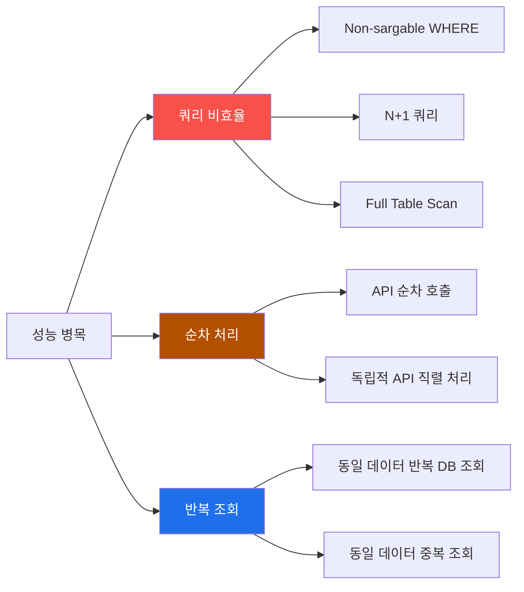

1. **쿼리 비효율** — 인덱스를 타지 못하는 WHERE 절, N+1 쿼리, 누락된 인덱스
2. **순차 처리** — 독립적인 API 호출을 순서대로 하고 있는 구조
3. **반복 조회** — 같은 데이터를 매 요청마다 DB에서 새로 가져오는 구조

자 이제 병목지점을 파악했으니 하나하나씩 자세히 이야기해보겠습니다.

## 1장. 쿼리 최적화 — 인덱스를 걸어도 소용없는 이유가 있었다

### 랭킹 API: P95 tail latency가 비정상적으로 높았던 이유

저희 회사는 부동산 플랫폼이다보니 부동산의 "거래량 랭킹", "단가 랭킹" 같은 API가 존재합니다. 해당 API들이 대부분의 단일 월 조회 요청은 정상 범위 내에서 처리되고 있었지만, **연도를 걸치는 기간 조회**가 들어오면 상황이 달라졌습니다. 이 경우 P95가 **7.24초**까지 치솟는 것이 관측됐습니다.

7초요. API 응답이 7초. 사용자분 입장에서는 화면이 멈춘 것처럼 느껴졌을 겁니다. 아마 참지 못하고 이탈하셨을 것 같습니다. 

>여기서 그러면 어떻게 이상태로 서비스를 운영할 수 있었냐는 질문이 나올 수 있을 것 같습니다. 그에대한 부가 설명을 드리자면 
기존에는 클라이언트단에서 월간 조회만 허용하도록하여 **연도를 걸치는 기간 조회**가 요청되지 않았었지만 "연도를 걸치는 기간 조회도 필요하다"는 고객분들의 피드백이 있었고, 결국 이 기능을 추가하기로 결정했습니다. 백엔드는 이미 **연도를 걸치는 기간 조회**가 **기능은 하도록** 개발되어 있는 상태에서 클라이언트(프론트)만 업뎃이 필요한 상황이었고, 프론트 업데이트가 완료된 후에야 이 문제가 발견됐습니다. 그래서 "서비스 운영은 가능했지만, 고객분들이 느린 응답을 경험하셨던 상황"이었던 거죠.

데이터는 월별 가격 테이블이 120만 건, 월별 거래 테이블이 87만 건이었습니다. 백만 건의 데이터 수준에서 인덱스만 제대로 탄다면 이 정도 지연이 발생할 리가 없었습니다. 그래서 뭔가 다른 원인이 있을 거라고 생각했습니다.

먼저 이 테이블들의 스키마를 짚고 가야 할 것 같습니다. 연월 정보가 `DATE`나 `TIMESTAMP` 같은 단일 컬럼이 아니라 `aggregation_year`(INT)와 `aggregation_month`(INT)로 **년 정보와 월 정보가 분리된 구조**였습니다. 

EXPLAIN을 찍어보고 나서야 원인을 찾았습니다.

```sql
-- 기존 쿼리의 WHERE 절
WHERE (aggregation_year * 100 + aggregation_month) BETWEEN ? AND ?
```

이 쿼리의 문제가 보이시나요?

코드만 보면 꽤 깔끔합니다. `year * 100 + month`로 `202603` 같은 정수를 만들어서 `BETWEEN`으로 범위를 잡는 거죠. 가독성도 좋고 의도도 명확합니다. 저도 처음 코드를 봤을 때는 "깔끔하게 잘 짰네" 싶었습니다.

하지만 문제는 **MySQL 옵티마이저 입장**에서 봐야 보입니다. `aggregation_year * 100 + aggregation_month`이라는 **컬럼 연산**이 WHERE 절에 들어가 있으면, 옵티마이저는 인덱스를 사용할 수 없습니다. 컬럼 값을 가공한 결과가 인덱스에 저장된 게 아니니까요. 이런 조건을 **Non-sargable(Search ARGument ABLE이 아닌) expression**이라고 합니다.

EXPLAIN 결과를 보면 명확합니다.

| 항목 | 값 |
|------|-----|
| type | **ALL** (풀 테이블 스캔) |
| rows | **1,195,038** |
| Extra | Using where; Using temporary; Using filesort |

120만 건을 **전부 읽고**, 임시 테이블을 만들고, 정렬까지 하고 있었습니다. 인덱스가 있어도 이 WHERE 절 때문에 아무 소용이 없었던 거죠. 어떠신가요? 인덱스를 걸어놓고 "이제 괜찮겠지" 하고 안심하신 적 없으신가요? 저는 있었습니다...

만약 단일 날짜 컬럼이었다면 `BETWEEN '2025-01' AND '2026-03'` 같은 단순한 범위 조건으로 인덱스를 탈 수 있었겠지만, 이미 운영 중인 테이블이라 스키마를 바꾸기는 어려운 상황이었습니다. 결국 이 분리된 구조 안에서 최선의 쿼리를 짜야 했습니다.

#### 1차 개선: Sargable 조건으로 변환

원인을 알았으니 방향은 하나였습니다. 컬럼 연산을 제거해서 옵티마이저가 인덱스를 탈 수 있게 만드는 거죠.

```sql
-- 변경 후: 컬럼 연산 없이 각 컬럼을 직접 비교
WHERE (aggregation_year > ?start_year
   OR (aggregation_year = ?start_year AND aggregation_month >= ?start_month))
  AND (aggregation_year < ?end_year
   OR (aggregation_year = ?end_year AND aggregation_month <= ?end_month))
```

원래 하나의 수식으로 깔끔하게 표현되던 걸 풀어 쓰니 코드가 길어졌지만, 옵티마이저 입장에서는 이제 `aggregation_year`와 `aggregation_month` 컬럼을 직접 비교할 수 있게 되었습니다.

여기에 `(aggregation_year, aggregation_month)` 복합 인덱스를 추가했고, 세대수 랭킹 API에는 불필요한 GROUP BY를 제거하고 최근 1개월만 조회하도록 변경했습니다. 세대수는 아파트의 고유 속성이라 매월 같은 값이거든요. 굳이 전 기간을 GROUP BY할 이유가 없었습니다.

#### 2차 개선: 조회 패턴에 맞는 조건 분기

1차 개선으로 EXPLAIN이 개선됐지만, 실제 사용 패턴을 분석해보니 한 가지 더 최적화할 수 있는 포인트가 보였습니다.

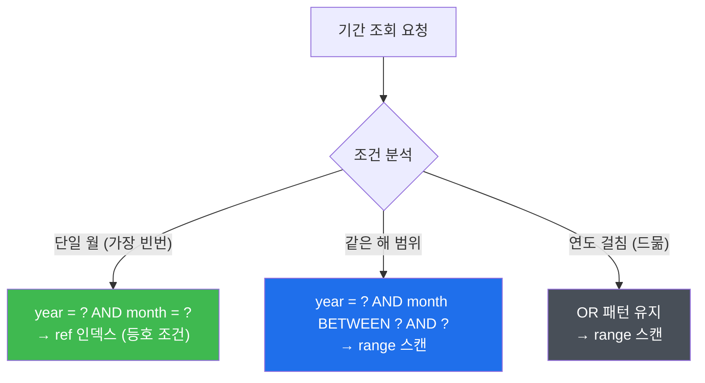

실제 트래픽의 대부분은 **"이번 달"**, **"1개월 전"** 과 같은 단일 월 조회였습니다. 단일 월이면 `year = ? AND month = ?`라는 **등호 조건**만으로 충분한데, 범용적인 기간 조회 로직을 타고 있으니 옵티마이저가 `range` 스캔을 하고 있었습니다.

그래서 조회 패턴에 따라 분기를 추가했습니다. 단일 월이면 등호 조건으로 `ref` 인덱스 룩업을, 같은 해 범위면 `BETWEEN`을, 연도가 걸치는 드문 경우에만 기존 OR 패턴을 사용하도록 쿼리를 분기한거죠.

#### 결과

EXPLAIN에 그 결과가 바로 나오게 됐습니다.

| 항목 | Before | After |
|------|--------|-------|
| type | ALL | **ref** |
| rows | 1,195,038 | **14,122** |
| Extra | Using temporary; Using filesort | — |

120만 건 풀 스캔이 1.4만 건 인덱스 룩업으로 바뀌었습니다.

아래는 운영 환경 Grafana 대시보드에서 캡처한 거래량 랭킹 API의 P95 응답시간입니다. 첫 번째 이미지에서 배포 시점(점선)을 기준으로 응답시간이 급락하는 것을 확인할 수 있고, 두 번째 이미지에서 최적화 후 5일간 안정적으로 유지되고 있는 것을 볼 수 있습니다.


| API | req/s | Before | P50 (운영) | P95 (운영) |
|-----|-------|--------|-----------|-----------|
| 거래량 랭킹 | 16.0 | 1.9~2.4s | **49ms** | **95ms** |
| 단가 랭킹 | 1.2 | 7.24s | **126ms** | 3.1s |
| 세대수 랭킹 | 0.8 | 6.33s | **125ms** | 792ms |

거래량 랭킹은 P50·P95 모두 100ms 이내로 안정적입니다. 단가·세대수 랭킹의 경우 대부분의 요청(P50)은 **~125ms**로 개선됐지만, 연도를 걸치는 기간 조회에서 아직 tail latency가 남아있습니다. 근본적으로는 `year`와 `month`가 분리된 스키마 구조의 한계입니다. MySQL의 Generated Column으로 `year_month`(INT, 예: `202603`) 같은 단일 컬럼을 추가하면 단순 `BETWEEN`으로 해결할 수 있지만, 120만 건 이상의 운영 테이블 마이그레이션이 수반되는 작업이라 시간을 두고 진행할 계획입니다.

코드만 보면 깔끔해 보이는 `year * 100 + month` 같은 표현이, 실은 120만 건 풀 스캔의 원인이 될 수 있다는 걸 이번에 제대로 체감했습니다. 쿼리 최적화는 단순히 인덱스가 있느냐 없느냐의 문제가 아니라, **인덱스를 탈 수 있는 쿼리를 짜느냐**의 문제라는 걸 다시 한 번 깨달았습니다. 인덱스가 있어도 옵티마이저가 탈 수 없는 쿼리를 짜놓으면, 결국 인덱스가 없는 것과 다름없게 된다는 거죠.

---

### 배치 N+1: 1,000건을 처리하는 데 쿼리가 4,000개씩 나가고 있었다

저희 플랫폼에는 매일 오전에 실행되는 배치 작업이 있습니다. 사용자가 관심 등록한 아파트에 새로운 거래가 발생하면 알림을 보내주는 기능인데, 평균 실행 시간이 **약 50분**에 달하고 있었습니다. 평소에는 30분대로 끝나기도 했지만, 신규 거래 데이터가 몰리는 날에는 70~87분까지 치솟는 패턴이 반복되고 있었습니다(`BATCH_JOB_EXECUTION` 메타 테이블 기준).

평균 50분, 최대 87분이면 꽤 긴 시간이죠. 배치가 도는 동안 새로 발생한 거래 알림이 밀리게 되고, 사용자 입장에서는 "거래가 체결됐는데 알림이 늦게 오네" 하는 상황이 계속되고 있었습니다.

배치가 처리해야 하는 관심 아파트는 **수만 건**. 문제는 이 수만 건을 처리하면서 발생하는 쿼리의 수였습니다.

기존 코드의 흐름을 단순화하면 이랬습니다.

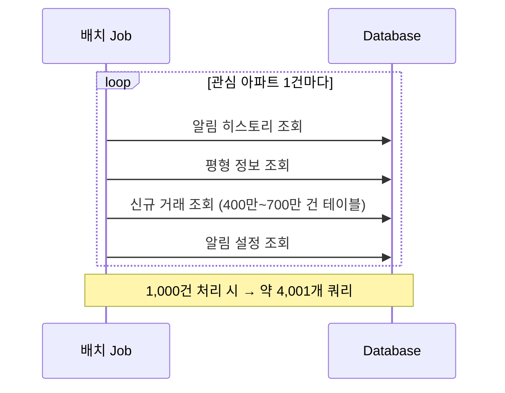

전형적인 **N+1 문제**였습니다. 1,000건의 관심 아파트를 처리하려면 약 4,001개의 쿼리가 발생하고 있었던 거죠. 수만 건이면... 계산하기도 싫을 정도입니다.

거기에 더해 관심 아파트를 읽는 Reader 쿼리 자체도 문제가 있었습니다. 중복 제거를 위해 `SELECT MAX(id)` 서브쿼리를 사용하고 있었는데, 이 서브쿼리가 매 페이지마다 **풀 테이블 스캔**을 유발하고 있었습니다. 데이터가 쌓일수록 점점 느려지는 구조였고, 한 페이지를 읽는 데만 **35.6초**가 걸리는 지경이었습니다.

#### 해결: 페이지 레벨 프리페치 + 배치 조회

N+1을 잡는 방법은 여러 가지가 있습니다. 각각의 트레이드오프를 먼저 정리해보겠습니다.

| 전략 | 장점 | 단점 | 적합한 경우 |
|------|------|------|------------|
| `@BatchSize` | 어노테이션 하나로 적용 가능 | 엔티티 연관관계를 통한 접근이어야 함 | JPA lazy loading에 의한 N+1 |
| `JOIN FETCH` | 한 번의 쿼리로 해결 | 페이징 불가, 카테시안 곱 위험 | 연관 엔티티가 적고 소량일 때 |
| 프리페치 + IN 절 | 구조적 제약 없음 | 직접 구현 필요, 캐시 관리 책임 | Repository 직접 호출 구조 |

처음에는 `@BatchSize`를 떠올렸습니다. 가장 간단하니까요. 하지만 이 배치의 구조를 자세히 들여다보니 걸림돌이 있었습니다. Spring Batch의 Reader가 페이지 단위로 관심 아파트를 읽어오고, Processor에서 건별로 부가 데이터(알림 히스토리, 평형 정보 등)를 **별도 쿼리**로 조회하는 구조였거든요. 엔티티 연관관계를 통한 접근이 아니라 직접 Repository를 호출하는 방식이었기 때문에, JPA 레벨의 페치 전략으로는 손을 댈 수가 없었습니다. `JOIN FETCH`도 같은 이유로 적용 불가였고요.

그래서 남은 선택지는 프리페치밖에 없었습니다. **Reader가 페이지를 읽어올 때, 그 페이지에 필요한 부가 데이터를 IN 절로 한꺼번에 조회**해서 `ConcurrentHashMap`에 올려두는 프리페치 캐시를 직접 구현하는 거였습니다.

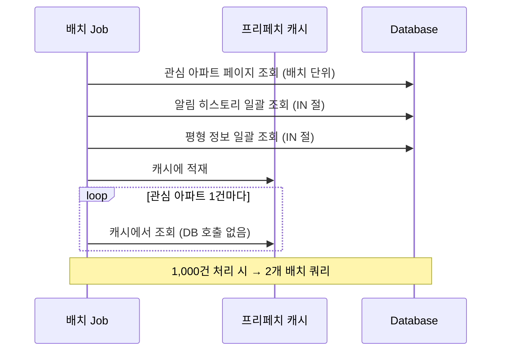

건별로 4개씩 나가던 쿼리가 페이지당 2개의 배치 쿼리로 줄었습니다.

그리고 Reader의 중복 제거 쿼리도 `NOT EXISTS` 패턴으로 변경하고 복합 인덱스를 활용하도록 했습니다.

알림 설정 조회의 경우에는 같은 사용자의 알림 설정이 반복 조회되는 패턴이 있어서 `ConcurrentHashMap` 기반의 인메모리 캐시를 적용했고, 중복 알림 필터링도 건별 `EXISTS` 쿼리에서 배치 조회 + 인메모리 필터링으로 변경했습니다.

#### 결과

| 항목 | Before | After | 개선율 |
|------|--------|-------|--------|
| Reader 1페이지 조회 | **35.6초** | **15ms** | **~2,400배** |
| 쿼리 수 (1,000건 기준) | **~4,001개** | **2개** | **~2,000배** |

Reader 최적화와 N+1 해결이 합산되면서, 전체 배치 실행시간도 평균 **약 21분**으로 줄었습니다(`BATCH_JOB_EXECUTION` 메타 테이블 기준). 최적화 전 70~87분대 스파이크가 완전히 사라졌고, 최대치도 25분 이내로 안정화됐습니다.

여기서 한 가지 의아한 부분이 있으실 수 있습니다. 쿼리 수는 2,000배나 줄었는데 전체 실행시간은 59%밖에 안 줄었다고요? 최적화 후에도 아이템 하나당 평균 10초 이상이 걸리고 있었는데, 원인을 공유드리자면 이 시간의 대부분은 이메일·알림톡·푸시 등 **외부 알림 발송 API 호출**이 차지하고 있었습니다. DB 병목은 해소됐지만, 외부 API 호출이라는 구간은 우리 쪽에서 줄일 수 없는 영역이었던 거죠. 결국 "DB 쿼리를 아무리 최적화해도 전체 시간의 대부분이 외부 호출이면 한계가 있다"는, 어찌 보면 당연한 사실을 숫자로 확인한 셈이었습니다.

테스트 코드도 충분히 작성했습니다. 솔직히 배치 코드를 수정할 때가 가장 긴장됐습니다. 한번 문제가 생기면 수만 건의 사용자에게 잘못된 알림이 가거나 알림이 누락될 수 있거든요. 그래서 테스트 커버리지를 넉넉히 확보해두는 게 중요하다고 생각합니다.

---

### 계약 통계 API: 코드에서 집계하고 있었다

계약 관련 통계 API도 P95 기준으로 **2.4초**의 tail latency가 관측되고 있었습니다. 단순히 건수와 합계를 보여주는 API인데, 왜 이렇게 오래 걸릴까요? 솔직히 이건 Grafana에서 P95 정렬을 걸지 않았으면 지나쳤을 겁니다. 평균 응답시간만 봤을 때는 멀쩡했거든요. 평균의 함정이라는 게 이런 거구나 싶었습니다.

코드를 열어보니 두 가지 문제가 있었습니다.

첫째, 정산일 기준으로 조회하는데 정산일 컬럼에 **인덱스가 없었습니다**. EXPLAIN을 찍어보니 랭킹 API와 같은 패턴이었습니다.

| 항목 | 값 |
|------|-----|
| type | **ALL** (풀 테이블 스캔) |
| rows | **2,021** |
| key | **NULL** (인덱스 미사용) |

2천 건밖에 안 되는 테이블인데 풀 스캔을 하고 있었습니다. 데이터 규모가 작다 보니 인덱스 없이도 응답이 돌아오긴 했고, 그래서 개발 시점에 인덱스 설계가 누락된 것으로 보입니다. 하지만 데이터가 적어서 체감이 덜했을 뿐, 구조적으로는 랭킹 API와 같은 문제였습니다.

둘째, 더 근본적인 문제가 있었습니다. SQL에서 `COUNT`와 `SUM`을 하면 될 것을 **전체 데이터를 코드로 가져와서** `.size`로 카운트하고 `.sumOf {}`로 합산하고 있었습니다. DB에서 집계하면 결과 1행만 전송하면 되는데, 전체 행을 애플리케이션으로 가져온 뒤 메모리에서 집계하고 있었던 거죠.

```kotlin
// Before: DB에서 전체 목록을 가져온 뒤 코드에서 집계
val settlements = repository.findAllSettlementAmount(from, to)
val totalCount = settlements.size           // COUNT를 코드에서
val totalAmount = settlements.sumOf { it }  // SUM을 코드에서
```

```kotlin
// After: DB에서 직접 집계
val summary = repository.findSettlementSummary(from, to)
// → SELECT COUNT(*), SUM(amount) FROM ... WHERE ...
```

정산일 컬럼에 인덱스를 추가하고 SQL 집계로 변경했습니다. EXPLAIN을 다시 찍어보니 `type`이 `ref`로 바뀌고, 인덱스를 정확히 타고 있었습니다. P95가 **2.4초에서 100ms 이하**로 떨어졌습니다.

수정한 코드는 50줄도 안 됐습니다. 그런데 불필요한 데이터 전송과 애플리케이션 메모리 사용을 한 번에 줄인 셈이었습니다. 이런 케이스를 보면 "DB가 잘하는 일은 DB에게 맡기자"라는 기본적인 원칙이 왜 중요한지 새삼 느끼게 됩니다.

## 2장. 병렬화 — 순서가 필요 없는 것들을 왜 순서대로 하고 있었을까

쿼리 최적화를 끝내고 다음으로 눈을 돌린 건 **순차 처리** 구간이었습니다. Tempo 트레이스의 span waterfall을 보면 이런 패턴이 자주 보이더라구요. 서로 의존성이 없는 호출들이 일렬로 늘어서 있는 거죠.

### 알림 발송: 이메일과 알림톡을 직렬로 보내고 있었다

저희 회사 서비스는 중개사분과 사용자분의 매칭을 이어주는 플랫폼 입니다. 매칭이 성사되면 사용자에게 이메일과 알림톡으로 매칭 알림을 보내드리고 있는데, 매칭시에 알림 발송 API도 P95 기준으로 tail latency가 높았습니다. 

이메일과 알림톡을 모두 발송하는 경우, 두 외부 서비스의 응답 지연이 **직렬로 합산**되면서 **느린경우 4.9초**까지 올라가고 있었습니다. Tempo 트레이스를 펼쳐보니 원인이 바로 보였습니다.

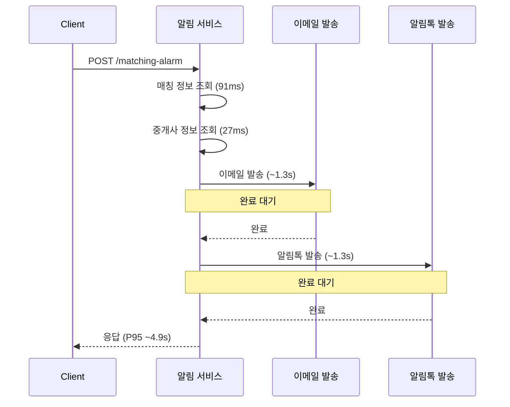

이메일 발송이 끝나야 알림톡 발송이 시작되는 **순차 실행** 구조였습니다. 이메일과 알림톡은 서로 의존성이 전혀 없는데 말이죠. 물론 알림과 같은 기능은 매칭에 의존성이 없기때문에 꼭 실시간으로 발송할 필요는 없지만 병목이 발생하게 되는 구조는 피하는 게 좋다고 생각했습니다.

이메일 결과가 알림톡에 영향을 줄까요? 일반적으로는 그렇지 않을겁니다. 그런데 왜 순서대로 실행하고 있었을까요? 아마 코드를 처음 작성할 때 자연스럽게 위에서 아래로 작성하다 보니 그렇게 된 것 같습니다. 사실 저도 코드를 작성할 때 의식하지 않으면 이렇게 되는 경우가 있어서, 남일 같지 않았습니다.

#### 해결: 코루틴으로 병렬 실행

의존성이 없으니 답은 명확했습니다. 코루틴의 `async`로 병렬 실행하도록 변경했습니다.

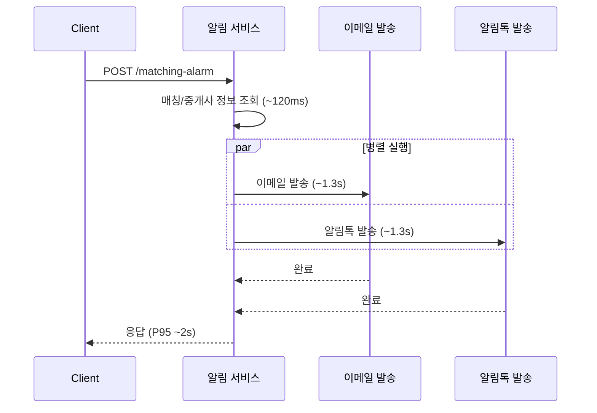

`coroutineScope` 안에서 두 작업을 `async`로 동시에 시작하고, `awaitAll()`로 둘 다 완료될 때까지 기다리도록 변경했습니다.

여기서 한 가지 고민이 있었습니다. 이메일 발송이 실패하면 알림톡까지 같이 실패해야 할까요? 기본 `coroutineScope`에서는 하나의 자식 코루틴이 실패하면 나머지도 취소됩니다. 하지만 이메일과 알림톡은 **서로 다른 채널**이죠. 이메일이 실패했다고 알림톡까지 안 보내면, 사용자는 아무 알림도 받지 못하게 됩니다. 그래서 `supervisorScope`를 사용해서 한쪽이 실패해도 다른 쪽에는 영향을 주지 않도록 했습니다.

```kotlin
supervisorScope {
    val emailJob = async { sendEmail(matching, agent) }
    val alimtalkJob = async { sendAlimtalk(matching, agent) }
    awaitAll(emailJob, alimtalkJob)
}
```

응답시간이 `sum(이메일, 알림톡)`에서 `max(이메일, 알림톡)`으로 바뀌니, 실측 기준 **P95가 4.9초에서 약 2초대로** 떨어졌습니다. 이런식으로 병렬 처리로 개선할 수 있는 부분들을 찾아 개선하는 작업들을 이어갔죠.

### 독립적인 DB 조회도 병렬로

비슷한 패턴이 DB 조회에서도 발견됐습니다. 하나의 API 내에서 3건의 DB 조회가 순차로 실행되고 있었는데, 분석해보니 세 번째 조회는 첫 번째, 두 번째 조회 결과에 **의존성이 없었습니다**.

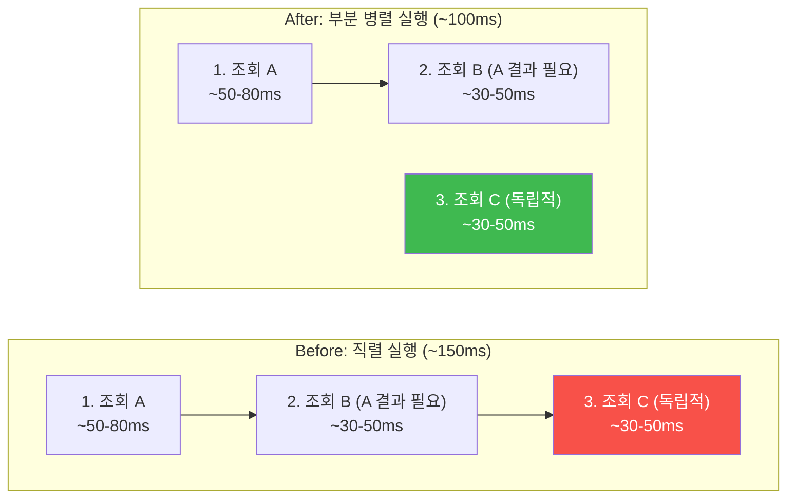

조회 B는 조회 A의 결과가 필요하니 순차 실행이 맞지만, 조회 C는 A·B와 무관하게 실행할 수 있었습니다. 조회 C를 A+B와 병렬 실행하도록 변경했고, 이 로직의 소요시간이 약 **150ms에서 100ms**로 줄었습니다. 절대적인 시간 차이는 크지 않지만, 이 로직이 여러 모듈에서 공통으로 사용되고 있어서 한 번의 수정으로 여러 API의 P95가 약 30% 개선되는 효과가 있었습니다.

## 3장. 캐싱 — 같은 데이터를 왜 매번 새로 가져올까

쿼리를 고치고, 독립적인 호출을 병렬화하고 나니, 다음으로 눈에 들어온 건 **같은 데이터를 매번 DB에서 새로 가져오는 패턴**이었습니다.

### 아파트 상세정보: 매 요청마다 13건 이상의 DB 조회

상세 페이지 하나를 구성하려면 여러 종류의 데이터가 필요합니다. 기본정보, 주변 편의시설, 교통, 대출 정보 등이 각각 다른 모듈과 DB에 분산되어 있거든요. 이 API들의 내부를 들여다보니 **한 번의 요청에 13건 이상의 DB 조회**와 6개 이상의 테이블을 JOIN하는 무거운 쿼리가 실행되고 있었습니다. 처음 Tempo 트레이스에서 이 span 목록을 봤을 때 "이게 한 번의 요청에서 다 나가는 거야?" 싶었습니다.

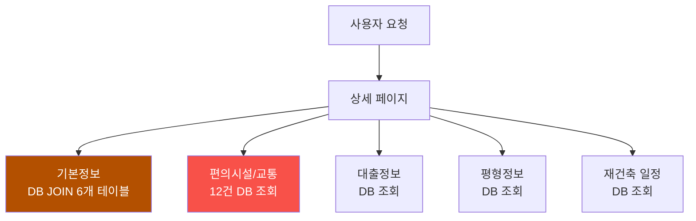

편의시설/교통 정보가 특히 심했습니다. 학교, 병원, 마트, 공원, 버스, 지하철, 고속도로 등 POI(Point of Interest) 정보를 가져오기 위해 **12건의 DB 조회**가 발생하고 있었거든요. 캐시가 없는 상태에서 이 12건의 조회가 모두 발생하면, P95 기준으로 tail latency가 수 초대까지 올라가는 건 당연한 결과였습니다.

그런데 여기서 한 가지 질문을 던져보고 싶습니다. 아파트 주변의 학교나 지하철역이 매 요청마다 바뀔까요? 아마 그렇지 않을 겁니다. 주변 학교가 하루 사이에 이전하거나 지하철 노선이 갑자기 바뀌는 일은 거의 없으니까요. 이런 데이터는 **변경 빈도가 극히 낮은 준정적(semi-static) 데이터**입니다. 그런데 매 요청마다 12건의 DB 조회를 하고 있었던 거죠. 매번 DB를 조회할 이유가 없지 않나 싶었습니다.

#### Redis Cache-Aside 패턴 적용

캐싱 전략을 고민할 때 Write-Through와 Cache-Aside 중 어느 쪽이 맞을지 먼저 따져봤습니다.

| 전략 | 동작 방식 | 장점 | 단점 | 적합한 경우 |
|------|----------|------|------|------------|
| Write-Through | 쓰기 시 캐시도 함께 갱신 | 캐시-DB 정합성 높음 | 쓰기가 드문 데이터에 불필요한 오버헤드 | 읽기/쓰기 모두 빈번한 데이터 |
| Cache-Aside | 읽을 때 캐시 먼저 확인 | 읽기 성능 극대화, 구현 단순 | TTL 만료 시 일시적 stale 가능 | 변경 빈도 낮은 조회 위주 데이터 |

저희가 캐싱하려는 데이터는 **변경 빈도가 낮은 조회 위주의 데이터**였습니다. 쓰기 시점에 캐시를 갱신해야 하는 경우가 거의 없는 거죠. [이전에 캐싱을 적용한 경험]()에서도 Cache-Aside가 이런 패턴에 잘 맞았고, 이번에도 같은 판단이었습니다. 다만 이번에는 데이터 특성에 따라 TTL 전략을 세분화하는 게 필요했습니다.

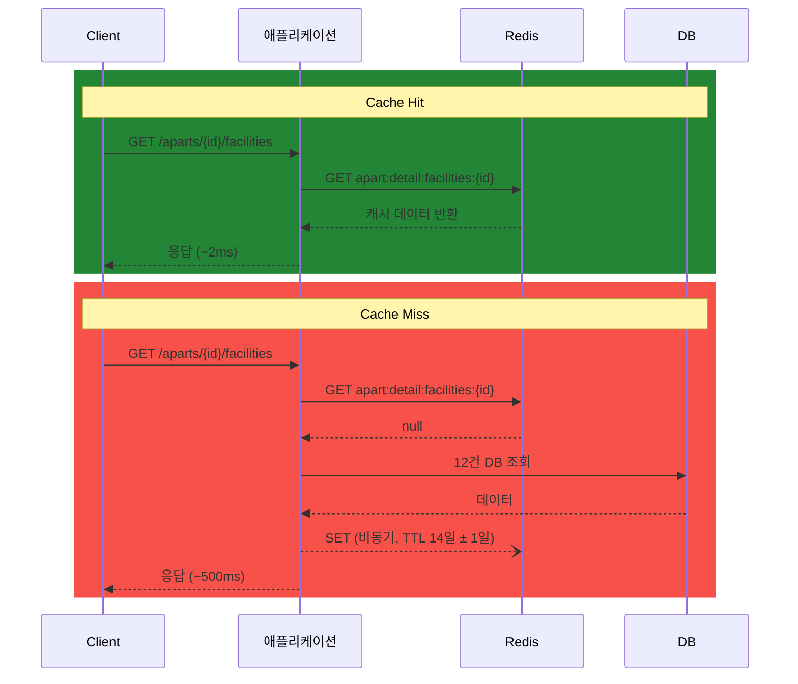

처음에는 단순하게 모든 캐시에 TTL 24시간을 일괄 적용하려고 했습니다. 하지만 아파트 주변 학교나 지하철 정보가 하루만에 만료되는 건 비효율적이지 않나 싶었습니다. 반대로 금리가 포함된 대출 정보에 14일과 같이 너무 오래 TTL을 걸면 사용자 분들이 오래된 금리를 보게 되지 않을까? 싶었습니다. 결국 "일괄 TTL은 안 되겠다"라는 결론에 이르렀고, 데이터의 변경 주기를 하나하나 따져보고 TTL을 나누게 됐습니다.

| 데이터 | TTL | 근거 |
|--------|-----|------|
| POI (학교, 병원, 마트, 공원) | **14일** ± 1일 | 변경 빈도 극히 낮음 |
| 교통 (버스, 지하철, 고속도로) | **14일** ± 1일 | 노선 변경 빈도 낮음 |
| 대출 정보 | **7일** ± 1일 | 금리 변동 주기 고려 |
| 기본 정보 (DB JOIN) | **6시간** ± 30분 | 거래 데이터 반영 필요 |
| 재건축 일정 | **7일** ± 1일 | 일정 업데이트 비교적 드묾 |
| 평형 정보 | **7일** ± 1일 | 구조 변경 드묾 |

혹시 TTL 옆에 붙은 **± 랜덤 지터(Jitter)** 가 눈에 띄셨나요? 이걸 넣은 이유가 있습니다. 인기 있는 아파트는 많은 사용자가 동시에 조회합니다. 만약 같은 TTL을 가진 캐시들이 동시에 만료되면 어떻게 될까요? 수십 개의 요청이 한꺼번에 DB로 몰리는 **Cache Stampede** 현상이 발생할 수 있습니다.

실제 구현에서는 TTL을 enum으로 정의하고, 조회 시점에 `ThreadLocalRandom`으로 지터를 계산하도록 했습니다.

```kotlin
enum class DetailCacheTtl(
    val baseMinutes: Long,
    val jitterMinutes: Long,
) {
    FACILITIES_TRANSPORT(20160L, 1440L), // 14일 ± 1일
    LOANS(10080L, 1440L),               // 7일 ± 1일
    TYPES(10080L, 1440L),               // 7일 ± 1일
    RECONSTRUCTION(10080L, 1440L),      // 7일 ± 1일
    BASIC_INFO(360L, 30L),              // 6시간 ± 30분
    PRICE(360L, 30L);                   // 6시간 ± 30분

    fun toDuration(): Duration {
        val jitter = ThreadLocalRandom.current()
            .nextLong(-jitterMinutes, jitterMinutes + 1)
        return Duration.ofMinutes(baseMinutes + jitter)
    }
}
```

같은 데이터라도 인스턴스마다, 요청 시점마다 만료 시각이 달라지기 때문에 Stampede를 자연스럽게 분산시킬 수 있습니다.

또 해당 데이터들이 업데이트 되는 시점에 캐시를 비워줄 수 있도록 했습니다. 예를 들어 대출 정보는 금리가 변동되는 시점에 캐시를 삭제하도록 했고, 재건축 일정은 일정이 변경되는 시점에 캐시를 삭제하도록 했습니다. 이렇게 하면 TTL이 만료되기 전에 캐시가 갱신될 수 있어서, 사용자들이 오래된 정보를 보는 상황을 줄일 수 있습니다.

여기까지가 "무엇을, 얼마나 오래" 캐싱할지에 대한 이야기였습니다. 사실 여기서 끝이면 좋겠지만, 캐시를 도입하면서 고민해야 할 건 TTL만이 아니었습니다. "캐시를 넣었는데 오히려 장애가 나면?", "진짜 효과가 있는 건 맞나?" 같은 질문들이 꼬리를 물었고, 이 고민들이 생각보다 중요했습니다.

#### 캐시 저장은 비동기로

아파트 및 지하철역 검색시에 사용하는 자동완성(Autocomplete)기능 API에도 캐싱을 적용했는데, 여기서 한 가지 더 고민이 생기더라구요.

자동완성은 사용자가 **글자를 입력할 때마다** 호출되는 API입니다. 타이핑하는 속도보다 응답이 느리면 사용자 경험이 급격히 떨어지는, 응답 지연에 굉장히 민감한 API인 거죠. 그런데 캐시 미스가 발생했을 때 DB에서 데이터를 가져온 뒤 Redis에 저장하는 과정까지 동기적으로 실행되면, Redis 저장 시간만큼 응답이 늦어집니다.

여기서 한 가지 질문을 던져봤습니다. 캐시 저장이 실패하면 어떻게 되나? 다음 요청에서 다시 시도하면 그만이지 않을까? 그렇다면 사용자 응답을 블로킹할 이유가 없지 않나 싶었고, **비동기(fire-and-forget)** 로 전환했습니다.

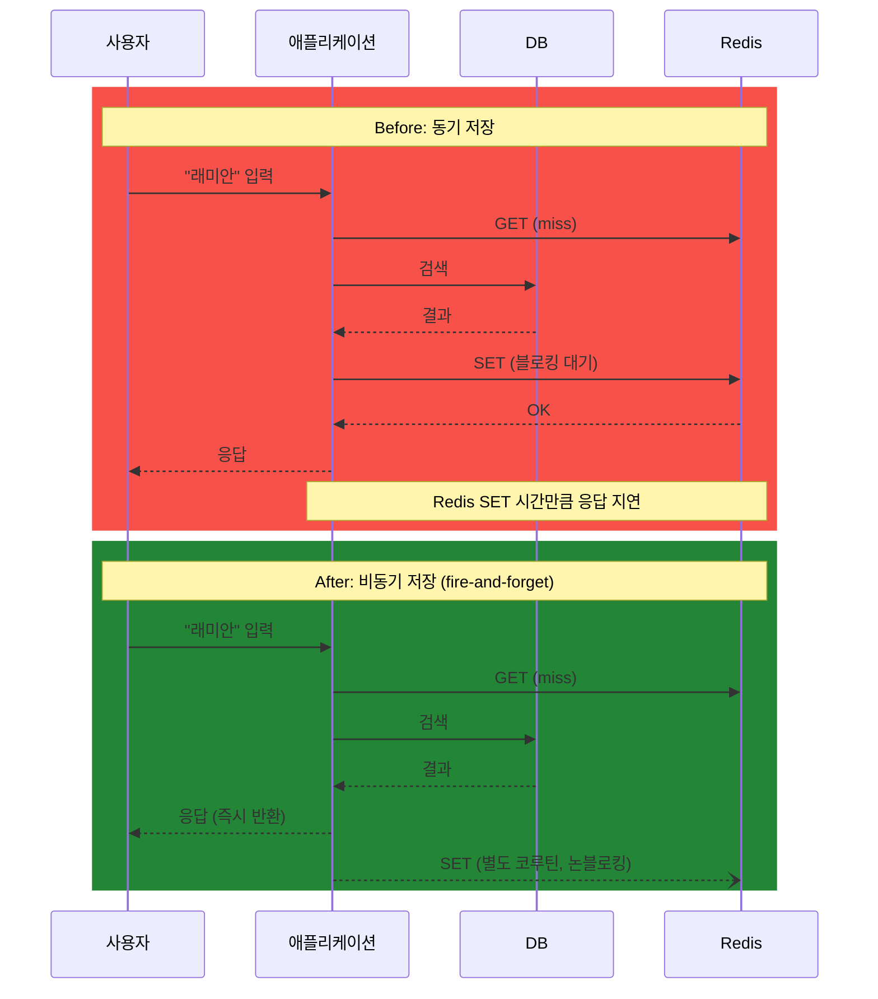

```kotlin
// 캐시 전용 코루틴 스코프
private val cacheScope = CoroutineScope(Dispatchers.IO + SupervisorJob())

fun <T> setAsync(key: String, value: T, ttl: Duration, cacheType: String) {
    cacheScope.launch {  // fire-and-forget: 응답을 블로킹하지 않음
        set(key, value, ttl, cacheType)
    }
}

// 애플리케이션 종료 시 코루틴 정리
override fun destroy() {
    cacheScope.cancel()
}
```

솔직히 처음에는 단순하게 `GlobalScope.launch`로 구현했었습니다. 동작은 잘 됐거든요. 그런데 코드 리뷰에서 두 가지 문제를 지적받았습니다. 하나는 애플리케이션이 셧다운될 때 실행 중인 코루틴이 제대로 정리되지 않는다는 점, 다른 하나는 일반 `Job`을 사용하면 하나의 캐시 저장이 실패할 때 같은 스코프의 다른 코루틴까지 취소될 수 있다는 점이었습니다. 돌아가니까 괜찮다고 넘어갈 뻔했는데, 리뷰를 보고나니 운영 환경에서 충분히 터질 수 있는 문제였습니다. 이런 부분은 코드 리뷰의 힘이 크다고 느꼈습니다. 그래서 `SupervisorJob`으로 실패를 격리하고, `DisposableBean`의 `destroy()`에서 스코프를 cancel하도록 수정했습니다.

#### 캐시 장애 시에도 서비스는 계속되어야 한다

캐싱을 도입하면서 또 중요한 점은 **"캐싱(ex.Redis)이 죽어도 서비스는 계속 돼야한다는 점 입니다."**

성능 최적화를 위한 캐시는 어디까지나 **수단**으로만 취급하고, Redis에 문제가 생기면 자연스럽게 DB로 폴백하도록 설계하는 게 중요하다고 생각합니다. 

```kotlin
fun <T> get(key: String, type: Class<T>, cacheType: String): T? {
    return try {
        val json = redisTemplate.opsForValue().get(key)
        if (json != null) {
            hitCounter(cacheType).increment()
            objectMapper.readValue(json, type)
        } else {
            missCounter(cacheType).increment()
            null
        }
    } catch (e: Exception) {
        // Redis 장애 시 캐시 미스로 처리 → DB 직접 조회로 폴백
        log.warn("Redis cache read failed: key={}", key, e)
        missCounter(cacheType).increment()
        null
    }
}
```

Redis 조회와 저장을 모두 try-catch로 감싸서, Redis에 문제가 생기면 캐시 미스로 처리하고 원래 경로(DB 직접 조회)로 동작하도록 했습니다. 느려지는 건 감수할 수 있지만, 서비스 자체가 죽어버리면 안 되니까요. 저는 캐시의 역할은 "있으면 빠르고, 없으면 원래대로"라고 생각합니다. 캐시 때문에 오히려 장애가 나는 상황은 만들고 싶지 않았습니다.

#### 캐시 관측성 확보

캐시를 도입하고 나니 **"이거 진짜 효과가 있는 건 맞는건가?"** 를 검증하고 싶었습니다. TTL이 적절한지, 히트율은 어떤지, Redis가 느려지고 있진 않은지 숫자, 데이터로 확인할 수 없으면 그냥 감으로 운영하는 거니까요.

그래서 Micrometer 카운터로 캐시 히트/미스 횟수를 수집하고, 캐시 타입별(`basic`, `facilities`, `loans`, `types`, `reconstruction`, `price`)로 태그를 달아서 Grafana에서 모니터링할 수 있도록 구성했습니다. Redis GET/SET 소요시간도 타이머 메트릭으로 수집하구요. Cache Hit Rate Monitor라는 별도 대시보드를 만들어서 캐시 타입별 히트율 추이를 실시간으로 확인할 수 있게 했는데, 이게 나중에 TTL을 조정할 때 판단 근거가 되어서 꽤 유용했습니다. 결국 모니터링은 배포 전에도, 배포 후에도, 계속 필요한 것 같습니다.

#### 결과

운영 환경 Prometheus 메트릭 기준 결과입니다. 캐시 히트와 미스가 혼합된, 실제 사용자가 체감하는 P95 응답시간입니다. 첫 번째 이미지에서 캐싱 배포 전 스파이크가 보이고, 두 번째 이미지에서 배포 후 안정적인 현재 상태를 확인할 수 있습니다.


> Prometheus 스토리지 용량 제한(4GB) 특성상, 위 Before 이미지는 배포 직전 수일간의 기록입니다. 아래 테이블의 Before P95(4,045ms, 4,840ms)는 캐싱 도입 전 피크 트래픽 시간대에 기록한 수치로, 최적화 작업 기간 중 이미 Prometheus에서 만료되었습니다.


| API | req/s | Before P50 | After P50 | Before P95 | After P95 | After P99 |
|-----|-------|-----------|----------|-----------|----------|----------|
| 기본정보 | **568** | 183ms | **43ms** | 4,045ms | **50ms** | 50ms |
| 편의시설/교통 | **525** | 497ms | **119ms** | 4,840ms | **168ms** | 205ms |
| 재건축 일정 | 29 | 124ms | **42ms** | — | **50ms** | 55ms |
| 평형정보 | 28 | 147ms | **46ms** | — | **63ms** | 109ms |

기본정보와 편의시설/교통 API는 각각 **초당 568건, 525건**의 요청을 처리하고 있습니다. 일 기준으로 환산하면 약 **4,900만 건, 4,500만 건**에 해당하는 트래픽입니다. P95 기준으로 기본정보는 4초대에서 **50ms**로, 편의시설/교통은 4.8초대에서 **168ms**로 떨어졌고, P99에서도 200ms 이내를 유지하고 있습니다.

혹시 "캐시 미스가 나면 Redis 조회 시간만큼 오히려 느려지는 거 아닌가?" 하는 생각이 들기도 했습니다. 그러나 확인해보니 Redis GET이 null을 반환하는 데 걸리는 시간은 **1~5ms** 수준이었습니다. 캐시 미스가 나더라도 기존 대비 성능 저하는 거의 무시할 수 있는 수준인 것 같습니다. 다만 Redis에서 응답 지연이 조기에 끊을 수 있도록 타임아웃을 100ms로 설정해뒀는데, 이 타임아웃이 걸리는 경우는 거의 없지만, 만약 발생한다면 그때는 캐시 조회가 실패한 것으로 간주하고 DB로 폴백하도록 되어 있습니다.

## 전체 결과 정리

약 10일간의 작업을 마치고, 전체 결과를 정리해봤습니다. 숫자를 나열하기 전에 하나 말씀드리고 싶은 건, 이 수치들은 전부 운영 환경 Prometheus 메트릭 기준이라는 점입니다. 아래 Grafana 대시보드에서 최적화 전후를 한눈에 비교할 수 있습니다.


| 영역 | API / 컴포넌트 | Before | After (운영) | 개선율 |
|------|--------------|--------|-------------|--------|
| 쿼리 | 거래량 랭킹 | P95 1.9~2.4s | 95ms | **~21배** |
| 쿼리 | 단가 랭킹 | P50 7.24s | 126ms | **~57배** |
| 쿼리 | 세대수 랭킹 | P50 6.33s | 125ms | **~51배** |
| 쿼리 | 계약 요약 | P95 2.4s | <100ms | **~24배** |
| 배치 | Reader 1페이지 | 35.6s | 15ms | **~2,400배** |
| 배치 | 쿼리 수 (1K건) | ~4,001개 | 2개 | **~2,000배** |
| 배치 | 전체 실행시간 | ~50분 (최대 87분) | ~21분 (최대 25분) | **~59%** |
| 병렬화 | 알림 발송 (P95) | 4.9s | ~2s | **~59%** |
| 병렬화 | 독립적 DB 조회 병렬화 | ~150ms | ~100ms | **~30%** |
| 캐싱 | 기본정보 (P95, 568 req/s) | 4,045ms | 50ms | **~99%** |
| 캐싱 | 편의시설/교통 (P95, 525 req/s) | 4,840ms | 168ms | **~97%** |

> 단가/세대수 랭킹은 P50 기준입니다. 대부분의 요청(중앙값)조차 7초대였기 때문에, P95가 아닌 P50을 Before 기준으로 잡았습니다.

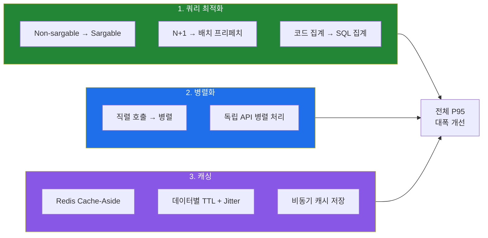

## 느낀 점

### "인덱스가 있다"와 "인덱스를 타고 있다"는 다른 문제였다

이번 작업 전에도 EXPLAIN을 사용하긴 했지만, 솔직히 말씀드리면 "인덱스 있으니까 괜찮겠지" 하고 넘어간 적이 있었습니다. 아마 저만 그런 건 아닐 거라고 생각합니다. 이번에 Non-sargable 쿼리 문제를 직접 겪고 나서야, 인덱스가 존재하는 것과 옵티마이저가 실제로 그 인덱스를 사용하는 것은 완전히 다른 문제라는 걸 다시금 느끼게 됐습니다. 앞으로 더 꼼꼼히 봐야겠다는 생각이 들더라구요.

또 코드 리뷰만으로는 성능 문제를 잡기 어렵다는 것도 느꼈습니다. 코드상 깔끔해 보이는 쿼리라고 하더라도 풀 스캔을 유발하고, 잘 돌아가는 것처럼 보이는 배치가 수천 개의 불필요한 쿼리를 날리고 있을 수 있거든요. 저도 처음에는 추측으로 접근했다가 엉뚱한 곳을 파고 있었던 경험이 있습니다. ㅎㅎ.. 결국 EXPLAIN이든 Tempo 트레이스든 Prometheus 메트릭이든, **도구가 보여주는 숫자, 데이터**를 기반으로 접근하는 수밖에 없지 않나 싶습니다.

### 어떤 기술을 쓸지보다, 지금 뭐가 문제인지가 먼저였다

캐싱을 도입할 때도 처음에는 "어떤 캐시 전략이 최적인가"부터 고민했었습니다. Write-Through가 나은지, Cache-Aside가 나은지, TTL은 어떻게 잡을지. 기술 선택부터 들어갔던 거죠. 그런데 돌이켜보면 그보다 "지금 어떤 데이터가 반복 조회되고 있는가"를 먼저 파악하는 게 훨씬 중요했던 것 같습니다. 문제를 정확히 알면 기술 선택은 자연스럽게 따라오는 것 같습니다.

병렬화도 마찬가지였습니다. 어떤 비동기 프레임워크를 쓸지보다, 지금 순차로 실행되고 있는 것 중에 독립적인 게 뭔지를 먼저 찾는 게 핵심이었습니다. 결국 성능 최적화의 시작점은 더 좋은 기술을 찾는 게 아니라, 현재의 비효율을 정확하게 찾아내는 데 있지 않나 싶습니다. 너무 당연한 이야기처럼 들릴 수 있지만, 문제를 특정해야 그에 맞는 개선방법이 나오니까요.

### 모니터링이 없었으면 시작도 못 했다

[이전에 구축한 모니터링 시스템]()이 이번 작업의 전제 조건이었습니다. 이 부분은 아무리 강조해도 부족하다고 느껴지네요. 편의시설/교통 API가 12건의 DB 조회를 하고 있다는 사실도, 코드만 봐서는 여러 모듈에 걸쳐 분산되어 있어 전체 그림이 한번에 보이지 않았는데, Tempo 트레이스의 span waterfall을 펼쳐보고 나서야 "아, 이게 한 요청에서 다 나가는 거였구나" 하고 발견할 수 있었습니다. "측정할 수 없으면 개선할 수 없다"는 말이, 이번만큼 체감된 적이 없었던 것 같습니다.

## 마치며

돌이켜보면 이번 작업에서 사용한 기법들 — Non-sargable 쿼리 수정, N+1 해결, 인덱스 추가, 병렬화, Cache-Aside — 은 어느 것 하나 새로운 기술이 아니었습니다. 전부 어디선가 한 번쯤은 들어본 기본적인 기법들이죠. 너무 진부한 말일 수 있지만, 결국 돌고 돌아 기본이 가장 강력한 것 같습니다.

다만 기본적인 것이라고 해서 적용이 쉬운 건 아니었습니다. 오히려 **어디가 느린지 찾는 과정**이 가장 어려웠고, 일단 원인을 찾고 나니 해결 자체는 명확한 경우가 많았습니다. EXPLAIN 한 줄, 코루틴 async 몇 줄, Redis 캐시 설정 몇 줄. 수정한 코드의 양은 많지 않았지만 효과는 꽤 컸습니다. 이 글의 제목을 "느린 곳을 찾는 게 고치는 것보다 어려웠다"로 정한 이유이기도 합니다.

그리고 이번 작업을 마치면서 한 가지 더 한 것이 있습니다. 이번에는 습관적으로 대시보드를 들여다보다가 우연히 발견한 거였는데, 다음에도 이런 식으로 우연에 의존할 수는 없지 않나 싶었습니다. 그래서 **P95가 특정 임계치를 넘는 API가 발생하면 Grafana Alert으로 알림을 받도록** 설정해뒀습니다. 다음부터는 시스템이 먼저 알려주도록요.

물론 아직 남아있는 숙제도 있습니다. 무거운 쿼리 패턴 중 아직 손대지 못한 것들이 있고, 레거시 서비스의 Stored Procedure에서 발생하는 N+1도 남아있습니다. 이 부분들은 스코프가 커서 시간을 두고 점진적으로 개선해 나갈 계획입니다. 완벽하게 끝냈다고 말할 수 없는 상태라서 조금 아쉽기도 하지만, 성능 최적화라는 게 원래 "끝"이 없는 영역이지 않나 싶습니다. 정답은 없고, 지금 우리 서비스 상황에 맞는 선택들이 있을 뿐이라고 생각합니다.

혹시 비슷한 상황을 겪고 계신 분이 있다면, 일단 EXPLAIN부터 찍어보시는 걸 추천드립니다. 느린 쿼리의 원인은 생각보다 단순한 곳에 있을 수 있거든요. 저도 이번에 그걸 제대로 경험했으니까요.

긴 글 읽어주셔서 감사합니다.

## 참고 자료

### 관련 글
- [서비스 장애는 사용자가 알려주지 않아도 알아야한다 — 사내 모니터링 시스템 구축기]()

### 쿼리 최적화
- [Use The Index, Luke — Functions in WHERE Clause](https://use-the-index-luke.com/sql/where-clause/functions) — Non-sargable 쿼리와 인덱스 무효화 패턴
- [MySQL Official Docs — EXPLAIN Output Format](https://dev.mysql.com/doc/refman/8.4/en/explain-output.html) — EXPLAIN 출력 해석 가이드
- [MySQL Official Docs — Optimization and Indexes](https://dev.mysql.com/doc/refman/8.4/en/optimization-indexes.html) — 복합 인덱스 설계 전략

### 캐싱
- [AWS — Database Caching Strategies Using Redis](https://docs.aws.amazon.com/whitepapers/latest/database-caching-strategies-using-redis/caching-patterns.html) — Cache-Aside vs Write-Through 비교
- [Cache Stampede 문제와 해결 방법](https://instagram-engineering.com/thundering-herds-promises-82191c8af57d) — Instagram의 Thundering Herd 대응

### 병렬화 / 비동기
- [Kotlin Official Docs — Coroutines Basics](https://kotlinlang.org/docs/coroutines-basics.html) — 코루틴 기초와 structured concurrency
- [Kotlin Official Docs — Shared Mutable State and Concurrency](https://kotlinlang.org/docs/shared-mutable-state-and-concurrency.html) — SupervisorJob, 예외 전파와 격리

### 모니터링
- [Micrometer Official Docs — Cache Instrumentations](https://docs.micrometer.io/micrometer/reference/reference/cache.html) — 캐시 히트/미스 메트릭 수집
