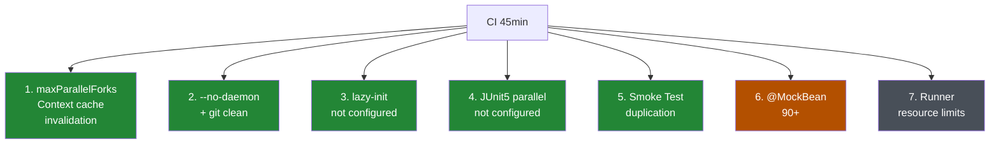
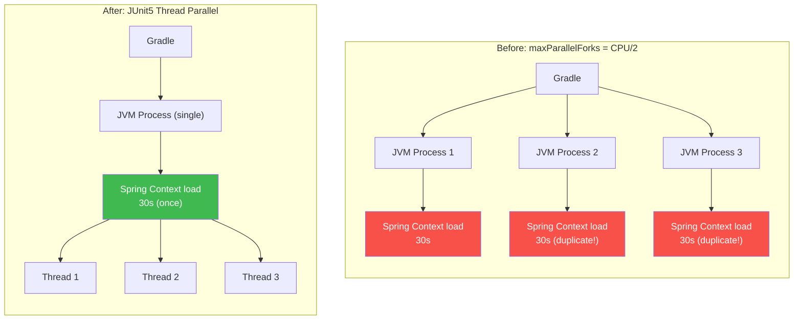
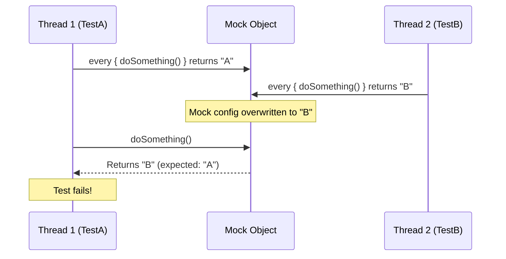

Hi, I'm Jeongil Jeong, a backend developer working at a proptech platform.

In a [previous post](), I wrote about how I, as the sole remaining backend developer, consolidated 13 microservices into a modular monolith. At the end of that post, I mentioned:

> "After the transition, we experienced CI test build times spiking to 45 minutes, which I'll cover in a follow-up post."

This is that follow-up post.

## The Problem: CI Took 45 Minutes

It happened right after the transition was complete and I ran the CI pipeline. We use GitHub Actions for CI — when a PR is opened, it runs tests for the changed modules and generates a coverage report with JaCoCo (a test coverage tool). The "Build test reports" step just wouldn't finish. Something felt off, so I checked the logs, and I couldn't believe what I was seeing.

| Branch | CI Duration | Result |
|--------|------------|--------|
| Existing MSA branch | **2m 1s** | SUCCESS |
| Modular monolith transition branch | **45m 31s** | FAILED |

22x slower. And it failed on top of that.

Below is the actual GitHub Actions CI run result. The "Build test reports" step alone consumed **45 minutes and 31 seconds**.


Expanding the logs revealed "BUILD FAILED in 45m 30s." All 153 tasks executed, and it still failed.


One thing worth clarifying here: the 2 minutes and 1 second on the MSA branch doesn't mean the entire test suite took 2 minutes. In an MSA architecture, each service is an independent application, so CI runs separately for each service. Since only the changed service gets tested in a PR, if one service's tests take 2 minutes, that's just 2 minutes. Other services aren't modified, so CI skips them.

The modular monolith is different. Eleven services are integrated as modules within a single Spring Boot application, and with shared modules added, there are 15 modules total. When a transition PR modifies files across all modules, all 15 modules' tests run at once. I knew the comparison wasn't exactly fair.

But fair or not, **the reality was that running CI took 45 minutes, and that itself was the problem**. This was a special case since the transition PR touched every file, but going forward, modifying the `common` module or the root `build.gradle.kts` would trigger all tests — a scenario that could easily happen again.

As I mentioned, I'm currently the sole backend developer. Shipping fast and deploying fast matters, and if CI takes 45 minutes, I'd have to wait forever between opening a PR and merging it. This was a direct hit to productivity.

"If I don't fix this now, it'll keep slowing me down" — so I started investigating.

## Root Cause Analysis: Why Was It So Slow?

I opened the CI logs, traced where time was being consumed, dug through Gradle config files, and examined the test structure. Turns out it wasn't just one or two issues. I found 7 bottlenecks in total.

1. **`maxParallelForks` invalidating Spring Context caching** — Each JVM process has independent memory, making Context sharing impossible
2. **`--no-daemon` + `git clean -ffdx` forcing cold starts every time** — Build cache and Gradle daemon wiped clean
3. **`spring.main.lazy-initialization` not configured** — All beans initialized even when unused by tests
4. **JUnit5 thread-level parallel execution not configured** — No parallel execution setting for test classes
5. **13 Smoke Tests unnecessarily loading full Context** — Duplicating what integration tests already verify in CI
6. **~90 `@MockBean`/`@MockkBean` causing Context cache misses** — Each test class generating different cache keys
7. **Resource constraints on self-hosted MacBook Pro (M1, 8 cores, 16GB) runner** — Multiple JVM processes competing for CPU/memory



<p style="text-align: center; color: #8b949e; font-size: 0.85em;">
Green: Fixed this time / Orange: Deferred due to scope / Gray: Hardware constraint
</p>

After laying out all the causes, it was clear why it took 45 minutes. Each one had its own reason, but stacked together, they produced the 45-minute result.

Among these, #6 (`@MockBean` consolidation) was too large in scope. Spring TestContext caches and reuses contexts across tests that have identical bean configurations, but when `@MockBean` is used, "which beans were replaced with mocks" becomes part of the cache key. If Test A mocks `ServiceA` and Test B mocks `ServiceB`, the cache keys differ, forcing the same context to reload. With roughly 90 `@MockBean` declarations in various combinations, cache hit rates were abysmal. Fixing this would require consolidating mock combinations across test base classes, so I deferred it. #7 was a hardware limitation beyond my control. I decided to tackle the remaining five one by one.

## The Fix: Tackling Them One by One

It ended up being a fairly large effort — 66 files modified in total. I started with the simplest fixes and worked my way up to the more complex ones.

### 1. Applying Lazy Initialization

I started with the simplest change that could deliver immediate results.

Spring Boot, by default, initializes all registered beans at startup. That's the right approach for production, but it becomes a problem in tests. When you're testing a single service, beans from completely unrelated modules still get initialized, wasting time.

`lazy-initialization` does exactly what the name says — it initializes beans "lazily." Instead of creating all beans at startup, it only initializes the ones actually used at the point they're needed. This means `@SpringBootTest` no longer loads every single bean upfront; it loads only what each test actually needs, reducing context loading time. All I had to do was add one line to each of the 15 modules' test configuration files (`application-test.yml`).

```yaml
spring:
  main:
    lazy-initialization: true
```

Since it's only applied in the test environment, there's zero impact on production and minimal risk.

**Result:** Each module got about 10–20 seconds faster, and applied across 15 modules, that added up to **roughly 5 minutes** saved. Not bad for a one-liner.

### 2. A Landmine I Planted Myself — From Process Parallelism to Thread Parallelism

This was the core of the optimization, and the most ironic part.

The setting that caused the problem was one **I had personally added** during the previous [multi-module transition]() for build performance.

```kotlin
// build.gradle.kts (added during multi-module transition)
tasks.withType<Test> {
    useJUnitPlatform()
    maxParallelForks = (Runtime.getRuntime().availableProcessors() / 2).takeIf { it > 0 } ?: 1
}
```

At the time, I thought, "Run in parallel with half the CPU cores — that should speed things up." And it did — total build time dropped from 27 minutes to 8 minutes. I even mentioned this in the [multi-module transition post]().

But for tests, this turned out to be counterproductive. `maxParallelForks` spawns **separate JVM processes**, and since each process has its own memory space, **they can't share the Spring TestContext cache**. The same `@SpringBootTest` context ends up being loaded redundantly across multiple processes.



The key difference is **whether the Spring TestContext cache can be shared**. `maxParallelForks` creates separate JVM processes, each with its own memory space, loading the same context as many times as there are processes. JUnit5 thread parallelism, on the other hand, runs within a single JVM, so the context is loaded once and shared across threads.

Builds and tests are different. Builds involve compilation, which doesn't require shared state between processes. But for Spring tests, Context caching is the key to performance. Splitting into processes means the cache can't be shared, causing the same context to reload for each process. Past me had planted a landmine for future me.

The fix was clear: reduce `maxParallelForks` to 1 so there's only one JVM process, then enable JUnit5's thread-level parallel execution to **run multiple test classes concurrently within a single JVM**. Same JVM means shared Spring TestContext cache.

```kotlin
tasks.withType<Test> {
    useJUnitPlatform()
    maxParallelForks = 1  // Single JVM process

    systemProperty("junit.jupiter.execution.parallel.enabled", "true")
    systemProperty("junit.jupiter.execution.parallel.mode.default", "same_thread")
    systemProperty("junit.jupiter.execution.parallel.mode.classes.default", "concurrent")
    systemProperty("junit.jupiter.execution.parallel.config.strategy", "dynamic")
    systemProperty("junit.jupiter.execution.parallel.config.dynamic.factor", "1")
}
```

This is where I spent a good amount of time yak-shaving. Initially, I set `mode.default` to `concurrent` as well — thinking "parallel classes AND parallel methods should be even faster." Tests started failing all over the place. Not just a few — they broke everywhere, and figuring out what went wrong was half the battle.

Tracing the cause, I found that our unit tests heavily used MockK (a Kotlin mocking library), and MockK's `every { }` blocks aren't thread-safe. With method-level parallelism, multiple threads would call `every { }` on the same mock object simultaneously, causing tests to interfere with each other.



So I changed strategy: **run test classes in parallel, but run methods within the same class sequentially**.

```
mode.default = same_thread          → Methods run sequentially (MockK-safe)
mode.classes.default = concurrent   → Classes run in parallel (speed gain)
```

This way, different test classes execute concurrently while mocks within the same class don't interfere with each other.

The joy of enabling parallel execution was short-lived — Spring REST Docs (a tool that auto-generates API documentation from test code) tests started failing intermittently. Multiple test classes were simultaneously writing snippet files to the `build/generated-snippets/` directory, causing file conflicts. The "intermittent" part was especially painful — different tests broke on every run.

I solved this using JUnit5's `@ResourceLock`. It's an annotation that prevents tests sharing the same resource from running concurrently. I added `@ResourceLock("spring-restdocs")` to 33 test base classes (13 IntegrationTest, 13 WebTest, 7 JpaTest) to ensure REST Docs tests ran sequentially.

**Result:** Simply switching from process parallelism to thread parallelism cut **roughly 15 minutes**. Sharing the Context cache and eliminating redundant context loading was the decisive factor. (`@ResourceLock` itself didn't directly reduce time, but it was a prerequisite for stable parallel execution.)

### 3. Smoke Test Tag Separation

Thirteen `*ApplicationTests.kt` files were each loading the full Context via `@SpringBootTest`. These were just Smoke Tests — they only checked "does the application start up?" — but CI was already verifying context loading through full integration tests. Completely redundant.

I added `@Tag("smoke")` and excluded them from CI.

```kotlin
@Tag("smoke")
@SpringBootTest
class SomeModuleApplicationTests {
    @Test
    fun contextLoads() { }
}
```

```kotlin
tasks.test {
    if (System.getenv("CI") == "true") {
        useJUnitPlatform { excludeTags("smoke") }
    }
}
```

They still run locally for quick validation during development; they're only skipped in CI.

**Result:** Removing 13 modules' unnecessary Spring Context loading saved **roughly 5 minutes**.

### 4. CI Workflow Caching Improvements

Looking at the CI workflow, I found `git clean -ffdx` wiping the `.gradle/` build cache entirely, and `--no-daemon` starting a fresh Gradle JVM every time. The Gradle daemon keeps a JVM running in the background for reuse, but `--no-daemon` disables that and spawns a new JVM each run. No JVM warmup, no class cache — everything cold-started.

This seemed to come from the mindset of "CI should always do clean builds," which is fair for GitHub-hosted runners where you get a fresh environment every time. But we were using a self-hosted runner (MacBook Pro). On a self-hosted runner where the environment persists, reusing caches is far more efficient.

```yaml
# Before
- run: git clean -ffdx
- run: ./gradlew --no-daemon $TASKS

# After
- uses: actions/setup-java@v4
  with:
    cache: 'gradle'
- run: ./gradlew --build-cache $TASKS
  env:
    CI: true
```

I removed `git clean -ffdx` and replaced `--no-daemon` with `--build-cache`. The `cache: 'gradle'` setting in `actions/setup-java` preserves the `.gradle/` directory.

**Result:** Going from cold starts every time to reusing the Gradle daemon and build cache saved **roughly 5 minutes**. The cache benefits were especially noticeable from the second run onward.

## Results by Optimization

Here's the breakdown of each optimization's contribution and the overall result.

| Optimization | Time Saved | Notes |
|-------------|-----------|-------|
| JUnit5 thread parallel execution | **~15 min** | Context cache sharing was key |
| Lazy Initialization | **~5 min** | 10–20s per module × 15 modules |
| Smoke Test tag separation | **~5 min** | Removed 13 unnecessary context loads |
| CI workflow caching | **~5 min** | Eliminated cold starts |
| REST Docs `@ResourceLock` | No direct time savings | Prerequisite for parallel execution |
| **Total** | **~30 min** | **45 min → 10 min (~77% reduction)** |


I didn't run CI after applying each optimization individually — these are estimates based on local test runs and per-task durations in CI logs. That said, the change that felt most impactful was definitely reducing `maxParallelForks` to 1 and switching to JUnit5 thread parallelism. That single change accounted for half the total improvement.

The actual CI results confirmed this. Below is the GitHub Actions workflow after optimization.


Expanding the logs shows the "Build test reports" step completing successfully, followed by the Jacoco Report generation.


Before optimization, the "Build test reports" step alone consumed 45 minutes and 31 seconds while failing the entire workflow. After optimization, the same step took 7 minutes and 8 seconds, with Jacoco Report generation and coverage checks completing successfully.

All major module tests passed. With no broken tests and everything green, I opened the PR.

If you're in a similar situation and wondering where to start, I'd recommend tackling Spring Context loading optimizations first. Context loading is what consumes the most time in tests — removing redundant tests and CI caching improvements can come after.

### Bonus: Bugs Discovered During Optimization

The optimization work also uncovered some hidden bugs. Issues that never surfaced under MSA — where tests ran separately per service — started appearing when the modular monolith ran everything together.

A test base class in one module was injecting a file utility bean, but in the modular monolith, multiple modules had beans with the same name, causing the wrong bean to be injected. I fixed this by adding `@Qualifier` to specify the exact bean. Two tests in another module were also failing — tracing the cause, I found that endpoints previously moved to a different module due to URL conflicts still had their old tests hanging around. Since the endpoints no longer existed, Spring Security was returning 401s. I cleaned up by deleting those test classes.

## Takeaways

### Build Optimization ≠ Test Optimization

This was the biggest lesson for me.

When I added `maxParallelForks` during the multi-module transition and build time dropped from 27 minutes to 8 minutes, I thought this setting was a silver bullet. What I actually learned this time was not that "parallelization makes things faster," but that **"the optimal unit of parallelization depends on what you're parallelizing."** Compilation doesn't need shared state between processes, so process-level parallelism works. But Spring tests need to share Context cache to be fast, so thread-level parallelism is the right approach. Same word — "parallel" — but the strategy needs to change depending on the target. I only truly understood this after going through the pain myself.

### Question the "Obvious" Settings

Settings like `--no-daemon` and `git clean -ffdx` seemed to come from the mindset of "CI should obviously do clean builds." That's not wrong — for GitHub-hosted runners. But we were using a self-hosted runner, and on a self-hosted runner where the environment persists, leveraging caches is far more efficient.

I should have been thinking **"what's optimal for our environment"** instead of **"what everyone else does."**

### Next Time, Check the CI Pipeline Too

As I covered in the [transition post](), the modular monolith transition triggered a chain of unexpected issues — `@Transactional` TransactionManager mismatches, bean name conflicts, circular dependencies. And this time, CI test build times on top of that.

Looking back, my mistake was defining the transition's "done criteria" as just "code compiles and tests pass." If I ever do another major architectural transition, I'll probably also check:

- How much CI test execution time increased compared to before
- Whether the test parallelization strategy is still valid under the new structure
- Whether build cache and Gradle daemon settings match the runner environment
- Whether redundant tests (Smoke Tests, etc.) are still needed under the new structure

I clearly felt this time that it's not enough for the code to work — I should have been looking at the environment that runs the code as well.

## Closing

Looking back, this problem was a natural side effect of the major shift to a modular monolith. In MSA, CI ran per service, so if one service's tests took 2 minutes, that was just 2 minutes. In a modular monolith, everything runs together, so longer times were inevitable.

But 45 minutes was way too long, and analyzing the causes showed that most of the inefficiency came from changing the architecture without updating the test infrastructure. The `maxParallelForks` from the multi-module era was invalidating Context cache, every build started cold, 13 meaningless Smoke Tests were running... fixing these one by one brought it down to 10 minutes.

Honestly, there's still homework left. Issue #6 from the root cause analysis — roughly 90+ `@MockBean`/`@MockkBean` declarations causing Context cache misses. Consolidating mock combinations across test base classes will take some time. I'm hoping that once that's done, I can shave off even more from the current 10 minutes.

From legacy to MSA, from 16 repositories to multi-module, from MSA to modular monolith. Unexpected problems surface with every architectural change, but debugging a 45-minute CI pipeline did give me a much deeper understanding of how Spring TestContext caching, the Gradle daemon, and JUnit5 parallel execution actually work. In the end, the struggle was the best teacher.

If you're going through something similar, I hope this post saves you at least some of the trial and error.

## References

### Related Posts
- [MSA Was Overkill for Us - Our Modular Monolith Transition]()
- [16 Repositories Into One - MSA Multi-Module Transition]()

### External Resources
- [Paramount Tech: Spring Boot Test 32min → 10min Optimization](https://paramount.tech/blog/2023/12/11/a-little-more-on-spring-tests-our-optimizations.html)
- [Zalando Engineering: 60% Reduction with JUnit5 Parallel Execution](https://engineering.zalando.com/posts/2023/11/mastering-testing-efficiency-in-spring-boot-optimization-strategies-and-best-practices.html)
- [DEV Community: 50% Improvement with Spring Context Caching](https://dev.to/mchoraine/speeding-up-spring-integration-tests-lessons-from-context-caching-d6p)
