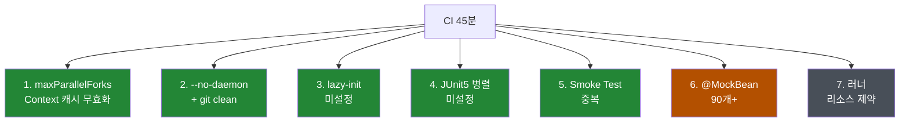
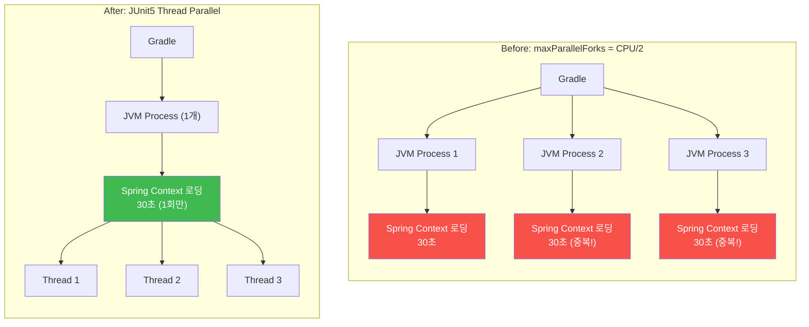
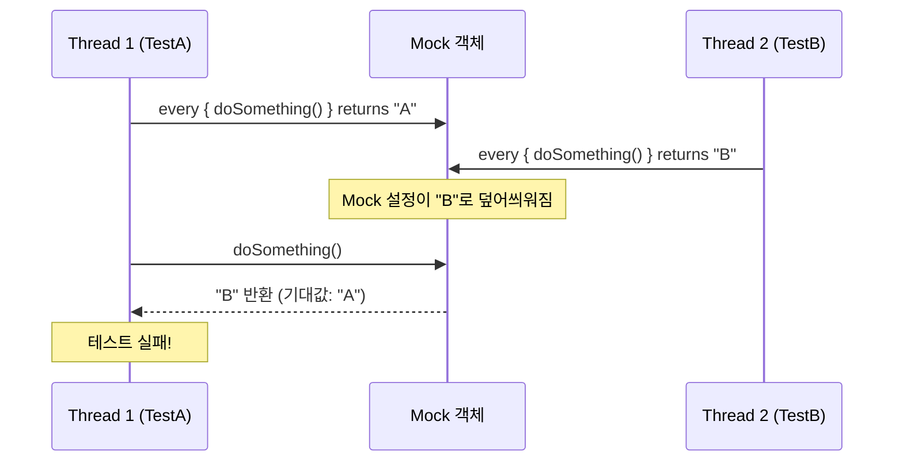

안녕하세요. 프롭테크 플랫폼에서 백엔드 개발자로 근무 중인 정정일입니다.

[이전 글]()에서 혼자 남은 백엔드 개발자가 13개 마이크로서비스를 모듈러 모놀리식으로 통합한 과정을 다뤘습니다. 그 글 마지막에 이렇게 적었었는데요.

> "전환 후에 CI 테스트 빌드 시간이 45분으로 급증하는 문제를 겪기도 했는데, 이 부분은 후속 글에서 다루겠습니다"

이 글이 바로 그 후속 글입니다.

## 문제: CI가 45분이나 걸렸다

전환을 마치고 CI를 돌려봤을 때였습니다. 저희는 GitHub Actions로 CI를 구성하고 있는데, PR이 올라오면 변경된 모듈의 테스트를 돌리고 JaCoCo(테스트 커버리지 측정 도구)로 커버리지 리포트를 생성하는 워크플로우가 자동으로 실행됩니다. 이 워크플로우의 "Build test reports" 단계가 끝나질 않더라구요. 뭔가 이상하다 싶어서 로그를 확인해봤는데, 눈을 의심했습니다.

| 브랜치 | CI 소요시간 | 결과 |
|--------|------------|------|
| 기존 MSA 브랜치 | **2분 1초** | SUCCESS |
| 모듈러 모놀리식 전환 브랜치 | **45분 31초** | FAILED |

22배. 게다가 실패까지.

아래는 실제 GitHub Actions CI 실행 결과입니다. "Build test reports" 단계 하나가 **45분 31초**를 잡아먹고 있습니다.


로그를 펼쳐보니 "BUILD FAILED in 45m 30s"가 찍혀있었습니다. 153개 태스크를 전부 실행하고도 실패.


여기서 한 가지 짚고 넘어갈 부분이 있습니다. 기존 MSA에서 2분 1초라는 건 전체 테스트가 2분 걸렸다는 뜻이 아닙니다. MSA 구조에서는 각 서비스가 독립된 애플리케이션이라 CI도 서비스별로 각각 돌아가거든요. PR에서 변경된 서비스만 테스트하니까, 한 서비스의 테스트가 2분이면 그냥 2분인 겁니다. 다른 서비스는 변경되지 않았으니 CI에서 건너뛰구요.

모듈러 모놀리식은 다릅니다. 11개 서비스가 하나의 Spring Boot 애플리케이션 안에 모듈로 통합되어 있고, 여기에 공통 모듈 등을 합치면 총 15개 모듈이 존재합니다. 이번처럼 전환 PR에서 모든 모듈의 파일이 변경되면 15개 모듈 전체의 테스트가 한꺼번에 돌아갑니다. 비교 자체가 공정하지 않다는 건 알고 있었습니다.

다만 비교가 적절하든 아니든, **현실적으로 CI를 돌리면 45분이 걸린다는 사실 자체가 문제**였습니다. 전환 PR이라 모든 파일이 변경된 특수한 케이스이긴 했지만, 앞으로도 `common` 모듈이나 루트 `build.gradle.kts`를 수정하면 전체 테스트가 돌아가는 상황은 충분히 발생할 수 있었거든요.

위에서 언급했듯이 저는 현재 혼자 남은 백엔드 개발자입니다. 빠르게 개발하고 빠르게 배포하는 게 중요한 상황인데, CI가 45분이나 걸리면 PR 올리고 머지될 때까지 한참을 기다려야 합니다. 이건 생산성에 직접적으로 타격이 오는 문제였습니다.

"이거 지금 안 잡으면 나중에 계속 발목 잡히겠다" 싶어서 원인을 분석하기 시작했습니다.

## 원인 파악: 왜 이렇게 느렸나

CI 로그를 열어서 어디서 시간이 잡아먹히는지 추적하고, Gradle 설정 파일을 뒤지고, 테스트 구조를 살펴봤습니다. 뒤져보니 원인이 한두 가지가 아니더라구요. 총 7가지 병목 지점을 발견했습니다.

1. **`maxParallelForks`가 Spring Context 캐싱을 무효화** — 각 JVM 프로세스가 독립 메모리를 가져 Context 공유 불가
2. **`--no-daemon` + `git clean -ffdx`로 매번 콜드 스타트** — 빌드 캐시, Gradle 데몬 전부 제거
3. **`spring.main.lazy-initialization` 미설정** — 테스트에서 사용하지 않는 빈까지 전부 초기화
4. **JUnit5 스레드 병렬 실행 미설정** — 테스트 클래스를 동시에 실행하는 병렬 설정이 없었음
5. **13개 Smoke Test가 불필요하게 전체 Context 로딩** — CI에서 이미 통합 테스트로 검증하는 부분을 중복 실행
6. **~90개 `@MockBean`/`@MockkBean`이 Context 캐시 미스 유발** — 각 테스트 클래스마다 다른 캐시 키 생성
7. **self-hosted MacBook Pro(M1, 8코어, 16GB) 러너의 리소스 제약** — 여러 JVM 프로세스가 CPU/메모리 경쟁



<p style="text-align: center; color: #8b949e; font-size: 0.85em;">
초록: 이번에 해결 / 주황: 스코프가 커서 보류 / 회색: 하드웨어 제약
</p>

원인을 전부 정리해놓고 보니 "이러니 45분이 걸렸지..." 라는 생각이 들었습니다. 하나하나는 각각의 이유가 있었지만, 이것들이 전부 겹치니까 45분이라는 결과가 나온 거였죠.

이 중 6번(`@MockBean` 통합)은 스코프가 너무 컸습니다. Spring TestContext는 빈 구성이 동일한 테스트끼리 컨텍스트를 캐시해서 재사용하는데, `@MockBean`을 쓰면 "어떤 빈을 Mock으로 교체했는지"가 캐시 키에 포함됩니다. A 테스트가 `ServiceA`를, B 테스트가 `ServiceB`를 Mock하면 캐시 키가 달라져서 같은 컨텍스트를 또 로딩하게 되는 거죠. 약 90개의 `@MockBean`이 제각각 다른 조합으로 선언되어 있으니 캐시 히트율이 바닥이었는데, 이걸 고치려면 테스트 베이스 클래스의 Mock 조합을 통합해야 해서 당장은 보류했습니다. 7번은 하드웨어 문제라 손댈 수 있는 영역이 아니었구요. 나머지 5가지를 하나씩 잡기로 했습니다.

## 해결: 하나씩 잡아나가기

총 66개 파일을 수정하는 꽤 큰 작업이었습니다. 가장 간단한 것부터 시작해서 점점 복잡한 것으로 넘어가는 방식으로 접근했습니다.

### 1. Lazy Initialization 적용

가장 간단하면서도 바로 효과를 볼 수 있는 것부터 시작했습니다.

Spring Boot는 기본적으로 애플리케이션이 시작될 때 등록된 모든 빈(Bean)을 한꺼번에 초기화하거든요. 프로덕션에서는 이게 맞지만, 테스트에서는 문제가 됩니다. 특정 서비스 하나만 테스트하는데 그 테스트와 전혀 관련 없는 다른 모듈의 빈까지 전부 초기화되면서 시간이 낭비되는 거죠.

`lazy-initialization`은 이름 그대로 빈을 "게으르게" 초기화하는 설정입니다. 시작 시점에 모든 빈을 만드는 대신, 실제로 사용되는 시점에 필요한 빈만 초기화하는 거죠. 이렇게 하면 `@SpringBootTest`가 돌 때 전체 빈을 한꺼번에 올리는 게 아니라 해당 테스트에서 필요한 빈만 그때그때 올리기 때문에 컨텍스트 로딩 시간이 줄어듭니다. 15개 모듈의 테스트 설정 파일(`application-test.yml`)에 한 줄씩만 추가하면 됐습니다.

```yaml
spring:
  main:
    lazy-initialization: true
```

테스트 환경에서만 적용되니 프로덕션에는 영향이 없고, 리스크도 낮았습니다.

**결과:** 모듈당 10~20초 정도 빨라졌는데, 15개 모듈에 다 적용하니 합산 **약 5분** 정도 단축. 한 줄 추가한 것 치고는 꽤 괜찮은 효과였습니다.

### 2. 과거의 내가 심어둔 지뢰 — 프로세스 병렬에서 스레드 병렬로

이번 최적화의 핵심이자, 가장 아이러니한 부분이었습니다.

이전 [멀티모듈 전환]() 때 빌드 성능 개선을 위해 **제가 직접** 넣었던 설정이 문제의 원인이었거든요.

```kotlin
// build.gradle.kts (멀티모듈 전환 때 추가했던 설정)
tasks.withType<Test> {
    useJUnitPlatform()
    maxParallelForks = (Runtime.getRuntime().availableProcessors() / 2).takeIf { it > 0 } ?: 1
}
```

당시에는 "CPU 코어 절반으로 병렬 실행하면 빨라지겠지"라고 생각했습니다. 실제로 전체 빌드 시간이 27분에서 8분으로 줄었거든요. [멀티모듈 전환 글]()에서도 이 부분을 언급했었구요.

그런데 이게 테스트에서는 오히려 독이 됐습니다. `maxParallelForks`는 **별도 JVM 프로세스**를 생성하는데, 각 프로세스는 독립된 메모리 공간을 가지기 때문에 **Spring TestContext 캐시를 공유할 수 없거든요.** 같은 `@SpringBootTest` 컨텍스트를 여러 프로세스에서 중복으로 로딩하게 되는 겁니다.



핵심 차이는 **Spring TestContext 캐시 공유 여부**입니다. `maxParallelForks`는 별도 JVM 프로세스를 생성하기 때문에 각 프로세스가 독립된 메모리 공간을 가지고, 같은 컨텍스트를 프로세스 수만큼 중복 로딩합니다. 반면 JUnit5 스레드 병렬은 단일 JVM 내에서 동작하므로 컨텍스트를 한 번만 로딩하고 여러 스레드가 공유합니다.

빌드와 테스트는 다릅니다. 빌드는 컴파일이라 프로세스별 상태 공유가 필요 없지만, Spring 테스트는 Context 캐싱이 성능의 핵심입니다. 프로세스를 나누면 캐시를 공유할 수 없어서 동일한 컨텍스트를 프로세스 수만큼 반복 로딩하게 되는 거죠. 과거의 제가 미래의 저한테 지뢰를 심어둔 셈이었습니다.

해결 방향은 명확했습니다. `maxParallelForks`를 1로 줄여 JVM 프로세스를 하나로 만들되, JUnit5의 스레드 레벨 병렬 실행을 켜서 **하나의 JVM 안에서 여러 테스트 클래스를 동시에** 돌리는 것이었습니다. 같은 JVM이니까 Spring TestContext 캐시를 공유할 수 있게 되거든요.

```kotlin
tasks.withType<Test> {
    useJUnitPlatform()
    maxParallelForks = 1  // JVM 프로세스는 1개로

    systemProperty("junit.jupiter.execution.parallel.enabled", "true")
    systemProperty("junit.jupiter.execution.parallel.mode.default", "same_thread")
    systemProperty("junit.jupiter.execution.parallel.mode.classes.default", "concurrent")
    systemProperty("junit.jupiter.execution.parallel.config.strategy", "dynamic")
    systemProperty("junit.jupiter.execution.parallel.config.dynamic.factor", "1")
}
```

그런데 여기서 꽤 삽질을 했습니다. 처음에는 `mode.default`도 `concurrent`로 설정했었거든요. 클래스도 병렬, 메서드도 병렬이면 더 빨라지지 않을까 싶어서요. 그랬더니 테스트가 와르르 깨지기 시작했습니다. 몇 개가 아니라 여기저기서 터져서 뭐가 문제인지 파악하는 것부터 쉽지 않았습니다.

원인을 추적해보니 단위 테스트에서 MockK(Kotlin용 Mocking 라이브러리)를 많이 사용하고 있었는데, MockK의 `every { }` 블록이 Thread-safe하지 않았습니다. 메서드 레벨까지 병렬로 돌리니까 같은 Mock 객체에 대해 여러 스레드가 동시에 `every { }`를 호출하면서 테스트끼리 간섭하는 거였죠.



그래서 전략을 바꿨습니다. **클래스 단위로는 병렬 실행하되, 같은 클래스 안의 테스트 메서드는 순차 실행**하도록요.

```
mode.default = same_thread          → 메서드는 순차 (MockK 안전)
mode.classes.default = concurrent   → 클래스는 병렬 (속도 확보)
```

이렇게 하면 서로 다른 테스트 클래스는 동시에 실행되면서도, 같은 클래스 안에서는 Mock이 간섭하지 않게 됩니다.

병렬 실행을 켜니까 기쁜 것도 잠시, 이번엔 Spring REST Docs(테스트 코드 기반으로 API 문서를 자동 생성하는 도구) 관련 테스트가 간헐적으로 실패하기 시작했습니다. 여러 테스트 클래스가 동시에 `build/generated-snippets/` 디렉토리에 문서 스니펫 파일을 쓰면서 파일이 꼬이는 문제였거든요. "간헐적"이라는 게 특히 골치 아팠습니다. 돌릴 때마다 깨지는 테스트가 달라졌으니까요.

JUnit5의 `@ResourceLock`을 활용해서 해결했습니다. 같은 리소스를 사용하는 테스트끼리 동시에 실행되지 않도록 잠금을 거는 어노테이션인데, 33개 테스트 베이스 클래스(IntegrationTest 13개, WebTest 13개, JpaTest 7개)에 `@ResourceLock("spring-restdocs")`를 추가해서 REST Docs 관련 테스트들이 순차적으로 실행되도록 보장했습니다.

**결과:** 프로세스 병렬에서 스레드 병렬로 바꿨을 뿐인데 **약 15분**이 줄었습니다. Context 캐시를 공유하게 되면서 동일 컨텍스트를 여러 번 로딩하던 오버헤드가 사라진 게 결정적이었습니다. (`@ResourceLock` 자체는 직접적인 시간 단축 효과는 없었지만, 병렬 실행을 안정적으로 가져가기 위한 전제 조건이었습니다.)

### 3. Smoke Test 태그 분리

13개 `*ApplicationTests.kt`이 각각 `@SpringBootTest`로 전체 Context를 로딩하고 있었습니다. 이 테스트들은 "애플리케이션이 정상적으로 뜨는지" 확인하는 Smoke Test일 뿐인데, CI에서는 이미 전체 통합 테스트를 돌리면서 컨텍스트가 정상적으로 로딩되는지 검증하고 있었거든요. 완전히 중복이었습니다.

`@Tag("smoke")`를 추가하고 CI에서 제외했습니다.

```kotlin
@Tag("smoke")
@SpringBootTest
class SomeModuleApplicationTests {
    @Test
    fun contextLoads() { }
}
```

```kotlin
tasks.test {
    if (System.getenv("CI") == "true") {
        useJUnitPlatform { excludeTags("smoke") }
    }
}
```

로컬에서는 여전히 돌아가니까 개발 중 빠른 검증용으로는 유지하되, CI에서만 건너뛰는 방식입니다.

**결과:** 13개 모듈의 불필요한 Spring Context 로딩을 제거하니 **약 5분** 정도 단축.

### 4. CI 워크플로우 캐싱 개선

CI 워크플로우를 열어보니 `git clean -ffdx`로 `.gradle/` 빌드 캐시를 전부 삭제하고, `--no-daemon`으로 매번 Gradle JVM을 새로 시작하고 있었습니다. Gradle 데몬은 백그라운드에서 JVM을 띄워놓고 재사용하는 건데, `--no-daemon`은 그걸 끄고 매번 새 JVM을 띄우겠다는 뜻이거든요. JVM 웜업도 없고, 클래스 캐시도 없고, 모든 게 콜드 스타트.

"CI에서는 당연히 클린 빌드해야지"라는 생각에서 나온 설정인 것 같은데, 이게 GitHub-hosted 러너에서는 맞는 말입니다. 매번 새 환경이 주어지니까요. 그런데 저희는 self-hosted 러너(MacBook Pro)를 사용하고 있었습니다. 환경이 유지되는 self-hosted에서는 오히려 캐시를 재활용하는 게 훨씬 효율적이었죠.

```yaml
# Before
- run: git clean -ffdx
- run: ./gradlew --no-daemon $TASKS

# After
- uses: actions/setup-java@v4
  with:
    cache: 'gradle'
- run: ./gradlew --build-cache $TASKS
  env:
    CI: true
```

`git clean -ffdx`를 제거하고, `--no-daemon` 대신 `--build-cache`를 추가했습니다. `actions/setup-java`의 `cache: 'gradle'` 설정으로 `.gradle/` 디렉토리를 보존하도록 했구요.

**결과:** 매번 콜드 스타트를 하던 것에서 Gradle 데몬과 빌드 캐시를 재활용하게 되니 **약 5분** 단축. 특히 두 번째 실행부터 캐시 효과가 눈에 띄게 좋더라구요.

## 방법별 결과 정리

각 최적화별 기여도와 전체 결과입니다.

| 최적화 | 단축 시간 | 비고 |
|--------|----------|------|
| JUnit5 스레드 병렬 실행 전환 | **약 15분** | Context 캐시 공유가 핵심 |
| Lazy Initialization | **약 5분** | 모듈당 10~20초 × 15개 모듈 |
| Smoke Test 태그 분리 | **약 5분** | 13개 불필요한 컨텍스트 로딩 제거 |
| CI 워크플로우 캐싱 | **약 5분** | 콜드 스타트 제거 |
| REST Docs `@ResourceLock` | 직접 단축 효과 없음 | 병렬 실행의 전제 조건 |
| **합계** | **약 30분** | **45분 → 10분 (약 77% 단축)** |


각 최적화를 하나씩 적용하면서 매번 CI를 돌려본 건 아니고, 로컬 테스트 실행과 CI 로그의 task별 소요시간을 기반으로 추정한 수치입니다. 다만 체감상 가장 임팩트가 컸던 건 역시 `maxParallelForks`를 1로 줄이고 JUnit5 스레드 병렬 실행으로 전환한 것이었습니다. 이것 하나로 전체 개선의 절반을 가져간 셈이죠.

실제 CI 실행 결과로도 확인할 수 있습니다. 아래는 최적화 후의 GitHub Actions 워크플로우입니다.


로그를 펼쳐보면 "Build test reports" 단계가 정상 완료되고, 이어서 Jacoco Report까지 생성되는 걸 확인할 수 있습니다.


최적화 전에는 "Build test reports" 단계 하나가 45분 31초를 잡아먹으면서 전체 워크플로우가 실패했지만, 최적화 후에는 같은 단계가 7분 8초로 줄면서 Jacoco Report 생성과 커버리지 체크까지 정상 완료됐습니다.

주요 모듈별 테스트도 전부 PASSED. 깨지는 테스트 없이 전체 통과를 확인하고 PR을 올렸습니다.

비슷한 상황에서 어디부터 손대야 할지 고민이라면, Spring Context 로딩 관련 최적화를 먼저 잡는 걸 추천합니다. 테스트에서 시간을 가장 많이 잡아먹는 건 결국 Context 로딩이고, 불필요한 테스트 제거나 CI 캐싱은 그 다음에 해도 충분합니다.

### 덤: 최적화 중에 발견한 버그들

최적화 작업을 하다 보니 기존에 숨어있던 버그도 발견했습니다. MSA 때는 서비스별로 따로 테스트를 돌리다 보니 드러나지 않았던 문제가, 모듈러 모놀리식에서 전체를 한꺼번에 돌리니까 나타나는 거더라구요.

한 모듈의 테스트 베이스 클래스에서 파일 유틸리티 빈을 주입받고 있었는데, 모듈러 모놀리식에서는 같은 이름의 빈이 여러 모듈에 존재하면서 잘못된 빈이 주입되고 있었습니다. `@Qualifier`를 붙여서 정확한 빈을 지정하도록 수정했구요. 다른 모듈에서도 테스트 2개가 실패하고 있었는데, 추적해보니 이전에 URL 충돌 때문에 다른 모듈로 이전된 엔드포인트의 테스트가 그대로 남아있었습니다. 엔드포인트가 없으니 Spring Security가 401을 반환하면서 실패한 거였죠. 해당 테스트 클래스를 삭제하면서 정리했습니다.

## 느낀 점

### 빌드 최적화 ≠ 테스트 최적화

이번에 가장 크게 와닿은 건 이 부분이었습니다.

멀티모듈 전환 때 `maxParallelForks`를 넣고 빌드 시간이 27분에서 8분으로 줄었을 때, 저는 이 설정이 만능인 줄 알았습니다. "병렬화하면 빨라진다"가 아니라 **"무엇을 병렬화하느냐에 따라 최적의 단위가 다르다"**는 걸 이번에 제대로 배웠습니다. 컴파일은 프로세스끼리 상태를 공유할 필요가 없으니 프로세스 병렬이 맞지만, Spring 테스트는 Context 캐시를 같이 써야 빠르니까 스레드 병렬이 맞는 거였죠. 같은 "병렬"이라도 대상에 따라 전략이 달라야 한다는 걸, 직접 삽질하고 나서야 체감했습니다.

### "당연한" 설정을 의심하자

`--no-daemon`이나 `git clean -ffdx` 같은 설정은 "CI에서는 당연히 클린 빌드해야지"라는 생각에서 나온 것 같습니다. 틀린 말은 아닙니다. GitHub-hosted 러너라면요. 하지만 저희는 self-hosted 러너를 쓰고 있었고, 환경이 유지되는 self-hosted에서는 캐시를 활용하는 게 훨씬 효율적이었습니다.

"다들 이렇게 하니까"가 아니라 **"우리 환경에서는 어떤 게 최적인지"** 생각해봤어야 했습니다.

### 다음엔 CI 파이프라인도 같이 볼 것

[전환기 글]()에서도 다뤘지만, 모듈러 모놀리식 전환 후에는 `@Transactional` TransactionManager 불일치, 빈 이름 충돌, 순환 참조 같은 예상치 못한 문제들이 연쇄적으로 터졌습니다. 그리고 이번에는 CI 테스트 빌드 시간까지.

돌이켜보면 전환 작업의 "완료 조건"을 코드가 컴파일되고 테스트가 통과하는 것까지로만 잡았던 게 실수였습니다. 만약 다시 큰 아키텍처 전환을 한다면, 아래 항목들도 같이 확인할 것 같습니다.

- CI 전체 테스트 실행 시간이 기존 대비 얼마나 증가했는지
- 테스트 병렬화 전략이 새 구조에서도 유효한지
- 빌드 캐시와 Gradle 데몬 설정이 러너 환경에 맞는지
- 중복 테스트(Smoke Test 등)가 새 구조에서 여전히 필요한지

코드가 돌아간다고 끝이 아니라, 코드를 돌리는 환경까지 함께 봤어야 했다는 걸 이번에 확실히 느꼈습니다.

## 마치며

돌이켜보면 이 문제는 모듈러 모놀리식 전환이라는 큰 변화의 당연한 부작용이었습니다. MSA에서는 서비스별로 CI가 돌아가니까 하나의 서비스 테스트가 2분이면 2분이 걸렸을 뿐이고, 모듈러 모놀리식에서는 전체가 한꺼번에 돌아가니까 시간이 길어질 수밖에 없었죠.

다만 45분은 너무 길었고, 원인을 분석해보니 구조 변경만 하고 테스트 인프라는 그대로 두면서 생긴 비효율이 대부분이었습니다. 멀티모듈 시절에 넣었던 `maxParallelForks`가 Context 캐시를 무효화시키고, 매번 클린 빌드를 하고, 의미 없는 Smoke Test를 13개나 돌리고... 이런 것들을 하나하나 잡았더니 10분까지 줄어든 겁니다.

솔직히 아직 남아있는 숙제도 있습니다. 원인 파악에서도 다뤘던 6번, 약 90개 이상의 `@MockBean`/`@MockkBean`이 Context 캐시 미스를 유발하고 있는 문제인데요. 이건 테스트 베이스 클래스의 Mock 조합을 통합해야 해서 시간이 좀 걸릴 것 같습니다. 이것까지 정리하면 10분도 더 줄일 수 있지 않을까 기대하고 있습니다.

레거시에서 MSA로, 16개 레포에서 멀티모듈로, MSA에서 모듈러 모놀리식으로. 아키텍처가 바뀔 때마다 예상치 못한 문제가 터지지만, 45분짜리 CI를 디버깅하면서 Spring TestContext 캐싱, Gradle 데몬, JUnit5 병렬 실행의 동작 방식을 전보다 훨씬 깊게 이해하게 된 것도 사실입니다. 결국 삽질이 가장 좋은 공부였던 셈이죠.

비슷한 상황을 겪고 계신 분이 있다면, 이 글이 조금이나마 도움이 되었으면 합니다.

## 참고 자료

### 관련 글
- [MSA, 우리에겐 과했다 - 모듈러 모놀리식 전환기]()
- [16개 레포지토리를 하나로 - MSA 멀티모듈 전환기]()

### 외부 자료
- [Paramount Tech: Spring Boot Test 32분 → 10분 최적화](https://paramount.tech/blog/2023/12/11/a-little-more-on-spring-tests-our-optimizations.html)
- [Zalando Engineering: JUnit5 병렬 실행으로 60% 단축](https://engineering.zalando.com/posts/2023/11/mastering-testing-efficiency-in-spring-boot-optimization-strategies-and-best-practices.html)
- [DEV Community: Spring Context 캐싱으로 50% 개선](https://dev.to/mchoraine/speeding-up-spring-integration-tests-lessons-from-context-caching-d6p)
