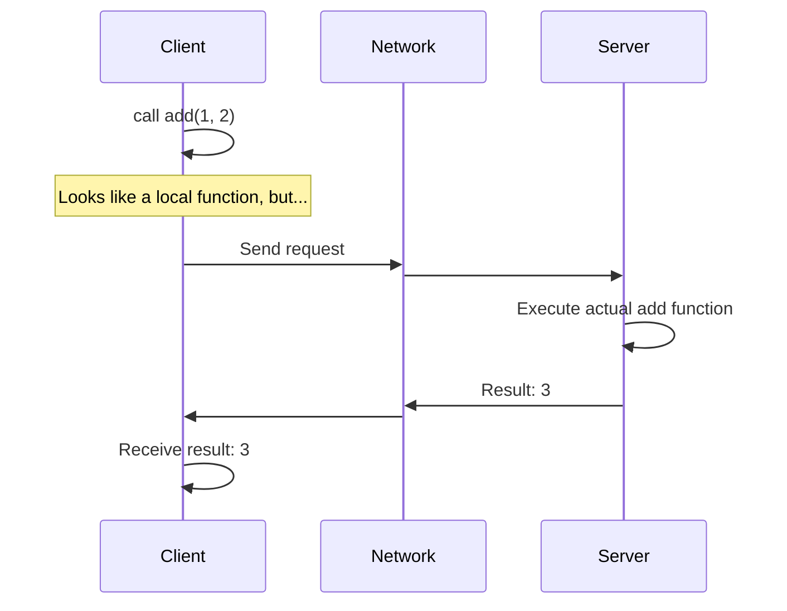
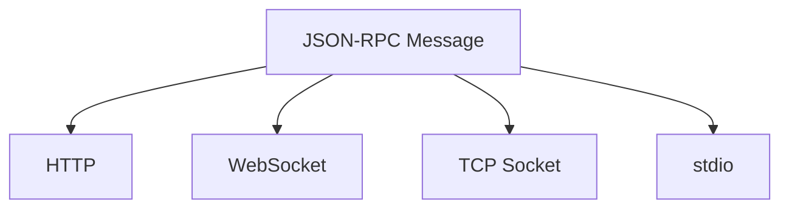
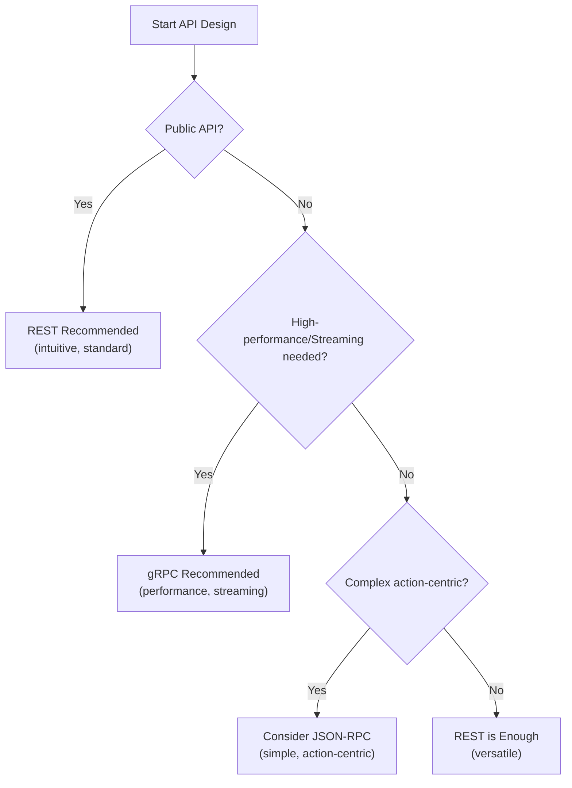

A while ago, while writing about [MCP (Model Context Protocol)](), I found myself dealing with JSON-RPC. As I was writing, a question popped into my head.

**"JSON-RPC and gRPC are said to be lightweight, but how are they different from REST over HTTP?"**

To answer this question clearly, I realized I needed to properly understand what RPC is in the first place. So in this post, I'd like to cover the concept of RPC, JSON-RPC, gRPC, and some common misconceptions.

## What is RPC?

RPC stands for **Remote Procedure Call**. Simply put, it's **a way to call functions on a remote server as if they were local functions**.



In the client code, it looks like you're just calling `add(1, 2)`, but in reality, the execution happens on the server over the network, and the result is returned.

### The Core Idea of RPC

I think the core of RPC is **hiding the complexity of network communication**.

Instead of developers manually opening sockets, serializing data, transmitting it, and parsing responses, you just call a function and the library handles everything behind the scenes.

```python
# Without RPC, you'd have to do this...
socket = connect("server:8080")
data = serialize({"method": "add", "params": [1, 2]})
socket.send(data)
response = socket.receive()
result = deserialize(response)

# With RPC...
result = server.add(1, 2)  # That's it
```

This idea has been around since the 1980s. There have been various implementations like [Sun Microsystems' ONC RPC](https://datatracker.ietf.org/doc/html/rfc5531) (1988), [CORBA](https://www.omg.org/spec/CORBA/) (1991), and [Java RMI](https://docs.oracle.com/javase/8/docs/technotes/guides/rmi/) (1997). Today's gRPC and JSON-RPC are extensions of this long-standing idea.

## Is RPC a Protocol or a Paradigm?

Here's an important distinction. **RPC itself is not a protocol but a paradigm (concept).**

More precisely, RPC refers to **"how you call"** rather than **"how you communicate"**.

### Concept Separation: Calling Method vs Communication Method vs Data Format

This can get confusing, so let me clearly separate each concept.

| Concept | Meaning | Examples |
|---------|---------|----------|
| **Calling Method (Paradigm)** | How do you conceptualize requests | RPC (function call), REST (resource manipulation) |
| **Transport** | How data physically travels | HTTP, TCP, WebSocket, stdio |
| **Data Format** | What format is data encoded in | JSON, XML, Protobuf |
| **Protocol** | Complete spec including all of the above | JSON-RPC, gRPC |

So when we break down JSON-RPC and gRPC, it looks like this:

```
JSON-RPC = RPC (calling method) + JSON (data format) + defined message structure
           └─ Transport is flexible (HTTP, TCP, WebSocket, stdio, etc.)

gRPC     = RPC (calling method) + Protobuf (data format) + HTTP/2 (fixed transport)
           └─ Transport is fixed to HTTP/2
```

### JSON-RPC is Transport-Agnostic

The [JSON-RPC 2.0 official specification](https://www.jsonrpc.org/specification) explicitly states:

> "It is transport agnostic in that the concepts can be used within the same process, over sockets, over HTTP, or in many various message passing environments."

In other words, it doesn't matter what transport method you use. You just need to follow the **message structure**.

```json
{
  "jsonrpc": "2.0",
  "id": 1,
  "method": "getUser",
  "params": {"id": 123}
}
```

As long as you follow this format, whether you send it over HTTP, TCP, or stdio, it's all JSON-RPC.

### gRPC is HTTP/2-Based

gRPC is different. It's defined as HTTP/2-based in the [official specification](https://github.com/grpc/grpc/blob/master/doc/PROTOCOL-HTTP2.md).

- Communicating with Protobuf + TCP? → That's **not** gRPC. It's just "Protobuf-based RPC"
- Communicating with Protobuf + HTTP/2? → That **is** gRPC

Standard gRPC uses HTTP/2 because HTTP/2 features (multiplexing, bidirectional streaming, header compression) are core to gRPC's functionality. However, it remains open to extension with evolving transport layers like HTTP/3 and QUIC.

### Summary

| | JSON-RPC | gRPC |
|--|----------|------|
| **Calling Method** | RPC | RPC |
| **Data Format** | JSON | Protobuf (default) |
| **Transport** | Flexible (spec states "transport agnostic") | HTTP/2 (standard) |

To use an analogy, **RPC is like "object-oriented programming" — a 'concept'**, while **JSON-RPC and gRPC are like "Java" or "Python" — concrete implementations**.

## RPC vs REST: A Paradigm Difference

I think comparing RPC with REST helps in understanding RPC better.

### REST: Resource-Centric

REST is **resource (noun) centric**. URLs represent resources, and HTTP methods represent actions.

```
GET    /users/123        → Get user
POST   /users            → Create user
PUT    /users/123        → Update user
DELETE /users/123        → Delete user
```

### RPC: Action-Centric

RPC is **action (verb) centric**. It's a way of requesting "execute this function."

```
POST /rpc
{
  "method": "getUser",
  "params": {"id": 123}
}

POST /rpc
{
  "method": "createUser",
  "params": {"name": "Kim", "email": "kim@example.com"}
}
```

### Which is Better?

Honestly, I think **it depends on the situation**.

| Scenario | Suitable Approach |
|----------|-------------------|
| CRUD-centric resource management | REST |
| Complex business logic calls | RPC |
| Public APIs (for external developers) | REST (intuitive) |
| Internal microservice communication | RPC (efficient) |

REST is more intuitive and widely used, but it can feel a bit awkward when expressing complex operations.

For example, how would you express an API that "calculates the total price of items in the cart, applies a coupon, adds shipping cost, and returns the final amount" in REST?

```
GET /carts/123/total-with-coupon-and-shipping?coupon=ABC123
```

Feels a bit awkward, doesn't it? With RPC, you can express this more naturally:

```json
{
  "method": "calculateFinalPrice",
  "params": {
    "cartId": 123,
    "couponCode": "ABC123",
    "includeShipping": true
  }
}
```

For complex action-centric operations like this, RPC can feel more natural.

## JSON-RPC: The Beauty of Simplicity

JSON-RPC is a protocol that implements the RPC paradigm using JSON message format. I found that the spec document is only a few pages long—it's that simple.

### Message Structure

**Request**
```json
{
  "jsonrpc": "2.0",
  "id": 1,
  "method": "subtract",
  "params": [42, 23]
}
```

**Response**
```json
{
  "jsonrpc": "2.0",
  "id": 1,
  "result": 19
}
```

**Error**
```json
{
  "jsonrpc": "2.0",
  "id": 1,
  "error": {
    "code": -32601,
    "message": "Method not found"
  }
}
```

That's pretty much it. `jsonrpc` version, `id` for request-response matching, `method` and `params` for calls, `result` or `error` for responses.

### JSON-RPC Characteristics

**1. Transport Layer Independent**

JSON-RPC only defines the message format. It can work over HTTP, WebSocket, TCP, and even stdio (standard input/output).



This is why MCP (Model Context Protocol) can exchange JSON-RPC messages via stdio locally and via HTTP remotely.

**2. Batch Request Support**

You can bundle multiple requests into one.

```json
[
  {"jsonrpc": "2.0", "id": 1, "method": "getUser", "params": {"id": 1}},
  {"jsonrpc": "2.0", "id": 2, "method": "getUser", "params": {"id": 2}},
  {"jsonrpc": "2.0", "id": 3, "method": "getUser", "params": {"id": 3}}
]
```

This is useful when you want to reduce HTTP overhead.

**3. Notification (Response-less Request)**

If there's no `id`, the server doesn't send a response. This can be used for "notifications."

```json
{
  "jsonrpc": "2.0",
  "method": "log",
  "params": {"message": "User logged in"}
}
```

## gRPC: A Choice for Performance

gRPC is an RPC framework created by Google. It evolved in a different direction from JSON-RPC.

### gRPC Characteristics

**1. Protocol Buffers (Protobuf)**

It uses Protobuf, a binary format, instead of JSON. While other codecs are technically possible, Protobuf is used in almost all real-world scenarios. (There are also cases of interoperating with REST APIs through JSON transcoding.)

```protobuf
// user.proto
syntax = "proto3";

service UserService {
  rpc GetUser (GetUserRequest) returns (User);
  rpc CreateUser (CreateUserRequest) returns (User);
}

message GetUserRequest {
  int32 id = 1;
}

message User {
  int32 id = 1;
  string name = 2;
  string email = 3;
}
```

Client/server code is auto-generated from this `.proto` file.

**2. HTTP/2-Based**

Standard gRPC uses HTTP/2. This enables features like multiplexing (handling multiple requests simultaneously over a single connection), header compression, and bidirectional streaming.

**3. Streaming Support**

```protobuf
service ChatService {
  // Unidirectional streaming: Server sends multiple messages as a stream
  rpc SubscribeMessages (SubscribeRequest) returns (stream Message);

  // Bidirectional streaming: Client and server stream simultaneously
  rpc Chat (stream Message) returns (stream Message);
}
```

### JSON-RPC vs gRPC

| | JSON-RPC | gRPC |
|--|----------|------|
| **Message Format** | JSON (text) | Protobuf (binary) |
| **Transport Layer** | Flexible (HTTP, WS, TCP, stdio) | HTTP/2 (standard) |
| **Schema** | Optional | Required (.proto file) |
| **Code Generation** | None | Auto-generated |
| **Streaming** | Not natively supported | Natively supported |
| **Browser Support** | Possible | Limited (requires gRPC-Web) |
| **Learning Curve** | Low | High |

## Common Misconceptions

While studying RPC, I organized the misconceptions I had and those I've commonly seen.

### Misconception 1: "JSON-RPC is Lighter than REST"

**To be precise, when used over HTTP, there's no difference.**

JSON-RPC is called "lightweight" **compared to SOAP/XML-RPC**.

```xml
<!-- SOAP request example (verbose) -->
<?xml version="1.0"?>
<soap:Envelope xmlns:soap="http://www.w3.org/2003/05/soap-envelope">
  <soap:Header>
    <!-- headers... -->
  </soap:Header>
  <soap:Body>
    <m:GetUser xmlns:m="http://example.com/user">
      <m:UserId>123</m:UserId>
    </m:GetUser>
  </soap:Body>
</soap:Envelope>
```

```json
// JSON-RPC request (simple)
{"jsonrpc": "2.0", "id": 1, "method": "getUser", "params": {"id": 123}}
```

It's definitely lighter compared to SOAP. But compared to REST JSON APIs, the HTTP overhead is the same.

### Misconception 2: "RPC is Tied to a Specific Transport Layer"

RPC is a paradigm, not a transport method.

- JSON-RPC: Can use HTTP, WebSocket, TCP, stdio, etc.
- gRPC: Uses HTTP/2 (this is gRPC's choice, not RPC's essence)

### Misconception 3: "REST is Always Better than RPC" (or vice versa)

I think they're **different tools for different problems**.

**When REST is Advantageous**
- APIs centered around resource CRUD
- When caching is important (leveraging HTTP cache)
- Direct calls from browsers
- When the API needs to be intuitive for first-time developers

**When RPC is Advantageous**
- Complex business logic calls
- Internal communication between microservices
- High-performance requirements (gRPC)
- Action-centric APIs

### Misconception 4: "gRPC is Unconditionally Faster"

It's true that gRPC is faster than JSON-based APIs, but **I don't think the difference is meaningful in all situations**.

- High network latency environments: Network becomes the bottleneck rather than serialization speed
- Simple CRUD: Might be over-engineering
- Browser clients: Additional complexity with gRPC-Web

I think gRPC's real value shines in **high-volume microservice communication**, **when streaming is needed**, and **when schema management is important**.

## The Relationship Between RPC and Client Libraries

While studying RPC, a thought suddenly occurred to me.

**"If I create a client library that wraps REST API calls, isn't that also RPC?"**

For example, let's say I created a module that wraps an external API like this in Kotlin:

```kotlin
// PaymentClient.kt
class PaymentClient(private val baseUrl: String) {
    fun processPayment(orderId: String, amount: Long): PaymentResult {
        // HTTP request internally
        val response = httpClient.post("$baseUrl/payments") {
            body = mapOf("orderId" to orderId, "amount" to amount)
        }
        return parseResponse(response)
    }

    fun refund(paymentId: String): RefundResult {
        // HTTP request internally
        val response = httpClient.post("$baseUrl/payments/$paymentId/refund")
        return parseResponse(response)
    }
}
```

Using this module from another service would look like this:

```kotlin
val paymentClient = PaymentClient("https://payment-api.internal")
val result = paymentClient.processPayment("order-123", 50000L)  // Like a local function
```

Isn't this... exactly the same as RPC's definition of "calling a remote function as if it were a local function"?

### Physically, They're the Same. But...

Honestly, physically they are the same. Both involve network communication, require serialization/deserialization, and can fail.

But this is similar to saying "REST uses TCP and gRPC uses TCP, so they're the same thing."

**I think the real difference is "who has control and what is being standardized."**

### REST Client Libraries: A Convenience Layer

What I'm talking about here isn't the entire SDK, but **client libraries that wrap REST APIs for ease of use**. (Like AWS SDK or Stripe SDK.)

```kotlin
userClient.getUser(userId)
```

This one line contains URL composition, HTTP method selection, auth headers, retries, and error parsing.

But when you think about the essence of these client libraries, the server is still providing a REST API and the library is just a wrapper for client convenience. The contract is at the documentation level (OpenAPI, etc.), and if one field changes, compilation is OK but **it breaks at runtime**.

### RPC: Communication Model + Contract

RPC has a different mindset from the start.

```kotlin
userService.GetUser(GetUserRequest)
```

At this moment, there's no URL, no HTTP verb, no resource in the developer's mind. **It's just a function call.**

The essence of RPC is modeling communication as function calls. Requests/responses are **strongly defined through IDL (Interface Definition Language)**, and client/server **share the same contract**. If one field changes? **It's detected at compile time**.

### Seeing the Real Difference in a Table

| Category | REST Client Library | RPC |
|----------|---------------------|-----|
| **Mental Model** | HTTP Resource | Function Call |
| **Contract Definition** | Document-centric (OpenAPI, etc.) | IDL-centric (.proto, etc.) |
| **Failure Detection** | Runtime | Compile Time |
| **Version Management** | Depends on convention | Structurally built-in |
| **Multi-language Support** | Implemented separately per language | Auto-generated from single IDL |
| **Network Awareness** | Present | Intentionally hidden |

### You Can Mimic RPC with Client Libraries, But

You can use client libraries like RPC. But REST client libraries have limitations. The contract is documentation not code, server/client release sync is loose, and library quality varies by language.

Of course, using OpenAPI + codegen, you can create strong contracts close to compile-time checking in REST too. However, this is supplemented by tools rather than being enforced at the protocol level.

**RPC's Characteristics:**
- Contract is **Single Source of Truth** (IDL is part of the protocol)
- Server/client evolve together
- Multi-language support is built-in

### The Danger of RPC Paradigm

I feel like I should be honest about this. RPC has a major side effect.

**It makes you forget that there's a network involved.**

```kotlin
// This looks like a local function call...
val user = userService.getUser(id)

// But in reality, it's going over the network
// - There's latency
// - It can fail
// - Timeout is needed
// - Retry strategy is needed
```

If RPC hides the network too well, it can lead to code that ignores the failure model of distributed systems. The reason RPC culture works well within Google is because of strict SRE discipline alongside it—I don't think RPC itself is magic.

**Don't design it like local programming just because it looks like a function call.**

RPC is the concept of "calling remote functions like local functions," but that doesn't mean you should design it with state like local programming.

```kotlin
// This might be fine if local...
class Counter {
    private var count = 0
    fun increment() = ++count
}

// But this design is an anti-pattern in distributed systems
// - Hard to scale horizontally if server has state
// - State is lost on failure
// - Load balancing becomes complicated
```

REST has "Stateless" constraint explicitly stated in its architecture definition. RPC doesn't define such constraints. But **"not defined" ≠ "it's okay to do"**.

Similarly, idempotency isn't built into RPC either. REST has idempotency semantics in HTTP methods (GET, PUT, DELETE are idempotent), but whether an RPC `createUser()` method is idempotent **depends on the implementation**. You have to design it yourself if needed.

| | REST | RPC |
|--|------|-----|
| **Stateless** | Defined as architecture constraint | Not defined (you handle it) |
| **Idempotency** | Built into HTTP method semantics | Not defined (you handle it) |

In the end, whether you use RPC or REST, principles of distributed systems (stateless, idempotency, failure handling, etc.) **apply equally**. I think it's important to remember not to design like local programming just because RPC looks like function calls.

### To Summarize

> **Client libraries are "convenience layers," and RPC is "contracts and mindset between systems."**

You can use client libraries like RPC, but the strength of the contract, the way it evolves, and when failures are detected are all different.

So **"a handcrafted client library is a manual implementation of the RPC paradigm"** could be one way to look at it, but strictly speaking, it's closer to **imitation missing RPC's core "strong contract."** That's not necessarily bad though. Depending on the situation, REST + client libraries might be more appropriate, and making you aware of the network could even be an advantage.

## When to Use What?

Here's my own summary of selection criteria.



Of course, this is just a rough guide, and in reality, it can vary depending on team experience, existing systems, and specific requirements.

## Summary

In this post, I've covered RPC.

1. **RPC is a paradigm.** It's the concept of "remote function call," not a specific protocol.

2. **JSON-RPC is simple.** It's transport layer independent and the spec is brief. However, it's hard to call it "lightweight" compared to REST over HTTP.

3. **gRPC is performance-focused.** It pursues high performance with Protobuf + HTTP/2, but has a learning curve and limited browser support.

4. **REST vs RPC is not about which is better.** It's the difference between being resource-centric or action-centric, and you should choose according to the situation.

Something I realized while writing this post: understanding the essence of technology helps you escape binary thinking like "this is better." I think if you understand what problem each technology was trying to solve and what trade-offs it has, you can make choices appropriate for the situation.

Thank you for reading this long post.

---

## References

### Official Documentation

- [JSON-RPC 2.0 Specification](https://www.jsonrpc.org/specification) - JSON-RPC official spec (transport layer independence noted)
- [gRPC Official Documentation](https://grpc.io/docs/guides/)
- [gRPC over HTTP/2 Protocol Specification](https://github.com/grpc/grpc/blob/master/doc/PROTOCOL-HTTP2.md) - Why gRPC requires HTTP/2
- [Protocol Buffers Documentation](https://protobuf.dev/)

### Comparative Analysis

- [gRPC vs REST: Understanding gRPC, OpenAPI and REST - Google Cloud Blog](https://cloud.google.com/blog/products/api-management/understanding-grpc-openapi-and-rest-and-when-to-use-them)
- [gRPC vs REST - AWS](https://aws.amazon.com/compare/the-difference-between-grpc-and-rest/)
- [gRPC vs. REST - IBM](https://www.ibm.com/think/topics/grpc-vs-rest)
- [Know your API protocols: SOAP vs. REST vs. JSON-RPC vs. gRPC vs. GraphQL vs. Thrift](https://www.mertech.com/blog/know-your-api-protocols)

### Related Posts

- [Understanding MCP (Model Context Protocol)]() - A real-world protocol example using JSON-RPC
