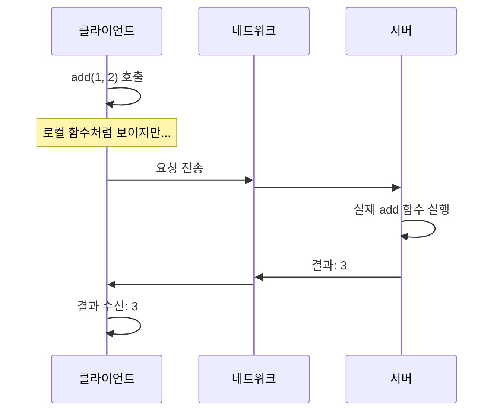
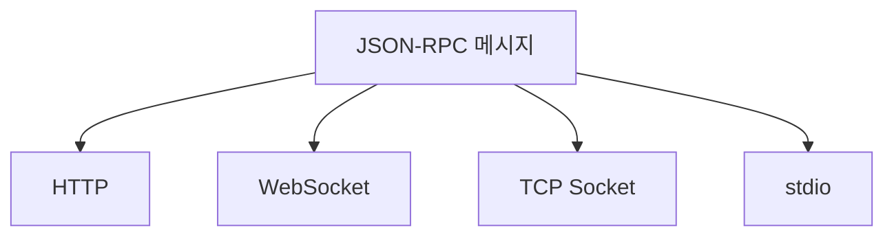
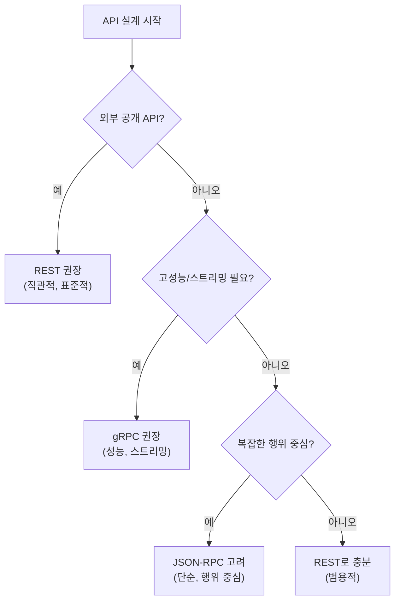

얼마 전 [MCP(Model Context Protocol) 글]()을 쓰면서 JSON-RPC를 다루게 되었습니다. 그런데 글을 쓰다 보니 스스로에게 질문이 생기더라구요.

**"JSON-RPC, gRPC가 경량화됐다고 하는데, HTTP 위에서 REST랑 뭐가 다르지?"**

이 질문에 명확하게 답하려면 RPC가 뭔지부터 제대로 이해해야 할 것 같았습니다. 그래서 이번 글에서는 RPC의 개념부터 JSON-RPC, gRPC까지, 그리고 흔히 하는 오해들을 정리해보려고 합니다.

## RPC란 무엇인가?

RPC는 **Remote Procedure Call**의 약자입니다. 직역하면 "원격 프로시저 호출"인데, 쉽게 말해 **네트워크 너머에 있는 함수를 마치 로컬 함수처럼 호출하는 방식**입니다.



클라이언트 코드에서는 그냥 `add(1, 2)`를 호출하는 것처럼 보이지만, 실제로는 네트워크를 통해 서버에서 실행되고 결과가 돌아오는 구조입니다.

### RPC의 핵심 아이디어

RPC의 핵심은 **네트워크 통신의 복잡함을 숨기는 것**입니다.

개발자가 직접 소켓을 열고, 데이터를 직렬화하고, 전송하고, 응답을 파싱하는 과정을 일일이 작성하는 대신, 그냥 함수를 호출하면 라이브러리가 알아서 처리해주는 거죠.

```python
# RPC 없이 직접 구현하면...
socket = connect("server:8080")
data = serialize({"method": "add", "params": [1, 2]})
socket.send(data)
response = socket.receive()
result = deserialize(response)

# RPC를 사용하면...
result = server.add(1, 2)  # 이게 끝
```

이 아이디어는 1980년대부터 있었습니다. [Sun Microsystems의 ONC RPC](https://datatracker.ietf.org/doc/html/rfc5531)(1988), 이후 [CORBA](https://www.omg.org/spec/CORBA/)(1991), [Java RMI](https://docs.oracle.com/javase/8/docs/technotes/guides/rmi/)(1997) 등 다양한 구현이 있었죠. 지금의 gRPC나 JSON-RPC도 이 오래된 아이디어의 연장선에 있습니다.

## RPC는 프로토콜인가, 패러다임인가?

여기서 중요한 구분이 필요합니다. **RPC 자체는 프로토콜이 아니라 패러다임(개념)입니다.**

더 정확히 말하면, RPC는 **"호출 방식"** 을 의미하지 **"통신 방식"** 을 의미하지 않습니다.

### 개념 분리: 호출 방식 vs 통신 방식 vs 데이터 포맷

이 부분이 헷갈리기 쉬우니, 각각의 개념을 명확히 분리해보겠습니다.

| 개념 | 의미 | 예시 |
|-----|-----|-----|
| **호출 방식 (패러다임)** | 어떻게 요청을 개념화하는가 | RPC (함수 호출), REST (리소스 조작) |
| **전송 방법 (Transport)** | 데이터가 물리적으로 어떻게 이동하는가 | HTTP, TCP, WebSocket, stdio |
| **데이터 포맷** | 데이터를 어떤 형식으로 인코딩하는가 | JSON, XML, Protobuf |
| **프로토콜** | 위 모두를 포함한 완전한 스펙 | JSON-RPC, gRPC |

그래서 JSON-RPC와 gRPC를 분해하면 이렇게 됩니다.

```
JSON-RPC = RPC(호출 방식) + JSON(데이터 포맷) + 정해진 메시지 구조
           └─ 전송 방법은 자유 (HTTP, TCP, WebSocket, stdio 등)

gRPC     = RPC(호출 방식) + Protobuf(데이터 포맷) + HTTP/2(전송 방법 고정)
           └─ 전송 방법이 HTTP/2로 고정됨
```

### JSON-RPC는 전송 방법이 자유롭다

[JSON-RPC 2.0 공식 스펙](https://www.jsonrpc.org/specification)에는 이렇게 명시되어 있습니다.

> "It is transport agnostic in that the concepts can be used within the same process, over sockets, over HTTP, or in many various message passing environments."

즉, 어떤 전송 방법을 쓰든 상관없습니다. 다만 **메시지 구조**는 따라야 합니다.

```json
{
  "jsonrpc": "2.0",
  "id": 1,
  "method": "getUser",
  "params": {"id": 123}
}
```

이 형식만 지키면, HTTP로 보내든 TCP로 보내든 stdio로 보내든 다 JSON-RPC입니다.

### gRPC는 HTTP/2가 필수다

반면 gRPC는 다릅니다. [공식 스펙](https://github.com/grpc/grpc/blob/master/doc/PROTOCOL-HTTP2.md)에서 HTTP/2 기반으로 정의되어 있습니다.

- Protobuf + TCP로 통신하면? → gRPC가 **아닙니다**. 그냥 "Protobuf 기반 RPC"
- Protobuf + HTTP/2로 통신하면? → gRPC **맞습니다**

gRPC가 HTTP/2를 고정한 이유는, HTTP/2의 기능들(멀티플렉싱, 양방향 스트리밍, 헤더 압축)이 gRPC의 핵심 기능이기 때문입니다.

### 정리

| | JSON-RPC | gRPC |
|--|----------|------|
| **호출 방식** | RPC | RPC |
| **데이터 포맷** | JSON | Protobuf |
| **전송 방법** | 자유 (스펙에 "transport agnostic" 명시) | HTTP/2 고정 |

비유하자면, **RPC는 "객체지향 프로그래밍"같은 '개념'** 이고, **JSON-RPC나 gRPC는 "Java", "Python"같은 구체적인 구현**인 셈입니다.

## RPC vs REST: 패러다임의 차이

RPC를 이해하려면 REST와 비교해보는 게 도움이 될 것 같습니다.

### REST: 리소스 중심

REST는 **리소스(명사)** 중심입니다. URL이 리소스를 나타내고, HTTP 메서드가 행위를 나타내죠.

```
GET    /users/123        → 사용자 조회
POST   /users            → 사용자 생성
PUT    /users/123        → 사용자 수정
DELETE /users/123        → 사용자 삭제
```

### RPC: 행위 중심

RPC는 **행위(동사)** 중심입니다. "이 함수를 실행해줘"라고 요청하는 방식이죠.

```
POST /rpc
{
  "method": "getUser",
  "params": {"id": 123}
}

POST /rpc
{
  "method": "createUser",
  "params": {"name": "Kim", "email": "kim@example.com"}
}
```

### 어떤 게 더 좋은가?

솔직히 말하면, **상황에 따라 다르다고 생각합니다.**

| 상황 | 적합한 방식 |
|-----|-----------|
| CRUD 중심의 리소스 관리 | REST |
| 복잡한 비즈니스 로직 호출 | RPC |
| 공개 API (외부 개발자용) | REST (직관적) |
| 내부 마이크로서비스 통신 | RPC (효율적) |

REST가 더 직관적이고 널리 쓰이지만, 복잡한 작업을 표현할 때는 조금 어색해질 수 있습니다.

예를 들어 "장바구니에 있는 상품들의 총 가격을 계산하고, 쿠폰을 적용하고, 배송비를 더해서 최종 금액을 반환"하는 API를 REST로 어떻게 표현할까요?

```
GET /carts/123/total-with-coupon-and-shipping?coupon=ABC123
```

좀 어색하지 않나요? RPC라면 다음과 같이 더 자연스럽게 표현할 수 있습니다.

```json
{
  "method": "calculateFinalPrice",
  "params": {
    "cartId": 123,
    "couponCode": "ABC123",
    "includeShipping": true
  }
}
```

이렇게 행위 중심의 복잡한 작업에는 RPC가 더 자연스러울 수 있습니다.

## JSON-RPC: 단순함의 미학

JSON-RPC는 RPC 패러다임을 JSON 메시지 포맷으로 구현한 프로토콜입니다. 스펙 문서가 몇 페이지 안 될 정도로 단순합니다.

### 메시지 구조

**요청**
```json
{
  "jsonrpc": "2.0",
  "id": 1,
  "method": "subtract",
  "params": [42, 23]
}
```

**응답**
```json
{
  "jsonrpc": "2.0",
  "id": 1,
  "result": 19
}
```

**에러**
```json
{
  "jsonrpc": "2.0",
  "id": 1,
  "error": {
    "code": -32601,
    "message": "Method not found"
  }
}
```

이게 거의 전부입니다. `jsonrpc` 버전, `id`로 요청-응답 매칭, `method`와 `params`로 호출, `result`나 `error`로 응답.

### JSON-RPC의 특징

**1. 전송 계층에 독립적**

JSON-RPC는 메시지 포맷만 정의합니다. HTTP, WebSocket, TCP, 심지어 stdio(표준 입출력) 위에서도 동작할 수 있습니다.



MCP(Model Context Protocol)가 로컬에서는 stdio로, 원격에서는 HTTP로 JSON-RPC 메시지를 주고받는 것도 이런 특성 덕분입니다.

**2. 배치 요청 지원**

여러 요청을 하나로 묶어서 보낼 수 있습니다.

```json
[
  {"jsonrpc": "2.0", "id": 1, "method": "getUser", "params": {"id": 1}},
  {"jsonrpc": "2.0", "id": 2, "method": "getUser", "params": {"id": 2}},
  {"jsonrpc": "2.0", "id": 3, "method": "getUser", "params": {"id": 3}}
]
```

HTTP 오버헤드를 줄이고 싶을 때 유용합니다.

**3. Notification (응답 없는 요청)**

`id`가 없으면 서버는 응답을 보내지 않습니다. "알림"용으로 쓸 수 있죠.

```json
{
  "jsonrpc": "2.0",
  "method": "log",
  "params": {"message": "User logged in"}
}
```

## gRPC: 성능을 위한 선택

gRPC는 Google이 만든 RPC 프레임워크입니다. JSON-RPC와는 다른 방향으로 발전했죠.

### gRPC의 특징

**1. Protocol Buffers (Protobuf)**

JSON 대신 바이너리 포맷인 Protobuf를 사용합니다.

```protobuf
// user.proto
syntax = "proto3";

service UserService {
  rpc GetUser (GetUserRequest) returns (User);
  rpc CreateUser (CreateUserRequest) returns (User);
}

message GetUserRequest {
  int32 id = 1;
}

message User {
  int32 id = 1;
  string name = 2;
  string email = 3;
}
```

이 `.proto` 파일로 클라이언트/서버 코드를 자동 생성합니다.

**2. HTTP/2 기반**

gRPC는 HTTP/2를 필수로 사용합니다. 덕분에:
- 하나의 연결에서 여러 요청을 동시에 (멀티플렉싱)
- 헤더 압축
- 양방향 스트리밍

**3. 스트리밍 지원**

```protobuf
service ChatService {
  // 단방향 스트리밍: 서버가 여러 메시지를 스트림으로 보냄
  rpc SubscribeMessages (SubscribeRequest) returns (stream Message);

  // 양방향 스트리밍: 클라이언트와 서버가 동시에 스트림
  rpc Chat (stream Message) returns (stream Message);
}
```

### JSON-RPC vs gRPC

| | JSON-RPC | gRPC |
|--|----------|------|
| **메시지 포맷** | JSON (텍스트) | Protobuf (바이너리) |
| **전송 계층** | 자유 (HTTP, WS, TCP, stdio) | HTTP/2 필수 |
| **스키마** | 선택적 | 필수 (.proto 파일) |
| **코드 생성** | 없음 | 자동 생성 |
| **스트리밍** | 기본 미지원 | 네이티브 지원 |
| **브라우저 지원** | 가능 | 제한적 (gRPC-Web 필요) |
| **학습 곡선** | 낮음 | 높음 |

## 흔한 오해들

RPC에 대해 공부하면서 제가 가졌던 오해들, 그리고 자주 보이는 오해들을 정리해봤습니다.

### 오해 1: "JSON-RPC는 REST보다 가볍다"

**정확히 말하면, HTTP 위에서 쓸 때는 차이가 없습니다.**

JSON-RPC가 "경량"이라고 불리는 건 **SOAP/XML-RPC와 비교했을 때**입니다.

```xml
<!-- SOAP 요청 예시 (장황함) -->
<?xml version="1.0"?>
<soap:Envelope xmlns:soap="http://www.w3.org/2003/05/soap-envelope">
  <soap:Header>
    <!-- 헤더들... -->
  </soap:Header>
  <soap:Body>
    <m:GetUser xmlns:m="http://example.com/user">
      <m:UserId>123</m:UserId>
    </m:GetUser>
  </soap:Body>
</soap:Envelope>
```

```json
// JSON-RPC 요청 (단순함)
{"jsonrpc": "2.0", "id": 1, "method": "getUser", "params": {"id": 123}}
```

SOAP에 비하면 확실히 가볍죠. 하지만 REST JSON API와 비교하면 HTTP 오버헤드는 동일합니다.

### 오해 2: "RPC는 특정 전송 계층에 종속된다"

RPC는 패러다임이지 전송 방식이 아닙니다.

- JSON-RPC: HTTP, WebSocket, TCP, stdio 등 다양하게 가능
- gRPC: HTTP/2 (이건 gRPC의 선택이지 RPC의 본질이 아님)

### 오해 3: "REST가 항상 RPC보다 낫다" (또는 그 반대)

둘은 **다른 문제를 푸는 다른 도구**입니다.

**REST가 유리한 경우**
- 리소스 CRUD가 중심인 API
- 캐싱이 중요한 경우 (HTTP 캐시 활용)
- 브라우저에서 직접 호출
- API를 처음 보는 개발자도 이해하기 쉬워야 할 때

**RPC가 유리한 경우**
- 복잡한 비즈니스 로직 호출
- 마이크로서비스 간 내부 통신
- 고성능이 필요한 경우 (gRPC)
- 행위 중심의 API

### 오해 4: "gRPC는 무조건 빠르다"

gRPC가 JSON 기반 API보다 빠른 건 맞지만, **모든 상황에서 의미 있는 차이는 아닙니다.**

- 네트워크 지연이 큰 환경: 직렬화 속도보다 네트워크가 병목
- 단순한 CRUD: 오버엔지니어링일 수 있음
- 브라우저 클라이언트: gRPC-Web 추가 복잡성

gRPC의 진가는 **대량의 마이크로서비스 간 통신**, **스트리밍이 필요한 경우**, **스키마 관리가 중요한 경우**에 발휘됩니다.

## RPC와 클라이언트 라이브러리의 관계

RPC에 대해 공부하다 보니 문득 이런 생각이 들었습니다.

**"그럼 REST API를 호출하는 클라이언트 라이브러리를 만들어서 모듈화하면, 그것도 RPC 아닌가?"**

예를 들어, 코틀린에서 이런 식으로 외부 API를 감싸는 모듈을 만들었다고 해보겠습니다.

```kotlin
// PaymentClient.kt
class PaymentClient(private val baseUrl: String) {
    fun processPayment(orderId: String, amount: Long): PaymentResult {
        // 내부적으로 HTTP 요청
        val response = httpClient.post("$baseUrl/payments") {
            body = mapOf("orderId" to orderId, "amount" to amount)
        }
        return parseResponse(response)
    }

    fun refund(paymentId: String): RefundResult {
        // 내부적으로 HTTP 요청
        val response = httpClient.post("$baseUrl/payments/$paymentId/refund")
        return parseResponse(response)
    }
}
```

이 모듈을 다른 서비스에서 사용하면:

```kotlin
// 다른 서비스에서
val paymentClient = PaymentClient("https://payment-api.internal")
val result = paymentClient.processPayment("order-123", 50000L)  // 마치 로컬 함수처럼
```

이거... RPC의 정의인 "원격 함수를 로컬 함수처럼 호출한다"와 똑같지 않나요?

### 물리적으로는 같다. 하지만...

솔직히 물리적으로는 같습니다. 둘 다 네트워크 통신이고, 직렬화/역직렬화가 필요하며 실패 가능성이 있죠.

하지만 이건 "REST도 TCP 쓰고 gRPC도 TCP 쓰니까 같은 거 아님?"이라고 말하는 것과 비슷합니다.

**진짜 차이는 "누가 주도권을 갖고 무엇을 표준화하느냐"입니다.**

### REST 클라이언트 라이브러리: 편의성 계층

여기서 말하는 건 SDK 전체가 아니라, **REST API를 쓰기 쉽게 감싸는 클라이언트 라이브러리**입니다. (AWS SDK, Stripe SDK 같은 것들이요.)

```kotlin
userClient.getUser(userId)
```

이 한 줄 안에 URL 조립, HTTP 메서드 선택, 인증 헤더, 재시도, 에러 파싱이 다 들어있습니다.

하지만 이런 클라이언트 라이브러리의 본질은:
- **서버는 여전히 REST API를 제공**
- **라이브러리는 클라이언트의 편의를 위한 포장지**
- 계약은 문서(OpenAPI 등) 수준
- 필드 하나 바뀌면? → 컴파일 OK, **런타임에 터짐**

### RPC: 통신 모델 + 계약

RPC는 사고방식부터 다릅니다.

```kotlin
userService.GetUser(GetUserRequest)
```

이 순간 개발자 머릿속에는:
- URL? ❌
- HTTP verb? ❌
- 리소스? ❌

**그냥 함수 호출입니다.**

RPC의 본질은:
- **통신을 함수 호출로 모델링**
- 요청/응답이 **IDL(Interface Definition Language)로 강하게 정의됨**
- 클라이언트/서버가 **같은 계약을 공유**
- 필드 하나 바뀌면? → **컴파일 단계에서 감지**

### 진짜 차이를 표로 보면

| 구분 | REST 클라이언트 라이브러리 | RPC |
|-----|-----------|-----|
| **사고 모델** | HTTP 리소스 | 함수 호출 |
| **계약 정의** | 문서 중심 (OpenAPI 등) | IDL 중심 (.proto 등) |
| **실패 감지 시점** | 런타임 | 컴파일 타임 |
| **버전 관리** | 관례에 의존 | 구조적으로 내장 |
| **다언어 지원** | 언어별로 따로 구현 | IDL 하나로 자동 생성 |
| **네트워크 의식** | 있음 | 의도적으로 감춤 |

### 클라이언트 라이브러리로 RPC 흉내는 낼 수 있지만

클라이언트 라이브러리로 RPC처럼 쓸 수는 있습니다. 하지만:

**REST 클라이언트 라이브러리의 한계:**
- 계약이 코드가 아니라 문서
- 서버/클라이언트 릴리즈 싱크가 느슨함
- 언어별 라이브러리 품질 편차

**RPC의 특징:**
- 계약이 **Single Source of Truth**
- 서버/클라이언트가 동시에 진화
- 다국어 지원이 기본

### RPC 패러다임의 위험성

여기까지 오면 솔직히 말해야 할 것 같습니다. RPC의 가장 큰 부작용이 있습니다.

**네트워크가 없는 것처럼 착각하게 만든다는 점입니다.**

```kotlin
// 이게 로컬 함수 호출처럼 보이지만...
val user = userService.getUser(id)

// 실제로는 네트워크를 타고 있다
// - latency가 있다
// - 실패할 수 있다
// - timeout이 필요하다
// - retry 전략이 필요하다
```

RPC가 네트워크를 너무 잘 숨기면, 분산 시스템의 실패 모델을 무시한 코드가 양산될 수 있습니다. Google 내부에서 RPC 문화가 잘 작동하는 건 엄격한 SRE 규율이 함께 있기 때문이지, RPC 자체가 마법은 아닙니다.

**함수 호출처럼 보인다고 로컬 함수처럼 설계하면 안 됩니다.**

RPC는 "원격 함수를 로컬 함수처럼 호출한다"는 개념이지만, 그렇다고 로컬 프로그래밍처럼 상태를 가지게 설계하면 안 됩니다.

```kotlin
// 로컬이라면 이렇게 해도 되지만...
class Counter {
    private var count = 0
    fun increment() = ++count
}

// 분산 시스템에서 이런 설계는 안티패턴
// - 서버가 상태를 가지면 수평 확장이 어려움
// - 장애 시 상태 유실
// - 로드밸런싱 복잡해짐
```

REST는 아키텍처 정의에 "Stateless" 제약이 명시되어 있습니다. RPC는 그런 제약을 정의하지 않습니다. 하지만 **"정의 안 함" ≠ "해도 됨"**입니다.

마찬가지로 멱등성(Idempotency)도 RPC에는 내장되어 있지 않습니다. REST는 HTTP 메서드에 멱등성 의미가 있지만(GET, PUT, DELETE는 멱등), RPC의 `createUser()` 메서드가 멱등인지는 **구현하기 나름**입니다. 필요하다면 직접 설계해야 합니다.

| | REST | RPC |
|--|------|-----|
| **Stateless** | 아키텍처 제약으로 정의됨 | 정의 안 함 (알아서 해야 함) |
| **멱등성** | HTTP 메서드에 의미 내장 | 정의 안 함 (알아서 해야 함) |

결국 RPC를 쓰든 REST를 쓰든, 분산 시스템의 원칙(stateless, 멱등성, 실패 처리 등)은 **똑같이 적용**해야 합니다. RPC가 함수 호출처럼 보인다고 해서 로컬 프로그래밍처럼 설계하면 안 된다는 점을 기억해야 할 것 같습니다.

### 정리하자면

> **클라이언트 라이브러리는 "편의성 계층"이고, RPC는 "시스템 간 계약과 사고방식"입니다.**

클라이언트 라이브러리로 RPC처럼 쓸 수는 있지만, 계약의 강도, 진화 방식, 실패 감지 시점이 전부 다릅니다.

그래서 **"직접 만든 클라이언트 라이브러리는 RPC 패러다임을 수동으로 구현한 것"**이라고 볼 수도 있지만, 엄밀히 말하면 **RPC의 핵심인 "강한 계약"이 빠진 흉내**에 가깝습니다. 물론 그게 나쁘다는 건 아닙니다. 상황에 따라 REST + 클라이언트 라이브러리가 더 적합할 수 있고, 오히려 네트워크를 의식하게 해주는 게 장점일 수도 있습니다.

## 언제 무엇을 쓸까?

제 나름대로 정리한 선택 기준입니다.



물론 이건 대략적인 가이드일 뿐이고, 실제로는 팀의 경험, 기존 시스템, 구체적인 요구사항에 따라 달라질 수 있습니다.

## 정리

이번 글에서 RPC에 대해 정리해봤습니다.

1. **RPC는 패러다임입니다.** "원격 함수 호출"이라는 개념이지, 특정 프로토콜이 아닙니다.

2. **JSON-RPC는 단순합니다.** 전송 계층에 독립적이고, 스펙이 간단합니다. 다만 HTTP 위에서 REST와 비교해 "경량"이라고 하기는 어렵습니다.

3. **gRPC는 성능 중심입니다.** Protobuf + HTTP/2로 고성능을 추구하지만, 학습 곡선이 있고 브라우저 지원이 제한적입니다.

4. **REST vs RPC는 우열의 문제가 아닙니다.** 리소스 중심이냐 행위 중심이냐의 차이이고, 상황에 맞게 선택하면 됩니다.

이 글을 쓰면서 저는 느낀 게 있는데요, 기술의 본질을 이해하면 "이게 더 좋다"는 식의 이분법적 사고에서 벗어날 수 있다는 점입니다. 각 기술이 어떤 문제를 풀려고 했는지, 어떤 trade-off가 있는지를 이해하면 상황에 맞는 선택을 할 수 있지 않나 싶습니다.

긴 글 읽어주셔서 감사합니다.

---

## 참고 자료

### 공식 문서

- [JSON-RPC 2.0 Specification](https://www.jsonrpc.org/specification) - JSON-RPC 공식 스펙 (전송 계층 독립성 명시)
- [gRPC Official Documentation](https://grpc.io/docs/guides/)
- [gRPC over HTTP/2 Protocol Specification](https://github.com/grpc/grpc/blob/master/doc/PROTOCOL-HTTP2.md) - gRPC가 HTTP/2를 필수로 사용하는 이유
- [Protocol Buffers Documentation](https://protobuf.dev/)

### 비교 분석

- [gRPC vs REST: Understanding gRPC, OpenAPI and REST - Google Cloud Blog](https://cloud.google.com/blog/products/api-management/understanding-grpc-openapi-and-rest-and-when-to-use-them)
- [gRPC vs REST - AWS](https://aws.amazon.com/compare/the-difference-between-grpc-and-rest/)
- [gRPC vs. REST - IBM](https://www.ibm.com/think/topics/grpc-vs-rest)
- [Know your API protocols: SOAP vs. REST vs. JSON-RPC vs. gRPC vs. GraphQL vs. Thrift](https://www.mertech.com/blog/know-your-api-protocols)

### 관련 글

- [MCP(Model Context Protocol) Deep Dive]() - JSON-RPC를 사용하는 실제 프로토콜 예시
