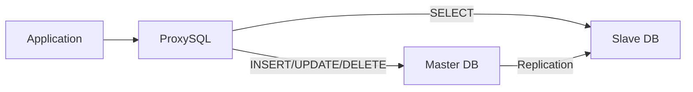
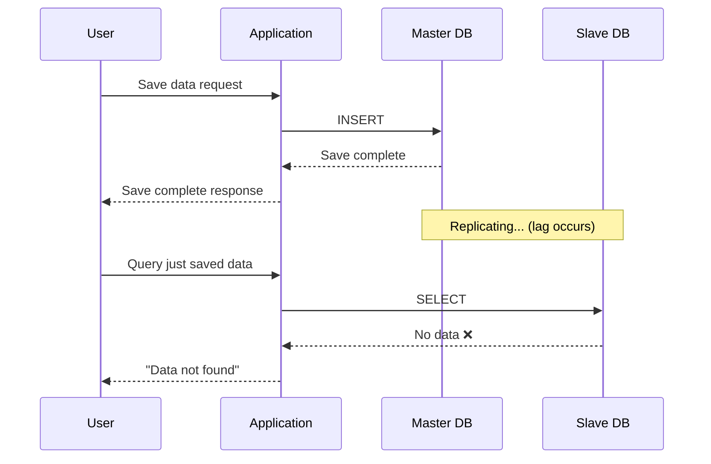
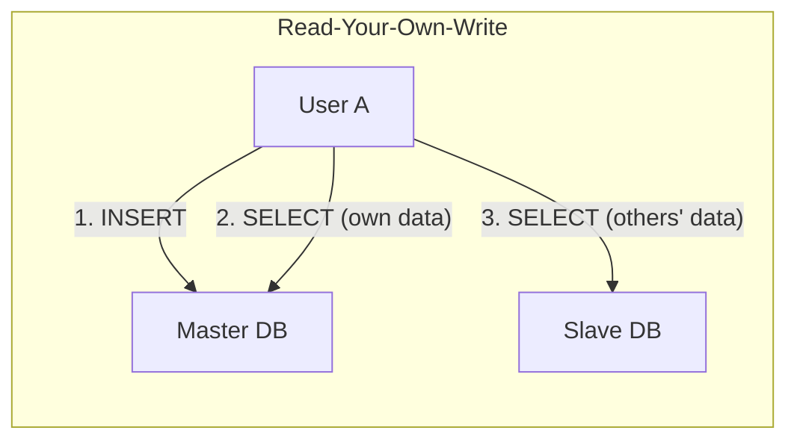

When developing in an environment that uses database Replication, there's a problem you'll inevitably encounter at some point. It's the **replication lag** problem.

I also faced this issue at my company, and went through various considerations during the resolution process. In this article, I want to share my experience about why replication lag occurs and what solutions are available.

## What is Replication Lag?

Before discussing the replication lag problem, let me first touch on why we use Replication.

Database Replication is a widely used approach to **distribute read load**. By configuring Master to handle writes (INSERT, UPDATE, DELETE) and Slave to handle reads (SELECT), we can effectively distribute the load.



Our company was also routing queries through ProxySQL with this structure. SELECT statements go to Slave, and write operations go to Master.

But here's where the problem arises. **It takes time for data to replicate from Master to Slave**. No matter how fast it is, it's never zero.



From the user's perspective, they queried data they just saved and it says it doesn't exist, causing confusion like "I definitely saved it, why isn't it there?" In our service, we often received exception alerts on Slack or user inquiries due to this problem.

## Problem Scenario

The typical scenario where replication lag occurred in our service was as follows:

1. User saves specific data (INSERT to Master)
2. Immediately queries that data after saving (SELECT from Slave)
3. Data doesn't appear because replication isn't complete yet
4. Subsequent logic throws "data not found" exception

What makes this problem tricky is that **it doesn't always occur**. In most cases, replication completes quickly without issues, but when traffic spikes or Master is under heavy load, replication delay increases and the problem surfaces.

## Solution Review

There are several methods to solve the replication lag problem. Let me examine the characteristics and trade-offs of each approach.

### 1. Read-Your-Own-Write

This is the most intuitive solution. **Subsequent reads by a user who performed a write operation are processed from Master**.



**Pros:**
- Data you wrote is always immediately queryable
- Implementation is relatively simple

**Cons:**
- Additional logic needed to determine "data you wrote"
- State sharing issues between servers when implementing with sessions or cookies

### 2. Monotonic Reads

This approach ensures that a user's read requests are **processed consistently in time order**. Once you read data at a certain point in time, subsequent reads won't show data from before that point.

**Pros:**
- Prevents time reversal phenomenon

**Cons:**
- High implementation complexity
- Doesn't solve replication lag itself

### 3. Using Transactions

When using a proxy like ProxySQL, you can leverage the characteristic that **all queries within a transaction are routed to Master**.

```java
@Transactional
public void processOrder(OrderRequest request) {
    // Both INSERT and SELECT are processed at Master
    orderRepository.save(order);
    Order savedOrder = orderRepository.findById(order.getId());
    // ...
}
```

**Pros:**
- Just add `@Transactional` to existing code
- The simplest solution

**Cons:**
- Read-only queries also go to Master, reducing load distribution benefits
- Transaction scope must be carefully designed

### 4. Using AbstractRoutingDataSource

Spring's `AbstractRoutingDataSource` allows you to **dynamically select DataSource based on business logic**.

```java
public class RoutingDataSource extends AbstractRoutingDataSource {
    @Override
    protected Object determineCurrentLookupKey() {
        return TransactionSynchronizationManager.isCurrentTransactionReadOnly()
            ? "slave" : "master";
    }
}
```

**Pros:**
- Fine-grained control possible
- Can be flexibly configured with AOP

**Cons:**
- Initial setup is somewhat complex
- Increases DataSource management points

## Our Choice

After reviewing various methods, we chose a **phased approach**.

### Phase 1: Apply Transactions to Major Business Logic

As the quickest applicable method, we applied `@Transactional` to major business logic that requires SELECT immediately after INSERT. This way, ProxySQL routes all queries within that transaction to Master.

### Phase 2: Introduce AbstractRoutingDataSource + AOP

For the long term, we configured `AbstractRoutingDataSource` to enable more fine-grained control. We created custom annotations so that specific methods would always point to Master.

```java
@Target(ElementType.METHOD)
@Retention(RetentionPolicy.RUNTIME)
public @interface UseMasterDB {
}

@Aspect
@Component
public class DataSourceRoutingAspect {

    @Around("@annotation(UseMasterDB)")
    public Object routeToMaster(ProceedingJoinPoint joinPoint) throws Throwable {
        try {
            DataSourceContextHolder.setDataSourceType("master");
            return joinPoint.proceed();
        } finally {
            DataSourceContextHolder.clear();
        }
    }
}
```

### Phase 3: Direct Master Connection for Some Services

For applications handling core business logic that is particularly sensitive to replication lag, we configured them to connect directly to Master without going through ProxySQL. This was a decision to prioritize data consistency over load distribution benefits.

## Remaining Concerns

This approach solved most replication lag issues, but it's not a perfect solution.

For example, if User A saves data and User B queries that data, replication lag can still occur. However, such cases are infrequent, and even when they occur, the data appears upon retry shortly after, so it didn't lead to critical problems.

I think the replication lag problem is difficult to completely avoid as long as you use a Replication structure. Ultimately, it seems important to **judge how much delay to allow and which cases require strong consistency** based on business requirements, and choose the appropriate strategy accordingly.

## Summary

Here's what I learned while solving the replication lag problem:

1. **Processing all reads from Master would solve it**, but that defeats the purpose of using Replication
2. **Understand trade-offs and choose** (consistency vs performance)
3. **Gradual improvement** is realistic (improve step by step rather than creating a perfect structure at once)
4. **Strategy varies by business requirements** (there's no one-size-fits-all answer)

This experience was inspired by Jin-han Kim's session [Growth and Change of NAVER Pay Payment System](https://dan.naver.com/24/sessions/635) at NAVER conference DAN24, which motivated me to seriously tackle this problem. I hope this helps anyone facing similar issues.

---

### Reference
- https://drunkenhw.github.io/java/select-database/
- https://velog.io/@ghkvud2/AbstractRoutingDataSource-%EC%A0%81%EC%9A%A9%ED%95%98%EA%B8%B0
- Martin Kleppmann - *Designing Data-Intensive Applications* (O'Reilly, 2017) - Chapter 5: Replication
