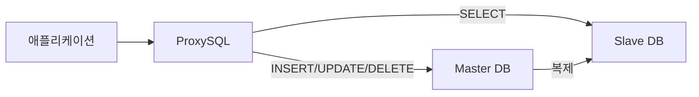
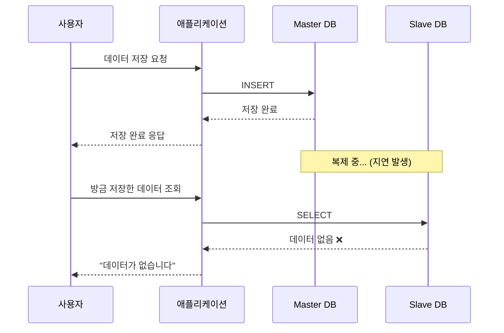
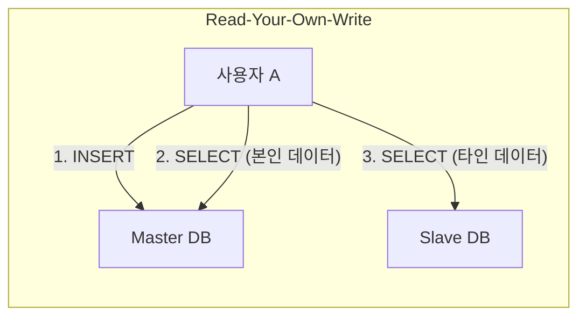

데이터베이스 Replication을 사용하는 환경에서 개발하다 보면, 언젠가 한번쯤은 마주치게 되는 문제가 있습니다. 바로 **복제 지연(Replication Lag)** 문제입니다.

저 역시 회사에서 이 문제를 직면했고, 해결 과정에서 여러 고민을 했던 경험이 있습니다. 이 글에서는 복제 지연이 왜 발생하는지, 그리고 어떤 해결 방법들이 있는지 제 경험을 바탕으로 공유해보려 합니다.

## 복제 지연이란?

복제 지연 문제를 이야기하기 전에, 먼저 왜 Replication을 사용하는지부터 짚어보겠습니다.

데이터베이스 Replication은 **읽기 부하를 분산**하기 위해 널리 사용되는 방식입니다. Master에서는 쓰기(INSERT, UPDATE, DELETE)를 처리하고, Slave에서는 읽기(SELECT)를 처리하도록 구성하면 부하를 효과적으로 분산할 수 있죠.



저희 회사에서도 위와 같은 구조로 ProxySQL을 통해 쿼리를 라우팅하고 있었습니다. SELECT 문은 Slave로, 쓰기 작업은 Master로 전송되는 방식이죠.

그런데 여기서 문제가 발생합니다. **Master에서 Slave로 데이터가 복제되는 데는 시간이 걸린다**는 점입니다. 아무리 빨라도 0은 아니거든요.



사용자 입장에서는 방금 저장한 데이터를 조회했는데 없다고 나오니, "분명 저장했는데 왜 없지?"라는 혼란을 겪게 됩니다. 실제로 저희 서비스에서도 이런 문제로 인해 Slack에 예외 알림이 오거나, 사용자 문의가 들어오는 경우가 종종 있었습니다.

## 문제 상황

저희 서비스에서 복제 지연 문제가 발생했던 대표적인 시나리오는 다음과 같았습니다.

1. 사용자가 특정 데이터를 저장 (Master에 INSERT)
2. 저장 완료 후 바로 해당 데이터를 조회 (Slave에서 SELECT)
3. 아직 복제가 완료되지 않아 데이터가 조회되지 않음
4. 후속 로직에서 "데이터가 없다"는 예외 발생

이 문제가 까다로운 이유는 **항상 발생하는 게 아니라는 점**입니다. 대부분의 경우에는 복제가 빠르게 완료되어 문제가 없지만, 트래픽이 몰리거나 Master에 부하가 걸리면 복제 지연이 길어지면서 문제가 표면화됩니다.

## 해결 방법 검토

복제 지연 문제를 해결하기 위한 방법은 여러 가지가 있습니다. 각 방법의 특징과 trade-off를 살펴보겠습니다.

### 1. Read-Your-Own-Write (자신이 쓴 데이터 읽기)

가장 직관적인 해결책입니다. **쓰기 작업을 수행한 사용자의 후속 읽기는 Master에서 처리**하는 방식이죠.



**장점:**
- 자신이 쓴 데이터는 항상 즉시 조회 가능
- 구현이 비교적 단순

**단점:**
- "자신이 쓴 데이터"를 어떻게 판별할 것인지 추가 로직 필요
- 세션이나 쿠키 기반으로 구현 시 서버 간 상태 공유 문제

### 2. Monotonic Reads (단조 읽기)

한 사용자의 읽기 요청이 **시간 순서대로 일관성 있게** 처리되도록 보장하는 방식입니다. 한번 특정 시점의 데이터를 읽었다면, 이후에는 그보다 과거의 데이터를 읽지 않도록 하는 거죠.

**장점:**
- 시간 역전 현상 방지

**단점:**
- 구현 복잡도가 높음
- 복제 지연 자체를 해결하지는 않음

### 3. 트랜잭션 활용

ProxySQL과 같은 프록시를 사용하는 경우, **트랜잭션 내에서는 모든 쿼리가 Master로 라우팅**되는 특성을 활용할 수 있습니다.

```java
@Transactional
public void processOrder(OrderRequest request) {
    // INSERT와 SELECT 모두 Master에서 처리됨
    orderRepository.save(order);
    Order savedOrder = orderRepository.findById(order.getId());
    // ...
}
```

**장점:**
- 기존 코드에 `@Transactional`만 추가하면 됨
- 가장 간단한 해결책

**단점:**
- 읽기 전용 쿼리도 Master로 가면서 부하 분산 효과 감소
- 트랜잭션 범위를 신중하게 설계해야 함

### 4. AbstractRoutingDataSource 활용

Spring에서 제공하는 `AbstractRoutingDataSource`를 사용하면 **비즈니스 로직에 따라 동적으로 DataSource를 선택**할 수 있습니다.

```java
public class RoutingDataSource extends AbstractRoutingDataSource {
    @Override
    protected Object determineCurrentLookupKey() {
        return TransactionSynchronizationManager.isCurrentTransactionReadOnly()
            ? "slave" : "master";
    }
}
```

**장점:**
- 세밀한 제어 가능
- AOP와 결합하여 유연하게 구성 가능

**단점:**
- 초기 설정이 다소 복잡
- DataSource 관리 포인트 증가

## 저희의 선택

여러 방법을 검토한 결과, 저희는 **단계적 접근**을 선택했습니다.

### 1단계: 주요 비즈니스 로직에 트랜잭션 적용

가장 빠르게 적용할 수 있는 방법으로, INSERT 후 즉시 SELECT가 필요한 주요 비즈니스 로직에 `@Transactional`을 적용했습니다. 이렇게 하면 ProxySQL이 해당 트랜잭션 내의 모든 쿼리를 Master로 라우팅합니다.

### 2단계: AbstractRoutingDataSource + AOP 도입

장기적으로는 `AbstractRoutingDataSource`를 활용하여 더 세밀한 제어가 가능하도록 구성했습니다. 커스텀 어노테이션을 만들어 특정 메서드에서는 무조건 Master를 바라보도록 설정할 수 있게 했죠.

```java
@Target(ElementType.METHOD)
@Retention(RetentionPolicy.RUNTIME)
public @interface UseMasterDB {
}

@Aspect
@Component
public class DataSourceRoutingAspect {

    @Around("@annotation(UseMasterDB)")
    public Object routeToMaster(ProceedingJoinPoint joinPoint) throws Throwable {
        try {
            DataSourceContextHolder.setDataSourceType("master");
            return joinPoint.proceed();
        } finally {
            DataSourceContextHolder.clear();
        }
    }
}
```

### 3단계: 일부 서비스는 Master 직접 연결

복제 지연에 특히 민감한 핵심 비즈니스 로직을 다루는 애플리케이션의 경우, ProxySQL을 거치지 않고 Master에 직접 연결하도록 구성했습니다. 이는 부하 분산 효과를 포기하는 대신 데이터 일관성을 우선시한 결정이었습니다.

## 남은 고민

이 방식으로 대부분의 복제 지연 문제는 해결되었지만, 완벽한 해결책은 아닙니다.

예를 들어, 사용자 A가 데이터를 저장하고 사용자 B가 그 데이터를 조회하는 경우에는 여전히 복제 지연 문제가 발생할 수 있습니다. 다만 이런 케이스는 빈도가 낮고, 발생하더라도 잠시 후 다시 조회하면 데이터가 보이기 때문에 치명적인 문제로 이어지지는 않았습니다.

복제 지연 문제는 Replication 구조를 사용하는 한 완전히 피하기 어려운 문제라고 생각합니다. 결국 **어느 정도의 지연을 허용할 것인지, 어떤 케이스에서 강한 일관성이 필요한지**를 비즈니스 요구사항에 맞게 판단하고, 그에 맞는 전략을 선택하는 것이 중요한 것 같습니다.

## 정리

복제 지연 문제를 해결하면서 배운 점을 정리하면 다음과 같습니다.

1. **모든 읽기를 Master에서 처리하면 해결되지만**, 그러면 Replication을 쓰는 의미가 없어짐
2. **트레이드오프를 이해하고 선택**해야 함 (일관성 vs 성능)
3. **점진적 개선**이 현실적 (한 번에 완벽한 구조를 만들기보다 단계적으로 개선)
4. **비즈니스 요구사항에 따라 전략이 달라짐** (모든 상황에 맞는 정답은 없음)

이 경험은 NAVER 컨퍼런스 DAN24에서 김진한님의 [네이버페이 결제 시스템의 성장과 변화](https://dan.naver.com/24/sessions/635) 세션을 듣고 영감을 받아 본격적으로 해결하게 된 계기가 되었습니다. 비슷한 문제를 겪고 계신 분들께 조금이나마 도움이 되었으면 합니다.

---

### Reference
- https://drunkenhw.github.io/java/select-database/
- https://velog.io/@ghkvud2/AbstractRoutingDataSource-%EC%A0%81%EC%9A%A9%ED%95%98%EA%B8%B0
- Martin Kleppmann - *Designing Data-Intensive Applications* (O'Reilly, 2017) - Chapter 5: Replication
