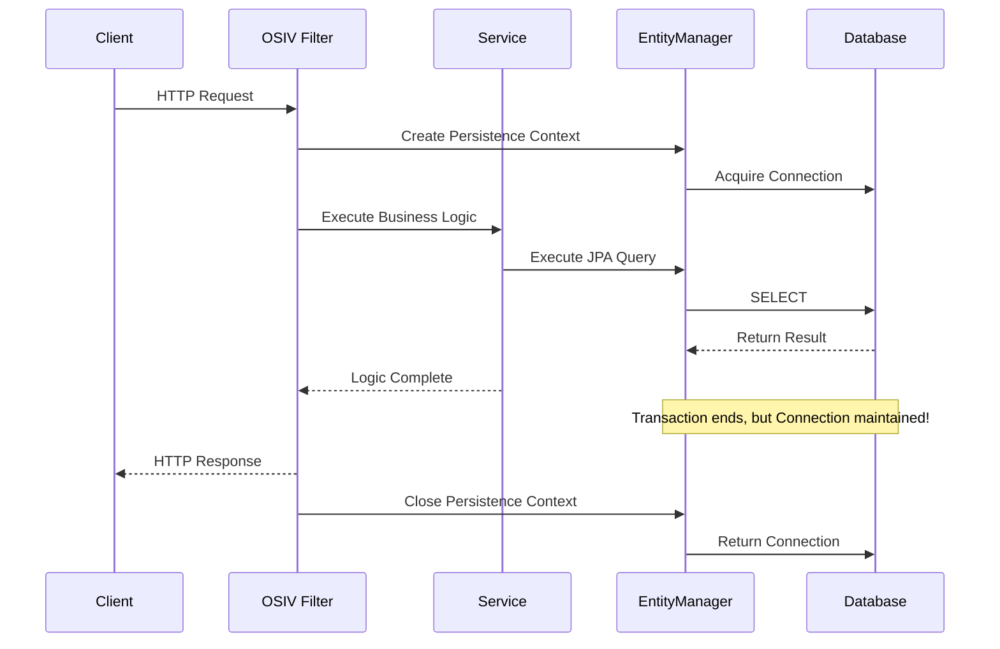

I'm sharing an issue related to HikariCP Deadlock that I encountered at work.

---

## Problem Occurrence

As always, the issue starts with a Slack message.


> **Excerpt from Stack trace**
> ```
> Caused by: java.sql.SQLTransientConnectionException:
> HikariPool-1 - Connection is not available, request timed out after 30008ms.
> ```

When I first glanced at the Stack trace on Slack, I was puzzled.

Hikari waited 30 seconds to get a Connection but couldn't...?

As expected, I immediately started digging into the logs to figure out where it occurred and why.

First, the `maximum-pool-size` of the server where the exception occurred was set to 40.

> **Server HikariPool Connection related log**
> ```
> HikariPool-1 - Timeout failure stats (total=40, active=40, idle=0, waiting=46)
> ```

Even considering it was a time and logic with heavy traffic, waiting 30 seconds and then failing to get a Connection was incomprehensible.

What made me even more puzzled was that **this logic hadn't been modified since it was updated a few months ago**, had been operating without problems for months, and only now this exception occurred.

After simulating it in my head, I searched for related issues. Fortunately, I was able to find related issues without difficulty.

[Escaping from HikariCP Deadlock (Theory) - Woowahan Tech Blog](https://techblog.woowahan.com/2664/)

I hadn't completely dismissed the possibility of Deadlock. However, I suspected a Deadlock at the DB level rather than the application level, but there was no such problem, and if a Deadlock had occurred at the DB level, a Deadlock exception should have been thrown, so I wasn't suspecting that.

> Wait... HikariCP can also have Deadlocks...?

I couldn't suspect it because I had neither thought about it nor experienced it...

Since I could confirm symptoms similar to that article, I thought I could identify the cause soon. In conclusion, the article identified the following as the cause of HikariCP deadlock:

> Under load, a Race Condition occurs for threads to claim connections.
> Saving one message while **using 2 connections simultaneously in one transaction** caused a thread-level deadlock on HikariCP.

---

## Problem Resolution..?

Alright, I think I'm getting close to identifying the cause, and it seems like I'll be able to solve it soon.

I immediately started checking the server code.

But wait...? The logic where the exception occurred **consists only of SELECT statements, and there's not even a Transaction**...?

I was lost again.

First, to regain my bearings, I started trying various things and was able to catch a hint.

---

## Why Isn't the Connection Being Returned??

In my local environment, I set `maximum-pool-size` to 1 and tested that logic.

As a result, I was able to encounter the same exception and identify at which line it occurred.

```java
public long findBy~~~() {
    return factory
        .select(serviceNotice.count())
        .from(serviceNotice)
        .where(
            serviceNotice.actType.eq("specific condition"),
            serviceNotice.section.eq("specific condition"),
            serviceNotice.actEnable.eq(true),
            serviceNotice.startDt.before(nowDate),
            serviceNotice.endDt.after(nowDate)
        )
        .fetchOne();
}
```

Precisely, I discovered that even after this method ended, it wasn't returning the Connection and was keeping one active.

At first, I thought it was HikariCP Deadlock due to `Connection Leak`. The expected number of connections when executing this logic was one, but since Connection Leak occurred in this code, it became logic that needed a maximum of 2 connections simultaneously until the logic was completed.

**But as it turned out later, it wasn't Connection Leak...**

---

## Real Problem Resolution in Progress

I was able to find related articles.

[DB connection leak issue when using transform in Querydsl](https://colin-d.medium.com/querydsl-%EC%97%90%EC%84%9C-db-connection-leak-%EC%9D%B4%EC%8A%88-40d426fd4337)

However, unfortunately, our issue wasn't exactly the same as the issue in that article. We weren't using `transform`.


If it's not a method with these names, the entityManager is not closed. However, since the internal method name of fetchOne is `getSingleResult`, it should have been closed.. I don't know why it wasn't, and even when I try it with the Transaction annotation, it's not being closed...

First, I wanted to check if QueryDSL was the cause, so I changed the code to JPQL and tested it, but the same exception occurred.


I concluded that it's highly unlikely to be a problem with QueryDSL itself.

Ultimately, I thought it was a problem caused by not properly returning the Connection to HikariCP, so I focused on that part.

I debugged to follow the code until the Connection was actually returned and a few lines of code in the `DefaultJpaDialect` class caught my eye.

First, looking inside the `releaseJdbcConnection()` method


> This implementation does nothing, assuming that the Connection will implicitly be closed with the EntityManager.

Looking at the comments, I could see that it's delegating the Connection return to `EntityManager`.

I need to focus on this logic and EntityManager and check the code.

> One other puzzling thing is that when I called this logic with test code, there was no problem with just 1 Connection... The more I know, the more confusing it gets..

---

## Root Cause Identified

I've identified the cause.

While investigating more about when EntityManager closes

> Come to think of it, when does the persistence context release the Connection...?

Actually, I had been thinking that the Connection would be returned the moment the query returns or when the Transaction ends if a Transaction is active. Since the logic in question didn't have a Transaction, I naturally thought it would return the Connection the moment the query returned. However, from the moment I had doubts, I started searching for related content.

And then I learned about the `OSIV option`.

### What is OSIV (Open Session In View)?

[Related article](https://ykh6242.tistory.com/m/entry/JPA-OSIVOpen-Session-In-View%EC%99%80-%EC%84%B1%EB%8A%A5-%EC%B5%9C%EC%A0%81%ED%99%94)

**When OSIV is ON:**


- When a client request comes in, a persistence context is created in the servlet filter or Spring interceptor. However, at this point, the transaction does not start.
- When the service layer starts a transaction with @Transactional, it finds the persistence context created earlier and starts the transaction.
- When the service layer ends, the transaction is committed and the persistence context is flushed. **At this point, the transaction ends but the persistence context does not terminate.**
- The persistence context is maintained until the controller and view, so queried entities remain in a persistent state.
- When the request returns to the servlet filter or Spring interceptor, the persistence context is closed.

**When OSIV is OFF:**


- When OSIV is turned off, when the transaction ends, the persistence context is closed and **the database connection is also returned.** Therefore, connection resources are not wasted.
- When OSIV is turned off, all lazy loading must be handled within the transaction. Therefore, there is a disadvantage that you need to put a lot of lazy loading code into the transaction.

It's a Spring web interceptor for using the OSIV or OEIV pattern, which maintains the EntityManager's management state even after the transaction ends, **which is why the Connection was being maintained.**



**Just maintaining the Connection alone didn't satisfy the conditions for HikariCP Deadlock to occur**, but the problem was that code that satisfied the occurrence conditions existed after the QueryDSL code.

Because there was **code written with MyBatis after the QueryDSL code**...

> **Why are MyBatis and JPA together?**
>
> It was a server that was in the process of converting logic written in MyBatis to JPA, and only some logic had been converted to JPA in stages.

**The Connection was maintained and when MyBatis was used, another Connection was needed, causing a Deadlock.**

```mermaid
flowchart TB
    subgraph Request["One HTTP Request Needs 2 Connections"]
        JPA["1. Execute JPA Query<br/>→ Acquire Connection #1<br/>→ Maintained due to OSIV"]
        MyBatis["2. Execute MyBatis Query<br/>→ Needs Connection #2<br/>→ 💥 Deadlock if Pool is full!"]
        JPA --> MyBatis
    end
```



That's why there was no problem when I tested only the Service logic with test code. (OSIV only works in web request context)

---

## Conclusion: HikariCP Deadlock Occurrence Conditions

**The key is not OSIV, but that Deadlock can occur when a task requires 2 Connections.**

```
Conditions for this exception to occur

1. Using JPA and MyBatis simultaneously
2. JPA and MyBatis share the same Connection Pool
3. OSIV option ON
   (※ Even if Off, the result is the same if MyBatis code is called after the persistence context is loaded within one Transaction)
4. Receiving request via REST API (When OSIV option is On)
5. Loading persistence context within one Task → Holding 1 Connection
6. Using MyBatis → Needs 1 more Connection → Became a Task that needs 2 Connections
7. If all Connections are occupied during the logic from step 5 to step 6, Deadlock occurs
```

```java
// Example code that generates the above conditions
public void deadLockMethod() {
    mybatisSelectMethod(); // Connection Pool 1/1 (waiting queue: 0)
    // Return Connection - Connection Pool 0/1 (waiting queue: 0)

    jpaSelectMethod(); // Connection Pool 1/1 (waiting queue: 0)
    // Persistence context doesn't Close() so Connection is maintained - Connection Pool 1/1 (waiting queue: 0)

    mybatisSelectMethod(); // Connection Pool 1/1 (waiting queue: 1)
    // → Wait 30 seconds then Exception: Deadlock occurrence point!!
}
```

---

## Solution

This problem was concluded to be avoided at the code level by **not using MyBatis and JPA together in one Task**, because adjusting the OSIV option might have some impact that we haven't identified yet.

```yaml
# Disable OSIV (optional)
spring:
  jpa:
    open-in-view: false
```

However, even if OSIV is turned off, **Deadlock can still occur if JPA and MyBatis are mixed within one Transaction.** The fundamental solution is to remove the mixing.

---

## Why It Didn't Occur Before

The reason this exception didn't occur before was quite simple.

Our company uses Kubernetes. We increase the minimum number of pods in advance during heavy traffic times, but recently, **to reduce server operation costs, we reduced the number of pods we increase from 5 to 2.**

Previously, traffic was distributed across multiple pods so connections were never fully occupied, but as the number of pods decreased, traffic to each pod doubled, and when requests hit simultaneously, all connections were occupied, causing this exception.

> Until we completely solved this problem, we temporarily increased the number of pods again to distribute traffic.. ㅜ

---

## Reflections

If I had a little more knowledge about JPA, I would have recognized it right away...

I was able to resolve to study more about JPA, DBCP, MyBatis, and JDBC, and debugging by checking JPA's code was also a very good experience. It was a more interesting experience than I thought.

---

### Reference
- https://techblog.woowahan.com/2664/ - Escaping from HikariCP Deadlock (Theory)
- https://techblog.woowahan.com/2663/ - Escaping from HikariCP Deadlock (Practice)
- https://colin-d.medium.com/querydsl에서-db-connection-leak-이슈
- https://ykh6242.tistory.com/m/entry/JPA-OSIVOpen-Session-In-View와-성능-최적화
- https://github.com/brettwooldridge/HikariCP
