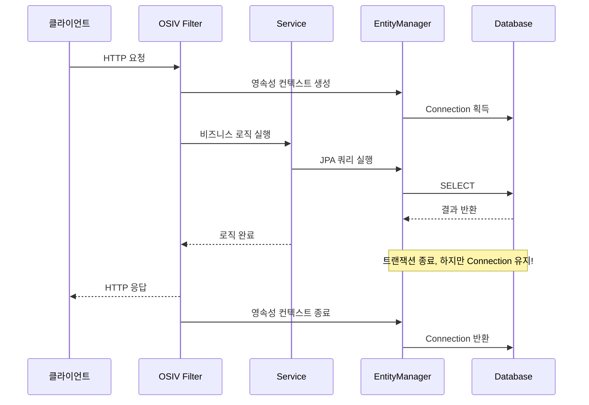
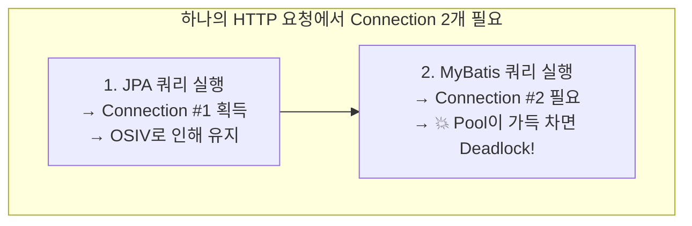

이번에 회사에서 직면했던 HikariCP Deadlock 문제에 대해 공유하고자 글을 남깁니다.

---

## 문제 발생

오늘도 어김없이 문제는 Slack 메세지로부터 시작합니다.


> **Stack trace 중 일부 발췌**
> ```
> Caused by: java.sql.SQLTransientConnectionException:
> HikariPool-1 - Connection is not available, request timed out after 30008ms.
> ```

처음에 Slack으로 Stack trace를 얼핏 봤을때는 고개를 갸우뚱 하게 됐습니다.

Hikari에 Connection을 받기 위해 30초나 대기 했는데 못받았다고...?

역시나 받자마자 어느 부분에서 발생한 건지 어떤 이유에서 발생한 건지 파악하기 위해 로그를 까보기 시작했습니다.

우선 해당 예외가 발생한 서버의 `maximum-pool-size`는 40으로 설정돼 있었습니다.

> **서버 HikariPool Connection 관련 log**
> ```
> HikariPool-1 - Timeout failure stats (total=40, active=40, idle=0, waiting=46)
> ```

예외가 발생한 당시 트래픽이 몰리는 시간 및 로직인걸 감안하더라도 30초를 대기했다가 Connection을 얻는 걸 실패했다는 건 도무지 이해할 수 없었습니다.

좀 더 고개를 갸우뚱 하게 했던 점은, **해당 로직은 몇 개월 전 수정된 이후로 수정된 적이 없는 로직**이였고, 몇 달간 문제없이 운영하다 이번에서야 이런 예외가 발생했다는 것이였습니다.

머릿속에서 시뮬레이션을 해보다 관련 이슈가 존재하는지 찾아보게 됐습니다. 감사하게도 관련된 이슈를 어렵지 않게 찾을 수 있었습니다.

[HikariCP Dead lock에서 벗어나기 (이론편) - 우아한형제들 기술블로그](https://techblog.woowahan.com/2664/)

Deadlock을 의심하지 않았던 것은 아니였습니다. 그러나 어플리케이션 레벨이 아닌 DB단에서의 Deadlock을 의심했지만 해당하는 문제는 없었고, DB단에서 Deadlock이 발생했다면 Deadlock에 관한 예외가 터져야 했기 때문에 그 부분을 의심하고 있진 않았습니다.

> 그런데 이게 웬걸.. HikariCP에서도 Deadlock이 발생할 수 있던 거였구나...?

생각해보지도 경험해보지도 못했기 때문에 의심할 수 없었습니다...

해당 글과 비슷한 증상들을 확인할 수 있었기 때문에 얼마 안 가 원인 파악할 수 있겠다 싶었습니다. 결론적으로 해당 글에서 HikariCP Deadlock이 발생했던 원인은 다음으로 꼽고 있습니다.

> 부하 상황에서 Thread간 Connection을 차지하기 위한 Race Condition이 발생합니다.
> 메세지 1개를 저장하는데 **한 Transaction에서 동시에 Connection 2개를 사용**하면서 HikariCP에 대한 Thread간 Deadlock이 발생하게 되었습니다.

---

## 문제 해결..?

자 원인 파악에 많이 다가선 거 같다 느끼고 금방이라도 해결할 수 있을 것만 같습니다.

서버 코드를 바로 까보기 시작했죠.

그런데 이게 웬걸...? 예외가 발생했던 해당 로직은 **Select로만 이루어져 있으며, 심지어 Transaction도 걸려있지 않은데...?**

다시금 갈피를 잃고 말았습니다.

우선 다시금 갈피를 잡기 위해 이것저것 시도해보기 시작했고 힌트를 잡을 수 있었습니다.

---

## 왜 Connection을 반환을 안해??

Local 환경에서 `maximum-pool-size`를 1로 설정하고 해당 로직을 테스트해봤습니다.

결과적으로 같은 예외를 직면할 수 있었고 어느 라인에서 발생하는지도 파악할 수 있었습니다.

```java
public long findBy~~~() {
    return factory
        .select(serviceNotice.count())
        .from(serviceNotice)
        .where(
            serviceNotice.actType.eq("특정 조건"),
            serviceNotice.section.eq("특정 조건"),
            serviceNotice.actEnable.eq(true),
            serviceNotice.startDt.before(nowDate),
            serviceNotice.endDt.after(nowDate)
        )
        .fetchOne();
}
```

정확하게는 해당 메소드가 끝난 후에도 Connection을 반환하지 않고 Active 상태로 하나 물고 있는 현상을 발견할 수 있었습니다.

처음에는 `Connection Leak`으로 인한 HikariCP Deadlock이라고 생각했습니다. 해당 로직을 실행할 때 기대했던 Connection 개수는 한 개였지만 해당 코드에서 Connection Leak이 발생하니 로직이 모두 마무리될 때까지 Connection이 동시에 최대 2개 필요한 로직이 되버린 것이라고요.

**그런데 나중에 알고 보니 Connection Leak이 아니였습니다...**

---

## 진짜 문제 해결 중

관련된 글을 찾을 수는 있었습니다.

[Querydsl에서 transform 사용시에 DB connection leak 이슈](https://colin-d.medium.com/querydsl-%EC%97%90%EC%84%9C-db-connection-leak-%EC%9D%B4%EC%8A%88-40d426fd4337)

그러나 아쉽게도 저희는 해당 글의 이슈와 완전히 동일하지 않았습니다. `transform`을 사용하고 있진 않았거든요.


위 name의 method가 아닐 경우에는 entityManager는 close되지 않는다고 합니다. 그런데 fetchOne의 내부 메소드 이름은 `getSingleResult`이기 때문에 close 돼야 했는데... 어째서 안됐는지 모를 뿐더러 Transaction 어노테이션을 달고 진행해봐도 close되지 않고 있습니다...

먼저 QueryDSL이 원인인지 파악해보고 싶어 JPQL로 코드를 변경해 테스트해봤지만 같은 예외 상황이 발생했습니다.


QueryDSL 자체의 문제는 아닐 가능성이 높다 판단하게 됐습니다.

결국 Connection을 HikariCP에 제대로 반환하지 못했기 때문에 생긴 문제로 생각이 들어 그 부분을 집중적으로 보게 됐습니다.

실제 Connection을 반환하게 되기까지의 코드를 따라가보려 Debug를 실시했고 `DefaultJpaDialect` 클래스의 코드 몇 줄이 눈에 들어왔습니다.

우선 `releaseJdbcConnection()` 메소드 내부를 보면


> This implementation does nothing, assuming that the Connection will implicitly be closed with the EntityManager.

주석을 보면 Connection 반환을 `EntityManager`에 위임하고 있는 모습을 확인할 수 있었습니다.

해당 로직과 EntityManager를 중점으로 생각하고 코드를 까봐야겠습니다.

> 또 한 가지 의문인 점은 테스트 코드로 해당 로직을 호출했을 때는 Connection 1개로도 문제 없더라구요... 참 알다가도 모르겠네요..

---

## 원인 파악 완료

원인 파악했습니다.

EntityManager가 close되는 시점에 대한 부분을 좀 더 파악해보다

> 그러고 보니 영속성 컨텍스트가 Connection을 언제 놓아주지...?

사실 저는 그전에는 Connection을 쿼리의 리턴을 받은 순간 혹은 Transaction이 걸려있다면 Transaction이 끝나는 순간 반환하겠지? 라는 생각을 하고 있었습니다. 해당하는 로직은 Transaction이 안 걸려있기 때문에 당연하게도 쿼리가 리턴받은 순간 Connection을 반환할 거다라고 생각하고 있었습니다. 그러나 의문을 가지게 된 순간부터 관련된 내용을 좀 더 찾아보게 됐습니다.

그리고는 `OSIV 옵션`에 대해 알게 됐습니다.

### OSIV(Open Session In View)란?

[관련 글](https://ykh6242.tistory.com/m/entry/JPA-OSIVOpen-Session-In-View%EC%99%80-%EC%84%B1%EB%8A%A5-%EC%B5%9C%EC%A0%81%ED%99%94)

**OSIV ON일 때:**


- 클라이언트의 요청이 들어오면 서블릿 필터나, 스프링 인터셉터에서 영속성 컨텍스트를 생성한다. 단 이 시점에서 트랜잭션은 시작하지 않는다.
- 서비스 계층에서 @Transactional로 트랜잭션을 시작할 때 미리 생성해둔 영속성 컨텍스트를 찾아와서 트랜잭션을 시작한다.
- 서비스 계층이 끝나면 트랜잭션을 커밋하고 영속성 컨텍스트를 플러시한다. **이 시점에 트랜잭션은 끝내지만 영속성 컨텍스트는 종료되지 않는다.**
- 컨트롤러와 뷰까지 영속성 컨텍스트가 유지되므로 조회한 엔티티는 영속 상태를 유지한다.
- 서블릿 필터나, 스프링 인터셉터로 요청이 돌아오면 영속성 컨텍스트를 종료한다.

**OSIV OFF일 때:**


- OSIV를 끄면 트랜잭션을 종료할 때 영속성 컨텍스트를 닫고, **데이터베이스 커넥션도 반환한다.** 따라서 커넥션 리소스를 낭비하지 않는다.
- OSIV를 끄면 모든 지연로딩을 트랜잭션 안에서 처리해야 한다. 따라서 지금까지 작성한 많은 지연 로딩 코드를 트랜잭션 안으로 넣어야 하는 단점이 있다.

OSIV 또는 OEIV 패턴을 사용하기 위한 스프링 웹 인터셉터로 트랜잭션이 종료되더라도 EntityManager의 관리 상태를 유지하는 기능으로, **이 때문에 Connection이 유지됐던 것이였습니다.**



**Connection이 유지되는 것만으로는 HikariCP Deadlock이 발생할 조건을 만족시키지 않았지만**, 문제는 QueryDSL 이후 코드에 발생 조건을 충족시키는 코드가 존재했다는 것이였습니다.

QueryDSL 이후 코드에는 **MyBatis로 이루어진 코드가 존재했기 때문입니다...**

> **어째서 MyBatis랑 JPA랑 같이 있나요?**
>
> 기존 MyBatis로 이루어진 로직을 JPA로 변경하는 작업을 진행하던 서버였고, 단계별로 JPA로 변경하면서 일부 로직만 수정이 완료된 상태였던 것입니다.

**Connection이 유지된 상태에서 MyBatis를 사용하게 되고 Connection이 한 개 더 필요해지면서 Deadlock이 발생했던 것이였습니다.**



이래서 테스트 코드로 Service 로직만 테스트했을 땐 문제가 발생하지 않았던 거죠. (OSIV는 웹 요청 컨텍스트에서만 동작)

---

## 결론: HikariCP Deadlock 발생 조건

**핵심은 OSIV가 아니라, 한 태스크에서 Connection을 2개 필요로 하면 Deadlock이 발생할 수 있다는 것입니다.**

```
해당 예외 발현 조건

1. JPA, MyBatis 동시 사용
2. JPA, MyBatis가 동일한 Connection Pool 공유
3. OSIV 옵션 ON
   (※ Off이더라도 한 Transaction 안에 영속성 컨텍스트가 로딩된 이후에 MyBatis 코드가 호출되면 결과 동일)
4. REST API로 요청 받음 (OSIV 옵션 On일 경우)
5. 한 Task 안에서 영속성 컨텍스트 로딩 → Connection 1개 잡고 있음
6. MyBatis 사용 → Connection 1개 더 필요 → Connection 2개가 필요한 Task가 됐음
7. 5번에서 6번으로 넘어가는 로직동안 Connection을 모두 점유한 상태라면 Deadlock 발생
```

```java
// 위 조건 발생 코드 예시
public void deadLockMethod() {
    mybatisSelectMethod(); // Connection Pool 1/1 (대기 큐: 0)
    // Connection 반환 - Connection Pool 0/1 (대기 큐: 0)

    jpaSelectMethod(); // Connection Pool 1/1 (대기 큐: 0)
    // 영속성 컨텍스트 Close() 되지 않으므로 Connection 유지 - Connection Pool 1/1 (대기 큐: 0)

    mybatisSelectMethod(); // Connection Pool 1/1 (대기 큐: 1)
    // → 30초간 대기 후 Exception: Deadlock 발생 시점!!
}
```

---

## 해결 방법

해당하는 문제는 OSIV 옵션을 조정하는 것은 어느 정도의 영향도를 줄지 파악하지 못한 상태이기 때문에 지양하게 됐고, **한 Task 안에 MyBatis와 JPA를 동시에 사용하지 않도록 코드 레벨에서 수정**하도록 결론지어졌습니다.

```yaml
# OSIV 비활성화 (선택적)
spring:
  jpa:
    open-in-view: false
```

단, OSIV를 끄더라도 **한 Transaction 안에서 JPA와 MyBatis를 혼용하면 여전히 Deadlock이 발생할 수 있습니다.** 근본적인 해결책은 혼용을 제거하는 것입니다.

---

## 그 전에는 발생하지 않았던 이유

해당 예외가 그전에는 발생하지 않았던 이유는 생각보다 단순하다면 단순했습니다.

저희 회사는 쿠버네티스를 사용 중에 있습니다. 저희는 트래픽이 몰릴 시간대에 미리 최소 파드 개수를 늘려놓습니다만, 최근에 **서버 운용 비용을 절감하기 위해 늘리는 파드 개수를 기존 5개에서 2개로 줄였습니다.**

기존에는 트래픽이 여러 파드로 나눠지면서 Connection을 모두 점유할 일이 없었지만, 파드 수가 줄어들며 한 파드에 트래픽이 두 배로 늘어나면서 동시에 요청이 꽂히게 되면 Connection을 모두 점유하게 되면서 해당 예외가 발생했던 겁니다.

> 이 문제를 모두 해결하기 전까지는 파드 수를 다시 늘려 트래픽을 분산시켜서 임시방편 조치를 했습니다.. ㅜ

---

## 느낀점

JPA에 대한 지식이 조금만 더 있었어도 보자마자 알아차렸을 텐데...

JPA, DBCP, MyBatis, JDBC에 대한 공부를 더 해야겠다는 다짐을 할 수 있었고, JPA의 코드를 까보며 Debug하는 것도 되게 좋은 경험이였던 것 같습니다. 생각보다 되게 흥미로운 경험이였습니다.

---

### Reference
- https://techblog.woowahan.com/2664/ - HikariCP Deadlock에서 벗어나기 (이론편)
- https://techblog.woowahan.com/2663/ - HikariCP Deadlock에서 벗어나기 (실전편)
- https://colin-d.medium.com/querydsl에서-db-connection-leak-이슈
- https://ykh6242.tistory.com/m/entry/JPA-OSIVOpen-Session-In-View와-성능-최적화
- https://github.com/brettwooldridge/HikariCP
