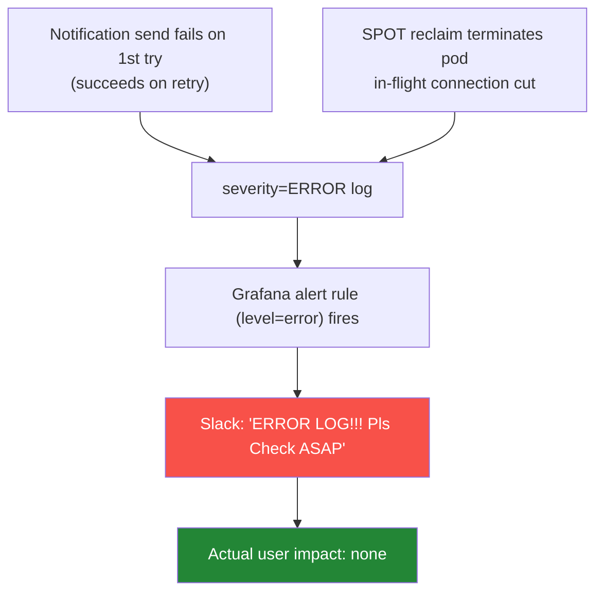
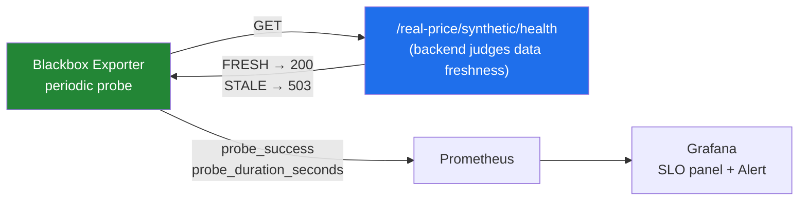

Hi, I'm Jeongil Jeong, a backend developer working at a proptech platform.

This post is less about code or a specific technology, and more about a question that wouldn't leave my head for a while.

**"How does a service earn its users' trust?"**

It might sound a bit grand, but it was actually a question I couldn't help thinking about. I think a big part of why users keep using a service comes down to **trust** — the belief that "this service works the way I expect, when I need it." And that belief is slow to build but lost in an instant. One time it stalls in a weird way, shows the wrong data, or is so slow it's frustrating, and the user doesn't bother to complain — they just **quietly leave. That's churn.**

As I touched on in [my earlier post about building a monitoring system](), most unhappy users never file a support ticket; they just churn. So back then I said "we need to know about failures before users tell us," and built a monitoring setup around that.

But after running that system for nearly a year, I came to feel one thing: **knowing about failures first is only the starting point for protecting trust — it doesn't, by itself, guarantee that trust.** So in this post I want to walk through how I tried to define and protect trust *as a promise rather than a gut feeling*, borrowing some SRE concepts (SLI, SLO, Error Budget, Synthetic Monitoring) along the way.

Some of it is still in progress, so please read it less as a finished playbook and more as a record of how a small team tried to turn the vague word "reliability" into something we could actually get our hands on.

Let me say upfront that I'm not someone who has studied SRE deeply. What follows isn't "this is the correct way" so much as a process of running into a problem, looking things up, and adapting them to our situation — so please read it with that in mind.

## I started not trusting the alerts, even when they fired

Let me start with where this whole thing began.

One day, a Slack alert reading `legacy-service - ERROR LOG!!! Pls Check it ASAP` started firing at short intervals, over and over. Going by the wording alone, it looked like a clear production incident. But when I actually went through the logs one by one, there was no trace of any user having experienced a failure. Most of them were transient exceptions — things that popped up briefly and then recovered on their own.

For example, there was the case where a notification send failed on its first attempt but succeeded on the very next retry. The notification reached the user just fine in the end, but that first failure was left behind as an `ERROR` log. Or the case where a SPOT instance was reclaimed and a pod was terminated, and a connection that happened to be in flight at that moment was cut, throwing an exception. The traffic was picked up by the other pods so users felt nothing, but the severed connection was left behind as an `ERROR`.



Taken one by one, these were all "well, that can happen" exceptions — recovered on a retry, or thrown briefly while a pod was being recycled. The problem was that as these piled up, the alert started firing often. And so the team started waving it off whenever it came in: "probably that thing again." Which means that if a real incident were buried in among them, it could slide right past too. As the alert fatigue grew, we reached a point where an alert could fire and we wouldn't believe it.

You might say, "then just filter those out in the rule." And we did cut down a few of the obvious patterns that way. But something fundamentally uncomfortable remained. These exceptions all look like the same `ERROR` by level, so there was no way to separate "an ERROR I can ignore" from "an ERROR I have to look at" by level alone. In the end, the criterion we'd hung our alerts on was "did an exception get logged?" — not "did a user actually experience a failure?" When you think about it, those are two completely different things.

There was one more thing nagging at me around the same time. The basis for deciding "is it okay to deploy right now?" lived only in someone's head. Please don't get me wrong, haha — it's not like we deployed mindlessly. We did look carefully, in our own way, at whether a deploy contained a breaking change, or whether it was a change with large user impact. But it wasn't a written-down criterion so much as something a person weighed in their head each time, so it ended up as one responsible person judging "this seems like an okay time." Especially in the dead of night or on weekends, when nobody was watching a dashboard, there was nothing to back up that judgment.

Both cases, when you trace them back, were the same problem. Deciding "is our service okay right now or not?" lived entirely in someone's head — there was nowhere we could judge it from on the basis of data.

So I started looking around for a way to handle reliability with a clearer standard, rather than leaving it to human intuition.

## Turning "reliability" into data

Looking around, the SRE concepts of SLI / SLO / Error Budget caught my eye. The terms looked a bit grand at first, but as I understood them, they were roughly this:

- **SLI** — what counts as "success." (e.g., the ratio of requests served without a 5xx)
- **SLO** — to what level you promise that success. (e.g., 99.9% over 30 days)
- **Error Budget** — the margin of failure allowed within that promise. (99.9% means 0.1%, about 43 minutes over 30 days)

Once I pulled them apart, it turned out they were saying the same thing I'd been trying to do: decide what counts as success (SLI), promise a level you'll hold it to (SLO), and leave yourself a little margin in that promise (Error Budget). It's about turning the vague word "reliability" into data.

Laid out that way, what I was really doing was turning reliability into a promise to users. An SLO is just a goal that says "we'll hold this level" — something like "99.9% over 30 days, no 5xx." The data is the means to measure and keep that promise, and keeping it is what builds users' trust.

The order seemed to matter. If you don't first decide what counts as success, you end up — like the false alarms earlier — piling up alerts without even knowing what's worth alerting on. So I went in the order of fixing the SLI first, then building the foundation to measure it.

### First, making the metrics trustworthy

The moment I tried to look at this as data, there was a problem at the foundation. Our existing traffic dashboard scraped each service's actuator with Prometheus, but because it went through the ingress, only one random pod out of several got picked up each time, and the counter jumped every time a pod was recycled. There I was claiming to measure reliability, while the very numbers underneath it couldn't be trusted.

So I switched the metrics to OTLP push.

```promql
# Before: actuator scrape (random 1 pod → counter jumps)
http_server_requests_seconds_count{job="..."}

# After: OTLP push (each pod pushes directly with service_instance_id)
http_server_request_duration_seconds_count{
  deployment_environment_name="$env",
  service_name=~"$service"
}
```

With each pod sending its own metrics directly, the scrape bias disappeared, and I aligned the labels with the OTel conventions (`http_route`, `http_response_status_code`). Since I'd be computing all the SLIs on top of this, it felt right to clean up here first.

### I started with a RED dashboard

But when it came to actually deciding "what counts as success," I had no idea where to begin. So I looked around again, and since request-driven services often look at **RED** (Rate / Errors / Duration), I made that into a dashboard first.

- **Rate** — requests per second
- **Errors** — the ratio of failed requests
- **Duration** — the latency distribution (p50 / p95 / p99)

The part I went back and forth on here was the error rate. I wondered whether to count 4xx as errors too. But 4xx is mostly a client-side problem (a malformed request, no permission), not the server breaking its promise. It would be odd for our reliability metric to drop just because a bot is crawling weird URLs. So for now I keep 4xx as something I only watch on the side, and set the SLI as the 5xx ratio.

Honestly, I'm still not sure this is the right definition. How to treat 429 (rate limit), how to catch responses that come back as 200 but are effectively failures — I've left those as homework for now.

### The Error Budget idea stuck with me

I put an Error Budget panel on top of RED, and personally this idea shifted how I think a bit.

If you think errors have to be 0, then every moment they aren't 0 becomes an "emergency." But the Error Budget let me see it as "something you spend within a budget." Errors are allowed to exist; as long as you spend within the budget, it's considered normal.

Promising 99.9% availability, flipped around, means that failing up to 0.1% isn't breaking the promise. Looking at it that way, my mindset shifted a bit. If there's budget left you deploy, and if it runs dry you pause for a moment and focus on rebuilding trust.

| Panel | Meaning |
|------|------|
| 30-day Availability | 30-day rolling availability (%) |
| 30-day remaining budget % | 100% = no loss, 0% = at the limit, negative = promise broken |
| Burn Rate (1h / 6h) | how fast you're spending the budget |
| Burn Trend | budget-burn trend |


But there was something I had to think about here. Whether to set the SLO at 99.9% or 99.99% was a real question. On paper it's a one-digit difference, but the cost of holding it differs enormously, and in the end "what level do we promise our users" is something to decide together with the business, not something for me to decide alone. So for now I left 99.9% as a placeholder, and decided to first accumulate real values and agree on it later.

## But a 200 OK wasn't always healthy

With SLI and Error Budget, I could now see "did the request succeed, and was it fast." But as we ran things, there were cases this still didn't catch.

A question came to mind here. **If an API returns a 200 OK, is that healthy?** I'd believed for a while that it was.

We're a real-estate platform, so actual-transaction-price data is core, and that data comes in from the outside as a batch. Suppose that batch quietly stops, and for a month no new transactions come in. The price-lookup API still returns 200 OK just fine — it serves the past data as-is. The RED dashboard looks fine too. No 5xx, and responses are fast.

Technically everything's fine, but from the user's side it's a "why is this data so old?" situation. It's the kind of problem you can't catch by looking at status codes or response times alone.

I looked into how to catch this and found Synthetic Monitoring. Rather than just checking whether something is alive or dead (uptime), it periodically checks whether the response content is healthy by business criteria.

### I fumbled a bit over where to do the validation

At first I thought about running a shell or k6 script on a CronJob, calling the API, validating the response body with `jq`, and then sending the result to a Prometheus Pushgateway.

But as I built it, something bothered me. The criterion for "is the data fresh" is ultimately business logic, and putting that in an external script means it drifts apart from the backend code. So I changed direction. I had the backend open a health endpoint that judges its own data freshness directly, and had the Blackbox exporter poke it periodically.



Inside, `/synthetic/health` checks things like "does this month's data contain a recent transaction" and returns FRESH/STALE. The Blackbox exporter pokes it and records `probe_success` (1 = healthy, 0 = stale or down) and `probe_duration_seconds` into Prometheus. This way the validation logic lives inside the domain code, and the infrastructure just plays the simple role of poking and recording the result. It came out much cleaner than what I'd first imagined.

And I built a business-perspective SLO panel from this `probe_success` too.

```promql
# Real-price data availability (30-day rolling)
avg_over_time(probe_success[30d]) * 100
```


Now when `probe_success` drops to 0, I can tell the data has gone stale even when the RED dashboard looks fine. That said, right now `probe_success=0` lumps "down" and "stale" together, so splitting the two — which call for different responses — by `probe_http_status_code` is the next bit of homework.

## Not leaving the deploy decision in someone's head

Getting this far, the "define and measure the promise" part was somewhat in place. But the second problem I mentioned at the start, "is it okay to deploy right now?", was still resting on human judgment alone. As I said, we did look at whether there was a breaking change or the user impact and decide accordingly — but that was, after all, something a person had to mind each time.

In my experience, a service usually wobbles badly right after something new gets deployed. So I wished I could pause a deploy for a moment when the promise was at risk, but human-minded judgment just gets bypassed if the person hitting deploy at 3 a.m. forgets, or misreads the state.

So for this part too, rather than leaving it to human judgment alone, I looked for a way to add one more data-based filter, and there were a few options.

| Method | Pros | Cons |
|------|------|------|
| **Pre-deployment Check** | simple, just attach it to ArgoCD | not gradual exposure like Canary |
| Argo Rollouts (Canary) | auto rollback, gradual exposure | heavy to adopt and operate |
| Lockdown Mode | strongest | needs organizational agreement |
| Human judgment, case by case (current) | simple, reflects context well | no protection at night/weekends/when missed |

Argo Rollouts' Canary looked the best — it eases traffic over gradually and rolls back on its own if the metrics get worse. But honestly, at our team's size, I didn't have the confidence to adopt it and keep maintaining it. So I decided to start with the lightest one, a **Pre-deployment Check**: look at a few metrics right before deploying, and block the deploy if they're too bad.

I set what to look at like this.

| Metric to watch | Threshold (draft) | Window |
|------|------------|-------|
| 5xx ratio | < 0.5% | last 15 min |
| P95 latency | < 800ms | last 15 min |
| Error Budget remaining | > 10% | 30 days |

I set the thresholds a touch looser than the alerts, because this is a "line for whether it's okay to deploy," not a "line for raising a warning." If you set it too tight, even healthy deploys get blocked, and everyone just ends up bypassing it.

For attaching it, I used ArgoCD's PreSync hook. If the hook fails, the sync itself won't proceed, so the deploy halts naturally. For genuinely urgent hotfixes I made it possible to bypass with something like `[skip-slo-check]`, but a bypass fires a separate alert. We can't stop it, but we made sure it doesn't slip by quietly.

Honestly, this gating isn't fully settled yet. I'm running it in dev and widening it toward prod, and the thresholds still need constant tweaking against real data. Still, just having an actual mechanism in code where "the reliability state can block a deploy" feels like a step forward from when it rested on human judgment alone.

## So what changed

Now, since false alarms don't touch the reliability metrics, they get filtered out naturally. The criterion shifted from "an ERROR log fired" to "5xx is eating into the SLO." Thanks to that, the alerts became somewhat trustworthy again.

I can also answer "are we okay right now?" with a number — the 30-day remaining Error Budget. And I can catch the stale-data problem that used to hide behind a 200 OK.

In the end, the deploy decision has started shifting, little by little, from human judgment toward being based on data.

## Things I felt along the way

**Deciding what counts as success first seems to come before everything else.** The real problem with the false alarms wasn't that the alert rule was sloppy, but that we'd never defined "what a broken-trust state is" in the first place. With no definition, there was no criterion for what to alert on and what to ignore. It was only after fixing a single line of SLI that I could draw that line.

**Deciding what level of trust to promise turned out to be just as important.** At first it frustrated me that I couldn't decide between 99.9% and 99.99% myself, but in hindsight it's obvious. It's a question of "what do we promise our users," and of who bears the cost. An engineer shouting "99.99%!" alone means nothing if there's no capacity to actually hold it.

**Being a small team, rather than building everything, I did the most urgent thing first.** Argo Rollouts kept catching my eye, but grabbing everything just because it's nice isn't the answer. It felt right to first look at what's threatening trust the most at our scale, and attach the lightest method there.

## Closing

Writing it all out, the things I used here — SLI, SLO, Error Budget, Synthetic Monitoring, deploy gating — are all familiar to people who do SRE. I just carried the vague worry of "how do I protect reliability," looked things up, and brought them in one at a time to fit our situation.

There's still a lot I haven't done: burn-rate-based multi-window alerts, an SLO Overview that shows all services at a glance, splitting `probe_success` into stale/down, synthetic probes for other core paths like listing search and chat, applying the deploy gating to prod, and someday Argo Rollouts. The SLO target also still needs to be agreed on with the business.

So I can't say "we've got reliability fully covered." Like [performance](), reliability seems to be something you don't finish once, but have to keep protecting in order to keep.

In case there's anyone who has monitoring more or less set up but still can't get a clear answer to "so, is our service actually okay?" — before bringing in bigger tools, it might be okay to start by writing down, in a single sentence, "what we promise our users." That is, by fixing a single line of SLI. For me, at least, that was the starting point.

Thank you for reading such a long post.

## References

### Related posts
- [Service Failures Should Be Detected Before Users Report Them - Building Our In-House Monitoring System]()
- [API Performance P95 7s → 0.1s Backend Optimization — Finding the Bottleneck Was Harder Than Fixing It]()

### SRE / SLO
- [Google SRE Book — Service Level Objectives](https://sre.google/sre-book/service-level-objectives/) — the starting point for SLI/SLO/Error Budget
- [Google SRE Workbook — Alerting on SLOs](https://sre.google/workbook/alerting-on-slos/) — burn-rate-based multi-window alerting
- [The RED Method (Tom Wilkie)](https://grafana.com/blog/2018/08/02/the-red-method-how-to-instrument-your-services/) — Rate / Errors / Duration

### Tools
- [Prometheus Blackbox Exporter](https://github.com/prometheus/blackbox_exporter) — endpoint-probe-based synthetic monitoring
- [Argo CD — Resource Hooks](https://argo-cd.readthedocs.io/en/stable/user-guide/resource_hooks/) — deploy gating using the PreSync hook
- [Argo Rollouts — Analysis & Canary](https://argo-rollouts.readthedocs.io/en/stable/features/analysis/) — gradual deploy, a candidate for the next step
