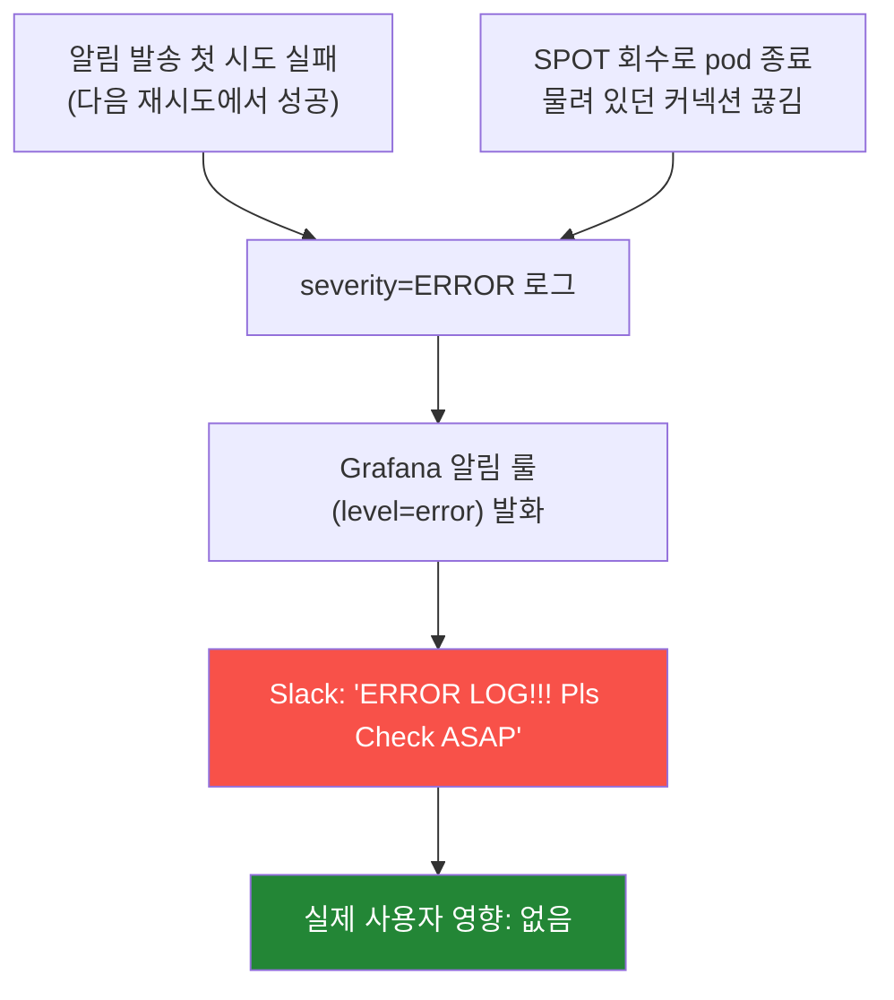
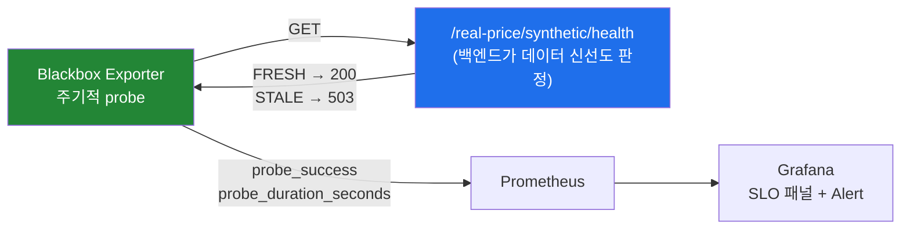

안녕하세요. 프롭테크 플랫폼에서 백엔드 개발자로 근무 중인 정정일입니다.

이번 글은 코드나 특정 기술에 대한 이야기라기보다는, 한동안 제 머릿속을 떠나지 않았던 질문 하나에서 출발했습니다.

**"서비스는 어떻게 사용자의 신뢰를 얻는가?"**

조금 거창하게 들릴 수 있는데, 사실 생각하지 않을 수 없는 현실적인 질문이죠. 저는 사용자가 서비스를 사용하는 이유 중 큰 부분을 차지하는 게 **신뢰**라고 생각합니다. "이 서비스는 내가 필요할 때, 내가 기대한 대로 동작한다"는 믿음이요. 그리고 이 믿음은 쌓기는 더디지만 잃기는 한순간입니다. 한 번 이상하게 멈추거나, 엉뚱한 데이터를 보여주거나, 느려서 답답했던 경험 한 번이면 사용자는 굳이 항의하지 않고 **조용히 떠나게 됩니다. 사용자 이탈이죠.**

[예전에 모니터링 시스템을 구축한 이야기]()에서도 다룬 적이 있지만, 불만족한 사용자의 대다수는 CS로 문의하지 않고 그냥 이탈합니다. 그래서 그때 저는 "장애를 사용자가 알려주지 않아도 우리가 먼저 알아야 한다"고 했고, 그렇게 모니터링 체계를 만든 적이 있죠.

그런데 그 시스템을 1년 가까이 운영하면서, 한 가지를 느끼게 된게 있습니다. **장애를 먼저 아는 것은 신뢰를 지키는 출발점일 뿐, 그 자체로 신뢰를 보장해주지는 않더라**는 점입니다. 그래서 이번 글에서는 "신뢰란 무엇이고, 그것을 어떻게 *느낌,감이 아니라 약속의 형태로* 정의하고 지킬 수 있는가"에 대해, 제가 SRE의 개념들(SLI·SLO·Error Budget·Synthetic Monitoring)을 빌려 고민하고 적용해본 과정을 풀어보려 합니다.

여전히 진행 중인 부분도 있어서, 작은 팀에서 "신뢰성"이라는 막연한 단어를 어떻게 손에 잡히는 것으로 바꿔 나갔는지에 대한 기록에 가깝다고 봐주시면 좋을 것 같습니다.

미리 말씀드리면 저는 SRE를 깊게 공부한 사람은 아닙니다. 아래 내용도 "이게 정석이다"라기보다는, 문제를 만나서 이것저것 찾아보고 우리 상황에 맞게 적용해본 과정에 가까우니 그런 눈으로 봐주시면 감사하겠습니다.

## 알림이 와도 안 믿게 되기 시작했습니다

이 고민이 어디서부터 시작됐는지를 말씀드리면 좋을 것 같습니다.

어느 날 `legacy-service - ERROR LOG!!! Pls Check it ASAP` 슬랙 알림이 짧은 간격으로 계속 울렸습니다. 알림 문구만 보면 명백한 운영 장애였습니다. 그런데 막상 로그를 하나씩 까보면, 정작 사용자가 실패를 겪은 흔적은 없었습니다. 대부분 잠깐 떴다가 알아서 복구되는, 말하자면 일시적인 예외들이었습니다.

예를 들면 알림 발송이 첫 시도에 실패했다가 바로 다음 재시도에서 성공한 경우가 있었습니다. 최종적으로 사용자에게는 알림이 잘 갔는데, 첫 번째 실패가 `ERROR` 로그로 남은 거죠. 또 SPOT 인스턴스가 회수되면서 pod가 종료될 때, 그 순간 물려 있던 커넥션이 끊기며 예외가 나기도 했습니다. 트래픽은 다른 pod가 받아줘서 사용자는 아무 영향이 없었는데, 끊긴 커넥션이 `ERROR`로 남은 겁니다.



하나하나 떼어놓고 보면 다 "그럴 수 있는" 예외였습니다. 재시도로 복구됐거나, pod가 갈리는 와중에 잠깐 났거나 한 거니까요. 문제는 이런 게 쌓이면서 알림이 자주 울리게 됐다는 점입니다. 그러다 보니 팀도 알림이 오더라도 "또 그거겠지" 하면서 넘기게 되는 겁니다. 진짜 장애가 그 사이에 끼어 있어도 넘어가 버리게 되는 경우가 생기게 되는 거죠. 알림의 피로도가 높아지면서, 알림이 와도 안 믿게 되는 상황이 된 겁니다.

그럼 그냥 룰에서 걸러내면 되지 않냐고 할 수 있습니다. 눈에 띄는 패턴 몇 개는 실제로 그렇게 줄이기도 했습니다. 그런데 근본적으로 께름칙한 게 남았습니다. 이 예외들은 레벨로 보면 다 똑같은 `ERROR`라, "무시해도 되는 ERROR"와 "꼭 봐야 하는 ERROR"를 레벨만으로는 가를 수가 없었습니다. 결국 우리가 알림을 걸어둔 기준이 "사용자가 실제로 실패를 겪었는가"가 아니라 "예외 로그가 찍혔는가"였던 겁니다. 따지고 보면 둘은 전혀 다른 얘기였는데 말이죠.

비슷한 시기에 걸리는 게 하나 더 있었습니다. 배포할 때 "지금 배포해도 되나?"를 판단하는 기준이 사람 머릿속에만 있었거든요. 오해는 하지 않으셨으면 좋겠습니다 ㅎㅎ.. 아무 생각 없이 막 배포한 건 아닙니다. breaking change가 들어간 배포인지, 사용자 영향이 큰 변경인지에 따라 나름 신중하게 봤습니다만 그게 명확한 기준이 있는 게 아니라 그때그때 사람이 머리로 따지는 거라, 결국 책임자 한 명이 "이때쯤이 괜찮겠다"라고 판단하는 형태가 되곤 했습니다. 특히 새벽이나 주말처럼 아무도 대시보드를 안 보고 있을 때는 그 판단을 받쳐줄 게 아무것도 없었습니다.

두 경우 다 따지고 보면 비슷한 문제였습니다. "지금 우리 서비스가 괜찮은 건가, 아닌가"를 판단하는 게 전부 사람 머릿속에만 있었지, 어디에도 데이터 기준으로 판단할 근거가 없었던 겁니다.

그래서 신뢰성이라는 걸 사람 감각에만 맡기지 말고 좀 더 분명한 기준으로 다룰 방법이 없을까 싶어서, 이것저것 찾아보기 시작했습니다.

## "신뢰성"을 데이터로 바꿔보기로 했습니다

찾다 보니 SRE에서 쓰는 SLI / SLO / Error Budget이라는 개념이 눈에 들어왔습니다. 처음엔 용어가 좀 거창해 보였는데, 제가 이해한 바로는 대충 이런 것이었습니다.

- **SLI** — 뭘 "성공"으로 볼 것인가. (예: 5xx 없이 응답한 요청의 비율)
- **SLO** — 그 성공을 어느 수준까지 약속할 것인가. (예: 30일간 99.9%)
- **Error Budget** — 약속에서 허용되는 실패의 여유분. (99.9%면 0.1%, 30일에 약 43분)

뜯어보니 결국 제가 하려던 거랑 같은 얘기였습니다. 뭘 성공으로 볼지 정하고(SLI), 그걸 어느 수준까지 지킬지 약속하고(SLO), 그 약속에 여유를 좀 두자(Error Budget)는 것이죠. 막연하던 "신뢰성"을 데이터로 바꿔보자는 겁니다.

정리해 보면 결국 이건 신뢰성을 사용자에게 하는 '약속'으로 바꾸는 일이었습니다. SLO가 "어느 수준까지는 지키겠다"는 목표잖아요. "30일 동안 5xx 없이 99.9%"처럼요. 데이터는 그 약속을 재고 지키기 위한 수단이고, 약속을 지켜야 사용자 신뢰도 쌓이는 거죠.

순서가 중요해 보였습니다. 뭘 성공으로 볼지부터 안 정하면, 앞에서 겪은 false alarm처럼 뭘 알려야 할지도 모르는 채로 알림만 쌓일 테니까요. 그래서 SLI부터 정하고, 그걸 잴 수 있는 토대를 만드는 순서로 가봤습니다.

### 일단 메트릭부터 믿을 만하게

막상 데이터로 보려고 하니 토대부터 문제가 있었습니다. 기존 트래픽 대시보드는 각 서비스의 actuator를 Prometheus가 스크랩하는 방식이었는데, ingress를 통하다 보니 여러 파드 중 랜덤하게 하나만 잡혔고, 파드가 갈릴 때마다 카운터가 점프했거든요. 신뢰성을 재겠다면서 정작 그 근거 데이터를 신뢰할 수 없던 겁니다.

그래서 메트릭을 OTLP push 방식으로 바꿨습니다.

```promql
# Before: actuator 스크랩 (랜덤 1파드 → 카운터 점프)
http_server_requests_seconds_count{job="..."}

# After: OTLP push (각 파드가 service_instance_id 로 직접 push)
http_server_request_duration_seconds_count{
  deployment_environment_name="$env",
  service_name=~"$service"
}
```

각 파드가 직접 메트릭을 보내니 스크랩 편향이 사라졌고, 라벨도 OTel 컨벤션(`http_route`, `http_response_status_code`)에 맞췄습니다. 앞으로 SLI를 다 이 위에서 계산할 거라, 여기부터 정리하고 가는 게 맞겠다 싶었습니다.

### RED 대시보드부터 만들어봤습니다

그런데 막상 "뭘 성공으로 볼지"를 정하려니 어디서부터 봐야 할지 막막했습니다. 그래서 또 찾아봤는데, 요청 기반 서비스는 **RED**(Rate / Errors / Duration)를 많이 본다길래 그것부터 대시보드로 만들어봤습니다.

- **Rate** — 초당 요청 수
- **Errors** — 실패한 요청의 비율
- **Duration** — 응답 지연 분포 (p50 / p95 / p99)

여기서 좀 고민됐던 게 에러율이었습니다. 4xx도 에러에 넣어야 하나 싶었거든요. 그런데 4xx는 대부분 클라이언트 쪽 문제(잘못된 요청, 권한 없음)지 서버가 약속을 어긴 건 아닙니다. 봇이 이상한 URL을 긁고 다니는 것만으로 우리 신뢰성 지표가 깎이면 좀 이상하니까요. 그래서 일단 4xx는 따로 보기만 하고, SLI는 5xx 비율로 잡았습니다.

이게 맞는 정의인지는 솔직히 아직 확신이 없습니다. 429(rate limit)는 어떻게 볼지, 200으로 내려가지만 사실상 실패인 응답은 어떻게 잡을지 같은 건 아직 숙제로 남겨뒀습니다.

### Error Budget이라는 개념이 인상 깊었습니다

RED 위에 Error Budget 패널을 얹었는데, 개인적으로 이 개념이 사고방식을 좀 바꿔줬습니다.

Error가 0이어야 한다고 생각하면, 0이 아닌 순간마다 "비상"이 되는 거죠. 그런데 Error Budget은 그걸 "예산 안에서 쓰는 것"으로 보게 해줬습니다. Error는 존재할 수 있고, 예산 안에서만 쓰면 정상이라고 보는 겁니다. 

가용성을 99.9%로 약속한다는 건 뒤집으면 0.1%까지는 실패해도 약속을 어긴 건 아니라는 뜻입니다. 그렇게 보니 마음가짐이 좀 달라지더라구요. 예산이 남아 있으면 배포하고, 바닥나면 잠깐 멈춰서 신뢰 회복에 집중하면 되니까요.

| 패널 | 의미 |
|------|------|
| 30일 Availability | 30일 롤링 가용성 (%) |
| 30일 잔여 버짓 % | 100% = 손해 없음, 0% = 한계, 음수 = 약속 위반 |
| Burn Rate (1h / 6h) | 예산을 얼마나 빠르게 쓰고 있나 |
| Burn Trend | 예산 소진 추이 |


그런데 여기서 고민해야 할 부분이 있었습니다. SLO를 99.9%로 잡을지 99.99%로 잡을지가 고민이었죠. 숫자로는 한 자리 차이인데 그걸 지키는 비용은 엄청나게 차이 나고, 결국 "사용자한테 어느 수준을 약속할 거냐"는 비즈니스랑 같이 정할 문제지 제가 혼자 정할 게 아니었습니다. 그래서 일단 99.9%를 placeholder로 두고, 실제 값부터 쌓아가면서 나중에 합의하기로 했습니다.

## 그런데 200 OK가 늘 정상은 아니었습니다

SLI랑 Error Budget으로 "요청이 성공했나, 빨랐나"는 볼 수 있게 됐습니다. 그런데 운영하다 보니 이걸로도 안 잡히는 경우가 있었습니다.

그러면서 한 가지 의문이 들었습니다. **API가 200 OK를 내려주면, 그건 정상일까요?** 저는 한동안 그렇다고만 생각하고 있었거든요.

저희는 부동산 플랫폼이라 실거래가 데이터가 핵심인데, 이 데이터는 외부에서 배치로 들어옵니다. 그 배치가 조용히 멈춰서 한 달째 새 거래가 안 들어온다고 해보겠습니다. 그래도 실거래가 조회 API는 200 OK를 잘 내려줍니다. 과거 데이터를 그대로 주니까요. RED 대시보드도 멀쩡합니다. 5xx도 없고 응답도 빠릅니다.

기술적으로는 멀쩡한데 사용자 입장에선 "이 데이터 왜 이렇게 옛날 거야" 싶은 상황인 겁니다. 상태 코드나 응답 시간만 봐서는 안 잡히는 종류의 문제였습니다.

이런 건 어떻게 잡나 찾아봤더니 Synthetic Monitoring이라는 게 있었습니다. 단순히 살아있나 죽었나(uptime)만 보는 게 아니라, 응답 내용이 비즈니스 기준으로 정상인지까지 주기적으로 확인하는 방식이었습니다.

### 검증을 어디서 할지 좀 헤맸습니다

처음엔 CronJob으로 셸이나 k6 스크립트를 돌려서 API를 호출하고, 응답 body를 `jq`로 검증한 다음 결과를 Prometheus Pushgateway로 보내는 걸 생각했습니다.

그런데 만들다 보니 좀 걸렸습니다. "데이터가 신선한가"를 판단하는 기준은 결국 비즈니스 로직인데, 그걸 외부 스크립트에 두면 백엔드 코드랑 따로 놀게 됩니다. 그래서 방향을 바꿨습니다. 백엔드가 직접 자기 데이터 신선도를 판단하는 health 엔드포인트를 하나 열고, Blackbox exporter가 그걸 주기적으로 찔러보게 했습니다.



`/synthetic/health`는 안에서 "이번 달 데이터에 최근 거래가 들어있나" 같은 걸 검사해서 FRESH/STALE을 내려줍니다. Blackbox exporter는 그걸 찔러보면서 `probe_success`(1=정상, 0=stale 또는 down)랑 `probe_duration_seconds`를 Prometheus에 남깁니다. 이렇게 하니 검증 로직은 도메인 코드 안에 있고, 인프라는 그냥 찔러보고 결과만 기록하는 단순한 역할만 하게 됐습니다. 처음 생각했던 것보다 훨씬 깔끔해졌습니다.

그리고 이 `probe_success`로 비즈니스 관점의 SLO 패널도 만들었습니다.

```promql
# 실거래가 데이터 가용성 (30일 롤링)
avg_over_time(probe_success[30d]) * 100
```


이제 `probe_success`가 0으로 떨어지면, RED 대시보드는 멀쩡해도 데이터가 묵었다는 걸 알 수 있게 됐습니다. 다만 지금은 `probe_success=0`이 "다운"이랑 "stale"을 같이 묶고 있어서, 대응이 다른 둘을 `probe_http_status_code`로 나누는 건 다음 숙제로 남겨뒀습니다.

## 배포 판단을 사람 머릿속에만 두지 않기로 했습니다

여기까지 오니 "약속을 정하고 재는" 건 어느 정도 됐습니다. 그런데 글 앞에서 말한 두 번째 문제, "지금 배포해도 되나?"는 여전히 사람 판단에만 기대고 있었습니다. 앞에서 말했듯 breaking change 여부나 사용자 영향도는 보고 결정했지만, 그건 어디까지나 사람이 그때그때 챙기는 것이었습니다.

제 경험상 서비스가 크게 흔들리는 건 대개 새로 뭔가 배포한 직후였습니다. 그래서 약속이 위태로울 땐 배포를 잠깐 멈출 수 있으면 좋겠다 싶었는데, 사람이 챙기는 판단은 새벽에 배포 누르는 사람이 깜빡하거나 상태를 잘못 읽으면 그냥 뚫려버리더라구요.

그래서 이 부분도 사람 판단에만 맡기지 말고, 데이터로 한 번 더 걸러줄 방법이 없을까 찾아봤는데, 선택지가 몇 개 있었습니다.

| 방법 | 장점 | 단점 |
|------|------|------|
| **Pre-deployment Check** | 단순, ArgoCD에 그냥 붙일 수 있음 | Canary처럼 점진 노출은 아님 |
| Argo Rollouts (Canary) | 자동 롤백, 점진 노출 | 도입·운영 부담이 큼 |
| Lockdown Mode | 가장 강력 | 조직적 합의가 필요 |
| 사람이 그때그때 판단 (지금) | 단순, 맥락 반영 잘됨 | 새벽·주말·놓침엔 보호 안 됨 |

Argo Rollouts의 Canary가 제일 좋아 보이긴 했습니다. 트래픽을 조금씩 흘려보다가 지표가 나빠지면 알아서 롤백해준다니까요. 그런데 우리 팀 규모에서 그걸 도입하고 계속 관리할 자신이 솔직히 없었습니다. 그래서 제일 가벼운 **Pre-deployment Check**부터 해보기로 했습니다. 배포 직전에 지표 몇 개를 보고, 너무 안 좋으면 배포를 막는 겁니다.

뭘 볼지는 이렇게 잡았습니다.

| 볼 지표 | 기준(초안) | 윈도우 |
|------|------------|-------|
| 5xx 비율 | < 0.5% | 최근 15분 |
| P95 지연 | < 800ms | 최근 15분 |
| Error Budget 잔량 | > 10% | 30일 |

기준을 알림보다 살짝 느슨하게 잡았는데, 이건 "경고를 울릴 선"이 아니라 "이 정도면 배포해도 되는 선"이기 때문입니다. 너무 빡빡하게 잡으면 멀쩡한 배포까지 막혀서, 결국 다들 우회만 하게 될 것 같았거든요.

붙이는 건 ArgoCD의 PreSync hook으로 했습니다. hook이 실패하면 sync 자체가 안 되니 배포가 자연스럽게 멈춥니다. 대신 진짜 급한 핫픽스를 위해 `[skip-slo-check]` 같은 걸로 우회할 수 있게 하되, 우회하면 알림이 따로 가도록 해뒀습니다. 막을 순 없어도 조용히 넘어가진 않게 한 겁니다.

솔직히 이 게이팅은 아직 제대로 자리 잡은 건 아닙니다. dev에서 돌려보면서 prod로 넓혀가는 중이고, 기준값도 실제 데이터를 보면서 계속 만져야 합니다. 그래도 "신뢰성 상태가 배포를 막을 수 있다"는 장치가 코드로 생겼다는 것 자체가, 사람 판단에만 기대던 때보단 한 걸음 나아간 것 같습니다.

## 그래서 뭐가 달라졌나

이제는 false alarm이 신뢰성 지표를 안 건드리니 자연스럽게 걸러집니다. "ERROR 로그가 떴다"가 아니라 "5xx가 SLO를 깎고 있다"로 기준이 바뀌었거든요. 덕분에 알림이 다시 좀 믿을 만해졌습니다. 

또 "지금 괜찮은 거 맞아?"에 30일 잔여 Error Budget이라는 데이터로 답할 수 있게 됐습니다. 그리고 200 OK 뒤에 숨어 있던 데이터 묵음 문제를 잡을 수 있게 됐습니다.

결국 배포 결정이 조금씩 사람의 판단에서 데이터를 기준으로 점점 넘어오기 시작했습니다.

## 하면서 느낀 것들

**뭘 성공으로 볼지부터 정하는 게 먼저였던 것 같습니다.** false alarm의 진짜 문제는 알림 룰이 엉성한 게 아니라, 애초에 "신뢰가 깨진 상태"를 정의한 적이 없다는 것이었습니다. 정의가 없으니 뭘 알리고 뭘 무시할지 기준도 없었던 겁니다. SLI 한 줄을 정하고 나서야 그걸 가를 수 있었습니다.

**어느 정도의 신뢰를 보장할 것이냐를 정하는 일도 똑같이 중요했습니다.** 처음엔 99.9%냐 99.99%냐를 제가 정하지 못하는 게 답답했는데, 지금 생각하면 당연한 것이었습니다. 그건 "사용자한테 뭘 약속할 거냐"의 문제고, 그 비용을 누가 감당할지의 문제니까요. 엔지니어가 혼자 99.99%를 외쳐봐야 지킬 여력이 없으면 의미가 없으니까요.

**작은 팀이라 다 갖추기보다 제일 급한 것부터 했습니다.** Argo Rollouts 같은 게 자꾸 눈에 밟혔는데, 멋지다고 다 들고 오는 게 능사는 아니었습니다. 우리 규모에서 지금 신뢰를 제일 위협하는 게 뭔지부터 보고, 거기에 제일 가벼운 방법을 붙이는 게 맞았던 것 같습니다.

## 마치며

쭉 적고 보니 여기서 쓴 것들 — SLI, SLO, Error Budget, Synthetic Monitoring, 배포 게이팅 — 은 다 SRE 하는 분들한텐 익숙한 것들일 겁니다. 저는 "신뢰성을 어떻게 지키지"라는 막연한 고민을 들고 이것저것 찾아보다가, 우리 상황에 맞게 하나씩 가져다 붙여본 정도죠.

아직 못 한 것도 많다고 생각합니다. burn rate 기반 multi-window 알림, 전 서비스를 한눈에 보는 SLO Overview, `probe_success`의 stale/down 분리, 매물 검색·채팅 같은 다른 핵심 경로의 synthetic probe, 배포 게이팅 prod 적용, 그리고 언젠가 Argo Rollouts까지. SLO 목표값도 아직 비즈니스적으로 합의가 필요하죠.

그래서 "신뢰성을 다 갖췄다"고는 하지 못할 것 같습니다. 애초에 [성능]()처럼 신뢰성도 한 번 끝내면 되는 게 아니라 계속 지켜야 유지되는 것 같습니다.

혹시 모니터링은 어느 정도 해놨는데 "그래서 우리 서비스 괜찮은 거 맞아?"에 시원하게 답이 안 나오는 분이 계실지도 모르겠습니다. 그렇다면 거창한 도구를 더 들이기 전에, "우리가 사용자한테 뭘 약속하는가"를 한 문장으로 — 그러니까 SLI 한 줄로 — 적어보는 것부터 시작해봐도 좋지 않을까 싶습니다. 저한테는 그게 출발점이었거든요. 

긴 글 읽어주셔서 감사합니다.

## 참고 자료

### 관련 글
- [서비스 장애는 사용자가 알려주지 않아도 알아야한다 — 사내 모니터링 시스템 구축기]()
- [API 성능 P95 7초 → 0.1초 백엔드 성능 최적화 — 느린 곳을 찾는 게 고치는 것보다 어려웠다]()

### SRE / SLO
- [Google SRE Book — Service Level Objectives](https://sre.google/sre-book/service-level-objectives/) — SLI/SLO/Error Budget의 출발점
- [Google SRE Workbook — Alerting on SLOs](https://sre.google/workbook/alerting-on-slos/) — Burn rate 기반 multi-window 알림
- [The RED Method (Tom Wilkie)](https://grafana.com/blog/2018/08/02/the-red-method-how-to-instrument-your-services/) — Rate / Errors / Duration

### 도구
- [Prometheus Blackbox Exporter](https://github.com/prometheus/blackbox_exporter) — 엔드포인트 probe 기반 합성 모니터링
- [Argo CD — Resource Hooks](https://argo-cd.readthedocs.io/en/stable/user-guide/resource_hooks/) — PreSync hook을 이용한 배포 게이팅
- [Argo Rollouts — Analysis & Canary](https://argo-rollouts.readthedocs.io/en/stable/features/analysis/) — 다음 단계 후보로 검토 중인 점진 배포
