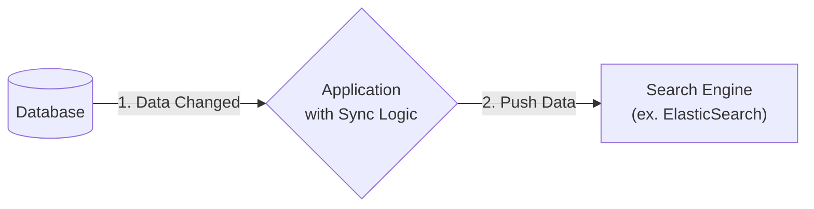
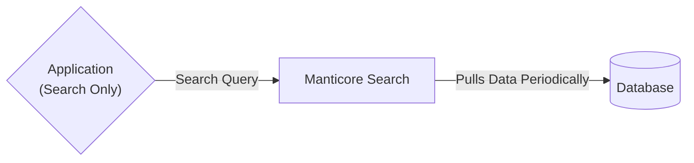

Hello. I'm Jeongil Jeong, working as a backend developer at a PropTech platform.

"We need a search feature." When you hear this, one name probably pops into most developers' heads. That is **Elasticsearch**. Thanks to its powerful features and rich ecosystem, it seems to be considered the industry standard.

However, I don't think Elasticsearch is always the answer. Of course, it might sound obvious, but every technology must be chosen appropriately according to the situation and environment. In that sense, our concern was "Do we really need to set up Kibana and fight with Java heap memory just to add a single search feature?" Especially in a resource-constrained environment, we thought Elasticsearch's high resource requirements and complexity could be a significant burden.

At the end of this deliberation, we discovered an open-source search engine called **Manticore Search**. This post is a record of the process of choosing Manticore Search as our search engine, the realistic concerns and experiences we faced while applying it to a production environment, and our technical choices.

## Manticore Search?

Manticore Search is a high-performance open-source full-text search engine written in C++. However, it was interesting that it wasn't a completely new project.

Its roots lie in **Sphinx Search**, which gained popularity in the early 2000s alongside MySQL for its lightweight and fast performance. In 2016, when development of Sphinx effectively ceased, most of the core team left and forked the project in 2017 to create Manticore Search.

What's interesting is that while Sphinx later turned into closed source, Manticore Search has remained 100% open source and is developing much more actively. ([*Manticore Search: 3 years after forking from Sphinx*](https://manticoresearch.com/blog/manticore-search-3-years-after-forking-from-sphinx/))

## Realistic Reasons Why We Chose Manticore Search

I personally believe that technology selection is always a series of trade-offs. The process by which our team chose Manticore Search was as follows.

### 1. Realistic Constraint: Server Cost Resources

The biggest reason was the **cost** issue. It's one of the most representative reasons that cannot be left out when talking about realistic reasons.

Elasticsearch is Java-based, and for a production environment, at least 8GB RAM and 2vCPU or more are recommended. It was excessive resources for our service scale, and we expected this to lead directly to infrastructure cost burdens.

On the other hand, I read documentation stating that Manticore Search, written in C++, shows amazing efficiency, using only **about 40MB of RSS on an empty instance**. Of course, the recommended specifications would require higher specs than that, but it seemed certain that it consumes fewer resources.

Currently, we are stably operating Manticore Search in a Kubernetes environment with specs around `requests: cpu: 200m, memory: 512Mi`.

The difference between `Cpu: 2vCPU, Memory: 8GB RAM` and `Cpu: 200m, Memory: 512Mi` is a level that cannot be ignored for small teams like startups or small to medium-sized projects.

### 2. Performance: Does Lightness Lead to Speed?

As important as cost was **performance**. According to the latest benchmarks released by Manticore Search, they claim to be **several times to tens of times** faster than Elasticsearch, especially in scenarios like log analysis. ([*Manticore Search vs Elasticsearch*](https://manticoresearch.com/comparison/vs-elasticsearch/))

Of course, I think benchmarks are just results in an ideal environment. And since it was released by Manticore Search, we also have to take into account that the results are bound to be more positive.

However, we expected that Manticore's architecture, written in C++ and using system resources directly without overhead like JVM garbage collection (GC), would provide 'predictable and consistent performance'.

### 3. Developer Productivity: SQL and HTTP

One of the great attractions of Manticore Search was its **native support for SQL**. Being compatible with the MySQL protocol, we could connect directly with existing MySQL clients and write search queries in familiar SQL.

```sql
-- You can use SQL like this instead of Elasticsearch's JSON DSL.
SELECT * FROM poi WHERE MATCH('Gangnam Station');
```


In addition, it basically supports the **HTTP JSON API**, which is essential for modern web service architectures.

```bash
# Example of HTTP API search request using curl
curl -X POST 'http://127.0.0.1:9308/search' -H 'Content-Type: application/json' -d '{
    "index": "poi",
    "query": {
        "match": { "name": "Gangnam Station" }
    }
}'
```


## Comparison with Other Search Engines: Why Manticore?

Besides Elasticsearch, we also reviewed other lightweight search engines like **Meilisearch** and **Typesense**.

| Item | Manticore Search | Meilisearch | Typesense | Elasticsearch |
| :--- | :--- | :--- | :--- | :--- |
| **Language** | C++ | Rust | C++ | Java |
| **Data Sync** | **Pull** (DB → Search Engine) | **Push** (App → Search Engine) | **Push** (App → Search Engine) | **Push** (App/Logstash → Search Engine) |
| **Pros** | Native SQL, Low Resources | Easy usability, Fast development | Fast search speed (In-Memory) | Rich ecosystem, Analytics features |
| **Cons** | Small ecosystem, Domestic awareness | Limitations in large-scale data processing | Data size limited by RAM | High resources, Complexity |

I understand that Elasticsearch, Meilisearch, and Typesense are all optimized for the **Push** method where the application calls the API to push data.

On the other hand, Manticore's `Plain` index, which we used, was more specialized for the **Pull** method where the `indexer` periodically fetches data from the DB and regenerates the index.

Our requirement was **'when specific tables in the operational DB change, it should be periodically reflected in the search engine'**. In this case, to use the Push model, separate synchronization logic that detects DB changes and calls the API must be implemented in the application. (As covered in the epilogue, we implemented this logic with Spring Batch while migrating to Elasticsearch.)

On the other hand, we judged that Manticore's Pull model was more suitable for us because it delegates this process to the search engine, keeping the application logic simple.

Below is a diagram showing the difference between the two data synchronization methods.

#### Push Model
> In the `Push` model, the responsibility for data synchronization lies with the **application**. The application must detect DB changes and call the search engine's API to push data.
> For example, it can be implemented with a service like Spring Batch.



#### Pull Model
> In the `Pull` model, the responsibility for data synchronization lies with the **search engine**. The application only handles search requests, and Manticore Search's `Indexer` periodically fetches (Pulls) data from the DB to keep the index up to date.



## Practical Deployment and Indexing Automation

Now I would like to share two methods of deploying Manticore Search in a real production environment and automating indexing: using **Docker Compose** and **Kubernetes**.

### Method 1: Configuring Development Environment with Docker Compose

When deploying a local development environment or a single server, using Docker Compose is very convenient. This is a simplified example of the configuration we actually used.

#### 1. `docker-compose.yml`

```yaml {filename="docker-compose.yml"}
version: '3.8'

services:
  manticore:
    build:
      context: .
      dockerfile: Dockerfile.manticore
    container_name: manticore
    restart: unless-stopped
    ports:
      - "9306:9306" # MySQL protocol
      - "9308:9308" # HTTP API
    volumes:
      # Ensure persistence by sharing data, config, and logs with host
      - ./manticore-data:/var/lib/manticore
      - ./manticore.conf:/etc/manticoresearch/manticore.conf
      - ./manticore-logs:/var/log/manticore
    # Increase file descriptor limit to prevent performance issues in large-scale search environments
    ulimits:
      nofile:
        soft: 65536
        hard: 65536
```

```conf {filename="manticore.conf"}
# 1. searchd daemon basic settings
searchd {
    listen              = 9306:mysql41 # MySQL protocol
    listen              = 9308:http    # HTTP API port
    pid_file            = /var/run/manticore/searchd.pid
    log                 = /var/log/manticore/searchd.log
    query_log           = /var/log/manticore/query.log
}

# 2. Data Source settings example
source poi_src
{
    type            = mysql
    sql_host        = YOUR_DB_HOST
    sql_user        = YOUR_DB_USER
    sql_pass        = YOUR_DB_PASSWORD
    sql_db          = YOUR_DB_NAME
    sql_query       = \
        SELECT station_id AS id, station_name, line_name \
        FROM station_table_example
    sql_attr_string = line_name
}

# 3. Index settings example
index poi {
    source          = poi_src
    path            = /var/lib/manticore/poi
    # --- Key settings for Korean search ---
    charset_table   = 0..9, A..Z->a..z, a..z
    infix_fields    = station_name
    min_infix_len   = 2
    ngram_len       = 2
    ngram_chars     = U+AC00..U+D7AF, U+1100..U+11FF, U+3130..U+318F
}
```

#### 2. `Dockerfile.manticore` & `start.sh`

Automate indexing by setting up `cron` within the Manticore container.

```dockerfile {filename="Dockerfile"}
# Dockerfile.manticore
FROM manticoresearch/manticore:latest

# Install cron and create log file
RUN apt-get update && apt-get install -y cron && \
    touch /var/log/manticore/cron.log

# Set up cron job (renew index every hour)
RUN echo "0 * * * * indexer poi --config /etc/manticoresearch/manticore.conf --rotate >> /var/log/manticore/cron.log 2>&1 && mysql -h 127.0.0.1 -P9306 -e \"RELOAD INDEXES;\" >> /var/log/manticore/cron.log 2>&1" > /etc/cron.d/manticore-indexer
RUN chmod 0644 /etc/cron.d/manticore-indexer
RUN crontab /etc/cron.d/manticore-indexer

# Copy start script and grant permissions
COPY start.sh /start.sh
RUN chmod +x /start.sh

CMD ["/start.sh"]
```

```bash {filename="start.sh"}
# start.sh
#!/bin/bash
set -e

# Start cron service
service cron start

# Run Manticore in foreground
exec searchd --nodetach
```

I thought this method had the advantage of managing all infrastructure settings as code (IaC) and easily building the same development environment with a single `docker-compose up` command.

---

### Method 2: Deploying to Production Environment with Kubernetes

This is our actual production environment configuration method. We assigned the responsibility of indexing automation to the **Manticore container itself**, not the Kubernetes `CronJob` resource. This was to make management easier by unifying all responsibilities related to deployment into a single `Deployment`.

#### 1. `manticore.conf` (ConfigMap Example)

Configured simply with **one source and one index** to fit the blog example.

```yaml {filename="configmap.yaml"}
apiVersion: v1
kind: ConfigMap
metadata:
  name: manticore-search-config
data:
  manticore.conf: |
    # 1. searchd daemon basic settings
    searchd {
        listen              = 9306:mysql41 # MySQL protocol
        listen              = 9308:http    # HTTP API port
        pid_file            = /var/run/manticore/searchd.pid
        log                 = /var/log/manticore/searchd.log
        query_log           = /var/log/manticore/query.log
    }

    # 2. Data Source settings example
    source poi_src
    {
        type            = mysql
        sql_host        = YOUR_DB_HOST
        sql_user        = YOUR_DB_USER
        sql_pass        = YOUR_DB_PASSWORD
        sql_db          = YOUR_DB_NAME
        sql_query       = \
            SELECT station_id AS id, station_name, line_name \
            FROM station_table_example
        sql_attr_string = line_name
    }

    # 3. Index settings example
    index poi {
        source          = poi_src
        path            = /var/lib/manticore/poi
        # --- Key settings for Korean search ---
        charset_table   = 0..9, A..Z->a..z, a..z
        infix_fields    = station_name
        min_infix_len   = 2
        ngram_len       = 2
        ngram_chars     = U+AC00..U+D7AF, U+1100..U+11FF, U+3130..U+318F
    }
```

#### 2. `Dockerfile` and `start.sh`

Even in the Kubernetes environment, use `Dockerfile` and `start.sh` similar to the Docker Compose method to build an image so that the container handles indexing scheduling itself. Added **initial indexing logic** to `start.sh`.

```dockerfile {filename="Dockerfile"}
# Dockerfile
FROM manticoresearch/manticore:latest

# Install cron, flock (util-linux)
RUN apt-get update && apt-get install -y cron util-linux

# Set up cron job (include logs and prevent duplicate execution)
RUN echo "0 * * * * /usr/bin/flock -n /var/run/manticore-indexer.lock /bin/bash -c '...' " > /etc/cron.d/manticore-indexer

COPY start.sh /start.sh
RUN chmod +x /start.sh

CMD ["/start.sh"]
```

```bash {filename="start.sh"}
# start.sh (Improved version)
#!/bin/bash
set -e

service cron start

# Run initial indexing if index file does not exist when Pod is first created (Solve Cold Start problem)
if [ ! -f /var/lib/manticore/poi.sph ]; then
    echo "No existing index found. Running initial indexing..."
    indexer poi --config /etc/manticoresearch/manticore.conf
fi

exec searchd --nodetach
```

#### 3. `Deployment.yaml`

```yaml {filename="deployment.yaml"}
apiVersion: apps/v1
kind: Deployment
metadata:
  name: manticore-search-prod
spec:
  replicas: 2
  template:
    spec:
      # Grant volume ownership to Manticore process (uid 999) before container starts
      initContainers:
        - name: init-permissions
          image: busybox:1.36
          command: ["sh", "-c", "chown -R 999:999 /var/lib/manticore"]
          volumeMounts:
            - name: manticore-data
              mountPath: /var/lib/manticore
      containers:
        - name: manticore-search
          image: YOUR_CUSTOM_MANTICORE_IMAGE:TAG
          ports:
            - containerPort: 9306
            - containerPort: 9308
          volumeMounts:
            - name: manticore-data
              mountPath: /var/lib/manticore
            - name: manticore-search-config
              mountPath: /etc/manticoresearch/manticore.conf
              subPath: manticore.conf
          resources:
            requests:
              cpu: 200m
              memory: 512Mi
            limits:
              cpu: 500m
              memory: 1Gi
          # Liveness: Restart if container does not respond
          livenessProbe:
            tcpSocket: { port: 9306 }
            initialDelaySeconds: 30
          # Readiness: Do not receive service traffic until probe succeeds
          readinessProbe:
            tcpSocket: { port: 9306 }
            initialDelaySeconds: 10
```

## Korean Search, Record of Trials

In the process of Korean tokenization, we agonized over the `ngram_len` value. Although `ngram_len=1` was often recommended in the official documentation, when analyzing the characteristics of our dataset and major search terms, we judged that two-character searches like 'Gangnam' and 'Seocho' were more natural and accurate. So we finally decided on **`ngram_len=2`** (cutting by 2 characters).

I think it is important to analyze actual data and user search patterns to find settings that fit our service, rather than following a set answer.

## Problems We Faced

1.  **Slow Initial Indexing Speed**: The cause was the **performance issue of the Source DB `sql_query`**. We solved it by tuning the query and adding indexes.
2.  **Absence of Kibana**: We are considering linking Grafana, etc., but haven't found a satisfactory visualization/monitoring solution yet.
3.  **Mixed Korean+English/Number Search**: Solved by including English and numbers in `charset_table`.

## Pros and Cons of Manticore Search That I Felt

### Pros

-   **Lightweight Resource Usage**: It was possible to operate sufficiently with little memory and CPU.
-   **Pull Indexing Model**: It was very convenient to configure in that indexing automation is possible without building a separate system.
-   **Fast Search Performance**: We experienced satisfactory search speed not only in benchmark results but also in actual operating environments.
-   **Korean Search Support**: With the help of the official documentation, we were able to apply Korean tokenization settings relatively easily.

### Cons

-   **Small Ecosystem**: Compared to Elasticsearch, there are fewer communities and resources, so I felt that problem solving took longer.
-   **Limited Advanced Features**: I felt that support for complex analysis functions or embedding search was lacking. Of course, there are existing functions, but references are few, so we had to take risks. (As I will cover in the epilogue, we eventually moved to Elasticsearch to build a RAG system.)
-   **Lack of Monitoring Tools**: There was no visualization tool like Kibana, so there was difficulty in log analysis and monitoring.

## Conclusion: Journey to Choose the Right Tool for the Problem

I think our team found a relatively excellent alternative called Manticore Search, starting from the realistic problems of cost and complexity.

If you don't need all the features Elasticsearch provides, I think Manticore Search can be a way to implement excellent search features with much less cost and effort.

Since there are not many references related to Manticore Search in Korea, I hope this article will be of some help to those considering its introduction. If you have any questions or incorrect information, please feel free to leave a comment!

## Epilogue: Into the Arms of Elasticsearch

Since writing this article, there has been another change in our team's technology stack. We eventually chose Elasticsearch. Although we were satisfied using Manticore Search, technical requirements changed in the process of **building a new RAG (Retrieval-Augmented Generation) system**.

In terms of embedding vector search, the core of the RAG system, and future scalability, we judged that the rich features and ecosystem provided by Elasticsearch were more advantageous.

However, if your goal is still only **'light and fast search'** and you are looking for a tool that supports `Pull` based indexing, I think Manticore Search can be an excellent choice.

Elasticsearch seems to be a better tool for our new requirement, 'complex and diverse search support (ex. embedding-based similarity search and multiple parameter search)'. (In this process, indexing was implemented through Spring Batch as mentioned above.)

I will cover the experience of moving from Manticore Search to Elasticsearch and the story of building the RAG system in detail in another article next time.

## Reference

-   [Manticore Search Official Site](https://manticoresearch.com/)
-   [Manticore Search GitHub](https://github.com/manticoresoftware/manticoresearch)
-   [Manticore Search vs Elasticsearch Comparison](https://manticoresearch.com/comparison/vs-elasticsearch/)
-   [Manticore Search Manual - NLP and tokenization](https://manual.manticoresearch.com/Creating_a_table/NLP_and_tokenization/Data_tokenization)
-   [db-benchmarks.com - Independent Database Benchmarks](https://db-benchmarks.com)
