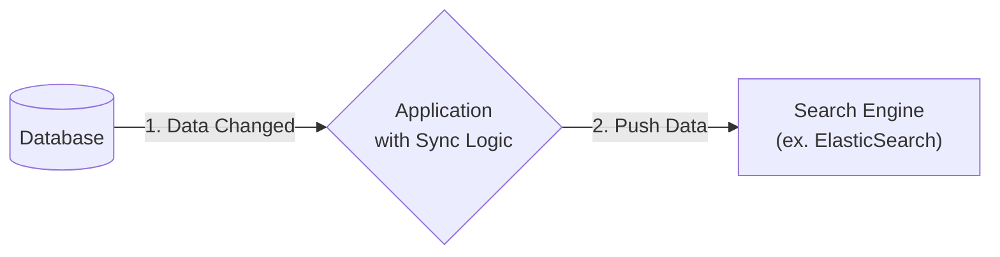
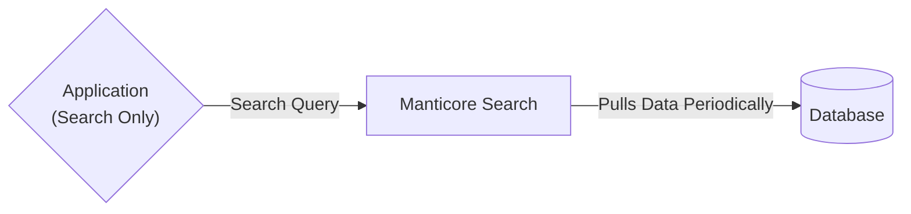

안녕하세요. 프롭테크 플랫폼에서 백엔드 개발자로 일하고 있는 정정일입니다.

"검색 기능이 필요해요." 이 말을 들었을 때, 많은 개발자 분들의 머릿속에는 아마 하나의 이름이 떠오르셨을 것 같습니다. 바로 **Elasticsearch**입니다. 막강한 기능과 풍부한 생태계 덕분에 업계 표준처럼 여겨지기도 하는 것 같습니다.

하지만 Elasticsearch가 항상 정답은 아니라고 생각합니다. 물론 너무 당연한 말이라 느끼실 수 있지만 모든 기술은 상황과 환경에 따라 적절히 선택해야하죠. 그런점에서 저희의 고민은 "검색 기능 하나 추가하자고 Kibana까지 설정하고, Java 힙 메모리와 사투를 벌여야 할까?" 였습니다. 특히 리소스가 제한적인 환경이라면 Elasticsearch의 높은 리소스 요구량과 복잡성은 상당한 부담이 될 수 있다고 생각했습니다.

저희는 이 고민의 끝에서 **Manticore Search**라는 검색엔진 오픈소스를 발견했습니다. 이 글은 검색엔진으로 Manticore Search를 선택하고, 실제 프로덕션 환경에 적용하며 겪었던 현실적인 고민과 경험, 그리고 기술적인 선택의 과정을 담은 기록입니다.

## Manticore Search?

Manticore Search는 C++로 작성된 고성능 오픈소스 전문 검색(Full-text Search) 엔진입니다. 하지만 완전히 새로운 프로젝트는 아니라는 점이 흥미로웠습니다.

그 뿌리는 2000년대 초반, MySQL과 함께 가볍고 빠른 성능으로 인기를 끌었던 **Sphinx Search**에 있었습니다. 2016년, Sphinx의 개발이 사실상 중단되자 핵심 개발팀 대부분이 나와 2017년에 프로젝트를 Fork 하여 Manticore Search를 탄생시켰습니다.

흥미로운 점은 그 후 Sphinx가 클로즈드 소스로 전환된 반면, Manticore Search는 100% 오픈소스를 유지하며 훨씬 더 활발하게 발전하고 있다는 점이었습니다. ([*Manticore Search: 3 years after forking from Sphinx*](https://manticoresearch.com/blog/manticore-search-3-years-after-forking-from-sphinx/))

## 저희가 Manticore Search를 선택한 현실적인 이유

저는 개인적으로 기술 선택은 언제나 트레이드오프의 연속이라고 생각합니다. 저희 팀이 Manticore Search를 선택하기까지의 과정은 다음과 같았습니다.

### 1. 현실적인 제약: 서버 비용 리소스

가장 큰 이유는 **비용** 문제였습니다. 현실적인 이유 하면 빠질 수 없는 가장 대표적인 이유중 하나죠.

Elasticsearch는 Java 기반으로, 운영 환경에서는 최소 8GB RAM, 2vCPU 이상이 권장됩니다. 저희 서비스 규모에 비해 과한 리소스였고, 이는 곧바로 인프라 비용 부담으로 이어질거라 예상되었습니다.

반면 C++로 작성된 Manticore Search는 **빈 인스턴스 기준 약 40MB의 RSS**만 사용하는 놀라운 효율성을 보여준다는 문서를 읽었습니다. 물론 권장사양은 그보다 더 높은 사양을 요구하겠지만 리소스를 덜 잡아먹는 다는 점은 확실해 보였습니다.

현재 저희는 쿠버네티스 환경에서 `requests: cpu: 200m, memory: 512Mi` 정도의 스펙으로 Manticore-search를 안정적으로 운영하고 있습니다. 

`Cpu: 2vCPU, Memory: 8GB RAM`, `Cpu: 200m, Memory: 512Mi` 이 차이는 스타트업이나 중소규모 프로젝트처럼 소규모의 팀에게는 무시할 수 없는 수준이라고 생각합니다.

### 2. 성능: 가벼움이 곧 빠름으로 이어질까?

비용만큼이나 중요했던 것은 **성능**이었습니다. Manticore Search 측에서 공개한 최신 벤치마크에 따르면, 특히 로그 분석 같은 시나리오에서 Elasticsearch보다 **수 배에서 수십 배** 빠르다고 주장하고 있습니다. ([*Manticore Search vs Elasticsearch*](https://manticoresearch.com/comparison/vs-elasticsearch/))

물론 벤치마크는 이상적인 환경에서의 결과일 뿐이라고 생각합니다. 그리고 아무래도 Manticore Search측에서 공개한 만큼 보다 긍정적인 결과가 나올 수밖에 없다는 점도 감안해야 한다고 생각합니다.

하지만 저희는 C++로 작성되어 JVM의 가비지 컬렉션(GC) 같은 오버헤드 없이 시스템 리소스를 직접적으로 사용하는 Manticore의 아키텍처가 '예측 가능하고 꾸준한 성능'을 제공해줄 것이라 기대했습니다.

### 3. 개발 생산성: SQL과 HTTP

Manticore Search의 큰 매력 중 하나는 **SQL을 네이티브로 지원**한다는 점이었습니다. MySQL 프로토콜과 호환되어 기존에 사용하던 MySQL 클라이언트로 바로 접속하고, 익숙한 SQL로 검색 쿼리를 작성할 수 있었습니다.

```sql
-- Elasticsearch의 JSON DSL 대신 이런 SQL을 사용할 수 있습니다.
SELECT * FROM poi WHERE MATCH('강남역');
```


뿐만 아니라, 현대적인 웹 서비스 아키텍처에 필수적인 **HTTP JSON API**도 기본적으로 지원합니다.

```bash
# curl을 이용한 HTTP API 검색 요청 예시
curl -X POST 'http://127.0.0.1:9308/search' -H 'Content-Type: application/json' -d '{
    "index": "poi",
    "query": {
        "match": { "name": "강남역" }
    }
}'
```


## 다른 검색 엔진과의 비교: 왜 Manticore였나?

Elasticsearch 외에도 저희는 **Meilisearch**, **Typesense** 같은 다른 경량 검색 엔진들도 함께 검토했습니다.

| 항목 | Manticore Search | Meilisearch | Typesense | Elasticsearch |
| :--- | :--- | :--- | :--- | :--- |
| **개발 언어** | C++ | Rust | C++ | Java |
| **데이터 동기화** | **Pull** (DB → 검색엔진) | **Push** (App → 검색엔진) | **Push** (App → 검색엔진) | **Push** (App/Logstash → 검색엔진) |
| **장점** | SQL 네이티브, 낮은 리소스 | 쉬운 사용성, 빠른 개발 | 빠른 검색 속도(In-Memory) | 풍부한 생태계, 분석 기능 |
| **단점** | 작은 생태계, 국내 인지도 | 대규모 데이터 처리 한계 | 데이터 크기가 RAM에 제한 | 높은 리소스, 복잡성 |

Elasticsearch, Meilisearch, Typesense는 모두 어플리케이션에서 API를 호출하여 데이터를 **Push**하는 방식에 최적화되어 있다고 알고있습니다. 

반면, 저희가 사용한 Manticore의 `Plain` 인덱스는 `indexer`가 주기적으로 DB에서 데이터를 **Pull**하여 인덱스를 재생성하는 방식에 더 특화되어 있었습니다. 

저희의 요구사항은 **'운영 DB의 특정 테이블들이 변경되면, 검색 엔진에도 주기적으로 반영되는'** 것이었습니다. 이 경우 Push 모델을 사용하려면 DB 변경을 감지하고 API를 호출하는 별도의 동기화 로직을 어플리케이션에 구현해야 합니다. ( 에필로그에서 다루지만 Elasticsearch로 마이그레이션 하면서 Spring Batch로 이 로직을 구현했습니다. )

반면 Manticore의 Pull 모델은 이 과정을 검색 엔진의 책임으로 위임하여 어플리케이션 로직을 단순하게 유지할 수 있다는 점에서 저희에게 더 적합하다고 판단했습니다.

아래는 두 데이터 동기화 방식의 차이를 다이어그램으로 나타낸 것입니다.

#### Push Model
> `Push` 모델에서는 데이터 동기화의 책임이 **어플리케이션**에 있습니다. 어플리케이션이 DB 변경을 감지하고, 검색 엔진의 API를 호출하여 데이터를 밀어넣어줘야 합니다.
> 예를 들면 Spring Batch 와 같은 서비스로 구현할 수 있겠죠.



#### Pull Model
> `Pull` 모델에서는 데이터 동기화의 책임이 **검색 엔진**에 있습니다. 어플리케이션은 검색 요청만 담당하고, Manticore Search의 `Indexer`가 주기적으로 DB에서 데이터를 가져와(Pull) 인덱스를 최신 상태로 유지합니다.



## 실전 배포 및 인덱싱 자동화

이제 실제 운영 환경에서 Manticore Search를 어떻게 배포하고 인덱싱을 자동화했는지, **Docker Compose**를 사용한 방법과 **Kubernetes**를 사용한 두 가지 방법을 공유하려 합니다.

### 방법 1: Docker Compose로 개발 환경 구성하기

로컬 개발 환경이나 단일 서버 배포 시에는 Docker Compose를 사용하는 것이 매우 간편합니다. 저희가 실제 사용했던 구성을 단순화한 예시입니다.

#### 1. `docker-compose.yml`

```yaml {filename="docker-compose.yml"}
version: '3.8'

services:
  manticore:
    build:
      context: .
      dockerfile: Dockerfile.manticore
    container_name: manticore
    restart: unless-stopped
    ports:
      - "9306:9306" # MySQL protocol
      - "9308:9308" # HTTP API
    volumes:
      # 데이터, 설정, 로그를 호스트와 공유하여 영속성 확보
      - ./manticore-data:/var/lib/manticore
      - ./manticore.conf:/etc/manticoresearch/manticore.conf
      - ./manticore-logs:/var/log/manticore
    # 대규모 검색 환경에서 파일 디스크립터 한계를 늘려 성능 문제 방지
    ulimits:
      nofile:
        soft: 65536
        hard: 65536
```

```conf {filename="manticore.conf"}
# 1. searchd 데몬 기본 설정
searchd {
    listen              = 9306:mysql41 # MySQL 프로토콜
    listen              = 9308:http    # HTTP API 포트
    pid_file            = /var/run/manticore/searchd.pid
    log                 = /var/log/manticore/searchd.log
    query_log           = /var/log/manticore/query.log
}

# 2. 데이터 소스(Source) 설정 예시
source poi_src
{
    type            = mysql
    sql_host        = YOUR_DB_HOST
    sql_user        = YOUR_DB_USER
    sql_pass        = YOUR_DB_PASSWORD
    sql_db          = YOUR_DB_NAME
    sql_query       = \
        SELECT station_id AS id, station_name, line_name \
        FROM station_table_example
    sql_attr_string = line_name
}

# 3. 인덱스(Index) 설정 예시
index poi {
    source          = poi_src
    path            = /var/lib/manticore/poi
    # --- 한글 검색을 위한 핵심 설정 ---
    charset_table   = 0..9, A..Z->a..z, a..z
    infix_fields    = station_name
    min_infix_len   = 2
    ngram_len       = 2
    ngram_chars     = U+AC00..U+D7AF, U+1100..U+11FF, U+3130..U+318F
}
```

#### 2. `Dockerfile.manticore` & `start.sh`

Manticore 컨테이너 내에서 `cron`을 설정하여 인덱싱을 자동화합니다.

```dockerfile {filename="Dockerfile"}
# Dockerfile.manticore
FROM manticoresearch/manticore:latest

# cron 설치 및 로그 파일 생성
RUN apt-get update && apt-get install -y cron && \
    touch /var/log/manticore/cron.log

# cron 작업 설정 (매시간 인덱스 갱신)
RUN echo "0 * * * * indexer poi --config /etc/manticoresearch/manticore.conf --rotate >> /var/log/manticore/cron.log 2>&1 && mysql -h 127.0.0.1 -P9306 -e \"RELOAD INDEXES;\" >> /var/log/manticore/cron.log 2>&1" > /etc/cron.d/manticore-indexer
RUN chmod 0644 /etc/cron.d/manticore-indexer
RUN crontab /etc/cron.d/manticore-indexer

# 시작 스크립트 복사 및 권한 부여
COPY start.sh /start.sh
RUN chmod +x /start.sh

CMD ["/start.sh"]
```

```bash {filename="start.sh"}
# start.sh
#!/bin/bash
set -e

# cron 서비스 시작
service cron start

# Manticore를 포어그라운드로 실행
exec searchd --nodetach
```

이 방식은 모든 인프라 설정을 코드(IaC)로 관리하고, `docker-compose up` 명령어 하나로 동일한 개발 환경을 쉽게 구축할 수 있다는 장점이 있다고 생각했습니다.

---

### 방법 2: Kubernetes로 프로덕션 환경 배포하기

저희의 실제 프로덕션 환경 구성 방식입니다. 인덱싱 자동화의 책임을 Kubernetes의 `CronJob` 리소스가 아닌 **Manticore 컨테이너 자체**에 부여했습니다. 배포와 관련된 모든 책임을 하나의 `Deployment`로 통일하여 관리를 더 쉽게 하기 위함이었습니다.

#### 1. `manticore.conf` (ConfigMap 예시)

블로그 예시에 맞게 **하나의 소스와 하나의 인덱스**로 간결하게 구성했습니다.

```yaml {filename="configmap.yaml"}
apiVersion: v1
kind: ConfigMap
metadata:
  name: manticore-search-config
data:
  manticore.conf: |
    # 1. searchd 데몬 기본 설정
    searchd {
        listen              = 9306:mysql41 # MySQL 프로토콜
        listen              = 9308:http    # HTTP API 포트
        pid_file            = /var/run/manticore/searchd.pid
        log                 = /var/log/manticore/searchd.log
        query_log           = /var/log/manticore/query.log
    }

    # 2. 데이터 소스(Source) 설정 예시
    source poi_src
    {
        type            = mysql
        sql_host        = YOUR_DB_HOST
        sql_user        = YOUR_DB_USER
        sql_pass        = YOUR_DB_PASSWORD
        sql_db          = YOUR_DB_NAME
        sql_query       = \
            SELECT station_id AS id, station_name, line_name \
            FROM station_table_example
        sql_attr_string = line_name
    }

    # 3. 인덱스(Index) 설정 예시
    index poi {
        source          = poi_src
        path            = /var/lib/manticore/poi
        # --- 한글 검색을 위한 핵심 설정 ---
        charset_table   = 0..9, A..Z->a..z, a..z
        infix_fields    = station_name
        min_infix_len   = 2
        ngram_len       = 2
        ngram_chars     = U+AC00..U+D7AF, U+1100..U+11FF, U+3130..U+318F
    }
```

#### 2. `Dockerfile` 과 `start.sh`

Kubernetes 환경에서도 Docker Compose 방식과 유사한 `Dockerfile`과 `start.sh`를 사용하여, 컨테이너가 자체적으로 인덱싱 스케줄링을 담당하도록 이미지를 빌드합니다. `start.sh`에 **초기 인덱싱 로직**을 추가해줬습니다.

```dockerfile {filename="Dockerfile"}
# Dockerfile
FROM manticoresearch/manticore:latest

# cron, flock(util-linux) 설치
RUN apt-get update && apt-get install -y cron util-linux

# cron 작업 설정 (로그 포함 및 중복 실행 방지)
RUN echo "0 * * * * /usr/bin/flock -n /var/run/manticore-indexer.lock /bin/bash -c '...' " > /etc/cron.d/manticore-indexer

COPY start.sh /start.sh
RUN chmod +x /start.sh

CMD ["/start.sh"]
```

```bash {filename="start.sh"}
# start.sh (개선된 버전)
#!/bin/bash
set -e

service cron start

# Pod가 처음 생성될 때 인덱스 파일이 없다면 초기 인덱싱 실행 (Cold Start 문제 해결)
if [ ! -f /var/lib/manticore/poi.sph ]; then
    echo "No existing index found. Running initial indexing..."
    indexer poi --config /etc/manticoresearch/manticore.conf
fi

exec searchd --nodetach
```

#### 3. `Deployment.yaml`

```yaml {filename="deployment.yaml"}
apiVersion: apps/v1
kind: Deployment
metadata:
  name: manticore-search-prod
spec:
  replicas: 2
  template:
    spec:
      # 컨테이너 시작 전, 볼륨의 소유권을 Manticore 프로세스(uid 999)에 부여
      initContainers:
        - name: init-permissions
          image: busybox:1.36
          command: ["sh", "-c", "chown -R 999:999 /var/lib/manticore"]
          volumeMounts:
            - name: manticore-data
              mountPath: /var/lib/manticore
      containers:
        - name: manticore-search
          image: YOUR_CUSTOM_MANTICORE_IMAGE:TAG
          ports:
            - containerPort: 9306
            - containerPort: 9308
          volumeMounts:
            - name: manticore-data
              mountPath: /var/lib/manticore
            - name: manticore-search-config
              mountPath: /etc/manticoresearch/manticore.conf
              subPath: manticore.conf
          resources:
            requests:
              cpu: 200m
              memory: 512Mi
            limits:
              cpu: 500m
              memory: 1Gi
          # Liveness: 컨테이너가 응답하지 않으면 재시작
          livenessProbe:
            tcpSocket: { port: 9306 }
            initialDelaySeconds: 30
          # Readiness: 프로브 성공 전까지 서비스 트래픽을 받지 않음
          readinessProbe:
            tcpSocket: { port: 9306 }
            initialDelaySeconds: 10
```

## 한글 검색, 삽질의 기록

한글 토큰화 과정에서 저희는 `ngram_len` 값을 두고 고민했습니다. 공식 문서에서는 `ngram_len=1`을 권장하는 경우가 많았지만, 저희 데이터셋의 특성과 주요 검색어들을 분석했을 때, '강남', '서초' 처럼 두 글자 단위의 검색이 더 자연스럽고 정확도가 높다고 판단했습니다. 그래서 최종적으로 **`ngram_len=2`** (2글자씩 자르기)로 결정했습니다.

정해진 답을 따르기보다는, 실제 데이터와 유저의 검색 패턴을 분석하여 우리 서비스에 맞는 설정을 찾아가는 과정이 중요하다고 생각합니다.

## 우리가 겪었던 문제들

1.  **초기 인덱싱 속도 저하**: 원인은 **Source DB의 `sql_query` 성능 문제**였습니다. 쿼리를 튜닝하고 인덱스를 추가하여 해결했습니다.
2.  **Kibana의 부재**: Grafana 연동 등을 고려하고 있지만, 아직 만족스러운 시각화/모니터링 해결책을 찾지는 못했습니다.
3.  **한글+영문/숫자 혼용 검색**: `charset_table`에 영문과 숫자를 포함시켜 해결했습니다.

## 제가 느낀 Manticore Search의 장단점

### 장점

- **가벼운 리소스 사용량**: 적은 메모리와 CPU로도 충분히 운영이 가능했습니다.
- **Pull 인덱싱 모델**: 별도 시스템을 구축할 필요 없이 인덱싱 자동화가 가능하다는 점에서 구성하기 매우 편리했습니다.
- **빠른 검색 성능**: 벤치마크 결과뿐만 아니라 실제 운영 환경에서도 만족스러운 검색 속도를 경험했습니다.
- **한글 검색 지원**: 공식 문서의 도움으로 한글 토큰화 설정을 비교적 쉽게 적용할 수 있었습니다.

### 단점

- **작은 생태계**: Elasticsearch에 비해 커뮤니티와 자료가 적어, 문제 해결에 시간이 더 걸리는 경우가 있다고 느껴졌습니다.
- **제한된 고급 기능**: 복잡한 분석 기능이나 임베딩 검색 등에 대한 지원이 부족하다고 느껴졌습니다. 물론 있는 기능들도 있지만 레퍼런스가 적어 리스크를 감수해야 했습니다. (에필로그에서 다루겠지만, 결국 저희는 RAG 시스템 구축을 위해 Elasticsearch로 이전하게 되었습니다.)
- **모니터링 도구 부족**: Kibana와 같은 시각화 도구가 없어, 로그 분석과 모니터링에 어려움이 있었습니다.

## 결론: 문제에 맞는 도구를 선택하는 여정

저희 팀은 비용과 복잡성이라는 현실적인 문제에서 출발해, Manticore Search라는 비교적 훌륭한 대안을 찾았다 생각합니다. 

Elasticsearch가 제공하는 모든 기능이 필요하지 않다면, Manticore Search는 훨씬 적은 비용과 노력으로 훌륭한 검색 기능을 구현할 수 있는 방법이 될 수 있다고 생각합니다. 

국내에 Manticore Search 관련 레퍼런스가 많지 않아 이 글이 도입을 고려하시는 분들께 조금이나마 도움이 됐으면 합니다. 궁금한 점이나 잘못된 내용이 있다면 편하게 댓글 남겨주세요!

## 에필로그: Elasticsearch의 품으로

이 글을 작성한 시점 이후, 저희 팀의 기술 스택에는 또 한 번의 변화가 있었습니다. 저희는 결국 Elasticsearch를 선택하게 됐습니다. Manticore Search에 만족하며 사용하고 있었지만, **RAG(Retrieval-Augmented Generation) 시스템을 새롭게 구축**하는 과정에서 기술적인 요구사항이 달라졌기 때문입니다.

RAG 시스템의 핵심인 임베딩 벡터 검색과 앞으로의 확장성 측면에서, Elasticsearch가 제공하는 풍부한 기능과 생태계가 더 유리하다고 판단했습니다. 

그러나 지금도 여전히 **'가볍고 빠른 검색'** 만이 목적이고 `Pull` 방식의 인덱싱을 지원하는 툴을 찾고 계시다면 Manticore Search는 훌륭한 선택지가 될 수 있다고 생각합니다.

Elasticsearch는 저희의 새로운 요구사항이였던 '복잡하고 다양한 검색 지원 (ex. 임베딩 기반 유사도 검색 및 여러 파라미터 검색)'이라는 문제에 대해서는 더 나은 도구가 되지 않나 싶습니다. ( 이 과정에서 인덱싱은 위에서 언급한대로 spring batch를 통해 구현했습니다. )

Manticore Search에서 Elasticsearch로 이전하며 겪었던 경험과 RAG 시스템 구축에 대한 이야기는 다음 기회에 다른 글에서 자세히 다뤄보도록 하겠습니다.

## Reference

- [Manticore Search 공식 사이트](https://manticoresearch.com/)
- [Manticore Search GitHub](https://github.com/manticoresoftware/manticoresearch)
- [Manticore Search vs Elasticsearch 비교](https://manticoresearch.com/comparison/vs-elasticsearch/)
- [Manticore Search Manual - NLP and tokenization](https://manual.manticoresearch.com/Creating_a_table/NLP_and_tokenization/Data_tokenization)
- [db-benchmarks.com - Independent Database Benchmarks](https://db-benchmarks.com)