Lately, there's been a lot of talk about MCP (Model Context Protocol) in the AI field. In a [previous post](), I shared my experience building and using my own MCP server.

However, while using MCP, I had questions like **"What exactly is MCP's structure?"** and **"How does the LLM communicate with the MCP server?"**

In this post, I'd like to explore MCP's internal structure and how it works. Think of it as reading through the MCP spec documentation together.

## What is MCP?

MCP (Model Context Protocol) is an **Open Standard** that Anthropic released in November 2024. In short, it can be defined as **a standardized protocol for connecting AI applications to external systems**.

But why did such a protocol become necessary?

### The Problem MCP Solves

AI models only know up to their training data. So to get the latest information, access external databases, or execute specific tools, **integration with external systems** is essential.

The problem was that these integration methods were **fragmented** until now.

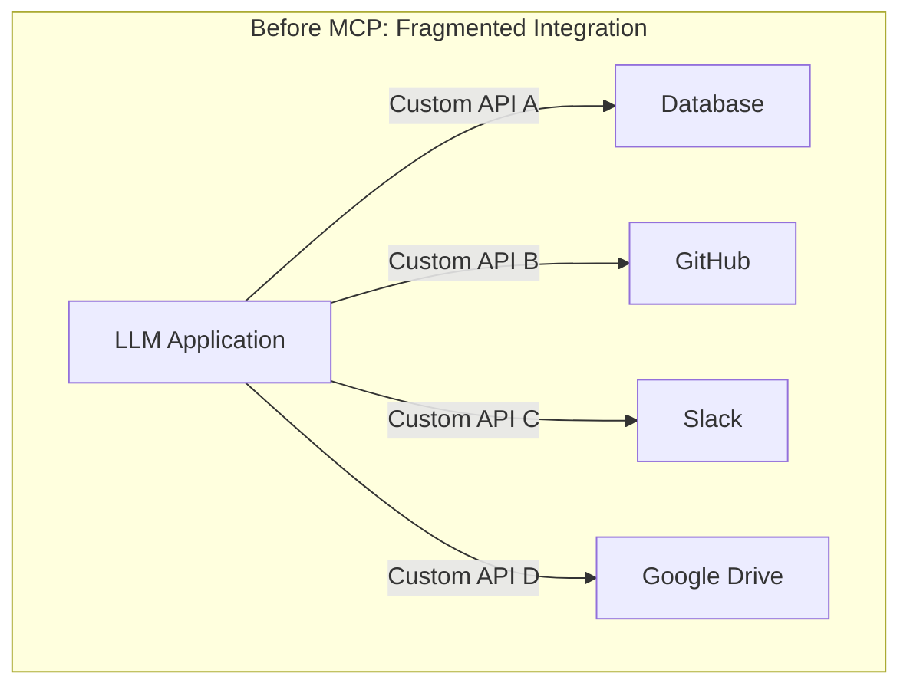

Each data source required different integration methods. GitHub had its way, Slack had its way, databases had another way. Every time a new data source was added, integration logic had to be built from scratch.

It's similar to before JSON emerged, when each service used different data formats (XML, CSV, etc.). A separate parser had to be created whenever a new service was added. (Though some still use XML today...)


Anthropic explains this problem using the **USB-C** analogy. Before, every phone had different charging ports. Samsung used micro USB, Apple used Lightning, and other manufacturers used other standards. Then USB-C came along as a standard, allowing one cable to connect all devices.

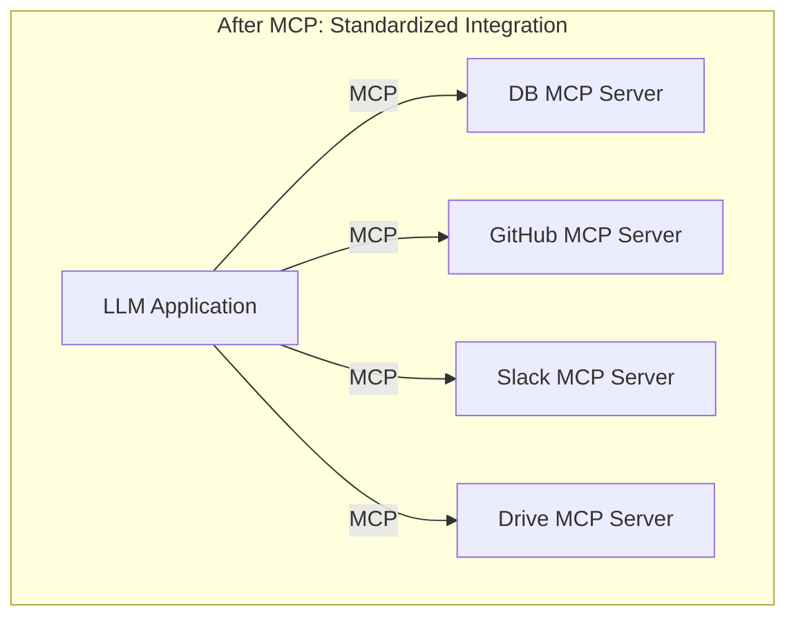

MCP plays that **USB-C role**. It enables connections to various external systems with a single protocol.

### MCP's Birth and Adoption

MCP was [released as open source by Anthropic on November 25, 2024](https://www.anthropic.com/news/model-context-protocol). What's interesting is how quickly it's becoming an industry standard.

- **November 2024**: [Anthropic releases MCP](https://www.anthropic.com/news/model-context-protocol), provides Python/TypeScript SDKs
- **March 2025**: [OpenAI CEO Sam Altman announces MCP support](https://siliconangle.com/2025/03/27/openai-adds-support-anthropics-mcp-llm-connectivity-protocol/) - "People love MCP and we are excited to add support across our products"
- **April 2025**: [Google DeepMind CEO Demis Hassabis hints at MCP support for Gemini](https://techcrunch.com/2025/04/09/google-says-itll-embrace-anthropics-standard-for-connecting-ai-models-to-data/) - "MCP is a good protocol and it's rapidly becoming an open standard"
- **December 2025**: [MCP donated to Agentic AI Foundation (AAIF) under Linux Foundation](https://www.linuxfoundation.org/press/linux-foundation-announces-the-formation-of-the-agentic-ai-foundation) - Co-founded by Anthropic, Block, and OpenAI

I found it impressive that although Anthropic created it, OpenAI and Google have also adopted it. It's becoming **a standard recognized even by competitors**. This seems to show that MCP aims to solve common challenges for the entire industry, not just one company's technology.

So what exactly is MCP's structure?

## MCP Architecture: Host, Client, Server

To understand MCP's architecture, you need to know three key concepts: **Host**, **Client**, and **Server**.

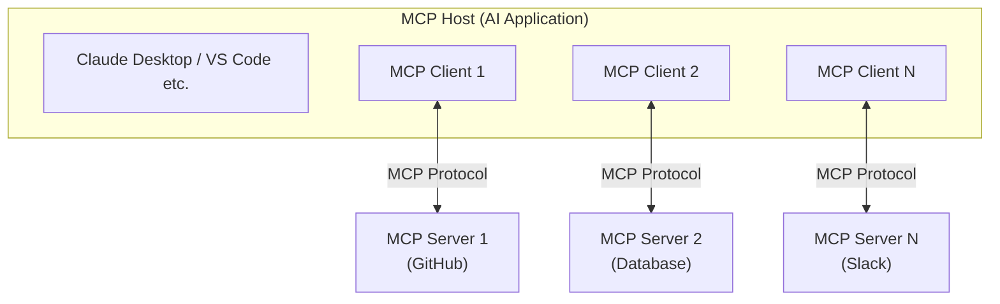

### Host

The Host is **the AI application using MCP**. This includes Claude Desktop, Claude Code, VS Code's AI extensions, etc.

The Host's role is to manage multiple MCP clients and orchestrate interactions between users and the AI model.

### Client

The Client is **the role responsible for MCP protocol communication between Host and Server**. It's usually implemented inside the Host, but conceptually it should be understood as a logical role handling protocol communication. Each Client maintains a 1:1 connection with a single Server.

For example, if Claude Desktop uses three MCP servers—GitHub, Slack, and Database—internally there are three MCP Clients, each connected to their respective servers.

### Server

The Server is **the component that provides access to external systems**. It exposes various external resources like databases, APIs, and file systems for the LLM to use.

Let's look more specifically at how these three components interact.

### The Core of Architecture: Separation of Concerns

The advantage of this structure is that **concerns are clearly separated**.

| Component | Responsibility |
|-----------|----------------|
| **Host** | User interface, AI model management, permission control |
| **Client** | Protocol communication, connection management, message routing |
| **Server** | External system integration, data/function provision |

The Server doesn't need to know what AI model the Host is using—it just provides data according to the MCP protocol. Conversely, the Host doesn't need to know how the Server internally calls the GitHub API.

Thanks to this separation, **once you create one Server, it can be used from any Host—Claude, ChatGPT, Gemini, etc.** It's a platform-independent structure.

Sound familiar? **Depend on interfaces, not implementations**—the basic principle of object-oriented design applies here too. Thanks to the standard interface called MCP, Host and Server can collaborate without knowing each other's implementations.

## MCP Protocol: JSON-RPC-Based Communication

So how exactly do Client and Server communicate? Let's first look at what data they exchange.

MCP is based on **JSON-RPC 2.0**.

### What is JSON-RPC?

JSON-RPC is a simple, lightweight protocol that enables Remote Procedure Calls (RPC) using JSON (JavaScript Object Notation) data format.

Compared to REST APIs we're familiar with, here's the difference:

```json
// REST API approach
GET /tools
POST /tools/weather/call
{
  "location": "Seoul"
}

// JSON-RPC approach
{
  "jsonrpc": "2.0",
  "id": 1,
  "method": "tools/call",
  "params": {
    "name": "weather",
    "arguments": {"location": "Seoul"}
  }
}
```

REST is resource-centric (nouns), while JSON-RPC is action-centric (verbs). In MCP, actions like **"list tools," "execute tool," "read resource"** are central, which is why JSON-RPC seems to be a better fit.

Also, JSON-RPC naturally supports **bidirectional communication**. Clients can request from servers, and servers can send notifications to clients. This characteristic is utilized for MCP's real-time notification features.

### Message Types

There are three main message types exchanged in MCP.

#### 1. Request

A message that requires a response. It has an `id` field to identify which request the response is for.

```json
{
  "jsonrpc": "2.0",
  "id": 1,
  "method": "tools/list"
}
```

#### 2. Response

A response to a request. It has the same `id` and includes either `result` or `error`.

```json
{
  "jsonrpc": "2.0",
  "id": 1,
  "result": {
    "tools": [
      {
        "name": "get_weather",
        "description": "Get current weather for a location"
      }
    ]
  }
}
```

#### 3. Notification

A one-way message that doesn't require a response. It has no `id` field.

```json
{
  "jsonrpc": "2.0",
  "method": "notifications/tools/list_changed"
}
```

All MCP communication happens through these three message types. I think it's a simple yet powerful structure.

## Connection Establishment: Initialization Process

Before Client and Server can communicate, they must go through an **Initialization** process.

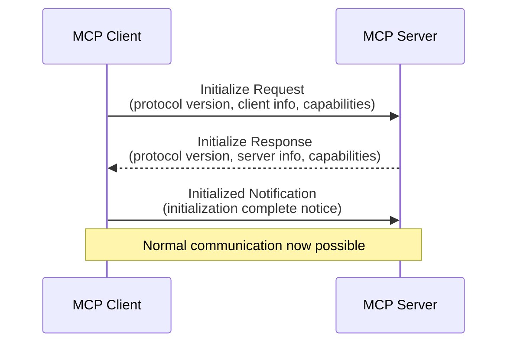

### Initialize Request

The client first informs the server of its information and supported capabilities.

```json
{
  "jsonrpc": "2.0",
  "id": 1,
  "method": "initialize",
  "params": {
    "protocolVersion": "2025-06-18",
    "capabilities": {
      "sampling": {}
    },
    "clientInfo": {
      "name": "claude-code",
      "version": "1.0.0"
    }
  }
}
```

`protocolVersion` is the MCP version the client uses. `capabilities` lists the features the client supports. For example, having `sampling` means the client provides LLM calling functionality.

### Initialize Response

The server also responds with its information and provided capabilities.

```json
{
  "jsonrpc": "2.0",
  "id": 1,
  "result": {
    "protocolVersion": "2025-06-18",
    "capabilities": {
      "tools": {"listChanged": true},
      "resources": {},
      "prompts": {}
    },
    "serverInfo": {
      "name": "github-mcp-server",
      "version": "1.2.0"
    }
  }
}
```

Looking at the server's `capabilities`, we can see this server provides **tools**, **resources**, and **prompts**. `listChanged: true` means it will send notifications when the tool list changes.

### Capability Negotiation

What's important in this initialization process is **capability negotiation**. Client and server exchange their supported features, and only features supported by both sides are used.

For example:
- If the client said it supports `sampling`, the server can request this feature
- Since the server said it provides `tools`, the client can request the tool list

Thanks to this approach, **backward compatibility** can be maintained while adding new features. Even if an old client communicates with a new server, they just use features both commonly support.

## MCP's Core Features: Tools, Resources, Prompts

Features provided by MCP servers can be broadly divided into three categories: **Tools**, **Resources**, and **Prompts**.

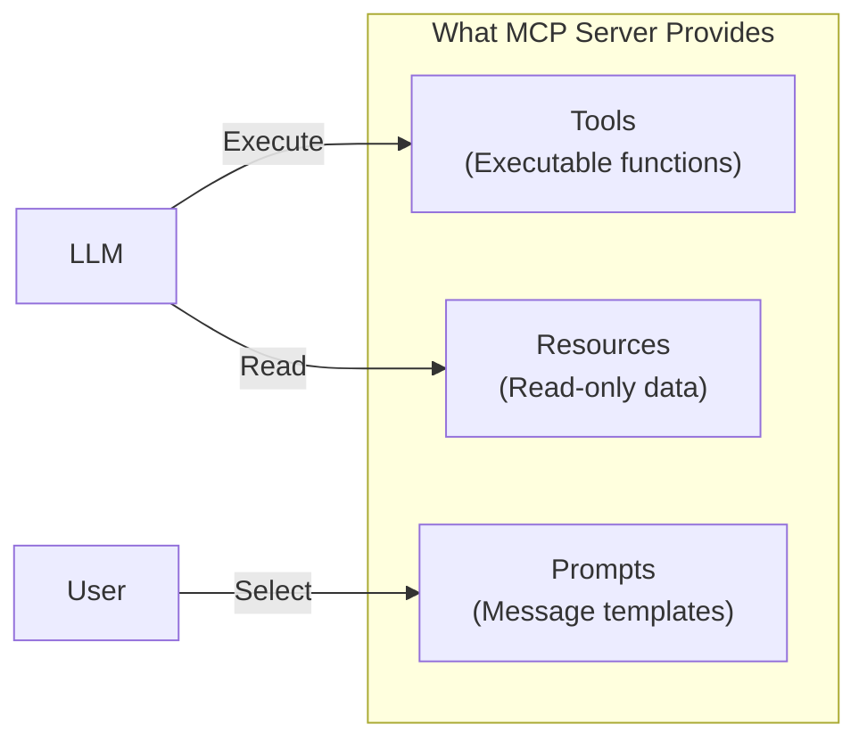

Let's look at what role each plays.

### Tools: Functions the LLM Executes

Tools are **functions that the LLM can directly call**. They can perform various tasks like database queries, API calls, and calculations.

#### Tool Discovery

First, the client queries what tools the server provides.

```json
// Request
{
  "jsonrpc": "2.0",
  "id": 2,
  "method": "tools/list"
}

// Response
{
  "jsonrpc": "2.0",
  "id": 2,
  "result": {
    "tools": [
      {
        "name": "get_weather",
        "title": "Get Current Weather",
        "description": "Retrieves current weather for a location",
        "inputSchema": {
          "type": "object",
          "properties": {
            "location": {
              "type": "string",
              "description": "City name"
            }
          },
          "required": ["location"]
        }
      }
    ]
  }
}
```

Looking at the response, each tool includes its name, description, and **input schema**. The `inputSchema` is in JSON Schema format, defining what parameters are needed to call this tool.

Based on this information, the LLM **decides on its own which tool to use and when**. If a user says "Tell me Seoul's weather," the LLM selects the `get_weather` tool and calls it with `location: "Seoul"` as the parameter.

#### Tool Execution

Executing a tool is also straightforward.

```json
// Request
{
  "jsonrpc": "2.0",
  "id": 3,
  "method": "tools/call",
  "params": {
    "name": "get_weather",
    "arguments": {
      "location": "Seoul"
    }
  }
}

// Response
{
  "jsonrpc": "2.0",
  "id": 3,
  "result": {
    "content": [
      {
        "type": "text",
        "text": "Current weather in Seoul: 15°C, Partly cloudy"
      }
    ],
    "isError": false
  }
}
```

Results are returned as a `content` array. Not just text, but various forms of results like images and audio can be returned.

#### The Meaning of Model-Controlled

The most important characteristic of Tools is that they're **Model-Controlled**. It's not a person explicitly instructing "use this tool," but **the LLM inferring the situation and selecting and calling tools on its own**.

Of course, for this to work, the LLM needs to understand the tools well. That's why writing a clear `description` is important. "Gets weather" is less useful than "Retrieves current weather information (temperature, conditions) for a specified city"—the more specific, the higher the inference accuracy.

#### How Does the LLM Know About and Call MCP Tools?

Here's an important misconception I should address. **MCP itself doesn't perform inference**. MCP is just a protocol for exchanging data, and judgment and selection are entirely handled by the Host's LLM.

So how does the LLM "automatically" select and call MCP tools? Let's look at the complete flow.

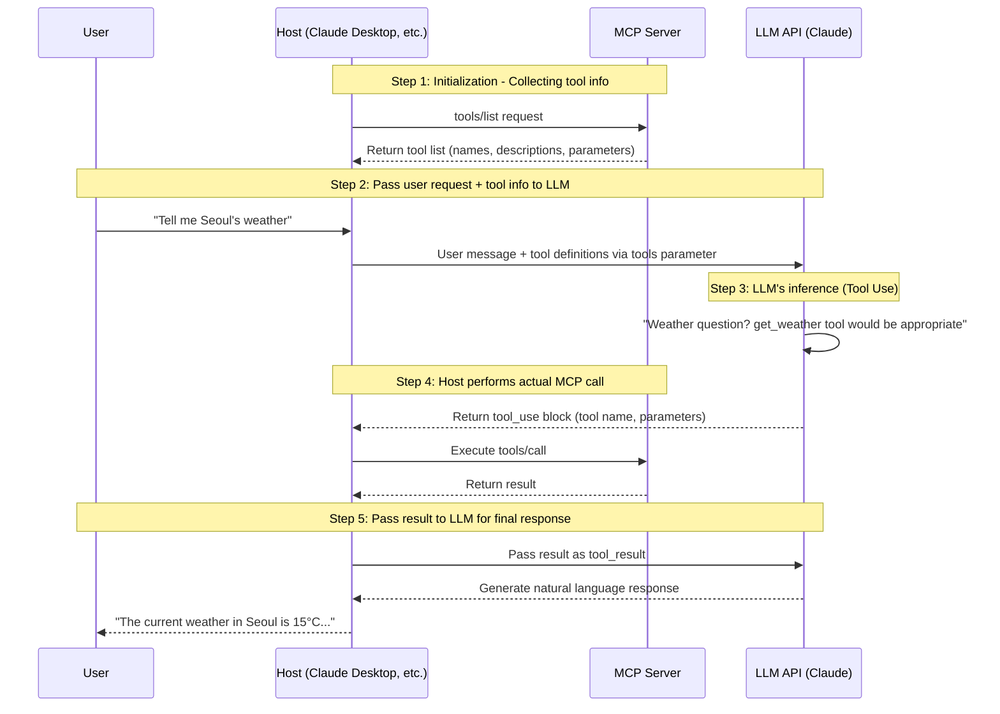

Here's the flow explained:

1. **Host collects tool information**: The Host (e.g., Claude Desktop) calls `tools/list` on the MCP Server to get the list of available tools. This information includes tool names, descriptions, and required parameters.

2. **Host passes tool definitions to LLM API**: When the user sends a message, the Host includes the collected tool definitions in the `tools` parameter when calling the LLM API. Using Claude API as an example:

```python
response = client.messages.create(
    model="claude-sonnet-4-20250514",
    messages=[{"role": "user", "content": "Tell me Seoul's weather"}],
    tools=[  # Tool info collected from MCP Server
        {
            "name": "get_weather",
            "description": "Retrieves current weather information for a specified city",
            "input_schema": {
                "type": "object",
                "properties": {
                    "city": {"type": "string", "description": "City name"}
                },
                "required": ["city"]
            }
        }
    ]
)
```

3. **LLM judges on its own**: The LLM has learned the ability called **Tool Use (or Function Calling)**. Looking at the user's question and the given tool list, it infers "which tool should be called with what parameters in this situation."

4. **LLM requests tool call in structured form**: If it decides to use a tool, the LLM returns a structured response like this:

```json
{
  "type": "tool_use",
  "name": "get_weather",
  "input": {
    "city": "Seoul"
  }
}
```

5. **Host performs actual MCP call**: The LLM doesn't call the MCP Server directly. The Host receives this `tool_use` response, actually sends a `tools/call` request to the MCP Server, and passes the result back to the LLM.

To summarize, **MCP is a standardized pipeline for providing tools**, and **tool selection is 100% the LLM's inference ability**. The Host serves as the orchestrator connecting these two.

This is exactly why the `description` mentioned earlier is important. The LLM can't see the tool's actual implementation code—it judges only by name and description. Good descriptions help the LLM select the right tool in the right situation.

Sound familiar? It's abstraction. When we program, we can use functions by just looking at the function name and description without knowing the internal implementation. MCP tools are the same. The LLM can't see the function's internal code and judges only by metadata (name, description, input schema).

### Resources: Read-Only Data

Resources are **read-only data provided by the server**. File contents, database schemas, configuration information fall under this category.

```json
// List resources
{
  "jsonrpc": "2.0",
  "id": 4,
  "method": "resources/list"
}

// Response
{
  "jsonrpc": "2.0",
  "id": 4,
  "result": {
    "resources": [
      {
        "uri": "file:///project/src/main.rs",
        "name": "main.rs",
        "description": "Primary application entry point",
        "mimeType": "text/x-rust"
      }
    ]
  }
}
```

Each resource is identified by a **URI**. Various schemes like `file://`, `https://`, `git://` can be used.

#### Tools vs Resources: What's the Difference?

At first, you might wonder "Can't I just use Tools to read data from a database?" Yes, you can. So why do Resources exist separately?

| | Tools | Resources |
|--|-------|-----------|
| **Purpose** | Perform actions (side effects possible) | Read data (read-only) |
| **Control** | LLM auto-selects | Application/user selects |
| **Modification** | Can modify data | Cannot modify, read only |

Tools are called by the LLM's own judgment, but Resources are usually **explicitly selected by the application or user**. Like "add this file to context" in an IDE.

Also, Resources support **Subscription** functionality. You can receive notifications when specific resources change. Useful for automatically updating context when a file is modified.

### Prompts: Reusable Templates

Prompts are **message templates that users can select**. You can pre-define frequently used prompt patterns and reuse them.

```json
// Get prompt
{
  "jsonrpc": "2.0",
  "id": 5,
  "method": "prompts/get",
  "params": {
    "name": "code_review",
    "arguments": {
      "code": "def hello():\n    print('world')"
    }
  }
}

// Response
{
  "jsonrpc": "2.0",
  "id": 5,
  "result": {
    "description": "Code review prompt",
    "messages": [
      {
        "role": "user",
        "content": {
          "type": "text",
          "text": "Please review this Python code:\ndef hello():\n    print('world')"
        }
      }
    ]
  }
}
```

Unlike Tools or Resources, Prompts are **User-Controlled**. The LLM doesn't select them automatically—users explicitly select them from the UI. They're usually exposed as `/` commands (slash commands).

### Interaction of the Three Features

In actual usage scenarios, these three features work together.

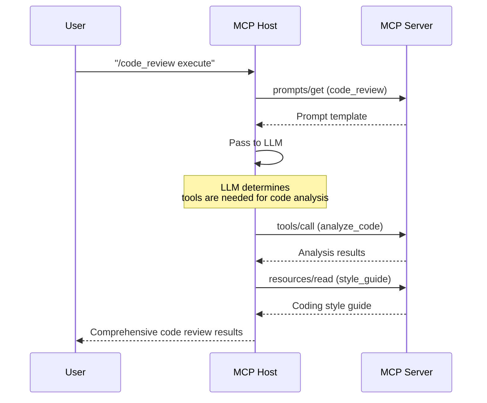

1. User selects `code_review` prompt
2. LLM calls code analysis tool
3. References style guide resource
4. Synthesizes all information to generate code review results

This is how the three features organically connect to create rich AI experiences.

### Implementing with FastMCP

We've looked at the concepts of Tools, Resources, and Prompts. Aren't you curious how to actually implement them? Using [FastMCP](https://github.com/jlowin/fastmcp), you can easily create MCP servers with Python decorators.

FastMCP is a Pythonic framework for MCP server implementation. It abstracts away complex protocol handling so you can focus on business logic.

```python
from fastmcp import FastMCP
from datetime import datetime

# Create MCP server instance
# This server becomes the "Server" component
mcp = FastMCP("Weather Service")

# ===== Tools: Functions the LLM calls =====
# Defined with @mcp.tool() decorator
# LLM calls these in "Model-Controlled" manner on its own
@mcp.tool()
def get_weather(city: str) -> str:
    """
    Retrieves current weather information for a specified city.

    This docstring becomes the 'description' we discussed earlier.
    The LLM looks at this description to decide when to use this tool.

    Args:
        city: City name to get weather for (e.g., "Seoul", "Busan")
              This part becomes the inputSchema properties.
    """
    # In reality, you'd call an external weather API, but hardcoded for example
    weather_data = {
        "Seoul": {"temp": 15, "condition": "Sunny"},
        "Busan": {"temp": 18, "condition": "Cloudy"}
    }

    if city in weather_data:
        data = weather_data[city]
        return f"Current weather in {city}: {data['temp']}°C, {data['condition']}"
    return f"Weather information for {city} not found."


# ===== Resources: Read-only data =====
# Defined with @mcp.resource(), identified by URI format
# Unlike Tools, this is "Application/User-Controlled"
@mcp.resource("config://weather/settings")
def get_weather_settings() -> str:
    """
    Provides weather service configuration information.

    Resources are not automatically selected by LLM,
    but explicitly added to context by the application or user.
    """
    return """
    Supported cities: Seoul, Busan, Daegu, Incheon, Gwangju, Daejeon, Ulsan
    Update interval: 10 minutes
    Data source: Korea Meteorological Administration API
    """


# Dynamic resource - using URI template
# The {city} part is passed as a parameter
@mcp.resource("weather://forecast/{city}")
def get_forecast(city: str) -> str:
    """Provides weekly forecast for a specific city as a resource."""
    return f"""
    {city} weekly forecast:
    - Monday: Sunny, 15°C
    - Tuesday: Cloudy, 13°C
    - Wednesday: Rainy, 10°C
    """


# ===== Prompts: Reusable message templates =====
# Defined with @mcp.prompt()
# Users select via slash commands like "/weather_report"
@mcp.prompt()
def weather_report(city: str) -> str:
    """
    A prompt for generating comprehensive weather reports.

    Prompts are "User-Controlled",
    explicitly selected by users from the UI.
    """
    return f"""
    Please create a comprehensive weather report for {city}.

    Include the following information:
    1. Current weather conditions
    2. Today's high/low temperatures
    3. Weekly weather outlook
    4. Precautions when going out

    Write in a friendly and easy-to-understand tone.
    """


# ===== Context: Utilizing request context =====
# Context enables logging, progress reporting, etc.
from fastmcp import Context

@mcp.tool()
async def analyze_weather_trend(city: str, ctx: Context) -> str:
    """
    Analyzes weather trends for a city.

    Using Context, you can report progress of long-running tasks
    to the client.
    """
    await ctx.info(f"Collecting {city} weather data...")
    # Actual data collection logic would go here

    await ctx.report_progress(progress=50, total=100)
    await ctx.info("Analyzing trends...")
    # Actual analysis logic would go here

    await ctx.report_progress(progress=100, total=100)
    return f"Recent weather trend for {city}: Maintaining 2°C above average temperature"


# Run server (stdio transport)
if __name__ == "__main__":
    mcp.run()
```

Looking at the code, you can see that each decorator corresponds exactly to the concepts explained earlier.

| Decorator | MCP Concept | Control Method | Purpose |
|-----------|-------------|----------------|---------|
| `@mcp.tool()` | Tools | Model-Controlled | Functions LLM decides to call |
| `@mcp.resource()` | Resources | App/User-Controlled | Read-only context data |
| `@mcp.prompt()` | Prompts | User-Controlled | Reusable message templates |

Notably, **the docstring directly becomes the `description`**. Since the LLM selects tools based on this description, I think it's important to write clear docstrings.

Function type hints (`city: str`) are automatically converted to `inputSchema`. FastMCP leverages Python's type system to generate JSON Schema.

To use this server with Claude Desktop, add it to the configuration file:

```json
{
  "mcpServers": {
    "weather": {
      "command": "python",
      "args": ["/path/to/weather_server.py"]
    }
  }
}
```

Besides FastMCP, you can create MCP servers in TypeScript, Java, Kotlin, C#, Rust, and more. The official documentation's [Build an MCP Server](https://modelcontextprotocol.io/docs/develop/build-server) guide explains implementation methods for each language in detail.

> ⚠️ **Important note for stdio-based server development**: Stdout output like `print()` (Python) or `console.log()` (JavaScript) can corrupt JSON-RPC messages and break the server. Make sure logging is configured to output to stderr or files.

## Transport Layer: stdio and Streamable HTTP

So far we've looked at **what** is exchanged; now it's time to see **how** it's exchanged. MCP defines two standard transport methods.

### stdio: Local Process Communication

The simplest method. The Host **runs the MCP server as a subprocess** and communicates via standard input/output (stdin/stdout).

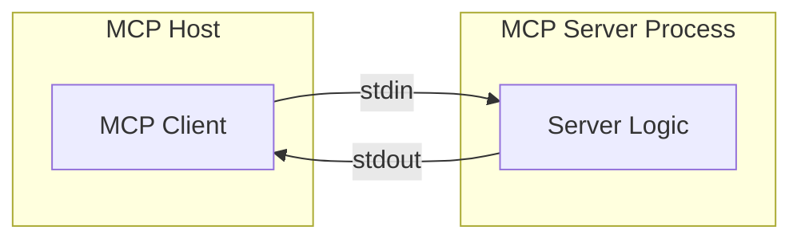

**Characteristics:**
- No network overhead (runs on the same machine)
- Simple setup (just specify server program path)
- No security setup needed (local communication)

This method is used when Claude Desktop or Claude Code uses local MCP servers.

```json
// Claude Desktop configuration example
{
  "mcpServers": {
    "my-blog": {
      "command": "python",
      "args": ["/path/to/server.py"]
    }
  }
}
```

Messages are separated by newlines (`\n`). One JSON-RPC message per line.

### Streamable HTTP: Remote Server Communication

When communicating with remote servers, **HTTP** is used. The client sends messages via HTTP POST, and the server returns responses as **Server-Sent Events (SSE)** streams.

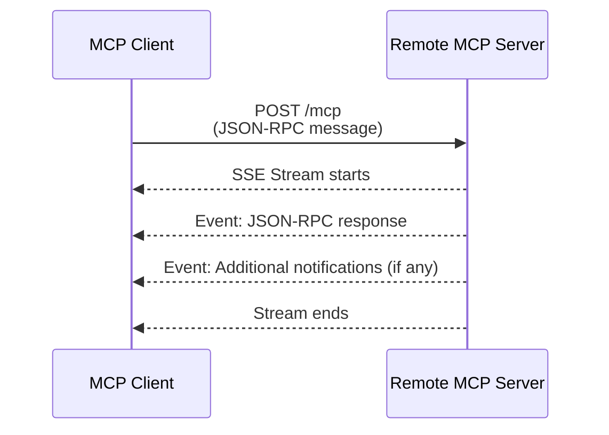

**Why use SSE?**

Simple HTTP request/response could work for communication. But in MCP, there are cases where **the server needs to send messages to the client first**:
- Notifying when tool list changes
- Progress updates for long operations

Using SSE, the server can **stream multiple messages** to the client.

#### Session Management

In Streamable HTTP, there's a **session** concept. The server issues a session ID during initialization, and this ID is included in all subsequent requests.

```
// Initialization response header
Mcp-Session-Id: abc123xyz

// Subsequent request header
Mcp-Session-Id: abc123xyz
```

When the session expires, the server returns HTTP 404, and the client must start a new initialization.

#### Security Considerations

When using Streamable HTTP, **security must be considered**.

- **Origin header validation**: Prevent DNS rebinding attacks
- **Implement authentication**: Bearer Token, API Key, OAuth, etc.
- **localhost binding**: When running locally, bind only to 127.0.0.1

Authentication is essential, especially if the MCP server can access sensitive data (databases, file systems, etc.).

### Which Transport Method Should You Choose?

| | stdio | Streamable HTTP |
|--|-------|-----------------|
| **Use Case** | Local tools, personal development | Shared services, team tools |
| **Pros** | Simple setup, fast | Remote access, centralized management |
| **Cons** | Local only | Network overhead, security setup required |

For personal MCP servers, I think **stdio** is sufficient. If you need to share with a team or access from multiple environments, consider **Streamable HTTP**.

## Sampling: How Servers Call the LLM

So far, we've looked at Host (client) → Server communication. But in MCP, **the reverse direction** is also possible. The Server can request the Host to make an LLM call.

This feature is called **Sampling**.

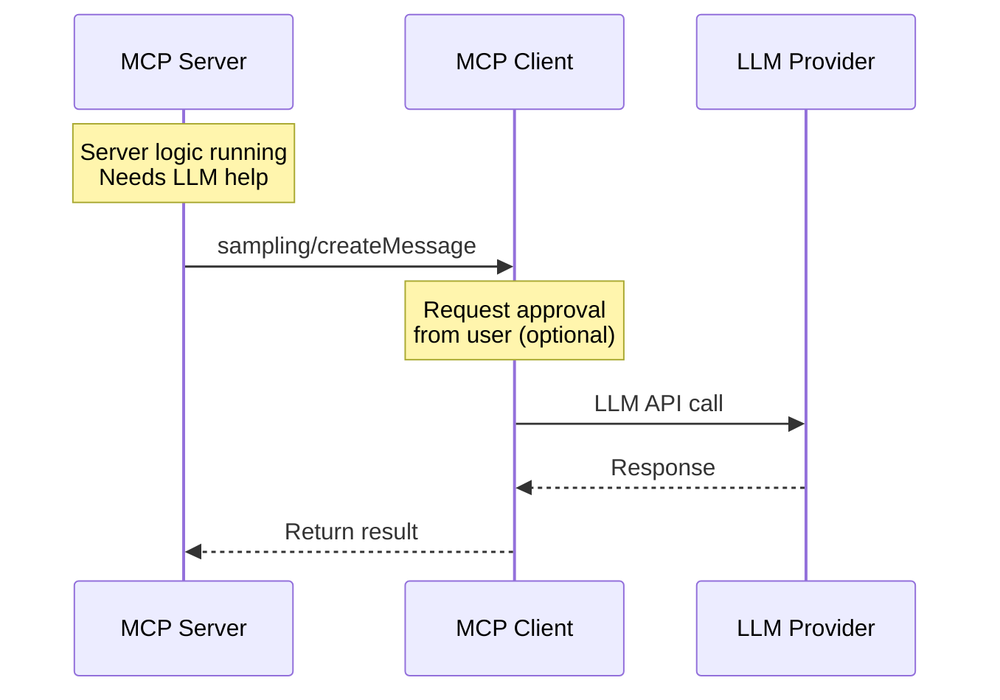

### Why is This Feature Needed?

When building MCP servers, there are cases where **LLM help is needed inside the server**.

For example:

- When you want to summarize and return search results
- When complex data needs to be explained in natural language
- When running AI agent logic on the server side

Using Sampling, the server doesn't need its own LLM API key. Instead of the server directly executing the model, it requests model execution from the Host and receives the result.

### Sampling Request Example

```json
{
  "jsonrpc": "2.0",
  "id": 10,
  "method": "sampling/createMessage",
  "params": {
    "messages": [
      {
        "role": "user",
        "content": {
          "type": "text",
          "text": "Summarize this data: ..."
        }
      }
    ],
    "modelPreferences": {
      "hints": [{"name": "claude-sonnet-4"}],
      "speedPriority": 0.8
    },
    "maxTokens": 500
  }
}
```

You can give hints about the desired model in `modelPreferences`, but **the final model selection is made by the client**. The server can only give hints like "a faster model would be better."

### The Importance of Human Oversight

The MCP spec emphasizes **Human-in-the-loop** regarding Sampling.

> "Implementations must always include human oversight capabilities for sampling requests."

Clients must be able to show Sampling requests to users and get approval. This is to prevent MCP servers from maliciously abusing the LLM.

In fact, Claude Desktop shows a UI asking for user confirmation when MCP servers call tools or request Sampling.

## Real-Time Updates: Notification System

Another interesting feature in MCP is **Notifications**. Servers can inform clients of changes in real-time.

```json
{
  "jsonrpc": "2.0",
  "method": "notifications/tools/list_changed"
}
```

Upon receiving this notification, the client calls `tools/list` again to get the latest tool list.

### What Notifications Are There?

| Notification | Description |
|--------------|-------------|
| `notifications/tools/list_changed` | Tool list changed |
| `notifications/resources/list_changed` | Resource list changed |
| `notifications/resources/updated` | Specific resource content changed |
| `notifications/prompts/list_changed` | Prompt list changed |

Thanks to this feature, you can create **dynamic MCP servers**. Update the tool list when a new plugin is installed, update resources when config files change, or send notifications when database schema changes.

If you don't need real-time notifications, you don't have to implement this feature. Clients only expect notifications when the server declares `listChanged: true` in `capabilities`.

## MCP Usage in Real-World Services

The examples we've looked at so far have mostly been based on **local environments**. Running local MCP servers from Claude Desktop, communicating via stdio. But what about building actual production services?

### MCP Beyond Local Environments

Let's assume an e-commerce company is building an AI chatbot. The chatbot needs to provide features like order lookup, product search, and inventory checking.

#### Method 1: Custom REST API Approach

The approach of implementing directly without MCP. Many of you have probably built AI chatbot backends this way.

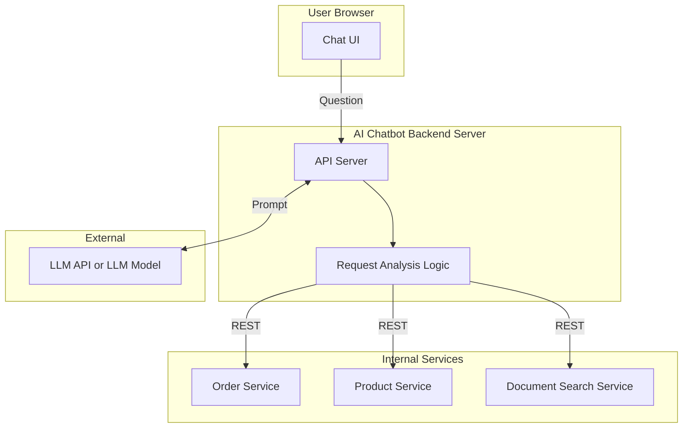

In this approach, the backend analyzes user questions to decide which service to call, calls different REST API interfaces for each service, and backend routing logic needs modification whenever a new service is added.

It works like this. But as services grow, several problems can arise.

- **Interface inconsistency**: Order service uses `/orders/{id}`, product service uses `/api/products/search`... Each service has different API designs
- **Documentation burden**: Separate management of API docs for each service
- **LLM integration complexity**: Manually writing explanations in prompts for LLM to understand each service
- **Maintenance cost**: When service APIs change, both backend router and LLM prompts need modification

#### Method 2: MCP Standardization Approach

Now let's look at a structure with MCP.

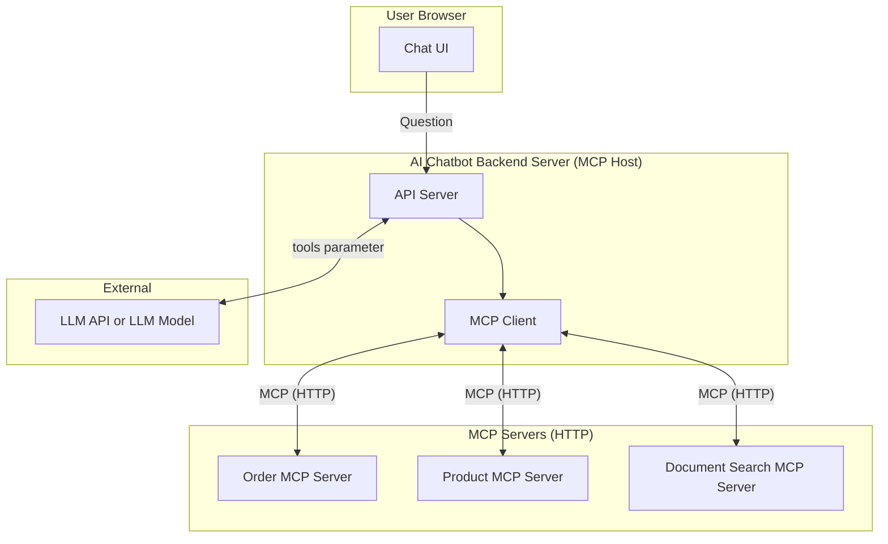

Here are the key differences between the two methods:

1. **Backend serves as MCP Host**: Receives user requests and orchestrates LLM API and MCP servers
2. **MCP servers deployed as separate services**: Containers, microservices, serverless, etc.
3. **Communication via Streamable HTTP**: HTTP-based communication, not local stdio
4. **Automatic tool info collection**: Backend collects tool lists from each MCP server via `tools/list` at startup

### Service Structure Example

Let's see how it's structured in actual code.

#### MCP Server: Order Lookup Service

```python
# order-mcp-server/server.py
from mcp.server import Server
from mcp.server.stdio import stdio_server
from mcp.types import Tool, TextContent

server = Server("order-service")

@server.list_tools()
async def list_tools():
    return [
        Tool(
            name="get_order",
            description="Retrieves order details by order ID. Returns order status, product list, and shipping information.",
            inputSchema={
                "type": "object",
                "properties": {
                    "order_id": {"type": "string", "description": "Order ID (e.g., ORD-12345)"}
                },
                "required": ["order_id"]
            }
        ),
        Tool(
            name="cancel_order",
            description="Cancels an order. Only orders before shipping can be cancelled.",
            inputSchema={
                "type": "object",
                "properties": {
                    "order_id": {"type": "string"},
                    "reason": {"type": "string", "description": "Cancellation reason"}
                },
                "required": ["order_id"]
            }
        )
    ]

@server.call_tool()
async def call_tool(name: str, arguments: dict):
    if name == "get_order":
        order = await db.get_order(arguments["order_id"])
        return [TextContent(type="text", text=json.dumps(order))]
    elif name == "cancel_order":
        result = await db.cancel_order(arguments["order_id"], arguments.get("reason"))
        return [TextContent(type="text", text=f"Order cancelled: {result}")]
```

#### Backend Server: MCP Host Role

```python
# backend/main.py
from mcp import ClientSession
from anthropic import Anthropic

class ChatbotBackend:
    def __init__(self):
        self.anthropic = Anthropic()
        self.mcp_servers = {
            "order": "https://order-mcp.internal:8080/mcp",
            "product": "https://product-mcp.internal:8080/mcp",
            "docs": "https://docs-mcp.internal:8080/mcp"
        }
        self.tools = []

    async def initialize(self):
        """Collect tool info from all MCP servers at startup"""
        for name, url in self.mcp_servers.items():
            async with ClientSession(url) as session:
                await session.initialize()
                tools = await session.list_tools()
                self.tools.extend(tools)

    async def handle_message(self, user_message: str):
        # 1. Call LLM API (with collected tool info)
        response = self.anthropic.messages.create(
            model="claude-sonnet-4-20250514",
            messages=[{"role": "user", "content": user_message}],
            tools=self._convert_to_anthropic_tools(self.tools)
        )

        # 2. If LLM requests tool use, call the corresponding MCP server
        while response.stop_reason == "tool_use":
            tool_results = []
            for block in response.content:
                if block.type == "tool_use":
                    result = await self._call_mcp_tool(block.name, block.input)
                    tool_results.append({
                        "type": "tool_result",
                        "tool_use_id": block.id,
                        "content": result
                    })

            # 3. Pass results back to LLM
            response = self.anthropic.messages.create(
                model="claude-sonnet-4-20250514",
                messages=[
                    {"role": "user", "content": user_message},
                    {"role": "assistant", "content": response.content},
                    {"role": "user", "content": tool_results}
                ],
                tools=self._convert_to_anthropic_tools(self.tools)
            )

        return response.content[0].text

    async def _call_mcp_tool(self, tool_name: str, arguments: dict):
        """Find and call the MCP server for the tool by name"""
        server_url = self._find_server_for_tool(tool_name)
        async with ClientSession(server_url) as session:
            await session.initialize()
            result = await session.call_tool(tool_name, arguments)
            return result
```

### Benefits of MCP Standardization

What benefits does adopting MCP bring?

**1. Consistent Interface**

All services follow the same MCP protocol. Query tool lists with `tools/list`, call with `tools/call`. No need to worry about different REST API designs for each service.

**2. Self-describing**

Each MCP server describes its functionality through `description` and `inputSchema`. No need to write in prompts "the order service has these features..." Just pass the tool info directly when calling the LLM API.

**3. Independent Deployment**

Each MCP server can be deployed and updated independently. Even when adding new features to the order service, the backend automatically recognizes new tools by calling `tools/list` again.

**4. Ecosystem Compatibility**

MCP is an open standard. An MCP server created in-house can be used from Claude Desktop as-is, and from other MCP-compatible clients too.

**5. Separation of Concerns**

- MCP Server: Focus on business logic (order lookup, cancellation, etc.)
- Backend: Focus on orchestration (user auth, MCP connections, LLM calls)
- LLM: Focus on inference (understanding user intent, tool selection)

### What Specifically Changes?

Honestly, just looking at the benefits above, you might think "so what?" Let's compare with a specific scenario.

**Scenario: Adding "Refund Lookup" Feature**

| Step | REST Approach | MCP Approach |
|------|---------------|--------------|
| 1 | Develop refund API | Develop refund MCP tool |
| 2 | Write API docs (Swagger, etc.) | *(Tool definition is the doc)* |
| 3 | Add new route to backend router | *(Not needed)* |
| 4 | Add tool description to LLM prompt | *(tools/list auto-collects)* |
| **Modification Points** | **4 places** | **1 place** |

See the difference? In MCP, **one tool definition is the doc, the interface, and the LLM prompt**. This is the **Single Source of Truth**.

With 3 tools, it might not seem different, but with 30 tools, it's a different story. In REST approach, you manage 30 × 4 = 120 places, but with MCP, just 30 places.

#### Connection to Software Design Principles

While writing this post, I noticed that MCP's design philosophy aligns with good software design principles we know.

- **Abstraction**: LLM doesn't know implementation, only sees interface (name, description, schema)
- **Single Responsibility Principle (SRP)**: Each MCP server handles only one domain
- **Open-Closed Principle (OCP)**: Extend without modifying existing code when adding new tools
- **Dependency Inversion (DIP)**: Depend on protocol (interface), not implementation

In the end, the problem MCP is solving doesn't seem new. **"A system flexible to change and easy to maintain"**—it's applying the goal we've always pursued to the AI tool integration domain.

### Deployment Architecture Example

I've drawn an MCP server configuration diagram using MCP. It's probably easier to understand as architecture.

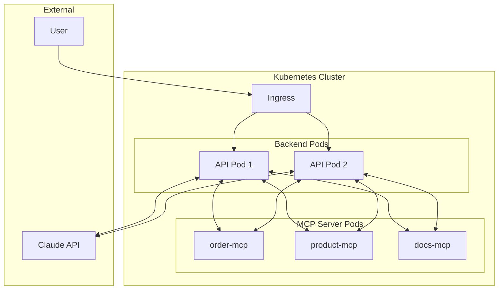

- Deployed as Kubernetes Pods
- Exposed as internal services (no direct external access)
- Communication via Streamable HTTP
- Each can scale independently

### When Should You Adopt MCP?

Of course, I don't think MCP is needed for every service.

**When MCP is Useful**
- When multiple AI features (chatbot, search, recommendations, etc.) use the same backend services
- When new features are frequently added and LLM needs to recognize them automatically
- When you want to standardize and share AI tools across teams
- When you want to use the same server code for local development (stdio) and production (HTTP)

**When MCP Might Be Overkill**
- Single AI feature with only 1-2 tools
- When you need to quickly build an MVP (direct REST API calls are simpler)
- When the team can't afford the learning cost of MCP

The key is whether **the benefits of standardization offset the adoption cost**. MCP's value grows as services grow and AI features increase, but there's no need to over-design from the start.

However, what we've discussed so far is about adopting MCP in our services to provide to users. But currently, in most cases, individuals install and run MCP servers locally. So the design considerations are different from simply running MCP servers locally.

## MCP's Limitations and Security Considerations

So far we've looked at MCP's structure and features. But like all technology, MCP isn't perfect either.

### Security Vulnerabilities

In 2025, several security researchers published MCP-related security issues.

**Major Vulnerabilities:**

- **Prompt Injection**: According to [Simon Willison's analysis](https://simonwillison.net/2025/Apr/9/mcp-prompt-injection/), if data returned by MCP servers contains malicious instructions, it can manipulate LLM behavior. OWASP also ranked Prompt Injection as the #1 LLM security risk.
- **Tool Poisoning**: [Palo Alto Unit42 research](https://unit42.paloaltonetworks.com/model-context-protocol-attack-vectors/) published an attack vector where malicious instructions hidden in tool metadata (description) can make LLMs call unintended tools. The problem is malicious instructions invisible to users but interpretable by AI models.
- **Critical RCE Vulnerability**: [CVE-2025-6514 discovered by JFrog Security Research](https://jfrog.com/blog/2025-6514-critical-mcp-remote-rce-vulnerability/) (CVSS 9.6) is a remote code execution vulnerability found in mcp-remote package (v0.0.5~0.1.15). Connecting to a malicious MCP server could execute arbitrary commands on the client OS, and the package was [downloaded over 437,000 times](https://thehackernews.com/2025/07/critical-mcp-remote-vulnerability.html).

**Exposed MCP Servers:**

[Trend Micro research](https://www.trendmicro.com/vinfo/us/security/news/cybercrime-and-digital-threats/mcp-security-network-exposed-servers-are-backdoors-to-your-private-data) found 492 MCP servers exposed to the internet operating **without authentication or encryption**. These servers had access to 1,402 tools total, with over 90% providing direct read access to data sources. [Bitsight report](https://www.bitsight.com/blog/exposed-mcp-servers-reveal-new-ai-vulnerabilities) also warned that about 1,000 MCP servers were exposed to the public internet without authentication.

Also, according to [Astrix's MCP Security Status Report](https://astrix.security/learn/blog/state-of-mcp-server-security-2025/), 88% of MCP servers require credentials, but 53% of those rely on long-lived static API keys or PATs (Personal Access Tokens).

Seeing these research results, I realized that security requires special attention when using MCP.

### Recommended Security Practices

**Server Side**
- Validate all input values
- Implement proper access control
- Apply rate limiting
- Filter sensitive data

**Client Side**
- Request user confirmation for sensitive operations
- Display input values before tool calls
- Log tool executions
- Set timeouts

I think applying the **principle of least privilege** is especially important if the MCP server accesses file systems or databases.

## Summary

In this post, we explored MCP's structure and how it works. To summarize:

1. **MCP is a standard protocol connecting AI to external systems**. Like USB-C, one standard enables various connections.

2. **Host-Client-Server architecture** separates concerns. Thanks to this, once you create one server, it can be reused from multiple AI applications.

3. **Communication is based on JSON-RPC 2.0**. All interactions happen through three message types: Request, Response, and Notification.

4. **Three core features: Tools, Resources, Prompts**. These serve as executable functions, read-only data, and reusable templates respectively. MCP itself has no intelligence—**tool selection is done by the LLM's Tool Use ability**.

5. **Two transport methods supported: stdio and Streamable HTTP**. stdio for local development, HTTP for remote services.

6. **Can be used in production services**. The backend serves as MCP Host, and MCP servers are deployed as separate services. Compared to custom REST APIs, benefits include standardization, self-describing interfaces, and independent deployment.

7. **Servers can also call LLM through Sampling**. However, human oversight must be possible.

8. **Security requires attention**. Authentication, input validation, and permission management are important.

MCP is still an evolving protocol. The spec continues to update, and the ecosystem is growing.

While organizing this post, I realized something. The problem MCP is trying to solve isn't actually new. **Abstraction, separation of concerns, interface-based design**. It seems like principles we've long pondered for building good software are being applied to the new domain of AI tool integration.

Good design seems to have the same essence regardless of the era. Studying MCP actually reminded me of the importance of fundamentals.

Thank you for reading this long post. I hope this article helped a bit in understanding MCP.

---

## References

### Official Documentation

- [Model Context Protocol - Introduction](https://modelcontextprotocol.io/introduction)
- [MCP Specification](https://spec.modelcontextprotocol.io/specification/)
- [MCP Architecture](https://modelcontextprotocol.io/docs/concepts/architecture)
- [MCP Transports](https://modelcontextprotocol.io/docs/concepts/transports)
- [Build an MCP Server](https://modelcontextprotocol.io/docs/develop/build-server) - Building MCP servers in various languages (Python, TypeScript, Java, Kotlin, C#, Rust)

### Anthropic Announcements

- [Introducing the Model Context Protocol - Anthropic](https://www.anthropic.com/news/model-context-protocol)

### Related Posts

- [Making LLM Your Second Brain: Using Personal Blog as RAG with MCP Server]()
- [Understanding RPC: JSON-RPC, gRPC, and Common Misconceptions]() - Detailed explanation of JSON-RPC used by MCP

### Additional Resources

- [Model Context Protocol - Wikipedia](https://en.wikipedia.org/wiki/Model_Context_Protocol)
- [JSON-RPC 2.0 Specification](https://www.jsonrpc.org/specification)
