요즘 AI 분야에서 MCP(Model Context Protocol)에 대한 이야기가 많이 들려옵니다. 저도 [이전 글]()에서 MCP 서버를 직접 만들어 활용하는 경험을 공유했었는데요.

그런데 막상 MCP를 사용하면서도 **"MCP가 정확히 어떤 구조로 되어있지?"**, **"LLM은 MCP 서버와 어떻게 통신하지?"** 같은 궁금증이 있었습니다.

이번 글에서는 MCP의 내부 구조와 동작 원리를 살펴보려 합니다. 마치 저와 함께 MCP 스펙 문서를 읽어나가는 느낌으로 정리해보겠습니다.

## MCP란 무엇인가?

MCP(Model Context Protocol)는 Anthropic이 2024년 11월에 공개한 **Open Standard(개방형 표준)** 입니다. 한 마디로 정의하자면 **AI 애플리케이션과 외부 시스템을 연결하기 위한 표준화된 프로토콜**이라고 할 수 있습니다.

그런데 왜 이런 프로토콜이 필요하게 되었을까요?

### MCP가 해결하려는 문제

AI 모델은 학습 당시의 지식까지만 알고 있습니다. 그래서 최신 정보를 얻거나, 외부 데이터베이스에 접근하거나, 특정 도구를 실행하려면 **외부 시스템과의 연동**이 필수적이죠.

문제는 지금까지 이 연동 방식이 **파편화**되어 있었다는 점입니다.

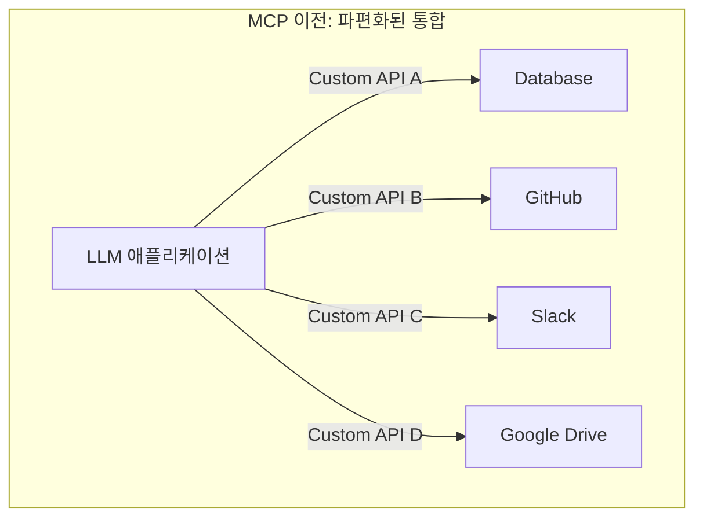

각 데이터 소스마다 다른 방식으로 연동해야 했습니다. GitHub API는 GitHub 방식으로, Slack은 Slack 방식으로, 데이터베이스는 또 다른 방식으로요. 새로운 데이터 소스를 추가할 때마다 처음부터 통합 로직을 만들어야 했죠.

마치 JSON이 등장하기 전, 각 서비스가 저마다 다른 데이터 포맷(XML, CSV 등)을 사용하던 시절과 비슷합니다. 새로운 서비스가 추가될 때마다 별도의 파서(parser)를 만들어야 했죠. (물론 지금도 XML 쓰는 곳이 있지만요...)

Anthropic은 이 문제를 **USB-C**에 비유해서 설명합니다. 예전에는 휴대폰마다 충전 단자가 달랐습니다. 삼성은 마이크로 USB, 애플은 라이트닝, 또 다른 제조사는 또 다른 규격을 썼죠. 그러다 USB-C라는 표준이 등장하면서 하나의 케이블로 모든 기기를 연결할 수 있게 되었습니다.

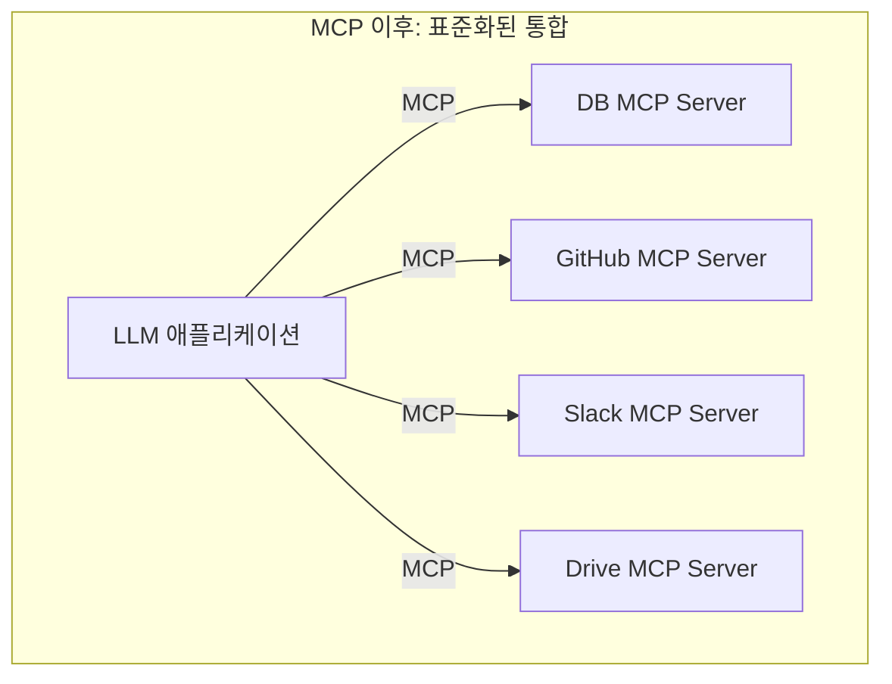

MCP가 바로 그 **USB-C 역할**을 합니다. 하나의 프로토콜로 다양한 외부 시스템과 연결할 수 있게 되는 거죠.

### MCP의 탄생과 채택

MCP는 2024년 11월 25일 Anthropic이 오픈소스로 공개했습니다. 흥미로운 점은 공개 후 빠르게 업계 표준으로 자리잡아가고 있다는 점입니다.

- **2024년 11월**: Anthropic이 MCP 공개, Python/TypeScript SDK 제공
- **2025년 3월**: OpenAI가 ChatGPT 데스크톱 앱에 MCP 지원 추가
- **2025년 4월**: Google DeepMind가 Gemini 모델에 MCP 지원 예고
- **2025년 12월**: Linux Foundation 산하 Agentic AI Foundation(AAIF)에 MCP 기부

Anthropic이 만들었지만 OpenAI나 Google도 채택했다는 점이 인상적이였습니다. **경쟁사도 인정하는 표준**이 되어가고 있는 거죠. 이는 MCP가 특정 회사의 기술이 아닌 업계 전체의 공통 과제를 해결하려 한다는 점을 보여주는 것 같습니다.

그렇다면 MCP는 구체적으로 어떤 구조로 되어 있을까요?

## MCP 아키텍처: 호스트, 클라이언트, 서버

MCP의 아키텍처를 이해하려면 세 가지 핵심 개념을 알아야 합니다. **Host**, **Client**, **Server**입니다.

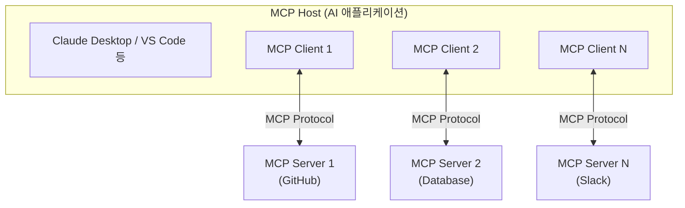

### Host (호스트)

Host는 **MCP를 사용하는 AI 애플리케이션**입니다. Claude Desktop, Claude Code, VS Code의 AI 확장 등이 여기에 해당합니다.

Host의 역할은 여러 MCP 클라이언트를 관리하고, 사용자와 AI 모델 사이의 상호작용을 조율하는 것입니다.

### Client (클라이언트)

Client는 **Host와 Server 사이에서 MCP 프로토콜 통신을 담당하는 역할**입니다. 보통 Host 내부에 구현되지만, 개념적으로는 프로토콜 통신을 담당하는 논리적 역할로 이해하면 됩니다. 각 Client는 단일 Server와 1:1 연결을 유지합니다.

예를 들어 Claude Desktop이 GitHub, Slack, Database 세 개의 MCP 서버를 사용한다면, 내부적으로 세 개의 MCP Client가 각각의 서버와 연결되어 있는 구조입니다.

### Server (서버)

Server는 **외부 시스템에 대한 접근을 제공하는 컴포넌트**입니다. 데이터베이스, API, 파일 시스템 등 다양한 외부 리소스를 LLM이 사용할 수 있도록 노출합니다.

이 세 컴포넌트가 어떻게 상호작용하는지 조금 더 구체적으로 살펴보겠습니다.

### 아키텍처의 핵심: 관심사의 분리

이 구조의 장점은 **관심사가 명확히 분리**되어 있다는 점입니다.

| 컴포넌트 | 책임 |
|---------|-----|
| **Host** | 사용자 인터페이스, AI 모델 관리, 권한 제어 |
| **Client** | 프로토콜 통신, 연결 관리, 메시지 라우팅 |
| **Server** | 외부 시스템 연동, 데이터/기능 제공 |

Server는 Host가 어떤 AI 모델을 쓰는지 알 필요가 없이 그냥 MCP 프로토콜에 맞게 데이터를 제공하면 됩니다. 반대로 Host도 Server가 내부적으로 어떻게 GitHub API를 호출하는지 알 필요가 없습니다.

이런 분리 덕분에 **Server 하나를 만들어두면 Claude, ChatGPT, Gemini 등 어떤 Host에서든 사용할 수 있게 됩니다.** 플랫폼 독립적인 구조인 거죠.

어디서 많이 본 패턴 아닌가요? **인터페이스에 의존하고 구현에 의존하지 않는다** — 객체지향 설계의 기본 원칙이 여기서도 적용되는 것 같습니다. MCP라는 표준 인터페이스 덕분에 Host와 Server가 서로의 구현을 몰라도 협력할 수 있는 겁니다.

## MCP 프로토콜: JSON-RPC 기반 통신

그렇다면 Client와 Server는 구체적으로 어떻게 통신할까요? 어떤 데이터를 주고 받는지 부터 살펴보겠습니다.

MCP는 **JSON-RPC 2.0**을 기반으로 합니다.

### JSON-RPC란?

JSON-RPC란 JSON(JavaScript Object Notation) 데이터 형식을 사용하여 원격 프로시저 호출(RPC)을 가능하게 하는 간단하고 경량화된 프로토콜입니다. 

저희에게 익숙한 REST API와 비교하면 다음과 같은 차이가 있습니다.

```json
// REST API 방식
GET /tools
POST /tools/weather/call
{
  "location": "Seoul"
}

// JSON-RPC 방식
{
  "jsonrpc": "2.0",
  "id": 1,
  "method": "tools/call",
  "params": {
    "name": "weather",
    "arguments": {"location": "Seoul"}
  }
}
```

REST는 리소스 중심(명사)이고, JSON-RPC는 행위 중심(동사)입니다. MCP에서는 **"도구 목록 조회", "도구 실행", "리소스 읽기"** 같은 행위가 중심이기 때문에 JSON-RPC가 더 적합하다고 판단한 것 같습니다.

또한 JSON-RPC는 **양방향 통신**을 자연스럽게 지원합니다. 클라이언트가 서버에 요청할 수도 있고, 서버가 클라이언트에 알림을 보낼 수도 있죠. 이 특성이 MCP의 실시간 알림 기능에 활용됩니다.

### 메시지 타입

MCP에서 주고받는 메시지는 크게 세 가지 타입이 있습니다.

#### 1. Request (요청)

응답이 필요한 메시지입니다. `id` 필드가 있어서 어떤 요청에 대한 응답인지 식별할 수 있습니다.

```json
{
  "jsonrpc": "2.0",
  "id": 1,
  "method": "tools/list"
}
```

#### 2. Response (응답)

요청에 대한 응답입니다. 같은 `id`를 가지고 `result` 또는 `error`를 포함합니다.

```json
{
  "jsonrpc": "2.0",
  "id": 1,
  "result": {
    "tools": [
      {
        "name": "get_weather",
        "description": "Get current weather for a location"
      }
    ]
  }
}
```

#### 3. Notification (알림)

응답이 필요 없는 단방향 메시지입니다. `id` 필드가 없습니다.

```json
{
  "jsonrpc": "2.0",
  "method": "notifications/tools/list_changed"
}
```

이 세 가지 메시지 타입으로 MCP의 모든 통신이 이루어집니다. 단순하면서도 강력한 구조라고 생각합니다.

## 연결 수립: 초기화 과정

Client와 Server가 통신을 시작하려면 먼저 **초기화(Initialization)** 과정을 거쳐야 합니다.

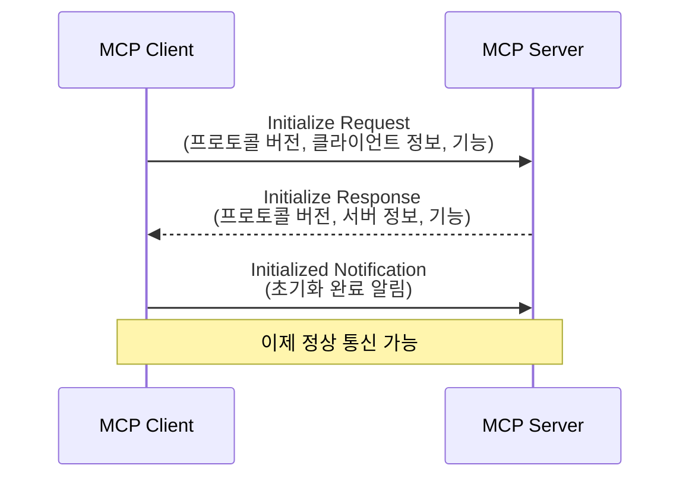

### Initialize Request

클라이언트가 먼저 자신의 정보와 지원하는 기능을 서버에 알립니다.

```json
{
  "jsonrpc": "2.0",
  "id": 1,
  "method": "initialize",
  "params": {
    "protocolVersion": "2025-06-18",
    "capabilities": {
      "sampling": {}
    },
    "clientInfo": {
      "name": "claude-code",
      "version": "1.0.0"
    }
  }
}
```

`protocolVersion`은 클라이언트가 사용하는 MCP 버전입니다. `capabilities`는 클라이언트가 지원하는 기능들을 나열합니다. 예를 들어 `sampling`이 있으면 클라이언트가 LLM 호출 기능을 제공한다는 의미입니다.

### Initialize Response

서버도 자신의 정보와 제공하는 기능을 응답합니다.

```json
{
  "jsonrpc": "2.0",
  "id": 1,
  "result": {
    "protocolVersion": "2025-06-18",
    "capabilities": {
      "tools": {"listChanged": true},
      "resources": {},
      "prompts": {}
    },
    "serverInfo": {
      "name": "github-mcp-server",
      "version": "1.2.0"
    }
  }
}
```

서버의 `capabilities`를 보면 이 서버가 **tools**, **resources**, **prompts**를 제공한다는 것을 알 수 있습니다. `listChanged: true`는 도구 목록이 변경되면 알림을 보내겠다는 의미입니다.

### Capability Negotiation (기능 협상)

이 초기화 과정에서 중요한 것이 **기능 협상**입니다. 클라이언트와 서버가 각자 지원하는 기능을 교환하고, 양쪽이 모두 지원하는 기능만 사용하게 됩니다.

예를 들어:
- 클라이언트가 `sampling`을 지원한다고 했는데 서버가 이 기능을 요청하면 사용 가능
- 서버가 `tools`를 제공한다고 했으니 클라이언트가 도구 목록을 요청할 수 있음

이 방식 덕분에 **하위 호환성**을 유지하면서 새로운 기능을 추가할 수 있습니다. 오래된 클라이언트가 새로운 서버와 통신해도, 양쪽이 공통으로 지원하는 기능만 사용하면 되니까요.

## MCP의 핵심 기능: Tools, Resources, Prompts

MCP 서버가 제공하는 기능은 크게 세 가지로 나눌 수 있습니다. **Tools**, **Resources**, **Prompts**입니다.

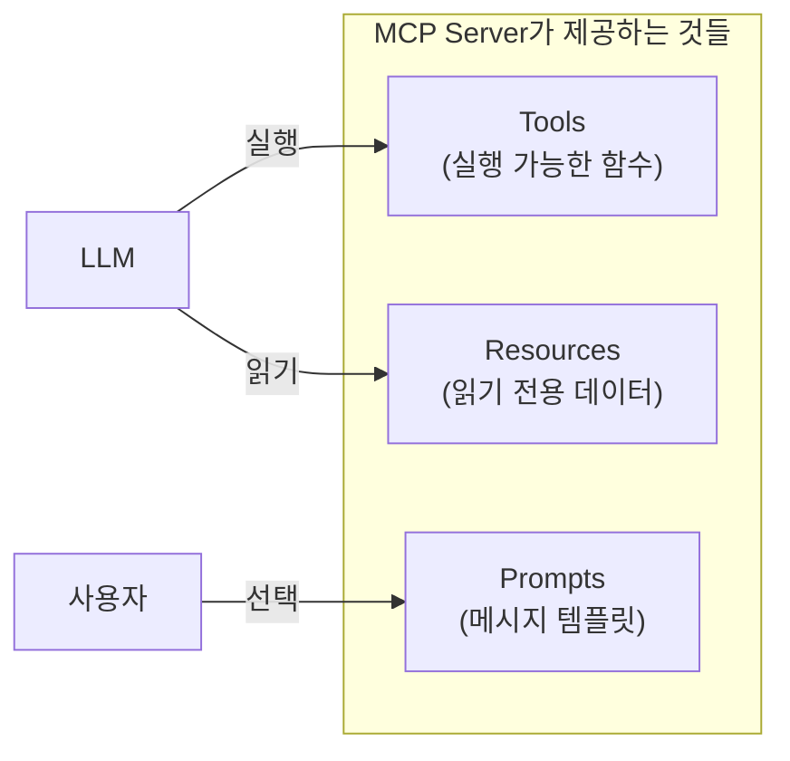

각각 어떤 역할을 하는지 살펴보겠습니다.

### Tools: LLM이 실행하는 함수

Tools는 **LLM이 직접 호출할 수 있는 함수**입니다. 데이터베이스 쿼리, API 호출, 계산 수행 등 다양한 작업을 수행할 수 있습니다.

#### Tool 발견 (Discovery)

먼저 클라이언트는 서버가 어떤 도구를 제공하는지 조회합니다.

```json
// Request
{
  "jsonrpc": "2.0",
  "id": 2,
  "method": "tools/list"
}

// Response
{
  "jsonrpc": "2.0",
  "id": 2,
  "result": {
    "tools": [
      {
        "name": "get_weather",
        "title": "Get Current Weather",
        "description": "Retrieves current weather for a location",
        "inputSchema": {
          "type": "object",
          "properties": {
            "location": {
              "type": "string",
              "description": "City name"
            }
          },
          "required": ["location"]
        }
      }
    ]
  }
}
```

응답을 보면 각 도구의 이름, 설명, 그리고 **입력 스키마**가 포함되어 있습니다. `inputSchema`는 JSON Schema 형식으로, 이 도구를 호출할 때 어떤 파라미터가 필요한지 정의합니다.

LLM은 이 정보를 바탕으로 **어떤 도구를 언제 사용할지 스스로 결정**합니다. 사용자가 "서울 날씨 알려줘"라고 하면 LLM이 `get_weather` 도구를 선택하고, `location: "Seoul"`을 파라미터로 넣어 호출하는 거죠.

#### Tool 실행

도구를 실행하는 것도 간단합니다.

```json
// Request
{
  "jsonrpc": "2.0",
  "id": 3,
  "method": "tools/call",
  "params": {
    "name": "get_weather",
    "arguments": {
      "location": "Seoul"
    }
  }
}

// Response
{
  "jsonrpc": "2.0",
  "id": 3,
  "result": {
    "content": [
      {
        "type": "text",
        "text": "Current weather in Seoul: 15°C, Partly cloudy"
      }
    ],
    "isError": false
  }
}
```

결과는 `content` 배열로 반환됩니다. 텍스트뿐만 아니라 이미지, 오디오 등 다양한 형태의 결과를 반환할 수 있습니다.

#### Model-Controlled의 의미

Tools의 가장 중요한 특징은 **Model-Controlled**라는 점입니다. 사람이 "이 도구를 써"라고 명시적으로 지시하는 게 아니라, **LLM이 상황을 판단해서 알아서 도구를 선택하고 호출**합니다.

물론 이게 가능하려면 LLM이 도구를 잘 이해해야 합니다. 그래서 `description`을 명확하게 작성하는 것이 중요합니다. "날씨를 가져옵니다" 보다는 "지정된 도시의 현재 날씨 정보(온도, 상태)를 조회합니다"처럼 구체적으로 작성하는 게 좋습니다.

#### LLM은 어떻게 MCP 도구를 알고 호출하는가?

여기서 한 가지 중요한 오해를 짚고 넘어가야 할 것 같습니다. **MCP 자체는 추론을 수행하지 않습니다**. MCP는 데이터를 주고받는 프로토콜일 뿐이고, 판단과 선택은 전적으로 Host의 LLM이 담당합니다.

그렇다면 LLM은 어떻게 MCP 도구를 "알아서" 선택하고 호출할까요? 전체 흐름을 살펴보겠습니다.

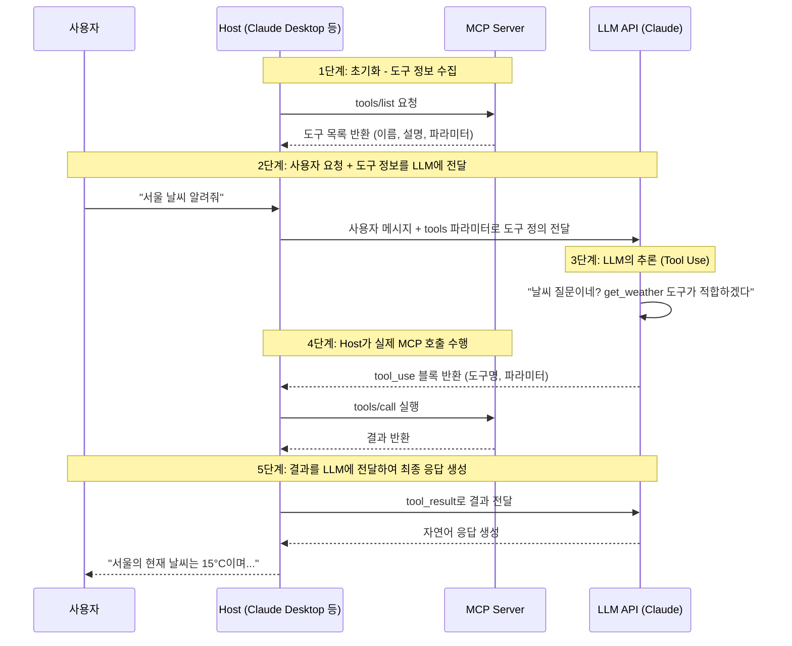

핵심은 이것입니다:

1. **Host가 도구 정보를 수집합니다**: Host(예: Claude Desktop)가 MCP Server에 `tools/list`를 호출해서 사용 가능한 도구 목록을 가져옵니다. 이 정보에는 도구 이름, 설명, 필요한 파라미터가 포함됩니다.

2. **Host가 LLM API에 도구 정의를 전달합니다**: 사용자가 메시지를 보내면, Host는 LLM API를 호출할 때 `tools` 파라미터에 수집한 도구 정의를 함께 전달합니다. Claude API를 예로 들면 이런 형태입니다:

```python
response = client.messages.create(
    model="claude-sonnet-4-20250514",
    messages=[{"role": "user", "content": "서울 날씨 알려줘"}],
    tools=[  # MCP Server에서 수집한 도구 정보
        {
            "name": "get_weather",
            "description": "지정된 도시의 현재 날씨 정보를 조회합니다",
            "input_schema": {
                "type": "object",
                "properties": {
                    "city": {"type": "string", "description": "도시 이름"}
                },
                "required": ["city"]
            }
        }
    ]
)
```

3. **LLM이 스스로 판단합니다**: LLM은 **Tool Use(또는 Function Calling)**라는 능력을 학습하고 있습니다. 사용자의 질문과 주어진 도구 목록을 보고, "이 상황에서 어떤 도구를 어떤 파라미터로 호출해야 하는가"를 추론합니다. 이건 MCP의 기능이 아니라, **LLM이 훈련을 통해 갖춘 능력**입니다.

4. **LLM은 구조화된 형태로 도구 호출을 요청합니다**: 도구를 사용하기로 결정하면, LLM은 다음과 같은 구조화된 응답을 반환합니다:

```json
{
  "type": "tool_use",
  "name": "get_weather",
  "input": {
    "city": "Seoul"
  }
}
```

5. **Host가 실제 MCP 호출을 수행합니다**: LLM은 직접 MCP Server를 호출하지 않습니다. Host가 이 `tool_use` 응답을 받아서, 실제로 MCP Server에 `tools/call` 요청을 보내고, 결과를 다시 LLM에게 전달합니다.

정리하면, **MCP는 도구를 제공하는 표준화된 파이프라인**이고, **도구 선택은 100% LLM의 추론 능력**입니다. Host는 이 둘을 연결하는 오케스트레이터 역할을 합니다.

이것이 바로 앞서 언급한 `description`이 중요한 이유입니다. LLM은 도구의 실제 구현 코드를 볼 수 없고, 오직 이름과 설명만으로 판단하기 때문입니다. 좋은 설명은 LLM이 올바른 도구를 올바른 상황에 선택하도록 도와줍니다.

익숙하지 않으신가요? 결국 추상화입니다. 우리가 프로그래밍할 때도 함수의 내부 구현을 몰라도 함수 이름과 설명만 보고 사용할 수 있잖아요? MCP 도구도 마찬가지입니다. LLM은 함수의 내부 코드를 볼 수 없고, 오직 메타데이터(이름, 설명, 입력 스키마)만으로 판단하는 거죠.

### Resources: 읽기 전용 데이터

Resources는 **서버가 제공하는 읽기 전용 데이터**입니다. 파일 내용, 데이터베이스 스키마, 설정 정보 등이 여기에 해당합니다.

```json
// 리소스 목록 조회
{
  "jsonrpc": "2.0",
  "id": 4,
  "method": "resources/list"
}

// 응답
{
  "jsonrpc": "2.0",
  "id": 4,
  "result": {
    "resources": [
      {
        "uri": "file:///project/src/main.rs",
        "name": "main.rs",
        "description": "Primary application entry point",
        "mimeType": "text/x-rust"
      }
    ]
  }
}
```

각 리소스는 **URI**로 식별됩니다. `file://`, `https://`, `git://` 등 다양한 스킴을 사용할 수 있습니다.

#### Tools vs Resources: 뭐가 다른가?

처음에는 "데이터베이스에서 데이터 읽는 것도 Tool로 하면 되지 않나?"라는 의문이 들 수 있습니다. 실제로 가능합니다. 그렇다면 왜 Resources가 따로 있을까요?

| | Tools | Resources |
|--|-------|-----------|
| **목적** | 동작 수행 (side effect 가능) | 데이터 읽기 (read-only) |
| **제어** | LLM이 자동 선택 | 애플리케이션/사용자가 선택 |
| **변경** | 데이터를 변경할 수 있음 | 변경 불가, 읽기만 |

Tools는 LLM이 스스로 판단해서 호출하지만, Resources는 보통 **애플리케이션이나 사용자가 명시적으로 선택**합니다. 예를 들어 IDE에서 "이 파일을 컨텍스트에 추가"하는 식으로요.

또한 Resources는 **구독(Subscription)** 기능을 지원합니다. 특정 리소스가 변경되면 알림을 받을 수 있죠. 파일이 수정되었을 때 자동으로 컨텍스트를 업데이트하는 데 유용합니다.

### Prompts: 재사용 가능한 템플릿

Prompts는 **사용자가 선택할 수 있는 메시지 템플릿**입니다. 자주 쓰는 프롬프트 패턴을 미리 정의해두고 재사용할 수 있습니다.

```json
// 프롬프트 조회
{
  "jsonrpc": "2.0",
  "id": 5,
  "method": "prompts/get",
  "params": {
    "name": "code_review",
    "arguments": {
      "code": "def hello():\n    print('world')"
    }
  }
}

// 응답
{
  "jsonrpc": "2.0",
  "id": 5,
  "result": {
    "description": "Code review prompt",
    "messages": [
      {
        "role": "user",
        "content": {
          "type": "text",
          "text": "Please review this Python code:\ndef hello():\n    print('world')"
        }
      }
    ]
  }
}
```

Prompts는 Tools나 Resources와 달리 **사용자 제어(User-Controlled)** 방식입니다. LLM이 알아서 선택하는 게 아니라, 사용자가 UI에서 명시적으로 선택합니다. 보통 `/` 명령어(슬래시 커맨드) 형태로 노출되죠.

### 세 기능의 상호작용

실제 사용 시나리오에서는 이 세 기능이 함께 동작합니다.

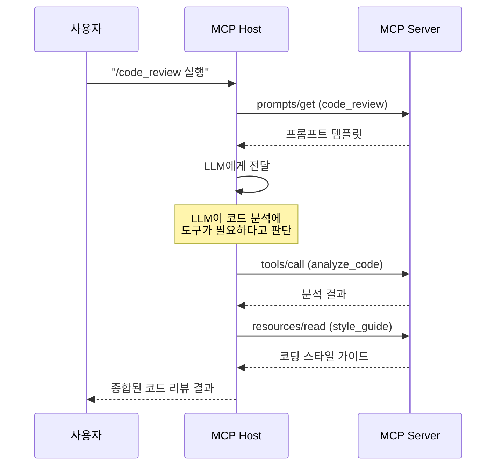

1. 사용자가 `code_review` 프롬프트를 선택
2. LLM이 코드 분석 도구를 호출
3. 스타일 가이드 리소스를 참조
4. 모든 정보를 종합해서 코드 리뷰 결과 생성

이렇게 세 기능이 유기적으로 연결되어 풍부한 AI 경험을 만들어냅니다.

## 전송 계층: stdio와 Streamable HTTP

지금까지 **무엇**을 주고받는지 살펴봤다면, 이제 **어떻게** 주고받는지 알아볼 차례입니다. MCP는 두 가지 표준 전송 방식을 정의합니다.

### stdio: 로컬 프로세스 통신

가장 간단한 방식입니다. Host가 MCP 서버를 **서브 프로세스로 실행**하고, 표준 입출력(stdin/stdout)으로 통신합니다.

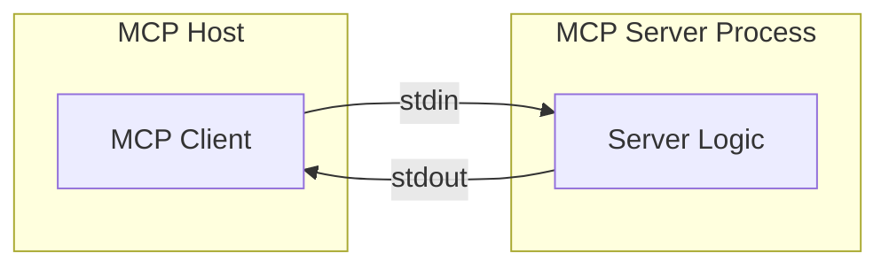

**특징:**
- 네트워크 오버헤드 없음 (같은 머신에서 실행)
- 설정이 간단함 (서버 프로그램 경로만 지정)
- 보안 설정 불필요 (로컬 통신)

Claude Desktop이나 Claude Code에서 로컬 MCP 서버를 사용할 때 이 방식을 씁니다.

```json
// Claude Desktop 설정 예시
{
  "mcpServers": {
    "my-blog": {
      "command": "python",
      "args": ["/path/to/server.py"]
    }
  }
}
```

메시지는 줄바꿈(`\n`)으로 구분합니다. 한 줄에 하나의 JSON-RPC 메시지가 들어가는 구조입니다.

### Streamable HTTP: 원격 서버 통신

원격 서버와 통신할 때는 **HTTP**를 사용합니다. 클라이언트가 HTTP POST로 메시지를 보내고, 서버는 응답을 **Server-Sent Events(SSE)** 스트림으로 반환합니다.

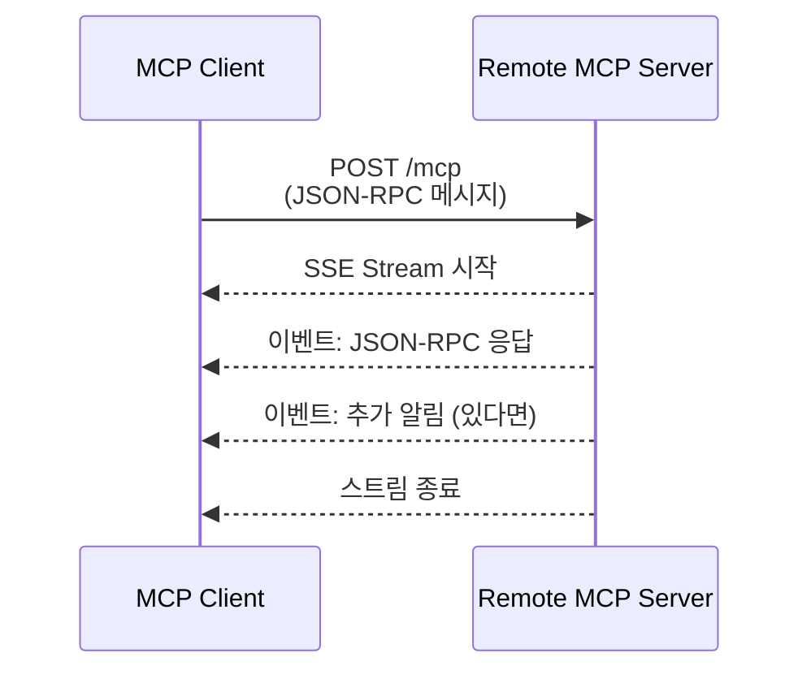

**왜 SSE를 쓰는가?**

단순 HTTP 요청/응답으로도 통신은 가능합니다. 하지만 MCP에서는 **서버가 클라이언트에게 먼저 메시지를 보내야 하는 경우**가 있습니다. 예를 들어:
- 도구 목록이 변경되었을 때 알림
- 긴 작업의 진행 상황 업데이트

SSE를 사용하면 서버가 클라이언트에게 **여러 메시지를 스트리밍**으로 보낼 수 있습니다.

#### 세션 관리

Streamable HTTP에서는 **세션** 개념이 있습니다. 초기화 시 서버가 세션 ID를 발급하고, 이후 모든 요청에 이 ID를 포함합니다.

```
// 초기화 응답 헤더
Mcp-Session-Id: abc123xyz

// 이후 요청 헤더
Mcp-Session-Id: abc123xyz
```

세션이 만료되면 서버는 HTTP 404를 반환하고, 클라이언트는 새로운 초기화를 시작해야 합니다.

#### 보안 고려사항

Streamable HTTP를 사용할 때는 **보안에 주의**해야 합니다.

- **Origin 헤더 검증**: DNS rebinding 공격 방지
- **인증 구현**: Bearer Token, API Key, OAuth 등
- **localhost 바인딩**: 로컬에서 실행할 때는 127.0.0.1에만 바인딩

특히 MCP 서버가 민감한 데이터(데이터베이스, 파일 시스템 등)에 접근할 수 있다면 인증은 필수입니다.

### 어떤 전송 방식을 선택해야 할까?

| | stdio | Streamable HTTP |
|--|-------|-----------------|
| **사용 사례** | 로컬 도구, 개인 개발 | 공유 서비스, 팀 도구 |
| **장점** | 설정 간단, 빠름 | 원격 접근, 중앙 관리 |
| **단점** | 로컬만 가능 | 네트워크 오버헤드, 보안 설정 필요 |

개인적으로 사용하는 MCP 서버라면 **stdio**로 충분합니다. 팀에서 공유하거나 여러 환경에서 접근해야 한다면 **Streamable HTTP**를 고려해볼 수 있겠죠.

## Sampling: 서버가 LLM을 호출하는 방법

지금까지는 Host(클라이언트) → Server 방향의 통신을 살펴봤습니다. 그런데 MCP에서는 **반대 방향**도 가능합니다. Server가 Host에게 LLM 호출을 요청하는 거죠.

이 기능을 **Sampling**이라고 합니다.

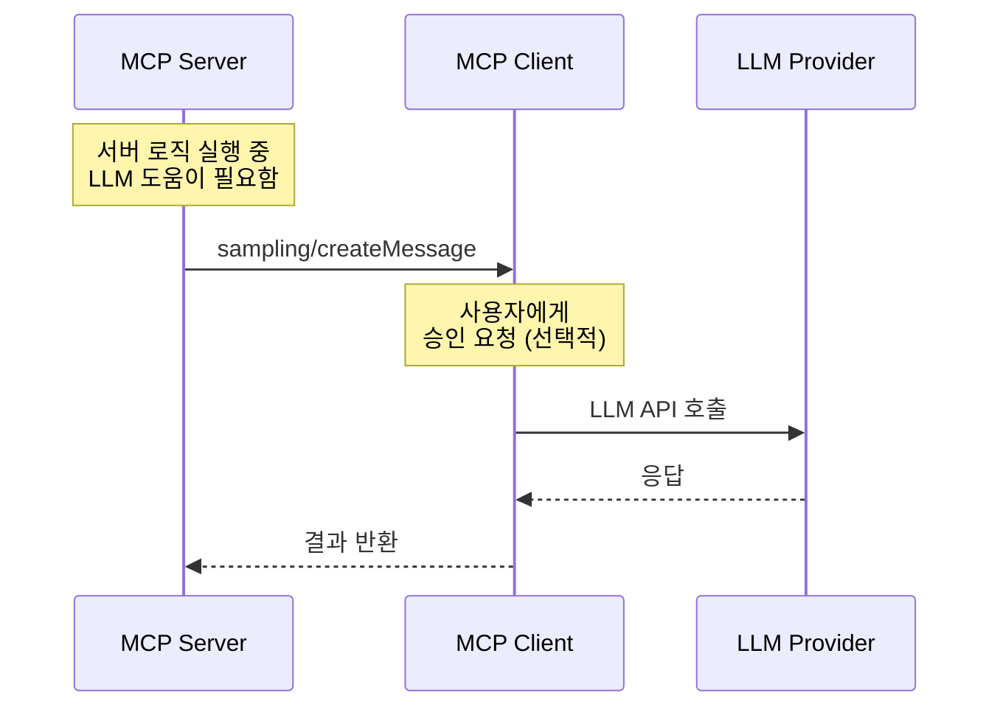

### 왜 이런 기능이 필요할까?

MCP 서버를 만들다 보면 **서버 내부에서도 LLM의 도움이 필요한 경우**가 있습니다.

예를 들어:
- 검색 결과를 요약해서 반환하고 싶을 때
- 복잡한 데이터를 자연어로 설명해야 할 때
- 서버 측에서 AI 에이전트 로직을 실행할 때

Sampling을 사용하면 서버가 직접 LLM API 키를 가질 필요가 없습니다. 서버가 직접 모델을 실행하는 것이 아니라, Host에게 모델 실행을 요청하고 결과를 받는 구조입니다.

### Sampling 요청 예시

```json
{
  "jsonrpc": "2.0",
  "id": 10,
  "method": "sampling/createMessage",
  "params": {
    "messages": [
      {
        "role": "user",
        "content": {
          "type": "text",
          "text": "Summarize this data: ..."
        }
      }
    ],
    "modelPreferences": {
      "hints": [{"name": "claude-sonnet-4"}],
      "speedPriority": 0.8
    },
    "maxTokens": 500
  }
}
```

`modelPreferences`에서 원하는 모델의 힌트를 줄 수 있지만, **최종 모델 선택은 클라이언트가** 합니다. 서버는 "빠른 모델이 좋겠다" 정도의 힌트만 줄 수 있습니다.

### 인간 개입의 중요성

MCP 스펙에서 Sampling과 관련해 **인간 개입(Human-in-the-loop)** 을 강조합니다.

> "Implementations must always include human oversight capabilities for sampling requests."

클라이언트는 Sampling 요청을 사용자에게 보여주고 승인을 받을 수 있어야 합니다. 이는 MCP 서버가 악의적으로 LLM을 남용하는 것을 방지하기 위함입니다.

실제로 Claude Desktop에서는 MCP 서버가 도구를 호출하거나 Sampling을 요청하면 사용자에게 확인을 받는 UI가 표시됩니다.

## 실시간 업데이트: Notification 시스템

MCP에서 또 하나 흥미로운 기능은 **Notification**입니다. 서버가 클라이언트에게 변경 사항을 실시간으로 알려줄 수 있습니다.

```json
{
  "jsonrpc": "2.0",
  "method": "notifications/tools/list_changed"
}
```

이 알림을 받은 클라이언트는 `tools/list`를 다시 호출해서 최신 도구 목록을 가져옵니다.

### 어떤 알림이 있나?

| 알림 | 설명 |
|-----|-----|
| `notifications/tools/list_changed` | 도구 목록이 변경됨 |
| `notifications/resources/list_changed` | 리소스 목록이 변경됨 |
| `notifications/resources/updated` | 특정 리소스 내용이 변경됨 |
| `notifications/prompts/list_changed` | 프롬프트 목록이 변경됨 |

이 기능 덕분에 **동적인 MCP 서버**를 만들 수 있습니다. 예를 들어:
- 새로운 플러그인이 설치되면 도구 목록 업데이트
- 설정 파일이 변경되면 리소스 업데이트
- 데이터베이스 스키마가 변경되면 알림

실시간 알림이 필요 없다면 이 기능을 구현하지 않아도 됩니다. 서버가 `capabilities`에서 `listChanged: true`를 선언한 경우에만 클라이언트가 알림을 기대합니다.

## 실제 서비스에서의 MCP 활용

지금까지 살펴본 예시들은 대부분 **로컬 환경**을 기준으로 했습니다. Claude Desktop에서 로컬 MCP 서버를 실행하고, stdio로 통신하는 구조였죠. 하지만 실제 프로덕션 서비스를 구축할 때는 어떨까요?

### 로컬이 아닌 서버에서의 MCP

이커머스 회사에서 AI 챗봇을 구축한다고 가정해봅시다. 챗봇이 주문 조회, 상품 검색, 재고 확인 등의 기능을 제공해야 합니다.

#### 방법 1: 커스텀 REST API 방식

MCP 없이 직접 구현하는 방식입니다. 많은 분들이 AI 챗봇 백엔드를 구축할 때 이런 식으로 하셨을 겁니다.

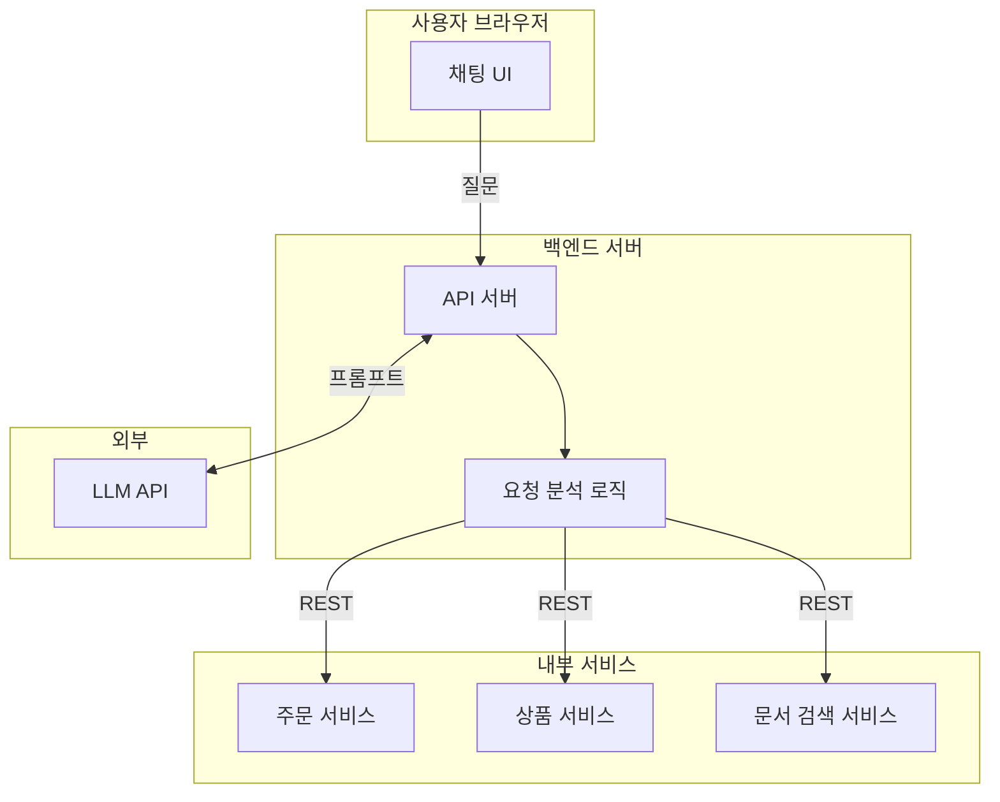

이 방식에서는:
- 백엔드가 사용자 질문을 분석해서 어떤 서비스를 호출할지 결정
- 각 서비스마다 다른 REST API 인터페이스
- 새로운 서비스를 추가할 때마다 백엔드 라우팅 로직 수정 필요

작동은 합니다. 하지만 서비스가 늘어날수록 몇 가지 문제가 생깁니다:

- **인터페이스 불일치**: 주문 서비스는 `/orders/{id}`, 상품 서비스는 `/api/products/search`... 서비스마다 API 설계가 다름
- **문서화 부담**: 각 서비스의 API 문서를 별도로 관리
- **LLM 통합 복잡성**: 각 서비스를 LLM이 이해할 수 있도록 프롬프트에 설명을 직접 작성
- **유지보수 비용**: 서비스 API가 변경되면 백엔드 라우터와 LLM 프롬프트 모두 수정 필요

#### 방법 2: MCP 표준화 방식

이제 MCP를 도입한 구조를 살펴보겠습니다.

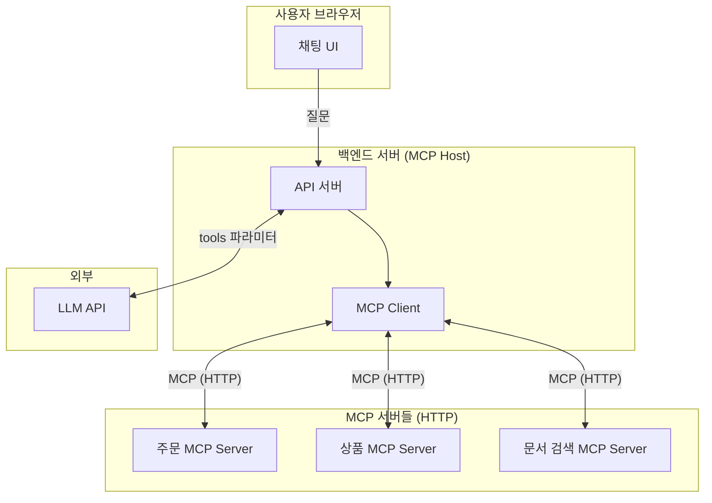

여기서 핵심적인 차이점:

1. **백엔드가 MCP Host 역할**: 사용자 요청을 받아 LLM API와 MCP 서버들을 오케스트레이션
2. **MCP 서버들은 별도 서비스로 배포**: 컨테이너, 마이크로서비스, 서버리스 등
3. **Streamable HTTP로 통신**: 로컬 stdio가 아닌 HTTP 기반 통신
4. **도구 정보 자동 수집**: 백엔드가 시작할 때 각 MCP 서버에서 `tools/list`로 도구 목록 수집

### 서비스 구조 예시

실제 코드로 어떻게 구성되는지 살펴보겠습니다.

#### MCP 서버: 주문 조회 서비스

```python
# order-mcp-server/server.py
from mcp.server import Server
from mcp.server.stdio import stdio_server
from mcp.types import Tool, TextContent

server = Server("order-service")

@server.list_tools()
async def list_tools():
    return [
        Tool(
            name="get_order",
            description="주문 ID로 주문 상세 정보를 조회합니다. 주문 상태, 상품 목록, 배송 정보를 반환합니다.",
            inputSchema={
                "type": "object",
                "properties": {
                    "order_id": {"type": "string", "description": "주문 ID (예: ORD-12345)"}
                },
                "required": ["order_id"]
            }
        ),
        Tool(
            name="cancel_order",
            description="주문을 취소합니다. 배송 전 상태의 주문만 취소 가능합니다.",
            inputSchema={
                "type": "object",
                "properties": {
                    "order_id": {"type": "string"},
                    "reason": {"type": "string", "description": "취소 사유"}
                },
                "required": ["order_id"]
            }
        )
    ]

@server.call_tool()
async def call_tool(name: str, arguments: dict):
    if name == "get_order":
        order = await db.get_order(arguments["order_id"])
        return [TextContent(type="text", text=json.dumps(order))]
    elif name == "cancel_order":
        result = await db.cancel_order(arguments["order_id"], arguments.get("reason"))
        return [TextContent(type="text", text=f"주문이 취소되었습니다: {result}")]
```

#### 백엔드 서버: MCP Host 역할

```python
# backend/main.py
from mcp import ClientSession
from anthropic import Anthropic

class ChatbotBackend:
    def __init__(self):
        self.anthropic = Anthropic()
        self.mcp_servers = {
            "order": "https://order-mcp.internal:8080/mcp",
            "product": "https://product-mcp.internal:8080/mcp",
            "docs": "https://docs-mcp.internal:8080/mcp"
        }
        self.tools = []

    async def initialize(self):
        """시작 시 모든 MCP 서버에서 도구 정보 수집"""
        for name, url in self.mcp_servers.items():
            async with ClientSession(url) as session:
                await session.initialize()
                tools = await session.list_tools()
                self.tools.extend(tools)

    async def handle_message(self, user_message: str):
        # 1. LLM API 호출 (수집한 도구 정보와 함께)
        response = self.anthropic.messages.create(
            model="claude-sonnet-4-20250514",
            messages=[{"role": "user", "content": user_message}],
            tools=self._convert_to_anthropic_tools(self.tools)
        )

        # 2. LLM이 도구 사용을 요청하면 해당 MCP 서버에 호출
        while response.stop_reason == "tool_use":
            tool_results = []
            for block in response.content:
                if block.type == "tool_use":
                    result = await self._call_mcp_tool(block.name, block.input)
                    tool_results.append({
                        "type": "tool_result",
                        "tool_use_id": block.id,
                        "content": result
                    })

            # 3. 결과를 다시 LLM에 전달
            response = self.anthropic.messages.create(
                model="claude-sonnet-4-20250514",
                messages=[
                    {"role": "user", "content": user_message},
                    {"role": "assistant", "content": response.content},
                    {"role": "user", "content": tool_results}
                ],
                tools=self._convert_to_anthropic_tools(self.tools)
            )

        return response.content[0].text

    async def _call_mcp_tool(self, tool_name: str, arguments: dict):
        """도구 이름으로 해당 MCP 서버를 찾아 호출"""
        server_url = self._find_server_for_tool(tool_name)
        async with ClientSession(server_url) as session:
            await session.initialize()
            result = await session.call_tool(tool_name, arguments)
            return result
```

### MCP 표준화의 이점

이렇게 MCP를 도입하면 어떤 이점이 있을까요?

**1. 일관된 인터페이스**

모든 서비스가 동일한 MCP 프로토콜을 따릅니다. `tools/list`로 도구 목록을 조회하고, `tools/call`로 호출합니다. 서비스마다 다른 REST API 설계를 고민할 필요가 없습니다.

**2. 자기 설명적 (Self-describing)**

각 MCP 서버가 자신의 기능을 `description`과 `inputSchema`로 설명합니다. 백엔드에서 별도로 "주문 서비스는 이런 기능이 있고..."라고 프롬프트에 작성할 필요가 없습니다. LLM API 호출 시 도구 정보를 그대로 전달하면 됩니다.

**3. 독립적인 배포**

각 MCP 서버는 독립적으로 배포하고 업데이트할 수 있습니다. 주문 서비스에 새로운 기능을 추가해도, 백엔드는 `tools/list`를 다시 호출하면 자동으로 새 도구를 인식합니다.

**4. 생태계 호환성**

MCP는 오픈 표준입니다. 사내에서 만든 MCP 서버를 Claude Desktop에서도 그대로 사용할 수 있고, 다른 MCP 호환 클라이언트에서도 사용할 수 있습니다.

**5. 관심사의 분리**

- MCP 서버: 비즈니스 로직에 집중 (주문 조회, 취소 등)
- 백엔드: 오케스트레이션에 집중 (사용자 인증, MCP 연결, LLM 호출)
- LLM: 추론에 집중 (사용자 의도 파악, 도구 선택)

### 구체적으로 뭐가 달라지는데?

솔직히 위의 장점들만 보면 "그래서 뭐?" 싶을 수 있습니다. 구체적인 시나리오로 비교해보겠습니다.

**시나리오: "환불 조회" 기능 추가**

| 단계 | REST 방식 | MCP 방식 |
|-----|----------|---------|
| 1 | 환불 API 개발 | 환불 MCP 도구 개발 |
| 2 | API 문서 작성 (Swagger 등) | *(도구 정의가 곧 문서)* |
| 3 | 백엔드 라우터에 새 경로 추가 | *(불필요)* |
| 4 | LLM 프롬프트에 도구 설명 추가 | *(tools/list가 자동 수집)* |
| **수정 포인트** | **4곳** | **1곳** |

차이가 보이시나요? MCP에서는 **도구 정의 하나가 문서이자 인터페이스이자 LLM 프롬프트**입니다. 이것이 바로 **Single Source of Truth**입니다.

도구가 3개일 때는 별 차이 없어 보여도, 도구가 30개가 되면 이야기가 달라집니다. REST 방식에서는 30개 × 4곳 = 120곳을 관리해야 하지만, MCP에서는 30곳만 관리하면 됩니다.

#### 소프트웨어 설계 원칙과의 연결

이 글을 쓰면서 저는 느낀 게 있는데요, MCP의 설계 철학이 우리가 알고 있는 좋은 소프트웨어 설계 원칙과 맞닿아 있다는 점입니다.

- **추상화**: LLM은 구현을 모르고 인터페이스(이름, 설명, 스키마)만 봄
- **단일 책임 원칙(SRP)**: 각 MCP 서버는 하나의 도메인만 담당
- **개방-폐쇄 원칙(OCP)**: 새 도구 추가 시 기존 코드 수정 없이 확장
- **의존성 역전(DIP)**: 구현이 아닌 프로토콜(인터페이스)에 의존

결국 MCP가 해결하려는 문제는 새로운 게 아닌 것 같습니다. **"변경에 유연하고 유지보수하기 쉬운 시스템"** — 우리가 늘 추구하던 그 목표를 AI 도구 통합 영역에 적용한 것이 아닌가 싶습니다.

### 배포 아키텍처 예시

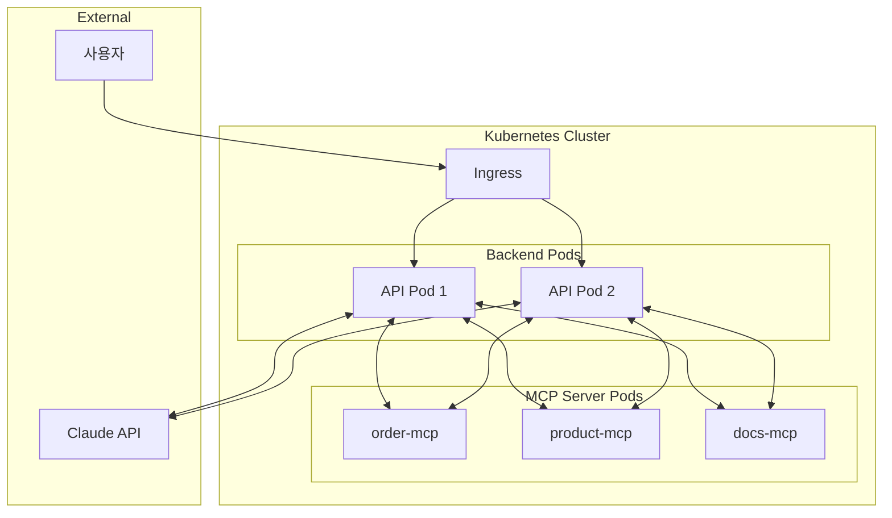

MCP 서버들은:
- Kubernetes Pod로 배포
- 내부 서비스로 노출 (외부에서 직접 접근 불가)
- Streamable HTTP로 통신
- 각각 독립적으로 스케일링 가능

### 언제 MCP를 도입해야 할까?

물론 모든 서비스에 MCP가 필요한 건 아닙니다.

**MCP가 유용한 경우:**
- 여러 AI 기능(챗봇, 검색, 추천 등)에서 같은 백엔드 서비스를 사용할 때
- 새로운 기능이 자주 추가되고 LLM이 자동으로 인식해야 할 때
- 팀 간에 AI 도구를 표준화하고 공유하고 싶을 때
- 로컬 개발(stdio)과 프로덕션(HTTP)에서 같은 서버 코드를 사용하고 싶을 때

**MCP가 과할 수 있는 경우:**
- 단일 AI 기능만 있고, 도구가 1-2개뿐일 때
- 빠르게 MVP를 만들어야 할 때 (직접 REST API 호출이 더 간단)
- 팀에 MCP 학습 비용을 투자할 여유가 없을 때

결국 **표준화의 이점이 도입 비용을 상쇄하는지**가 핵심입니다. 서비스가 성장하고 AI 기능이 늘어날수록 MCP의 가치는 커지지만, 처음부터 과도하게 설계할 필요는 없습니다.

## MCP의 한계와 보안 고려사항

지금까지 MCP의 구조와 기능을 살펴봤습니다. 하지만 모든 기술이 그렇듯 MCP도 완벽하지는 않습니다.

### 보안 취약점

2025년 4월, 보안 연구자들이 MCP의 여러 보안 이슈를 발표했습니다.

- **Prompt Injection**: 악의적인 입력이 LLM의 동작을 조작
- **Tool Permission**: 여러 도구를 조합해서 파일 유출 가능
- **Lookalike Tools**: 신뢰된 도구와 비슷한 이름의 악성 도구

또한 2025년 7월 연구에서는 **인터넷에 노출된 MCP 서버 2,000개 중 상당수가 인증 없이 접근 가능**했다는 결과가 나왔습니다.

이런 문제들 때문에 MCP를 사용할 때는 보안에 특히 신경 써야 합니다.

### 권장 보안 사례

**서버 측:**
- 모든 입력 값 검증
- 적절한 접근 제어 구현
- Rate Limiting 적용
- 민감한 데이터 필터링

**클라이언트 측:**
- 민감한 작업에 사용자 확인 요청
- 도구 호출 전 입력 값 표시
- 도구 실행 로깅
- 타임아웃 설정

특히 MCP 서버가 파일 시스템이나 데이터베이스에 접근한다면, **최소 권한 원칙**을 적용하는 것이 중요합니다.

### 복잡성

MCP를 도입하면 시스템 복잡성이 증가합니다. Host, Client, Server, 전송 계층, 초기화 과정, 기능 협상... 알아야 할 것들이 많습니다.

단순히 하나의 외부 API를 연동하는 게 목적이라면, MCP 없이 직접 통합하는 게 더 간단할 수 있습니다. **표준화의 이점이 복잡성을 상쇄할 만큼 충분한지** 판단해야 합니다.

제 생각에는 다음과 같은 경우에 MCP가 유용할 것 같습니다:
- 여러 AI 애플리케이션에서 같은 서버를 사용하고 싶을 때
- 다양한 외부 시스템을 통합해야 할 때
- 팀에서 공통 도구를 표준화하고 싶을 때

반면 이런 경우에는 MCP가 과할 수 있습니다:
- 단일 애플리케이션에서만 사용하는 간단한 통합
- 빠르게 프로토타입을 만들어야 할 때
- 팀에 MCP 학습 여유가 없을 때

## 정리

이번 글에서 MCP의 구조와 동작 원리를 살펴보았습니다. 정리하면:

1. **MCP는 AI와 외부 시스템을 연결하는 표준 프로토콜**입니다. USB-C처럼 하나의 표준으로 다양한 연결을 가능하게 합니다.

2. **Host-Client-Server 아키텍처**로 관심사가 분리되어 있습니다. 덕분에 서버 하나를 만들면 여러 AI 애플리케이션에서 재사용할 수 있습니다.

3. **JSON-RPC 2.0 기반**으로 통신합니다. Request, Response, Notification 세 가지 메시지 타입으로 모든 상호작용이 이루어집니다.

4. **Tools, Resources, Prompts** 세 가지 핵심 기능을 제공합니다. 각각 실행 가능한 함수, 읽기 전용 데이터, 재사용 가능한 템플릿 역할을 합니다. MCP 자체는 지능이 없으며, **도구 선택은 LLM의 Tool Use 능력**에 의해 이루어집니다.

5. **stdio와 Streamable HTTP** 두 가지 전송 방식을 지원합니다. 로컬 개발에는 stdio, 원격 서비스에는 HTTP를 사용합니다.

6. **프로덕션 서비스에서도 활용 가능**합니다. 백엔드가 MCP Host 역할을 하고, MCP 서버들을 별도 서비스로 배포하면 됩니다. 커스텀 REST API 대비 표준화, 자기 설명적 인터페이스, 독립 배포 등의 이점이 있습니다.

7. **Sampling**을 통해 서버도 LLM을 호출할 수 있습니다. 단, 인간 개입이 가능해야 합니다.

8. **보안에 주의**해야 합니다. 인증, 입력 검증, 권한 관리가 중요합니다.

MCP는 아직 발전 중인 프로토콜입니다. 스펙도 계속 업데이트되고 있고, 생태계도 성장하고 있습니다.

이 글을 정리하면서 느낀 점이 있습니다. MCP가 해결하려는 문제는 사실 새로운 게 아니었던 것 같습니다. **추상화, 관심사의 분리, 인터페이스 기반 설계** — 우리가 좋은 소프트웨어를 만들기 위해 오랫동안 고민해온 원칙들이 AI 도구 통합이라는 새로운 영역에 적용된 것뿐이라는 생각이 듭니다.

결국 좋은 설계란 시대가 바뀌어도 본질은 같은 것 같습니다. MCP를 공부하면서 오히려 기본기의 중요성을 다시 느꼈습니다.

긴 글 읽어주셔서 감사합니다. 이 글이 MCP를 이해하는 데 조금이나마 도움이 되었길 바랍니다.

---

## 참고 자료

### 공식 문서

- [Model Context Protocol - Introduction](https://modelcontextprotocol.io/introduction)
- [MCP Specification](https://spec.modelcontextprotocol.io/specification/)
- [MCP Architecture](https://modelcontextprotocol.io/docs/concepts/architecture)
- [MCP Transports](https://modelcontextprotocol.io/docs/concepts/transports)

### Anthropic 발표

- [Introducing the Model Context Protocol - Anthropic](https://www.anthropic.com/news/model-context-protocol)

### 관련 글

- [LLM을 내 두 번째 뇌로 만들기: MCP 서버로 개인 블로그를 RAG로 활용하는 방법]()
- [RPC 제대로 이해하기: JSON-RPC, gRPC, 그리고 흔한 오해들]() - MCP가 사용하는 JSON-RPC에 대한 상세 설명

### 추가 자료

- [Model Context Protocol - Wikipedia](https://en.wikipedia.org/wiki/Model_Context_Protocol)
- [JSON-RPC 2.0 Specification](https://www.jsonrpc.org/specification)
