Hi, I'm Jeongil Jeong, a 3-year backend developer working at a proptech platform.

> **TL;DR**<br>
> I automated 3AM error alert responses with OpenClaw.<br>
> Using Loki/Tempo polling + Telegram Forward hybrid approach, AI handles everything from error analysis to PR creation, while humans only review code.

AI agents are increasingly becoming central to how developers collaborate these days.

Looking at developer communities, all the hot keywords are related to AI and AI agents. According to [GitHub's 2024 Developer Survey](https://github.blog/news-insights/research/survey-ai-wave-grows/), **over 97% of 2,000 developers** from the US, Brazil, India, and Germany reported using AI coding tools, and **59-88% of organizations** are allowing or actively encouraging AI tool usage.

While many companies were hesitant to adopt AI tools due to security, privacy, and accuracy concerns, more companies are now adopting AI agents like GitHub Copilot and Claude Code. AI has evolved beyond simple "code completion" to **autonomously reading files, executing commands, modifying code, and creating PRs**.

In this context, I started thinking about how to delegate repetitive tasks to AI and focus on what really matters.

This post is about how I **automated error alert responses** using AI agents.

## The Daily Life of Service Operations: Wrestling with Error Alerts

If you're operating a service, you've probably experienced your phone ringing at unpredictable times—3 AM, 7 PM, 10 AM—everyone's been there at least once.

```
🚨 legacy-service - ERROR LOG!!! is Firing
Description: Pls Check it ASAP
```

When this alert comes, I rub my eyes, open my laptop, check the Grafana dashboard, dig through error logs in Loki, find the trace_id to track request flow in Tempo, and analyze the codebase to find the root cause.

```mermaid
flowchart LR
    A["🚨 Error Alert"] --> B["Check Loki Logs"]
    B --> C["Trace in Tempo"]
    C --> D["Analyze Code"]
    D --> E["Identify Root Cause"]
    E --> F["Create Issue/Ticket"]
    F --> G["Fix Code"]
    G --> H["Create PR"]
```



**30 minutes to 1 hour.** Even for simple bugs, it takes this long. Complex cases take much longer.

This process is probably common for any developer operating a service. The tools and templates might differ slightly between companies and services, but the overall framework is similar.

So here's the question: **Can AI do this instead?**

Handling errors with the same pattern repeatedly, I had this thought. Checking logs, tracing, analyzing code... these steps are standardized. Can't AI do this? This question started everything.

## Defining the Challenges

First, I broke down what I normally do. To know how to automate, I need to know what I'm doing first.

First, **I check error logs when they come in.**

"Checking" here includes two things: **detecting** the error alert when it arrives, and **querying** Loki/Tempo to retrieve and understand the related logs and traces.

Next, I need to explore the codebase based on error logs to **analyze the cause** and **identify the error point**. The challenge is that our company's service is built on a microservice architecture, so I often need to look at not just the service where the error occurred, but also related services.

And finally, **create issues/tickets → fix code → create PR**.

So, for AI to complete all these tasks instead of me, here are the challenges:

1. Error detection
2. Log/trace querying
3. Root cause analysis and error point identification
4. Issue/ticket creation
5. Code fixing
6. PR creation

## First Attempt: Semi-Automation with MCP

So initially, I created a tool called **[error-autopilot](https://github.com/12OneTwo12/error-autopilot-mcp)** using MCP (Model Context Protocol).

```mermaid
flowchart LR
    subgraph MCP["MCP-based Semi-Automation"]
        Human["👨‍💻 Developer"] -->|"Manual Trigger<br/>(/autopilot)"| Claude["Claude Code"]
        Claude <-->|"JSON-RPC"| Server["error-autopilot<br/>MCP Server"]
        Server --> Loki["Loki"]
        Server --> Tempo["Tempo"]
        Claude -->|"Analysis Result"| Issue["GitHub Issue"]
    end
```



It was a tool where the MCP server called Loki/Tempo APIs to query logs. When a developer typed the `/autopilot` command to the agent, the MCP server would query and analyze error logs and traces from Loki/Tempo.

This made **log querying and trace analysis** possible. But how about the third challenge, **root cause analysis and error point identification**?

I used a somewhat brute-force method. Since it was an MCP just for me, I let Claude Code read the codebase I already had locally.

I used the MCP Skills feature to map codebase paths of services to explore after checking error logs. This way, even with a microservice architecture, I could read code from all related services.

I identified related services through Tempo (APM) and read and analyzed code through pre-mapped codebase paths.

```markdown
| Service Name | Local Codebase Path | GitHub Repo |
|---------|----------------|-------------|
| example-user-service | /Users/jeongjeong-il/Desktop/projects/example-user-service | 12OneTwo12/example-user-service |
| example-order-service | /Users/jeongjeong-il/Desktop/projects/example-order-service | 12OneTwo12/example-order-service |
```

After analyzing the codebase and identifying the cause, it would create a GitHub issue.

It was quite useful. The time spent digging through logs was significantly reduced.

### MCP Action Screen

|                       Trigger                        |                        Action                        |                        Result                        | Created ISSUE |
| :----------------------------------------------------------: | :----------------------------------------------------------: | :----------------------------------------------------------: | :----------------------------------------------------------: |
|  |  |  |  |

### But the Limitations Were Clear

As I used it, I started noticing shortcomings. The problem was **manual triggering**.

When an alert came, I had to manually type the `/autopilot` command or say something like "check error logs." Log querying and analysis were automated, but **I still had to start it manually**.

**The first of the six challenges, "error detection," wasn't automated.**

It wasn't really automation. It was "semi"-automation. For complete automation, AI needed to detect errors on its own and start the process.

## Discovering OpenClaw: Notifications as Triggers

Then I discovered [OpenClaw](https://github.com/openclaw/openclaw), a very hot topic in developer communities recently.

OpenClaw is an open-source LLM-based personal assistant that runs locally with access to shell, file system permissions, and computer control capabilities.

Think of it as "an AI assistant installed on your computer." But what's different from existing AI agents? Claude Code also runs locally, right? It also has shell and file system access.

OpenClaw's real differentiator is that it's **in 24/7 standby mode, detecting messages in real-time from Telegram, Slack, Discord, etc.** (assuming your local machine stays on).

```
Telegram ──┐
WhatsApp ──┤
Slack    ──┼──▶ [ Gateway ] ──▶ AI Model (Claude/OpenAI)
Discord  ──┤         │
Web UI   ───┘         ▼
                 Files, Browser,
                 Command Execution, etc.
```

- **Gateway**: Central process managing all channel connections
- **Workspace**: The AI agent's "home" (`~/.openclaw/workspace/`)
- **Skills**: Workflows defined in markdown

Traditional agents required me to type commands for AI to respond. But OpenClaw **automatically responds when a message arrives**.

You might have already noticed—this means **error alert → AI agent auto-analysis → PR creation** complete automation becomes possible.

```mermaid
flowchart LR
    subgraph Before["MCP (Semi-Automation)"]
        Alert1["Grafana Alert"] --> TG1["Telegram"]
        TG1 --> Human1["👨‍💻 Developer"]
        Human1 -->|"Manual Trigger"| AI1["AI"]
    end

    subgraph After["OpenClaw (Full Automation?)"]
        Alert2["Grafana Alert"] --> TG2["Telegram"]
        TG2 -->|"Auto Trigger"| AI2["AI Agent"]
        AI2 --> PR["PR Creation"]
    end
```



With this setup, when a Grafana Alert sends an alert to a specific messenger, **the message itself becomes the trigger**, and the agent can automatically start analysis, fix code, and create a PR without human intervention.

## Implementation Attempt: Grafana Alert as Trigger

I jumped right into implementation. Here are the key points of how I built error-autopilot with OpenClaw.

First, I defined a persona in `~/.openclaw/workspace/`.

OpenClaw asks you to define your name or persona when you first start it.


After defining the identity, it automatically generates these files. I named mine "Son of Victor," inspired by "Son of Anton" from the TV show Silicon Valley. :)

```
~/.openclaw/workspace/
├── SOUL.md        # Personality and tone
├── USER.md        # User information
├── IDENTITY.md    # Name and identity
├── BOOTSTRAP.md   # Read and deleted on first run
├── MEMORY.md      # Long-term memory
├── memory/        # Daily notes
└── skills/        # Workflow definitions
```


After this basic setup, I moved on to **setting up message channels** and **defining the error auto-analysis Skill**.

Since our company's Grafana Alerts were already configured to send to Telegram, I created a Telegram bot for OpenClaw and connected it.

### 1. Telegram Channel Setup

I also connected the Grafana Alert dedicated group in Telegram to OpenClaw.

```json
{
  "channels": {
    "telegram": {
      "groups": {
        "-100XXXXXXXXXX": {
          "enabled": true,
          "requireMention": false
        },
        "-100YYYYYYYYYY": {
          "enabled": true,
          "requireMention": false
        }
      }
    }
  }
}
```

Setting `requireMention: false` means OpenClaw responds immediately when a message arrives in the group, without needing a mention.

The plan was simpler than expected:

1. Grafana sends error alert to Telegram group
2. OpenClaw detects message
3. Automatically executes error-autopilot Skill
4. Identifies error cause and creates issue/PR

### 2. Skill Definition

In OpenClaw, workflows are defined as **markdown documents (Skills)**.

You don't need to create a TypeScript server like MCP. Just one markdown file.

```markdown
# Error Autopilot Skill

## Trigger
- Cron Job (auto-run every 30 minutes)
- Or manual forward from Telegram

## Workflow

### 1. Fetch logs from Loki and Tempo
# Query errors since last check time
START_TIME=$(jq -r '.lastCheckTime.dev' memory/error-autopilot-state.json)

# DEV environment
curl -s "https://example.com/loki/loki/api/v1/query_range" \
  -H "X-Scope-OrgID: default" \
  --data-urlencode 'query={deployment_environment="dev"} |~ "error|ERROR" | level=~"error|ERROR"' \
  --data-urlencode "start=${START_TIME}000000" \
  --data-urlencode "end=$(date +%s)000000000" \
  --data-urlencode "limit=20"


When new error found:
1. Extract trace_id
2. Check if trace_id already processed (`processedTraceIds`)
3. Start analysis if new error

### Step 1: Parse Error
- Extract service name, trace_id, error message from logs
- Check environment (dev/prod)

### Step 2: Query Tempo Trace (Required!)
⚠️ **Don't skip this step!** Don't just guess from Loki logs.

#### Dev Environment
curl -s "https://dev.example.com/tempo/api/traces/${TRACE_ID}" \
  -H "X-Scope-OrgID: default"

##### Prod Environment
curl -s "https://prod.example.com/tempo/api/traces/${TRACE_ID}" \
  -H "X-Scope-OrgID: default"

### 2. Analyze codebase
Find error occurrence point in local codebase through service mapping

| Service | Local Path | GitHub Repo |
|---------|-----------|-------------|
| example-user-service | /path/to/example-user | 12OneTwo12/example-user-service |

### 3. Create GitHub Issue
Create issue via gh CLI

### 4. Decide on auto-fix
**No Auto-fix Conditions:**
- Business logic related
- Multiple file modifications needed
- Security related
- Uncertain cases

**Auto-fix Possible:**
- Simple NPE (clear null check location)
- Obvious validation missing
- Typos or config errors

### 5. Create PR (if approved)
Create branch → Fix code → Commit & Push → Create PR
```

AI reads this guide and executes it step by step.

## Testing: Does It Work as Expected?

After completing the setup, I tested it. I triggered a simple validation failure exception and sent a message directly to the Telegram group.

```
🚨 chat-service - ERROR LOG!!!
Description: Pls Check it ASAP
```

**OpenClaw responded immediately.** It queried Loki, analyzed code, created a GitHub issue, identified the cause, and generated a PR.


It worked perfectly in the test environment. Now it was time to see how it would behave when a real error occurred.

## Real World: Telegram Bot API Limitations

A few days later, an actual error occurred.

A Grafana exception alert came to Telegram:
```
🚨 legacy-service - ERROR LOG!!! is Firing
Description: Pls Check it ASAP
```

But **Son of Victor (OpenClaw) didn't respond.**

It definitely worked in testing, so why not in the real environment? I checked the settings again. No problems. I opened OpenClaw logs. It hadn't received any messages.

I started checking the differences between test and real environments one by one. Message format was the same, Telegram group ID was the same... the only difference was the sender.

### Problem Found: Telegram Bot Inter-Communication Restriction

I found the reason in the documentation.

**Telegram Bot API cannot receive messages sent by other bots.**

```
Grafana Bot --[Send Message]--> Telegram Group
                                      ↓
                          OpenClaw Bot (Cannot Receive ❌)

Human --[Send Message]--> Telegram Group
                              ↓
                  OpenClaw Bot (Can Receive ✅)
```

My test message was sent by a "human," so it worked. The real alert from Grafana bot was sent by a "bot," so it didn't work.

Checking the [Telegram Bot API official documentation](https://core.telegram.org/bots/api#available-types), this was an intentional security policy. It was designed to prevent infinite loops and spam between bots. A natural choice for security, but it threatened my plan.

---

## Finding Solutions: Real-time vs Polling

With Telegram triggers blocked, I needed to find another way. I checked Slack and Discord, but they had similar restrictions. Slack's framework filters bot messages, and Discord restricts bot-to-bot communication. Switching messengers wasn't a fundamental solution.

There were two main approaches:

**1. Webhook Approach (Real-time)**
Grafana sends webhooks directly when errors occur. Add OpenClaw webhook endpoint to Grafana Contact points. This requires either exposing the local environment via **Tailscale Funnel** or **cloud deployment** with AWS Lambda, Cloud Run, etc.

**2. Polling Approach (Delayed)**
Periodically query Loki/Tempo directly. Like a CronJob.

But I wondered if real-time triggering was really necessary. Even if an error occurs at 3 AM, I'll check it in the morning anyway. Do I really need to insist on real-time?

I compared the two approaches:

| Approach | Response Time | Cost | Security | Implementation Difficulty |
|------|-------------------|------|------|-------------|
| **Polling** | Delayed by Cron interval | Free | Safe | Low |
| **Webhook + Tailscale Funnel** | Real-time | Free | External exposure risk | Medium |
| **Webhook + Cloud Deployment** | Real-time | $5-20/month | Management required | High |

**Polling Approach**
- Check Loki/Tempo directly at Cron intervals
- Start processing when new error found
- No external exposure, safe local execution

**Webhook + Tailscale Funnel**
- Expose local environment to internet to receive Grafana webhooks
- Real-time triggering possible but security risks
- Using [Tailscale Funnel](https://tailscale.com/kb/1223/tailscale-funnel/) to expose local is convenient, but once OpenClaw is accessible on the public internet, there are risks like prompt injection or brute-force API calls through malicious webhook requests.

**Webhook + Cloud Deployment**
- Deploy server to cloud to receive Grafana webhooks
- Real-time triggering possible but costs incurred
- Infrastructure management and security setup required

### Choosing Polling Approach

The Tailscale Funnel approach had significant security risks. I could be exposed to various threats like prompt injection, token brute-force, DDoS attacks, so I ruled it out.

The remaining options were cloud deployment or polling. Since real-time wasn't essential, considering cost and management, I chose the **polling approach**.

## Final Implementation: Periodic Checks with Cron Job

Having decided on polling, I needed to figure out how to implement it.

Looking at OpenClaw documentation, it provided two methods for periodic task execution.

### Implementation Approach Comparison

**1. Heartbeat (Built-in OpenClaw)**

The main process wakes itself up.

```json
// agents.json
{
  "agents": {
    "defaults": {
      "heartbeat": {
        "intervalMs": 1800000  // 30 minutes
      }
    }
  }
}
```

The advantage is simple configuration and management within the OpenClaw process.

The disadvantage is that when the OpenClaw process terminates, it stops too, and requires manual restart after local PC reboot.

**2. Cron Job (External Scheduler)**

Cron Job is like an external independent alarm waking you up.

```bash
# OpenClaw cron setup
cron add --schedule "*/30 * * * *" --task "Check errors in Loki and run error-autopilot"
```

The advantage is that even if the OpenClaw main session dies, Cron Job stays alive and continues running, operating independently in an isolated session, making it more stable.

The disadvantage is slightly more complex configuration and separate Cron Job management needed. However, OpenClaw provides UI for managing Cron Jobs, so it wasn't too difficult.

### Selection Rationale

Initially, Heartbeat seemed attractive because it was simple. Just a few lines of configuration.

But the fact that it would run on a local PC was concerning. What if I accidentally terminated OpenClaw? Heartbeat stops too. Then automation becomes meaningless.

So I **chose Cron Job**. A bit more complex, but more stable since it runs independently of the OpenClaw process. And I set the Cron interval to 30 minutes to check errors every 30 minutes.

Running Cron too frequently could incur high token costs, so I judged 30-minute intervals to be appropriate.

But the 30-minute delay still bothered me. It felt insufficient for complete automation. After some thought, I realized a **hybrid approach** could work.

```mermaid
flowchart LR
    subgraph "Normal Situation (Auto)"
        Cron1["⏰ Every 30 min<br/>Cron Job"] --> Auto["Auto Process"]
    end

    subgraph "Urgent Situation (Manual)"
        Alert["📱 Error Alert<br/>Check"] --> Forward["Message<br/>Forward"] --> Manual["Immediate Process"]
    end
```




**Normal Situation**: Auto-process every 30 minutes via polling
**Urgent Situation**: Immediate processing by forwarding message in Telegram group

### Telegram Forward Mechanism

Telegram has a security policy that blocks bot-to-bot messages. OpenClaw bot can't directly receive messages sent by Grafana bot.

But what if **a human forwards a message sent by a bot?**

From Telegram's perspective, it becomes a message sent by a human. So OpenClaw can receive it.

```
Grafana Bot → [🚨 Error!] → Telegram Group
                                ↓
                           Human Forwards
                                ↓
                           OpenClaw Bot ✅ Can Receive
```

Checking the [Telegram Bot API official documentation](https://core.telegram.org/bots/api#message), forwarded messages have a `forward_from` field, but the message sender becomes the person who executed the forward. In other words, it's not bypassing the bot-to-bot blocking policy, but rather **considered a legitimate use case because explicit human action is involved**.

This way, normal situations use 30-minute polling for cost-efficient and secure auto-processing, while urgent situations allow humans to request immediate processing via forward.

### Real-World Operation Scenarios

**Scenario 1: Auto-Processing (Normal Case)**
When an error occurs in DEV environment at 3 AM:
- **3:00** - Grafana sends Telegram alert (immediate human notification)
- **3:30** - Cron Job detects new error in Loki
- **3:35** - OpenClaw completes analysis, creates PR
- **3:36** - Sends processing result to DEV Telegram group (-100XXXXXXXXXX)
- **9:00** - Morning arrival, check and merge PR

**Scenario 2: Manual Trigger (Urgent Case)**
When urgent error occurs in production:
- **10:15** - Check Grafana alert
- **10:16** - Forward message in Telegram
- **10:17** - OpenClaw immediately starts processing
- **10:22** - Analysis complete, PR created
- **10:23** - Sends result to PROD Telegram group (-100YYYYYYYYYY)

Works identically for both DEV/PROD environments, and 30-minute delay is sufficient for most cases. Urgent errors can be handled immediately via forward, and AI analysis runs in the background.

**Whether I'm sleeping**, **in a meeting**, or **before arriving at work**, AI handles analysis and creates PRs.

---

## Automation Achieved

This is how I achieved **automation**.

```mermaid
flowchart LR
    Alert["🚨 3 AM<br/>Error Alert"] --> AI["🤖 AI Agent<br/>(OpenClaw)"]
    AI --> PR["📝 PR Created"]
    PR --> Morning["☀️ Morning Arrival"]
    Morning --> Review["👨‍💻 Review PR"]
    Review --> Merge["✅ Merge or Reject"]
```



Even if alerts come at 3 AM, by morning arrival:
- Error analysis is complete
- Issue is created
- Code is fixed
- PR is open

**I just need to review the issue and PR, then decide whether to merge or reject.**

All six challenges defined earlier are now automated:

| Challenge | MCP (Semi-Automation) | OpenClaw (Full Automation) |
|------|---------------|---------------------|
| 1. Error Detection | ❌ Manual Trigger | ✅ Cron Job Auto Polling |
| 2. Log/Trace Query | ✅ | ✅ |
| 3. Root Cause Analysis | ✅ | ✅ |
| 4. Issue Creation | ✅ | ✅ |
| 5. Code Fixing | ❌ | ✅ |
| 6. PR Creation | ❌ | ✅ |

## Don't Blindly Trust: PR Code Review is Essential

This automation is definitely convenient. But I believe we should never trust it completely.

Just like humans, **AI can obviously make mistakes. It can make wrong analyses and suggest inappropriate fixes.**

That's why human intervention is absolutely necessary. So I **configured it to always go through code review processes**.

I built a multi-agent review system to ensure AI-generated code always goes through verification. (See my [previous post]())



```mermaid
flowchart LR
    AI["🤖 AI Agent<br/>(Code Writing)"] --> PR["Pull Request"]
    PR --> Gemini["🤖 Gemini<br/>(Code Review)"]
    PR --> CI["🔧 CI/CD<br/>(Automated Verification)"]
    Gemini --> Comment["Review Comments"]
    CI --> Deco["PR Decoration"]
    Comment --> Human["👨‍💻 Developer"]
    Deco --> Human
    Human -->|"Review & Merge"| Merge["✅ Merge"]
```

**When PR is created, automatically:**

1. **Gemini Assistant** writes code review comments
2. **CI/CD tools** verify (Jacoco, Detekt, ArchUnit, reviewDog)


Claude catches what Gemini misses, and automated tools catch what Gemini misses. Multi-agent cross-verification is effective, just like the [AgentCoder research (2024)](https://arxiv.org/html/2312.13010v2) showed.

## Before & After

Comparing before and after automation: previously, I directly checked logs, verified traces, analyzed code, created issues, fixed code, and created PRs—everything manually.

If I missed alerts overnight, I had to check them after arriving at work. But now, when I arrive in the morning, I just review the issues and PRs that Son of Victor (OpenClaw) analyzed overnight and check if it did well.

Of course, there are limitations:

**Works Well:**
- Simple bugs like NPE, type errors
- Repetitive errors with clear patterns
- Cases where cause is obvious from logs

**Difficult Cases:**
- Complex business logic bugs
- Concurrency/race condition issues
- Security-related issues (risky auto-fix)

So I place more value on **"auto-analysis + issue creation" rather than "auto-fix"**. When AI does initial analysis, humans can focus on reviewing and making decisions.

## Precautions: What You Must Know

OpenClaw is convenient, but there are definitely **things to be careful about**.

### 1. Security Issues

OpenClaw agents can **access codebases, GitHub tokens, API keys, etc.** As convenient as it is, it's also risky.

- **Sensitive info exposure**: `.env` files or secrets might enter AI context
- **GitHub token permissions**: If it has PR creation and branch creation permissions, abuse is possible
- **Prompt injection**: If error logs contain malicious content, AI might perform unintended actions

I created a **separate service account** with minimal permissions only. I believe safety measures are better in multiple layers.

### 2. Cost

**LLM API calls** occur every time alerts come. Claude API costs aren't trivial.

- If alerts come frequently, costs can spike rapidly
- Especially when doing code analysis, token consumption is high

That's why you need to set intervals appropriately to avoid hitting token limits and manage costs.

### 3. Risk of Incorrect Fixes

If AI analyzes incorrectly, it can **create even bigger bugs**.

- Might break business logic while trying to fix simple NPE
- More dangerous if codebase has no tests

So **never auto-merge**, always require human review before merge. This is why I attached Gemini code review + automated tools mentioned earlier.

### 4. Not Yet Properly Validated

Lastly, what I consider most important: as the AI ecosystem rapidly develops, new tools emerge daily, trends change, and unexpected problems can arise.

Yesterday oh-my-opencode was trending, today OpenClaw is hot, tomorrow who knows what will come next. In this rapidly evolving environment where tools emerge and develop so quickly, nobody knows what bugs early-stage tools might have.

OpenClaw is also still in early stages, so there could be **unexpected bugs or changes**.

Nobody can predict what serious problems might occur, so I think we need to be careful, very careful.

### But Why Did I Adopt It Despite the Risks?

You might ask: why did you adopt it at your company if you should be so careful?

Honestly, that's a fair question. There are risks since it's an early-stage tool.

To be completely honest, our company went from a 5-person development team to just 1 frontend and 1 backend developer due to financial difficulties.

I became the sole remaining backend developer, and that meant I had way more work than expected.

Also, being a startup, the company decided to actively adopt AI as a more economical option than hiring new people.

So I hope you'll understand.

## Closing: The Future of Developers

What I felt through this project is that **AI is evolving from a "helping tool" to a "delegate-able colleague"**.

Previously, I asked AI questions and received answers. Now **I give AI tasks and receive results**—in a code-reviewable form (PR). I can feel the scope of what AI can do expanding.

It's still limited to simple tasks, but **if this direction continues, how will developers' roles change?** It's both scary and exciting.

I dare to guess that developers' roles will increasingly move toward **higher-level and strategic work**.

Leaving direct coding to AI, developers will focus more on **reviewing work, automating, and making decisions**.

Spending more time on system design and architecture, while repetitive tasks are handled by AI.

The question for developers is: **what happens to my job?**

Higher-level strategic work requires fewer people. The number of people who design system architecture and make decisions is already limited at most companies. If only those people are needed, what happens to my job? I'm both excited and scared about what will happen.

I hope I won't lose my job and things will flow in a positive direction.

Thank you for reading this long post.

---

## References

- [OpenClaw GitHub](https://github.com/openclaw/openclaw)
- [OpenClaw Documentation](https://docs.openclaw.ai)
- [error-autopilot MCP Repository](https://github.com/12OneTwo12/error-autopilot-mcp)
- [GitHub 2024 Developer Survey: The AI wave continues to grow](https://github.blog/news-insights/research/survey-ai-wave-grows/)
- [Grafana Loki Documentation](https://grafana.com/docs/loki/latest/)
- [Grafana Tempo Documentation](https://grafana.com/docs/tempo/latest/)
- [Telegram Bot API Documentation](https://core.telegram.org/bots/api)
- [Tailscale Funnel Documentation](https://tailscale.com/kb/1223/tailscale-funnel/)
- [AgentCoder: Multiagent-Code Generation with Iterative Testing and Optimisation (2024)](https://arxiv.org/html/2312.13010v2)
