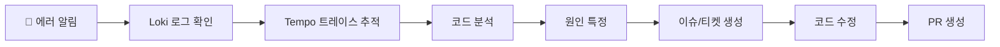
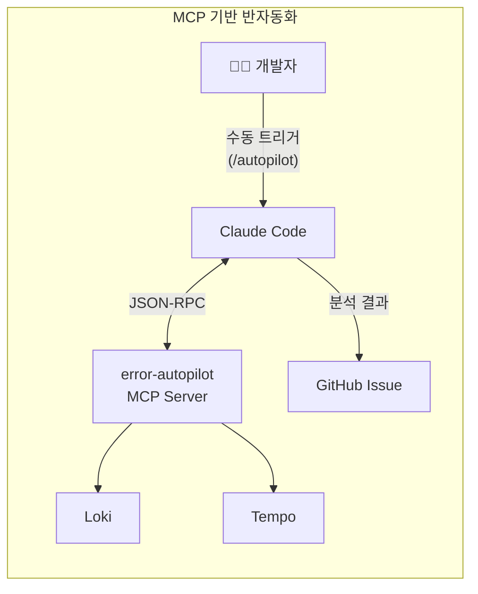
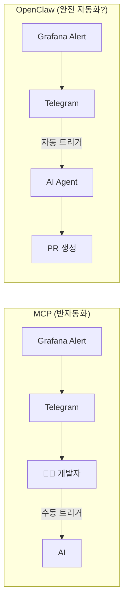
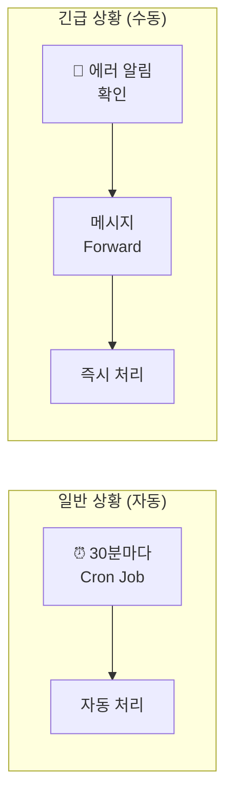
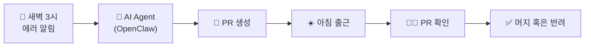
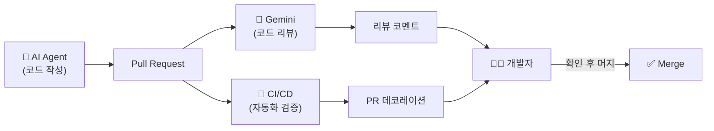

안녕하세요. 프롭테크 플랫폼에서 백엔드 개발자로 근무 중인 3년차 백엔드 개발자 정정일입니다.

> **TL;DR**<br>
> 새벽 에러 알림 대응을 OpenClaw로 자동화했습니다.<br> 
> Loki/Tempo 폴링 + 텔레그램 Forward 하이브리드 방식으로 AI가 에러 분석부터 PR 생성까지 처리하고, 사람은 코드리뷰만 합니다.

요즘 AI Agent가 개발자들의 협업 방식에서 점점 중심이 되어가고 있는 것 같습니다.

커뮤니티를 살펴보면, 핫한 키워드는 전부 AI, AI Agent 등과 관련되어 있더라구요. [GitHub의 2024년 개발자 조사](https://github.blog/news-insights/research/survey-ai-wave-grows/)에 따르면, 미국·브라질·인도·독일 2,000명의 개발자 중 **97% 이상이 AI 코딩 도구를 사용한 경험**이 있다고 답했고, 조직 차원에서도 **59~88%** 가 AI 도구 사용을 허용하거나 적극 장려하고 있다고 합니다.

기존에는 보안, 프라이버시, 정확성 문제 때문에 AI 도구 도입을 꺼리는 회사들도 많았는데, 이제는 GitHub Copilot, Claude Code 같은 AI Agent를 도입하는 회사들도 점점 늘어나고 있는 것 같습니다. 이제 AI는 단순히 "코드 자동완성" 수준을 넘어서, **자율적으로 파일을 읽고, 명령어를 실행하고, 코드를 수정하고, PR을 올리는** 수준까지 왔습니다.

이런 상황에서 어떻게하면 반복 작업들을 AI에게 맡기고, 더 중요한 일에 집중할 수 있을까 고민하게 되더라구요.

이 글에서는 제가 어떻게 매일 겪는 **에러 알림 대응 작업**을 AI 에이전트를 활용해 **자동화**했는지 이야기해보려 합니다.

## 서비스 운영 개발자의 일상: 에러 알림과 씨름하기

서비스를 운영하는 개발자라면 새벽 3시, 오후 7시, 아침 10시 등 언제나 불규칙적으로 휴대폰이 울리는 경험, 다들 한 번쯤은 겪어보셨을 겁니다.

```
🚨 legacy-service - ERROR LOG!!! is Firing
Description: Pls Check it ASAP
```

이 알림이 오게 되면 눈 비비며 노트북을 켜고, Grafana 대시보드를 열고, Loki에서 에러 로그를 뒤지고, trace_id를 찾아 Tempo에서 요청 흐름을 추적하고, 코드베이스에서 해당 부분을 찾아 원인을 분석하게 됩니다.



**30분에서 1시간.** 단순 버그라도 이 정도는 걸리게 됩니다. 복잡한 케이스면 훨씬 더 걸릴 수도 있겠죠.

이런 과정은 서비스를 운영하는 개발자라면 누구나 하는 작업이지 않을까 싶습니다. 회사마다, 서비스마다 조금씩 도구나 템플릿은 다르겠지만 큰 틀은 비슷하죠.

그렇다면 이 과정을 **AI가 대신하게 할 수 있지 않을까?**

매번 똑같은 패턴으로 에러를 처리하다 보니 이런 생각이 들었습니다. 로그 확인, 트레이스 추적, 코드 분석... 이런 단계들은 정형화되어 있습니다. 그렇다면 AI에게 시킬 수 있지 않을까? 이 질문에서 모든 과정이 시작되었습니다.

## 과제 정의하기

우선 제가 평소에 하던 작업을 쪼개봤습니다. 어떻게 자동화할 수 있을지 알려면 먼저 뭘 하는지 알아야 하니까요.

먼저 **에러 로그가 오면 확인합니다.**

여기서 "확인"은 두 가지 의미를 포함합니다. 에러 Alert이 오면 이를 **인지**하고, Loki/Tempo에서 관련 로그와 트레이스를 **조회**해 파악할 수 있어야 한다는 거죠.

또 에러 로그를 기반으로 코드베이스를 탐색해 **원인 분석**을 하고 **에러 지점을 특정**할 수 있어야 합니다. 문제는 저희 회사 서비스는 마이크로서비스 아키텍처로 구성되어 있어서, 에러가 발생한 서비스뿐만 아니라 연관된 다른 서비스들도 함께 살펴봐야 할 때가 많다는 점입니다.

그리고 나아가, **이슈/티켓 생성 → 코드 수정 → PR 생성**까지 해야하죠.

그렇다면 AI가 저 대신 모든 작업을 마치기 위한 과제를 정리하면 이렇습니다.

1. 에러 인지
2. 로그/트레이스 조회
3. 원인 분석 및 에러 지점 특정
4. 이슈/티켓 생성
5. 코드 수정
6. PR 생성

## 첫 번째 시도: MCP로 반자동화

그래서 처음에는 MCP(Model Context Protocol)를 사용해서 **[error-autopilot](https://github.com/12OneTwo12/error-autopilot-mcp)** 이라는 도구를 만들었습니다.



MCP 서버가 Loki/Tempo API를 호출해 로그를 조회하는 도구였습니다. 개발자가 Agent에게 `/autopilot` 명령어를 치면, MCP 서버가 Loki/Tempo에서 에러 로그와 트레이스를 조회해 분석합니다.

이를 통해 **로그 조회 및 트레이스 분석**은 가능해졌습니다. 그렇다면 어떻게 세번째 과제인 **원인 분석 및 에러 지점 특정**을 할 수 있을까요?

저는 조금 무식한 방법을 사용했습니다. 어차피 나만 사용할 MCP였으니 로컬에 이미 가지고 있는 코드베이스를 Claude Code가 읽도록 한 거죠.

MCP Skills 기능을 활용해 에러로그를 확인하고 나면 탐색해야 할 서비스들의 코드베이스 경로를 매핑해뒀습니다. 이렇게 되면 마이크로서비스 아키텍처라도 관련된 서비스들의 코드를 모두 읽을 수 있었습니다.

APM인 Tempo를 통해 관련 서비스들을 파악하고, 미리 매핑해둔 코드베이스 경로를 통해 코드를 읽고 분석하는 방식이었습니다.

```markdown
| 서비스명 | 로컬 코드베이스 경로 | GitHub 리포 |
|---------|----------------|-------------|
| example-user-service | /Users/jeongjeong-il/Desktop/projects/example-user-service | 12OneTwo12/example-user-service |
| example-order-service | /Users/jeongjeong-il/Desktop/projects/example-order-service | 12OneTwo12/example-order-service |
```

코드베이스를 분석하고 원인을 특정하면 GitHub 이슈를 만들어주는 방식이었습니다.

꽤 유용했습니다. 로그 뒤지는 시간이 확 줄었거든요.

### MCP Action Screen

|                       Triger                        |                        Action                        |                        Result                        | Created ISSUE |
| :----------------------------------------------------------: | :----------------------------------------------------------: | :----------------------------------------------------------: | :----------------------------------------------------------: |
|  |  |  |  |

### 하지만 한계가 명확했습니다

사용하면서 점점 아쉬운 부분이 보이기 시작했습니다. 문제는 **수동 트리거**였습니다.

알림이 오면 제가 직접 `/autopilot` 명령어를 치거나 "에러 로그 확인해봐"와 같은 질의를 명령해야 했습니다. 로그 조회와 분석은 자동화됐지만, **시작은 여전히 제 손으로** 해야 했죠.

**6가지 과제 중 첫 번째인 "에러 인지" 부분이 자동화되지 않은 겁니다.**

진짜 자동화라고 하기엔 뭔가 부족했습니다. 이건 "반"자동화였습니다. 완전 자동화를 위해서는 에러가 발생했을 때 AI가 스스로 인지하고 시작할 수 있어야 했습니다.

## OpenClaw 발견: Notification을 트리거로

그러다 개발자 커뮤니티 최근 굉장히 뜨거운 주제인 [OpenClaw](https://github.com/openclaw/openclaw)를 발견했습니다.

OpenClaw란 최근 화두가 되고 있는 오픈소스로 로컬 환경에서 실행되어 사용자의 쉘·파일 시스템 접근권한과 컴퓨터 제어 능력을 갖춘 LLM 기반 개인 비서입니다.

쉽게 생각하면 "내 컴퓨터에 설치된 AI 비서"라고 할 수 있죠. 그러면 지금까지 AI Agent와 뭐가 다른 걸까요? Clade Code 같은 AI Agent도 로컬에서 실행되잖아요? 쉘, 파일 시스템 접근권한도 있고요.

OpenClaw의 진짜 차별점은 **24시간 대기 상태로 텔레그램, 슬랙, 디스코드 등에서 오는 메시지를 실시간으로 감지**한다는 점입니다 (로컬이 계속 켜져있다는 가정하에).

```
Telegram ──┐
WhatsApp ──┤
Slack    ──┼──▶ [ Gateway ] ──▶ AI 모델 (Claude/OpenAI)
Discord  ──┤         │
웹 UI    ───┘         ▼
                 파일, 브라우저,
                 명령어 실행 등
```

- **Gateway**: 모든 채널 연결을 관리하는 중앙 프로세스
- **Workspace**: AI 에이전트의 "집" (`~/.openclaw/workspace/`)
- **Skills**: 워크플로우를 마크다운으로 정의

기존 Agent들은 제가 명령어를 쳐야 AI가 반응했습니다. 하지만 OpenClaw는 **메시지가 오면 AI가 자동으로 반응**합니다. 

여기서 눈치채신 분들도 있겠지만, 이렇게 되면 **에러 알림 → AI 에이전트 자동 분석 → PR 생성**까지 완전 자동화가 가능해질 거라 판단했습니다.



이렇게 구성해두면 Grafana Alert에 의해 특정 메신저에 Alert이 오면 **그 메시지 자체가 트리거**가 되고 사람이 개입하지 않아도 에이전트가 알아서 분석을 시작하고, 코드를 수정하고, PR까지 올릴 수 있게 될거라 생각했습니다.

## 구현 시도: Grafana Alert를 트리거로

바로 구현에 들어갔습니다. OpenClaw로 어떻게 error-autopilot을 만들었는지 핵심만 정리하면 이렇습니다.

우선 `~/.openclaw/workspace/` 에 페르소나를 정의해줍니다. 

Openclaw는 처음 키면 본인의 이름이나 페르소나를 정의해달라고 요청합니다. 


정체성을 정의하면 다음 파일들을 자동으로 생성해줍니다. 저는 Son of Victor라는 이름을 붙여줬습니다. 미국 드라마 Silicon Valley에 나오는 AI 이름 Son of Anton에서 따온 이름입니다. ㅎㅎ

```
~/.openclaw/workspace/
├── SOUL.md        # 성격과 말투
├── USER.md        # 사용자 정보
├── IDENTITY.md    # 이름과 정체성
├── BOOTSTRAP.md   # 최초 실행 시 읽고 삭제
├── MEMORY.md      # 장기 기억
├── memory/        # 일별 메모
└── skills/        # 워크플로우 정의
```


이렇게 기본적인 셋업이 끝나면, 다음으로는 **메시지를 받을 채널 설정**과 **에러 자동 분석 Skill 정의**를 했습니다.

먼제 기존에 회사에서 운영 중인 Grafana Alert가 텔레그램으로 통해 전송되도록 설정돼 있기때문에 OpenClaw를 위한 텔레그램 봇을 하나 만들고 OpenClaw에 연결했습니다.

### 1. 텔레그램 채널 설정

텔레그램에 Grafana Alert 전용 그룹도 OpenClaw에 연결해줬습니다.

```json
{
  "channels": {
    "telegram": {
      "groups": {
        "-100XXXXXXXXXX": {
          "enabled": true,
          "requireMention": false
        },
        "-100YYYYYYYYYY": {
          "enabled": true,
          "requireMention": false
        }
      }
    }
  }
}
```

`requireMention: false`를 설정하면 그룹에 메시지가 오는 순간, 멘션 없이도 OpenClaw가 바로 반응합니다.

계획은 생각보다 간단했습니다.

1. Grafana가 텔레그램 그룹에 에러 알림 전송
2. OpenClaw가 메시지 감지
3. 자동으로 error-autopilot Skill 실행
4. 에러 원인 파악 및 이슈생성, PR 생성

### 2. Skill 정의

OpenClaw에서는 워크플로우를 **마크다운 문서(Skill)** 로 정의합니다.

MCP처럼 TypeScript로 서버를 만들 필요가 없습니다. 마크다운 파일 하나면 됩니다.

```markdown
# Error Autopilot Skill

## Trigger
- Cron Job (30분마다 자동 실행)
- 또는 사람이 텔레그램에서 메시지 Forward

## Workflow

### 1. Fetch logs from Loki and Tempo
# 마지막 체크 시간 이후의 에러 조회
START_TIME=$(jq -r '.lastCheckTime.dev' memory/error-autopilot-state.json)

# DEV 환경
curl -s "https://example.com/loki/loki/api/v1/query_range" \
  -H "X-Scope-OrgID: default" \
  --data-urlencode 'query={deployment_environment="dev"} |~ "error|ERROR" | level=~"error|ERROR"' \
  --data-urlencode "start=${START_TIME}000000" \
  --data-urlencode "end=$(date +%s)000000000" \
  --data-urlencode "limit=20"


새 에러 발견 시:
1. trace_id 추출
2. 이미 처리된 trace_id인지 확인 (`processedTraceIds`)
3. 새 에러면 분석 시작

### 1단계: 에러 파싱
- 로그에서 서비스명, trace_id, 에러 메시지 추출
- 환경 확인 (dev/prod)

### 2단계: Tempo 트레이스 조회 (필수!)
⚠️ **이 단계를 건너뛰지 마세요!** Loki 로그만 보고 추측하면 안 됩니다.

#### 개발 환경
curl -s "https://dev.example.com/tempo/api/traces/${TRACE_ID}" \
  -H "X-Scope-OrgID: default"

##### 운영 환경
curl -s "https://prod.example.com/tempo/api/traces/${TRACE_ID}" \
  -H "X-Scope-OrgID: default"

### 2. Analyze codebase
서비스 매핑을 통한 로컬 코드베이스에서 에러 발생 지점 찾기

| Service | Local Path | GitHub Repo |
|---------|-----------|-------------|
| example-user-service | /path/to/example-user | 12OneTwo12/example-user-service |

### 3. Create GitHub Issue
gh CLI로 이슈 생성

### 4. Decide on auto-fix
**자동 수정 금지 조건:**
- 비즈니스 로직 관련
- 여러 파일 수정 필요
- 보안 관련
- 불확실한 경우

**자동 수정 가능:**
- 단순 NPE (명확한 null 체크 위치)
- 명백한 validation 누락
- 오타나 설정 오류

### 5. Create PR (if approved)
브랜치 생성 → 코드 수정 → 커밋 & 푸시 → PR 생성
```

AI가 이 가이드를 읽고 단계별로 실행합니다.

## 테스트: 예상대로 동작하는지 확인

이렇게 설정을 마치고 테스트를 해봤습니다. 간단한 유효성 검사 실패 예외를 발생시키고 텔레그램 그룹에 직접 메시지를 발생했죠.

```
🚨 chat-service - ERROR LOG!!!
Description: Pls Check it ASAP
```

**OpenClaw가 즉시 반응했습니다.** Loki를 조회하고, 코드를 분석하고, GitHub 이슈를 만들고 원인을 특정해 PR까지 생성했습니다.


테스트 환경에서는 정상적으로 동작했습니다. 이제 실제 에러가 발생했을 때 어떻게 동작하는지 확인할 차례였습니다.

## 실전: 텔레그램 봇 API의 제약

며칠 뒤, 실제로 에러가 발생했습니다.

텔레그램에 다음과 같은 Grafana 예외 알림이 왔습니다.
```
🚨 legacy-service - ERROR LOG!!! is Firing
Description: Pls Check it ASAP
```

그런데 **Son of Victor(OpenClaw)가 반응하지 않았습니다.**

테스트에서는 분명히 작동했는데, 실제 환경에서는 왜 안 되는 걸까요? 설정을 다시 확인했습니다. 문제없었습니다. OpenClaw 로그를 열어봤습니다. 아무 메시지도 받지 못한 상태였습니다.

테스트 환경과 실제 환경의 차이를 하나하나 따져보기 시작했습니다. 메시지 포맷도 같고, 텔레그램 그룹 ID도 같고... 발신자가 다르다는 것밖에 차이가 없었습니다.

### 문제 발견: 텔레그램 봇 간 통신 제약

문서를 찾아보니 원인을 알 수 있었습니다.

**텔레그램 Bot API는 다른 봇이 보낸 메시지를 받을 수 없었습니다.**

```
Grafana Bot --[메시지 전송]--> Telegram Group
                                      ↓
                          OpenClaw Bot (수신 불가 ❌)

사람 --[메시지 전송]--> Telegram Group
                              ↓
                  OpenClaw Bot (수신 가능 ✅)
```

제가 보낸 테스트 메시지는 "사람"이 보낸 거라 작동했고, Grafana 봇이 보낸 실제 알림은 "봇"이 보낸 거라 작동하지 않았던 겁니다.

[텔레그램 봇 API 공식 문서](https://core.telegram.org/bots/api#available-types)를 확인해보니, 이는 의도된 보안 정책이었습니다. 봇 간 무한 루프나 스팸을 방지하기 위한 설계였죠. 보안 정책상 당연한 선택이지만, 제 계획에는 꽤나 위협적이였습니다.

---

## 해결 방안 고민: 실시간 vs 폴링

텔레그램 트리거가 막혔으니, 다른 방법을 찾아야 했습니다. Slack과 Discord도 확인해봤지만 비슷한 제약이 있었습니다. Slack은 프레임워크가 봇 메시지를 필터링하고, Discord는 봇 간 통신 자체가 제한됩니다. 다른 메신저로 바꾸는 건 근본적인 해결책이 아니었습니다.

크게 두 가지 접근 방식이 있었습니다.

**1. Webhook 방식 (실시간)**
Grafana가 에러 발생 시 직접 webhook을 보내는 방식입니다. Grafana Contact points에 OpenClaw webhook endpoint를 추가하는거죠. 이를 위해서는 **Tailscale Funnel**를 통해 로컬 환경을 외부에 노출하거나 AWS Lambda, Cloud Run 등에 **Cloud 배포**하는 방식을 선택해야했습니다.

**2. Polling 방식 (지연)**
주기적으로 Loki/Tempo를 직접 조회하는 방식입니다. CronJob과 같은 형태로 말이죠.

하지만 실시간 트리거가 정말 필요한지부터 고민했습니다. 새벽 3시에 에러가 나도 어차피 아침에 확인할 텐데, 실시간성을 꼭 고집해야할까 싶었습니다.

두 가지 방식을 비교해봤습니다.

| 방식 | 응답 속도             | 비용 | 보안 | 구현 난이도 |
|------|-------------------|------|------|-------------|
| **Polling** | Cron 시간에 따른 지연 | 무료 | 안전 | 낮음 |
| **Webhook + Tailscale Funnel** | 실시간               | 무료 | 외부 노출 위험 | 중간 |
| **Webhook + Cloud 배포** | 실시간               | $5-20/월 | 관리 필요 | 높음 |

**Polling 방식**
- Cron 시간마다 Loki/Tempo를 직접 확인
- 새 에러 발견 시 처리 시작
- 외부 노출 없음, 로컬에서 안전하게 실행

**Webhook + Tailscale Funnel**
- Grafana webhook을 받기 위해 로컬 환경을 인터넷에 노출
- 실시간 트리거 가능하지만 보안 위험
- [Tailscale Funnel](https://tailscale.com/kb/1223/tailscale-funnel/)로 로컬을 노출하면 편리하지만, OpenClaw가 공개 인터넷에 접근 가능해지면서 악의적인 webhook 요청을 통한 Prompt injection이나 무차별 API 호출 등의 위험이 있습니다.

**Webhook + Cloud 배포**
- Grafana webhook을 받을 서버를 클라우드에 배포
- 실시간 트리거 가능하지만 비용 발생
- 인프라 관리 및 보안 설정 필요

### Polling 방식 선택

우선 Tailscale Funnel방식은 보안 위험이 컸습니다. Prompt Injection, 토큰 무차별 대입, DDoS 공격 등 다양한 위협에 노출될 수 있었기에 제외하고 생각했습니다.

남은 방법은 Cloud 배포를 하거나 Polling 방식이었습니다. 굳이 실시간성이 필요하진 않겠다 싶어 비용과 관리 측면도 생각해 저는 **Polling 방식을 선택**했습니다.

## 최종 구현: Cron Job으로 주기 체크

Polling 방식으로 결정했으니, 이제 어떻게 구현할지 고민해야 했습니다.

OpenClaw 문서를 살펴보니 주기적 작업 실행을 위해 두 가지 방법을 제공하고 있었습니다.

### 구현 방식 비교

**1. Heartbeat (OpenClaw 내장)**

메인 프로세스가 스스로 깨어나는 방식입니다.

```json
// agents.json
{
  "agents": {
    "defaults": {
      "heartbeat": {
        "intervalMs": 1800000  // 30분
      }
    }
  }
}
```

장점은 설정이 간단하고 OpenClaw 프로세스 내에서 관리된다는 점입니다.

단점은 OpenClaw 프로세스가 종료되면 함께 멈추고 로컬 PC 재부팅 시 수동으로 재시작 필요하다는 점이였습니다.

**2. Cron Job (외부 스케줄러)**

Cron Job 방식은 외부의 독립적인 알람이 깨워주는 방식입니다.

```bash
# OpenClaw cron 설정
cron add --schedule "*/30 * * * *" --task "Loki에서 에러 체크하고 error-autopilot 실행"
```

장점은 OpenClaw 메인 세션이 죽어도 Cron Job은 살아서 계속 실행되고 격리된 세션에서 독립적으로 동작하기 때문에 좀 더 안정적이다고 할 수 있을 것 같습니다.

단점은 설정이 조금 더 복잡해지고 별도의 Cron Job 관리 필요합니다. 다만 OpenClaw는 UI로도 Cron Job을 관리하는 기능을 제공해주기 때문에 크게 어렵진 않았습니다.

### 선택 근거

처음에는 Heartbeat가 간단해 보여서 매력적이었습니다. 설정 몇 줄이면 끝나니까요.

하지만 로컬 PC에서 돌릴 거라는 점이 걸렸습니다. 실수로 OpenClaw를 종료하면 어떻게 될까요? Heartbeat도 함께 멈춥니다. 그럼 자동화가 의미 없어지죠.

그래서 **Cron Job을 선택했습니다.** 조금 복잡하지만, OpenClaw 프로세스와 독립적으로 실행되니 더 안정적이었습니다. 그리고 Cron 주기를 30분으로 설정해 30분마다 에러를 체크하도록 했습니다.

너무 자주 Cron을 돌리게 되면 토큰 비용이 많이 들 수 있기 때문에 30분 주기가 적절하다고 판단했습니다.

그런데 30분 지연이 여전히 찝찝하기도 했습니다. 완전 자동화라고 하기엔 뭔가 부족한 느낌이었죠. 고민 끝에 **하이브리드 방식**으로도 가능하겠다 싶었습니다.




**일반 상황**: 30분마다 자동으로 폴링해서 처리
**긴급 상황**: 텔레그램 그룹에서 메시지를 Forward하면 즉시 처리

### 텔레그램 Forward 메커니즘

텔레그램은 봇 간 메시지를 차단하는 보안 정책이 있습니다. Grafana 봇이 보낸 메시지를 OpenClaw 봇이 직접 받을 수 없죠.

그런데 **봇이 보낸 메시지를 '사람이' Forward하면?**

텔레그램 입장에서는 그게 사람이 보낸 메시지가 됩니다. 결국 OpenClaw가 받을 수 있는 거죠.

```
Grafana Bot → [🚨 에러!] → 텔레그램 그룹
                                ↓
                           사람이 Forward
                                ↓
                           OpenClaw Bot ✅ 수신 가능
```

[텔레그램 봇 API 공식 문서](https://core.telegram.org/bots/api#message)를 확인해보면, Forward된 메시지는 `forward_from` 필드를 가지지만 메시지의 발신자는 Forward를 실행한 사람이 됩니다. 즉, 봇 간 통신 차단 정책을 우회하는 것이 아니라, **사람의 명시적인 액션이 개입되었기 때문에 정상적인 사용 사례로 간주**되는 것입니다.

이렇게 되면 일반 상황에서는 30분 폴링으로 자동 처리돼 비용 효율적이고 보안을 지키면서, 긴급 상황에서는 사람이 Forward로 즉시 처리를 요청할 수 있습니다.

### 실제 동작 시나리오

**시나리오 1: 자동 처리 (일반적인 경우)**
새벽 3시 DEV 환경에서 에러가 발생하면:
- **3:00** - Grafana가 텔레그램으로 알림 (사람에게 즉시 알림)
- **3:30** - Cron Job이 Loki에서 새 에러 감지
- **3:35** - OpenClaw가 분석 완료, PR 생성
- **3:36** - DEV 텔레그램 그룹(-100XXXXXXXXXX)에 처리 결과 전송
- **9:00** - 아침 출근, PR 확인 및 머지

**시나리오 2: 수동 트리거 (긴급한 경우)**
운영 환경에서 급한 에러가 발생하면:
- **10:15** - Grafana 알림 확인
- **10:16** - 텔레그램에서 메시지 Forward
- **10:17** - OpenClaw가 즉시 처리 시작
- **10:22** - 분석 완료, PR 생성
- **10:23** - PROD 텔레그램 그룹(-100YYYYYYYYYY)에 결과 전송

DEV/PROD 환경 모두 동일하게 작동하며, 30분 지연은 대부분의 경우 충분했습니다. 급한 에러는 Forward로 즉시 처리할 수 있고, AI 분석은 백그라운드에서 진행됩니다.

**제가 자고 있어도**, **회의 중이어도**, **출근 전이어도** AI가 알아서 분석하고 PR을 만들어 둡니다.

---

## 자동화 달성

이렇게 해서 **자동화**를 달성했습니다.



새벽 3시에 알림이 와도, 아침에 출근하면 이미
- 에러 분석이 끝나있고
- 이슈가 생성되어 있고
- 코드 수정이 되어 있고
- PR까지 올라와 있습니다

**저는 이슈와 PR을 확인하고 분석해 머지할지 반려할지 결정만 하면 됩니다.**

앞서 정의한 6가지 과제가 전부 자동화됐습니다.

| 과제 | MCP (반자동화) | OpenClaw (완전 자동화) |
|------|---------------|---------------------|
| 1. 에러 인지 | ❌ 수동 트리거 | ✅ Cron Job 자동 폴링 |
| 2. 로그/트레이스 조회 | ✅ | ✅ |
| 3. 원인 분석 | ✅ | ✅ |
| 4. 이슈 생성 | ✅ | ✅ |
| 5. 코드 수정 | ❌ | ✅ |
| 6. PR 생성 | ❌ | ✅ |

## 맹신은 금물: PR 코드리뷰는 필수

이렇게 자동화가 되니 정말 편리해진건 맞습니다. 그렇지만 절대 전적인 신뢰를 줘서는 안된다고 생각합니다.

사람도 그렇지만 **AI역시 당연히 틀릴 수 있습니다. 잘못된 분석을 할 수 있고, 부적절한 수정을 제안할 수 있습니다.** 

그렇기 때문에 사람의 개입이 반드시 필요하다고 생각합니다. 그래서 저는 **코드리뷰 프로세스를 반드시 거치도록** 설정했습니다.

저는 AI가 만든 코드도 반드시 검증 과정을 거치도록 Multi-agent 리뷰 시스템을 구축해뒀습니다. ([이전 글]() 참고)



**PR이 올라가면 자동으로**

1. **Gemini Assistant**가 코드리뷰 코멘트 작성
2. **CI/CD 도구들**이 검증 (Jacoco, Detekt, ArchUnit, reviewDog)


Claude가 놓친 부분을 Gemini가 잡아주고, Gemini가 놓친 부분을 자동화 도구들이 잡아줍니다. [AgentCoder 연구(2024)](https://arxiv.org/html/2312.13010v2)처럼 Multi-agent 교차검증이 효과적이더라구요.

## Before & After

자동화 전과 후를 비교하면 기존에는 직접 로그를 보고, 트레이스를 확인하고, 코드를 분석하고, 이슈를 만들고, 코드를 수정하고, PR을 만드는 모든 과정을 제가 직접 했습니다.

새벽에 놓친 알림이 있다면 아침에 출근해서 확인해야했죠. 하지만 이제는 아침에 출근하면 새벽에 Son of Victor(OpenClaw)가 분석해놓은 이슈와 PR을 확인하고 잘했는지 검토만 하면 됩니다.

물론 한계도 있었습니다.

**잘 작동하는 케이스**
- NPE, 타입 오류 같은 단순 버그
- 패턴이 명확한 반복 에러
- 로그만 봐도 원인이 뻔한 경우

**어려운 케이스**
- 복잡한 비즈니스 로직 버그
- 동시성/레이스 컨디션 문제
- 보안 관련 이슈 (자동 수정 위험)

그래서 저는 **"자동 수정"보다 "자동 분석 + 이슈 생성"에 더 가치**를 두고 있습니다. AI가 초기 분석을 해두면, 사람은 검토하고 판단하는 역할에 집중할 수 있거든요.

## 주의사항: 이것만은 알고 쓰자

OpenClaw가 편리한 건 맞지만, **주의해야 할 점들**도 분명히 있습니다.

### 1. 보안 이슈

OpenClaw 에이전트는 **코드베이스, GitHub 토큰, API 키 등에 접근**할 수 있습니다. 편리한 만큼 위험하기도 합니다.

- **민감정보 노출**: `.env` 파일이나 시크릿이 AI 컨텍스트에 들어갈 수 있음
- **GitHub 토큰 권한**: PR 생성, 브랜치 생성 권한이 있으면 악용 가능성
- **프롬프트 인젝션**: 에러 로그에 악의적인 내용이 포함되면 AI가 의도치 않은 동작을 할 수도

저는 **별도의 서비스 계정**을 만들어서 최소 권한만 부여했습니다. 안전장치는 여러 겹 둘수록 좋다고 생각합니다.

### 2. 비용

매번 알림이 올 때마다 **LLM API 호출**이 발생합니다. Claude API 비용이 만만치 않거든요.

- 알림이 자주 오는 서비스라면 비용이 급격히 늘어날 수 있음
- 특히 코드 분석까지 하면 토큰 소모가 큼

그렇기 때문에 주기를 적절히 설정해야 Token Limit에 걸리지 않고, 비용도 감당할 수 있습니다.

### 3. 잘못된 수정 위험

AI가 분석을 잘못하면, **오히려 더 큰 버그**를 만들 수 있습니다.

- 단순 NPE를 고치려다 비즈니스 로직을 망가뜨릴 수도
- 테스트가 없는 코드베이스라면 더 위험

그래서 **자동 머지는 절대 안 하고**, 반드시 사람이 리뷰 후 머지합니다. 앞서 말한 Gemini 코드리뷰 + 자동화 도구들도 이런 이유로 붙여둔 겁니다.

### 4. 아직 제대로 검증되지 않음

마지막으로 제가 가장 중요하게 생각하는 부분인데 AI 생태계가 빠르게 발전하면서 하루하루 새로운 툴이 나오고 유행이 바뀌며 생각하지 않았던 문제가 발생할 수 있습니다.

어제는 oh-my-opencode가 유행이더니 오늘은 OpenClaw가 뜨고, 내일은 또 뭐가 뜰지 아무도 모릅니다. 이처럼 빠르게 진화하는 환경에서 툴의 등장과 발전이 너무 빠르기 때문에, 초기단계의 툴에 어떤 버그가 있을지 아무도 알수가 없습니다.

OpenClaw도 아직 초기 단계라, **예기치 않은 버그나 변경**이 있을 수 있습니다.

어떤 심각한 문제가 발생할지 아무도 예측할 수 없으니 조심 또 조심해야 한다고 생각합니다.

### 그런데 왜 리스크를 안고 도입했나?

그렇다면 이렇게 여쭤보실 수도 있을 것 같습니다. 조심해야한다면서 왜 회사에 도입했냐고요. 

솔직히 말씀드리면 맞는 말씀이라고 생각합니다. 아무래도 초기 단계 툴이라 리스크가 있으니까요. 

솔직한 이유를 말씀드리자면 현재 저희 회사는 기존에 5명이던 개발팀에서 회사 경영난으로 프론트 1명, 백엔드 1명 이렇게 인원이 감축됐습니다.

그중 혼자 남은 백엔드 개발자가 제가 됐는데 그렇다보니 할 일이 생각보다 너무 많아졌습니다. 

또 스타트업이다 보니 신규채용에 들어가는 비용보다 더 경제적인 AI를 적극 도입하기로 회사차원에서 결정을 하게 됐습니다.

그러니 너그러히 봐주셨으면 좋겠습니다.

## 마무리: 개발자의 미래

이번 작업을 하면서 느낀 건, **AI가 "도와주는 도구"에서 "위임할 수 있는 동료"로 진화하고 있다**는 점입니다.

예전에는 AI에게 질문하고 답을 받았습니다. 지금은 **AI에게 일을 시켜놓고 결과물을 받습니다.** 그것도 코드 리뷰가 가능한 형태(PR)로요. AI가 할 수 있는 일의 범위가 점점 넓어지고 있다는 걸 체감하게 됩니다.

아직은 단순한 작업에 한정되지만, **이 방향이 계속된다면 개발자의 역할은 어떻게 바뀔까요?** 이게 무섭기도 하고 흥미롭기도 합니다.

감히 추측하건데 앞으로 개발자의 역할은 점점 더 **고차원적이고 전략적인 업무**로 이동할 것 같습니다.

코드를 직접 짜는 일은 AI에게 맡기고, 개발자는 **작업을 리뷰하고 자동화 하며 의사결정에 치중하는** 식으로요.

시스템 설계와 아키텍처에 더 많은 시간을 쓰고, 반복적인 작업은 AI가 처리하게 되는 거죠. 

개발자들 입장에서 문제는 그렇다면 **내 일자리는 어떻게 될까?** 하는 점일 겁니다. 

고차원적이고 전략적인 업무는 아시다 싶이 인원이 적게 필요로 하니까요. 회사마다 시스템 아키텍처를 설계하고 의사결정을 내리는 인원은 지금도 한정적입니다. 그런분들만 필요로 하게 되면 제 일자리는 어떻게 되는건가 싶습니다. 어떻게 될지 기대도 되고 두렵기도 합니다.

부디 제가 직장을 잃지 않고 긍정적인 방향으로 흘러가길 바랍니다.

긴 글 읽어주셔서 감사합니다.

---

## 참고 자료

- [OpenClaw GitHub](https://github.com/openclaw/openclaw)
- [OpenClaw Documentation](https://docs.openclaw.ai)
- [error-autopilot MCP 저장소](https://github.com/12OneTwo12/error-autopilot-mcp)
- [GitHub 2024 Developer Survey: The AI wave continues to grow](https://github.blog/news-insights/research/survey-ai-wave-grows/)
- [Grafana Loki Documentation](https://grafana.com/docs/loki/latest/)
- [Grafana Tempo Documentation](https://grafana.com/docs/tempo/latest/)
- [Telegram Bot API Documentation](https://core.telegram.org/bots/api)
- [Tailscale Funnel Documentation](https://tailscale.com/kb/1223/tailscale-funnel/)
- [AgentCoder: Multiagent-Code Generation with Iterative Testing and Optimisation (2024)](https://arxiv.org/html/2312.13010v2)
